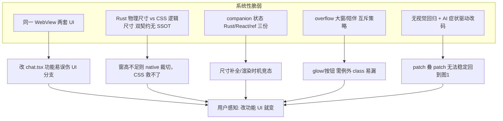

# 陪伴态 UI 反复变形 — 根因深度分析

> **文档性质**：架构与工程问题分析（非修复 PR）。  
> **背景**：开发者在改语音、路由、TTS 等功能代码时，右下角陪伴球 UI（Orb + IDLE +「语音输入」）频繁出现按钮消失、顶边裁切、元素重叠等问题；且每次 patch 后仍难稳定恢复。  
> **结论先行**：这不是单一 CSS bug，而是 **「同一窗口承载两套 UI + 跨 Rust/React/CSS 三套尺寸契约无 SSOT + AI 辅助改码的症状驱动叠补丁」** 共同造成的系统性脆弱。

---

## 一、陪伴态 UI 到底是什么

### 1.1 用户可见的「陪伴态」

陪伴态是 Omni 主聊天窗（`chat` WebView）在按 `Esc` 或系统最小化后，**缩成右下角小窗** 的交互形态，验收图（图1）如下：

```
┌─────────────────────┐
│      Jachin Orb     │  ← 132×132 CSS px + 外圈 glow / tick
│        IDLE         │  ← 状态字
│     [ 语音输入 ]     │  ← PTT 入口（最易丢失）
└─────────────────────┘
```

用户期望的「原样」：**纵向紧凑堆叠、Orb 完整无裁切、状态字居中、按钮在 IDLE 下方且始终可见可点击。**

### 1.2 实际代码里的渲染链路

```
tauri.conf.json        ← chat 窗初始 820×640，Esc 后 Rust set_size 为陪伴尺寸
       │
       ▼
chat.html              ← body / #chat-root overflow、max-height 规则（为大窗设计）
       │
       ▼
chat.tsx (2660+ 行)    ← companionMode ? OmniMiniSpark : 完整 Omni（同文件互斥）
       │
       ▼
OmniMiniSpark.tsx      ← 薄包装，仅转发 props
       │
       ▼
OrbWindow.tsx          ← 布局 + 拖拽区 + 语音按钮 + 快捷输入
       │
       ▼
JachinOrb.tsx          ← 132px 球体 + drop-shadow 动画（glow 会视觉溢出边框）
       ║
       ║  并行·不同语言·必须手动对齐
       ║
main.rs                ← CHAT_COMPANION_W/H、minimize/peek/reveal/dock
```

**关键事实**：用户看到的「一个球」背后至少有 **6 个文件、2 种运行时（Rust 窗口 + WebView）、3 处 overflow 策略** 同时生效，且没有任何自动化机制检查它们是否一致。

---

## 二、为什么「改功能代码」会连带把 UI 搞坏

### 2.1 功能与 UI 耦在同一棵组件树里

`chat.tsx` 同时承担以下五类职责：

| 职责 | 与陪伴 UI 的关系 |
|------|------------------|
| L3 会话、流式渲染 | 改消息/state 会触发整树 re-render |
| 语音 PTT / VAD / 陪伴 TTS | `onVoiceStart`、`voiceCompanionActiveRef` 写在 companion 分支内 |
| 意图路由 / fast lane | `companionModeRef \|\| voiceCompanionActiveRef` 散布多处 |
| 窗口模式切换 | `companionMode` state + 多处 `invoke` |
| 完整 Omni 大窗 UI | 与陪伴态**互斥**但**同文件** |

因此**改语音逻辑几乎必然 touch `chat.tsx`**，而陪伴态只是该文件里 `companionMode ? … : …` 的一个分支。没有物理隔离，功能改动很容易顺带改到 className、useEffect 顺序、条件渲染或 ref 语义。

### 2.2 陪伴态不是独立窗口，而是「大窗的缩略模式」

Rust 侧 `minimize_chat_to_companion` 做的是：

1. 记住当前外尺寸 → `CHAT_RESTORE_SIZE`
2. `set_min_size` / `set_size` 到 `CHAT_COMPANION_W × CHAT_COMPANION_H`
3. 定位到屏幕右下角 / dock / peek
4. `CHAT_COMPANION_MODE.store(true)` + `emit omni-companion-mode`

React 侧再监听事件，切 `companionMode`，渲染 `OrbWindow`。

**问题**：窗口实体始终是同一个 `chat` label；`chat.html` 的 `max-height: 100%`、`globals.css` 的 `#chat-root` 规则，都是为大窗设计的，陪伴态靠**额外例外**（`body.companion-mode`、`overflow: visible`）硬掰过来。任何一处例外漏改或改错，UI 就偏。

### 2.3 双端（Rust / React）双状态，易不同步

| 状态 | 存放位置 | 用途 |
|------|----------|------|
| `CHAT_COMPANION_MODE` | Rust `AtomicBool` | peek/reveal、wake 注入、窗口 API 守卫 |
| `companionMode` | React `useState` | 决定渲染 Orb 还是完整 Omni |
| `companionModeRef` | React ref | 语音链路里同步读 |
| `voiceCompanionActiveRef` | React ref | HUD 会话激活时即使未 Esc 也可能走陪伴 TTS |

代码里已有注释说明竞态：

- 启动时 `is_chat_companion_mode` 若慢于用户按 Esc，可能用 `false` 盖掉本地 `true`（`chat.tsx` 551–565 行用 `prev ? prev : v` 缓解，但仍是补丁思维）。
- 历史上 `ensure_companion_window_size` 曾要求 Rust 标志为真才补尺寸 → React 已进陪伴态但窗口仍是旧高度 → **按钮被 native 窗底裁切**。

改功能时若只动 React ref（如 `voiceCompanionActiveRef`）而不动 Rust 标志，会出现：**逻辑上在陪伴语音路径，UI 仍是大窗或尺寸不对**。

---

## 三、布局为何「看起来随机坏」— 四类根因

### 3.1 原生窗口硬裁切（最隐蔽、最致命）

Tauri 透明窗的 WebView **最终裁剪边界是 OS 窗口外框**，与 CSS `overflow: visible` 无关。

内容高度预算（约数，CSS 逻辑像素）：

| 块 | 约高度 |
|----|--------|
| `JachinOrb` | 132 px |
| Orb 外层 padding（上下各 8–12px） | 16–24 px |
| 状态字 + gap | ~24 px |
| 「语音输入」按钮 + 外层 margin | ~36 px |
| 根节点 py | ~24 px |
| **内容合计** | **~232–240 px** |
| glow / drop-shadow 视觉溢出（顶/底各约 10px） | 再 +20 px 观感 |
| **安全窗高下限** | **≥ 260 px**（逻辑像素）|

Rust 常量 `CHAT_COMPANION_H`（当前 304 物理像素，历史上 252→288→292→304…）必须与上述预算**手动对齐**。常量偏小或未执行 `set_size` 时：

- 若使用 `justify-center` 垂直居中整块内容 → **上下对称裁切** → 常见现象：**IDLE 还在，按钮没了**（与用户截图一致）。
- 若 glow 顶边贴窗 → **「顶上一条横线」**。

这就是为什么问题看起来像「CSS 乱了」，实际是 **窗口高度契约破了**。CSS 怎么改都救不了 native 裁切。

### 3.2 魔法数字多处复制，无 SSOT

与陪伴纵向布局相关的常数分散在：

| 文件 | 常数示例 | 修改时是否需要同步 |
|------|----------|-------------------|
| `main.rs` | `CHAT_COMPANION_H = 304`, `CHAT_COMPANION_MIN_H = 280` | 改 Orb 尺寸时必须 |
| `OrbWindow.tsx` | `COMPANION_VOICE_FOOTER_PX = 52`, `bottom-[52px]` | 改按钮高度时必须 |
| `JachinOrb.tsx` | `h-[132px] w-[132px]` | 改球体时必须同步 main.rs |
| `chat.html` | `#chat-root { max-height: 100% }` vs `.companion-mode` 覆盖 | 改大窗布局时需考虑陪伴 |

**没有任何单一模块声明「陪伴窗最小内容高度 = f(Orb, 按钮, padding)」**。改 Orb 尺寸或按钮 padding 时，开发者通常**不会**同步改 Rust 的 `CHAT_COMPANION_H`，回归必然发生。

### 3.3 拖拽层、pointer-events、z-index 叠加

`OrbWindow` 结构特点：

- 全窗或局部 `data-tauri-drag-region` 绝对定位层（`z-50`）
- 语音按钮需 `z-[60]` + `pointer-events-auto` + `data-tauri-drag-region="false"`
- 父级曾有 `pointer-events-none`，子级再打开

改布局时若：

- 拖拽层改回 `inset-0` 盖住按钮 → **能看不能点**，点击触发 expand 而非录音
- 按钮改成 absolute 叠在 IDLE 上 → **重叠**
- footer 高度与 drag `bottom` 不一致 → 交互区域错位

这类问题**与语音功能无关**，但修复语音时常会「顺手改拖拽/按钮层级」，引入新 regression。

### 3.4 overflow 策略在三层打架

| 层级 | 大窗默认 | 陪伴态期望 |
|------|----------|------------|
| `chat.html` body | `overflow: hidden` | `.companion-mode` → `visible` |
| `#chat-root` | `overflow: hidden; max-height: 100%` | 需 `max-height: none` |
| `chat.tsx` 根 div | `overflow-hidden` | `overflow-visible` |
| `OrbWindow` | 视各版本改动而异 | 影响是否裁 glow |

大窗需要 `overflow: hidden` 防止长对话把输入栏顶出视口；陪伴态需要可见 glow 和底栏按钮。两套需求**共用 `#chat-root`**，靠 class toggle 切换——**任何全局样式改动**（如改 `globals.css` 的 `#chat-root`）都可能只测大窗、不测陪伴态。

---

## 四、为什么「总是改不回来」

### 4.1 症状相同，根因不同

用户口语中的「按钮不见了」至少对应**四种完全不同的机制**：

| 现象 | 真实根因 | 错误修法（只治标）|
|------|----------|-------------------|
| 只有 Orb + IDLE，无按钮 | 窗高不足 + `justify-center` 裁切 | 改 Tailwind padding（无效） |
| 按钮与 IDLE 重叠 | absolute 定位 patch 未还原 | 再加 z-index（加剧） |
| Orb 顶上有横线 | glow 贴顶 + 窗高或 padding 不足 | 缩小 Orb scale（破坏圆的比例） |
| 完全是大窗 | `companionMode` false 或与 Rust 不同步 | 改 CSS（完全无关） |

历次修复往往**只针对当时截图的一种**，未验证其它 DPI / 是否重启 Rust / 是否 peek 半隐藏。下次改代码触发**另一种机制**，用户感受是「又坏了，而且 patch 无效」。

### 4.2 叠补丁文化（Patch-on-patch）

本次 session 中实际发生的 regression 链（典型案例）：

| 轮次 | 改了什么 | 触发问题 |
|------|----------|----------|
| 初始 | `justify-center` + `inset-0` 拖拽 | 按钮被裁，不见 |
| patch 1 | 增大 `CHAT_COMPANION_H` 到 292 | 顶边 glow 横线 |
| patch 2 | 加 `pt-3` 上移内容 | 按钮重新消失 |
| patch 3 | 加 `mt-2` + scale `0.94` | Orb 变形，比例失真 |
| patch 4 | 回退 + `absolute bottom-3` | 按钮与 IDLE 重叠（图2） |
| patch 5 | 按钮并回 flex flow | 无 `shrink-0` footer，按钮仍被挤走 |
| patch 6（当前） | flex footer + 重新调高度 304 | 基本稳定 |

每一步**局部合理**，但没有回归**「图1 验收标准」**的统一契约，文件 git diff 越来越复杂，**最终态反而比初始版更 fragile**。

### 4.3 热更新（HMR）与 Rust 常量脱节

| 改动类型 | 开发时是否即时生效 |
|----------|--------------------|
| `OrbWindow.tsx` / Tailwind class | Vite HMR，通常即时 |
| `main.rs` 中 `CHAT_COMPANION_H` 等常量 | **必须完整重启 Tauri 进程** |
| `chat.html` 内联样式 | 通常需要硬刷新 / 重启 WebView |

开发者改完 TS 看到「好像好了」，**未重启**则窗口仍是旧物理高度；再改 TS 只会越来越乱。这是本次 session 中多次「改了但无效」的直接原因。

### 4.4 AI 辅助改码放大了叠补丁问题（重点）

AI 辅助工具（包括本次 session）在处理「按钮不见了」这类问题时，结构性地倾向于：

1. **凭截图单症状下结论**：看到「IDLE 在，按钮没了」→ 推断布局问题 → 改 Tailwind，而实际是窗高问题。
2. **只改前端**：修改 `OrbWindow.tsx` 比改 `main.rs` 代价低，倾向于只改 CSS，不读 Rust 窗高常量。
3. **不强制重启验证**：热更新后看似好了，实为 Rust 旧高度掩盖，下一轮又暴露。
4. **「回退原样」与「新策略」混用**：同一个问题前后两次用互斥方案（`absolute footer` vs `flow footer`），后一次只保留一半结构，形成半吊子布局。
5. **每次 patch 生成完整替换代码**：每次重写 `OrbWindow` 时，若旧版有隐性约束（如 `pointer-events-none` 父层 + `pointer-events-auto` 子层），重写后这些约束悄悄丢失。

**核心矛盾**：AI 的修复能力受限于**单次 context**，而陪伴态 UI 的稳定性依赖**跨文件、跨语言、跨启动的全局约束**，两者天然错配。

### 4.5 缺少视觉回归与尺寸断言

当前没有：

- 陪伴态截图对比 / Playwright 像素测试
- 挂载时断言 `#chat-root scrollHeight ≤ window.innerHeight`
- CI 检查 `CHAT_COMPANION_H` 与 `OrbWindow` layout 常量关系

因此**任何 PR** 只要动到 `chat.tsx` 或窗口逻辑，都可能 silently break 陪伴态，reviewer 聚焦在「功能对不对」，不会自然点 Esc 看右下角。

### 4.6 `chat.tsx` 单体过大，审查边界模糊

`chat.tsx` 2600+ 行，陪伴分支约占一小段，但 import 增减、顶层 hook 顺序、re-render 优化、语音 state 交织，都可能导致 **Orb 分支意外卸载、AnimatePresence 闪断、或 effect cleanup 清掉 companion class**。大文件下「这次 diff 会不会影响陪伴 UI」无法一眼看出。

---

## 五、与「功能改动」的典型耦合路径（实例）

以下为**高概率触发 UI regression 的真实改法**（即便开发者「没打算改 UI」）：

### 路径 A：语音 / PTT

- 在 `onVoiceStart` 增加 await、打断、barge-in 逻辑 → 误改按钮外层结构或删除 `data-tauri-drag-region="false"`
- 调整 `voiceCompanionActiveRef` 置位时机 → 大窗路径与陪伴路径 UI 不一致
- Rust 新增 `companion_filter_owner_track_wav` 等 invoke → 仅测 STT，未 Esc 看 UI

### 路径 B：状态机 / Orb 状态

- `companionAiState` 依赖项增减 → 频繁重渲染，`framer-motion` 动画加剧 layout shift
- 修改 `hudOrbState` 与本地 state 优先级 → IDLE/LISTENING 文案变但布局 reflow

### 路径 C：全局样式

- 改 `globals.css` 的 `#chat-root`、`* { border }`、scrollbar
- 改 `chat.html` flex 策略（曾为大窗输入栏修复引入 `max-height: 100%`）

### 路径 D：窗口 / 托盘 / 唤醒

- `voice_wake_bridge` 调用 `minimize_chat_to_companion` → 尺寸对但 **peek 半藏**
- 多显示器 / DPI：`resolve_companion_outer_size_for_monitor` 在 `sf ≤ 1.05` 与 `sf > 1.05` 两套路不一致

### 路径 E：AI 辅助改码（本次 session 的直接触发路径）

- 根据「按钮不见了」单症状改 layout，未读 Rust 窗高常量
- 一次改 layout 策略（`justify-start`），同时改另一处（`absolute bottom`），两处互相干扰
- 只做 Tailwind 热更新验证，未重启 Tauri，误判「已修好」
- 同时存在「flow footer」与「absolute footer」两种互斥方案，被分次 merge 各留一半

---

## 六、冻结布局契约（所有魔法数字一览）

> **这是当前「图1 原样」对应的真实数字**，修改任何一处时必须同步检查所有关联项。

| 常量 | 当前值 | 文件 | 修改时需同步 |
|------|--------|------|-------------|
| `JachinOrb` 尺寸 | 132 × 132 px | `JachinOrb.tsx` L84 | `CHAT_COMPANION_H`（Rust） |
| `CHAT_COMPANION_W` | 248 物理像素 | `main.rs` L324 | — |
| `CHAT_COMPANION_H` | 304 物理像素 | `main.rs` L326 | Orb 尺寸、footer 高度 |
| `CHAT_COMPANION_MIN_H` | 280 物理像素 | `main.rs` L328 | 同上 |
| `COMPANION_VOICE_FOOTER_PX` | 52 px | `OrbWindow.tsx` L19 | drag `bottom` 值 |
| drag region `bottom` | 52 px | `OrbWindow.tsx` 拖拽层 style | `COMPANION_VOICE_FOOTER_PX` |
| 快捷输入框 `bottom` | 52 px（`bottom-[52px]`） | `OrbWindow.tsx` | `COMPANION_VOICE_FOOTER_PX` |
| Orb 外层 padding | `p-2` (~8px) | `OrbWindow.tsx` L126 | `CHAT_COMPANION_H` |
| 根节点顶部留白 | `pt-2` (~8px) | `OrbWindow.tsx` L124 | `CHAT_COMPANION_H` |
| DPI 缩放边界 | `sf ≤ 1.05` 用原始值，否则乘 sf | `main.rs` `resolve_companion_outer_size_for_monitor` | — |

**计算验证**（逻辑像素，sf=1.0）：  
304 物理像素 ÷ 1.0 = 304 逻辑像素 > 内容合计 ~240px + glow 溢出 ~20px = ~260px ✅  
若 sf=1.25：304 × 1.25 = 380 物理像素，内容 ~300 逻辑像素 × 1.25 = 375 ✅（紧张，按钮底边约余 5px）  
若 sf=1.5：304 × 1.5 = 456 物理像素，内容 ~360 逻辑像素 × 1.5 = 540 ❌（需调大 `CHAT_COMPANION_H` 或缩小内容）

---

## 七、架构层归纳：五个结构性缺陷



1. **没有独立的 Companion Shell**（仍是 chat 窗的条件分支，而非独立 label / html 入口）。
2. **没有 Layout Contract 文档化常量**（Rust H、footer px、Orb px 应同源或 codegen）。
3. **没有单一陪伴态 SSOT**（Rust 标志 vs React state 应明确谁为 master）。
4. **裁剪发生在 native 层，调试却常在 CSS 层**（浪费大量「改 Tailwind」时间）。
5. **缺少图1 级验收清单**（每次 merge 无人做 Esc 冒烟）。

---

## 八、推荐的心智模型（给后续改代码的人）

### 8.1 先分诊，再动刀

遇到陪伴 UI 异常时，**按顺序查**，不要跳步：

1. **Rust 窗实际尺寸**：打开 DevTools Console，`window.innerHeight` 是多少？是否 ≥ 260 逻辑像素？改 Rust 后是否**全量重启**？
2. **React 是否真在 companion 分支**：`companionMode === true`，且 DOM 里能找到 `data-companion-voice-btn`？
3. **按钮 DOM 是否存在**：`document.querySelector('[data-companion-voice-btn]')` 能找到？若找到但 `getBoundingClientRect().bottom > window.innerHeight`，则是**裁切**问题，改 CSS 无效，必须改 Rust 高度。
4. **拖拽层是否盖住按钮**：点击按钮时是否触发 expand 而非录音？检查 `z-index` 层级。
5. **peek 半隐藏**：窗口是否只有 10px 边在屏内？

### 8.2 改动边界（功能开发时的强制规则）

| 规则 | 原因 |
|------|------|
| 语音/路由逻辑优先抽到 `voice/*` hook，减少 `chat.tsx` diff | 物理隔离减少意外触碰陪伴分支 |
| **禁止**在未同步 Rust 常量时改 Orb/按钮尺寸 | 避免窗高契约断裂 |
| 布局改动只在 `OrbWindow.tsx` 做，且**一次只一种策略**（flow footer 或 fixed footer，不混用） | 避免图1/图2 来回 |
| 改 `main.rs` / `chat.html` 后**必须完整重启桌面端**再验证 | HMR 会掩盖窗高问题造成误判 |
| 任何陪伴 UI 改动附 **Esc 后截图** 或对照 §6 冻结契约 | 补视觉回归 |
| **不要** 因「按钮不见了」直接改 padding / justify / overflow | 先用 §8.1 分诊确认根因 |

### 8.3 「图1 原样」的可验收定义（建议冻结）

- 纵向顺序：`Orb` → 状态字 → `语音输入`，**无重叠**
- Orb 外圈 glow **无顶/底平切线**（视觉上完整圆环）
- 按钮 **100% 在窗口 client 区域内**，点击可开始 PTT 录音（不触发 expand）
- DPI 100% / 125% / 150% 各测一次
- 从 Esc 进入、从唤醒词进入、从任务栏最小化进入 **三路径结果一致**

---

## 九、30 秒冒烟清单（PR 合入前自查）

> 任何改动了 `chat.tsx`、`OrbWindow.tsx`、`main.rs`、`chat.html`、`globals.css` 的 PR，合入前必须过以下检查：

```
[ ] 1. 完整重启桌面端（非 HMR 热更新）
[ ] 2. 按 Esc 进入陪伴态
[ ] 3. 截图与「图1 原样」对比：Orb 完整 + IDLE + 语音输入均可见
[ ] 4. 点击「语音输入」按钮 → 进入录音，而非展开大窗
[ ] 5. 检查 DevTools：document.querySelector('[data-companion-voice-btn]')
         getBoundingClientRect().bottom < window.innerHeight   → ✅
[ ] 6. 唤醒词触发陪伴（若有测试环境）
[ ] 7. 对照 §六「冻结布局契约」，检查改动是否触及任一数字
```

---

## 十、长期演进方向（方向记录，不要求立即实施）

1. **Companion 独立壳**：单独 `companion.html` + 新窗口 label，与大窗彻底 decouple，overflow / 尺寸问题天然消失。
2. **Layout SSOT 模块**：`companionLayout.ts` 导出 `ORB_PX`、`FOOTER_PX`、`MIN_WINDOW_H`，Rust build 脚本读取同一份常量，或至少在注释中强制引用。
3. **挂载时自检**：`OrbWindow` mount 时测量 `scrollHeight`，若 `> window.innerHeight` 打 `[CompanionLayout]` 警告并 invoke 补高。
4. **视觉回归**：Playwright 截陪伴窗，CI 对比 baseline，任何像素级变化要求人工确认。
5. **拆分 `chat.tsx`**：`CompanionShell`、`OmniMainShell` 分文件，PR 边界清晰，reviewer 能识别「此 diff 是否触碰陪伴分支」。

---

## 十一、相关代码锚点（SSOT 索引）

| 主题 | 文件 / 符号 |
|------|-------------|
| 陪伴窗尺寸常量 | `main.rs` → `CHAT_COMPANION_W/H/MIN_W/MIN_H`，`apply_companion_window_size` |
| Esc / 最小化进陪伴 | `main.rs` → `minimize_chat_to_companion`，`convert_os_minimize_to_companion_if_needed` |
| DPI 适配尺寸 | `main.rs` → `resolve_companion_outer_size_for_monitor` |
| React 模式切换 | `chat.tsx` → `companionMode`，`listen("omni-companion-mode")`（约 570–600 行） |
| 根 overflow 例外 | `chat.html` → `.companion-mode`；`chat.tsx` useEffect 535–549 行 |
| 陪伴 UI 布局 | `OrbWindow.tsx`（全文件） |
| 球体尺寸 | `JachinOrb.tsx` → `h-[132px] w-[132px]`（L84） |
| 唤醒进陪伴 | `voice_wake_bridge.rs` → `inject_companion_user` |
| 尺寸补全 invoke | `main.rs` → `ensure_companion_window_size`；`OrbWindow.tsx` mount useEffect |

---

## 十二、一句话总结

> **陪伴态 UI 并不是「一个小组件」，而是「大聊天窗在 Rust 层被强行缩到 ~300px 高、在 React 层切换另一套渲染、在 CSS 层对大窗 overflow 规则做例外」的复合体。功能代码改动之所以总把它带崩，是因为功能与这棵复合树绑在同一文件、同一窗口，跨语言的布局常数无单一契约，AI 辅助改码又系统性地凭截图单症状改 CSS 而跳过 Rust 窗高——于是每次只能叠补丁救火，越救越难回到图1。**

---

## 十三、解决方案

> 解决方案按**实施成本由低到高**排列，分为三个层次：立即可执行的工程纪律、中期结构改善、长期架构重构。前两层无需大规模重写，对当前开发节奏影响极小。

---

### 层次一：立即可执行（工程纪律，零代码改动）

这一层解决的是「为什么总是改不回来」——消除改码行为上的错误习惯。

#### 解法 1-A：建立「陪伴态触碰清单」，每次改代码前对照

任何人（包括 AI 工具）在改以下文件前，必须先问自己：「我改的这处会不会影响陪伴窗的物理尺寸或 overflow？」

| 高危文件 | 最常见的误伤方式 |
|----------|-----------------|
| `chat.tsx` | 改 `onVoiceStart` 回调时误动按钮外层结构；改 hook 顺序触发 cleanup 清掉 companion class |
| `OrbWindow.tsx` | 改布局策略时混用 flow / absolute，拖拽层重新覆盖按钮 |
| `main.rs` | 改窗口逻辑时无意中改了 `CHAT_COMPANION_H`，或加了新的 `set_size` 调用 |
| `chat.html` | 为大窗修复 overflow / flex 问题时忘记检查 `.companion-mode` 例外是否还有效 |
| `globals.css` | 改 `#chat-root` 的 `overflow` 或 `max-height` |

#### 解法 1-B：强制「改 Rust 必须全量重启」工作流

在团队（包括与 AI 协作时）的改动流程中明确：

```
改动了 main.rs 中任何与窗口尺寸相关的常量或函数
    → 必须 Ctrl+C 终止进程 → cargo tauri dev 重新启动
    → 禁止仅依赖 Vite HMR 验证结果
```

具体需要重启的触发条件：`CHAT_COMPANION_*` 常量改动、`apply_companion_window_size` 改动、`minimize_chat_to_companion` 改动、任何新增的 `set_size` 调用。

#### 解法 1-C：把「图1 验收截图」存入仓库

在 `clients/desktop/docs/assets/companion_baseline.png` 存一张通过验收的陪伴态截图。  
每次陪伴 UI 出现问题时，先对照基准图，再动代码。  
每次「修复陪伴 UI」的 PR 必须附新截图，与基准图并排说明差异和改动原因。

#### 解法 1-D：向 AI 工具提供正确上下文

与 AI 协作修复陪伴 UI 时，描述问题的方式决定了修复方向：

| 错误的描述（导致 AI 只改 CSS） | 正确的描述（引导 AI 先分诊） |
|-------------------------------|------------------------------|
| 「语音输入按钮不见了」 | 「陪伴窗语音按钮不见了，DevTools 里 `window.innerHeight` 是 ___ px，按钮 DOM 存在吗？当前 `CHAT_COMPANION_H` 是多少？」 |
| 「顶上有一条横线」 | 「Orb 顶边被裁切，窗口高度是否足够 glow 溢出，还是 padding 不足？」 |
| 「按钮和 IDLE 重叠」 | 「按钮定位策略是 flow 还是 absolute？上一次改动了哪个？」 |

---

### 层次二：中期结构改善（数天内可完成，不重写架构）

这一层解决的是「为什么改功能会连带破 UI」——在不拆分窗口的前提下，建立最小化的契约与隔离。

#### 解法 2-A：建立 Layout Contract 文件（一处改，注释提醒所有关联处）

新建 `clients/desktop/src/components/Omni/companionLayout.ts`（或同名注释块），集中声明所有魔法数字：

```
ORB_SIZE_PX          = 132   // JachinOrb h-[132px]
ORB_PADDING_PX       = 8     // OrbWindow Orb 容器 p-2
STATE_TEXT_HEIGHT_PX = 24    // 状态字 min-h-[18px] + gap
FOOTER_HEIGHT_PX     = 52    // 语音按钮区高度（含 pb-3 pt-1）
ROOT_PT_PX           = 8     // 根节点顶部 pt-2
CONTENT_TOTAL_PX     = 224   // 以上合计
GLOW_OVERFLOW_PX     = 20    // glow 视觉溢出安全量
MIN_WINDOW_LOGICAL   = 260   // 逻辑像素下限（sf=1.0 时）
// Rust CHAT_COMPANION_H = ceil(MIN_WINDOW_LOGICAL * sf)，sf=1.0 → 304 物理像素
// ⚠️ 改任何上述数字必须同步更新 main.rs 中 CHAT_COMPANION_H
```

在 `main.rs` 对应常量旁加注释，明确引用这份文件：

```rust
// ⚠️ 此值必须与 src/components/Omni/companionLayout.ts MIN_WINDOW_LOGICAL 保持一致
// 当前逻辑下限 260px，sf=1.0 → 304 物理像素；sf=1.25 → 325；sf=1.5 → 390
const CHAT_COMPANION_H: u32 = 304;
```

这不需要改任何运行时逻辑，只是把「隐性约定」显式化，让改任何一处的人都能看到关联。

#### 解法 2-B：OrbWindow 布局策略锁定为唯一方案，加防回归注释

当前布局策略（`flex-col` 上部 + `shrink-0` footer）是稳定的，加注释明确禁止的替代方案：

在 `OrbWindow.tsx` 顶部加块注释，内容包括：
- 当前布局方案是什么（三段式 flex：上部 flex-1 居中 / 底部 shrink-0 固定）
- 为什么不用 `justify-center`（原因：裁切）
- 为什么不用 `absolute bottom`（原因：与 IDLE 重叠）
- 改动前必须先阅读 `COMPANION_UI_REGRESSION_ROOT_CAUSE_ANALYSIS.md`

这不会阻止人改，但会让改动者（包括 AI）在第一眼就看到警告，而不是直接覆盖。

#### 解法 2-C：拆分 chat.tsx 的陪伴分支到独立文件

不需要动窗口架构，只需把 `companionMode ? <OmniMiniSpark … /> : …` 这个分支，以及所有陪伴态相关的 callback（`onVoiceStart`、`onVoiceStop`、`onQuickSend`）提取到 `CompanionOverlay.tsx`。

好处：
- 改语音功能时 diff 不会出现在 `CompanionOverlay.tsx`，reviewer 能确认陪伴 UI 未被触碰
- AI 修复陪伴 UI 时只需改 `CompanionOverlay.tsx` 一个文件，不会误伤 2600 行主体
- 陪伴态的 prop 接口固定成 `CompanionOverlayProps`，强类型约束 breaking change

#### 解法 2-D：陪伴窗高度按 DPI 动态计算，消除手动对齐

当前问题：`CHAT_COMPANION_H = 304` 是针对 sf=1.0 的物理像素，高 DPI 下 `resolve_companion_outer_size_for_monitor` 乘 sf，但逻辑下限 260px 未被显式验证。

改进方向（不改算法，只改入口逻辑）：

```
进入陪伴态时：
  1. 读取当前显示器 scale_factor (sf)
  2. logical_min = MAX(260, scrollHeight_from_frontend_if_available)
  3. physical_h  = ceil(logical_min * sf) + GLOW_OVERFLOW_PX_PHYSICAL
  4. set_size(physical_h)
```

这样高度是「内容驱动」而非「常量驱动」，Orb 尺寸变了也不会出问题。

---

### 层次三：长期架构重构（周级工作量，根治问题）

这一层解决的是「为什么这个结构天然脆弱」——改变系统的底层假设。

#### 解法 3-A：Companion 独立窗口壳

**目标**：`companion` 作为独立 Tauri WebView label，有自己的 `companion.html`，与 `chat` 完全分离。

**好处**：
- overflow、max-height、body flex 规则各自独立，互不干扰
- 陪伴 UI 的尺寸由自身内容决定，不再依赖 Rust 手动 `set_size`
- 改语音/L3/路由不会有任何 diff 出现在 companion 窗，视觉回归天然隔离
- Rust 与 React 的「谁是 master」问题消失，companion 窗打开即代表陪伴态

**成本**：需要重新设计两窗口间的事件通信（TTS 播报、语音状态、L3 响应同步到 companion）。Tauri 的跨窗口 `emit_to` 机制已有支持，主要工作量在通信协议设计和迁移。

#### 解法 3-B：视觉回归自动化

**目标**：CI pipeline 在每次 PR 合入时自动截取陪伴态，与 baseline 做像素对比，超出阈值则 block merge。

**工具选型**：
- Playwright（支持 Electron/Tauri WebView 截图）+ `pixelmatch` 做差异对比
- 或 Storybook + Chromatic（仅限 UI 组件层，不含 native 窗口尺寸）

**最小可行版本**：不需要完整 E2E，只需一个脚本启动 dev 模式、触发 Esc、截图、与基准对比，失败时打印差异图。

#### 解法 3-C：OrbWindow 内容驱动式自检

**目标**：`OrbWindow` 在 mount / update 时主动测量自身内容高度，发现裁切时自动 invoke 补高，并打印可检索的 `[CompanionLayout]` 日志。

核心逻辑（不是代码，是行为描述）：

```
mount 完成后：
  测量 root div 的 scrollHeight
  测量 window.innerHeight
  若 scrollHeight > innerHeight：
    invoke("ensure_companion_window_size")  // 已有接口
    打印 [CompanionLayout] WARN: content_h=xxx window_h=yyy delta=zzz
  若 scrollHeight < innerHeight * 0.6：
    打印 [CompanionLayout] WARN: 内容过少，可能渲染异常
```

这让任何导致裁切的改动都会在 console 留下可检索的告警，而不是无声消失。

---

### 解决方案优先级总结

| 解法 | 成本 | 解决的核心问题 | 推荐优先级 |
|------|------|----------------|-----------|
| 1-A 触碰清单 | 无（纪律） | 改功能误伤 UI | ⭐⭐⭐⭐⭐ 立即执行 |
| 1-B 强制重启流程 | 无（纪律） | HMR 掩盖窗高问题 | ⭐⭐⭐⭐⭐ 立即执行 |
| 1-C 基准截图入库 | 低（10 分钟） | 无验收标准 | ⭐⭐⭐⭐ 本周完成 |
| 1-D 正确描述问题 | 无（习惯） | AI 凭截图乱改 CSS | ⭐⭐⭐⭐ 立即执行 |
| 2-A Layout Contract 文件 | 低（半天） | 魔法数字无 SSOT | ⭐⭐⭐⭐ 本周完成 |
| 2-B OrbWindow 防回归注释 | 极低（1 小时） | 布局策略被覆盖 | ⭐⭐⭐⭐ 本周完成 |
| 2-C 拆分 CompanionOverlay | 中（1–2 天） | chat.tsx 单体审查盲区 | ⭐⭐⭐ 近期规划 |
| 2-D DPI 动态高度计算 | 中（1 天） | 高 DPI 裁切 | ⭐⭐⭐ 近期规划 |
| 3-A Companion 独立窗口 | 高（1–2 周） | 根治所有结构性问题 | ⭐⭐ 长期目标 |
| 3-B 视觉回归 CI | 高（1 周） | 无自动化回归护栏 | ⭐⭐ 长期目标 |
| 3-C OrbWindow 自检 | 中（0.5 天） | 裁切无声消失 | ⭐⭐⭐ 近期规划 |

---

---

## 十四、为什么改功能代码总会打断陪伴 UI——机制层深度分析

> **这是本文档最重要的一章。** 前十三章解释了「是什么问题、怎么修」，本章回答更根本的问题：  
> **为什么「我只是在改语音/TTS/路由，完全没有打算动 UI」，陪伴 UI 还是坏了？**  
> 这不是偶发事故，而是当前架构下的**必然输出**。

---

### 14.1 事实基线：一次 TTS 功能提交破坏陪伴 UI 的真实过程

以 v0.9.94（Kokoro TTS 集成）为例，这是最近一次导致陪伴 UI 回归的提交。提交的目的是添加新的 TTS 引擎支持，与 UI 布局毫无关系。但 diff 显示，该提交在 `chat.tsx` 里发生了以下事情：

| 改动 | 在 chat.tsx 中的位置 | 与陪伴 UI 的关联 |
|------|---------------------|-----------------|
| 新增 `voiceCompanionActiveRef = useRef(false)` | 顶层 hook 声明区 | 这个 ref 与 `companionModeRef` 共同控制「是否走陪伴语音链路」 |
| 新增 `resolveCompanionJvsVoice()` 函数 | 组件内部 | 在语音路径里读取 companion 状态 |
| 新增多个 `useEffect` 监听 `hud-voice-session` 事件 | hook 声明区 | 改变了现有 useEffect 的执行顺序 |
| 在 `companionMode` useEffect 里增加 `armCompanionVoiceSession` 调用 | **与 overflow 控制写在同一个 useEffect 里** | **直接改变了控制 overflow 的副作用** |
| 新增 `root.style.overflow = companionMode ? "visible" : "hidden"` | companionMode useEffect | 重写了 overflow 控制逻辑 |

**关键发现**：开发者是为了让 TTS 功能在陪伴态里工作，所以**必须**在 `companionMode` 相关的 useEffect 里加代码。加代码的过程中，overflow 控制逻辑被无意中修改。这不是疏忽，是结构性必然——**你要改陪伴态的语音行为，就必须改陪伴态的 useEffect，而 overflow 就写在那个 useEffect 里。**

---

### 14.2 第一个打破机制：`chat.tsx` 是「引力井」，所有功能代码都被吸进来

`chat.tsx` 当前状态：

- **2600+ 行**，**103 个 React hook**（useEffect / useState / useRef / useCallback），**72 处** companion 相关引用
- 每新增一个与陪伴态交互的功能（语音、TTS、唤醒词、快捷输入），代码就必须写进 `chat.tsx`
- 没有任何架构机制把「新功能代码」和「陪伴 UI 代码」分开放

这形成了**引力井效应**：

```
新功能需要和陪伴态交互
    ↓
开发者打开 chat.tsx 找到 companionMode / companionModeRef
    ↓
在 companion 相关的 useEffect 或条件分支里加代码
    ↓
无意中改变了同一个 useEffect 内其他逻辑的执行顺序或副作用
    ↓
陪伴 UI 的某个行为（overflow / window size / class toggle）发生了变化
    ↓
UI 坏了
```

**引力井的本质**：只要「新功能需要感知或影响陪伴态」，就必然要碰 `chat.tsx` 里的 companion 代码。而 `chat.tsx` 里的 companion 代码与 UI 控制逻辑（overflow、class toggle、window size）写在一起，碰了功能代码就等于碰了 UI 控制代码。

---

### 14.3 第二个打破机制：React useEffect 的执行顺序是脆弱的全局状态

`chat.tsx` 里控制陪伴 UI 行为的关键 useEffect 约有 5–8 个，它们依次控制：
- `overflow` 在 `#chat-root` 上的设置
- `body.companion-mode` class 的 toggle
- `ensure_companion_window_size` 的 invoke 时机
- `scheduleCompanionLayoutSync` 的触发时机

**React 的规则**：同一组件里的 useEffect 按**声明顺序**执行，依赖数组变化时按**声明顺序**清理和重建。

**破坏路径**：

1. 开发者在 companion 相关 useEffect **之前**插入了一个新的 useEffect（监听新的语音事件）
2. 这改变了后续所有 companion useEffect 的相对执行位置
3. 某个 companion useEffect 现在在另一个异步操作（如 JVS 初始化）完成之前执行
4. 执行时 `companionMode` 的值还是旧值，useEffect 的条件判断结果变了
5. `overflow` 被设置成了错误的值，或 `class toggle` 在错误的时机触发

这个问题**无声无息**：TypeScript 不报错，控制台没有警告，构建成功，功能测试通过。只有按 Esc 看陪伴 UI 才能发现。

---

### 14.4 第三个打破机制：四份「陪伴态标志」同时存在，随时可以不同步

当前系统里，「是否在陪伴态」这一个事实被存储在四个不同的地方：

```
┌─────────────────────────────────────────────────────────────┐
│                 四份陪伴态标志                               │
│                                                              │
│  [Rust]  CHAT_COMPANION_MODE: AtomicBool                    │
│            ↕  通过 emit("omni-companion-mode") 同步          │
│  [React] companionMode: useState<boolean>                    │
│            ↕  手动 .current = 同步                          │
│  [React] companionModeRef: useRef<boolean>                  │
│            ↕  v0.9.94 新增，部分条件下判断行为不同           │
│  [React] voiceCompanionActiveRef: useRef<boolean>           │
└─────────────────────────────────────────────────────────────┘
```

每次新增一个功能，开发者都需要判断「这里该用 `companionMode`（state）还是 `companionModeRef`（ref）还是 `voiceCompanionActiveRef`（语音会话 ref）」。这三者在正常情况下保持一致，但在以下场景会分叉：

- 用户极快连续按 Esc 进入/退出陪伴态时
- 唤醒词触发陪伴态但 React state 还没更新时
- 语音会话结束但陪伴 UI 还在显示时

**每新增一个功能，就有一个新的地方需要正确读取/写入这四份标志**。读错了哪一份，陪伴 UI 就以错误的状态渲染。

---

### 14.5 第四个打破机制：CSS 全局副作用——任何一层加错 `overflow: hidden` 就会裁切

陪伴 UI 能正常显示，依赖整条链路上**每一层**的 overflow 都正确：

```
html（companion-mode class）      → overflow: visible ✓
  └─ body（companion-mode class） → overflow: visible ✓
       └─ #chat-root             → max-height: none, overflow: visible ✓
            └─ chat.tsx 根 div   → overflow-visible ✓
                 └─ CompanionOverlay → overflow-visible ✓
                      └─ OrbWindow  → overflow-visible ✓
```

任何一层错了，内容就被裁切。而 CSS 的 `overflow` 是**全局副作用**——改任何一层都可能：

- 修复了大窗的某个滚动问题，顺带把陪伴态的 overflow 改坏
- 新功能需要限制某个容器的高度，加了 `overflow: hidden`，没想到这个容器在陪伴态下是主容器
- `globals.css` 里加了一条新规则（如 `.console-fiber-host { overflow: hidden }`），选择器意外命中了陪伴 UI 的某个节点

**CSS 没有「只在大窗模式生效」的作用域机制**。每一条全局样式规则都是潜在的陪伴 UI 杀手。

---

### 14.6 第五个打破机制：Rust 窗口尺寸是物理约束，但修改它的入口分散在 27 处

`main.rs` 里有 **113 处** companion / set_size / set_min_size 相关代码。包括：

- `minimize_chat_to_companion`（Esc 进入路径）
- `convert_os_minimize_to_companion_if_needed`（系统最小化进入路径）
- `companion_reveal`（唤醒词进入路径）
- `ensure_companion_window_size`（前端触发补高路径）
- `apply_companion_window_size`（核心实现）
- peek / hide / show 的多个路径

**打破机制**：新功能（OS 证据收集、PMO 助手等）需要新的窗口控制命令 → 开发者在 `main.rs` 里加新的命令 → 为了处理窗口焦点/显示逻辑，可能加了一个 `set_size` 调用 → 这个调用在某些路径下覆盖了陪伴态的正确尺寸 → 按 Esc 后窗口高度变了 → UI 被裁切。

这个问题在测试时**完全不可见**：测试新功能时不会按 Esc，不会进陪伴态，一切正常。

---

### 14.7 根因总结：四个结构性「破坏入口」，每次功能开发必然经过至少一个

```
┌──────────────────────────────────────────────────────────────────┐
│              功能代码 → 陪伴 UI 破坏的四条必然路径               │
│                                                                  │
│  入口 A：改 chat.tsx 里的语音/TTS/路由逻辑                       │
│    └→ 顺带改 companion useEffect（overflow / class / size）      │
│                                                                  │
│  入口 B：在 chat.tsx 里加新的 useEffect 或 ref                   │
│    └→ 改变现有 useEffect 执行顺序，companion 时序错乱            │
│                                                                  │
│  入口 C：改 globals.css 或 chat.html 解决大窗 CSS 问题           │
│    └→ overflow / max-height 规则意外影响陪伴态 CSS 链路           │
│                                                                  │
│  入口 D：在 main.rs 里加新窗口命令或修改现有窗口逻辑             │
│    └→ 新路径的 set_size / set_min_size 覆盖陪伴态正确尺寸        │
└──────────────────────────────────────────────────────────────────┘
```

**当前项目每次功能迭代（语音、TTS、OS 工具、路由）必然经过 A 或 D，频繁经过 B。入口 C 不定期出现。**

这四个入口没有护栏，没有警报，没有类型检查，没有测试覆盖。任何一个被经过，陪伴 UI 就可能坏掉，而开发者不会知道，直到用户按 Esc。

---

### 14.8 解决方案：按「关闭破坏入口」设计，而非「修复已有破坏」

> 以下方案按**直接关闭哪个破坏入口**组织，不按实施成本排序。成本评估在每项末尾标注。

---

#### 方案 A-1：封锁入口 A——把 companion 状态从 chat.tsx 抽离成独立 hook（中期）

**问题**：所有 companion 逻辑（state、ref、useEffect、callback）都在 `chat.tsx` 里，改功能必然触碰它们。

**方案**：新建 `useCompanionMode()` hook，把以下内容全部迁移进去：
- `companionMode` state + `companionModeRef` ref
- `voiceCompanionActiveRef` ref
- 监听 `omni-companion-mode` 事件的 useEffect
- 控制 `overflow` / `body.companion-mode` class 的 useEffect
- `ensure_companion_window_size` 的调用逻辑
- `scheduleCompanionLayoutSync` 的调用逻辑

`chat.tsx` 只调用 `const { companionMode, companionModeRef, ... } = useCompanionMode()`，不再直接处理这些副作用。

**效果**：改语音、TTS、路由时，开发者在 `chat.tsx` 里**看不到** companion 相关的 useEffect，自然不会触碰它们。破坏入口 A 从「随时可以碰到」变成「要专门去找才能碰到」。

**实施成本**：中（1–2 天，主要是迁移和测试不同进入路径）

---

#### 方案 A-2：封锁入口 B——给 useEffect 顺序建立稳定性护栏（短期）

**问题**：`chat.tsx` 103 个 hook，新增 hook 会改变执行顺序，companion useEffect 的时序变化不可见。

**方案**：把所有 companion 相关的 useEffect 提取到文件末尾，作为一个独立的「companion effects 区」，并用注释明确标记：

```
// ════════════════════════════════════════════
// COMPANION MODE EFFECTS — 勿在此区之前插入新 useEffect
// 顺序敏感：overflow 控制必须在 companion-mode class 之后
// 改动前读 docs/COMPANION_UI_REGRESSION_ROOT_CAUSE_ANALYSIS.md
// ════════════════════════════════════════════
```

不改任何逻辑，只是**把这些 useEffect 聚集在一起，和功能代码物理分开**。这样新增语音 useEffect 时，自然地加在功能区，不会插进 companion effects 区。

**效果**：减少 useEffect 顺序被意外改变的概率。

**实施成本**：低（数小时，纯重排，不改逻辑）

---

#### 方案 B-1：封锁入口 C——为陪伴态 CSS 建立沙盒（中期）

**问题**：全局 CSS 规则可以从任意层影响陪伴 UI，改大窗 CSS 会意外破坏陪伴态。

**方案**：将陪伴态所有样式需求写成 `body.companion-mode` 开头的规则，集中放在 `globals.css` 末尾一个独立的「COMPANION MODE STYLES」区块：

```
/* ═══════════════════════════════════════════════════
   COMPANION MODE STYLES — 仅在陪伴态生效
   改此区块前：确认大窗模式下不受影响
   改其他区块前：确认 body.companion-mode 选择器不被意外覆盖
   ═══════════════════════════════════════════════════ */
body.companion-mode, html.companion-mode body { ... }
body.companion-mode #chat-root { ... }
```

所有陪伴态 CSS 只在这一个区块里写，任何其他地方的 CSS 变更不进入这个区块。

**效果**：CSS 变更的陪伴态影响变成「只有改这个区块才能影响」，而不是「任何全局 CSS 改动都可能影响」。

**实施成本**：低（数小时，重组 CSS，不改逻辑）

---

#### 方案 D-1：封锁入口 D——在 Rust 里建立「陪伴态窗口尺寸保护区」（中期）

**问题**：main.rs 里 27 处与尺寸相关的代码分散，新功能加的 `set_size` 可能覆盖陪伴态正确尺寸。

**方案**：所有 `set_size` / `set_min_size` 调用必须经过一个统一函数 `apply_window_size(mode: WindowMode, content_h: Option<f64>)`，该函数内部判断当前是否在陪伴态，如果是则强制使用陪伴态尺寸，拒绝覆盖。

不允许在 `apply_companion_window_size` 之外直接调用 `chat.set_size()`（可用 `#[allow(dead_code)]` 风格的 wrapper 强制路由）。

**效果**：新功能加的窗口控制命令，即使误触 set_size，也会被统一函数拦截，不能破坏陪伴态尺寸。

**实施成本**：中（1 天，重构 Rust 窗口控制层）

---

#### 方案 X-1：根治——封锁所有入口的唯一方式（长期）

**问题**：四个破坏入口都存在，每次功能开发都有概率经过其中之一。

**方案**：`companion` 独立窗口（即第十章方案 3-A）。

**为什么这是唯一根治方案**：独立窗口后，`companion.html` 有自己的 CSS 沙盒（入口 C 消失）、自己的 React 树（入口 A/B 消失）、自己的窗口管理（入口 D 大幅缩小）。改 `chat.tsx` 的语音代码，物理上就不可能影响 `companion.html` 里的布局。

这不是「修得更好」，而是「把破坏的物理路径切断」。

**实施成本**：高（1–2 周，需要设计双窗口通信协议）

---

### 14.9 当前最值得立即做的一件事

在不进行大规模重构的前提下，**方案 A-2（companion effects 区）+ 方案 B-1（CSS 沙盒区）** 是成本最低、效果最直接的组合：

- **方案 A-2**：在 `chat.tsx` 里把所有 companion useEffect 聚集到文件末尾的独立区块，并加明确注释。不改任何逻辑，只是物理上把「容易被误改的 useEffect」和「功能代码的 useEffect」隔开。
- **方案 B-1**：在 `globals.css` 末尾建立 COMPANION MODE STYLES 区块，把所有陪伴态 CSS 搬进去，其他地方不写陪伴态相关样式。

这两件事合计约 **半天工作量**，能将破坏概率从「改任何功能都可能触发」降低到「除非专门改这两个区块否则不会触发」。

---

### 14.10 给每次改功能代码前的检查清单（防触发，而非事后修复）

在改以下任何文件之前，先回答这四个问题：

```
改 chat.tsx 时：
  ① 我要加的 useEffect 会不会被插入在 companion effects 区之前？（→ 放到功能区）
  ② 我读/写的是 companionMode / companionModeRef / voiceCompanionActiveRef 哪一个？
     三者行为有差异吗？

改 globals.css / chat.html 时：
  ③ 我改的 CSS 规则会不会被 body.companion-mode 继承或覆盖？
  ④ 陪伴态下这个节点的 overflow / max-height / display 会不会被影响？

改 main.rs 时：
  ⑤ 我加的代码里有没有直接调用 chat.set_size() 或 chat.set_min_size()？
  ⑥ 新的调用路径会不会在陪伴态激活时被触发？

任何文件改完后：
  ⑦ 按 Esc → 确认 Orb + IDLE + 语音输入 三者全部可见 → 才算改完
```

---

*文档版本：2026-07-01 v5 · 第十四章完全重写：从「为什么修复不持久」改为「为什么改功能必然打断陪伴 UI」——基于 v0.9.94 真实 diff 分析，提炼四个结构性破坏入口，并给出针对每个入口的封锁方案。*
