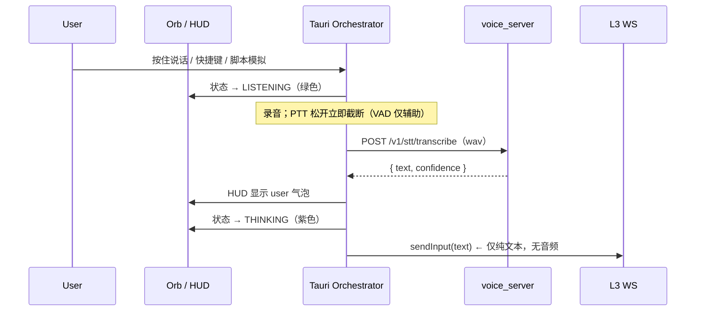
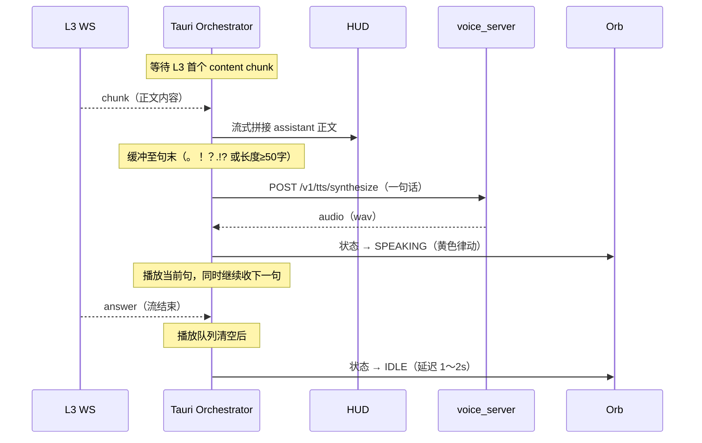

# Jachin Voice Subsystem (JVS) — 陪伴态 / HUD 独立语音模块设计方案

> **状态**：设计稿（未编码）  
> **适用范围**：陪伴态 Orb + 临时交互窗口 HUD  
> **原则**：与 L3 零业务耦合；语音推理独立进程；桌面端做中枢编排

---

## 0. 对外部建议（JVS 草案）的取舍

另一份「JVS 独立微服务」建议中，**值得采纳**与**需要修正**如下：


| 建议点                                             | 结论          | 说明                                  |
| ----------------------------------------------- | ----------- | ----------------------------------- |
| 独立 FastAPI 微服务，只做 STT/TTS                       | ✅ 采纳        | 职责单一，不参与思考/记忆/工具                    |
| 端口 `18982`，与 L3 `18981` 分离                      | ✅ 采纳        | 避免与 Sensory WebSocket 冲突            |
| 仓库根目录 `voice_server/`                           | ✅ 采纳        | 与 `l3_node/` 同级，便于独立启停与部署           |
| Tauri 作「中央调度器」缝合 L3 与 JVS                       | ✅ 采纳        | L3 只处理文本；JVS 只处理音频↔文本               |
| STT 后立刻上屏 HUD 再发 L3                             | ✅ 采纳        | 用户感知延迟最低                            |
| L3 chunk 句级断句后送 TTS，边收边播                        | ✅ 采纳        | 优于「等全文结束再播」                         |
| 打断（Barge-in）：停播 + `run_abort` + Orb 切 LISTENING | ✅ 采纳        | 高级语音必备，由桌面编排实现                      |
| 「打字机与发音节奏严格同步」                                  | ⚠️ 分期       | Phase B 不承诺字级同步；需 TTS 时间戳或 Phase C+ |
| 「麦克风一开 Jachin 睁眼」等文案                            | ⚠️ 仅作 UX 目标 | 实现上对应 Orb `listening` 态，不写进协议       |
| 语音服务直连 L3 WebSocket                             | ❌ 拒绝        | 违反解耦；必须由 Tauri 转发文本                 |
| 与现有 Rust 内嵌模块混为一套                               | ❌ 本期不混      | 陪伴/HUD 走 JVS；旧 TTS 路径暂保留，后续再收敛      |


---

## 1. 目标与边界

### 1.1 产品目标

在桌面端为 **陪伴态** 与 **HUD 临时交互窗** 提供完整语音对话体验：

- 用户用 **语音**（或脚本模拟语音文本）输入
- Jachin 用 **语音 + HUD 流式正文** 回复
- Orb 与 HUD 状态与链路一致（listening → thinking → speaking → idle）

### 1.2 技术边界


| 纳入本期                | 不纳入本期                      |
| ------------------- | -------------------------- |
| STT（语音 → 文本）        | 声纹识别 / 说话人分离               |
| TTS（文本 → 音频）        | 语音模块内调用 L3、记忆、工具           |
| 独立进程 `voice_server` | 把语音策略写进 `run_agent` prompt |
| 脚本文字模拟 STT 结果       | 全应用所有窗口强制语音                |


### 1.3 与 L3 的关系（重要）

- **JVS 与 L3 在业务上零耦合**：JVS 不连 `ws://127.0.0.1:18981/sensory`，不读 L3 状态。
- **桌面端负责缝合**：同一段用户文本 → HUD 展示 + `sendInput` 进 L3；L3 的 chunk/answer 文本 → HUD 展示 + 句级 TTS。
- L3 宕机时：JVS 仍可 STT/TTS 自检；纯文本聊天仍可用。
- JVS 宕机时：L3 文本对话仍可用；陪伴语音降级为仅 HUD 无播报。

---

## 2. 模型资产（已确认）

### 2.1 目录结构（仓库内 SSOT）

模型已放在项目内，与 `data/models/Florence-2-base` 等同属 `**data/models/`** 大模型树；语音子系统单独一支 `**data/models/voice/**`：

```text
jachin-system-main/
  data/models/
    Florence-2-base/                   # 现有：视觉等通用模型
    voice/                             # JVS 语音模型（本模块 SSOT）
      ├── stt\
      │   └── SenseVoiceSmall-onnx\        # STT：语音 → 文本
      │       ├── model_quant.onnx          # 主模型（~230MB，量化版）
      │       ├── tokenizer.json
      │       ├── tokens.json
      │       ├── chn_jpn_yue_eng_ko_spectok.bpe.model
      │       └── config.yaml / preprocessor_config.json
      │
      ├── tts\
      │   └── MOSS-TTS-Nano-100M-ONNX + MOSS-Audio-Tokenizer-Nano-ONNX\     # TTS：文本 → 语音
      │       ├── onnx\
      │       │   └── model.onnx            # 主模型（~324MB）
      │       ├── voices\                   # 音色预设（.bin 格式）
      │       │   ├── zf_001.bin ~ zf_099.bin  # 中文女声
      │       │   ├── zm_009.bin ~ zm_100.bin  # 中文男声
      │       │   ├── af_maple.bin / af_sol.bin  # 英文女声
      │       │   └── bf_vale.bin           # 英文男声
      │       └── tokenizer.json / config.json
      │
      └── sv\
          └── speech_campplus_sv_zh-cn_16k-common\  # 声纹（本期不启用，已随仓目录预留）
```

**绝对路径（本机）**：`D:\project\jachin-system-main\data\models\voice`

**Git**：`*.onnx`、`voices/*.bin` 等大文件 **不入库**（需在 `.gitignore` 中排除）；各槽位 `README.md` 可提交，说明下载来源。

### 2.2 模型说明


| 槽位  | 模型                 | 格式       | 运行时                      | 特性                       |
| --- | ------------------ | -------- | ------------------------ | ------------------------ |
| STT | SenseVoice Small   | ONNX（量化） | `onnxruntime` + `funasr` | 多语言（中/日/粤/英/韩），自带情感/事件标签 |
| TTS | MOSS ONNX Nano | ONNX     | `onnxruntime`            | 中文优化，多音色可选           |
| SV  | CampPlus zh-CN     | —        | —                        | 本期预留，不启用                 |


### 2.3 Jachin 默认音色

TTS 提供 100 个预设音色，推荐为 Jachin 选定一个固定音色：

- **中文女声**：`zf_001` ～ `zf_099`（前缀 `zf` = Chinese Female）
- **中文男声**：`zm_009` ～ `zm_100`（前缀 `zm` = Chinese Male）

建议 **先用 `zf_001` 或 `zm_009` 作为默认**，通过 `JACHIN_VOICE_TTS_VOICE` 环境变量可随时切换，无需改代码。

### 2.4 环境配置（写入项目 `.env`）

```env
# ── JVS 模型路径（仓库内 data/models/voice）────────────────
JACHIN_VOICE_MODEL_ROOT=D:\project\jachin-system-main\data\models\voice
JACHIN_VOICE_STT_DIR=stt\SenseVoiceSmall-onnx
JACHIN_VOICE_TTS_DIR=tts
JACHIN_VOICE_TTS_VOICE=zf_001

# ── JVS 服务配置 ────────────────────────────────────
JACHIN_VOICE_SERVER_PORT=18982
JACHIN_VOICE_SERVER_URL=http://127.0.0.1:18982
JACHIN_SKIP_VOICE_SPAWN=0          # 0 = 桌面启动时自动拉起 voice_server
```

启动前自检：`data/models/voice/` 存在 → `model_quant.onnx` / `onnx/model.onnx` 可读 → 端口可用 → `/health` 返回 `ok: true`。

---

## 3. 总体架构

```text
                    ┌──────────────────────────────────────────┐
                    │          Tauri Desktop（中枢编排）          │
                    │  Orb / HUD / chat历史 / voiceOrchestrator  │
                    └───────────┬──────────────────┬────────────┘
                                │                  │
                  HTTP（音频/文本）│                  │ WebSocket（仅文本）
                                ▼                  ▼
               ┌──────────────────────┐   ┌─────────────────────┐
               │   voice_server (JVS)  │   │   L3 Sensory WS      │
               │   127.0.0.1:18982     │   │   127.0.0.1:18981    │
               │   ──────────────────  │   │   run_agent 文本流   │
               │   • STT（SenseVoice） │   └─────────────────────┘
               │   • TTS（MOSS ONNX）     │
               └──────────────────────┘
                          ▲
                          │ 加载模型（启动时一次性）
               data/models/voice/stt/SenseVoiceSmall-onnx
               data/models/voice/tts/MOSS-TTS-Nano-100M-ONNX + MOSS-Audio-Tokenizer-Nano-ONNX
```

**进程隔离一览**


| 组件                     | 端口 / 通道          | 职责                         | 可独立重启 |
| ---------------------- | ---------------- | -------------------------- | ----- |
| L3 Gateway             | `18981` WS       | 推理、工具、流式 answer/chunk（仅文本） | ✅     |
| L2 API                 | `18888` HTTP     | 文本兜底（现有）                   | ✅     |
| **JVS `voice_server`** | `**18982` HTTP** | **STT / TTS**              | **✅** |
| Tauri Desktop          | —                | 采音、会话、断句、打断、UI 编排          | —     |


日志分离：

- L3：`~/.jachin/l3_debug.log`（现有）
- JVS：`~/.jachin/voice_server.log`（新增）

---

## 4. 代码与目录规划

### 4.1 仓库布局

```text
jachin-system-main/
├── data/models/
│   ├── Florence-2-base/             # 现有
│   └── voice/                       # JVS 模型（stt / tts / sv）
│       ├── stt/SenseVoiceSmall-onnx/
│       ├── tts/MOSS-TTS-Nano-100M-ONNX/
│       ├── tts/MOSS-Audio-Tokenizer-Nano-ONNX/
│       └── sv/                      # 本期不加载
├── l3_node/                         # 现有，不动
├── voice_server/                    # 新增：JVS 本体（FastAPI + ONNX）
│   ├── main.py                      # FastAPI 应用入口、uvicorn 启动
│   ├── config.py                    # 从环境变量读取路径/端口
│   ├── services/
│   │   ├── stt_service.py           # SenseVoice ONNX 推理封装
│   │   └── tts_service.py           # MOSS ONNX 推理封装
│   ├── api/
│   │   ├── health.py                # GET /health
│   │   ├── stt.py                   # POST /v1/stt/transcribe
│   │   └── tts.py                   # POST /v1/tts/synthesize
│   └── requirements.txt             # onnxruntime, funasr, fastapi, uvicorn ...
│
├── clients/desktop/
│   ├── src/voice/                   # 前端 TS：编排逻辑与状态
│   │   ├── voiceSessionStore.ts     # 单一状态源（listening/thinking/speaking/idle）
│   │   ├── voiceOrchestrator.ts     # 断句、打断、STT→L3→TTS 顺序控制
│   │   ├── sentenceBuffer.ts        # 断句缓冲（缩写/code fence/flush）
│   │   ├── voicePlaybackController.ts # 单例播放锁、队列、generation 丢弃
│   │   └── voiceBridge.ts           # Tauri invoke / fetch 封装，调用 JVS HTTP
│   └── src-tauri/src/jvs/           # Rust：子进程管理
│       ├── process_manager.rs       # spawn / health-check / graceful-stop
│       ├── client.rs                # HTTP 请求转发（可选，也可前端直连）
│       └── commands.rs              # Tauri IPC 命令（start_jvs, stop_jvs, jvs_status）
```

### 4.2 与现有桌面语音代码的关系

仓库内已有 Rust 模块：

- `clients/desktop/src-tauri/src/stt/`（唤醒词 / VAD）
- `clients/desktop/src-tauri/src/tts/`（旧本地 TTS 路径，现主链已切到 MOSS ONNX）

**本期策略**：陪伴态 + HUD 主路径只走 JVS（`voice_server`）；上述 Rust 模块保留其他场景，**本期不强行合并**，避免大范围回归。

### 4.3 Python 依赖（`voice_server/requirements.txt` 草案）

```text
fastapi>=0.111
uvicorn[standard]>=0.29
onnxruntime>=1.18          # CPU 推理；有 GPU 可换 onnxruntime-gpu
funasr>=1.1                # SenseVoice 解码器（tokenizer/后处理）
numpy>=1.24
soundfile>=0.12
pydantic>=2.0
python-multipart>=0.0.9    # multipart/form-data 上传音频
```

> **注意**：MOSS ONNX 依赖 TTS 核心模型与 Audio Tokenizer 两个目录；SenseVoice 需要 `funasr` 做 BPE tokenizer 解码。

---

## 5. JVS API 契约

Base URL：`http://127.0.0.1:18982`

### 5.1 健康检查

`GET /health`

```json
{
  "ok": true,
  "stt_ready": true,
  "tts_ready": true,
  "stt_model": "SenseVoiceSmall-onnx",
  "tts_model": "MOSS-TTS-Nano-100M-ONNX + MOSS-Audio-Tokenizer-Nano-ONNX",
  "tts_voice": "zf_001",
  "version": "0.1.0"
}
```

### 5.2 STT（听觉）

`POST /v1/stt/transcribe`

- Request：`multipart/form-data`，字段 `audio`（wav / pcm，16kHz 单声道），可选 `session_id`
- Response：

```json
{
  "text": "用户说的话",
  "confidence": 0.92,
  "duration_ms": 1800,
  "language": "zh"
}
```

**采集与 VAD**：由 Tauri 侧完成（录音 + 静音检测截断），JVS 只负责「给定音频片段 → 文本」，不做流式 VAD（Phase C 可选下沉）。

**⚠️ 编码注意：VAD 精度与物理打断（必读）**

纯靠前端静音检测截断，阈值极易失准，典型翻车：

- 阈值过高 / 静音窗口过短 → 用户喘口气就被判定「说完」，半句话被截断送 STT
- 阈值过低 / 环境噪音大 → 永远等不到「静音」，音频迟迟不发送

**设计原则：VAD 是辅助，物理事件是主触发。**


| 模式            | 行为                                             |
| ------------- | ---------------------------------------------- |
| **按住说话（PTT）** | **松开快捷键 = 立即结束录音并发送**；VAD 仅用于按住期间的防误触，不得覆盖松开事件 |
| 自由对话（若后续启用）   | VAD 静音截断 + **最长录音时长上限**（如 30s）+ 用户可点 Orb 手动结束  |


实现要求：

- `voiceOrchestrator` 中 **PTT 松开** 与 **VAD 截断** 走同一 `finalizeUtterance()` 入口，但 PTT 松开优先级更高、立即执行
- VAD 参数（静音阈值 dB、静音持续 ms）应可配置，默认保守（静音窗口 ≥ 800ms），并在开发模式暴露调试日志
- 最短有效录音时长（如 ≥ 300ms）防止空按发送

**语言支持**：SenseVoice 支持中 / 日 / 粤 / 英 / 韩多语言自动识别，无需前端指定语种。

### 5.3 TTS（发声）

**Phase B 首选：按句合成**

`POST /v1/tts/synthesize`

Request：

```json
{
  "text": "好的，我来帮你处理。",
  "voice": "zf_001",
  "session_id": "voice-xxx"
}
```

Response：`Content-Type: audio/wav`，直接返回音频二进制；或：

```json
{
  "audio_base64": "...",
  "duration_ms": 1400,
  "sample_rate": 24000
}
```

**Phase C 可选：流式 TTS**

`GET /v1/tts/stream?text=...&voice=zf_001` — HTTP chunked audio 流，降低首帧延迟。

JVS **不负责断句**；断句由 Tauri `voiceOrchestrator` 根据 L3 chunk 与标点完成后再调用本接口（详见 §6.2 断句边界）。

**⚠️ 编码注意：断句逻辑的边界 Case（必读）**

简单正则按 `。！？.!?` 切句在以下场景会切碎句子，导致 TTS 发音断裂、极不自然：


| 场景             | 风险示例                       | 处理策略                                                 |
| -------------- | -------------------------- | ---------------------------------------------------- |
| 英文缩写           | `e.g.`、`Dr.`、`U.S.`、`etc.` | 句号后若紧跟小写字母或已知缩写模式，**不切句**                            |
| 小数 / 版本号       | `3.14`、`v1.2.3`            | 数字两侧的 `.` 不作为句末                                      |
| 代码块 / Markdown | `````、`const x = 1;`       | 检测到 fenced code / 行内 code 区间时 **暂停 TTS 送句**，仅 HUD 展示 |
| 大量符号           | `=>`、`::`、`...`            | 符号密集段（如表格、JSON）默认 **跳过 TTS**，避免朗读乱码                  |
| 流结束残留          | L3 `answer` 到达时缓冲区仍有未切出的半句 | **强制 flush** 剩余文本作为最后一句送 TTS                         |


实现建议（`voiceOrchestrator` / `sentenceBuffer.ts`）：

- 分层断句：先识别 code fence 状态，再在普通文本层做标点扫描
- 缩写白名单 + 「句号 + 空格 + 大写/中文」启发式，优于裸正则
- TTS 跳过不等于 HUD 跳过：代码/符号段仍在 HUD 流式展示，仅静音播报
- Phase B 可先实现「中文全角标点 + 流结束 flush」；英文缩写与 code fence 在 Phase B 末或 Phase C 补齐

### 5.4 会话级控制

`POST /v1/session/cancel`

```json
{ "session_id": "voice-xxx" }
```

停止当前 session 正在执行的 TTS 推理（丢弃队列），与桌面本地 `Audio.stop()` 配合实现打断。

---

## 6. 核心数据链路

### 6.1 听觉链路（麦克风 → STT → HUD → L3）




要点：

- HUD **拿到 STT 文本后立刻显示**，不等待 L3 回复。
- 主聊天历史与 HUD 共用同一 user 消息，避免双份。
- `confidence < 0.5` 时，HUD 可加「未识别清楚，请重试」提示。
- **PTT 模式**：松开快捷键必须立即 `finalizeUtterance()` 并送 STT，不依赖 VAD 二次确认（见 §5.2）。

### 6.2 发声链路（L3 chunk → 断句 → TTS → 播放）




要点：

- HUD 文本跟 L3 chunk **实时走**（已有 `mergeStreamChunk` 逻辑），不等 TTS。
- TTS 按**句子**请求，收到 L3 就开始处理，不等全文结束。边收边播，延迟最低。
- `thought` / `system_status` / `action` **不进 HUD，也不送 TTS**。
- 断句须处理缩写、代码块、符号密集段等边界（见 §5.3）；`answer` 到达时 flush 缓冲剩余文本。

### 6.3 脚本模拟（开发联调）

`scripts/simulate_voice_companion_chat.ps1` 注入的 user 文本等价于 STT 输出：

- 跳过 `POST /v1/stt/transcribe`，直接进入「HUD 显示 + sendInput(L3)」
- 便于无麦克风时验证 HUD / Orb / L3 整条链路

---

## 7. UI / UX 与状态机

### 7.1 Orb 状态（与 JVS 完整对齐）


| 状态          | 触发条件                                            | 视觉效果（Orb）     |
| ----------- | ----------------------------------------------- | ------------- |
| `idle`      | 无语音会话                                           | 青色慢速呼吸        |
| `listening` | 录音中 / 等待 STT 返回                                 | 绿色加速旋转        |
| `thinking`  | STT 完成后 L3 未出 content chunk（仅 reasoning/action） | 紫色波纹          |
| `speaking`  | TTS 播放中                                         | 黄色音频律动跳动      |
| `error`     | JVS / L3 不可恢复错误                                 | 短暂红色闪烁后回 idle |


状态由 `**voiceSessionStore`** 单一维护，HUD 与 Orb 订阅同一事件（`hud-orb-state`），**禁止双写**。

### 7.2 HUD 显示策略

- 仅语音会话激活（`voiceSessionActive = true`）时自动弹出。
- 只显示：**user 文本**（从 STT 来）+ **assistant 主正文**（从 L3 content chunk 来）；错误信息单行摘要。
- 禁止写入：哨兵通知（`Jachin · 实时陪伴`）、`system_status` 调试块、L3 reasoning 内容。

### 7.3 打断（Barge-in） ，Phase C 实现

用户再次开口（或快捷键 `Ctrl+Space`）时，Tauri 顺序执行：

1. **立刻停止**本地 TTS 音频播放（见下方播放锁规范）
2. `POST /v1/session/cancel` 通知 JVS 丢弃当前合成队列
3. 调用已有 `sendRunAbort()` 打断 L3 当前 run
4. Orb → `listening`；HUD 保留历史记录，新的 utterance 另起一轮

**不在 JVS 内实现 L3 打断**，L3 通信只由桌面编排层负责。

**⚠️ 编码注意：播放锁与音频状态清理（必读）**

Barge-in 场景下频繁 `stop()`、切换 `src`、写入新音频流，极易在 WebView 音频层引发资源竞争、爆音或「上一句残留尾音」。须由 `**voicePlaybackController`（单例）** 统一管理，禁止多处直接操作 `Audio` 元素。

**播放锁规则**


| 规则   | 说明                                                                                            |
| ---- | --------------------------------------------------------------------------------------------- |
| 单播放器 | 全局仅一个 `Audio`（或 `AudioContext`）实例负责 TTS 输出                                                    |
| 单飞播放 | `play()` 前必须 `await` 上一次 `stopAndReset()` 完成                                                  |
| 队列串行 | TTS 句子队列由 controller 顺序消费；打断时清空队列并递增 `playbackGeneration`                                     |
| 代际丢弃 | 每个新 utterance / 打断递增 generation；异步 TTS 返回时若 generation 已过期，**丢弃音频不入队**                        |
| 完整重置 | `stopAndReset()`：`pause()` → `currentTime = 0` → 移除 `onended` → `src = ""` → `load()`（释放解码缓冲） |
| 冷却间隔 | 连续打断后可选 50～100ms 再播新句，减轻驱动层爆音（可 A/B 调参）                                                       |


**打断与播放的调用顺序（不可颠倒）**

```text
bargeIn()
  1. playbackController.stopAndReset()     ← 先停本地，用户立刻听不到声音
  2. playbackController.clearQueue()
  3. playbackController.bumpGeneration()
  4. POST /v1/session/cancel
  5. sendRunAbort()
  6. voiceSessionStore → listening
```

禁止在 `onended` 回调与 `bargeIn()` 之间无锁并发启动下一句；controller 内部用 `isStopping` / `mutex` 保证互斥。

### 7.4 打字机与发音同步（分期策略）


| 阶段           | HUD 行为                       | TTS 行为             |
| ------------ | ---------------------------- | ------------------ |
| **Phase B**  | 按 L3 chunk 速度流式出字            | 按句合成 + 顺序播放        |
| **Phase C+** | 若 MOSS ONNX 返回词级时间戳，驱动「当前朗读词高亮」 | 流式 endpoint，降低首帧延迟 |


Phase B **不承诺字级同步**，避免过度设计。

---

## 8. 启动与生命周期

### 8.1 推荐启动顺序

1. L3：`python -m l3_node --gateway`（或已有 sidecar）
2. **JVS**：`python voice_server/main.py`（或 `uvicorn voice_server.main:app --port 18982`）
  ← 模型在此时一次性加载进内存，首次加载约 2～5s
3. Tauri Desktop 启动

### 8.2 Tauri 进程管理逻辑

```text
Desktop 启动
    └─► GET /health → ok?
        ├─ 已就绪 → 正常运行
        └─ 失败 → spawn voice_server 子进程（最多重试 3 次）
               └─ 仍失败 → 标记 jvs_degraded，语音静音降级，HUD 文本继续工作

Desktop 退出
    └─► POST /v1/session/cancel → 发 SIGTERM → 等待最多 3s → SIGKILL
```

崩溃恢复：Tauri 定期（每 30s）`GET /health`；失败则尝试重启，失败次数写日志。

---

## 9. 错误与韧性

遵循 `docs/JACHIN_EXECUTION_RESILIENCE_CONTRACT.md`：


| 错误类别        | 示例                       | 处理策略                                                      |
| ----------- | ------------------------ | --------------------------------------------------------- |
| `transient` | 单次推理超时（>5s）、网络抖动         | 有限重试（≤2次）+ 指数退避                                           |
| `resource`  | 模型 OOM、ONNX 推理崩溃         | 重启 JVS 进程；超限则 `jvs_degraded`                              |
| `config`    | `model_quant.onnx` 路径不存在 | 启动失败 + 明确错误日志，不重试                                         |
| `permanent` | 模型文件损坏（ONNX 加载异常）        | `/health` 标 `stt_ready: false` / `tts_ready: false`，UI 提示 |
| `per_item`  | 某句话 TTS 合成失败             | 跳过该句，继续下一句；不中断整轮回复                                        |


禁止静默吞错（`except: pass`）；所有异常写 `voice_server.log` 并带 `[JVS_ERROR]` 前缀可检索。

---

## 10. 分阶段实施计划

### Phase A — 骨架与进程编排（1～2 天）

- [ ] 创建 `voice_server/`：`/health` 端点 + mock STT/TTS（返回固定文本/音频）
- [ ] Tauri `jvs/process_manager.rs`：spawn、探活、优雅关闭
- [ ] `voiceOrchestrator.ts` 骨架：接管脚本模拟路径，HUD 显示 + sendInput(L3)
- [ ] `voiceSessionStore.ts`：Orb 状态门控（`voiceSessionActive`）
- [ ] 验证：脚本文本 → HUD 展示 → L3 回复 → HUD 流式正文 → Orb 状态切换

### Phase B — 真实模型接入（2～4 天）

- [ ] `stt_service.py`：接入 SenseVoiceSmall ONNX（`onnxruntime` + `funasr`）
- [ ] `tts_service.py`：接入 MOSS ONNX（`onnxruntime`），加载默认音色
- [ ] Tauri 侧：麦克风录音 → wav 16kHz → POST `/v1/stt/transcribe`
- [ ] **PTT 松开立即送 STT**；VAD 仅辅助，参数可配置（§5.2）
- [ ] `sentenceBuffer.ts`：中文全角标点断句 + `answer` 时 flush 剩余缓冲
- [ ] `voicePlaybackController.ts`：单例播放器 + 队列串行（为 Phase C 打断打基础）
- [ ] Tauri 侧：L3 chunk 断句缓冲 → POST `/v1/tts/synthesize` → controller 播放
- [ ] 主聊天历史与 HUD 消息一致，无重复刷屏
- [ ] `/health` 返回真实 `stt_ready`/`tts_ready` 状态

### Phase C — 体验提升与稳定（1～2 天）

- [ ] Barge-in：`stopAndReset` → clearQueue → bumpGeneration → cancel → run_abort（§7.3）
- [ ] 断句增强：英文缩写白名单、code fence 跳过 TTS、符号密集段静音播报
- [ ] 并发保护：单会话同时只允许一个 SPEAKING 状态；过期 generation 音频丢弃
- [ ] 打断压测：连续 5 次 barge-in 无爆音、无尾音残留
- [ ] 可选流式 TTS endpoint（降低首帧延迟）
- [ ] 启动自检报告：模型加载耗时、ONNX provider（CPU/CUDA）、音色列表

---

## 11. 验收标准

1. 语音输入（或脚本模拟）后 **STT 完成即上屏** HUD user 气泡，无需等待 L3。
2. L3 回复在 HUD **单条 assistant 气泡**内流式增长，无重复全文、无哨兵标题污染。
3. L3 首个 content chunk 到达后 **≤2s** 听到第一句 TTS 音频（本地 ONNX 推理目标）。
4. 播放 TTS 时 Orb 为 `speaking`，队列播完后 **≤2s** 回 `idle`。
5. **重启 L3** 后 JVS 仍存活；**重启 JVS** 后纯文本聊天仍可用。
6. 打断后：TTS 立即停止，L3 不再追加当前轮次输出，Orb 进入 `listening`。
7. JVS 崩溃后：桌面降级至纯文本模式，HUD 出现「语音服务不可用」提示而非静默失败。
8. PTT 松开后立即送 STT，不因 VAD 等待额外静音窗口。
9. 含 `e.g.` / 代码块的 L3 回复：HUD 正常展示，TTS 不朗读代码块内容。
10. 连续打断 5 次：无爆音、无上一句尾音残留、Orb 状态正确回 `listening`。

---

## 12. 本期明确不做

- 声纹识别 / 说话人分离（`data/models/voice/sv/speech_campplus_sv_zh-cn_16k-common` 预留，不加载）
- JVS 内访问 L3 / L2 API
- 语音对话记忆、意图路由、工具调用
- 用 JVS 替换全应用所有 TTS（仅陪伴/HUD 主路径）
- 唤醒词（「Hey Jachin」）— 现有 Rust 模块已有相关基础，本期不在 JVS 侧重复实现

---

## 13. 编码前必读：三个高风险节点（Cursor 实现清单）

交给 Cursor 写代码前，以下三点最容易在联调阶段翻车，已分散写入 §5.2 / §5.3 / §7.3，此处作总表速查：


| #   | 风险点        | 核心原则                                          | 落点文件                         |
| --- | ---------- | --------------------------------------------- | ---------------------------- |
| 1   | **VAD 精度** | PTT 松开 = 立即发送；VAD 仅辅助，阈值保守可配置                 | `voiceOrchestrator.ts`、录音模块  |
| 2   | **断句边界**   | 缩写/代码/符号段不切或跳过 TTS；`answer` 必须 flush          | `sentenceBuffer.ts`          |
| 3   | **播放锁**    | 单例 controller、generation 丢弃、完整 `stopAndReset` | `voicePlaybackController.ts` |


**禁止事项**

- 禁止多处散落 `new Audio()` 或裸调 `audio.play()` / `stop()`
- 禁止仅用裸正则 `[。！？.!?]` 断句而不处理缩写与 code fence
- 禁止自由对话模式仅靠 VAD 截断而无物理结束手段（PTT / 手动结束 / 最长时长）

---

## 附录：模型快速参考


| 项目   | STT                                           | TTS                                              |
| ---- | --------------------------------------------- | ------------------------------------------------ |
| 模型名  | SenseVoice Small                              | MOSS ONNX Nano                               |
| 路径   | `data/models/voice/stt/SenseVoiceSmall-onnx/` | `data/models/voice/tts/MOSS-TTS-Nano-100M-ONNX/` + `data/models/voice/tts/MOSS-Audio-Tokenizer-Nano-ONNX/` |
| 主文件  | `model_quant.onnx`（~230MB）                    | `onnx/model.onnx`（~324MB）                        |
| 运行时  | `onnxruntime` + `funasr`                      | `onnxruntime`                                    |
| 输入格式 | wav，16kHz，单声道                                 | 文本字符串                                            |
| 输出格式 | 文本字符串 + 置信度                                   | wav，24kHz                                        |
| 语言   | 中/日/粤/英/韩（自动）                                 | 中文优化（`zf_`*/`zm_*`）                              |
| 默认音色 | —                                             | `zf_001`（可配置）                                    |


