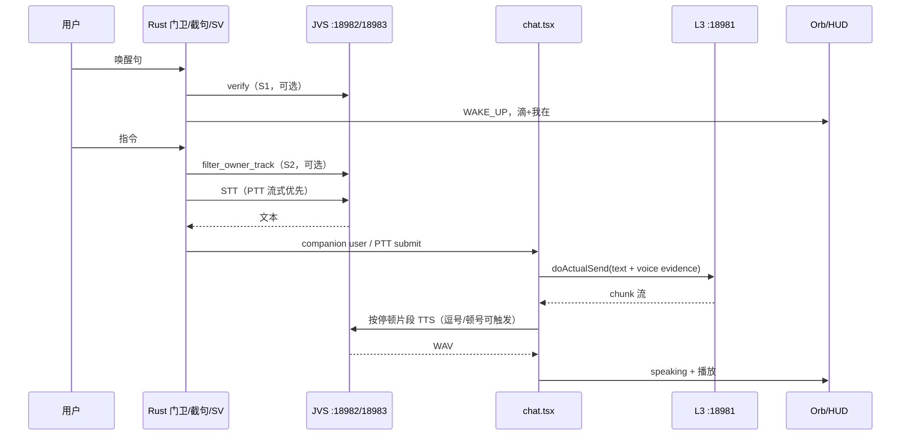

# Jachin 语音模块 — 人话版全链路说明

> **写给谁看**：产品、联调、新同学——想搞懂「喊一声 Jachin 到听见它回答」中间到底发生了什么，以及**为什么有时感觉不够流畅**。
> **状态**：2026-07 更新，描述**当前已落地实现**（统一 Voice Core、声纹门禁、L3 认知内核主循环）。
> **关联文档**：`VOICE_COMPANION_PIPELINE_READABLE.md`（当前语音链路 SSOT）、`VOICE_WAKE_ARCHITECTURE.md`、`VOICE_BARGE_IN_AND_WAKE_ACK.md`、`VOICE_SPEAKER_VERIFICATION_PROPOSAL.md`

---

## 1. 一句话总结

**麦克风只在桌面 App（Rust）里开一次；JVS 管「听成字、字变声、识主人」；L3 只管「想答案」——桌面 App 当调度员把整条链串起来。**

你说话 → 桌面截句 →（可选）声纹过滤 → JVS 转文字 → 前端整理语音证据 → 文字送 L3 认知内核主循环 → L3 流式回文字 → 桌面断句 → JVS 合成语音 → 扬声器播放。

L3 **从不**碰麦克风，也 **从不**直接播声音。

---

## 2. 它在整个项目里住在哪？

可以把语音看成 **四条线 + 一个模型库**：

```text
jachin-system-main/
│
├── data/models/voice/              ← 模型文件（STT/TTS/SV，体积大，常不入 Git）
│   ├── stt/SenseVoiceSmall-onnx/       语音→文字
│   ├── tts/MOSS-TTS-Nano-100M-ONNX + MOSS-Audio-Tokenizer-Nano-ONNX/    文字→语音
│   └── sv/speech_campplus_sv_zh-cn_16k-common/  声纹（CAM++ 权重 + 配置）
│
├── voice_server/                   ← JVS：独立 Python 进程（HTTP 18982 + STT TCP 18983）
│   ├── main.py                     STT / TTS / SV（HTTP + WS + Raw TCP）
│   └── services/
│       ├── stt_service.py          SenseVoice ONNX
│       ├── tts_service.py          MOSS ONNX（speed 可调，默认 1.25）
│       └── sv_service.py           CAM++ 本地 ModelScope + MVP 回退
│
├── l3_node/                        ← L3 主脑，端口 18981（WebSocket，只传文本）
│
└── clients/desktop/                ← 桌面端：真正的「语音总指挥」
    ├── src-tauri/src/
    │   ├── stt/
    │   │   ├── wake_pipeline.rs        唤醒主循环 + 声纹 S1/S2
    │   │   ├── speaker_verification.rs 调 JVS SV API
    │   │   ├── endpointing.rs          VAD 截句
    │   │   ├── commands.rs             PTT start/stop
    │   │   ├── wake_kws.rs             唤醒词（STT 辅助）
    │   │   └── stream_stt_client.rs    PTT 流式 STT（Raw TCP 优先，WS 回退）
    │   ├── jvs/process_manager.rs      拉起/探活 JVS
    │   ├── voice_playback.rs             Rust 系统扬声器播放
    │   └── wake_ack.rs                   「我在」本地音频
    │
    ├── src/voice/                    ← 前端 TS：Core + 编排
    │   ├── voiceCore.ts                STT 统一入口（JVS，不走 L2 voice API）
    │   ├── voiceProfiles.ts            wake / chat_ptt / chat_vad 三 Profile
    │   ├── voiceOrchestrator.ts        断句 → JVS TTS → 排队播放
    │   ├── voiceCompanionBridge.ts     chat ↔ HUD 事件桥
    │   ├── voicePlaybackController.ts  播放锁、打断止音
    │   └── voiceBridge.ts              HTTP 调 JVS
    │
    ├── src/chat.tsx                    唯一 L3 发送口 doActualSend + dispatchVoiceUtterance
    └── src/components/Omni/            Orb、HUD 浮窗
```

**记忆口诀**

| 东西 | 干什么 | 端口 |
|------|--------|------|
| Rust `stt/` | 占麦、唤醒、截句、声纹门 | — |
| JVS `voice_server` | 音频↔文字、声纹 extract/verify/filter | **18982** HTTP/WS + **18983** STT Raw TCP |
| L3 `l3_node` | 想、调工具、流式出字 | **18981** WebSocket |
| TS `voice/` + `chat.tsx` | 串起来、管 Orb、管播放、管意图 | — |

---

## 3. 和 L3 是什么关系？

### 3.1 边界非常清楚

```text
        ┌─────────────────────────────────────┐
        │         Tauri 桌面（调度员）          │
        │  采音 · 唤醒 · 截句 · 声纹 · 播放   │
        └───┬─────────────────────┬───────────┘
            │ 只传文本              │ 只传文本
            ▼                     ▼
     ┌──────────────┐      ┌──────────────┐
     │ JVS :18982   │      │ L3  :18981   │
     │ STT/TTS/SV   │      │ 想 / 答      │
     └──────────────┘      └──────────────┘
```

- **JVS 不知道** L3 在不在、答什么。
- **L3 不知道** 用户是打字还是说话；只收到 `sendInput(纯文本)`，和键盘发送**同一条路**（`chat.tsx` → `doActualSend`）。
- **桌面 App** 是唯一知道「现在该听、该想、该说」的地方。

### 3.2 文本是怎么进 L3 的？（当前实现）

**陪伴 / 唤醒路径**

```text
Rust wake_pipeline 截句 → JVS STT → inject_companion_user
    → HUD 显示 user 气泡
    → chat.tsx dispatchVoiceUtterance
        → doActualSend(text, implicit_signals)
    → L3 认知内核主循环
```

**大窗 PTT / VAD 路径**

```text
Rust start_ptt_capture / stop_ptt_capture 或 VAD 截句
    → STT_AUDIO_READY 或 stop 同步返回 WAV
    → PTT: 采集中并行流式 STT（Raw TCP 优先，WS 回退），结束时可携带 recognized_text
    → chat.tsx submitVoiceUtterance（优先用 recognized_text；否则 voiceCore.transcribeWavBase64）
    → dispatchVoiceUtterance → doActualSend
```

**关键点**

- 桌面 **不再** 调用 L2 `:18888` 的 `voice/process` / `voice/chat`（`api.ts` 已标 `@deprecated`）。
- `implicit_signals` 只携带 STT 文本、声纹状态、云端诊断、UI 状态等证据；不携带前端意图裁决。

---

## 4. 分成哪几个模块？（角色表）

| 模块 | 人话名 | 常驻吗 | 主要职责 |
|------|--------|--------|----------|
| **A. 门卫** | 「听唤醒词的门卫」 | 唤醒模式 ON 时常驻 | STT 辅助 KWS，命中唤醒句 |
| **A′. 声纹 S1** | 「唤醒时验身」 | 认主后可选 | 唤醒瞬间 verify，非主人拒唤醒 |
| **B. 触发中枢** | 「被叫醒后的第一反应」 | 事件驱动 | 滴声、「我在」、Orb 变绿、暂停门卫 |
| **C. 截句器** | 「判断你说完一句了没」 | 唤醒后 / PTT / VAD | VAD 静音 800ms 或 PTT 松开即截 |
| **C′. 声纹 S2** | 「录指令时识主」 | 可选 | 主人轨提取，剔旁人窗再 STT |
| **D. JVS** | 「耳朵 + 嘴巴 + 声纹」 | 按需/可预热 | STT、TTS、SV |
| **E. 桌面编排** | 「现场导演」 | 有语音会话时 | 转发语音证据、断句、TTS 队列、Orb |
| **F. L3** | 「大脑」 | 桌面启动时 | ReAct、工具、流式正文 |
| **G. 播放 & 打断** | 「嘴和急刹车」 | 播报时 | Rust 播放优先、barge-in |

---

## 5. 三种入口，一条 Core（已实现）

详见 `VOICE_COMPANION_PIPELINE_READABLE.md`。简要对照：

| Profile | 入口 | 滴声/我在 | Orb/HUD | 门卫 | 进 L3 |
|---------|------|-----------|---------|------|-------|
| **wake** | 唤醒词 | ✅ | ✅ | ✅ | dispatchVoiceUtterance |
| **chat_ptt** | 大窗按住说 | ❌ | ❌ | ❌ | 同上 |
| **chat_vad** | 大窗 VAD 开关 | ❌ | ❌ | ❌ | 同上 |

代码锚点：`voiceProfiles.ts`、`voiceCore.ts`、`chat.tsx`（`chatJvsVoiceActiveRef` / `voiceCompanionActiveRef`）。

---

## 6. 完整使用流程（用户视角 · 唤醒路径）

```text
[静默] 门卫听唤醒词，Orb 青色呼吸
   ↓ 你说唤醒句
[S1 声纹]（若开启）verify 唤醒切片 → 非主人静默拒识
   ↓
[唤醒] 滴 + 「我在」+ Orb 变绿
   ↓ 你说正事
[截句] 静音 ~800ms 或最长 15s
   ↓
[S2 声纹]（若开启主人轨）filter_owner_track → 只 STT 主人窗
   ↓
[STT] JVS SenseVoice → HUD user 气泡
   ↓
[发送] dispatchVoiceUtterance → doActualSend（只携带文本和语音证据）
   ↓
[思考] Orb 变紫，L3 认知内核主循环理解、追问、编排或执行
   ↓
[播报] 断句 → MOSS ONNX TTS（speed 默认 1.25）→ 最多 3 句
   ↓
[结束] 播完回 idle；~1.5s 冷却后门卫再上岗
   ↓
[连续对话] 60s 窗口内可直接说下一句
```

**打断**：答应/思考/朗读时开口或 `Ctrl+Space` → 止音 → 重新听。详见 `VOICE_BARGE_IN_AND_WAKE_ACK.md`。

---

## 7. JVS 能力与配置（当前真实现状）

| 能力 | API | 实现 |
|------|-----|------|
| STT（批量） | `POST /v1/stt/transcribe` | SenseVoiceSmall ONNX（WAV 上传） |
| STT（流式） | `WS /v1/stt/stream` | PCM chunk 增量识别（partial/final） |
| STT（低封装 IPC） | `TCP :18983`（自定义帧） | Raw TCP，本机链路优先使用 |
| TTS | `POST /v1/tts/synthesize` | MOSS ONNX，`speed` 默认 **1.25**（`JACHIN_VOICE_TTS_SPEED`） |
| 会话打断 | `POST /v1/session/cancel` | 真实取消令牌（会话级/全局） |
| SV extract | `POST /v1/sv/extract` | CAM++ 本地 ModelScope；失败回退谱统计 MVP |
| SV verify | `POST /v1/sv/verify` | 唤醒门 S1 |
| SV filter | `POST /v1/sv/filter_owner_track` | 主人轨 S2 |
| 健康检查 | `GET /health` | 返回 `sv_model`、`tts_speed`、`stt_tcp_port` |

声纹 profile 存于 `%USERPROFILE%\.jachin\voice\owner_voiceprint.json`；设置页「一键认主」调用 `enroll_owner_voiceprint`。

---

## 8. 各阶段耗时与流畅度（经验值）

与旧版类似，补充**当前已知变化**：

| 现象 | 多半原因 | 备注 |
|------|----------|------|
| 唤醒慢 | STT 辅助 KWS 1s 轮询 | Porcupine 仍为目标态 |
| 说完等一会才反应 | 800ms 尾静音 + JVS 冷启动 | 预热 JVS 可缓解 |
| TTS 偏慢 | MOSS ONNX CPU 合成 | 已默认 speed=1.25；且断句已下沉到逗号/顿号 |
| 一句话发两次（PTT） | Rust 同步返回 + STT_AUDIO_READY 双通道 | **已加 6s 指纹去重**（`chat.tsx` submitVoiceUtterance） |
| 旁人插话进 STT | S2 主人轨未生效或阈值不当 | 见 `VOICE_SPEAKER_VERIFICATION_FILTER_FAILURE_ANALYSIS.md` |
| 打断后不理人 | LISTENING_REARM 待完善 | 见 barge-in 文档 §14 |

**TTS 首句预算**（JVS 已热、句短）：L3 首 chunk ~1～5s + 逗号/顿号级断句 + MOSS ONNX ~0.5～2s/段。

---

## 9. 数据流图



---

## 10. Orb 颜色与系统状态

| Orb 状态 | 颜色/动效 | 系统在干什么 |
|----------|-----------|--------------|
| `idle` | 青色慢呼吸 | 门卫听唤醒词，或回合结束 |
| `listening` | 绿色加速 | 等你说话 / 打断后重新听 |
| `thinking` | 紫色波纹 | STT 完成，L3 还没出正文 chunk |
| `speaking` | 黄色跳动 | TTS 正在播 |
| `error` | 红闪 → idle | JVS/L3 不可恢复错误 |

状态来源：`voiceSessionStore.ts`；HUD 通过 `voiceCompanionBridge` 与 chat 同步。

---

## 11. 声纹识主（简要）

两道门，详见 `VOICE_SPEAKER_VERIFICATION_PROPOSAL.md`：

1. **S1 唤醒门**：KWS 命中后，从 ring buffer 取 ~1.5s 切片 → JVS verify → 不过则拒唤醒。
2. **S2 主人轨**：VAD 截句后 → JVS `filter_owner_track` 滑窗 label → 只把 owner 窗送 STT；整段不可信则丢弃。

设置项（WakeModePanel）：声纹门、主人轨提取、严格模式；认主需录 3 段样本。

---

## 12. 相关文件速查

| 想改… | 先看… |
|--------|--------|
| 当前语音链路 / Profile | `VOICE_COMPANION_PIPELINE_READABLE.md`, `voiceProfiles.ts`, `voiceCore.ts` |
| 唤醒/截句/声纹 | `stt/wake_pipeline.rs`, `speaker_verification.rs` |
| PTT 采音 | `stt/commands.rs`, `chat.tsx` submitVoiceUtterance |
| 意图理解 / 追问 / 编排 | L3 认知内核主循环 |
| chat ↔ HUD | `voiceCompanionBridge.ts`, `HUDMessagePanel.tsx` |
| JVS STT/TTS/SV | `voice_server/`, `jvs/process_manager.rs` |
| TTS 语速 | `voice_server/config.py` → `JACHIN_VOICE_TTS_SPEED`（默认 1.25） |
| L3 发送 | `chat.tsx` → `doActualSend`, `dispatchVoiceUtterance` |
| 断句与 TTS | `voiceOrchestrator.ts`, `sentenceBuffer.ts` |
| 播放/打断 | `voicePlaybackController.ts`, `voice_playback.rs` |
| 认主 UI | `WakeModePanel.tsx`, `enroll_owner_voiceprint` |
| 声纹联调 | `scripts/test_speaker_verification.py` |

---

## 13. 收个尾

语音模块 **功能闭环**：唤醒、PTT、VAD、听、识主（可选）、想（L3）、说、打断、连续 60s、HUD 陪伴。

「不够流畅」通常是多段固定等待叠加：KWS 轮询、800ms 静音、JVS 冷启动、L3 首 token、MOSS ONNX CPU 合成。当前已做减法：PTT 流式 STT（Raw TCP 优先）与逗号/顿号级 TTS 触发。定位时优先看 `/health` 的 `sv_model`/`tts_speed`/`stt_tcp_port`，以及 `voiceCompanionDebug` / `voice_chat.log` 的阶段日志。
