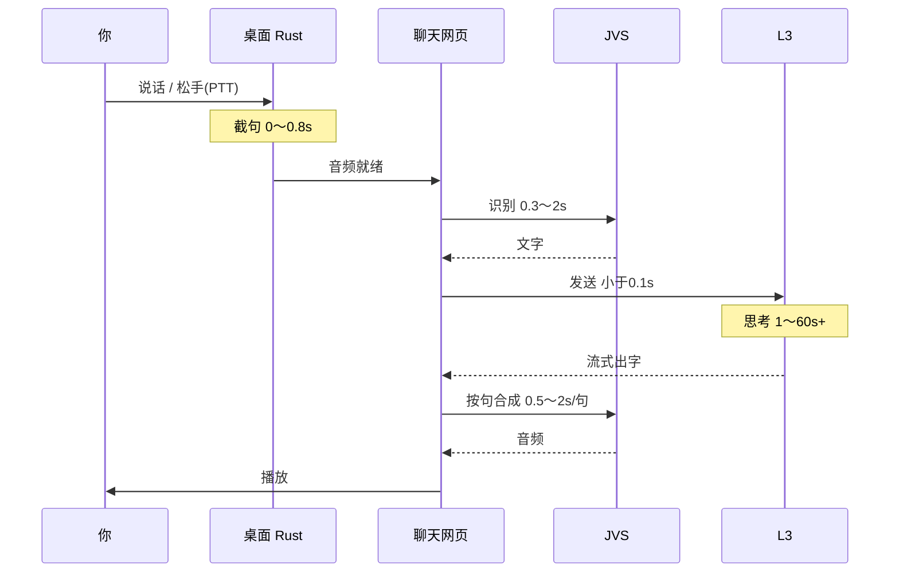

# 语音问答全链路 — 人话版（谁干什么、怎么配合、大概等多久）

> **写给谁看**：产品、联调、新同学——想搞懂「喊一声 / 按一下麦克风，到听见它回答」中间到底跑了几个程序、谁先谁后、**哪一步可能要等**。
> **状态**：2026-06，描述当前桌面端实现。
> **关于时间**：下文全是**经验区间**（CPU 快慢、句子长短、L3 要不要调工具差很多），不是硬 SLA。代码里写死的常数会单独标注。

---

## 1. 先用一句话说清楚

你说话 → **桌面 App** 用麦克风录下来并截成「一句话」→ **JVS** 把声音变成字 → **L3** 像打字一样想答案、流式出字 → **JVS** 再把字变成声音 → **桌面 App** 用扬声器播出来。

**三个独立程序（进程）分工：**

| 谁 | 端口 | 人话职责 | 它不管什么 |
|----|------|----------|------------|
| **桌面 App**（jachin-desktop） | — | 占麦克风、截句、界面、播放、打断、拉起另外两个服务 | 不做 AI 推理 |
| **JVS**（耳朵 + 嘴巴） | **18982** | 听写（STT）、朗读（TTS） | 不知道 L3 在答什么 |
| **L3**（大脑） | **18981** | 想答案、调工具、流式打字 | **从不**碰麦克风、不播声音 |

**L2（18888）**：桌面语音问答**不依赖**它；关掉 L2 照样能语音聊天（只要 JVS + L3 在）。

**记忆口诀**：Rust 占麦截句 → JVS 音频↔文字 → L3 纯文本思考 → JVS 文字↔音频 → 扬声器播放。

---

## 2. 桌面 App 里面其实还有「两个小分工」

虽然对外是一个 `.exe`，内部可以想成 **两个搭档**：

| 搭档 | 在哪跑 | 干什么 | 典型耗时 |
|------|--------|--------|----------|
| **Rust 后台** | 主进程 | 麦克风、唤醒门卫、VAD 截句、滴声/「我在」、系统扬声器 | 采音实时；截句规则见下文 |
| **网页界面（WebView）** | 聊天窗口里 | 发文字给 L3、收流式回复、断句、调 JVS 念出来、Orb/HUD 变色 | 和 L3/JVS 通信各 **&lt;100ms** 级（localhost） |

它们用 **Tauri 事件 / invoke** 说话，比如 Rust 录完音 → 通知网页「音频好了，去识别吧」。

---

## 3. 开软件时，后台在忙什么（你可能感觉不到）

| 步骤 | 谁在做 | 大概多久 | 你会感觉到吗 |
|------|--------|----------|--------------|
| 启动 L3 | 桌面 App 拉起 Python | **3～15 秒** | 一般无感，聊天窗连上就好 |
| 启动 JVS（可选预拉） | 桌面 App 拉起 Python | **2～60 秒**（第一次加载模型最慢） | 无感；**若等到你说话才启动，会明显卡** |
| JVS 预热 STT/TTS 模型 | JVS 后台线程 | 含在上面 | 热身后 STT **0.3～2s**，TTS **0.5～2s/句** |
| 开唤醒门卫（若开了唤醒模式） | Rust | **0.5～2 秒** | Orb 开始呼吸 |

**常见坑 #1**：**JVS 冷启动**。你话都说完了，它还在加载 SenseVoice + MOSS ONNX（两个 ONNX，合计约 **550MB**），界面会顿一下——「第一次说话特别慢」多半是这个。

---

## 4. 两种进门方式，进去之后是同一条路

| | **唤醒陪伴（WAKE）** | **大窗按麦克风（CHAT_PTT）** |
|--|---------------------|------------------------------|
| 怎么开始 | 喊唤醒词 | 点「开始录音」→ 说完点「结束」 |
| 滴一声 +「我在」 | ✅ 有（**~0.5～1.3 秒**） | ❌ 没有 |
| 右下角 Orb / HUD | ✅ 强绑定 | 大窗里看波形/状态条 |
| 门卫一直听唤醒词 | ✅ | ❌ |
| 答完要不要念出来 | ✅ 最多 **3 句** | ✅ 语音输入时**强制念**（最多 **3 句**） |
| STT 之后 | 同：`doActualSend` → L3 → TTS | 同左 |

**汇合点**：不管哪种进门，**识别出文字之后完全一样**——都走 L3 思考 + JVS 朗读。

---

## 5. 完整流程（按时间顺序，带耗时）

下面分 **唤醒路径** 和 **大窗 PTT 路径** 写「进门差异」，再写 **共用后半段**。

---

### 5.1 唤醒路径：从喊一声到它开始听你说正事

| 步骤 | 发生什么（人话） | 谁在做 | 大概多久 | 备注 |
|------|------------------|--------|----------|------|
| ① 静默守门 | Orb 青色呼吸，后台盯着麦克风找唤醒词 | Rust 门卫 | 持续 | 此阶段**不**问 L3 |
| ② 听到唤醒词 | 系统判定「用户喊我了」 | Rust（当前：每秒用 JVS 短窗 STT 辅助匹配） | **1～3 秒** | 目标态 Porcupine **&lt;0.5s**；这是**唤醒偏慢**主因 |
| ③ 滴一声 | 短促提示音 | Rust 播本地 WAV | **~0.12 秒** | 固定 880Hz |
| ④ 「我在 / 嗯 / 有什么可以帮你」 | 随机预录答应声 | Rust 播 `wake_ack/*.wav` | **~0.4～1.2 秒** | **不用 TTS 现生成**（现生成至少多 **0.5s**） |
| ⑤ 界面变绿 | Orb/HUD 表示「在听你说话」 | 网页 UI | **&lt;0.05 秒** | 与 ③④ 并行 |
| ⑥ 暂停门卫 | 防止唤醒词被录进你的指令里 | Rust | 即时 | — |
| ⑦ 等你开口 | VAD 检测有没有人声 | Rust | 取决于你；**6 秒内没声**就放弃 | 超时 **6s**（`LISTENING_TIMEOUT_MS`） |

**从喊唤醒词到 Orb 变绿、答应播完**：大约 **0.6～4 秒**（② 占大头）。

---

### 5.2 大窗 PTT 路径：从按麦克风到松手

| 步骤 | 发生什么（人话） | 谁在做 | 大概多久 | 备注 |
|------|------------------|--------|----------|------|
| ① 点「开始录音」 | 占麦克风，停掉唤醒门卫（单麦互斥） | Rust | **&lt;0.2 秒** | invoke `start_ptt_capture` |
| ② 你正在说 | 声音写入 buffer | Rust | = **你的说话时长** | 最长强制 **15 秒** |
| ③ 点「结束」 | 立刻截句（PTT **不等** 800ms 尾静音） | Rust | **&lt;0.1 秒** | 与唤醒路径不同：松手即送 |
| ④ 交给网页 | 把 WAV（base64）给前端 | Rust → WebView | **&lt;0.05 秒** | 事件或 invoke 返回 |

**PTT 没有** 滴声、答应声、Orb 强绑定——用户心智是「发一条语音消息」。

---

### 5.3 共用：截句规则（唤醒模式 VAD / 非 PTT 时）

| 规则 | 数值 | 人话 | 你要等的固定成本 |
|------|------|------|------------------|
| 尾音静音判定「说完了」 | **800ms** | 你停说后还要等不到 1 秒才送去识别 | **固定 +0.8 秒** |
| 最短有效语音 | **320ms** | 太短当噪声，丢弃 | — |
| 最长录音 | **15s** | 防止一直录 | — |
| 唤醒后一直不说话 | **6s** 超时 | 滴一声回门卫 | — |

**常见坑 #2**：说完最后一个字，还要**等约 0.8 秒**才 STT——换更少「半句话就被切走」。

---

### 5.4 共用：语音转文字（STT）

| 步骤 | 发生什么 | 谁在做 | 大概多久 | 备注 |
|------|----------|--------|----------|------|
| ① 确认 JVS 在跑 | 没有就 spawn + 轮询 `/health` | Rust + WebView | 冷 **0～60s** / 热 **&lt;0.1s** | 见 §3 |
| ② 上传 WAV | localhost HTTP | WebView → JVS | 可忽略 | POST `/v1/stt/transcribe` |
| ③ SenseVoice 识别 | CPU 跑 ONNX（~230MB） | JVS | **0.3～2 秒** | 句越长越慢 |
| ④ 显示「它听成了…」 | user 气泡上屏 | WebView | **&lt;0.05 秒** | **不等 L3**，先让你确认听对没 |

**STT 阶段合计（JVS 已热）**：通常 **0.4～2.5 秒**。

---

### 5.5 共用：送给 L3 思考

| 步骤 | 发生什么 | 谁在做 | 大概多久 | 备注 |
|------|----------|--------|----------|------|
| ① 准备念回复 | 语音轮次挂上 TTS 会话（音色如 `zm_053`） | WebView | **&lt;0.05 秒** | `voiceOrchestrator.startSession` |
| ② 发文本给 L3 | 和键盘打字**同一条路** | WebView → L3 | **&lt;0.1 秒** | WebSocket `sendInput` |
| ③ 等第一个正文字 | L3 开始流式输出 | L3 | 闲聊 **1～5s**；调工具 **5～60s+** | **思考段没有声音**（设计如此） |
| ④ Orb 变紫 / 状态「在想」 | UI 反馈 | WebView | 即时 | — |
| ⑤ HUD/气泡流式出字 | 字通常比声音快 | WebView | 实时 | L3 的「思考链」**不念、不上 HUD** |

**常见坑 #3**：字还没出来或 Orb 一直紫——**多半是 L3 在调工具或等模型**，不是 JVS 坏了。

---

### 5.6 共用：断句 + 合成 + 播放（TTS）

| 步骤 | 发生什么 | 谁在做 | 大概多久 | 备注 |
|------|----------|--------|----------|------|
| ① 攒够一整句 | 见到 `。！？` 等才送去念 | WebView 断句器 | **0～若干秒** | 必须等句末，否则念半句 |
| ② 清理 Markdown | 跳过代码块等 | WebView | 即时 | — |
| ③ MOSS ONNX 合成一句 | CPU ONNX（~324MB）+ G2P | JVS | **0.5～2 秒/句** | 默认音色 `Junhao` |
| ④ 排队播放 | 一句播完再播下一句 | WebView + Rust 扬声器 | = **音频时长** | 24kHz WAV |
| ⑤ 最多念几句 | 每轮上限 | WebView | — | **最多 3 句** speakable |
| ⑥ Orb 变黄 | 「正在说」 | WebView | 与播放同步 | — |

**首句能听见** ≈ L3 首 chunk（**1～5s**）+ 攒到第一个句号（**0～2s**）+ MOSS ONNX（**0.5～2s**）。
理想（都热、短句、L3 快）：**说完指令后约 4～5 秒**听见第一句；复杂任务常更久。

**常见坑 #4**：屏幕上一大段字都有了还不念——可能在**等句号**，或在**排队合成**。

---

### 5.7 共用：这一轮结束

| 步骤 | 发生什么 | 谁在做 | 大概多久 | 备注 |
|------|----------|--------|----------|------|
| ① L3 收尾 | answer 事件 | L3 → WebView | **&lt;0.1 秒** | — |
| ② 播完剩余队列 | finishStream | WebView | = 剩余音频 | — |
| ③ Orb 回呼吸 | idle | WebView | 即时 | — |
| ④ 播后冷却（仅唤醒） | 防扬声器回声再次触发唤醒 | Rust | **1.5 秒** | `COOLDOWN_MS=1500` |
| ⑤ 门卫重新上岗（仅唤醒） | 又能喊唤醒词了 | Rust | 冷却之后 | — |
| ⑥ 60 秒连续对话（仅唤醒） | 窗口内不用重复喊 | Rust | 每轮 STT 成功 **+60s** | 超窗要再喊 |

**常见坑 #5**：刚答完立刻再喊唤醒词没反应——可能在 **1.5s 故意冷却**里。

---

## 6. 整条链路「时间账单」（加总参考）

### 6.1 唤醒 + 短句问答（理想：JVS 热、L3 快、你说 2 秒指令）

```text
检测唤醒词          1～3s     （当前 STT 辅助；目标 <0.5s）
滴 + 我在            ~0.6s
你讲指令             ~2s      （举例）
尾音等待             +0.8s    （固定，VAD 路径）
STT                  ~0.5s
L3 首字              ~1.5s
断句 + TTS 首句      ~1.0s
─────────────────────────────
从「开口喊唤醒词」到「听见第一句回答」≈ 8～10 秒
从「指令说完」到「听见第一句回答」     ≈ 4～5 秒
```

### 6.2 大窗 PTT + 短句问答（理想）

```text
你按住说话           ~2s      （举例）
松手 → 截句          <0.1s    （无 800ms 尾音等待）
STT                  ~0.5s
L3 首字              ~1.5s
断句 + TTS 首句      ~1.0s
─────────────────────────────
从「松手」到「听见第一句回答」         ≈ 3～4 秒
（若 JVS 冷启动，前面再加 2～60s）
```

### 6.3 现实里「卡」在哪 — 对照表

| 你感觉 | 多半**不是** | 多半是 | 典型等待 |
|--------|--------------|--------|----------|
| 喊唤醒词反应慢 | L3 | STT 辅助 KWS，1s 轮询 + 2s 音频窗 | **1～3s** |
| 说完话半天没动静 | L3 在想 | **0.8s 尾音** + JVS 冷启动 + STT | **1～60s** |
| 字都有了还不念 | 喇叭坏了 | 等句号 / TTS 排队 | **0.5～2s/句** |
| 答完不能马上再喊 | Bug | **1.5s 播后冷却** | 固定 |
| 打断后它不理人 | 麦克风坏了 | 打断后「接新话」链路未完全接上 | 见 §7 |

---

## 7. 打断（你开口让它闭嘴）— 各步耗时

| 步骤 | 发生什么 | 谁在做 | 目标/典型耗时 |
|------|----------|--------|---------------|
| ① 检测你在说话 | VAD 连续人声帧 | Rust | **~0.2～0.3s**（约 7 帧 × 32ms） |
| ② 扬声器立刻静音 | 淡出 + stop | 桌面 | 听感 **~0.05～0.1s** |
| ③ 清空待播队列 | 旧音频作废 | WebView | **&lt;0.05s** |
| ④ 取消 JVS 正在合成的句 | HTTP cancel | JVS | **0.1～0.5s** |
| ⑤ 让 L3 别想了 | run_abort | L3 | **0.1～1s** |
| ⑥ 重新听你 | Orb 变绿 | Rust + WebView | 与 ① 并行 |

**体验目标**：你感觉它闭嘴 + 变绿，**0.1 秒内**；后台停 L3 可以稍慢，但**不应再冒出上一句尾音**。

---

## 8. 三个进程怎么「打电话」（简化版）

| 从 → 到 | 怎么联系 | 传什么 | 耗时 |
|---------|----------|--------|------|
| Rust → 网页 | Tauri 事件 | 「录好了」「被唤醒了」 | **&lt;50ms** |
| 网页 → Rust | invoke | 「开始/停止录音」「拉起 JVS」 | **&lt;100ms** |
| 网页 → JVS | HTTP :18982 | 音频 / `{text, voice}` | STT **0.3～2s**；TTS **0.5～2s/句** |
| 网页 → L3 | WebSocket :18981 | 纯文本、chunk、打断 | 首字 **1～60s+** |
| JVS ↔ L3 | **无** | — | 故意不直连 |

---

## 9. 模型和文件住在哪（和耗时有关）

| 东西 | 在哪 | 谁加载 | 加载要多久（首次） |
|------|------|--------|-------------------|
| SenseVoice STT | `data/models/voice/stt/...` | JVS | 含在 JVS 冷启动 **2～60s** |
| MOSS ONNX TTS + tokenizer | `data/models/voice/tts/...` | JVS | 同上 |
| LLM / 工具 | L3 配置 | L3 | L3 启动 **3～15s** |
| 「我在」预录音 | `public/audio/wake_ack/` | 桌面 Rust | 几乎即时 |

默认朗读音色：**`zm_053`**。

---

## 10. 架构图（给需要对照进程的人）

```text
┌─────────────────────────────────────────────────────────────┐
│  jachin-desktop.exe                                         │
│  ┌──────────────────┐      ┌─────────────────────────────┐  │
│  │ Rust：麦/截句/播 │◄────►│ WebView：L3 编排 + TTS 排队 │  │
│  └────────┬─────────┘      └──────────┬──────────────────┘  │
└───────────┼───────────────────────────┼─────────────────────┘
            │ spawn                     │ HTTP / WebSocket
            ▼                           ▼
   ┌────────────────┐          ┌────────────────┐
   │ JVS  :18982    │          │ L3   :18981    │
   │ 听写 + 朗读    │          │ 思考 + 出字    │
   └────────────────┘          └────────────────┘
```



---

## 11. 联调：慢了看哪个日志

| 进程 | 日志在哪 | 查什么 |
|------|----------|--------|
| 桌面 Rust | `%USERPROFILE%\.jachin\jachin_debug\voice_companion.log` | 唤醒、截句 |
| 聊天网页 | 同上 + `voice_chat.log` | PTT 全链路、TTS session |
| JVS | 终端 / `JACHIN_VOICE_LOG_LEVEL` | STT/TTS、G2P 警告 |
| L3 | `~/.jachin/l3_debug.log` | 工具调用、Agent 卡在哪 |

健康检查：

- JVS：`GET http://127.0.0.1:18982/health`
- L3：聊天窗 Sensory 是否已连接

---

## 12. 为什么有些等待是「故意的」

| 设计 | 换来什么 | 你要付的代价 |
|------|----------|--------------|
| 尾音 **800ms** 才截句 | 少送半句话、少误识别 | 说完多等 **~0.8s** |
| JVS 独立进程 | L3 挂了语音还能自检 | 冷启动 **2～60s** |
| 按句 TTS、最多 **3 句** | 不念 10 分钟 Markdown | 长回答听不全 |
| L3 零音频 | 隐私、好测试 | 「想」的阶段**完全无声** |
| STT 辅助唤醒（过渡方案） | 自定义唤醒句 | 唤醒 **1～3s** |
| 播后冷却 **1.5s** | 防回声误唤醒 | 答完不能立刻再喊 |

---

## 13. 相关文档

| 文档 | 看什么 |
|------|--------|
| `VOICE_MODULE_HUMAN_GUIDE.md` | 更细的逐步耗时、Orb 颜色对照 |
| `VOICE_UNIFIED_PIPELINE_PROPOSAL.md` | 为什么统一成一条 Voice Core |
| `VOICE_WAKE_ARCHITECTURE.md` | 门卫状态机 |
| `VOICE_BARGE_IN_AND_WAKE_ACK.md` | 打断与「我在」细节 |
| `VOICE_COMPANION_MODULE_PLAN.md` | JVS API 与模型目录 |

---

## 14. 收个尾

语音问答 = **桌面 App 当总导演**，**JVS 当耳朵和嘴巴**，**L3 当大脑**。
三个进程各干各的，通过 localhost 的 HTTP 和 WebSocket 配合。

觉得「不够流畅」时，把延迟拆开看：

1. 唤醒检测（**1～3s**）
2. 尾音等待（**+0.8s**）
3. JVS 冷启动（**0～60s**）
4. STT（**0.3～2s**）
5. L3 首字（**1～60s+**）
6. 等句号 + TTS（**0.5～2s/句**）
7. 播后冷却（**1.5s**，仅唤醒）

**哪一步在拖后腿，对号入座就能查。**
