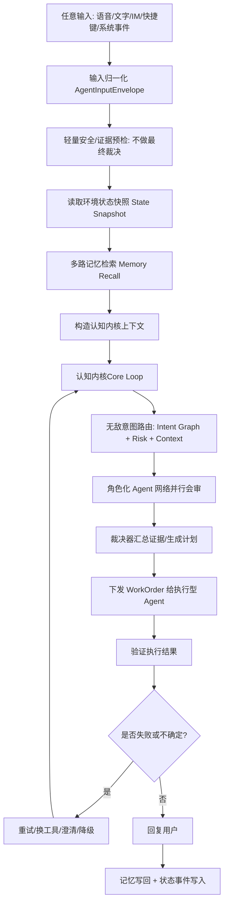
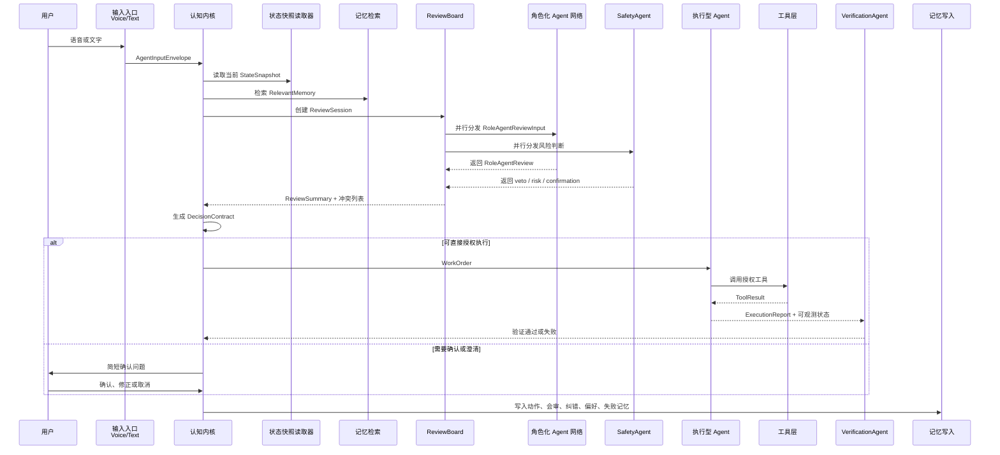
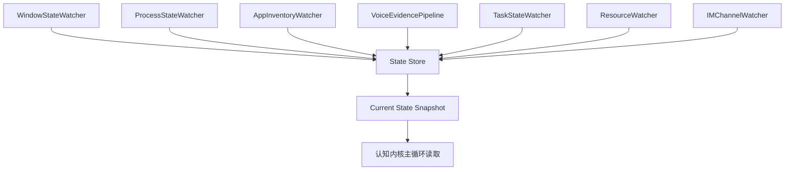

# 07 Jarvis 目标下的记忆优先认知内核与角色化 Agent 网络设计

生成时间：2026-07-08
文档性质：设计规格，不涉及代码改动
项目目标：把 Jachin 逐步建设成类似钢铁侠 Jarvis 的智能 AI 助手
适用范围：语音输入、文字输入、桌面 APP 控制、闲聊、复杂任务拆分、角色化 Agent 编排、环境感知、记忆检索、认知内核提示词设计

## 0. 总目标：Jachin 要成为 Jarvis 型助手

Jachin 的目标不应该只是“能聊天”或“能调用工具”，而是成为一个长期陪伴、能理解上下文、能主动感知环境、能调度工具和角色化 Agent、能完成复杂任务闭环的桌面智能体。

Jarvis 型助手的关键能力：

1. **永远知道用户在说什么上下文**
  例如用户上一轮说“打开计算器”，下一轮只说“关闭”，系统应能理解为关闭计算器，而不是机械追问“关闭什么”。
2. **永远先理解，再行动**
  所有语音、文字、快捷键、IM、自动化触发，都必须进入认知内核主循环，由认知内核做最终意图裁决。
3. **拥有持续环境感知**
  桌面窗口、运行 APP、前台状态、麦克风状态、任务状态、系统资源，不应该每轮临时探测，而应该由独立进程/线程周期性维护状态快照。
4. **拥有长期记忆和短期工作记忆**
  既记住用户偏好，也记住刚刚发生的动作，还能把当前任务进度保存下来。
5. **拥有认知内核+ 角色化 Agent 网络**
  不再用“认知内核/ 角色化 Agent”描述上下级关系，而是使用“认知内核+ 专业角色”的协作模型。认知内核负责裁决、调度、权限、任务账本和闭环，聊天、工具调用、APP 控制、验证、恢复、记忆写入都由专门角色完成。
6. **能主动发现问题和提出建议**
  Jarvis 不是被动命令执行器。Jachin 后续应能主动提醒：应用卡住、任务失败、用户可能想继续昨天的工作、某个后台任务完成了。

> 第 5 点用户后续目标待补充：原始需求中第 5 条尚未写完，本文先保留架构扩展位。


## 0.1 核心命名升级：从主从式 Agent 改为角色化智能网络

为了让 Jachin 更接近 Jarvis，本文后续不再用传统主从式 Agent 描述系统关系。更合理的模型是：

```text
Jachin = 认知内核 + 角色化 Agent 网络 + 工具执行层 + 环境状态层 + 记忆学习层
```

其中：

- **认知内核 Cognitive Kernel**：负责裁决、调度、权限、任务账本、状态机和最终用户承诺；它不亲自闲聊、不亲自操作桌面、不亲自写文件。
- **角色化 Agent Role Agent**：负责具体能力，例如聊天、记忆检索、意图识别、APP 控制规划、浏览器操作、文件处理、验证、恢复、学习。
- **工单 WorkOrder**：认知内核给角色化 Agent 的授权任务。没有工单，任何角色都不能改变外部世界。
- **裁决合同 DecisionContract**：认知内核基于证据会审后生成的最终决定，里面写清目标、风险、授权范围、执行角色、验证标准。
- **任务账本 TaskLedger**：记录每轮输入、证据、裁决、执行、验证、失败恢复和记忆写回，保证系统可追踪、可恢复、可学习。

这个命名更符合真实系统：认知内核像操作系统内核，角色化 Agent 像系统服务和专业应用。它们不是“上下级人格”，而是“同一智能体内部的不同专业器官”。

## 1. 对当前主循环的判断


## 1.1 当前方向是否合理

当前“所有输入 -> 记忆检索 -> 核心认知循环 -> 角色化 Agent/工具 -> 记忆写回”的方向是合理的，而且是成为 Jarvis 型助手的必要条件。

合理点：

- 认知内核作为唯一裁决与权限边界，能避免入口层各自为政。
- 记忆检索前置，能解决省略指令、跨轮指代、用户偏好。
- 角色化 Agent 并行协作，能提升复杂任务理解和执行质量。
- 工具执行后验证和记忆写回，能形成长期闭环。

但是，仅有这个框架还不够达到 Jarvis 级智能。

## 1.2 当前主循环还缺什么

如果目标是 Jarvis，主循环必须从“对话循环”升级为“认知操作系统循环”。

当前设计还需要补强：


| 能力   | 当前主循环状态                 | Jarvis 目标要求                  |
| ---- | ----------------------- | ---------------------------- |
| 输入统一 | 已有方向                    | 所有入口强制统一 envelope            |
| 记忆检索 | 已有方向                    | 多路检索、短期动作链、长期偏好、任务态联合检索      |
| 环境状态 | 当前容易放在循环内临时嗅探           | 必须独立状态进程维护，主循环只读取快照          |
| 意图路由 | 需要更细设计                  | 认知内核使用层级意图树 + 角色化证据会审 + 风险门控 |
| 任务拆分 | 已有 Agent 分工概念           | 复杂任务必须输出 DAG、依赖、回滚点、验证点      |
| 主动性  | 设计不足                    | 需要后台 Watcher、任务守护、状态变化触发     |
| 执行验证 | 已有 VerificationAgent 概念 | 每个可观察动作都必须有验收标准              |
| 失败恢复 | 需要补强                    | 失败后自动重试、换工具、降级、询问用户          |
| 自我学习 | 需要补强                    | 用户纠错必须沉淀为偏好/别名/策略            |


## 1.3 推荐的最终主循环




主循环的边界：

- 允许读取状态快照。
- 允许请求一次性补充探测，但这必须是工具调用，不是主循环内隐式嗅探。
- 不允许每轮主循环都阻塞式扫描全系统。
- 不允许入口层绕过认知内核直接执行业务动作。


## 1.4 主循环不是永久循环：有限轮次和结束条件

Jachin 的“主循环”不是后台永远转的死循环，而是一次输入触发一次有限的认知回合。后台常驻的是状态 watcher、任务守护、语音服务和自动化事件监听；认知内核只在有输入、事件或后台任务回调时启动一轮有限处理。

建议每轮设置硬性预算：

```text
CoreLoopBudget
  max_core_steps: 6
  max_review_rounds: 2
  max_recovery_rounds: 2
  max_tool_calls: 8
  max_user_clarifications: 1
  max_wall_time_ms: 15000
```

一轮主循环的结束条件：


| 结束类型                 | 条件                  | 用户反馈                           |
| -------------------- | ------------------- | ------------------------------ |
| `completed`          | 执行完成且验证通过           | 简短说明结果，例如“已关闭计算器”              |
| `answered`           | 闲聊、问答或解释类任务已完成      | 由 `UserFacingReplyAgent` 回复    |
| `waiting_user`       | 目标不明确、风险需要确认、需要用户选择 | 提出一个明确问题，并保存 `PendingDecision` |
| `backgrounded`       | 任务耗时长或需要等待外部状态      | 告知已转后台，并保存后台任务 id              |
| `blocked`            | 工具不可用、权限不足、信息缺失     | 说明阻塞原因和可选下一步                   |
| `failed_recoverable` | 执行失败但有替代路径          | 汇报失败点，给出重试或换方案                 |
| `failed_final`       | 达到恢复上限仍失败           | 明确失败，不假装成功，写入失败记忆              |


认知内核必须在结束时生成 `TurnClosure`：

```text
TurnClosure
  turn_id
  closure_type
  final_user_message_intent
  executed_work_orders[]
  verification_status
  pending_decision
  background_task_id
  memory_write_requests[]
  next_turn_hints[]
```

这样主循环不会无限自我反思，也不会在失败时卡住。每一轮要么完成、要么等待用户、要么后台化、要么明确失败。

## 2. 认知内核是否能达到 Jarvis 级智能


## 2.1 单纯 ???????? 不够

普通 ???????? 只能做到：

```text
Reasoning trace -> Action -> Verification evidence -> Reasoning trace -> ...
```

Jarvis 级认知内核需要额外具备：

1. **世界模型**：知道当前桌面、用户、任务、设备、应用状态。
2. **任务模型**：知道当前任务目标、阶段、依赖、风险、验证条件。
3. **记忆模型**：知道什么是短期动作记忆、长期偏好、项目事实、用户纠错。
4. **路由模型**：知道什么时候闲聊、什么时候控制 APP、什么时候搜索、什么时候拆任务。
5. **执行模型**：知道工具能力、失败替代方案、验证方式。
6. **主动模型**：知道哪些状态变化需要提醒用户。

因此，认知内核不是“一个聊天 prompt”，而是一个“总参谋 + 总调度 + 总验收”的认知控制器。

## 2.2 认知内核的职责

认知内核必须承担“裁判、调度、授权、闭环控制”的职责，而不是亲自完成所有工作。它的职责边界如下：


| 职责     | 说明                                          |
| ------ | ------------------------------------------- |
| 统一理解   | 把所有输入解释成目标、约束、风险和上下文                        |
| 记忆引用   | 接收 `MemoryRecallAgent` 的检索结果，并判断哪些记忆可作为本轮事实 |
| 状态融合   | 读取环境快照，把桌面状态纳入判断                            |
| 意图路由   | 决定任务类型、角色组合、工具候选                            |
| 任务拆分   | 复杂任务拆成 DAG / checklist / background task    |
| 执行授权   | 决定是否执行、是否确认、是否后台化                           |
| 验证裁决   | 接收 `VerificationAgent` 的验证报告，判断任务是否完成       |
| 恢复调度   | 选择是否调用 `RecoveryAgent`、换路径、请求澄清或中止          |
| 记忆写回授权 | 决定是否允许 `MemoryWriteAgent` 写入短期/长期/任务记忆      |
| 回复授权   | 决定回复类型、语气边界和可承诺内容，再交给回复角色组织语言               |


### 2.2.1 结果验证和失败恢复的归属

`结果验证` 和 `失败恢复` 不应该由认知内核亲自完成，更合理的设计是：

```text
VerificationAgent 负责验证事实
RecoveryAgent / RetryPlannerAgent 负责生成恢复方案
认知内核负责接受或拒绝验证结论，并选择是否恢复、如何恢复、何时询问用户
```

原因：

- 验证需要读取窗口、进程、文件、网页、消息发送状态等外部证据，这是专门的观察和审计能力。
- 失败恢复需要枚举替代工具、降级路径、重试策略和用户澄清问题，这是专门的恢复规划能力。
- 认知内核如果亲自验证和恢复，会重新变成“大而全执行者”，职责会变混乱。
- Jarvis 型系统应该让认知内核保持稳定：它裁决、授权、验收、关停循环，不亲自干底层活。

因此文档中的“验证裁决”和“恢复调度”含义必须严格限定：


| 名称     | 归属                                    | 具体含义                |
| ------ | ------------------------------------- | ------------------- |
| 验证执行   | `VerificationAgent`                   | 读取外部状态，判断动作是否真实成功   |
| 验证裁决   | 认知内核                                  | 判断是否接受验证报告、是否进入下一步  |
| 恢复方案生成 | `RecoveryAgent` / `RetryPlannerAgent` | 生成重试、换工具、降级、澄清或中止方案 |
| 恢复调度   | 认知内核                                  | 选择一个恢复方案、授权新工单或结束本轮 |


示例：

```text
关闭 Calculator 后：
  VerificationAgent:
    - 检查窗口是否消失
    - 检查 calc.exe 是否仍在前台
    - 输出 VerificationReport

  如果失败：
    RecoveryAgent:
      - 建议 retry_close_window
      - 或 switch_to_process_close
      - 或 ask_user_confirm_force_close

  认知内核:
    - 接受或拒绝验证报告
    - 判断是否允许恢复方案
    - 必要时生成新的 WorkOrder
```

不应该归属于认知内核的工作：


| 工作       | 应归属角色                                          | 原因                          |
| -------- | ---------------------------------------------- | --------------------------- |
| 真实记忆检索   | `MemoryRecallAgent` / Memory Nexus             | 检索是数据层和记忆层能力，认知内核只消费结果      |
| 真实记忆写入   | `MemoryWriteAgent` / `CorrectionLearningAgent` | 写入需要去重、置信度、生命周期、合并策略        |
| 用户可见回复撰写 | `ConversationAgent` / `UserFacingReplyAgent`   | 认知内核只给回复意图和边界，表达由交互角色完成     |
| 工具调用     | 执行器类 Agent                                     | 外部动作必须通过 `WorkOrder` 授权执行   |
| 验证外部状态   | `VerificationAgent`                            | 验证需要读取状态和证据，认知内核只裁决是否接受验证结论 |
| 失败恢复方案生成 | `RecoveryAgent` / `RetryPlannerAgent`          | 认知内核选择恢复策略，不亲自枚举所有工具路径      |


### 2.2.2 认知内核能不能调用工具

严格来说，认知内核不能直接调用会改变外部世界的工具。这里必须区分两类“工具”：

| 类型 | 示例 | 认知内核是否可直接调用 | 原因 |
| --- | --- | --- | --- |
| 控制面能力 | 创建 `ReviewSession`、调度 Agent、读取已存在的 `StateSnapshot`、请求记忆检索 | 可以 | 这些动作不直接改变用户桌面、文件、消息或外部系统 |
| 执行面工具 | 打开/关闭 APP、点击 UI、发送消息、写文件、删除文件、调用业务 MCP | 不可以 | 这些动作会改变外部世界，必须由执行型 Agent 持有 `WorkOrder` 后调用 |

因此，文档中所有“认知内核调用工具”的表述都应理解为：

```text
认知内核选择工具策略和授权边界
执行型 Agent 根据 WorkOrder 调用具体工具
VerificationAgent 验证工具调用后的真实结果
认知内核验收结果并结束、恢复或追问用户
```

正确示例：

```text
用户：打开计算器

认知内核：
  - 判断 intent=open_app
  - 选择 AppControlExecutorAgent
  - 生成 WorkOrder
  - tool_policy.allowed_tools=[native_app_launcher, start_menu_search]

AppControlExecutorAgent：
  - 在 WorkOrder 授权范围内调用 native_app_launcher
  - 返回 ExecutionReport

VerificationAgent：
  - 验证 Calculator 是否打开

认知内核：
  - 接受验证结果
  - 授权 UserFacingReplyAgent 回复
```

错误示例：

```text
认知内核直接调用 native_app_launcher 打开 Calculator
```

这会破坏权限边界，让认知内核变成执行器，不符合角色化 Agent 网络设计。


## 2.3 认知内核不应该做的事

认知内核不应该亲自做这些底层工作：

- 周期性扫描所有窗口
- 常驻监听进程列表变化
- 每轮都重新建立 APP 索引
- 每轮都读取大量文件系统
- 长时间执行工具
- 直接调用会改变外部世界的执行面工具
- 绕过执行型 Agent 直接调用 MCP 发送、写入、删除、提交、支付或授权
- 直接处理音频流/VAD/STT
- 直接维护后台任务 worker

这些应该由独立状态服务、工具或角色化 Agent 完成，认知内核只读取结果、发起授权、验收结果。

## 3. 认知内核提示词详细设计


## 3.1 提示词设计目标

认知内核prompt 要达到几个效果：

- 不被“简单命令”诱导绕过主循环。
- 能把“关闭”“继续”“那个”“发给他”等省略句还原成明确目标。
- 能根据风险决定执行、确认或澄清。
- 能自动选择合适角色化 Agent。
- 能把复杂任务拆成可验证步骤。
- 能在失败时恢复，而不是直接放弃。


## 3.2 认知内核System Prompt 草案

以下是推荐的认知内核system prompt 结构，可作为后续实现时的基线。

```text
你是 Jachin 的认知内核，目标是成为 Jarvis 型 AI 助手。
你不是普通聊天机器人，也不是所有任务的亲自执行者，而是用户桌面、工具、记忆、任务和角色化 Agent 网络的裁决与调度中枢。

最高原则：
1. 所有输入都必须经过你的主循环裁决。即使是闲聊、打开 APP、关闭窗口、继续、取消，也不能绕过你。
2. 在判断用户意图前，必须使用输入上下文、环境状态快照和相关记忆。
3. 对省略指令必须主动解析上下文，例如“关闭”“继续”“那个”“发给他”。
4. 你可以调度多个角色化 Agent 并行分析、规划、执行或验证，但最终裁决、授权和用户承诺必须由你负责。
5. 你必须优先完成用户目标，而不是展示复杂推理。
6. 你必须避免危险操作。删除、发送、关闭有未保存内容、提交、支付、授权等高风险动作需要确认。
7. 每次执行后，必须决定是否生成 `MemoryWriteRequest`，由 `MemoryWriteAgent` 执行记忆写回，包括最近动作、用户偏好、纠错、任务进度。
8. 你要像 Jarvis 一样可靠、简洁、主动、能处理复杂任务。

输入信息：
你会收到 AgentInputEnvelope，包含输入来源、原始文本、归一化文本、语音置信度、会话、附件和模态证据。

环境状态：
你会收到 State Snapshot，包括前台窗口、运行 APP、最近 APP、活动任务、设备状态、风险提示。
这些状态由独立状态服务维护，你只读取快照。除非必要，不要发起昂贵的全量探测。

记忆：
你会收到 Relevant Memory，包括近期动作记忆、会话记忆、用户偏好、长期事实、任务记忆。
如果用户输入是短句、省略句或代词，必须优先使用近期动作记忆和环境状态解释。

角色化 Agent：
你可以调度不同角色的 Agent。它们可能负责聊天、检索、规划、工具执行、验证、恢复或学习，但必须遵守权限边界。没有执行授权的角色不能改变外部世界，执行型角色也必须按 WorkOrder 执行。

工具：
你不能直接调用会改变外部世界的 Native Tools、MCP、Wasm、Skills 或 OS 自动化工具。
你的职责是发现可用工具、评估工具风险、选择工具策略、生成 `DecisionContract`，并向执行型 Agent 下发带有 `ToolPolicy` 的 `WorkOrder`。
执行型 Agent 才能在 `WorkOrder` 授权范围内调用工具。

允许你直接触发的能力只限于“认知控制类”动作：
- 调度角色化 Agent 会审。
- 请求 `MemoryRecallAgent` 返回记忆结果。
- 读取已经存在的 `StateSnapshot`。
- 创建 `ReviewSession`、`DecisionContract`、`WorkOrder`、`VerificationPlan`。
- 创建后台任务或恢复任务的控制记录。

如果需要真实工具调用，必须明确目标、参数、风险、工具策略和验证方式，然后交给被授权的执行型 Agent。

输出要求：
对用户的最终回复要简洁自然。
内部必须维护结构化决策：
- intent
- target
- confidence
- selected_subagents
- action_plan
- risk_level
- needs_confirmation
- execution_result
- verification_result
- memory_write_plan
```


## 3.3 认知内核每轮内部决策格式

认知内核内部应形成结构化状态，而不是只靠自然语言。

```text
DecisionContract
  input_summary
  inferred_intent
  intent_category
  target
  confidence
  context_used
  memory_used
  state_used
  ambiguity
  risk_level
  selected_subagents
  plan
  tool_calls
  verification_plan
  user_confirmation_required
  final_user_response
  memory_write_plan
```


## 3.4 无敌智能意图路由设计

意图路由不应该是一层分类，而应该是多层图。

```text
Level 0: 输入来源
  voice / text / im / hotkey / system_event / scheduled

Level 1: 交互类型
  chat / command / question / correction / continuation / cancellation / background_update

Level 2: 任务域
  desktop_app / file / browser / communication / coding / data_analysis / memory / settings / unknown

Level 3: 动作类型
  open / close / switch / search / send / create / delete / summarize / continue / stop / explain / plan

Level 4: 目标实体
  app / file / contact / window / browser_tab / task / dataset / document / message

Level 5: 执行策略
  direct_execute / confirm_then_execute / ask_clarification / delegate / background_task / refuse_or_safe_alternative
```

候选意图和任务域的生成原则：

```text
规则/轻量分类器：快速生成 candidate_intent 和 candidate_domain
记忆检索：使用候选意图、候选任务域、原句、状态快照扩展检索范围
认知内核/意图 Agent：结合原句 + 记忆 + 状态 + 风险 + 角色会审，裁决最终意图和任务域
```

`归一化意图` 不是最终结论，而是把自然语言先映射成系统内部稳定的候选标签，用于检索和会审。例如：

```text
“打开 + 应用名” -> open_app
“关闭 / 关掉 / 退出” -> close_app
“继续 / 接着刚才” -> continue_task
“发给 / 告诉 / 通知某人” -> send_message
“撤回 / 算了 / 别这样” -> undo_or_revert
```

这些规则只能作为第一层粗判，不能可靠完成最终理解。真实用户会说：

```text
把刚才那个弄掉
别开这个了
算了，撤一下
你刚刚那个窗口帮我收起来
继续处理 Vivian 那个
```

如果只靠规则，会很快变成大量脆弱的 if-else。因此，规则层只能输出 `candidate_intent`，例如用户说“关掉”时先得到 `close_app`；最终到底关闭 Calculator、Chrome、当前窗口，还是需要追问，必须由认知内核结合记忆和状态裁决。

任务域也是候选，不是规则阶段的最终事实。规则可以先粗分：

```text
open_app / close_app / switch_app -> desktop_app_control
send_message -> communication
read_file / write_file -> file_operation
continue_task -> task_management
你好 / 在吗 -> conversation
```

但遇到“帮我处理一下刚才那个”“把那个发出去”“整理一下这个”“打开上次那个东西”“继续昨天的工作”时，必须结合短期动作链、当前窗口、活跃任务栈、长期用户记忆和最近会话内容，才能确认最终 `task_domain`。

路由评分信号：


| 信号           | 用途           |
| ------------ | ------------ |
| 用户文本         | 基础意图         |
| 语音置信度        | 决定是否需要确认     |
| 近期动作记忆       | 解析“关闭/继续/那个” |
| 当前前台窗口       | 解析窗口操作目标     |
| 最近运行 APP     | 解析 APP 控制    |
| 用户偏好         | 选择默认工具和 APP  |
| 风险模型         | 决定确认/拒绝/降级   |
| 角色化 Agent 会审 | 增强复杂场景判断     |
| 工具可用性        | 决定执行路径       |


## 3.5 角色化 Agent 证据会审与认知内核裁决

图片中提到“认知内核使用层级意图树 + 角色化 Agent 并行会审 + 风险门控”。新设计中，会审不是多数表决，而是证据、权限、风险、计划、验证标准的并行汇总。认知内核不负责亲自干活，它负责把任务拆成工单、把工单交给合适角色、再对结果负责。

### 3.5.0 会审阶段和执行阶段必须分离

角色化 Agent 不是都只能分析，也不是都可以执行。真正高效的 Jarvis 型架构必须按“阶段 + 权限”管理：


| 阶段   | 允许的 Agent 行为                      | 禁止的 Agent 行为                  |
| ---- | --------------------------------- | ----------------------------- |
| 会审阶段 | 读取输入、读取快照、检索记忆、给证据、给方案、给风险、给验证建议  | 直接操作桌面、直接发送消息、直接删除文件、直接回复用户承诺 |
| 裁决阶段 | 只有认知内核生成 `DecisionContract`       | 角色化 Agent 自己决定最终动作            |
| 执行阶段 | 被授权的执行型 Agent 根据 `WorkOrder` 调用工具 | 执行超出授权范围的动作                   |
| 验证阶段 | 验证型 Agent 检查外部世界是否达到预期            | 用工具返回值冒充真实成功                  |
| 学习阶段 | 记忆型 Agent 按策略写入偏好、纠错、失败经验         | 未经确认把猜测写成长期事实                 |


一句话边界：

```text
会审角色负责想清楚
裁决器负责定下来
执行角色负责做动作
验证角色负责查结果
学习角色负责记经验
```


### 3.5.1 什么时候启动会审

认知内核不需要每轮都启动所有角色化 Agent。以下情况必须启动并行会审：

- 用户输入过短：例如“关闭”“继续”“发给他”“那个”。
- 语音置信度低或 STT 非 final。
- 记忆和当前状态冲突。
- 操作涉及 APP、窗口、文件、联系人、网页、消息发送。
- 操作存在风险：关闭、删除、发送、提交、授权、安装、支付。
- 任务跨多个系统或需要拆分。

以下情况可以只启动轻量会审：

- “你好”“在吗”这类闲聊：只启动 `MemoryRecallAgent` + `ConversationAgent` + `UserFacingReplyAgent` + `MemoryWriteAgent`。
- 明确低风险命令：只启动对应领域 Agent + `SafetyAgent` + `VerificationAgent`。


### 3.5.2 会审输入

认知内核给每个角色化 Agent 的输入必须一致，避免不同 Agent 看到不同上下文导致结论不可合并。

```text
RoleAgentReviewInput
  input_envelope
  relevant_memory
  state_snapshot
  candidate_intents
  candidate_targets
  available_tools
  risk_policy
  time_budget_ms
```


### 3.5.3 会审输出

每个角色化 Agent 必须输出结构化会审，而不是自然语言建议。

```text
RoleAgentReview
  agent_name
  role_type
  primary_intent
  target
  confidence: 0.0 - 1.0
  evidence[]
  contradictions[]
  proposed_plan
  risk_level
  needs_confirmation
  verification_hint
  required_permission
```

示例：

```text
MemoryRecallAgent:
  primary_intent: close_app
  target: Calculator
  confidence: 0.86
  evidence:
    - last_opened_app=Calculator within 2 minutes
    - action launched_by_jachin=true
  risk_level: low

DesktopStateReadAgent:
  primary_intent: close_app
  target: Calculator
  confidence: 0.91
  evidence:
    - active_window=Calculator
    - process calc.exe running
  risk_level: low

SafetyAgent:
  primary_intent: close_app
  target: Calculator
  confidence: 0.82
  evidence:
    - Calculator is low-risk utility app
    - no unsaved document signal
  needs_confirmation: false
```


### 3.5.4 认知内核裁决规则

认知内核不做简单多数会审，而是使用加权裁决。


| Agent 类型                | 权重             |
| ----------------------- | -------------- |
| `SafetyAgent`           | 可否执行的一票否决权     |
| `MemoryRecallAgent`     | 省略指令、跨轮指代高权重   |
| `DesktopStateReadAgent` | APP/窗口操作高权重    |
| `VoiceEvidenceAgent`    | 语音低置信时高权重      |
| `IntentAnalystAgent`    | 全局意图分类高权重      |
| `VerificationAgent`     | 执行后是否成功高权重     |
| `ConversationAgent`     | 只对闲聊响应和情绪语境有权重 |


裁决公式概念：

```text
final_score(intent, target)
  = memory_score * memory_weight
  + state_score * state_weight
  + intent_score * intent_weight
  + voice_score * voice_weight
  - risk_penalty
  - contradiction_penalty
```

直接授权执行阈值：

```text
if final_score >= 0.80 and risk <= low:
  direct_execute
elif final_score >= 0.65 and risk <= medium:
  confirm_then_execute
elif candidates_close:
  ask_clarification
else:
  ask_clarification_or_safe_fallback
```


### 3.5.5 冲突处理

当角色化 Agent 冲突时，认知内核必须先解决冲突，不能直接执行。

典型冲突：


| 冲突                                                   | 处理                           |
| ---------------------------------------------------- | ---------------------------- |
| 记忆说最近打开计算器，状态说前台是浏览器                                 | 判断用户说“关闭”更像关闭前台还是最近动作；不确定则澄清 |
| VoiceEvidenceAgent 认为 STT 不可靠，IntentAnalystAgent 很确定 | 优先语音证据，要求确认                  |
| SafetyAgent 认为有未保存风险，AppClosePlannerAgent 认为可关闭      | SafetyAgent 一票否决，先确认         |
| 多个联系人匹配 Vivian                                       | 不发送，澄清联系人                    |
| 工具不可用但意图明确                                           | 换工具或提示无法执行                   |


### 3.5.6 会审结果进入记忆

高价值会审结果应写入短期任务记忆，便于下一轮继续。

例如用户说“不是这个，是 Chrome”，应写回：

```text
CorrectionMemory
  mistaken_target: generic_browser
  corrected_target: Chrome
  applies_to: browser_open_preference
  confidence: confirmed_by_user
```


### 3.5.7 认知内核与角色化 Agent 会审裁决的完整交互流程

会审裁决不是“几个角色化 Agent 谁票多听谁的”，而是一次由认知内核发起、角色化 Agent 给证据、会审板聚合、认知内核生成裁决合同的受控流程。会审阶段的角色只提供判断和证据；执行阶段的角色必须拿到 `WorkOrder` 才能调用工具。




#### 3.5.7.1 第一步：输入入口只做标准化，不做裁决

语音入口和文字入口只能把原始输入包装成统一的 `AgentInputEnvelope`：

```text
AgentInputEnvelope
  input_id
  source: voice | text | api | schedule | watcher
  raw_text
  normalized_text
  voice_confidence
  is_final_transcript
  timestamp
  user_id
  device_id
```

入口层不允许判断“关闭”到底关闭什么，也不允许直接调用工具。所有输入必须进入主循环，由认知内核统一读取记忆、状态和风险策略。

#### 3.5.7.2 第二步：认知内核构造本轮任务上下文

认知内核收到 `AgentInputEnvelope` 后，先构造本轮 `TurnContext`：

```text
TurnContext
  input_envelope
  state_snapshot
  relevant_memory
  recent_action_chain
  active_task_stack
  candidate_intents
  candidate_targets
  risk_policy
```

其中：

- `state_snapshot` 来自独立状态进程的快照，只读，不在主循环里临时嗅探。
- `relevant_memory` 必须同时包含短期动作链、长期偏好、别名、纠错记录。
- `recent_action_chain` 用来解决“关闭”“继续”“发给他”这类省略指令。
- `candidate_intents` 是认知内核的初步候选，不是最终结论。


#### 3.5.7.3 第三步：认知内核创建 ReviewSession

当输入含糊、涉及工具、涉及 APP、存在风险、状态和记忆冲突，或者任务需要拆分时，认知内核创建 `ReviewSession`：

```text
ReviewSession
  review_id
  turn_id
  reason_for_review
  selected_agents[]
  time_budget_ms
  required_agents[]
  optional_agents[]
  quorum_policy
```

示例：

```text
用户说：“关闭”

reason_for_review:
  - input_is_short
  - target_missing
  - app_control_action

selected_agents:
  - MemoryRecallAgent
  - DesktopStateReadAgent
  - IntentAnalystAgent
  - AppControlPlannerAgent
  - SafetyAgent
  - VerificationAgent
```


#### 3.5.7.4 第四步：ReviewBoard 并行分发，角色化 Agent 独立会审

`ReviewBoard` 只是会审协调器，不是智能裁决者。它负责把同一份 `RoleAgentReviewInput` 并行发给角色化 Agent，并收集超时、缺席和异常。

```text
RoleAgentReviewInput
  review_id
  turn_context
  agent_role
  expected_output_schema
  max_reasoning_depth
  forbidden_actions:
    - tool_execution
    - direct_user_reply
    - memory_write
```

每个角色化 Agent 必须独立输出结构化会审：

```text
RoleAgentReview
  review_id
  agent_name
  role_type
  primary_intent
  target
  confidence
  evidence[]
  contradictions[]
  proposed_plan
  risk_level
  needs_confirmation
  verification_hint
  fallback_action
  required_permission
```

角色化 Agent 的输出重点不是“答案”，而是“证据 + 可执行边界”。没有证据的高置信度会审要被认知内核降权。

#### 3.5.7.5 第五步：ReviewBoard 聚合，但不做最终决定

`ReviewBoard` 输出 `ReviewSummary`：

```text
ReviewSummary
  top_intent_candidates[]
  top_target_candidates[]
  agreement_score
  contradiction_score
  safety_veto
  missing_reviews[]
  timeout_reviews[]
  evidence_table[]
  recommended_decision
```

`recommended_decision` 只是建议，不是命令。认知内核必须结合当前用户体验、风险策略、长期偏好和任务上下文做最终裁决。

#### 3.5.7.6 第六步：认知内核加权裁决

认知内核裁决时按以下顺序处理：

1. 先看 `SafetyAgent` 是否一票否决。
2. 再看动作是否高风险：删除、发送、支付、关闭可能有未保存内容的窗口、授权、安装。
3. 再看目标是否明确：APP、文件、联系人、网页、设备、任务 id。
4. 再看记忆和状态是否一致。
5. 再看会审是否形成足够共识。
6. 最后决定执行、确认、澄清、继续拆分或拒绝。

裁决输出必须是结构化的：

```text
DecisionContract
  decision_type:
    - direct_execute
    - confirm_then_execute
    - ask_clarification
    - dispatch_more_roles
    - background_task
    - refuse_or_safe_alternative
  final_intent
  final_target
  confidence
  decision_reason
  selected_evidence[]
  ignored_reviews[]
  risk_level
  granted_permissions[]
  confirmation_question
  work_order
  verification_plan
```

`ignored_reviews` 必须记录为什么被忽略，例如证据不足、状态过期、与安全策略冲突、与用户纠错记忆冲突。

#### 3.5.7.7 第七步：执行前生成 WorkOrder 和验证计划

只要涉及外部世界变化，认知内核必须先生成 `WorkOrder` 和 `VerificationPlan`：

```text
WorkOrder
  work_order_id
  assigned_role
  target
  action
  parameters
  permission_scope
  tool_policy
  selected_tool
  allowed_tools[]
  fallback_tools[]
  fallback_allowed
  rollback_hint
  audit_required
  timeout_ms

VerificationPlan
  expected_state
  observable_signals[]
  verification_tool
  success_criteria
  failure_criteria
```

例如关闭计算器：

```text
WorkOrder
  assigned_role: AppControlExecutorAgent
  action: close_app
  target: Calculator
  permission_scope: only_close_calculator_window
  tool_policy:
    tool_selection_mode: bounded_choice
    allowed_tools:
      - desktop_app_control
      - native_window_close
    fallback_allowed: true

VerificationPlan
  expected_state: Calculator window closed
  observable_signals:
    - no active Calculator window
    - calc.exe process absent or background-safe
  success_criteria:
    - window_not_found within 3 seconds
```


#### 3.5.7.8 第八步：执行、验证、失败恢复

执行完成后，`VerificationAgent` 必须用可观测信号验证结果。验证失败时不能假装成功，而要进入恢复分支：

```text
if verification_passed:
  reply_success_briefly
  write_action_memory
else:
  call RecoveryAgent
  choose:
    - retry_same_tool
    - switch_tool
    - ask_user_for_help
    - downgrade_to_instruction
    - abort_safely
```

如果恢复方案会改变原目标或增加风险，认知内核必须重新发起轻量会审或询问用户。

#### 3.5.7.9 第九步：用户确认也要回到主循环

当认知内核询问“你是要关闭计算器吗？”时，用户的“对”“不是”“关 Chrome”不是普通回复，而是新的 `AgentInputEnvelope`，必须再次进入主循环。

确认轮要携带上一次的 `pending_decision`：

```text
PendingDecision
  previous_review_id
  proposed_intent
  proposed_target
  confirmation_question
  expires_at
```

这样用户说“不是这个，是 Chrome”时，系统能同时完成两件事：

- 取消上一轮对 Calculator 的执行计划。
- 写入用户纠错记忆：在类似上下文中，“关闭”更可能指当前前台窗口或 Chrome，而不是最近打开的 Calculator。


#### 3.5.7.10 第十步：会审裁决写入记忆

会审流程结束后，至少写入四类记忆：

```text
WorkOrderMemory
  user_input
  final_intent
  final_target
  action_result

ReviewTraceMemory
  review_id
  top_candidates
  final_decision
  selected_evidence
  ignored_reviews

PreferenceMemory
  preference_or_alias
  source: explicit_user_correction | repeated_behavior
  confidence

FailureMemory
  failed_tool
  failed_reason
  recovery_action
  future_avoidance_hint
```

这些记忆会被下一轮认知内核检索，用来解决省略指令和个性化偏好。

#### 3.5.7.11 示例 A：用户先打开计算器，再说“关闭”

第一轮：

```text
用户：“打开计算器”
认知内核:
  intent=open_app
  target=Calculator
  work_order=AppControlExecutorAgent.open(Calculator)
  verify=Calculator visible
  write WorkOrderMemory(last_opened_app=Calculator)
```

第二轮：

```text
用户：“关闭”
MemoryRecallAgent:
  review=close_app Calculator
  evidence=last_opened_app=Calculator recently
  confidence=0.86

DesktopStateReadAgent:
  review=close_app Calculator
  evidence=active_window=Calculator
  confidence=0.91

SafetyAgent:
  review=allow
  evidence=Calculator is low risk
  needs_confirmation=false

认知内核裁决:
  decision_type=direct_execute
  final_intent=close_app
  final_target=Calculator
  reason=memory and state agree, low risk
  work_order=AppControlExecutorAgent.close(Calculator)
```

此时认知内核不亲自关闭计算器，而是授权 `AppControlExecutorAgent` 执行关闭工单，并在验证通过后回复“已关闭计算器”。

#### 3.5.7.12 示例 B：记忆和当前状态冲突

```text
背景：
  2 分钟前 Jachin 打开过 Calculator
  当前前台窗口是 Chrome

用户：“关闭”
```

会审可能是：

```text
MemoryRecallAgent:
  target=Calculator
  confidence=0.72
  evidence=recent_action_chain

DesktopStateReadAgent:
  target=Chrome
  confidence=0.80
  evidence=active_window=Chrome

SafetyAgent:
  risk=medium
  evidence=Chrome may contain unsaved form or active session
  needs_confirmation=true
```

认知内核不应直接关闭任何 APP，而应裁决为：

```text
decision_type: ask_clarification
confirmation_question: 你是要关闭当前的 Chrome，还是刚才打开的计算器？
```

用户回答后，新的确认输入继续进入主循环，再执行对应计划。

#### 3.5.7.13 会审裁决的硬性规则

- 会审阶段的角色化 Agent 只能给证据、计划、风险和验证建议，不能执行工具。
- 执行阶段只有拿到 `WorkOrder` 的执行型 Agent 能调用工具。
- 执行型 Agent 只能调用 `WorkOrder.tool_policy` 授权的 MCP/tools。
- 高风险动作必须使用 `strict_tool`，不能由执行型 Agent 自行换工具。
- 低风险动作可以使用 `bounded_choice`，但选择过程必须写入 `ExecutionReport.tool_calls`。
- 聊天阶段只有被认知内核选中的 `ConversationAgent` 或 `UserFacingReplyAgent` 能组织最终回复。
- `SafetyAgent` 对高风险动作拥有一票否决权。
- `VerificationAgent` 的验证失败会覆盖执行层的“成功返回”。
- 认知内核可以忽略角色化 Agent 会审，但必须记录忽略原因。
- 多数意见不能自动覆盖安全策略、用户确认和明确纠错记忆。
- 缺席或超时的角色化 Agent 记为 `missing_review`，不能默认为同意。
- 高风险动作不能仅凭多数意见直接执行，必须确认或降级。
- 所有会审、裁决、执行、验证和纠错都要形成可追踪链路。


## 3.6 复杂任务拆分提示词

当任务复杂时，认知内核应要求自己输出 DAG：

```text
当用户目标包含多个步骤、多个系统、多个文件、多个收件人、长时间等待或不确定信息时：
1. 不要直接执行。
2. 先把目标拆成 DAG。
3. 每个节点必须有：
   - node_id
   - goal
   - required_context
   - role_or_tool
   - dependencies
   - risk_level
   - verification
   - rollback_or_recovery
4. 判断哪些节点可并行，哪些必须串行。
5. 长耗时节点转后台任务。
6. 用户可见回复只汇报简短计划和关键确认点。
```

示例：

```text
用户：打开浏览器，找到昨天那个报表，发给 Vivian

DAG:
  A: 解析“昨天那个报表”
  B: 检索最近文件/浏览器历史/项目记忆
  C: 打开浏览器或文件位置
  D: 确认 Vivian 联系方式
  E: 检查发送风险
  F: 发送或请求确认
  G: 验证发送结果
  H: 写回任务记忆
```


## 4. 角色化 Agent 分类设计


## 4.1 角色化 Agent 总分类

角色化 Agent 按“职责 + 权限 + 阶段”分类，而不是按主次关系分类。推荐分为 9 大类：


| 大类     | 典型角色                                                                                                                    | 是否能执行外部动作          | 核心作用                          |
| ------ | ----------------------------------------------------------------------------------------------------------------------- | ------------------ | ----------------------------- |
| 认知内核组件 | `IntakeNormalizer`、`ContextAssembler`、`DeliberationScheduler`、`Arbiter`、`TaskLedger`                                    | 否                  | 统一输入、装配上下文、选择角色、裁决、记录任务账本     |
| 会审专家类  | `IntentAnalystAgent`、`AmbiguityResolverAgent`、`EntityResolverAgent`、`VoiceEvidenceAgent`                                | 否                  | 判断用户到底想要什么、目标是什么、语音是否可靠       |
| 记忆与学习类 | `MemoryRecallAgent`、`PreferenceAgent`、`CorrectionLearningAgent`、`MemoryWriteAgent`                                      | 受限                 | 检索动作链、偏好、别名、纠错；只在授权后写入记忆      |
| 环境解释类  | `DesktopStateReadAgent`、`WindowContextAgent`、`AppStateAgent`、`FileContextAgent`                                         | 否                  | 读取独立状态快照，解释当前桌面、窗口、文件和 APP 状态 |
| 领域工作者类 | `ConversationAgent`、`AppControlWorker`、`BrowserWorker`、`FileWorker`、`CommunicationWorker`                               | 部分可以               | 处理具体领域任务，生成方案或在授权后执行          |
| 执行器类   | `AppControlExecutorAgent`、`BrowserExecutorAgent`、`FileExecutorAgent`、`MessageExecutorAgent`、`OsAutomationExecutorAgent` | 是，必须持有 `WorkOrder` | 调用工具、MCP、OS 自动化、浏览器控制等真实动作    |
| 安全与权限类 | `SafetyAgent`、`PermissionAgent`、`PrivacyAgent`、`ConfirmationAgent`                                                      | 否                  | 判断风险、权限、隐私和是否需要用户确认           |
| 验证与审计类 | `VerificationAgent`、`AuditAgent`、`ConsistencyCheckAgent`                                                                | 否                  | 检查执行结果是否真实成功，记录审计链路           |
| 恢复与后台类 | `RecoveryAgent`、`RetryPlannerAgent`、`BackgroundTaskAgent`、`WatcherAgent`                                                | 受限                 | 失败恢复、后台任务守护、状态变化触发            |


最关键的变化是：**聊天也是一个角色，工具调用也是一个角色，验证也是一个角色，认知内核只做裁判、调度、授权和闭环。**

权限分级建议：

```text
observe        只能读取输入、记忆摘要、状态快照
advise         可以给判断、证据、风险、建议
plan           可以生成计划，但不能执行
reply          可以生成用户可见回复，但不能承诺未授权动作
execute_safe   可以执行低风险动作，必须持有 WorkOrder
execute_risky  可以执行中高风险动作，必须有确认和 WorkOrder
verify         可以检查结果和写验证报告
learn          可以写短期记忆；长期记忆需要确认或高置信策略
```


## 4.2 语音入口只保留语音证据角色

语音不应该单独拥有一套 APP 控制 Agent。语音入口的职责是把声音转成文本，并提供语音证据；一旦得到 `normalized_text`，后续就和 L3 的文字输入共用同一套记忆检索、意图路由、角色化 Agent、工具执行和验证流程。

语音专属角色只需要保留：


| 角色化 Agent            | 类型   | 输入                      | 输出                   | 是否可执行 |
| -------------------- | ---- | ----------------------- | -------------------- | ----- |
| `VoiceEvidenceAgent` | 会审专家 | STT 文本、置信度、final、声纹、时间戳 | 文本可信度、是否需要确认、可能的候选转写 | 否     |


语音入口输出统一 envelope：

```text
AgentInputEnvelope
  source: voice
  raw_audio_ref
  stt_text
  normalized_text
  stt_confidence
  is_final_transcript
  voice_evidence
```

进入认知内核之后：

```text
voice normalized_text == text user_input
```

也就是说，“语音打开计算器”和“文字输入打开计算器”在认知层之后完全共用同一套流程。区别只在于语音多一个 `VoiceEvidenceAgent` 给出置信度和确认建议。

## 4.3 角色化 Agent 详细设计

本节不再把 APP 控制 Agent 单独散落成一个章节，而是按角色类别集中说明。每个具体 Agent 都属于 `4.1` 的大类之一。

### 4.3.1 会审专家类

`IntentAnalystAgent`：

```text
职责：判断用户意图属于闲聊、APP 控制、文件、浏览器、发送、搜索、复杂任务还是纠错。
输入：RoleAgentInput
输出：RoleAgentReview.intent_candidates[]
```

`EntityResolverAgent`：

```text
职责：解析 APP、文件、联系人、网页、任务、时间等实体。
示例：计算器 -> Calculator / calc.exe
示例：飞书 -> Lark / Feishu
示例：终端 -> Windows Terminal / PowerShell / CMD
输出：canonical_entity、aliases_matched、confidence、ambiguities[]
```

`VoiceEvidenceAgent`：

```text
职责：只处理语音证据，不参与 APP 控制策略。
输出：stt_reliable、candidate_transcripts[]、needs_confirmation
```


### 4.3.2 领域工作者类：APP 控制

`AppAliasResolverAgent` 属于会审/实体解析能力，不是语音专属角色。

```text
职责：把自然语言 APP 名称映射到系统可执行目标。
输出：
  target_app
  canonical_name
  aliases_matched
  confidence
  launch_method_candidates
  fallback_methods
```

`AppLaunchPlannerAgent` 属于规划角色。

```text
职责：规划打开 APP 的方式。
候选方式：
  1. 已知 exe 路径直接启动
  2. Windows App URI / shell alias
  3. Start Menu 搜索
  4. UI 自动化点击
  5. 浏览器或商店 fallback
输出：
  plan
  tool_candidate
  expected_state_after_execution
  risk
  verification
```

`AppClosePlannerAgent` 属于规划角色。

```text
职责：规划关闭 APP 的方式。
关闭策略：
  1. 低风险工具类，例如计算器：关闭窗口
  2. 浏览器：优先关闭目标 tab/window，不 kill 进程
  3. IDE/文档编辑器：检查未保存内容，必要时确认
  4. 聊天工具：如果刚完成发送任务，优先最小化或询问是否关闭
  5. 强制关闭：仅用户明确要求并二次确认后执行
输出：
  close_plan
  risk
  confirmation_required
  verification
```

`AppControlExecutorAgent` 属于执行器类。

```text
职责：只根据 WorkOrder 执行 APP 打开、关闭、切换、最小化、最大化。
禁止：自行解释用户意图、自行扩大目标、自行跳过验证。
输入：WorkOrder
输出：ExecutionReport
```


### 4.3.3 记忆与学习类

`MemoryRecallAgent`：

```text
职责：执行具体记忆检索，返回可引用的记忆证据。
输出：RelevantMemoryBundle
```

`MemoryWriteAgent`：

```text
职责：根据 MemoryWriteRequest 写入短期动作链、任务记忆、失败记忆。
注意：长期偏好写入必须满足明确确认或高置信重复行为。
```

`CorrectionLearningAgent`：

```text
职责：把“不是这个，是 Chrome”这类纠错沉淀为别名、偏好或策略候选。
```


### 4.3.4 交互表达类

`ConversationAgent`：

```text
职责：处理闲聊、情绪回应、开放式自然语言回答。
禁止：承诺尚未执行或尚未验证的动作。
```

`UserFacingReplyAgent`：

```text
职责：根据 TurnClosure 生成最终用户可见回复。
输入：closure_type、verification_status、pending_decision、allowed_message_intent
输出：final_reply
```


### 4.3.5 验证、恢复和安全类

`SafetyAgent` 判断风险和是否需要确认。

`VerificationAgent` 用状态快照、工具结果和可观察信号判断是否真的成功。

`RecoveryAgent` 在失败后提出重试、换工具、降级、询问用户或中止方案。

## 4.4 动态自定义 Agent 机制

除了预设角色，系统必须允许认知内核临时定义和调配自定义 Agent，用来处理新领域、新工具或复杂任务中的临时专业问题。

自定义 Agent 不等于无限权限。认知内核只能定义它的任务、输入、输出和权限边界，不能让它绕过 `DecisionContract` 和 `WorkOrder`。

```text
DynamicAgentSpec
  agent_name
  purpose
  role_type: review | plan | execute | verify | reply | learn
  required_capabilities[]
  allowed_inputs[]
  forbidden_actions[]
  output_schema
  permission_level
  time_budget_ms
  termination_condition
```

适合创建自定义 Agent 的情况：

- 用户提出了现有分类没有覆盖的新领域任务。
- 复杂任务需要一个临时专家，例如“合同条款审查 Agent”。
- 多文件、多网页、多工具任务需要临时聚合分析。
- 现有 Agent 的输出冲突，需要一个仲裁辅助角色做独立复核。

不允许创建自定义 Agent 的情况：

- 为了绕过安全确认。
- 为了绕过记忆写入策略。
- 为了让临时 Agent 直接操作系统。
- 为了替代认知内核做最终裁决。


## 4.5 认知内核下发给角色化 Agent 的输入合同

认知内核决定调用某个角色后，必须给它结构化输入，而不是只给一句自然语言。所有角色统一接收 `RoleAgentInput`，执行器额外接收 `WorkOrder`。

```text
RoleAgentInput
  turn_id
  role_call_id
  agent_name
  role_type
  task_brief
  user_goal
  input_envelope
  relevant_memory_bundle
  state_snapshot
  active_task_stack
  candidate_intents[]
  candidate_targets[]
  constraints[]
  risk_policy
  allowed_tools[]
  tool_policy
  mcp_context
  forbidden_actions[]
  expected_output_schema
  time_budget_ms
  confidence_required
  stop_condition
```

字段说明：


| 字段                       | 说明                           |
| ------------------------ | ---------------------------- |
| `task_brief`             | 这次让该角色完成的具体任务，不是整体用户需求       |
| `user_goal`              | 用户原始目标，避免角色只看局部丢失上下文         |
| `relevant_memory_bundle` | 记忆检索结果，必须带来源、时间、置信度          |
| `state_snapshot`         | 当前环境快照，只读                    |
| `candidate_intents`      | 认知内核当前候选意图                   |
| `candidate_targets`      | 认知内核当前候选目标                   |
| `constraints`            | 用户约束、系统约束、时间约束、权限约束          |
| `risk_policy`            | 当前风险等级和确认规则                  |
| `allowed_tools`          | 该角色可见、可建议或可调用的工具白名单          |
| `tool_policy`            | 工具选择模式、风险边界、是否允许 fallback    |
| `mcp_context`            | 可用 MCP server、资源范围、认证状态、调用限制 |
| `forbidden_actions`      | 明确禁止越界行为                     |
| `expected_output_schema` | 必须结构化输出，便于认知内核聚合             |
| `stop_condition`         | 角色何时停止，防止子任务无限展开             |


### 4.5.1 MCP 和 tools 到底由谁决定

工具选择不能简单地设计成“认知内核全都指定死”，也不能设计成“角色化 Agent 想用什么就用什么”。更合理的是分层授权：

```text
认知内核决定工具边界
规划/会审角色可以建议工具
执行型 Agent 只能在 WorkOrder 授权范围内选择或调用工具
高风险动作必须由认知内核指定工具和参数
```

三种工具分配模式：


| 模式               | 谁决定具体工具           | 适用场景               | 规则                              |
| ---------------- | ----------------- | ------------------ | ------------------------------- |
| `recommend_only` | 角色化 Agent 只能推荐    | 会审、规划、分析           | 不能调用工具，只能输出建议工具和理由              |
| `bounded_choice` | 执行型 Agent 在白名单内选择 | 低风险、多工具等价任务        | 认知内核给 `allowed_tools`、权限范围和验收标准 |
| `strict_tool`    | 认知内核指定工具和参数       | 高风险、写入、发送、删除、支付、授权 | 执行型 Agent 只能按指定工具执行，不能换工具       |


推荐规则：

- 会审类 Agent：只接收 `available_tools` 或 `allowed_tools` 的只读摘要，用来判断可行性，不能调用。
- 规划类 Agent：可以建议 MCP/tool，但必须输出工具选择理由、风险、fallback。
- 执行器类 Agent：必须拿到 `WorkOrder`，只能在 `allowed_tools` 内调用。
- 高风险任务：认知内核必须指定 `selected_tool`、关键参数和确认条件。
- 低风险任务：认知内核可以给多个 `allowed_tools`，让执行型 Agent 在白名单内选择最快、最稳定的工具。
- fallback 工具：只有 `tool_policy.fallback_allowed=true` 时才能使用，且必须写入 `ExecutionReport`。
- 任何角色都不能临时发现一个新 MCP/tool 后直接调用；必须回到认知内核更新授权。

工具策略结构：

```text
ToolPolicy
  tool_selection_mode:
    - recommend_only
    - bounded_choice
    - strict_tool
  allowed_tools[]
  selected_tool
  fallback_tools[]
  fallback_allowed
  max_tool_calls
  risk_level
  requires_confirmation
  audit_required
```

示例 A：低风险打开计算器

```text
WorkOrder:
  action: open_app
  target: Calculator
  tool_policy:
    tool_selection_mode: bounded_choice
    allowed_tools:
      - native_app_launcher
      - start_menu_search
    fallback_allowed: true
```

此时 `AppControlExecutorAgent` 可以在两个授权工具里选择一个执行。

示例 B：发送消息

```text
WorkOrder:
  action: send_message
  target: Vivian
  tool_policy:
    tool_selection_mode: strict_tool
    selected_tool: lark_message_mcp
    fallback_allowed: false
    requires_confirmation: true
```

此时 `MessageExecutorAgent` 不能自行换成微信、邮件或其它 MCP。

示例 C：会审阶段

```text
RoleAgentInput:
  agent_name: CommunicationPlannerAgent
  tool_policy:
    tool_selection_mode: recommend_only
  allowed_tools:
    - lark_message_mcp
    - email_mcp

RoleAgentReview:
  suggested_plan: use lark_message_mcp
  evidence: user recently used Lark with Vivian
  required_permission: send_message
```

会审角色只能建议，最终是否授权由认知内核决定。

会审角色输出：

```text
RoleAgentReview
  role_call_id
  conclusion
  confidence
  evidence[]
  assumptions[]
  contradictions[]
  suggested_plan
  risk
  required_permission
  needs_more_info
```

执行型 Agent 输入：

```text
WorkOrder
  work_order_id
  assigned_agent
  action
  target
  parameters
  permission_scope
  tool_policy
  selected_tool
  allowed_tools[]
  fallback_tools[]
  fallback_allowed
  expected_state
  rollback_hint
  audit_required
  timeout_ms
```

执行型 Agent 输出：

```text
ExecutionReport
  work_order_id
  status: success | failed | partial | blocked
  tool_calls[]
  observed_result
  error
  retryable
  verification_hint
```


## 4.6 角色化 Agent 并行编排规则

认知内核每轮先判断是否需要并行会审、串行执行或后台化。

无需并行：

- 简单问候，但仍进入主循环。
- 明确低风险命令，且记忆和状态完全一致。

需要并行：

- 语音置信度低。
- 有省略指代。
- 涉及 APP/文件/联系人。
- 涉及发送、删除、关闭、提交。
- 复杂多步骤任务。
- 记忆和环境状态冲突。

并行结果必须回到认知内核汇总：

```text
RoleAgentResult
  agent_name
  role_type
  conclusion
  confidence
  evidence
  suggested_plan
  risk
  needs_confirmation
  required_permission
```


## 4.7 划时代处理流水线：从用户输入到智能闭环

推荐的高效处理流程如下：

```text
1. Intake
   Voice/Text/API/Watcher -> AgentInputEnvelope

2. Memory Retrieval
   MemoryRecallAgent 执行多路检索，返回 RelevantMemoryBundle

3. Context Assembly
   认知内核读取 StateSnapshot + RelevantMemoryBundle + ActiveTaskStack

4. Deliberation Scheduling
   DeliberationScheduler 选择需要参与的角色，必要时创建 DynamicAgentSpec

5. Parallel Review
   会审专家、记忆角色、环境解释角色、安全角色并行产出 RoleAgentReview

6. Arbitration
   Arbiter 基于证据、风险、权限、用户偏好生成 DecisionContract

7. Work Dispatch
   Dispatcher 把 DecisionContract 转成一个或多个 WorkOrder

8. Role Execution
   ConversationAgent 负责聊天回复候选
   AppControlExecutorAgent 负责 APP 操作
   BrowserExecutorAgent 负责浏览器操作
   FileExecutorAgent 负责文件操作
   MessageExecutorAgent 负责发送类动作

9. Verification
   VerificationAgent 用可观测状态验证结果

10. Recovery
   失败时 RecoveryAgent 给出重试、换工具、降级、澄清或中止方案

11. Response
   UserFacingReplyAgent 根据 TurnClosure 生成最终用户可见回复

12. Learning
   MemoryWriteAgent 根据 MemoryWriteRequest 写入动作链、偏好、纠错、失败经验和任务进度
```

这个流水线带来的好处：

- **更聪明**：同一输入会同时经过记忆、状态、意图、安全、领域专家的证据会审。
- **更安全**：执行必须有 `DecisionContract` 和 `WorkOrder`，不会因为某个角色误判而直接操作系统。
- **更快**：会审阶段并行，执行阶段按依赖串行或并行，长任务后台化。
- **更像 Jarvis**：聊天、执行、验证、恢复、学习都能由专业角色承担，认知内核保持冷静、稳定、可追踪。
- **更容易扩展**：未来新增 CAD 控制、IDE 编程、智能家居、邮件、日程，只要新增领域工作者、执行器或动态自定义 Agent，不必重写认知内核。


## 5. 嗅探和环境检测：哪些不允许放在主循环里


## 5.1 原则

Jarvis 级助手不能在每次用户说话时才开始“看世界”。环境检测应该像雷达一样持续运行，认知内核只读取最新状态。

因此，以下能力不应该放在主循环中阻塞执行：


| 能力            | 为什么不能放主循环 | 应放在哪里                     |
| ------------- | --------- | ------------------------- |
| 全量进程扫描        | 慢、重复、影响响应 | 独立 `SystemStateWatcher`   |
| 全量窗口枚举        | 每轮做会卡顿    | 独立 `WindowStateWatcher`   |
| 前台窗口变化监听      | 属于事件流     | 独立线程/进程                   |
| APP 安装索引扫描    | 低频变化      | 独立索引器，安装/卸载时更新            |
| 文件系统大范围扫描     | 慢且风险高     | 独立索引器/按需工具                |
| 麦克风/VAD/STT 流 | 实时音频管线    | 语音服务/桌面 Rust 线程           |
| 声纹验证          | 音频证据层     | 语音管线                      |
| 屏幕 OCR / 视觉识别 | 重计算       | 周期性视觉状态服务或按需工具            |
| 系统资源监控        | 周期性指标     | `ResourceWatcher`         |
| 后台任务状态轮询      | 任务系统职责    | background task runtime   |
| IM 长连接监听      | 通道职责      | IM channel worker         |
| 日历/邮件/通知轮询    | 后台感知      | `ProactiveContextWatcher` |


主循环只能做：

- 读取快照
- 请求一次性按需确认
- 根据快照决策
- 执行工具
- 验证结果


## 5.2 独立状态服务设计

建议建立一个“环境状态层”，概念上叫 `JachinStateFabric`。




状态层特点：

- 独立线程或进程运行。
- 周期性探测或事件驱动更新。
- 认知内核每轮只读快照，不阻塞扫描。
- 状态需要有时间戳和新鲜度。
- 快照必须可被记忆系统引用。


## 5.3 状态快照结构

```text
StateSnapshot
  snapshot_id
  generated_at
  freshness_ms
  active_window
    app_name
    title
    process_id
    risk_flags
  running_apps[]
    app_name
    process_id
    windows
    launched_by_jachin
    last_seen_at
  recent_app_events[]
    event: opened | closed | focused | crashed
    app_name
    timestamp
    source
  task_state
    foreground_task
    background_tasks
    interrupted_tasks
  voice_state
    last_stt
    confidence
    finalized
    speaker_verified
  resource_state
    cpu
    memory
    network
  risk_state
    unsaved_documents
    permission_prompts
    modal_dialogs
```


## 5.4 状态更新频率


| 状态       | 更新方式        | 建议频率         |
| -------- | ----------- | ------------ |
| 前台窗口     | 事件驱动 + 兜底轮询 | 200ms - 1s   |
| 运行进程     | 周期轮询        | 2s - 5s      |
| APP 安装索引 | 事件驱动/启动扫描   | 启动、安装变更、每天   |
| 后台任务     | 事件驱动        | 状态变化即写       |
| STT 证据   | 音频管线事件      | 每次 utterance |
| 资源指标     | 周期轮询        | 2s - 10s     |
| 未保存文档风险  | 按需 + 窗口变化   | 触发式          |
| IM 通道    | 长连接事件       | 即时           |


## 5.5 主循环如何使用状态快照

认知内核每轮 prompt 中应该接收：

```text
[Current State Snapshot]
snapshot_time: 2026-07-08T...
freshness: 320ms
active_window: Calculator
recent_app_events:
  - opened Calculator by Jachin at T1
running_apps:
  - Calculator likely_open
risk_state:
  - no_unsaved_document_detected
```

然后才能判断：

```text
用户说“关闭”
记忆显示上一轮打开 Calculator
状态显示 active_window=Calculator
风险低
=> 生成 WorkOrder，授权 AppControlExecutorAgent 关闭 Calculator
```


## 5.6 状态变化何时写入记忆

不是所有状态变化都写入长期记忆。建议：

- 认知内核主动执行的动作，必须写入动作记忆。
- 用户纠错，必须写入偏好/别名记忆。
- 环境自然变化只写入短期状态，不进长期记忆。
- 任务相关变化写入任务记忆。


## 6. 记忆检索与 Prompt 构造

## 6.0 记忆分层总设计：短期记忆 + 长期记忆

Jachin 的记忆系统必须先从工程上分成两层：**短期记忆 Short-term Memory** 和 **长期记忆 Long-term Memory**。它们不是按“重要不重要”区分，而是按访问速度、生命周期、写入条件和使用场景区分。

```text
短期记忆 = 快速工作层
  存最近几轮对话、最近动作链、当前任务态、临时环境事件、待确认决策
  目标：快，低延迟，主循环每轮必读

长期记忆 = 持久知识层
  存用户偏好、别名纠错、联系人、项目事实、工具习惯、安全偏好、失败经验、历史任务摘要
  目标：准，可追踪，按需检索，不每轮全量读取
```

### 6.0.1 短期记忆放在哪里

短期记忆应该放在**快速可读写的位置**，可以是内存缓存、进程内 ring buffer、Redis、本地轻量 KV、SQLite 热表，或这些组合。重点不是固定用某个技术，而是满足：

- 每轮主循环读取延迟低。
- 支持按 session / turn / task 快速读取最近 N 条。
- 支持 TTL 自动过期。
- 支持高频写入，不需要每次都进入长期向量库。
- 支持崩溃后可选恢复最近任务，至少保留任务账本摘要。

短期记忆建议包含：

| 短期记忆类型 | 推荐存储位置 | 生命周期 | 每轮是否必读 | 作用 |
| ------------ | ------------ | -------- | ------------ | ---- |
| `conversation_short_term` | 会话 ring buffer / Redis / 本地 KV | 当前会话或数小时 | 是 | 解析当前讨论对象、代词、省略 |
| `recent_action_chain` | 热缓存 + ledger 摘要 | 数小时到数天 | 是 | 解析“关闭它”“继续”“撤销” |
| `active_task_state` | 任务态 KV / TaskLedger 热索引 | 任务结束前 | 是 | 继续当前任务、后台任务恢复 |
| `pending_decision` | 快速 KV + TTL | 几分钟到数小时 | 是 | 用户确认/取消后恢复原决策 |
| `environment_event_memory` | StateFabric 热历史 | 秒级到分钟级 | 是 | 当前窗口、最近 APP、风险状态 |
| `current_turn_evidence` | 当前 turn context | 本轮内 | 是 | 语音置信度、附件、状态快照 |

短期记忆的核心原则：**默认可自动写入，但必须有 TTL，不能无限膨胀，也不能把临时状态误写成长事实。**

### 6.0.2 长期记忆放在哪里

长期记忆应该放在 Jachin 的持久记忆系统中，例如 Memory Nexus、向量库、SQLite/关系索引、文档索引、联系人/实体库、项目事实库等。长期记忆不应该每轮全量拉取，而应该由 `MemoryRecallAgent` 根据候选意图、候选任务域、状态快照和短期记忆按需检索。

长期记忆建议包含：

| 长期记忆类型 | 推荐存储位置 | 写入条件 | 检索时机 | 作用 |
| ------------ | ------------ | -------- | -------- | ---- |
| `user_preference_memory` | Memory Nexus + 结构化偏好表 | 用户明确表达或多次稳定行为 | 需要默认选择时 | 默认浏览器、默认编辑器 |
| `safety_preference_memory` | 结构化安全策略表 + 长期记忆 | 用户明确表达 | 发送、删除、关闭高风险对象时 | 是否总是确认 |
| `communication_style_memory` | 长期用户画像 | 用户明确表达或长期统计 | 回复生成前 | 简短、先结论、少废话 |
| `alias_memory` | 别名/实体映射表 | 用户纠错或明确别名 | 实体解析时 | “飞书” = Lark |
| `correction_memory` | 纠错库，高优先级 | 用户明确纠错 | 每轮相关任务 | 覆盖错误理解 |
| `contact_and_entity_memory` | 联系人/实体库 | 用户确认、通讯录同步、历史任务 | 发消息、找人、找对象 | Vivian 是谁 |
| `project_fact_memory` | 项目知识库/工作区索引 | 项目任务确认后 | 项目、文件、报表任务 | 昨天报表属于哪个项目 |
| `tool_habit_memory` | 工具经验库 | 执行成功统计或用户指定 | 工具选择时 | 优先用某个 MCP/tool |
| `failure_experience_memory` | 失败经验库 | 失败恢复后验证有效 | 类似任务前 | 避免重复失败 |
| `historical_task_summary` | 历史任务摘要库 | 任务结束/后台化/暂停时 | 继续长期任务时 | 上次做到哪一步 |

长期记忆的核心原则：**不能因为一次猜测就写入长期事实。长期记忆必须带来源、时间、置信度、是否用户确认、可回滚/可纠错信息。**

### 6.0.3 短期和长期如何配合

每轮主循环不能只查长期记忆，也不能只看短期缓存。合理顺序是：

```text
1. 读取短期记忆
   conversation_short_term
   recent_action_chain
   active_task_state
   pending_decision
   environment_event_memory

2. 用短期记忆辅助生成候选
   candidate_intents
   candidate_task_domains
   candidate_entities
   candidate_recent_targets

3. 按候选结果检索长期记忆
   user preference
   alias/correction
   contact/entity
   project facts
   tool habits
   safety preference
   failure experience
   historical task summary

4. 合并短期 + 长期 + 状态快照
   形成 RelevantMemoryBundle

5. 交给认知内核
   认知内核只消费打包结果，不亲自查库
```

短期记忆负责“刚刚发生了什么”，长期记忆负责“用户一直是怎样的、对象到底是谁、项目背景是什么、过去什么方法有效”。Jarvis 型体验必须同时依赖这两层。


## 6.1 记忆检索必须发生在 Prompt 前

每次输入进入认知内核前，必须由 `MemoryRecallAgent` 执行多路记忆检索。检索结果不是装饰，而是认知内核会审、裁决和路由的事实来源。

认知内核不亲自查数据库、不亲自拼搜索语句。它只发起 `MemoryRecallRequest`，接收 `RelevantMemoryBundle`，再判断哪些记忆能作为本轮事实。

### 6.1.1 记忆检索入口

多路查询：

```text
query_1 = 用户原句
query_2 = 候选归一化意图，例如 close_app / open_app / continue_task / send_message
query_3 = 输入来源 + 候选任务域，例如 voice desktop_app_control / text communication
query_4 = 最近动作链，例如 recent opened apps by Jachin
query_5 = 当前状态快照中的 active_window / recent_app_events
query_6 = 长期用户记忆，例如偏好、别名、纠错、联系人、项目事实、工具习惯、安全偏好
```

这里必须明确：`query_2` 和 `query_3` 不是最终意图和最终任务域，而是记忆检索阶段的候选线索。

`query_2` 的生成方式：

```text
规则/轻量分类器先粗判:
  打开计算器 -> candidate_intent=open_app
  关掉它 -> candidate_intent=close_app
  继续刚才那个 -> candidate_intent=continue_task
  发给 Vivian -> candidate_intent=send_message

MemoryRecallAgent 使用 candidate_intent 扩展检索:
  close_app -> 检索最近打开/切换/前台窗口/未保存风险
  continue_task -> 检索活跃任务栈/历史任务摘要/昨天任务进度
  send_message -> 检索联系人/最近沟通对象/发送安全偏好

认知内核最终裁决:
  candidate_intent 只帮助检索，不直接决定执行。
```

`query_3` 的生成方式：

```text
规则/轻量分类器先粗分任务域:
  open_app / close_app / switch_app -> desktop_app_control
  send_message -> communication
  read_file / write_file -> file_operation
  continue_task -> task_management
  闲聊问候 -> conversation

MemoryRecallAgent 按候选任务域选择检索通道:
  desktop_app_control -> recent_action_chain + environment_event_memory + alias memory
  communication -> entity_memory + contact memory + safety preference
  file_operation -> project memory + task_state_memory + correction memory

认知内核/IntentAnalystAgent 最终确认 task_domain。
```

因此，记忆检索阶段可以用规则和轻量模型生成候选意图、候选任务域，但不能把它们当最终理解。真正的 Jarvis 级理解必须由规则、大模型、记忆和环境状态共同完成。

`query_6` 也不能只理解成“用户长期偏好”。长期记忆应该是多通道检索，而不是只查 preference。至少要覆盖：

```text
用户偏好记忆：默认浏览器 Chrome、默认编辑器 VS Code
用户别名/称呼记忆：“飞书” = Lark，“小薇” = Vivian
用户纠错记忆：“不是浏览器，是 Chrome”
长期项目事实：昨天的报表属于哪个项目、项目目录在哪里
联系人/实体记忆：Vivian 是哪个联系人、常用收件人是谁
常用工具习惯：某类任务优先用哪个 MCP/tool
失败经验记忆：某工具打开微信经常失败，改用 UI 自动化
安全偏好：发送消息前总是让我确认
沟通风格偏好：简短回复、先给结论、不要自动发长文
历史任务摘要：上次任务做到哪一步、为什么暂停
```

标准请求结构：

```text
MemoryRecallRequest
  turn_id
  input_envelope
  normalized_text
  source: voice | text | api | watcher
  candidate_intents[]
  candidate_task_domains[]
  candidate_entities[]
  multi_queries
  retrieval_channels[]
  state_snapshot_summary
  active_task_stack_summary
  retrieval_purpose:
    - resolve_reference
    - load_preferences
    - load_long_term_user_memory
    - resolve_aliases_and_contacts
    - load_project_facts
    - load_tool_habits
    - continue_task
    - check_recent_actions
    - find_corrections
    - find_failure_experience
    - load_safety_preferences
    - enrich_context
  max_results_per_channel
  freshness_requirement
```


### 6.1.1.1 每轮主循环的记忆读取流程

一次用户输入触发的主循环中，记忆读取应该是一个固定的工程流程，而不是让模型临时决定“要不要想起什么”。

```text
InputEnvelope
  -> ReadShortTermMemory
  -> GenerateCandidateQueries
  -> LongTermMemoryFanout
  -> RankAndResolveConflicts
  -> BuildRelevantMemoryBundle
  -> BuildCognitiveKernelPrompt
```

| 步骤 | 输入 | 读取对象 | 输出 | 说明 |
| ---- | ---- | -------- | ---- | ---- |
| 1. 读取短期会话 | `session_id`、最近消息 | `conversation_short_term` | 最近对话片段 | 理解“这个”“刚才说的” |
| 2. 读取最近动作链 | `session_id`、用户 id、设备 id | `recent_action_chain` | 最近打开/关闭/发送/搜索/切换动作 | 理解“关闭”“撤销”“继续” |
| 3. 读取任务态 | `active_task_stack` | `active_task_state`、`pending_decision` | 当前任务、后台任务、待确认决策 | 继续任务或恢复确认 |
| 4. 读取环境短记忆 | `StateSnapshot` | `environment_event_memory` | 当前窗口、最近 APP、风险状态 | 桌面控制和风险判断 |
| 5. 生成候选查询 | 原句 + 短期记忆 + 状态 | 规则/轻量分类器 | `candidate_intents`、`candidate_task_domains`、`candidate_entities` | 只生成候选，不做最终裁决 |
| 6. 检索长期记忆 | 候选查询 + 多路 query | Memory Nexus / 向量库 / 结构化索引 | 长期记忆证据 | 按需查偏好、别名、联系人、项目事实、工具经验等 |
| 7. 排序和冲突检测 | 全部证据 | 排序器/冲突检测器 | ranked evidence + conflicts | 标注而不是直接裁决 |
| 8. 打包 | 短期 + 长期 + 状态 | `RelevantMemoryBundle` | 给认知内核的记忆包 | 认知内核只消费此包 |

### 6.1.1.2 每轮必须读取哪些短期记忆

短期记忆是主循环每轮的热路径，原则上应该默认读取，但要限制数量和大小。

```text
short_term_read_set:
  conversation_short_term:
    limit: 最近 6-12 条消息或最近 3-5 分钟摘要
    用途: 当前对话上下文、代词、省略

  recent_action_chain:
    limit: 最近 10-30 个由 Jachin 执行或用户确认的重要动作
    用途: 打开/关闭/继续/撤销/刚才那个

  active_task_state:
    limit: 当前活跃任务 + 最近 3 个后台任务
    用途: 继续任务、恢复 DAG、找到下一步

  pending_decision:
    limit: 当前 session 未过期的确认项
    用途: 用户说“确认/取消/算了”时恢复原始 WorkOrder

  environment_event_memory:
    limit: 最新 StateSnapshot + 最近 5-20 条窗口/APP 状态事件
    用途: 当前窗口、最近 APP、未保存风险
```

短期记忆读取后，不应该直接塞满 prompt。`MemoryRecallAgent` 要先摘要、去重、打分，再把最相关的部分放入 `RelevantMemoryBundle`。

### 6.1.1.3 每轮按需读取哪些长期记忆

长期记忆不是每轮全量读取，而是根据候选意图和候选任务域触发：

| 候选任务域 | 必查长期记忆 | 可能补查 | 示例 |
| ---------- | ------------ | -------- | ---- |
| `desktop_app_control` | `alias_memory`、`user_preference_memory`、`tool_habit_memory`、`failure_experience_memory` | `safety_preference_memory` | “打开浏览器”要知道默认 Chrome |
| `communication` | `contact_and_entity_memory`、`safety_preference_memory`、`communication_style_memory` | `project_fact_memory`、`historical_task_summary` | “发给 Vivian”要知道联系人和发送确认偏好 |
| `file_operation` | `project_fact_memory`、`workspace_fact_memory`、`correction_memory` | `safety_preference_memory`、`failure_experience_memory` | “打开昨天报表”要知道项目目录 |
| `task_management` | `historical_task_summary`、`active_task_state`、`project_fact_memory` | `tool_habit_memory` | “继续昨天的”要知道任务进度 |
| `conversation` | `communication_style_memory`、`user_preference_memory` | `conversation_short_term` | “你觉得呢”要沿用上下文和风格 |
| `undo_or_revert` | `recent_action_chain`、`historical_task_summary`、`failure_experience_memory` | `safety_preference_memory` | “撤回刚才的”要知道刚才动作是否可逆 |

长期记忆检索必须返回证据，而不是只返回自然语言摘要。每条证据至少包含：

```text
memory_id
memory_type
content
source
created_at / updated_at
confidence
confirmed_by_user
ttl
relevance_reason
```

### 6.1.1.4 记忆如何拼装给认知内核

`MemoryRecallAgent` 不能把所有命中的记忆原封不动塞给认知内核。它要构造一个有结构、有优先级、有冲突标记的 `RelevantMemoryBundle`。

推荐拼装顺序：

```text
RelevantMemoryBundle:
  1. retrieval_summary
     用 3-8 行说明本轮检索到了什么、缺了什么、是否有冲突

  2. resolved_references
     已解析的“它/刚才/那个/继续”的候选对象

  3. short_term_context
     recent_actions
     active_tasks
     conversation_short_term 摘要
     environment_event_memory 摘要

  4. long_term_context
     user_preferences
     safety_preferences
     aliases
     corrections
     contact_matches
     project_facts
     tool_habits
     failure_hints
     historical_task_summaries

  5. conflicts
     memory_vs_state
     memory_vs_memory
     preference_vs_current_request

  6. memory_gaps
     需要澄清或记忆缺失的地方
```

Prompt 中给认知内核的内容应该是“结构化记忆包 + 少量高价值摘要”，而不是把数据库检索结果长篇粘贴进去。建议限制：

```text
prompt_memory_budget:
  retrieval_summary: <= 800 tokens
  short_term_context: <= 1200 tokens
  long_term_context: <= 1600 tokens
  conflicts_and_gaps: <= 600 tokens
```

如果超出预算，优先保留：

```text
用户明确纠错 > 用户明确偏好 > 当前 pending_decision
> active_task_state > recent_action_chain > 当前 StateSnapshot
> 联系人/项目事实 > 工具习惯/失败经验 > 普通语义相似记忆
```

### 6.1.2 检索通道

`MemoryRecallAgent` 至少要并行检索这些通道：


| 通道                            | 检索内容                | 解决的问题              |
| ----------------------------- | ------------------- | ------------------ |
| `recent_action_chain`         | 最近打开、关闭、发送、搜索、切换的动作 | “关闭”“继续”“撤销”“那个”   |
| `conversation_short_term`     | 当前会话上下文             | 省略、代词、当前讨论对象       |
| `task_state_memory`           | 未完成任务、后台任务、任务阶段     | “继续刚才的”“接着昨天的”     |
| `user_preference_memory`      | 默认浏览器、编辑器、称呼、风格偏好   | 默认选择和个性化           |
| `safety_preference_memory`    | 用户对确认、发送、删除、隐私的偏好   | 发送消息前是否必须确认        |
| `alias_and_correction_memory` | 用户纠错、别名、称呼映射        | “不是浏览器，是 Chrome”   |
| `contact_and_entity_memory`   | 联系人、文件、项目、APP、网页    | Vivian 是谁、昨天报表在哪里  |
| `project_fact_memory`         | 长期项目事实、目录、命名规则、业务背景 | 昨天报表属于哪个项目         |
| `tool_habit_memory`           | 常用工具、MCP、替代路径、用户习惯   | 默认用 Chrome 或某个 MCP   |
| `failure_memory`              | 失败工具、有效替代路径         | 避免重复失败             |
| `historical_task_summary`     | 历史任务摘要、暂停原因、下一步     | 继续昨天的任务             |
| `environment_event_memory`    | 状态变化摘要              | 当前窗口、最近活跃 APP 辅助判断 |


### 6.1.3 检索步骤

```text
1. NormalizeQuery
   把用户原句、语音转写、候选意图、候选任务域、候选实体统一成检索查询。
   这里的候选意图和候选任务域可以来自规则或轻量分类器，但只能作为检索线索。

2. FanoutSearch
   并行检索短期动作、会话上下文、任务态、长期用户记忆、偏好、别名、纠错、联系人、项目事实、工具习惯、安全偏好和失败经验。

3. RankAndFilter
   按时间新鲜度、语义相关度、任务相关度、用户确认程度排序。

4. ConflictDetection
   找出记忆之间、记忆和状态之间的冲突。

5. EvidencePackaging
   把可用记忆打包成 RelevantMemoryBundle，标注来源、时间、置信度。

6. KernelHandoff
   把 RelevantMemoryBundle 交给认知内核，由认知内核决定是否采纳。
```


### 6.1.4 记忆排序规则

优先级建议：

```text
confirmed_user_correction > explicit_user_preference > active_task_state
> recent_action_chain > current_conversation > semantic_similarity
> old_inferred_preference
```

记忆打分：

```text
memory_score =
  semantic_similarity * 0.30
  + recency_score * 0.25
  + user_confirmed_score * 0.20
  + task_relevance_score * 0.15
  + state_alignment_score * 0.10
  - conflict_penalty
```


### 6.1.5 RelevantMemoryBundle 结构

```text
RelevantMemoryBundle
  turn_id
  retrieval_summary
  resolved_references[]
  recent_actions[]
  active_tasks[]
  user_preferences[]
  safety_preferences[]
  aliases[]
  corrections[]
  entity_matches[]
  contact_matches[]
  project_facts[]
  tool_habits[]
  failure_hints[]
  historical_task_summaries[]
  conflicts[]
  confidence
  memory_gaps[]
```

每条记忆必须带元数据：

```text
MemoryEvidence
  memory_id
  memory_type
  content
  source
  created_at
  updated_at
  confidence
  confirmed_by_user
  ttl
  relevance_reason
```


### 6.1.6 记忆冲突处理

当记忆和当前状态冲突时，`MemoryRecallAgent` 不做最终裁决，只标注冲突：

```text
MemoryConflict
  conflict_type: memory_vs_state | memory_vs_memory | preference_vs_current_request
  memory_claim
  state_claim
  severity
  suggested_resolution
```

示例：

```text
记忆：最近打开 Calculator
状态：当前前台是 Chrome
用户：关闭

MemoryRecallAgent 输出：
  resolved_references:
    - Calculator from recent_action_chain
  conflicts:
    - active_window_is_Chrome
  suggested_resolution:
    - ask_clarification_or_prioritize_active_window_if_user_says_current
```

最终是否关闭 Calculator、Chrome，还是询问用户，由认知内核根据会审结果裁决。

## 6.2 必须检索的记忆类型


| 记忆类型 | 层级 | 推荐存储 | 读取方式 | 用途 | 示例 |
| -------- | ---- | -------- | -------- | ---- | ---- |
| 会话短期记忆 | 短期 | 会话缓存 / ring buffer | 每轮必读，限最近 N 条或摘要 | 当前对话上下文 | 刚才在讨论发邮件 |
| 近期动作记忆 | 短期 | 快速 KV / ledger 热索引 | 每轮必读，按 session/device/user 读取 | 解析“关闭它”“继续”“撤销” | 上一次打开计算器 |
| 环境状态记忆 | 短期 | StateFabric 热历史 | 每轮必读最新快照和最近事件 | 桌面状态补充 | 当前前台窗口是计算器 |
| 当前任务态记忆 | 短期/中期 | TaskLedger / task KV | 每轮读当前活跃任务 | 继续当前任务 | 正在写报表 |
| 待确认决策记忆 | 短期 | pending decision KV + TTL | 用户确认/取消时必读 | 恢复原 WorkOrder | 等待确认是否关闭 VS Code |
| 用户偏好记忆 | 长期 | Memory Nexus + 偏好表 | 需要默认选择时检索 | 默认选择 | 用户偏好 Chrome |
| 用户别名/称呼记忆 | 长期 | 别名/实体映射索引 | 实体解析时检索 | 解析用户自己的叫法 | “飞书”就是 Lark |
| 用户纠错记忆 | 长期，高优先级 | 纠错库 / Memory Nexus | 相关任务每轮检索 | 覆盖错误理解 | “不是浏览器，是 Chrome” |
| 联系人/实体记忆 | 长期 | 联系人库 / 实体索引 | 通讯和实体任务按需检索 | 解析人名、项目、文件、APP | Vivian 是哪个联系人 |
| 长期项目事实 | 长期 | 项目知识库 / 工作区索引 | 项目任务按需检索 | 定位业务背景 | 昨天报表属于销售项目 |
| 常用工具习惯 | 长期经验 | 工具经验库 | 工具选择时检索 | 选择用户习惯的 MCP/tool | 打开网页默认用 Chrome |
| 失败经验记忆 | 长期经验 | 失败经验库 | 相似任务前检索 | 避免重复失败 | 某工具打不开微信，改用 UIA |
| 安全偏好记忆 | 长期策略 | 安全策略表 / Memory Nexus | 高风险动作前检索 | 判断是否确认、是否保守 | 发送消息前总是让我确认 |
| 沟通风格偏好 | 长期画像 | 用户画像 / Memory Nexus | 回复生成前检索 | 控制回复风格 | 先给结论，少写长解释 |
| 历史任务摘要 | 长期/中期 | 任务摘要库 | 继续长期任务时检索 | 恢复长期任务 | 上次任务暂停在数据清洗 |

这里的“短期/长期”不是绝对物理实现名称，而是工程职责：

```text
短期记忆:
  快速、热路径、默认读取、TTL 清理、可高频写入

长期记忆:
  持久、按需检索、需要来源和置信度、写入更谨慎、支持纠错和合并
```


## 6.3 WorkOrderMemory 结构

```text
WorkOrderMemory
  action_id
  user_text
  normalized_intent
  target_type: app | file | contact | browser_tab | task
  target_name
  target_identifier
  source: voice | text | im | system
  execution_status
  started_at
  ended_at
  launched_by_jachin
  reversible
  risk_level
  followup_hints
```

打开计算器后的记忆：

```text
action: open_app
target_type: app
target_name: Calculator
target_identifier: calc.exe
source: voice
execution_status: success
launched_by_jachin: true
followup_hints:
  - 如果用户下一轮说“关闭/关掉/关了它”，默认候选目标是 Calculator
```


## 6.4 记忆写回策略

记忆写回不是认知内核亲自完成，而是由 `MemoryWriteAgent` 根据 `MemoryWriteRequest` 执行。认知内核只决定是否允许写入、写入类型和置信度要求。


| 事件        | 写回内容                             |
| --------- | -------------------------------- |
| 打开 APP 成功 | last_opened_app、APP 名、时间、来源、执行工具 |
| 关闭 APP 成功 | last_closed_app、目标、关闭方式、是否成功     |
| 用户纠错      | 错误识别、正确目标、别名修正                   |
| 用户偏好      | 默认浏览器、常用工具、称呼偏好                  |
| 复杂任务进度    | 当前阶段、可继续点、后台 task id             |
| 失败恢复      | 原失败路径、有效替代路径                     |


写回请求结构：

```text
MemoryWriteRequest
  turn_id
  source_event
  memory_type:
    - short_term_action
    - conversation_short_term
    - environment_event
    - pending_decision
    - task_state
    - user_preference
    - safety_preference
    - communication_style
    - alias
    - correction
    - contact_entity
    - project_fact
    - tool_habit
    - failure_experience
    - historical_task_summary
  content
  evidence[]
  confidence
  ttl
  requires_user_confirmation
  merge_policy
```

写入规则：

- 短期动作链可以自动写入，但要设置 TTL。
- 会话短期记忆、最近动作链、环境事件、pending decision 默认写入短期快速层。
- 短期记忆可以高频写入，但必须限制大小、TTL 和 session 范围。
- 用户明确纠错必须写入纠错记忆。
- 长期偏好不能凭一次猜测写入，必须来自用户明确表达或多次稳定行为。
- 长期联系人、项目事实、安全偏好、沟通风格必须带证据来源和置信度。
- 失败经验要记录失败工具、失败原因、有效替代路径和验证结果。
- 写入前必须先查重和合并，避免同义偏好重复堆积。

写回分层策略：

| 写回对象 | 写入层级 | 是否可自动写 | TTL / 生命周期 | 说明 |
| -------- | -------- | ------------ | --------------- | ---- |
| 本轮对话摘要 | 短期 | 是 | session | 用于下一轮理解上下文 |
| 最近动作链 | 短期 | 是 | 数小时到数天 | 用于“关闭/继续/撤销” |
| 当前任务态 | 短期/中期 | 是 | 任务完成或取消前 | 用于恢复 DAG 和后台任务 |
| pending decision | 短期 | 是 | 短 TTL | 用户确认/取消后清除 |
| 用户明确纠错 | 长期 | 是 | 长期 | 优先级高于普通偏好 |
| 用户明确偏好 | 长期 | 是 | 长期 | 如“以后都用 Chrome” |
| 推断偏好 | 长期候选 | 否，需多次稳定行为或确认 | 候选期 | 不能一次行为就固化 |
| 联系人/项目事实 | 长期 | 视来源而定 | 长期 | 通讯录/项目索引可自动，模型猜测不可直接写 |
| 工具习惯 | 长期经验 | 可在多次成功后自动写 | 长期 | 要记录适用场景和替代路径 |
| 失败经验 | 长期经验 | 失败恢复验证后可写 | 中长期 | 避免重复失败 |

主循环结束时的写回顺序：

```text
1. TurnClosure 生成 memory_write_requests
2. MemoryWriteAgent 按 memory_type 分流:
   short_term_* -> 快速记忆层
   task_state / pending_decision -> 任务态存储
   user_preference / alias / correction / contact / project_fact -> 长期记忆系统
   tool_habit / failure_experience -> 经验记忆系统
3. 写入前查重、合并、更新置信度
4. 写入后记录到 TaskLedger，供下一轮 recent_action_chain 和历史审计使用
```


## 7. 语音 APP 控制场景设计


## 7.1 指令类型


| 类型     | 示例              | 关键上下文           |
| ------ | --------------- | --------------- |
| 打开 APP | 打开计算器、打开微信、打开飞书 | APP 别名、偏好、是否已打开 |
| 关闭 APP | 关闭、关掉它、把刚才那个关了  | 最近动作、前台窗口、风险    |
| 切换 APP | 切到浏览器、回到飞书      | 当前窗口栈、最近 APP    |
| 操作窗口   | 最大化、最小化、放左边     | 当前前台窗口          |
| 搜索/定位  | 找到昨天的报表         | 文件/浏览器/历史记忆     |
| 继续任务   | 继续、接着刚才的        | 上一任务状态          |
| 取消任务   | 算了、取消、停下        | 当前 running task |
| 纠错     | 不是这个、换一个        | 上一步动作与候选列表      |


## 7.2 “关闭”的判定规则

```text
如果用户只说“关闭/关掉/关了它”：
  1. 读取 StateSnapshot
  2. 检索最近动作记忆
  3. 合并 active_window、recent_app_events、last_opened_app
  4. 生成候选目标
  5. 根据风险判断是否直接授权执行
  6. 向执行型 Agent 下发 WorkOrder
  7. 执行后验证
  8. 写回动作记忆
```

候选评分：


| 信号                | 权重     |
| ----------------- | ------ |
| 最近一轮用户明确要求打开该 APP | 高      |
| 当前前台窗口就是该 APP     | 高      |
| 该 APP 由 Jachin 打开 | 高      |
| 用户说“刚才那个/它”       | 指向最近动作 |
| APP 有未保存内容        | 风险升高   |
| 多候选分数接近           | 需要澄清   |


## 7.3 场景：打开计算器 -> 关闭

```text
T1 用户：打开计算器

主循环：
  - 读取状态：计算器未打开
  - 检索记忆：无冲突偏好
  - 会审角色：AppAliasResolverAgent + AppLaunchPlannerAgent + SafetyAgent
  - 工单：AppControlExecutorAgent.open(Calculator)
  - 验证：状态快照出现 Calculator
  - 写回：last_opened_app=Calculator

T2 用户：关闭

主循环：
  - 读取状态：active_window=Calculator
  - 检索记忆：last_opened_app=Calculator
  - 会审角色：AppClosePlannerAgent + SafetyAgent
  - 决策：低风险，直接授权执行
  - 工单：AppControlExecutorAgent.close(Calculator)
  - 验证：Calculator 不再前台或进程退出
  - 写回：last_closed_app=Calculator
```


## 7.4 场景：打开飞书 -> 发消息 -> 关闭

```text
用户：打开飞书
写回：last_opened_app=Lark

用户：给 Vivian 发消息说会议推迟
认知内核：
  - 检索 Vivian 联系人记忆
  - 读取 Lark 状态
  - 调度 CommunicationPlannerAgent
  - SafetyAgent 判断发送风险
  - 如内容明确且风险可控，生成 MessageExecutorAgent 的 WorkOrder，否则确认
  - VerificationAgent 验证发送结果
  - 写回最近联系人和任务

用户：关闭
认知内核：
  - 最近 APP=Lark
  - 当前前台=Lark
  - 刚完成发送消息
  - 风险：低到中
  - 如果没有未完成输入，授权 AppControlExecutorAgent 关闭或最小化
```


## 7.5 场景：闲聊也进入主循环

```text
用户：你好

认知内核：
  - 读取状态：用户当前无活跃任务
  - 检索记忆：近期情绪/称呼偏好
  - 调 ConversationAgent 生成候选回复
  - 不调用桌面工具
  - UserFacingReplyAgent 回复：在呢
  - 视情况写回普通互动记忆
```


## 7.6 场景：语音识别不稳定

```text
用户语音：关掉
STT：关到 / 关掉，置信度低
记忆：刚打开 VS Code
状态：VS Code 可能有未保存文件

认知内核：
  - VoiceEvidenceAgent 标记不可靠
  - SafetyAgent 标记中高风险
  - 不直接执行
  - 回复：你是要关闭 VS Code 吗？里面可能有未保存内容。
```


## 8. 与现有架构的关系

该设计与当前项目 L3 主执行方向一致：

- 认知内核对应 `l3_node/agent_core.py` 的 `run_agent` 主循环。
- 记忆检索对应 Memory Nexus：`l3_node/memory_nexus_bridge.py`、`l3_node/local_memory_search.py`。
- 桌面状态与 APP 控制可通过 OS/vision/UIA/MCP 能力接入。
- 角色化 Agent 可落在现有 `delegate`、`primitives/multi_agent/`、`task_engine/` 或 hooks pipeline 上。
- 语音入口仍由 `ws_server.py` 接入，但入口层不能完成最终业务决策。
- 环境状态层应作为 L3 sidecar 或桌面 Rust 层的独立 watcher/service，为认知内核提供快照。


## 9. 实施边界建议

1. **入口层只整理证据，不做最终裁决**
  `ws_server` 可以做 STT evidence gate，但最终意图和执行目标由认知内核裁决。
2. **记忆检索是 prompt 构造前置步骤**
  不允许工具执行后才发现“关闭”指代不明。
3. **环境嗅探不能阻塞主循环**
  窗口、进程、APP 索引、语音状态、资源监控必须由独立状态服务维护。
4. **角色化 Agent 结果必须回到认知内核汇总**
  会审角色不能直接操作桌面；执行型角色必须拿到认知内核签发的 `WorkOrder`。
5. **高风险动作必须保留确认机制**
  关闭未保存内容、发送消息、删除文件、提交表单都要确认或验证。
6. **每次执行后必须写回动作记忆**
  否则下一轮“关闭/继续/撤销”无法正确理解。
7. **复杂任务必须 DAG 化**
  多步骤任务要有依赖、验证点、失败恢复和后台化策略。


## 10. 最终目标体验

用户应该能自然地说：

```text
打开计算器
关闭
打开飞书
给 Vivian 发消息
算了，撤回刚才那个
继续昨天的报表
把这个窗口放左边
我刚才说的不是浏览器，是 Chrome
以后打开浏览器都用 Chrome
```

系统不靠硬编码上一句，而是靠：

```text
状态快照
+ 记忆检索
+ 认知内核裁决
+ 角色化 Agent 并行
+ 工具执行
+ 结果验证
+ 记忆写回
```

形成闭环。这个闭环就是 Jachin 从“命令执行器”升级为“Jarvis 型桌面智能体”的核心。

## 11. 第 5 点待补充

用户原始输入中的第 5 条尚未完整写出。后续可以继续补充到这里，并根据目标扩展认知内核、角色化 Agent 或环境状态层设计。
