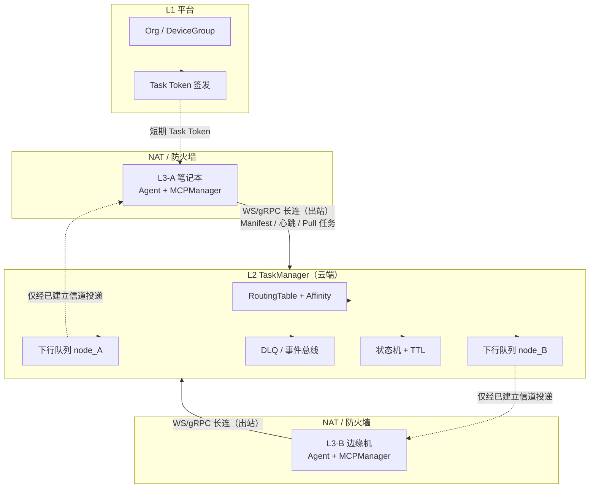
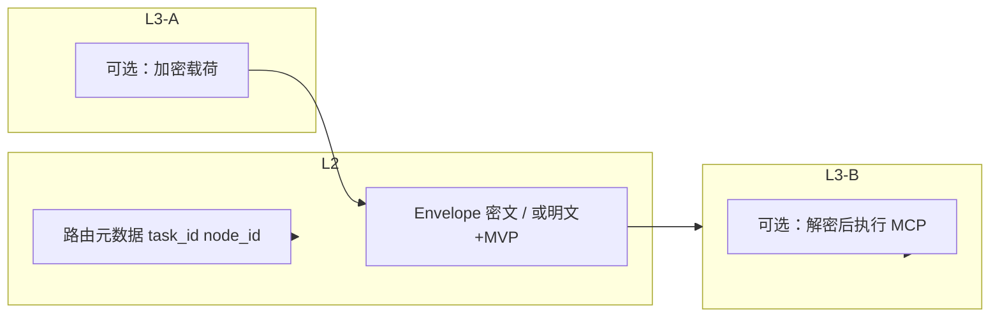
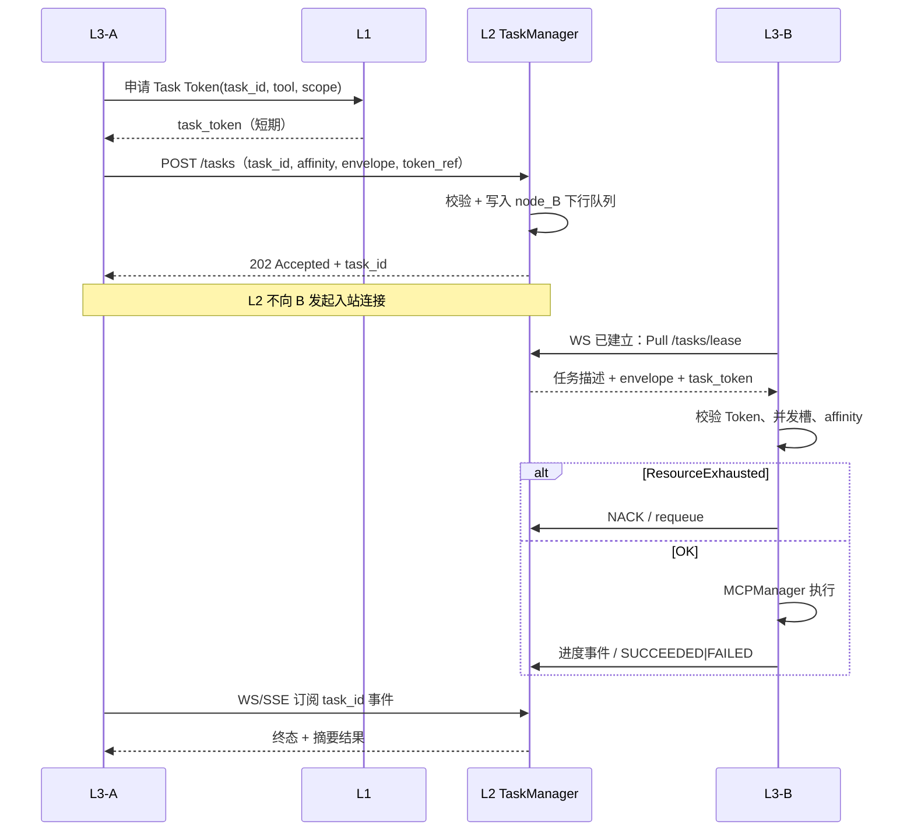

# L3 本机 MCP Host + L2 TaskManager 统一架构设计

**状态**: 设计规格（Design Spec）  
**版本**: 0.4  
**日期**: 2026-03-30  

本文档将以下目标合并为单一事实来源：在 L3 内嵌 MCPManager（本机 stdio MCP）、将 L2 定位为任务编排与能力路由（TaskManager），并系统性纳入数据引力、信任边界、异步生命周期、错误分类，以及 **NAT/拉取模型、边缘背压、环境异构、载荷隐私、降维令牌** 等约束。

**与代码的关系**：全量目标态以本文为准。**已落地（默认路径）**：L3 进程内 **stdio MCP Host**（`l3_node/mcp_stdio_bootstrap.py`，与 `~/.jachin/mcp_servers.json`、`~/.jachin/inventory/mcps/` 同源配置；官方 MCP 包不改源码）。L2 **默认不启动** `MCPManager` / 不注入侧载 stdio（`core/inventory_scanner.py` 在 L2 宿主场景跳过 MCP 扫描；`core/inventory_reloader.py` 仅在 `JACHIN_L2_STDIO_MCP=1` 时启停管理器）；`GET /api/v2/mcp/tools` 在无 L2 本机 stdio 时 **聚合 Redis** 各节点上报的 `mcp_tools`（`core/l3_redis_state.py`）。**已部分落地**：跨节点 **Redis 下行队列 + L3 Pull**（`l3_node/mcp_delegate_pull_worker.py`、`/api/v2/mcp/delegate/*`），详见 `docs/MCP_EXECUTION_MODEL.md` §三；委托载荷含 **Task Token**（`core/mcp_task_token.py`，L2 对称密钥签发；L1 中心化签发可后续演进）；委托目标 **∩ SQLite `l3_nodes` 分配**（`core/l3_node_db_filter.py`）；**LOCAL_PINNED** 工具禁止委托（`core/mcp_tool_locality.py`）。HTTP `POST /api/v3/mcp/execute` 为 **NAT 降级**，须带 `task_id`+`task_token`（或 `JACHIN_L3_MCP_EXECUTE_ALLOW_LEGACY=1`）。E2EE、与 WS 单隧道融合等待续里程碑。

---

## 1. 设计目标

| 目标 | 说明 |
|------|------|
| **本机 MCP** | L3 进程内托管 MCP Client + stdio 子进程（与官方 `@modelcontextprotocol/*` 兼容，**无需修改 npm 包源码**）。 |
| **L2 不默认代跑 MCP** | L2 以任务状态机、**每节点下行队列**、能力路由、策略与事件为主；stdio MCP 的长期默认执行面在 L3。 |
| **可路由任务受控** | 仅 **ROUTABLE** 且满足 org / device_group / **Task Token** / 错误分类 / **亲和性** 的任务可跨 L3；**LOCAL_PINNED** 永不甩锅。 |
| **拉取模型** | L2 **不得**依赖向边缘 L3 主动 `HTTP POST` 建连（NAT）；任务由 L3 经 **持久反向信道** 拉取或订阅。 |
| **与现状可演进** | 映射现有 `mcp_registry`、`/api/v2/mcp/*`、`/api/v3/mcp/execute`、inventory、L1 舰队/Device Group；允许兼容期双轨。 |

---

## 2. 分层职责

### 2.1 L1（平台）

- 组织、订阅、制品、审计配置。
- **舰队 / Device Group（P2）**：作为 **L3↔L3 任务路由的硬边界**（默认仅同组内委托）。
- **降维任务令牌（Task Token）**：签发 **单次任务、绑定 `task_id` + `tool_name`（或 capability 集合）** 的短期凭证（见 §3.9）；**禁止**在跨节点载荷中传递用户完整会话 JWT。

### 2.2 L2 — TaskManager（控制面）

**负责**

- 任务 CRUD、**异步状态机**（见 §6）、TTL、死信队列（DLQ）、事件出站。
- **每 L3 节点下行队列**（或等价 Stream 分区）：L2 **只写入队列元数据**；**由 L3 经长连接拉取（Pull / Sub）**，见 §3.5。
- **Capability Manifest** 聚合与 **路由表**：多维特征（§3.7）+ **负载信号**（§3.6）→ 候选 `node_id` 列表。
- **临时工件**：与对象存储（OSS/S3 等）签发/校验 TTL URI；可选 **E2EE 载荷信封**（§3.8，仅元数据与密文 blob id 落 L2）。
- **兼容 / 回滚**：环境变量 **`JACHIN_L2_STDIO_MCP=1`**（或 `true`/`yes`/`on`）时，L2 仍按旧路径启动 `MCPManager` 并侧载 stdio；此时 `GET /api/v2/mcp/tools` 会 **合并** Redis 聚合与 L2 本机工具。默认关闭时，L2 对 stdio MCP 仅作 **TaskManager**（委托入队、轮询结果、`invoke` 转发至 L3），不在本机起子进程跑官方 MCP 服务。

**不负责**

- 默认在 L2 宿主机上替用户执行 **LOCAL_PINNED** 工具链。
- **不能**对躲在 NAT 后的 L3-B 发起「推模式」执行调用（§3.5）。

### 2.3 L3 — 执行面 + MCP Host

**负责**

- Agent / ReAct、`run_tool`（Wasm Skill）、**内嵌 MCPManager**（本机 stdio）。
- **持久出站连接**：WebSocket / gRPC Stream 等连接 L2，用于 **Manifest 上报、心跳、拉取任务、上报进度**。
- **背压**：并发达上限时返回 **ResourceExhausted**（§3.6），L2 不得无视。
- 接收任务后：仅校验 **Task Token**（§3.9）+ 角色与策略；执行结果异步回写（经同隧道或带外上传结果句柄）。

---

## 3. 核心概念

### 3.1 Locality（本地锚点 vs 可路由）

| 取值 | 含义 | L2 跨节点路由 |
|------|------|----------------|
| **LOCAL_PINNED** | 依赖本机 FS、CDP、会话上下文、本机硬件等 | **禁止** |
| **ROUTABLE** | STATELESS 或输入仅为外部 API / **临时 URI**（checksum + TTL） | **允许**（须满足 §3.5–§3.9） |

### 3.2 错误分类

| 类型 | 含义 | L2 / TaskManager |
|------|------|------------------|
| **MissingCapability** | 允许范围内无节点声明该工具（多维匹配后仍无） | 定向查找；仍无则 **秒拒** |
| **ExecutionFailed** | 工具存在但失败（含 **环境不匹配** 导致的崩溃，§3.7） | **禁止**换节点；**FAILED** |
| **ResourceExhausted** | 边缘 CPU/并发槽位已满（§3.6） | **不**再向该节点塞任务；可重新入队或换候选 |
| **TransientInfrastructure** | 网络闪断等 | 仅 **同节点** 有限重试 |

> **环境不匹配**：Mac 与 Windows 均上报同名 `mcp:python_executor` 但脚本依赖 bash，在 Windows 上失败应归类为 **ExecutionFailed（affinity_mismatch）**，**禁止**再派其他同名节点「碰运气」，除非任务显式声明可接受的 `platform` 集合且下一节点匹配。

### 3.3 Capability Manifest — 多维特征 + 负载（修订 §3.7）

**禁止**仅用 `tool_name` 做全局等价类。Manifest 必须包含 **节点运行时剖面** 与 **负载**，供 L2 调度：

| 字段 | 说明 |
|------|------|
| `node_id`, `org_id`, `device_group_id` | 与现设计一致 |
| `os_family`, `os_version`, `arch` | 如 `darwin/arm64`, `windows/amd64` |
| `runtimes[]` | 如 `{ "python": "3.10.12", "node": "22.16.0" }` |
| `tools[]` | 每项除 `name`、`locality`、`sensitivity`、`required_role` 外，可加 `tags[]`（如 `requires_bash`） |
| `max_concurrent_tasks` | 该节点愿意同时执行的跨节点任务上限 |
| `current_load` / `in_flight_count` | 当前占用；或由 L2 根据 ACK 维护 |

L2 **RoutingTable** 键建议扩展为：`(org_id, device_group_id, tool_name, platform_constraint*) → [node_id, ...]`，排序综合 **负载权重**（§3.6）。

### 3.4 信任边界 — 组织与设备组

- 任务 **不得跨 Organization**；默认 **仅同 device_group** 内路由。
- 执行端须校验 **Task Token**（§3.9），**不得**信任载荷中的原始用户 JWT。

### 3.5 NAT 与拉取模型 — 「推模型」谬误（盲区一）

**物理现实**：L3-B 常位于 NAT / 防火墙 / 仅内网 IP 之后，**L2（公网）无法可靠向 L3-B 发起 TCP 连接到其监听端口**。

**规格约束**

- **禁止**将「L2 单播 HTTP POST 到 L3-B 的公网 URL」作为跨节点任务投递的**唯一**手段。
- **必须**采用 **持久化反向隧道**：L3-B → L2 的 **WebSocket / gRPC Stream / MQTT** 等（实现选型待定）。
- L2 将待执行任务写入 **该 `node_id` 的下行队列**（或流分区）；L3-B 在**已有长连接上**执行 **Pull / Subscribe**，领取任务后 ACK。
- **例外**：若某 L3 部署为 **有固定公网 IP 且安全组放行** 的「边缘网关」节点，可额外注册 **inbound-capable** 标志，仍建议以拉取为主、推送为辅，避免双套语义。

### 3.6 边缘背压与算力踩踏（盲区二）

- L3-B 在领取任务后若发现 **本地并发已达 `max_concurrent_tasks`** 或 CPU/内存策略触发，必须向 L2 回报 **ResourceExhausted**（或领取前通过「预占位 lease」拒绝），**不得**硬吃导致整机卡死。
- L2 调度：**结合 Manifest 的 `current_load` / `in_flight` 与权重**；支持 **抢占式/竞争消费**（多闲置 L3 从共享队列抢 **ROUTABLE** 任务，减少 L2 盲目点名），但须避免重复执行（需 **at-least-once** 语义下的幂等与去重键）。

### 3.7 环境亲和性（Affinity）（盲区三）

- 任务创建时可带 **`affinity`**：如 `os_family: ["linux","darwin"]`, `arch: ["arm64"]`, `runtimes: { "python": ">=3.10,<3.12" }`, `tags_required: ["bash"]`。
- L2 **仅**将任务匹配到 Manifest 满足约束的节点；**无匹配** → **MissingCapability**，不广播。
- 执行失败且诊断为环境原因 → **ExecutionFailed(affinity_mismatch)**，**禁止**级联换节点（除非用户显式放宽 affinity 重提任务）。

### 3.8 载荷隐私与 E2EE（盲区四）

- 默认：任务元数据 + 载荷可能经 L2 持久化（DB/Redis），依赖 **租户隔离、访问审计、最小权限**。
- **高敏场景（军工/金融等，P3 商业能力）**：引入 **端到端加密（E2EE）**：
  - L2 仅存储 **Payload Envelope**（密文 + `kid` + 非敏感路由键）；**盲路由（Blind Routing）**。
  - 解密密钥材料仅在 **L3-A（加密）与 L3-B（解密）** 侧通过 **密钥协商**（如 per-task 对称密钥由 L1/KMS 或 Double Ratchet 方案分发，细节另文）持有；L2 管理员 **不可**读取明文业务载荷。
- DLQ 中同样遵守：仅存 **error_class + task_id + 脱敏摘要** 或密文信封，禁止明文堆机密。

### 3.9 降维任务令牌 — 禁止原始 JWT（盲区五）

- **禁止**：L3-A 将 **完整用户 JWT** 放入跨节点任务载荷。若 L3-B 被攻破，攻击者可 **重放 JWT** 调用 L1 高危 API（删设备、改租户等）——**混淆代理人 + 凭证窃取**。
- **必须**：L3-A 使用自身会话向 **L1**（或 L2 代理的受控端点）申请 **Task Token**：
  - **单次或极短 TTL**、**绑定 `task_id`**、**绑定允许调用的 `tool_name` / capability**、**绑定 org + device_group**；
  - **不可**用于 L1 任意管理接口。
- L3-B **仅校验 Task Token**；拒绝则 **403** + 审计。

---

## 4. 架构图（Mermaid）

### 4.1 逻辑部署与连接方向

说明：实线箭头表示 **L3 主动建立的持久连接**；L2 **不写死**「对 NAT 后 L3 的入站 POST」。

### 4.2 数据与信任边界（含可选 E2EE）

---

## 5. 端到端流程

### 5.1 本机路径（默认）

1. 模型选择工具 `mcp:*` 或 `jpp:*` / `core:*`。
2. **MCP**：本机 MCPManager；**Skill**：`run_tool`。
3. **ExecutionFailed** → 不按 §3.2 级联换节点（Transient 同机重试除外）。

### 5.2 跨节点路径（修订：队列 + 拉取 + Token）

1. **前提**：本机 **MissingCapability**；目标工具在别节点 Manifest 中为 **ROUTABLE**；**affinity** 可满足。
2. L3-A 向 **L1** 申请 **Task Token**；向 L2 **创建任务**（`task_id`、目标能力、`affinity`、**Envelope** 明文或密文、TTL）。
3. L2：校验 org/device_group → 写入 **L3-B 的下行队列**（或分配给允许多消费者争抢的 **ROUTABLE 池**），状态 **QUEUED**；**不**对 L3-B 发起入站 HTTP。
4. L3-B：在长连接上 **Pull/Sub** 领取任务 → 校验 **Task Token** + 负载 + 本地并发 → 若满则 **ResourceExhausted** 归还队列。
5. L3-B 执行 MCP → 经隧道 **上报进度/终态**；L3-A 订阅事件或轮询 **TaskID**。
6. 失败：**DLQ** 仅存脱敏摘要或密文（§3.8）。

### 5.3 大文件

与 v0.1 一致：OSS URI + checksum + TTL；高敏下 URI 可置于 E2EE 信封内。

---

## 6. 异步任务状态机

与 v0.1 一致（QUEUED → ASSIGNED → RUNNING → 终态），补充：

- **ASSIGNED** 在拉取模型下可细分为：**LEASED**（L3-B 已领取未 ACK 完成）以防重复投递。
- **RESOURCE_EXHAUSTED** 可作为中间原因码，任务回到 **QUEUED** 或转 **FAILED**（策略可配）。

---

## 7. 流程图：跨节点任务（拉取 + Token）

---

## 8. 与当前代码库的映射（演进参考）

| 模块 | 说明 |
|------|------|
| `l3_node/mcp_stdio_bootstrap.py` | L3 启动时 `start_l3_stdio_mcp_host()`：确保 inventory 目录、`MCPManager.start()`、`scan_local_mcps(for_l2_host=False)` |
| `l3_node/primitives/mcp/registry.py` | 合并 L3 本机 stdio 工具列表；本机可执行则 `invoke_tool`，否则 `invoke_via_l2`（请求头可带 `~/.jachin/l2_gateway_config.json` 的 `X-Sub-Account-Id`） |
| `core/l2_stdio_mcp_flag.py` | `l2_stdio_mcp_enabled()` 解析 `JACHIN_L2_STDIO_MCP` |
| `core/api/routes/v2_mcp.py` | `GET /tools`：Redis 聚合 ∪（可选）L2 本机；`POST /invoke`：本机 stdio 或 **仅** 委托（Pull / HTTP 回退） |
| `invoke_via_l2`（L3→L2 HTTP） | 仍用于 L3 缺工具时的控制面入口；L2 侧委托已 **Pull 队列优先** |
| `POST /api/v3/mcp/execute` | **回退**（需 peer `l3_http_url` 可达）；主路径为 **delegate/poll + result** |
| `l3_node/mcp_delegate_pull_worker.py` | L3 拉取兄弟节点代跑任务；校验 `task_token`（可 `JACHIN_MCP_DELEGATE_ALLOW_LEGACY_NO_TOKEN=1` 排障） |
| `core/mcp_task_token.py` | L2 签发 / L3 校验委托令牌（`JACHIN_MCP_TASK_TOKEN_SECRET`） |
| `core/mcp_tool_locality.py` | LOCAL_PINNED 工具集；`~/.jachin/mcp_tool_locality.json` 可覆盖 |
| `core/l3_node_db_filter.py` | Redis 候选节点与 `l3_nodes` 表求交 |
| `l3_node/http_server.py` | `/api/v3/mcp/execute` 默认强制 Task Token |
| L1 | **中心化** Task Token 签发与吊销（替代 L2 对称密钥）待演进 |

---

## 9. 与 OpenClaw 式单机对比

不变：本机 MCP 协议层同类；本文额外强调 **NAT 现实、拉取模型、多维 Manifest、背压、E2EE 可选、降维令牌**。

---

## 10. 实施阶段建议

| 阶段 | 内容 |
|------|------|
| **P0** | L3 内嵌 MCPManager（✅ 默认）；L2 默认不跑 stdio MCP（✅）；Manifest 多维字段 MVP；**L3→L2 长连** |
| **P1** | 每节点下行队列 + **Pull lease**；Task Token；错误分类 + ResourceExhausted |
| **P2** | 负载权重；可选竞争消费；TTL + DLQ 脱敏 |
| **P3** | E2EE Envelope；军工金融合规审计 |

---

## 11. 相关文档

- `docs/MCP_EXECUTION_MODEL.md`
- `docs/JACHIN_EXECUTION_RESILIENCE_CONTRACT.md`
- `docs/L3_SLIM_DISTRIBUTION_AND_SUBSCRIBED_ARTIFACTS.md`
- `docs/API_FLEET_ACL_DRAFT.md`

---

## 12. 修订摘要

| 版本 | 摘要 |
|------|------|
| 0.1 | 初版：locality、错误类、Manifest、JWT/委托、异步状态机、与代码映射 |
| 0.2 | **NAT/拉取模型**、**背压与负载**、**多维 Manifest + affinity**、**E2EE 可选**、**Task Token 降维**；**Mermaid 架构图与跨节点时序图**；修正「L2 单播 POST 到 NAT 后 L3」表述 |
| 0.3 | **实现对齐**：L3 `mcp_stdio_bootstrap` + 同源 `mcp_servers.json` / `inventory/mcps`；L2 默认关闭 stdio `MCPManager`，`JACHIN_L2_STDIO_MCP` 回滚；`GET /tools` Redis 聚合；§8 代码映射表 |
| 0.4 | **安全最小集**：L2 签发 Task Token、委托目标 ∩ `l3_nodes`、LOCAL_PINNED 禁止跨节点、无 Redis/Pull 时错误文案标明 NAT 降级；删除根目录重复文档 `PROJECT_STRUCTURE.md`（以 `docs/FILE_STRUCTURE.md` 为准） |

---

*文档维护：架构变更或首版落地后，更新版本号与「状态」行。*
