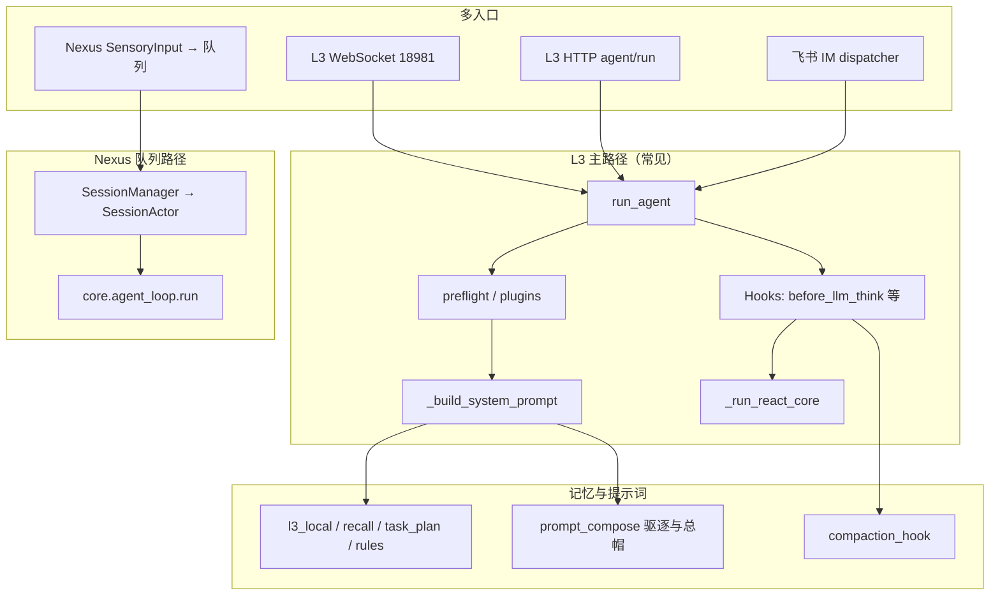

# Jachin：上下文、记忆、提示词与核心调度框架

**版本**：与仓库当前实现对齐（2026-04）  
**深度姊妹篇**：[L3_AGENT_CONTEXT_MEMORY_AND_PROMPT.md](./L3_AGENT_CONTEXT_MEMORY_AND_PROMPT.md)（Agent/ReAct/工具/记忆条目级）  
**意图路由**：[USER_INTENT_RECOGNITION_ARCHITECTURE.md](./USER_INTENT_RECOGNITION_ARCHITECTURE.md)  
**执行韧性**：[JACHIN_EXECUTION_RESILIENCE_CONTRACT.md](./JACHIN_EXECUTION_RESILIENCE_CONTRACT.md) 及 `.cursor/rules/080-jachin-execution-resilience.mdc`

本文从四条主线归纳：**上下文**（对话与元数据如何进入模型）、**记忆**（多源持久化与注入）、**提示词**（如何拼装与裁剪）、**核心调度**（任务如何入队、按会话串行、多入口汇聚）。

---

## 1. 代码入口一览

| 主题 | 主文件 / 模块 |
|------|----------------|
| L3 主 Agent / ReAct / 工具合并 | `l3_node/agent_core.py`（`run_agent`、`_run_react_core`、`_build_system_prompt`） |
| 上下文预检与短路 | `l3_node/agent_preflight.py`、`l3_node/routing/plugins.py` |
| 工具后预取 / 账本 | `l3_node/context_prefetch.py`、`l3_node/context_path_ledger.py` |
| System 后缀驱逐与总帽 | `l3_node/prompt_compose.py`（`SuffixChunk`、`apply_system_prompt_total_cap`） |
| 本地记忆文件 | `l3_node/local_memory.py`（`~/.jachin/memory/l3_local.json`、shard） |
| 核心记忆（SQLite） | `core/biological_memory.py`（`get_core_memory_for_prompt` 等） |
| 上下文折叠 / 记忆刷新 | `core/compaction_hook.py`（挂 `HOOK_BEFORE_LLM_THINK`） |
| L3 侧注册 compaction | `l3_node/l3_compaction_bridge.py` |
| Hook 常量与注册表 | `core/hooks_pipeline.py`、`l3_node/engine/hooks_pipeline.py` |
| Nexus 感官总线 + 调度 | `core/event_bus.py`（`OmniSensoryBus`、`SessionManager`、`_dispatcher_loop`） |
| Core Agent 循环（队列任务） | `core/agent_loop.py`（`run`） |
| 飞书 IM 线程池调度 | `l3_node/im_channels/dispatcher.py` |
| L3 WebSocket 终端 | `l3_node/ws_server.py` |

---

## 2. 上下文（Context）

### 2.1 定义

在 Jachin 实现中，**「上下文」**主要指：

1. **OpenAI 风格消息列表** `messages`：`system`（由 `system_prompt` 注入）+ 多轮 `user` / `assistant` / `tool` 类内容（以实际适配为准）。  
2. **`PipelineContext`**：`intent`、`messages`、`system_prompt`、`metadata`（技能列表、迭代上限、Lark chat_id、流式回调、预取账本等）。  
3. **会话级缓冲**：`_session_messages` 在 `run_agent` 边界与 WS/飞书会话文件之间同步（见下）。

### 2.2 消息从哪来、如何裁剪

- **多轮**：`run_agent(..., _session_messages=buf)` 进入时复制历史，追加本轮 `user`；结束后将 **`ctx.messages` 最近约 30 条** 写回 `buf`，控制 token 膨胀。  
- **子 Agent**：`_initial_messages` 来自 `SubAgent.messages`，结束后再写回子实例。  
- **Compaction**：当估算 token 超过 `nexus_config` → `llm.compaction_threshold` 时，`compaction_before_llm_think` 可把中间轮次折叠为 **单条「历史摘要」system 段落**，并可选触发 **memory flush**（见 §4 与 `compaction_hook.py`）。

### 2.3 入站改写（在进入 ReAct 主循环前）

- **`apply_inbound_preflight`**：招聘停止、BI 一键、分支 B、「同意」发布等 **确定性短路**；可能 **不经过 LLM** 直接返回。  
- **`apply_registered_plugins`**：域插件可改写用户消息或打 metadata。  
- **`implicit_signals` / `implicit_attribution`**：随通道传入，写入情报事件（**不等价**于记忆库，见 [IMPLICIT_SIGNALS.md](./IMPLICIT_SIGNALS.md)）。

### 2.4 工具执行后的「上下文增强」

- **Prefetch**：`context_prefetch.build_prefetch_attachment` 按关键词从工作区 `*.md` 摘段，附在 **Observation** 后（`【relevant_context_prefetch】`）；与 **`context_path_ledger`** 滑窗去重；**`background_task` 通道跳过**。  
- **`observation_dedup`**：同 run 内大块 Observation 可折叠为引用，减轻下一轮 prompt 压力。  
- **`bump_memory_inject_cycle_for_content_hit`**：工具读到与本地记忆重叠的片段时，刷新该条 **被动注入轮次**，减缓误衰减（`local_memory.py`）。

### 2.5 与「记忆」的边界

- **上下文**偏 **本轮可消费的 token 预算内的可见文本**。  
- **记忆**偏 **跨轮持久化存储 + 选择性注入**；L2 `recall_memory` 检索结果既可进 **消息/Observation**，也可 **merge 进本地 JSON**（见 §4）。

---

## 3. 记忆（Memory）

实现上是 **多源并列**，职责不同；拼装进 prompt 时由 `_build_system_prompt` + `memory_facade` / 排序逻辑统一择要。

### 3.1 L3 本地 JSON（主路径）

- **路径**：`~/.jachin/memory/l3_local.json`；**delegate 子会话**：`l3_local_shard_<id>.json`（`ContextVar`）。  
- **API**：`add_local_memory`、`get_local_memory_for_prompt`、`core:local_memory_search`（运行时检索）。  
- **策略**：条目数上限、`next_prompt_cycle`、**被动注入衰减**（`nexus_config` → `memory.passive_max_idle_runs`）、**correction 优先** 等（详见 `local_memory.py` 与 L3 文档 §4）。

### 3.2 L2 向量 / 服务记忆

- **`recall_memory`**：由 ReAct 解析层特殊处理，HTTP 调 L2；可 **`merge_from_l2`** 写入 `l3_local.json`，支持断网后仍有摘要。

### 3.3 同步侧车文件 `l3_memory.json`

- 与 L2 **`/api/v2/memory/sync`**、`MemorySyncDaemon` 协同；**与 `l3_local.json` 不是同一文件**（见 `agent_core` 内 `_load_local_memory` 注释）。

### 3.4 核心记忆 SQLite（`core_memory`）

- `core/biological_memory.py`：`add_core_memory`、`get_core_memory_for_prompt`；Compaction **memory flush** 回合可写入；供 **Core Agent / 部分 Nexus 路径** 使用，与 L3 本地 JSON **并存**。

### 3.5 工作区「规划记忆」

- **`task_plan.md` / `progress.md` / `findings.md`**：`task_planning.get_planning_context_for_prompt()` → system **后缀**；`task_plan_policy` 可做 **计划门禁**（未写计划则限制危险工具）。

### 3.6 工作区规则摘录

- **`jachin_workspace_rules.py`**：从 `JACHIN.md`、`jachin.md`、`.jachin/rules.md` 等读取，进后缀，带长度截断。

### 3.7 HR 运行时上下文

- **`hr_prompt_context.py`**：scheduler 等摘要 → system 后缀。

### 3.8 Compaction 与记忆刷新

- 超 token 阈值：**先**可选 **memory flush**（提醒模型写入 `core_memory` 等），**再** LLM 生成 **历史摘要** 替换中间消息（`compaction_hook.py`）。  
- 「历史摘要」模型默认倾向 **经济型 flash**（`compaction_summary_model` / `_get_compaction_context_summary_model`），与 memory_flush 所用模型可不同。

---

## 4. 提示词（Prompt）

### 4.1 总体形态

- **单段 `system_prompt` = `prompt_prefix` + `prompt_suffix`**（逻辑上；总帽阶段可能再截断）。  
- **前缀**（相对静态、利于 API 前缀缓存）：ReAct 说明、`intelligence_b` 计划/头脑风暴约束、前台超时提示、`build_tools_description`、recall/coordinate/delegate 说明、**输出格式**（Thought/Action/… 或 **纯 JSON 契约**）。  
- **后缀**（易变）：本地记忆、工作区规则、task_plan、HR 上下文、P1 注入、能力目录、HR SOP、`react_footer` 等。

### 4.2 纯 JSON / 用户强约束（`pure_json_contract`）

- 由 `l3_node/routing/output_format_signals.py` 分析用户文本；为真时：  
  - **本地记忆 + 工作区规则** 可并入 **前缀** `_pure_mem_rules`，**后缀块清空**（避免 Final Answer 套话与 JSON 冲突）。  
  - 可走 **`_run_direct_llm_completion`**（`response_format: json_object`）绕过 ReAct（在无工具意图且未禁用 bypass 时）。

### 4.3 瘦身模式（`prompt_style` / `slim_mode`）

- 用户强格式或轻量 JSON 请求时 **`slim_user_led`**：缩短 ReAct 脚注、收敛 HR 长 SOP 等（见 `_build_system_prompt` 分支）。

### 4.4 裁剪与硬帽（`prompt_compose.py`）

- **`compose_suffix_with_eviction`**：按 `eviction_rank` 与块大小驱逐后缀；**`react_footer` 尽量后丢**。  
- **`apply_system_prompt_total_cap`**：整段 system（含工具表）**总字符上限**（`nexus_config` → `prompt.system_prompt_max_chars`）。  
- **`prompt_suffix_max_chars`**：仅后缀预算（0 表示不限制）。

### 4.5 子 Agent

- **`SubAgent.run_once`**：不跑完整 `_build_system_prompt`，使用 **角色短 prompt + 工具表 + 简化格式**（`_system_prompt_override`）。

### 4.6 三档模型（影响「提示词长度」间接）

- **`_react_engine_for_iteration`**：编码档 / complex（如 qwen-max）/ 默认 plus；**不**改变 system 结构，但改变 **承载同样 prompt 的模型**（见 `063-l3-qwen-tri-model-routing` 规则）。

---

## 5. 核心调度框架（Scheduling / Orchestration）

系统存在 **两条「主调度」形态**，外加 **IM 专用线程池**，需分开理解。

### 5.1 Nexus 感官总线 + Session 多路复用（`core/event_bus.py`）

**目标**：多入口（语音、CLI、IM 等）归一为 `SensoryInputEvent`，持久化队列，**按 session 串行、跨 session 并行**。

| 组件 | 职责 |
|------|------|
| **`OmniSensoryBus`** | 单例；`publish_input` 写 SQLite `omni_input_queue`；`publish_output` 多路分发（含 WebSocket 等）。 |
| **`_dispatcher_loop`** | 轮询 `pending` 行，CAS 改为 `processing`，组装 `task_data`。 |
| **`SessionManager`** | `metadata.session_id` 或 `source:chat_id` 派生 session；**每 session 一个 `SessionActor`**。 |
| **`SessionActor`** | 内部 `asyncio.Queue` **串行**执行 `processor`；**空闲 300s** 回收协程。 |
| **`_process_single_task`** | 调用 **`core.agent_loop.run`**（非 `l3_node.run_agent`），带 `on_step` / `on_chunk` 广播 Sensory。 |

**要点**：此路径是 **Core Agent Loop + LiteLLM**，与 **独立 L3 进程**（下节）可并存；桌面 MIND STREAM 默认连 **L3 WS**，不一定经过该队列。

### 5.2 L3 独立进程：WebSocket + HTTP + 飞书

| 入口 | 调度方式 | 实际执行 |
|------|-----------|----------|
| **`l3_node/ws_server.py`** | 每连接内 **`await run_agent_fn`**（异步顺序）；`run_id` 区分本轮。 | `run_agent`（`l3_node/agent_core.py`） |
| **`POST /api/v3/agent/run` 等** | HTTP 层异步 handler | 通常 `run_agent` |
| **飞书 IM** | **`ThreadPoolExecutor`**（`_AGENT_EXECUTOR`）+ **按 `chat_id` 的 `threading.Lock`** | 同进程内 **`run_agent`**，避免阻塞飞书 WS 线程 |

**要点**：L3 **不经过** `SessionManager` 队列；会话隔离靠 **Lark `chat_id` 锁 + `lark_session` 文件** 或 **WS 连接状态**。

### 5.3 Hook 管道（洋葱扩展点）

- **名称**：`HOOK_BEFORE_LLM_THINK`、`HOOK_BEFORE_TOOL_EXEC`、`HOOK_AFTER_TOOL_EXEC`、`HOOK_BEFORE_RESPONSE`（及 `on_intent_received` 等）。  
- **注册**：`global_hooks.register`；**Compaction** 在 L3 启动时经 `l3_compaction_bridge` 挂到 **`before_llm_think`**。  
- **行为**：handler 可改 `ctx.messages` / `ctx.system_prompt` / `ctx.aborted`；**Compaction** 在 LLM 调用前折叠上下文。

### 5.4 ReAct 内「微调度」

- **`_parse_action`**：决定本轮是 Final Answer、工具调用、recall、coordinate、delegate。  
- **`intelligence_b_execution`**：`execution_mode`（react/planned/strict）与计划卡门禁可 **跳过或强制** 某些工具路径。  
- **取消**：`l3_run_id` 与 `agent_cancel` 注册流式 task，支持协作式中断。

### 5.5 后台任务

- **`implicit_attribution.channel == background_task`**：工具表移除 `submit_background_task`，system 关闭 delegate/coordinate；仍在 **`run_agent`** 内 ReAct，但与 **前台** 超时/预取策略隔离（见前台隔离文档）。

---

## 6. 端到端关系简图

---

## 7. 配置速查（`~/.jachin/nexus_config.json`）

| 路径 | 影响 |
|------|------|
| `llm.compaction_threshold` / `compaction_timeout_seconds` / `compaction_summary_model` | 折叠触发与摘要模型 |
| `memory.passive_max_idle_runs` | 本地记忆被动注入衰减 |
| `prompt.prompt_suffix_max_chars` / `prompt.system_prompt_max_chars` | 后缀与整段 system 硬帽 |
| `intelligence_b.*` | 计划/头脑风暴/verify 与门禁 |
| `context_prefetch.*` | 预取条数、字节、滑窗 |
| `intelligence_implicit.*` | 隐式向量信号阈值（见 IMPLICIT_SIGNALS.md） |

---

## 8. 修订记录

| 日期 | 说明 |
|------|------|
| 2026-04 | 初版：四条主线 + Nexus 与 L3 双调度 + 与 L3_AGENT_CONTEXT_MEMORY_AND_PROMPT 交叉引用 |

*若实现变更，请以 `l3_node/agent_core.py`、`core/event_bus.py`、`core/compaction_hook.py`、`l3_node/prompt_compose.py` 为准。*
