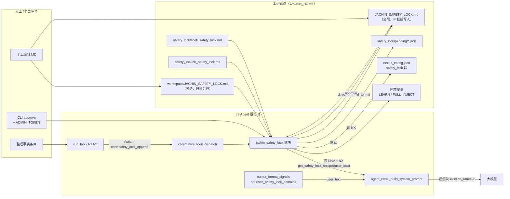
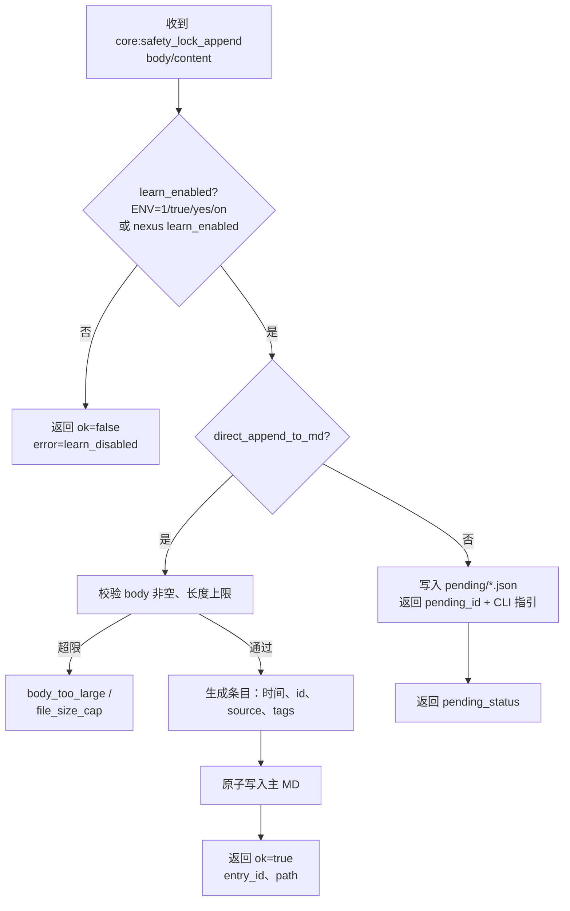
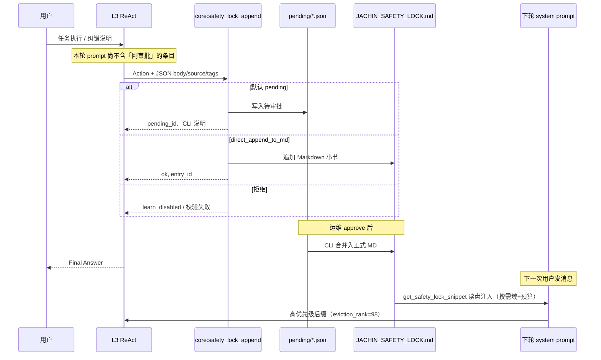
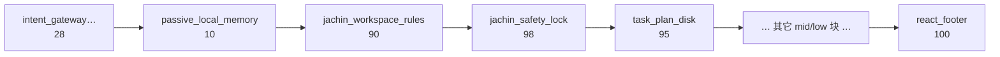
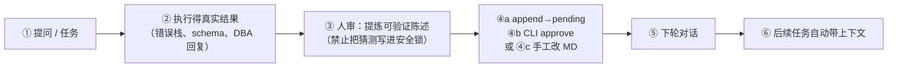

# 安全锁「学习」逻辑说明（架构与流程）

本文描述 **Jachin 安全锁** 的受控学习机制：如何把「经确认的事实」写入独立 Markdown，并在后续对话的 **system prompt** 中高优先级生效。  
**不是**无监督从聊天自动抽取知识；**是**在明确开关下，通过工具（默认 **pending**）或人工编辑落盘。

**关联文档**：[JACHIN_SAFETY_LOCK.md](./JACHIN_SAFETY_LOCK.md)（路径、开关、工具列表）· [JACHIN_SAFETY_LOCK_REMEDIATION.md](./JACHIN_SAFETY_LOCK_REMEDIATION.md)（四项风险与治理）。

---

## 1. 「学习」在本系统中的含义

| 概念 | 含义 |
|------|------|
| **学习** | 将 **已验证** 的陈述进入 **pending 或正式** `JACHIN_SAFETY_LOCK.md`，供 **下一轮及以后** 的 Agent 在 system 侧看见 |
| **非学习** | 普通对话、MEMORY.md、向量检索结果 —— 仍为「软记忆」，**不**自动升格为安全锁 |
| **控制面** | `JACHIN_SAFETY_LOCK_LEARN=1` 或 `nexus_config.safety_lock.learn_enabled`；默认 **append → pending**；正式写入需 **本机 CLI + `JACHIN_SAFETY_LOCK_ADMIN_TOKEN`** 或 `direct_append_to_md`（开发） |
| **不再使用** | 模型侧 `append_secret` / `token` 授权写 MD（已移除安全意义，见 REMEDIATION） |

---

## 2. 总体架构（组件与数据流）

**要点**：

- **工具默认写 pending**；正式 MD 由 **CLI 审批** 或 `direct_append_to_md`。
- **Prompt 来源**：按需域文件 + `pin.md` + 全局头段 / 全量合并（均 **有字符预算**），见 REMEDIATION「漏洞一」。
- **策略来源**：`JACHIN_HOME` 下 `nexus_config.json` 与安全锁模块读取的环境变量。

---

## 3. 写入决策流程（是否允许「学习」一步）

**人工审批**（进程外）：`python -m l3_node.jachin_safety_lock_admin approve <id>`，校验 **`JACHIN_SAFETY_LOCK_ADMIN_TOKEN`**。

---

## 4. 与一次对话的时序关系（闭环）

**重要**：同一次请求内 **写完再同轮依赖** 新条文，取决于该轮 system 是否已构建；通常 **下一条用户消息** 起稳定包含新内容。

---

## 5. System Prompt 中的位置与优先级（与记忆对比）

**后缀拼接顺序**（`agent_core` 中 `suffix_chunks`）中与「记忆 / 规则 / 安全锁 / 规划盘」相关的片段如下；中间还可能插入其它块（以源码为准）。

**预算不足时**：`prompt_compose.compose_suffix_with_eviction` 按 **eviction_rank 升序** 先删（rank **越小越先被删**）。安全锁 **98** 比 **90**、**95** **更晚**被删。

**注入内容**（安全锁块内部）：由 `get_safety_lock_snippet(user_text=...)` 拼装 —— **按需 db/shell 域** + `pin` + 全局头段或全量（截断），**不是**无界整文件灌入。

页脚文案：**与安全锁冲突时以安全锁为准**；并提示 pending / CLI / `core:safety_lock_remove` 等运维路径。

---

## 6. 推荐的人机协作「学习」闭环

---

## 7. 配置速查

| 方式 | 作用 |
|------|------|
| `JACHIN_SAFETY_LOCK_LEARN=1` | 允许工具提交（默认 pending） |
| `nexus_config.json` → `safety_lock.learn_enabled` | 同上 |
| `safety_lock.append_requires_approval` | 默认 `true` |
| `safety_lock.direct_append_to_md` | 开发直连写 MD |
| `JACHIN_SAFETY_LOCK_ADMIN_TOKEN` | **仅本机**，CLI `approve` / `reject` |
| `JACHIN_SAFETY_LOCK_FULL_INJECT` / `full_inject` | 全量合并注入（仍截断） |
| `inject_max_total_chars` / `legacy_global_head_chars` | 注入预算与头段 |

---

## 8. 相关源码索引

| 模块 | 职责 |
|------|------|
| `l3_node/jachin_safety_lock.py` | learn、pending、approve、remove、maintenance、`get_safety_lock_snippet` |
| `l3_node/jachin_safety_lock_admin.py` | CLI list / approve / reject / maintenance |
| `l3_node/routing/output_format_signals.py` | `heuristic_safety_lock_domains` |
| `l3_node/agent_core.py` | `_build_system_prompt`、传入 `safety_lock_user_text` |
| `l3_node/prompt_compose.py` | 后缀预算与按 rank 驱逐 |
| `core/native_tools.py` | append / list_pending / remove |
| `l3_node/primitives/tools/loader.py` | 工具描述与 Action Input 解析 |

---

## 9. 安全与运维提示

- **关闭学习**：去掉环境变量或设 `learn_enabled: false`，重启 L3。
- **管理员密钥**：仅用于 **shell 环境** 的 `jachin_safety_lock_admin`，**永不**放进模型可见的工具 Schema 或对话。
- **审计**：每条正式条目含 UTC 时间、`entry_id`、`source`；pending 保留 JSON 便于追溯。
- **撤销**：`core:safety_lock_remove`（按 `id`）；pending 用 `reject`。
- **白名单**：`allowed_skills` 场景需包含所需 `core:safety_lock_*` 工具。
- **规则膨胀与矛盾**：定期 `maintenance` + 人工压实；未来可接强模型冲突扫描（见 REMEDIATION「漏洞四」）。
