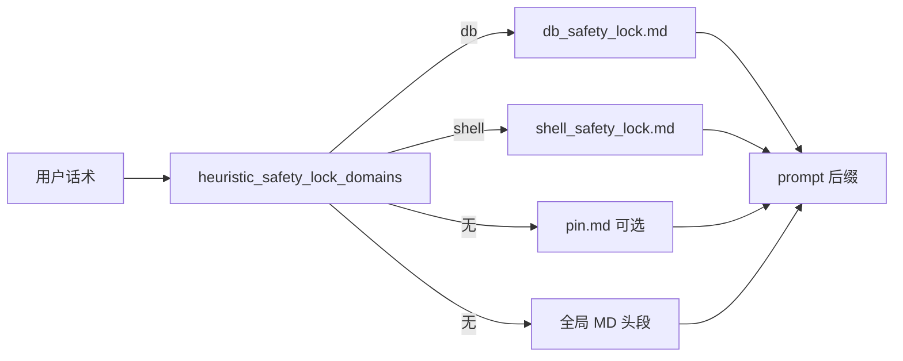
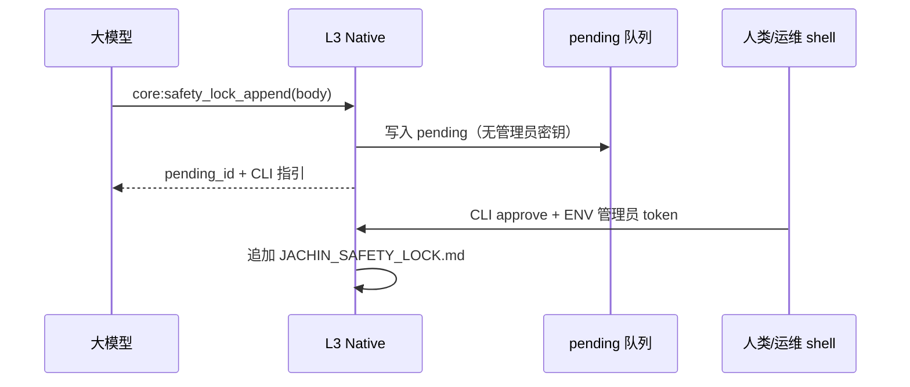

# 安全锁四项风险与治理（实现说明）

本文对应「上下文坍塌、密钥悖论、不可撤销、规则冲突」四类问题，与 **当前仓库实现** 对齐。
总索引：[JACHIN_SAFETY_LOCK.md](./JACHIN_SAFETY_LOCK.md)

---

## 漏洞一：全量注入 → 上下文坍塌

**问题**：将超大安全锁（历史上限可达数十万字符）整段塞进 system，导致 TTFT、成本与注意力漂移。

**治理（已实现）**：

1. **默认按需域挂载**：`l3_node/routing/output_format_signals.py` 中 `heuristic_safety_lock_domains(user_text)`，仅在话术命中 **db / shell** 类关键词时，读取：
   - `~/.jachin/safety_lock/db_safety_lock.md`
   - `~/.jachin/safety_lock/shell_safety_lock.md`
2. **短引 pin**：任意意图可挂载极短 `~/.jachin/safety_lock/pin.md`（建议 &lt;2k 字符）。
3. **未命中域**：仅注入全局 `JACHIN_SAFETY_LOCK.md` 的 **头段**（默认最多约 2048 字符，可由 `nexus_config.safety_lock.archived_global_head_chars` 调为 0 关闭）。
4. **总预算**：`inject_max_total_chars`（默认 8192，上限硬帽 64k）；**全量模式** `full_inject` / `JACHIN_SAFETY_LOCK_FULL_INJECT=1` 时合并全局+工作区 MD，但仍 **≤32k 字符级** 截断，禁止 40 万级灌入。

---

## 漏洞二：追加密钥 → 提示词注入悖论

**问题**：若要求模型在 tool input 中带 `append_secret`，则密钥必然进入模型上下文，易被诱导滥用。

**治理（已实现）**：

1. **废弃**「模型携带 append_secret/token 写正式 MD」的授权模型；`append_verified_fact` **忽略** token 字段（仅兼容旧客户端）。
2. **默认待审批**：`learn_enabled` 且未设 `direct_append_to_md` 时，`core:safety_lock_append` 只写 `~/.jachin/safety_lock/pending/<id>.json`。
3. **管理员密钥仅进程外**：`JACHIN_SAFETY_LOCK_ADMIN_TOKEN` 只在 **本机 shell** 使用，通过
   `python -m l3_node.jachin_safety_lock_admin approve <pending_id>` 刷入正式 MD。
   **不提供** `core:safety_lock_approve` 给 Agent 工具列表，避免模型代批。

---

## 漏洞三：只可追加不可撤销

**问题**：错误规则进入全局 MD 后，Agent 无法自助纠正。

**治理（已实现）**：

- 原生工具 **`core:safety_lock_remove`**：按正式 MD 中的 `id=`entry_id`` 删除整条条目块（分隔符定位）。
- 待审批阶段可直接 **`reject`**：`python -m l3_node.jachin_safety_lock_admin reject <pending_id>`。
- **结构化 JSONL**：当前仍以 MD 为 SSOT；若后续迁移 JSONL，可在同一文档追加「rule_id 行存储」方案（本迭代未强制改存储格式）。

---

## 漏洞四：规则内部矛盾

**问题**：长 Markdown 内「禁止 / 允许」自相矛盾时，模型行为不可预测。

**治理（已实现 + 可扩展）**：

1. **域拆分**：db / shell 分文件，减少无关规则同框。
2. **维护扫描骨架**：`run_maintenance_scan()`（`python -m l3_node.jachin_safety_lock_admin maintenance`）统计条目数与文件体积，写入 `~/.jachin/safety_lock/maintenance.log`；条目过多 / 文件过大时返回 **warnings**，提示人工压实。
3. **后续扩展（文档约定）**：夜间任务可调用强模型对合并视图做冲突摘要并开工单；当前仓库 **未** 默认启 LLM 自动合并，避免无人监督改写「法典」。

---

## 配置速查（nexus `safety_lock` 段）

| 键 | 含义 |
|----|------|
| `learn_enabled` | 与 `JACHIN_SAFETY_LOCK_LEARN` 类似，允许 Agent 提交（默认进 pending） |
| `append_requires_approval` | 默认 `true`；`false` 且未开 `direct_append` 时可调（慎用） |
| `direct_append_to_md` | `true` 时开发直连写 MD（**无**管理员 token 仍不写 pending） |
| `full_inject` / env `JACHIN_SAFETY_LOCK_FULL_INJECT` | 全量合并注入（仍截断至 ≤32k 级） |
| `inject_max_total_chars` | 默认注入总字符预算 |
| `inject_per_domain_chars` | 单域文件上限 |
| `archived_global_head_chars` | 未命中域时全局头段长度；`0` 关闭 |

---

## 相关源码

| 文件 | 说明 |
|------|------|
| `l3_node/routing/output_format_signals.py` | `heuristic_safety_lock_domains` |
| `l3_node/jachin_safety_lock.py` | 注入、pending、approve/remove、maintenance |
| `l3_node/jachin_safety_lock_admin.py` | CLI |
| `l3_node/agent_core.py` | `kernel prompt composer(..., safety_lock_user_text=...)` |
| `core/native_tools.py` | append / list_pending / remove |
