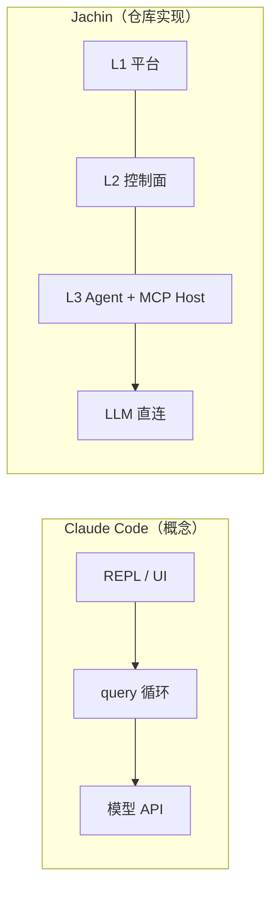
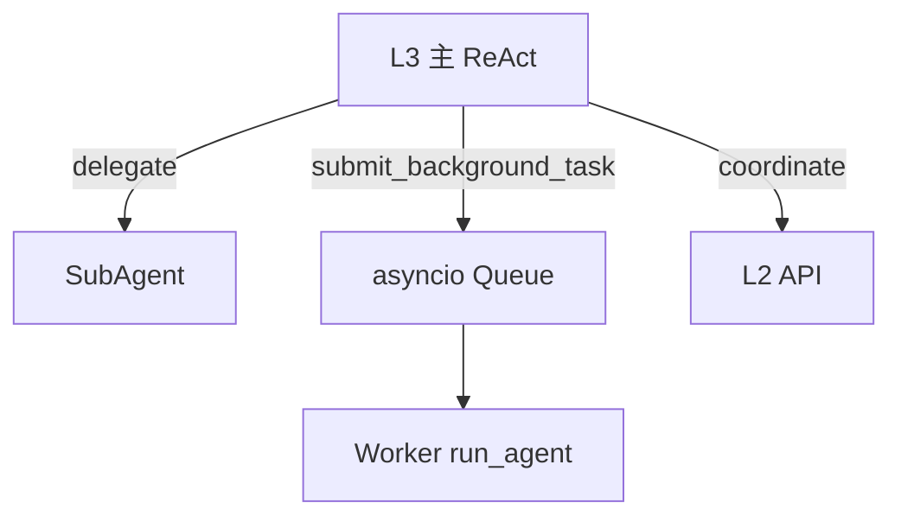

# Jachin 与 Claude Code 架构对比：上下文、记忆、Agents、MCP/Skill 与多任务

**版本**: 2026-04  
**状态**: 设计对照（Claude Code 侧为概念模型；Jachin 以本仓库代码为准）  
**相关**: [ARCHITECTURE.md](./ARCHITECTURE.md)、[arch/README.md](./arch/README.md)（**架构全景 2026**）、[Jachin 视角的「四大原语」终极架构规范.md](./Jachin%20视角的「四大原语」终极架构规范.md)（Tools/MCP/Skills/Agent Tasks **Jachin 正式定义**）、[前台闲聊与后台重负荷任务的物理隔离与背压熔断.md](./前台闲聊与后台重负荷任务的物理隔离与背压熔断.md)、[AGI_OPTIMIZATION_ROADMAP.md](./AGI_OPTIMIZATION_ROADMAP.md)（L3 智能化现状，替代旧版总览文档）、[ORCHESTRATION_ARCHITECTURE.md](./ORCHESTRATION_ARCHITECTURE.md)（**领域编排**，非 L3 主轴 SSOT）、[SKILL_MD_SPEC.md](./SKILL_MD_SPEC.md)  
> **注**：`INTELLIGENCE_UPGRADE_OVERVIEW.md` 与 `ARCHITECTURE_L3_MCP_HOST_AND_L2_TASK_MANAGER.md` 已删除，相关内容见 `AGI_OPTIMIZATION_ROADMAP.md`。

---

## 1. 文档目的与边界

| 维度 | Claude Code（对照对象） | Jachin（本仓库） |
|------|-------------------------|------------------|
| 产品定位 | 单进程 **query + 工具 + 多路记忆 + 子代理** | **云–边三层**：L1 / L2 / L3（ReAct、Wasm、本机 MCP Host） |
| 「Claude Code」 | 概念分层：`CLAUDE.md`、`memdir`、`relevant_memories`、Session Memory、Agent/Swarm 等 | 不假设对方私有实现 |

**读者收获**：术语对齐与差异清单；Jachin **已实现**与 **仍可对标的缺口**分表列出。

---

## 2. 总体拓扑对比

| 能力 | Claude Code | Jachin |
|------|-------------|--------|
| MCP 子进程默认宿主 | 与 REPL 同机 stdio | **L3**（`core/mcp_client.py`、`l3_node/mcp_stdio_bootstrap.py`）；L2 清单与委托 |
| 权限与制品 | 单机目录 + 团队策略 | **RBAC、`allowed_skills`、manifest**（L1→L2→L3） |
| 多机 / NAT | 远程隔离等 | **coordinate**、Task Token、L3 Pull（见 MCP 规格文） |

---

## 3. 对话「上下文」与记忆

### 3.1 总览表

| 管道类型（Claude 命名） | Claude Code | Jachin 对应 | 差异 |
|-------------------------|-------------|-------------|------|
| **CLAUDE.md 族** | 层级合并、`@include` | **`JACHIN.md` / `workspace/.jachin/rules.md`** → `jachin_workspace_rules.py` 注入 system；另：P1 偏好、域 `SKILL.md`、IDE `.cursor/rules` | 无 **cwd 向上多级**与 **`@include` 级联**（未实现） |
| **Git / 环境快照** | `appendSystemContext` | **未**一等实现 | 可选后续 |
| **结构化长期记忆** | memdir / `MEMORY.md` 索引 | **Memory Nexus（SQLite + FastEmbed）**、`build_l1_system_memory_block` / `get_local_memory_for_prompt`；Dream Weaver / `core_memory` 为旁路 | **memory_nexus.sqlite3** Wing/Room；宿主记忆 **不**以 L2 为默认 SSOT |
| **工具后附件预取** | sideQuery + `relevant_memories` | **`context_prefetch.build_prefetch_attachment`**：workspace `*.md` 摘录 + 路径/字节去重，拼在 Observation 后 | 无 **side-LLM 选文件**；规则扫描 |
| **Session 笔记** | fork 子循环写 md | **task_plan / progress / findings**、后台任务写 **progress.md** 一行 | 非独立 session_memory 进程模型 |
| **Agent 记忆目录** | per-agent `MEMORY.md` | **SubAgent** + `implicit_attribution`；RBAC 路径 | 无全局 agent-memory 文件树 |

### 3.2 System prompt 拼接（`agent_core._build_system_prompt`）

- **前半（相对稳定）**：执行范式（`intelligence_b`）、前台/后台说明、**工具表**、recall/coordinate/delegate、输出格式模板。  
- **后半（动态）**：**Memory Nexus L1**、JACHIN 规则摘录、task_plan 注入、**能力总目录**、HR `SKILL.md` 长文、P1、HR 运行时等。  

整体仍为单次字符串拼接；顺序已按 **前缀缓存友好** 切分（见 [前台隔离规格](./前台闲聊与后台重负荷任务的物理隔离与背压熔断.md) §5）。

### 3.3 去重、节流

| 机制 | Claude Code | Jachin |
|------|-------------|--------|
| 会话附件上限 | `MAX_SESSION_BYTES` | **context_prefetch** `_prefetch_session_bytes`；P1 **tool_invoke_cache**；本地记忆条数上限 |
| 读文件去重 | readFileState | **prefetch** `_prefetch_paths_shown` + **fs_read** 路径登记；**tool_invoke_cache**（部分工具） |
| 压缩 / reset | Compaction | **pre-reset flush**、梦境阈值 |

---

## 4. Agents 协作与子代理

| 概念 | Claude Code | Jachin |
|------|-------------|--------|
| 主会话 | `query` 主线程 | **`run_agent` / `_run_react_core`** |
| 子代理 | `runAgent` | **`delegate` → `SubAgent`** |
| 后台长任务 | `AppState.tasks`、异步 Agent | **`core:submit_background_task`** + `background_task_service` 队列与 Worker（见 [前台隔离规格](./前台闲聊与后台重负荷任务的物理隔离与背压熔断.md)） |
| 多机 | Swarm / 远程 | **`coordinate`**、MCP 委托 |
| 规划门禁 | 产品内 Plan 模式 | **`intelligence_b`**：`planned` / `strict`；**`force_universal_planning_chain`** 使 react 也走计划（子代理/后台通道豁免） |

---

## 5. MCP 与 Skill

| 维度 | Claude Code | Jachin |
|------|-------------|--------|
| 配置 | 项目/用户 MCP | **`~/.jachin/mcp_servers.json`**、inventory、`l3_mcp_cache` |
| 工具合并 | `getTools` | **`load_tools` + `mcp_registry.fetch_tools_from_l2`**（与 `allowed_skills` 过滤对齐见 `MCP_LIFECYCLE_AND_APPROVAL_FLOW.md`） |
| Skill | 仓库生态 | **`SKILL.md` + Wasm/JSP**、能力总目录（规则 079） |

---

## 6. 多任务协同

| 模式 | Claude Code | Jachin |
|------|-------------|--------|
| 同进程后台 | 任务表 + UI | **Agent 级队列**、**shell_exec background**、HR 调度、delegate |
| 跨设备 | 远程 Agent | **coordinate**、Task Token、Pull |

---

## 7. 仍可对标的缺口（非阻塞现行能力）

1. **CLAUDE 式 `@include` 与多级目录向上合并**（当前仅 workspace 单文件规则摘录）。  
2. **可选 git/cwd/租户** 注入 system（会话锚点）。  
3. **Prefetch 侧小模型选文件**（当前为关键词 + md 扫描）。  
4. **delegate 专用 memory_scope** 目录与检索路由。  
5. **桌面统一任务面板**（delegate / coordinate / 后台任务 / shell job）。  
6. **MCP 列表与 invoke 治理** 全链路闭合、**tools/list 健康检查**与用户可读错误。  
7. **低代码 MCP/Skill 向导**（产品层）。  
8. **SubAgent** 与父会话的 **provider 级 cache 字节对齐**（若使用可缓存 API）。

---

## 8. 小结

| 领域 | Claude Code | Jachin |
|------|-------------|--------|
| 上下文工程 | CLAUDE.md、附件预取成熟 | **JACHIN 规则、prefetch、动态段后置、前台超时** 已落地；缺 `@include`/git 锚点 |
| 记忆 | memdir、session fork | L2/L3 混合 + **显式 recall / local_memory_search** |
| 多任务 | 任务表叙事 | **队列 + 背压 + WS 事件** + coordinate |
| 企业特性 | 弱 | **租户、RBAC、Pull、Task Token** |

---

## 9. 修订记录

| 日期 | 说明 |
|------|------|
| 2026-04 | 初版 |
| 2026-04 | 对齐 L3 前台/后台、prefetch、超时、规划链实现；§7 收窄为剩余缺口 |
