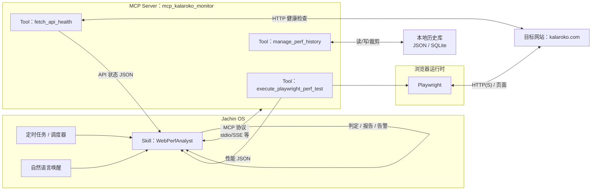
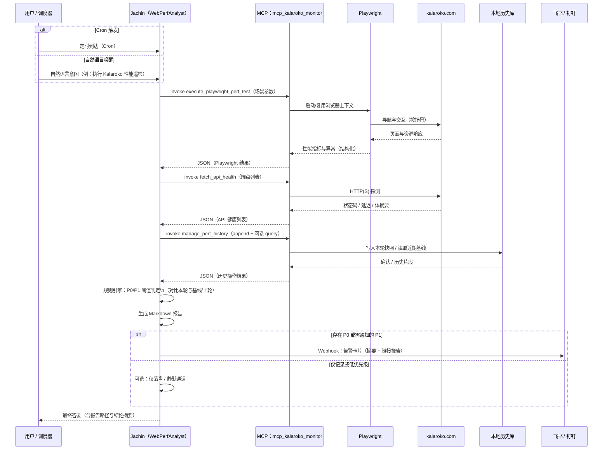

# Kalaroko Web 性能自动化监控哨兵 — 技术设计文档（TDD）

**版本**：0.1（概念设计）
**状态**：草案
**适用范围**：Jachin AI OS 上层 Skill 与 Python MCP Server 双层协作
**约束**：概念设计阶段以架构、接口与数据契约为准；实现细节在开发阶段另行落地。

---

## 1. 总体架构（System Architecture）

系统采用「Jachin OS（调度与认知层）↔ MCP Server（执行与采集层）↔ Playwright（浏览器自动化）↔ 目标站点 ↔ 本地历史库」的边界划分：上层负责任务触发、规则判定、报告与告警；MCP 负责原子化工具调用、浏览器/API 探测与历史读写；数据落盘供趋势分析与 LLM 辅助解读。



### 1.1 边界说明

| 边界 | 职责 |
|------|------|
| Jachin OS | 触发（Cron / NL）、编排调用顺序、P0/P1 规则、Markdown 报告、飞书/钉钉告警 |
| MCP Server | 无业务策略；暴露三个 Tools；返回结构化 JSON；Playwright 与 HTTP 探测的具体执行 |
| Playwright | 真实浏览器环境下的导航、指标采集、前端异常捕获（由 MCP 封装调用） |
| 目标站点 | 被测对象，不参与本系统部署 |
| 本地历史库 | 由 `manage_perf_history` 维护，供趋势对比与审计 |

---

## 2. 核心时序图（Sequence Diagram）

下图描述一次完整监控周期：从触发到采集、持久化、规则判定、产出报告与第三方告警。



---

## 3. 模块详细设计（Module Design）

### 3.1 MCP Server 层：`mcp_kalaroko_monitor`

#### 职责

- 作为**唯一**对 Playwright 与对外 HTTP 健康检查的执行入口（供 Jachin 通过 MCP 调用）。
- 将原始观测转为**稳定、可版本化**的 JSON；不包含业务上的「是否告警」决策（该决策在 Skill 层）。
- 通过 `manage_perf_history` 对本地 JSON 文件或 SQLite 进行追加、查询、保留策略执行（如按条数/按天裁剪）。

#### 与 Jachin 的接口边界

- 输入：各 Tool 的 JSON 参数（见下）。
- 输出：统一为 **JSON 对象**；错误时包含 `ok: false`、`error_code`、`message`，成功时包含 `ok: true` 与载荷字段。
- 不包含自然语言；不包含飞书/钉钉调用。

#### Tool 1：`execute_playwright_perf_test`

**语义**：在受控浏览器中执行预定义场景（如首页、指定游戏入口页），采集 Web Vitals 相关指标、资源级摘要及页面内异常。

**输入参数（概念类型）**

| 字段 | 类型 | 必填 | 说明 |
|------|------|------|------|
| `run_id` | string (UUID) | 建议 | 与本轮监控关联，便于与历史关联 |
| `base_url` | string (URL) | 是 | 默认 `https://kalaroko.com` |
| `scenarios` | array | 是 | 场景列表，每项含 `name`、`path` 或 `full_url`、`wait_until`、`timeout_ms` |
| `network_profile` | string (enum) | 否 | 如 `4g`、`3g`、`wifi`、`offline_sim`；用于标注档位，非真实运营商 |
| `viewport` | object | 否 | `width`、`height`、`device_scale_factor` |
| `collect_console` | boolean | 否 | 是否采集 console/error |
| `max_games` | integer | 否 | 限制采样的游戏入口数量（性能边界） |

**期望返回结构（成功时顶层形状）**

- `ok`: `true`
- `run_id`: string
- `captured_at`: string（ISO 8601）
- `network_profile`: string
- `homepage`: object — 首页汇总（与第 4 节 schema 对齐）
- `games`: array — 各游戏路径的 TTFB、加载状态、关键错误摘要
- `browser_exceptions`: array — 未捕获异常、页面 error 事件等
- `raw_meta`: object — 可选，Trace/版本号/浏览器 UA 等审计字段

#### Tool 2：`fetch_api_health`

**语义**：对已知 API 端点发起轻量探测（HEAD/GET 可配置），返回延迟与可用性，**不**执行业务写操作。

**输入参数**

| 字段 | 类型 | 必填 | 说明 |
|------|------|------|------|
| `run_id` | string | 建议 | 与本轮关联 |
| `endpoints` | array | 是 | 每项含 `id`、`url`、`method`、`expected_status`、`timeout_ms` |
| `parallel` | boolean | 否 | 是否并行请求（默认 true，受上限约束） |

**期望返回结构**

- `ok`: `true`
- `captured_at`: string
- `items`: array，每项包含：
  - `id`: string
  - `url`: string
  - `status_code`: integer | null
  - `latency_ms`: number
  - `healthy`: boolean
  - `error`: string | null（网络层/DNS/TLS 等短消息）

#### Tool 3：`manage_perf_history`

**语义**：本地持久化的读、写、裁剪；供 Skill 做趋势与劣化检测。

**输入参数（操作分派）**

| 字段 | 类型 | 必填 | 说明 |
|------|------|------|------|
| `operation` | string (enum) | 是 | `append` \| `query_recent` \| `prune` \| `get_by_run_id` |
| `storage` | string (enum) | 否 | `sqlite` \| `jsonl`（默认由部署约定） |
| `path` | string | 条件 | JSON/文件路径或 SQLite 路径 |
| `record` | object | `append` 时必填 | 完整一轮快照（与第 4 节 schema 兼容的子集或超集） |
| `limit` | integer | `query_recent` | 最近 N 条 |
| `older_than_days` | integer | `prune` | 删除早于该天数的记录 |
| `run_id` | string | `get_by_run_id` | 精确查询 |

**期望返回结构**

- `append`：`ok`, `stored_run_id`, `storage_path`
- `query_recent`：`ok`, `records`: array
- `prune`：`ok`, `removed_count`
- `get_by_run_id`：`ok`, `record`: object | null

---

### 3.2 Jachin Skill 层：`WebPerfAnalyst`

#### 职责

- 订阅 Cron 与 NL 意图，将用户/调度意图映射为 MCP Tool 调用序列（顺序见时序图）。
- 加载**阈值配置**与**历史基线**（通过 `manage_perf_history`），执行 P0/P1 判定。
- 生成 **Markdown 巡检报告**（含时间、结论、明细表、与上期/基线对比）。
- 在命中 P0 或策略性 P1 时，调用飞书/钉钉 Webhook（配置项：URL、密钥、模板 ID 等由 Jachin 侧注入）。

#### 触发条件

| 触发方式 | 条件 | 说明 |
|----------|------|------|
| **Cron** | 例如 `*/15 * * * *` 或业务约定的低峰窗口 | 由 Jachin 定时任务配置；到点触发完整流水线 |
| **Natural Language** | 意图匹配：如「Kalaroko 性能」「巡检」「Web Vitals」「API 健康」等 | 由 L3 意图/Skill 路由绑定；可带参数（如只测首页） |

#### P0（致命）与 P1（劣化）判定阈值

以下阈值为**建议默认值**，可在 Skill 配置中覆盖。若缺乏历史基线，首轮可采用「绝对阈值」，第二轮起启用「相对劣化」。

**P0 — 致命（建议立即告警 + 报告醒目标记）**

| 维度 | 条件（满足任一可标 P0，具体合并策略：OR + 人工可配 AND 组） |
|------|---------------------------------------------------------------|
| API 关键路径 | `fetch_api_health` 中标记为 `critical` 的端点（Skill 元数据）出现 `healthy == false` 或 `status_code` 与预期不符 |
| 首页可用性 | 首页场景 `load_status != "success"` 或 HTTP 5xx 等价信号 |
| 首页 LCP | `homepage.web_vitals.lcp_ms > 6000`（移动端视口下） |
| 首页 CLS | `homepage.web_vitals.cls > 0.25` |
| 错误风暴 | `browser_exceptions` 计数在单轮内超过配置上限（如 > 10）且含 `type: "error"` |

**P1 — 劣化（建议报告醒目标记 + 可选告警）**

| 维度 | 条件 |
|------|------|
| API 延迟 | 非 critical 端点：`latency_ms` 较 **7 日 P50 基线** 上升 ≥ 50%，且绝对值 > 800ms |
| 游戏 TTFB | 任一游戏：`ttfb_ms` 较 **上期** 上升 ≥ 30%，且绝对值 > 1200ms |
| LCP 劣化 | `lcp_ms` 较基线上升 ≥ 25%，且绝对值 > 4000ms |
| INP（若采集） | `inp_ms > 200` 或较基线显著变差（由配置定义「显著」） |

**说明**：P0 强调「不可用或接近不可用」；P1 强调「相对历史或体验明显变差」。Skill 层应支持 **静默窗口**（如连续 2 次 P1 再发告警）以降低抖动。

---

## 4. 核心数据结构（Data Schema）

以下为 MCP 聚合后返回给 Jachin / LLM 分析用的 JSON 概念 schema（Draft 2020-12 风格）。字段名与第 3 节 Tool 返回值对齐，并可直接作为 `manage_perf_history` 中 `record` 的载荷。

```json
{
  "$schema": "https://json-schema.org/draft/2020-12/schema",
  "$id": "https://jachin.local/schemas/kalaroko-perf-snapshot.json",
  "title": "KalarokoPerfSnapshot",
  "type": "object",
  "required": ["schema_version", "run_id", "captured_at", "network_profile", "homepage", "api_health", "games", "browser_exceptions"],
  "properties": {
    "schema_version": {
      "type": "string",
      "const": "1.0.0",
      "description": "载荷版本，便于历史兼容迁移"
    },
    "run_id": {
      "type": "string",
      "format": "uuid",
      "description": "单次巡检唯一 ID"
    },
    "captured_at": {
      "type": "string",
      "format": "date-time",
      "description": "ISO 8601，采集结束时间"
    },
    "network_profile": {
      "type": "string",
      "enum": ["wifi", "4g", "3g", "offline_sim", "custom"],
      "description": "网络档位标签（模拟或标注）"
    },
    "homepage": {
      "type": "object",
      "required": ["url", "load_status", "web_vitals"],
      "properties": {
        "url": { "type": "string", "format": "uri" },
        "load_status": {
          "type": "string",
          "enum": ["success", "partial", "failed", "timeout"]
        },
        "web_vitals": {
          "type": "object",
          "properties": {
            "lcp_ms": { "type": ["number", "null"] },
            "fid_ms": { "type": ["number", "null"] },
            "cls": { "type": ["number", "null"] },
            "inp_ms": { "type": ["number", "null"] },
            "ttfb_ms": { "type": ["number", "null"] }
          },
          "additionalProperties": false
        },
        "navigation_timing": {
          "type": "object",
          "description": "可选：PerformanceNavigationTiming 摘要",
          "additionalProperties": true
        }
      },
      "additionalProperties": false
    },
    "api_health": {
      "type": "array",
      "items": {
        "type": "object",
        "required": ["id", "url", "healthy", "latency_ms"],
        "properties": {
          "id": { "type": "string" },
          "url": { "type": "string", "format": "uri" },
          "method": { "type": "string", "enum": ["GET", "HEAD"] },
          "status_code": { "type": ["integer", "null"] },
          "latency_ms": { "type": "number" },
          "healthy": { "type": "boolean" },
          "error": { "type": ["string", "null"] }
        },
        "additionalProperties": false
      }
    },
    "games": {
      "type": "array",
      "description": "各游戏入口或子路由的性能摘要",
      "items": {
        "type": "object",
        "required": ["game_id", "path", "ttfb_ms", "load_status"],
        "properties": {
          "game_id": { "type": "string" },
          "path": { "type": "string" },
          "ttfb_ms": { "type": ["number", "null"] },
          "load_status": {
            "type": "string",
            "enum": ["success", "partial", "failed", "timeout", "skipped"]
          },
          "resource_errors_count": { "type": "integer", "minimum": 0 },
          "document_game_id": {
            "type": ["integer", "null"],
            "description": "与 Word/BI 监控报告小节标题一致的业务 game_id（可由场景 document_game_id 注入）"
          },
          "url_game_id": {
            "type": ["integer", "null"],
            "description": "从巡检 URL 的 gweb frameUrl 查询串解析出的 game_id（可能与文档约定因版本不一致）"
          },
          "real_engine_load_ms": {
            "type": ["number", "null"],
            "description": "墙钟：自 goto 起至 networkidle/首个 WebSocket/可选 canvas 就绪的最大耗时（毫秒），用于缓解仅测外壳 iframe 的「假加载」"
          },
          "shell_navigation_ttfb_ms": {
            "type": ["number", "null"],
            "description": "Performance Navigation Timing 派生的主文档 TTFB（毫秒），可与 real_engine_load_ms 对照；游戏场景下往往显著偏短"
          }
        },
        "additionalProperties": false
      }
    },
    "browser_exceptions": {
      "type": "array",
      "description": "控制台与页面级异常摘要",
      "items": {
        "type": "object",
        "required": ["type", "message"],
        "properties": {
          "type": {
            "type": "string",
            "enum": ["error", "warning", "pageerror", "requestfailed", "other"]
          },
          "message": { "type": "string" },
          "source": { "type": ["string", "null"] },
          "line": { "type": ["integer", "null"] }
        },
        "additionalProperties": false
      }
    },
    "aggregation_notes": {
      "type": "array",
      "items": { "type": "string" },
      "description": "可选：采样说明、降级说明等"
    }
  },
  "additionalProperties": false
}
```

### 4.1 与 LLM 分析的配合

Skill 可将本轮 `record` 与 `query_recent` 返回的最近 K 条一并压缩进上下文，由模型生成自然语言摘要；**规则判定仍以确定性阈值为主**，LLM 输出为辅助说明，避免单独作为 SLA 依据。

---

## 5. 非功能与风险（摘要）

| 项 | 说明 |
|----|------|
| **安全** | MCP 仅允许访问配置白名单主机名；Playwright 禁用任意文件上传等高危能力（部署时约束） |
| **可观测** | 每次 `run_id` 打日志；MCP 返回耗时分解（浏览器 / HTTP / 落盘） |
| **成本** | Cron 频率与 `max_games` 上限联动，防止 Playwright 实例滥用 |

---

## 6. 文档修订记录

| 版本 | 日期 | 说明 |
|------|------|------|
| 0.1 | 2026-04-17 | 首版 TDD：架构、时序、模块边界、JSON Schema |
