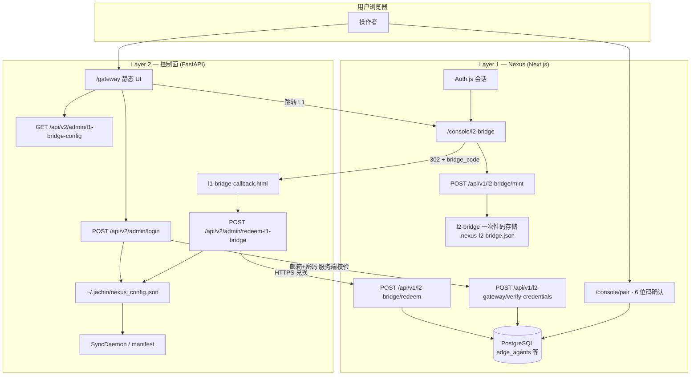
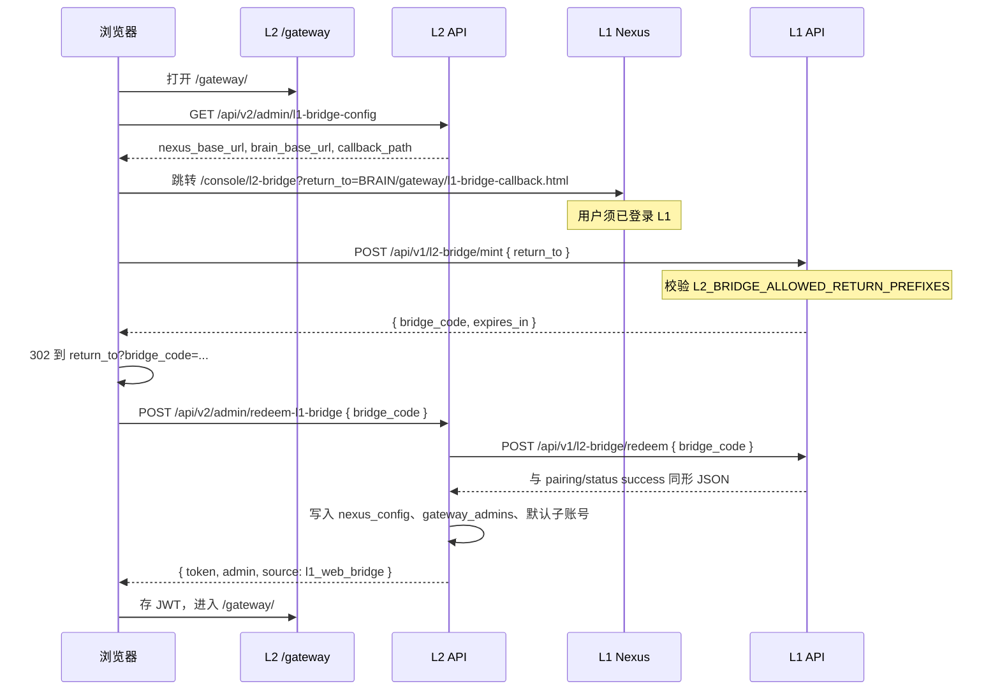
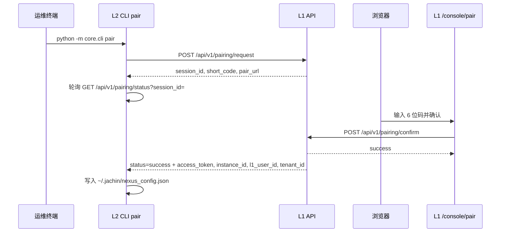

# L1 ↔ L2 配对与网关登录（邮箱 / Web Bridge / CLI）

**版本**: 2026-04  
**状态**: 与当前仓库实现一致  

本文描述 **Layer 1（Nexus）** 与 **Layer 2（控制面）** 建立信任关系的几种方式：

| 模式 | 定位 | 典型场景 |
|------|------|----------|
| **L1 邮箱 + 密码（网关表单）** | **主路径（无跳转）** | 在 L2 `/gateway/` 用户名栏填写 **L1 注册邮箱**、密码栏填写 **L1 密码**；L2 服务端调用 L1 `POST /api/v1/l2-gateway/verify-credentials` 校验，成功后写入 `nexus_config` 并签发 L2 Admin JWT |
| **Nexus 账号登录（Web Bridge）** | **主路径（浏览器跳转 OAuth）** | 点击按钮跳转 L1，在 L1 域名完成会话授权后 `mint`/`redeem`，与上表同效 |
| **6 位配对码 + CLI** | **辅助路径** | 无头服务器、仅 SSH、恢复凭证、自动化脚本；L2 执行 `python -m core.cli pair`，用户在 L1 控制台输入配对码 |

上述路径最终都收敛到同一份 **`~/.jachin/nexus_config.json`**（容器内一般为 `/root/.jachin/nexus_config.json`），供 **L1 心跳** 与 **CloudSyncDaemon** 拉取 manifest、同步 Skill/MCP 等与租户对齐。

**配对后的运行时**：邮箱登录或 `redeem-l1-bridge` 成功后会 **热重启** L1 心跳与云边同步任务（无需仅为配对而重启 L2 进程）；失败时日志会提示，必要时再整进程重启。控制台会打印 **`[L1↔L2 Pairing]`** 诊断块（`core/l2_pairing_diagnostics.py`）：配置路径、字段是否齐全、`settings.NEXUS_BASE_URL` 与文件内 `nexus_base_url` 对照、SQLite `gateway_admins` / 默认子账号等（`access_token` 仅掩码）。

---

## 0. 设计意图与常见误解（深度说明）

### 0.1 文档说的「用 L1 账号配对」到底是什么意思？

**可以**：在 L2 `/gateway/` 的「用户名 / 密码」里填写 **L1 注册邮箱 + L1 密码**。  
L2 **不存** L1 密码；`POST /api/v2/admin/login` 在识别到用户名为 **邮箱格式** 时，由 **L2 服务端** 向 L1 调用 **`POST /api/v1/l2-gateway/verify-credentials`**，在 L1 侧用 `users.password_hash` 做 bcrypt 校验。校验成功后 L1 返回 **`instance_id`、`access_token`、`l1_user_id`、`tenant_id`**，L2 写入 **`nexus_config`** 并签发 **L2 Admin JWT**（与 Web Bridge / redeem 收敛到同一套落盘字段）。

**若不用邮箱表单**，仍可通过：

1. **身份联邦（谁拥有这台 L2、租户跟谁对齐）**  
   通过上述邮箱登录、Web Bridge 或 CLI 配对，L1 侧凭证写入 L2 **`nexus_config`**，并在 L2 SQLite 把 **`gateway_admins.main_user_id`**、**`sub_accounts.main_user_id`** 绑到 **同一 L1 `users.id`**。

2. **本地网关账号（非邮箱用户名）**  
   用户名 **不是** 邮箱时，`/api/v2/admin/login` 只校验 **`gateway_admins`**（默认 **`admin` / `admin123`**），不与 L1 通信。

3. **「Nexus 账号登录」按钮**  
   浏览器跳转 L1 → 会话 Cookie 在 L1 → `mint` / `redeem` → L2 写 `nexus_config` 并返回 **L2 JWT**。适合 **OAuth-only**（L1 未设置密码）的用户；纯邮箱注册用户两种入口任选其一。

**安全（可选）**：L1 可设置 **`L1_L2_LOGIN_SHARED_SECRET`**，并要求 L2 请求头 **`X-L2-Gateway-Secret`**（L2 环境变量 **`NEXUS_L2_LOGIN_SECRET`**）与之相同，避免公网任意客户端直接撞 L1 校验接口。

### 0.2 「L1 创建的账号不就是 L2 的账号吗？」

**业务上**：可以把「同一个人、同一租户边界」理解为 **逻辑上的同一主账号**（`main_user_id` = L1 `users.id`）。

**工程上**：密码权威在 **L1**；L2 的 **`gateway_admins`** 仍用于 **本地 admin** 与 JWT 主体，但在 **邮箱登录** 成功后会 **同步 `username` 为邮箱** 并更新 **`main_user_id`**。

| | L1 Nexus | L2 `/gateway` |
|---|-----------|----------------|
| 账号存哪 | PostgreSQL `users` + Auth.js | SQLite `gateway_admins`（本地口令或联邦后对齐） |
| 典型登录标识 | 邮箱 + 密码 / OAuth | **L1 邮箱 + L1 密码**，或 **`admin`** + 本地密码 |
| 与 L1 对齐方式 | — | 邮箱登录 / Web Bridge / CLI → **`nexus_config` + `main_user_id`** |

### 0.3 我登不进 L2 管理平台时该怎么操作？

1. **推荐**：在 `/gateway/` **用户名填 L1 注册邮箱、密码填 L1 密码**（需 L2 能访问 **`NEXUS_BASE_URL`** 指向的 L1）。  
2. **OAuth-only（L1 未设密码）**：点击 **「使用 Nexus 账号登录（推荐）」** 在 L1 域名完成授权；若跳转失败，检查 **`NEXUS_BASE_URL`**、**`BRAIN_BASE_URL`**、**`L2_BRIDGE_ALLOWED_RETURN_PREFIXES`**（见 §6）。  
3. **仅本地**：**`admin` / `admin123`**（未改过密码时），再按需用 **2** 绑定 L1。  
4. **已配对、快登**：在 **已有有效 `nexus_config`** 时点 **「快速登录」**；L2 会请求 L1 **`GET /api/v1/l2-gateway/gateway-access`**（携带 `access_token`），**仅工作区 owner/admin** 可通过（需 **`NEXUS_BASE_URL` 可达**）。  
5. **无 Web**：`python -m core.cli pair` + L1 网页输 6 位码，再 **4** 或 **1**。  
6. **排障**：在 L2 标准输出搜索 **`[L1↔L2 Pairing]`**，对照心跳 URL、manifest URL 与 `NEXUS_BASE_URL` 是否可达。

### 0.4 绑好以后怎么管 L3？（L2↔L3，非 L1↔L3）

- **配对只发生在 L2↔L3**：`auth/sync` / `auth/poll` **只打 L2**，不经 L1。说明见 **[ARCHITECTURE_L1_WORKSPACE_L2_GATEWAY_L3.md](./ARCHITECTURE_L1_WORKSPACE_L2_GATEWAY_L3.md)**、**[PAIRING_PROTOCOL_SPEC.md](./PAIRING_PROTOCOL_SPEC.md)**。
- **谁能打开 `/gateway/` 管审批**：须能拿到 **有效的 L2 Admin JWT**。经 L1 的路径（邮箱登录、Web Bridge）**仅工作区 `owner` / `admin`** 可完成；**本地账号 `admin`** 为运维兜底；普通 **member** 等会收到 **403**。

---

## 1. 架构总览

**要点**：

- **Mint** 必须在 L1 侧 **已登录** 会话下调用；**Redeem** 由 L2 **服务端** 调用 L1（携带 `bridge_code`），不在浏览器暴露长期令牌。
- **邮箱登录**：浏览器把邮箱密码 POST 到 L2 **`/api/v2/admin/login`**，由 L2 服务端转发到 L1 **`verify-credentials`**；浏览器不直连 L1 该校验接口（除非自行调试）。
- **配对码路径**不经过 `l2-bridge`，直接由 L2 CLI 轮询 `GET /api/v1/pairing/status`，L1 在确认后更新 `edge_agents`。

---

## 2. 主路径 A：网关 L1 邮箱 + 密码（无跳转）

浏览器在 L2 **`/gateway/`** 将 **用户名** 填为 L1 注册邮箱、**密码** 填为 L1 密码 → `POST /api/v2/admin/login` → L2 服务端 `POST /api/v1/l2-gateway/verify-credentials`（L1 bcrypt 校验）→ 返回与 redeem 同形字段 → L2 写入 `nexus_config`、对齐 `gateway_admins`、**热启**心跳与 CloudSync → 返回 L2 Admin JWT。适合已设置 L1 密码的用户；**OAuth-only** 请用下文 Web Bridge。

---

## 3. 主路径 B：Nexus 账号登录 / Web Bridge（时序）

**安全设计摘要**：

- **`return_to` 白名单**：环境变量 **`L2_BRIDGE_ALLOWED_RETURN_PREFIXES`**（逗号分隔 URL 前缀），防止开放重定向；生产环境 **必填**（开发环境未配置时仅允许 `localhost` / `127.0.0.1`）。
- **`bridge_code`**：高熵、一次性、短时有效（默认约 10 分钟），存储于 L1 侧（含可选文件持久化 `.nexus-l2-bridge.json`）。

---

## 4. 辅助路径：6 位配对码 + CLI（时序）

**恢复模式**：CLI 支持 `--recover` + `--code`，从 L1 用码取回已成功配对的凭证（见 `core/cli.py`）。

---

## 5. 凭证与租户字段（nexus_config）

写入后常见字段（与实现一致）：

| 字段 | 说明 |
|------|------|
| `instance_id` | L1 `edge_agents.id`（Web Bridge / 邮箱登录可新建或复用活跃 agent；CLI 配对码路径为请求阶段生成的 agent） |
| `access_token` | L1 下发的 Bearer（manifest/sync 等使用） |
| `nexus_base_url` | L1 公网可达基址 |
| `l1_user_id` | 当前 L1 用户 id |
| `tenant_id` | 组织 UUID（`organizations.id`），用于 manifest 租户维度 |
| `pairing_code` | 溯源：`l1_email`（网关邮箱登录）、`web`（Web Bridge redeem）、或 CLI 6 位码字符串 |

**租户未对齐**：若日志提示 tenant 异常，可在 L2 执行 `python -m core.cli refresh-tenant`（需已有有效配对）。

---

## 6. 环境变量清单

### L1（Nexus）

| 变量 | 用途 |
|------|------|
| `L2_BRIDGE_ALLOWED_RETURN_PREFIXES` | 允许的回跳 URL 前缀，**须覆盖** L2 的 `BRAIN_BASE_URL`（例：`http://47.86.39.173:18888`） |
| `NEXUS_PUBLIC_URL` | L1 对外 URL（JWT、回调、manifest 链接等） |
| `L1_L2_LOGIN_SHARED_SECRET` | 可选；若设置，则 `verify-credentials` 须带正确 `X-L2-Gateway-Secret`（由 L2 注入） |

### L2（控制面）

| 变量 | 用途 |
|------|------|
| `NEXUS_BASE_URL` | L1 基址；**容器内必须能访问**（Docker 同机常用 `http://host.docker.internal:3000`）；邮箱登录与 redeem 均依赖此地址访问 L1 |
| `BRAIN_BASE_URL` | L2 对外基址；用于拼接 `return_to`，**须与白名单前缀一致** |
| `NEXUS_L2_LOGIN_SECRET`（L2） | 可选；与 L1 `L1_L2_LOGIN_SHARED_SECRET` 同时设置时，邮箱校验请求带 `X-L2-Gateway-Secret` |

详见仓库内 `docker/l1.env.example`、`docker/l2.env.example`、`cloud/nexus/.env.example`。

---

## 7. API 端点索引

| 方法 | 路径 | 侧 | 说明 |
|------|------|----|------|
| POST | `/api/v1/l2-gateway/verify-credentials` | L1 | L2 服务端用邮箱+密码换配对 JSON（与 redeem 同形） |
| POST | `/api/v1/l2-bridge/mint` | L1 | 需登录；body `{ return_to }` |
| POST | `/api/v1/l2-bridge/redeem` | L1 | 服务端对服务端；body `{ bridge_code }` |
| GET | `/api/v2/admin/l1-bridge-config` | L2 | 公开；返回拼接跳转用 URL 片段 |
| POST | `/api/v2/admin/redeem-l1-bridge` | L2 | 公开；浏览器回调页调用；内部请求 L1 redeem；成功后热启心跳/同步 |
| POST | `/api/v2/admin/login` | L2 | 用户名为邮箱时走 L1 verify；否则本地 `gateway_admins`；邮箱成功亦热启 |
| POST | `/api/v1/pairing/request` | L1 | CLI 发起配对 |
| POST | `/api/v1/pairing/confirm` | L1 | 网页确认 6 位码 |
| GET | `/api/v1/pairing/status` | L1 | CLI 轮询或恢复 |
| POST | `/api/v2/admin/login-with-l1` | L2 | **已有** `nexus_config` 时，用文件内凭证换 JWT（不经过网页 mint） |

---

## 8. 相关源码路径

| 组件 | 路径 |
|------|------|
| L1 bridge 存储与校验 | `cloud/nexus/src/lib/l2-bridge-store.ts`、`l2-bridge-return-to.ts` |
| L1 mint/redeem | `cloud/nexus/src/app/api/v1/l2-bridge/mint/route.ts`、`redeem/route.ts` |
| L1 邮箱校验 | `cloud/nexus/src/app/api/v1/l2-gateway/verify-credentials/route.ts` |
| L1 授权页 | `cloud/nexus/src/app/console/l2-bridge/page.tsx` |
| L2 兑换与配置 | `core/api/routes/v2_admin.py`（`login`、`l1-bridge-config`、`redeem-l1-bridge`、`_persist_l1_pairing_to_l2`） |
| L2 配对诊断日志 | `core/l2_pairing_diagnostics.py` |
| L2 热启心跳/同步 | `core/sync_daemon.py`（`hot_restart_l1_background_services`）、`core/main.py`（`app.state` 挂接 Task） |
| L2 网关 UI / 回调 | `core/admin_ui/index.html`、`core/admin_ui/l1-bridge-callback.html` |
| CLI 配对 | `core/cli.py`（`pair`、`refresh-tenant`） |
| 默认子账号 / 网关管理员 | `core/bootstrap.py`、`core/db/schema.py`（`_ensure_default_gateway_admin`） |

---

## 9. L2 网关登录入口对照

| UI 操作 | 行为 |
|---------|------|
| **L1 注册邮箱 + 密码** | 用户名填邮箱、密码填 L1 密码；L2 调 L1 `verify-credentials`；写 `nexus_config` 并热启同步（主路径、无跳转） |
| **使用 Nexus 账号登录** | Web Bridge；适合 OAuth-only 或偏好浏览器在 L1 域登录 |
| **用户名 / 密码（非邮箱）** | 仅本地 `gateway_admins`，默认 `admin` / `admin123`（生产请修改）；可先登录再配对 |
| **快速登录** | 已有 `nexus_config` 时用 `access_token` 换 JWT；L2 会调 L1 **`gateway-access`**，**仅 owner/admin** 通过（需 `NEXUS_BASE_URL`） |

---

## 10. 与运维文档的关系

- 镜像构建、ECS 目录、`docker load` 等：**[L1_LINUX_CLOUD_DEPLOY.md](./L1_LINUX_CLOUD_DEPLOY.md)** §11 及 `deploy/*-ecs-bundle/README`。
- **L2↔L3** 零信任配对：**[PAIRING_PROTOCOL_SPEC.md](./PAIRING_PROTOCOL_SPEC.md)**（与本文 **L1↔L2** 控制台配对 **并列**、**勿混为 L1↔L3**）。

---

## 11. 修订记录

| 日期 | 说明 |
|------|------|
| 2026-04 | 网关 L1 邮箱+密码登录、`verify-credentials`、配对后热启心跳/CloudSync、控制台 `[L1↔L2 Pairing]` 诊断 |
| 2026-04 | Web Bridge 与邮箱表单并列主路径；CLI 6 位码标为辅助；文档初版 |
| 2026-04 | 对齐现行架构：快速登录经 L1 `gateway-access`；L2↔L3 与 L1↔L2 分节说明 |
