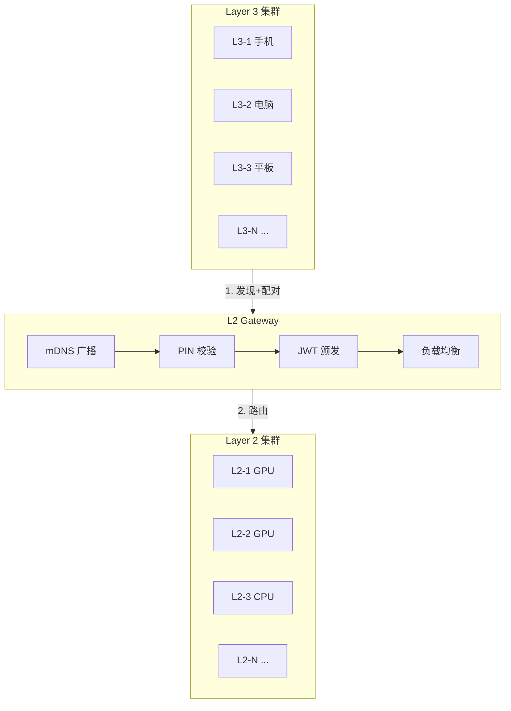
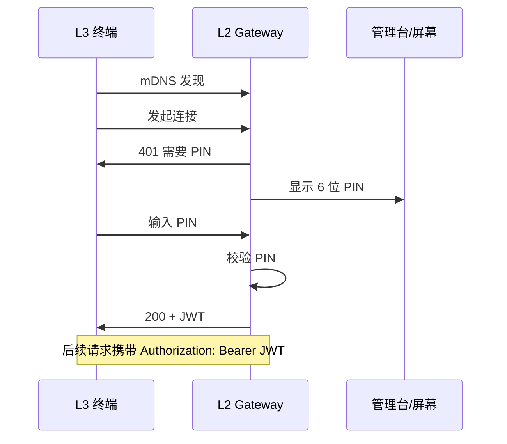
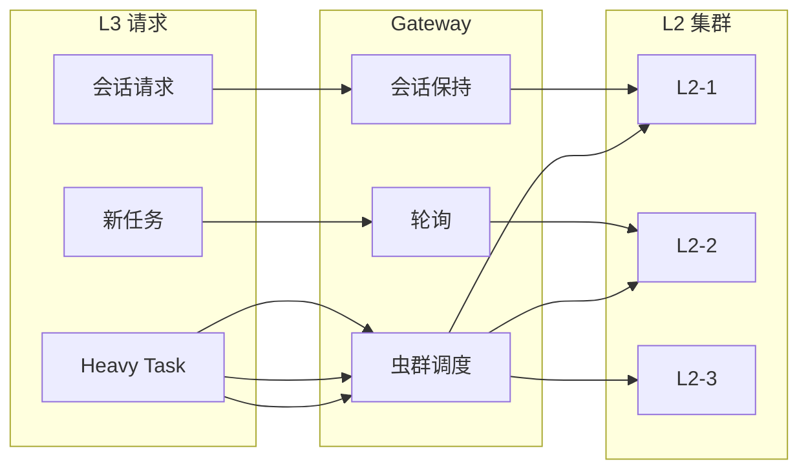

# L2 网关集群架构设计文档

**版本**: 1.0  
**状态**: 设计规范  
**定位**: 企业内网 L2/L3 集群 + 统一网关 — 配对、负载均衡、故障转移  
**V2 对齐**: [ARCHITECTURE_V2_LAYER3_STANDALONE.md](./ARCHITECTURE_V2_LAYER3_STANDALONE.md) — L3 为单体执行节点，L2 为控制面

---

## 一、架构总览

### 1.1 核心思想

> **单点入口、静默算力、无感扩展**

- **L2 Gateway**：企业内网唯一对外入口，负责 mDNS 广播、配对鉴权、路由调度
- **L2 集群**：算力节点静默部署，不对外暴露，仅向网关注册
- **L3 集群**：多台终端设备通过网关统一接入，无需感知后端拓扑

### 1.2 整体架构图

```
┌─────────────────────────────────────────────────────────────────────────────────────┐
│                              企业内网 (192.168.x.x/24)                                │
├─────────────────────────────────────────────────────────────────────────────────────┤
│                                                                                     │
│   【Layer 3 集群】  —  员工终端（手机 / 电脑 / 平板）                                    │
│                                                                                     │
│   ┌─────────┐  ┌─────────┐  ┌─────────┐  ┌─────────┐  ┌─────────┐                  │
│   │  L3-1   │  │  L3-2   │  │  L3-3   │  │  L3-4   │  │  L3-N   │  ...              │
│   │ (手机)  │  │ (电脑)  │  │ (平板)  │  │ (电脑)  │  │         │  mDNS 发现         │
│   └────┬────┘  └────┬────┘  └────┬────┘  └────┬────┘  └────┬────┘  PIN 配对          │
│        │            │            │            │            │     JWT 鉴权          │
│        └────────────┴────────────┴─────┬──────┴────────────┘                        │
│                                       │                                             │
│                                       │  WebSocket (ws://gateway:port/sensory)      │
│                                       ▼                                             │
│   ┌─────────────────────────────────────────────────────────────────────────────┐  │
│   │                    L2 Gateway（统一网关）                                     │  │
│   │  ┌─────────────────────────────────────────────────────────────────────┐   │  │
│   │  │  • 唯一 mDNS 广播: _jachin-cluster._tcp.local                         │   │  │
│   │  │  • PIN 校验 → JWT 颁发                                                │   │  │
│   │  │  • 会话保持 (Sticky Session)                                          │   │  │
│   │  │  • 任务拆分与虫群调度 (Task-Level Swarm)                               │   │  │
│   │  │  • 健康检查与故障转移 (Failover)                                       │   │  │
│   │  └─────────────────────────────────────────────────────────────────────┘   │  │
│   └───────────────────────────────────┬───────────────────────────────────────┘  │
│                                       │                                             │
│                                       │ 内部路由 / 任务队列                          │
│                                       │                                             │
│   ┌───────────────────────────────────┼───────────────────────────────────────┐  │
│   │                    【Layer 2 集群】— 算力节点（静默，不对外广播）              │  │
│   │                                   │                                         │  │
│   │   ┌─────────┐  ┌─────────┐  ┌─────────┐  ┌─────────┐  ┌─────────┐        │  │
│   │   │  L2-1   │  │  L2-2   │  │  L2-3   │  │  L2-4   │  │  L2-N   │  ...    │  │
│   │   │ (GPU)   │  │ (GPU)   │  │ (CPU)   │  │ (GPU)   │  │         │        │  │
│   │   └─────────┘  └─────────┘  └─────────┘  └─────────┘  └─────────┘        │  │
│   │                                                                         │  │
│   └─────────────────────────────────────────────────────────────────────────┘  │
│                                                                                     │
└─────────────────────────────────────────────────────────────────────────────────────┘
```

### 1.3 与 Layer 1 的关系

```
┌─────────────────────────────────────────────────────────────────────────────────┐
│                              可选：Layer 1 云端                                   │
│  ┌─────────────────────────────────────────────────────────────────────────┐   │
│  │  • 组织管理、部门/舰队管理                                                 │   │
│  │  • 策略下发、审计日志                                                      │   │
│  │  • 外网访问时的信令/中继                                                    │   │
│  └─────────────────────────────────────────────────────────────────────────┘   │
│                                       │                                           │
│                                       │ 注册 / 策略同步 / 审计上报                   │
│                                       ▼                                           │
└───────────────────────────────────────┼───────────────────────────────────────────┘
                                        │
                                        │ 内网
                                        ▼
┌─────────────────────────────────────────────────────────────────────────────────┐
│  L2 Gateway  ←→  L2 集群  ←→  L3 集群                                            │
│  （内网可完全离线运行，仅配对时可选连 Layer 1）                                     │
└─────────────────────────────────────────────────────────────────────────────────┘
```

---

## 二、舰队级配对 (Fleet Pairing)

### 2.1 配对流程

```
┌──────────┐                    ┌──────────────┐                    ┌──────────────┐
│   L3     │                    │ L2 Gateway   │                    │  L2 集群     │
│  (终端)  │                    │  (统一入口)   │                    │  (算力节点)  │
└────┬─────┘                    └──────┬───────┘                    └──────────────┘
     │                                  │
     │  1. mDNS 发现                    │
     │  _jachin-cluster._tcp.local      │
     │  → 192.168.1.10:18882           │
     │ ─────────────────────────────► │
     │                                  │
     │  2. 发起连接请求                 │
     │  ws://192.168.1.10:18882/sensory│
     │ ─────────────────────────────► │
     │                                  │
     │  3. 401 + 需要 PIN               │
     │  {"require_pin": true}          │
     │ ◄───────────────────────────── │
     │                                  │
     │                                  │  4. 网关在物理屏幕/管理台
     │                                  │     显示 6 位 PIN (如 J8K2X9)
     │                                  │
     │  5. 用户输入 PIN                 │
     │  {"pin": "J8K2X9"}              │
     │ ─────────────────────────────► │
     │                                  │
     │                                  │  6. 校验 PIN，生成 JWT
     │                                  │     (含 cluster_id, 权限, 过期时间)
     │                                  │
     │  7. 200 + JWT Token              │
     │  {"token": "eyJ...", "expires": 86400}
     │ ◄───────────────────────────── │
     │                                  │
     │  8. 后续请求携带 Authorization: Bearer <JWT>
     │ ─────────────────────────────► │
     │                                  │
     │  9. 正常 Sensory 协议通信         │
     │  {type:"input", intent:"..."}   │
     │ ◄─────────────────────────────► │
     │                                  │
```

### 2.2 配对安全

| 机制 | 说明 |
|------|------|
| **PIN 短时效** | 6 位 PIN 有效期 5 分钟，一次性使用 |
| **JWT 签名** | 网关持有密钥，L2 节点可验证 JWT 真实性 |
| **权限标识** | JWT payload 含 `cluster_id`、`role`、`dept_id`（可选） |
| **刷新机制** | 支持 refresh token 或长期 JWT（如 24h），避免频繁输 PIN |

### 2.3 配对入口展示

- **方式 A**：网关所在机器的物理屏幕显示 PIN
- **方式 B**：内网管理控制台（如 `http://gateway:8080/admin`）显示 PIN
- **方式 C**：管理员通过 Layer 1 控制台生成 PIN，下发给员工

---

## 三、负载均衡策略

### 3.1 策略一：会话保持 (Sticky Session)

**适用**：多轮对话、需要 LLM 上下文连续的场景

```
┌─────────────────────────────────────────────────────────────────────────────┐
│   L3-1 发起对话                                                              │
│        │                                                                     │
│        ▼                                                                     │
│   Gateway 根据 session_id 做一致性哈希                                         │
│        │                                                                     │
│        │  hash(session_id) % N  →  L2-2                                       │
│        │                                                                     │
│        ▼                                                                     │
│   L2-2 处理全部多轮消息，KV Cache 持续命中                                     │
│                                                                              │
│   同一 L3 的同一会话 → 始终路由到同一 L2                                        │
└─────────────────────────────────────────────────────────────────────────────┘
```

| 项目 | 说明 |
|------|------|
| **路由键** | `session_id` 或 `l3_device_id + conversation_id` |
| **算法** | 一致性哈希 (Consistent Hashing)，L2 节点变化时影响最小 |
| **效果** | 多轮对话上下文不丢失，响应延迟低 |

### 3.2 策略二：算力虫群 (Task-Level Swarm)

**适用**：可并行的重型任务（如批量 PDF 处理、批量图片压缩）

```
┌─────────────────────────────────────────────────────────────────────────────┐
│   L3 发送: "帮我将桌面的 100 份 PDF 合并提炼"                                   │
│        │                                                                     │
│        ▼                                                                     │
│   Gateway 识别为 heavy_task（或由主 L2 解析后拆单）                            │
│        │                                                                     │
│        ├──► 子任务 1  ──► 队列 ──► L2-1 抢单 ──► 完成                        │
│        ├──► 子任务 2  ──► 队列 ──► L2-3 抢单 ──► 完成                        │
│        ├──► 子任务 3  ──► 队列 ──► L2-2 抢单 ──► 完成                        │
│        └──► ...                                                              │
│        │                                                                     │
│        ▼                                                                     │
│   Gateway 聚合结果，流式/批量回传 L3                                           │
└─────────────────────────────────────────────────────────────────────────────┘
```

| 项目 | 说明 |
|------|------|
| **任务队列** | Redis List / Redis Stream / 内存队列 |
| **抢单协议** | L2 节点 `BRPOP` 或 `XREAD` 拉取任务 |
| **结果回传** | 网关维护 `task_id → L3` 映射，结果合并后推送 |
| **拆分职责** | 可由主 L2 或网关侧插件解析 `core:heavy_task` 后拆单 |

### 3.3 策略选择逻辑

```
                    ┌─────────────────┐
                    │  L3 请求到达     │
                    └────────┬────────┘
                             │
                             ▼
                    ┌─────────────────┐
                    │ 是否已有会话？   │
                    │ (session_id)    │
                    └────────┬────────┘
                             │
              ┌──────────────┴──────────────┐
              │ 是                          │ 否
              ▼                             ▼
     ┌─────────────────┐          ┌─────────────────┐
     │ 会话保持         │          │ 是否 heavy_task？│
     │ 路由到原 L2      │          └────────┬────────┘
     └─────────────────┘                   │
                              ┌────────────┴────────────┐
                              │ 是                      │ 否
                              ▼                         ▼
                     ┌─────────────────┐       ┌─────────────────┐
                     │ 虫群调度         │       │ 轮询/最少连接    │
                     │ 投递队列         │       │ 选一 L2 处理     │
                     └─────────────────┘       └─────────────────┘
```

---

## 四、故障转移 (Failover)

### 4.1 L2 节点故障

```
┌─────────────────────────────────────────────────────────────────────────────┐
│   正常:  L3 ──► Gateway ──► L2-2 (会话保持)                                   │
│                                                                              │
│   L2-2 宕机                                                                  │
│        │                                                                     │
│        ▼                                                                     │
│   Gateway 健康检查失败 (或收不到心跳)                                          │
│        │                                                                     │
│        ├── 从路由表移除 L2-2                                                   │
│        ├── 会话保持失效，L3 下次请求按「新会话」处理                             │
│        └── 轮询/哈希时排除 L2-2，选其他节点                                     │
│                                                                              │
│   L3 可能感知: 短暂卡顿或需重新发起请求（上下文可能丢失）                         │
└─────────────────────────────────────────────────────────────────────────────┘
```

### 4.2 网关故障 (SPOF 缓解)

| 方案 | 说明 |
|------|------|
| **主备 + VIP** | 双网关，主挂掉后 VIP 漂移到备 |
| **多实例 + 共享状态** | 多网关共享 Redis 会话状态，mDNS 广播多 A 记录 |
| **健康检查** | 网关定期向 Layer 1 或内部服务上报心跳 |

### 4.3 L2 注册与发现

```
┌─────────────┐                    ┌─────────────┐
│   L2 节点   │                    │   Gateway   │
└──────┬──────┘                    └──────┬──────┘
       │                                  │
       │  1. 启动时 POST /internal/register
       │     {id, host, port, capabilities, gpu}
       │ ───────────────────────────────► │
       │                                  │
       │  2. 200 OK, 加入路由表             │
       │ ◄─────────────────────────────── │
       │                                  │
       │  3. 定期心跳 GET /internal/heartbeat
       │ ───────────────────────────────► │
       │                                  │
       │  4. 超时无心跳 → 从路由表移除      │
       │                                  │
```

---

## 五、数据流详解

### 5.1 普通对话流（会话保持）

```
L3                    Gateway                    L2-2
 │                         │                         │
 │  {type:"input",         │                         │
 │   intent:"查天气"}      │                         │
 │ ─────────────────────► │  转发                    │
 │                         │ ─────────────────────► │
 │                         │                         │  Agent Loop
 │                         │                         │  LLM 推理
 │                         │  {step_type:"chunk",    │
 │                         │   content:"北京"}      │
 │                         │ ◄───────────────────── │
 │  {step_type:"chunk",    │                         │
 │   content:"北京"}       │                         │
 │ ◄───────────────────── │                         │
 │                         │                         │
 │  ... (流式 chunk)       │                         │
 │                         │                         │
 │  {step_type:"answer"}   │                         │
 │ ◄───────────────────── │                         │
```

### 5.2 虫群任务流

```
L3                    Gateway                    队列              L2-1, L2-2, ...
 │                         │                       │
 │  "100份PDF合并提炼"      │                       │
 │ ─────────────────────► │                       │
 │                         │  解析/拆单             │
 │                         │  task_1, task_2, ...  │
 │                         │ ───────────────────► │
 │                         │                       │  L2 抢单
 │                         │                       │ ──────────►
 │                         │                       │
 │                         │  result_1, result_2   │
 │                         │ ◄──────────────────── │
 │                         │  聚合                  │
 │  流式/批量结果           │                         │
 │ ◄───────────────────── │                         │
```

---

## 六、与现有 Jachin 组件的衔接

### 6.1 Sensory 协议兼容

| 现有 | 网关架构下 |
|------|------------|
| L3 连 `ws://localhost:18981/sensory` | L3 连 `ws://gateway-ip:18882/sensory` |
| 首包 `{type:"manifest", caps:[...]}` | 网关透传，或网关校验后转发 |
| `{type:"input", intent:"..."}` | 网关按策略路由到 L2，透传 |
| `{step_type:"chunk", content}` | L2 → Gateway → L3，透传 |
| `{action:"HITL_APPROVE", task_id}` | 透传，需保证路由到同一 L2（会话保持） |

### 6.2 Layer 1 集成（可选）

| 场景 | 集成方式 |
|------|----------|
| **纯内网** | 网关独立运行，不连 Layer 1 |
| **企业管控** | 网关向 Layer 1 注册 cluster，同步 org/dept 策略 |
| **审计** | 网关将配对、连接、任务日志上报 Layer 1 |
| **外网访问** | 用户在外网时，经 Layer 1 信令/中继，或 VPN 回内网 |

### 6.3 数据模型扩展建议

```
organizations
     └── departments (id, org_id, name)
              └── layer2_clusters (id, department_id, name)
                       ├── edge_agents (cluster_id)  -- L2 节点
                       └── layer3_devices (cluster_id)  -- L3 设备（可选）
```

---

## 七、实施阶段

| 阶段 | 内容 | 产出 |
|------|------|------|
| **Phase 1** | 网关 MVP | PIN 配对、JWT、WebSocket 代理、L2 注册、会话保持 |
| **Phase 2** | 虫群调度 | 任务队列、任务拆分协议、结果聚合 |
| **Phase 3** | 高可用 | 网关 HA、健康检查、故障转移 |
| **Phase 4** | Layer 1 集成 | 集群注册、策略同步、审计上报 |

---

## 八、技术选型建议

| 组件 | 建议 | 备选 |
|------|------|------|
| **网关实现** | Rust (高性能) / Go (易维护) | Node.js |
| **任务队列** | Redis Stream | Redis List（V2 已弃用 PostgreSQL LISTEN） |
| **服务发现** | mDNS (zeroconf) | 静态配置 |
| **JWT** | 标准 JWT (HS256/RS256) | 自研 token |

---

## 九、Mermaid 架构图（可渲染）

> 在支持 Mermaid 的 Markdown 查看器中可渲染为流程图

### 9.1 整体拓扑



### 9.2 配对时序



### 9.3 负载均衡策略



---

## 十、与 OpenClaw 集群架构对比

> 基准：OpenClaw 2026 年 2 月状态（单机 Hub-and-Spoke 架构）。详见 [JACHIN_VS_OPENCLAW_ANALYSIS.md](./JACHIN_VS_OPENCLAW_ANALYSIS.md)。

### 10.1 架构模式对比

| 维度 | Jachin L2 Gateway 集群 | OpenClaw |
|------|------------------------|----------|
| **拓扑** | L3 集群 → 网关 → L2 集群（三层分离） | 单 Gateway + 单 Agent Runtime（Hub-and-Spoke） |
| **入口** | 统一网关，唯一 mDNS 广播 | Gateway WebSocket 127.0.0.1:18789，单点 |
| **算力层** | 多 L2 节点静默部署，可横向扩展 | 单进程，算力上限即单机 |
| **客户端** | 多 L3 设备通过网关统一接入 | Channels（IM）+ 单控制台 |
| **负载均衡** | 会话保持 + 虫群调度，双策略 | 无，单机处理 |
| **故障转移** | 网关剔除故障 L2，路由切换 | 无，单点故障即全挂 |
| **配对** | mDNS 发现 + PIN + JWT，内网零配置 | 加密握手 + 挑战应答，无 mDNS |

### 10.2 优劣势分析

#### Jachin L2 Gateway 集群 — 优势

| 优势 | 说明 |
|------|------|
| **横向扩展** | 新增 L2 节点仅需向网关注册，L3 无感，算力线性增长 |
| **单点入口** | L3 只连网关 IP，不感知后端拓扑，部署与运维简化 |
| **安全隔离** | L2 不对外广播，攻击面集中在网关，便于管控与审计 |
| **会话保持** | 一致性哈希保证多轮对话命中同一 L2，KV Cache 复用，延迟低 |
| **算力虫群** | 重型任务可拆分并发，多 L2 抢单，吞吐高 |
| **故障转移** | L2 宕机时网关自动剔除，流量切换，L3 顶多短暂卡顿 |
| **内网配对** | mDNS + PIN，员工无需配置，扫码/输码即连 |
| **企业级** | 与 Layer 1 舰队、部门、审计可集成，支持多租户 |

#### Jachin L2 Gateway 集群 — 劣势

| 劣势 | 说明 |
|------|------|
| **新增组件** | 需部署并维护网关，运维复杂度高于单机 |
| **网关 SPOF** | 网关宕机则全集群不可用，需 HA（主备/多实例） |
| **队列依赖** | 虫群调度需 Redis 等队列，增加基础设施 |
| **实现成本** | 网关、注册、路由、聚合等逻辑需从零实现 |
| **会话迁移** | L2 故障时，会话保持失效，上下文可能丢失 |

#### OpenClaw — 优势（集群视角）

| 优势 | 说明 |
|------|------|
| **极简部署** | 单进程，无网关、无队列、无集群概念，安装即用 |
| **零运维** | 无健康检查、无路由、无故障转移，心智负担低 |
| **成熟稳定** | 234k+ stars，单机模式久经考验 |
| **低延迟** | 无代理跳转，直连 Agent，延迟最低 |

#### OpenClaw — 劣势（集群视角）

| 劣势 | 说明 |
|------|------|
| **无横向扩展** | 单机算力上限，无法通过加节点提升吞吐 |
| **无负载均衡** | 所有请求单点处理，高并发时易成为瓶颈 |
| **无故障转移** | 进程挂则全挂，无备用节点 |
| **无企业集群** | 无多节点管理、无舰队、无部门隔离 |
| **无内网配对** | 无 mDNS，多设备接入需手动配置 |

### 10.3 适用场景对比

| 场景 | Jachin L2 Gateway 集群 | OpenClaw |
|------|------------------------|----------|
| **个人单机** | 过重，可退化为单 L2 无网关 | ✅ 首选 |
| **家庭多设备** | 可选，网关 + 1～2 L2 即可 | 需多实例分别部署 |
| **企业内网（10+ 员工）** | ✅ 首选，网关 + L2 集群 | 不适用 |
| **企业内网（100+ 员工）** | ✅ 扩展 L2 即可 | 不适用 |
| **高并发推理** | ✅ 虫群调度，多卡并行 | 单机瓶颈 |
| **多轮长对话** | ✅ 会话保持，KV Cache 命中 | 单机亦可，无优势 |
| **快速试错 / PoC** | 过重 | ✅ 首选 |

### 10.4 总结

|  | Jachin L2 Gateway 集群 | OpenClaw |
|---|------------------------|----------|
| **定位** | 企业内网算力集群，L2/L3 双集群 + 网关 | 单机个人助理 |
| **核心优势** | 横向扩展、负载均衡、故障转移、内网配对 | 极简、成熟、低延迟 |
| **核心短板** | 运维复杂、网关 SPOF、实现成本高 | 无集群、无扩展、无企业管控 |
| **适用对象** | 企业、团队、多节点算力需求 | 个人、极客、快速试错 |

**结论**：Jachin L2 Gateway 集群面向**企业内网多节点算力协同**，与 OpenClaw 的**单机范式**形成互补。OpenClaw 在个人场景更轻量；Jachin 在企业集群、横向扩展、负载均衡、故障转移上具备明显优势，适合需要「多 L2 + 多 L3 + 统一入口」的团队与组织。

---

## 十一、相关文档

- [LAYER3_L2_WAN_ARCHITECTURE.md](./LAYER3_L2_WAN_ARCHITECTURE.md) — Layer 3 与 Layer 2 通信架构
- [PAIRING_PROTOCOL_SPEC.md](./PAIRING_PROTOCOL_SPEC.md) — 设备配对协议
- [10_CONTROL_DATA_PLANE.md](./whitepaper/10_CONTROL_DATA_PLANE.md) — 控制面与数据面分离
- [JACHIN_VS_OPENCLAW_ANALYSIS.md](./JACHIN_VS_OPENCLAW_ANALYSIS.md) — Jachin 与 OpenClaw 全方位对比
