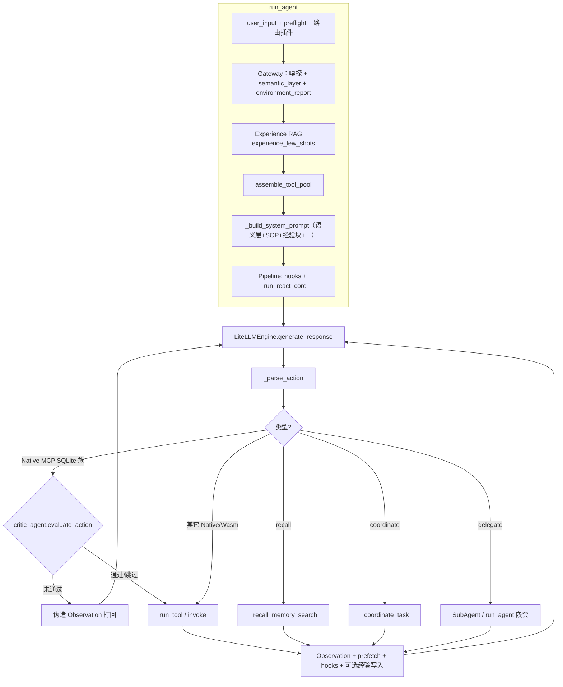

# L3 执行面深度架构：Agent、上下文、记忆与 Prompt

**版本**: 2026-04-07  
**定位**: 基于当前仓库实现的 **代码级** 说明（非愿景文档）。与 [ARCHITECTURE.md](./ARCHITECTURE.md)（三层产品架构）、[architecture/JACHIN_HYBRID_AGENT_ARCHITECTURE.md](./architecture/JACHIN_HYBRID_AGENT_ARCHITECTURE.md)（**L3 执行主轴 + L4 挂载 SSOT**）、[前台闲聊与后台重负荷任务的物理隔离与背压熔断.md](./前台闲聊与后台重负荷任务的物理隔离与背压熔断.md)（前台/后台与超时）、[INTELLIGENCE_UPGRADE_OVERVIEW.md](./INTELLIGENCE_UPGRADE_OVERVIEW.md)（智能化里程碑）互补。  
**薄弱点、路线图与「实现快照」**: [L3_LIMITATIONS_AND_REMEDIATION_ROADMAP.md](./L3_LIMITATIONS_AND_REMEDIATION_ROADMAP.md)（文内 **§〇** 与仓库同步）。

**主入口代码**: `l3_node/agent_core.py`（`run_agent`、`_build_system_prompt`、`_run_react_core`、`SubAgent`）；内联 Critic / 经验飞轮见同文件与 `critic_agent.py`、`experience_memory.py`。

**四大原语（工具层词汇）**：主 Agent 所见的 **`tools[]`** 由 **Tools**（`core:*`、`jpp:*`）与 **MCP**（`mcp:*`）等组成；**Skills** 多为注入的 SOP/白名单而非独立进程；**Agent Tasks** 指 `delegate`、`core:submit_background_task`、`coordinate` 等 **多轮子** 实体。定义见 **[Jachin 视角的「四大原语」终极架构规范.md](./Jachin%20视角的「四大原语」终极架构规范.md)**。

---

## 1. 总览：谁在「思考」

| 实体 | 说明 | 典型 `implicit_attribution.channel` |
|------|------|-------------------------------------|
| **主 Agent** | 单次 `run_agent` 驱动的 ReAct 循环；合并 Native/Wasm 工具 + MCP 工具表 | `websocket` / `lark_im` / `http_agent_run` 等 |
| **子 Agent（SubAgent）** | `delegate` 解析后 `_spawn_sub_agent_async` 创建；独立 `system_prompt`、裁剪 `allowed_skills`、`run_agent(..., _system_prompt_override=..., _initial_messages=...)` | `delegate_sub_agent` |
| **后台 Worker** | `background_task_service` 内 `await run_agent(..., implicit_attribution={"channel":"background_task","task_id":...}, _allowed_skills_override=...)`；工具表去掉 `core:submit_background_task`，system 关闭 delegate/coordinate | `background_task` |
| **非 LLM 短路** | 部分用户意图不经 ReAct：如「停止招聘」→ `stop_automated_recruitment`；BI 意图 → `run_bi_daily_report`；招聘「同意」+ JD → `_execute_publish_bypass` 等 | — |

**结论**：产品语义上的「Agents」在实现上主要是 **同一套 `run_agent` + Pipeline**，通过 **通道元数据**、**工具白名单** 和 **system 覆盖** 区分行为；**子 Agent** 是 **嵌套 `run_agent`**，带独立消息列表与角色提示词。

---

## 2. Agent 层：ReAct、解析与工具路由

### 2.1 ReAct 循环（`_run_react_core`）

- **输入**: `PipelineContext`：`messages`（OpenAI 风格 `role`/`content`）、`system_prompt`、`metadata`（含 `_skills`、`_max_iterations`、`_lark_chat_id`、`_implicit_channel` 等）。
- **每轮**:
  1. `global_hooks.run(HOOK_BEFORE_LLM_THINK, ctx)`
  2. 组装 `full_messages = [system] + messages`，调用 `LiteLLMEngine.generate_response`（温度、max_tokens、用途标签 `l3_call_purpose` 等）。
  3. 解析输出：`_parse_action` 识别 `Final Answer` / `delegate` / `recall_memory` / `coordinate` / 具体 `tool_id`。
  4. **门禁**（见 §5）: `intelligence_b` 计划卡/头脑风暴卡、`task_plan_policy` 等可能 `continue` 下一轮而不执行工具。
  5. **SQLite 族路径**：在 `HOOK_BEFORE_TOOL_EXEC` 之前可经 **`critic_agent.evaluate_action`** 内联审查；未通过则注入伪造 `Observation` 并 `continue`，**不**执行真实工具（见混合架构白皮书 §3–§4）。
  6. 执行工具：MCP 走 `mcp_registry.invoke`；Native/Wasm 走 `run_tool`；伪动作 `recall` / `coordinate` / `delegate` 走专用分支。
  7. `global_hooks.run(HOOK_AFTER_TOOL_EXEC, ctx)`；工具后可拼接 **prefetch**（§4.4）；**read_query/write_query** 成功且门控允许时可 **`experience_memory.save_successful_action`**（经验飞轮）。
  8. 将 `Observation` 写回 `messages`，直到 `Final Answer` 或达到迭代上限。

- **迭代上限**: `MAX_REACT_ITERATIONS`（默认 8）；`run_agent` 的 `max_iterations` 写入 `ctx.metadata["_max_iterations"]` 供后台任务等覆盖。

- **三档模型路由**: `_react_engine_for_iteration` — 编程档（`_l3_coder_mode`，`LLM_CODER_MODEL`）优先；否则满足阈值或 intelligence planned/strict 时用 `LLM_COMPLEX_MODEL`（默认 qwen-max）；否则 `LLM_MODEL`（默认 qwen3.5-plus）。详见 `.cursor/rules/063-l3-qwen-tri-model-routing.mdc`。

### 2.2 伪工具与 L2（非 `run_tool`）

- **`recall_memory`**: 解析为 `type: recall` → `_recall_memory_search`（HTTP 调 L2）；成功后可 **`merge_from_l2`** 写入本地记忆文件（见 §4.2）。
- **`coordinate`**: 解析为 `type: coordinate` → `_coordinate_task`（L2 编排 API + 子任务轮询）；**strict·verify 轮** 等场景下可能被禁止。
- **`delegate`**: 解析为 `type: delegate` → 并行/串行 `_run_sub_agent`；子任务结果拼成 Observation。

### 2.3 子 Agent（`SubAgent` / `_spawn_sub_agent_async`）

- **角色表**: `SUB_AGENT_PROMPTS`、`SUB_AGENT_ALLOWED_SKILLS`（`coder` / `writer` / `researcher` / `default`）；`coder` 可切换 **独立 `LiteLLMEngine` 实例**（编码模型）。
- **全局白名单交集**: 若 L2 下发 `allowed_skills`，子 Agent 允许列表与之 **求交**。
- **服务开关**: `_get_service_switches()` 可按角色禁用子 Agent。
- **复用**: `_sub_agent_registry[sub_agent_id]` 保留历史 `messages`，`spawn_sub_agent` 可传同一 `sub_agent_id` 续聊。

### 2.4 主 Agent 工具表组装与 Prompt 前增强（`run_agent` 开头）

1. **网关入站**：`apply_gateway_ingress_pipeline`（澄清、嗅探、`semantic_layer`、`environment_report` 等）。
2. **Experience RAG**：`experience_memory.format_experience_block_for_prompt` → `_build_system_prompt(..., experience_few_shots=...)` 注入 `[HISTORY_FEW_SHOTS]`。
3. `await assemble_tool_pool(...)` — 合并 Native / Wasm / MCP（白名单、隐式 SQLite 只读扩展等）。
4. **后台通道**: 从工具表移除 `core:submit_background_task`；`_build_system_prompt(..., allow_delegate=False, allow_coordinate=False)`。

---

## 3. 上下文（Context）

### 3.1 消息列表 `messages`

- **多轮会话**: `run_agent(..., _session_messages=buf)` 时，进入前复制 `buf`，追加本轮 `user`；结束后将 **`ctx.messages` 最近 30 条** 写回 `buf`（防 token 膨胀，同时保留「同意」等关键上文）。
- **子 Agent**: `_initial_messages` 来自 `SubAgent.messages`，结束后助手回复追加回写。

### 3.2 入站预检与插件（用户消息改写）

在组装本轮 `user` 与 `PipelineContext` 之前，**`l3_node/agent_preflight.apply_inbound_preflight`** 处理 HR/招聘/BI 等确定性分支（停止招聘、BI 一键、分支 B、「同意」发布短路等）；**`l3_node/routing/plugins.apply_registered_plugins`** 可追加域突变。产出仍写在 **user 消息内容**上（非整段替换 system），用于约束下一轮 LLM。详细清单以 `agent_preflight.py` 与已注册插件为准。**停止招聘** 的短语匹配须避免把句中无关的「取消/停止」（如「场地被取消」）当成 HR 指令，否则会 **短路返回固定文案且不调用 LLM**。

### 3.3 `PipelineContext.metadata`（与「上下文工程」相关的键）

| 键 | 用途 |
|----|------|
| `_skills` / `_skills_unfiltered` | 当前可见工具列表 |
| `_max_iterations` | ReAct 上限 |
| `_lark_chat_id` | 飞书会话隔离 pending JD、归因 |
| `_implicit_channel` | `background_task` / `delegate_sub_agent` / 空；影响计划门禁、prefetch、前台超时豁免 |
| `_allowed_skills` | 执行层白名单（可与 run_agent 入参覆盖一致） |
| `_on_step` / `_on_chunk` | 流式/步骤回调 |
| `_react_iteration` | 当前 ReAct 轮次（从 1 递增）；供 `context_prefetch` 与 **`context_path_ledger`** 滑窗去重 |
| `_gateway_bundle` | 网关包（含 `extra["semantic_layer"]`、`environment_report` 等） |
| `_l4_exp_save_gate` / `_l4_critic_reject_streak` | 经验写入门控、Critic 连续打回计数（SQLite 路径） |
| `_system_prompt_extras` | 含 `semantic_layer`、`experience_few_shots` 等，供 strict verify 轮重建 system |
| `_context_path_ledger` | `path_key → last_seen_react_iteration`（prefetch / 读路径登记，见 `context_path_ledger.py`） |
| Prefetch 相关 | `_prefetch_paths_shown`、`_prefetch_session_bytes`（路径滑窗与会话字节预算） |

### 3.4 洋葱钩子（`l3_node/engine/hooks_pipeline.py`）

- **全局** `global_hooks`：`on_intent_received`、`before_llm_think`、`before_tool_exec`、`after_tool_exec`、`before_response`。
- **Pipeline 默认链**: `on_intent_mw` → `react_mw`（`_run_react_core`）→ `pre_resp_mw`；扩展能力可通过注册 hook 介入同一 `ctx`。

### 3.5 前台同步与工具后附件

- **超时**: `_invoke_react_tool` 对非豁免工具 `asyncio.wait_for`（MCP 直接 await；Native `asyncio.to_thread(run_tool)`）。豁免策略见 `foreground_tool_policy` + MCP `long_running` 元数据（见前台隔离规格文档）。
- **Prefetch**: 工具执行后 `context_prefetch.build_prefetch_attachment`，按意图关键词从 workspace `*.md` 摘录，拼到 Observation 后（标记 `【relevant_context_prefetch】`）；**`core:fs_read` / `mcp:read_file` 路径** 与账本 **`ledger_iteration_window`** 协同去重；大块 Observation 可经 **`observation_dedup`** 在同 run 内折叠为引用。**`background_task` 通道跳过**预取。

---

## 4. 记忆（Memory）

实现上是 **多条并列链路**，用途不同，勿混为一谈。

### 4.1 `~/.jachin/memory/l3_local.json` 与 shard（`l3_node/local_memory.py`）

- **主文件**: `~/.jachin/memory/l3_local.json`。 **子 Agent / delegate**: 同目录 **`l3_local_shard_<id>.json`**（`ContextVar` 分片，避免与主会话混写）。
- **形态**: JSON 数组条目 `{tag, content, source, timestamp, ...}`（可含 `last_prompt_inject_cycle`、`last_accessed_turn` 等），上限约 200 条/文件。
- **写入**: `add_local_memory`；**L2 recall 成功后** `merge_from_l2` 去重合并。
- **注入 Prompt**: `get_local_memory_for_prompt`（经 **`memory_facade` / 统一排序 `local_memory_ranking`**）→ system 后缀 `【本地记忆】`；**correction 优先**；**被动衰减** 与 **`next_prompt_cycle`、`passive_max_idle_runs`**（`nexus_config` → `memory`）联动。

### 4.2 L2 向量/服务记忆：`recall_memory`

- **非注册工具名**：由 `_parse_action` 特殊解析，走 `_recall_memory_search`（带 `tool_call_cache`）。
- **与本地关系**: 检索结果可合并进 `l3_local.json`，支持断网后仍有一部分上下文。

### 4.3 `core:local_memory_search`（Native 工具）

- **语义**: 运行时 **按查询** 检索本地记忆与可选 `MEMORY.md` 等（半衰、MMR 等在 `local_memory_search.py`）；与 **prompt 被动注入** 互补。Prompt 中通常有 **一行 SSOT**（以主动检索为准、被动仅为提示），减少两路摘要冲突感。

### 4.4 `~/.jachin/l3_memory.json` + `MemorySyncDaemon`

- **用途**: 与 L2 **`/api/v2/memory/sync`** 的 **同步载荷**（含梦境优化回写）；结构为 `{"entries": [...], "updated_at"}` 类（见 `agent_core` 内 `_load_local_memory`）。
- **守护**: `MemorySyncDaemon` 定时 `sync_memory_to_l2`；高价值本地写入可通过 **`memory_sync_signals`**  bump 代数，使守护进程在 **分片睡眠** 内提前进入下一轮同步。与 `l3_local.json` **不是同一文件**。

### 4.5 工作区「规划记忆」：`task_planning.py`

- **文件**: `~/.jachin/workspace/task_plan.md`、`progress.md`、`findings.md`（及 HR 子目录变体）。
- **注入**: `get_planning_context_for_prompt()` → system 后缀；用于 **跨会话续任务**。
- **门禁**: `task_plan_policy` 可要求先写 `task_plan.md` 才允许写文件/Shell/delegate/coordinate。

### 4.6 工作区规则摘录：`jachin_workspace_rules.py`

- **来源**: `workspace/JACHIN.md`、`jachin.md`、`.jachin/rules.md`。
- **注入**: system 后缀，有最大字符截断。

### 4.7 HR 运行时摘要：`hr_prompt_context.py`

- **注入**: `get_hr_recruitment_runtime_context_for_prompt()` → system 后缀（scheduler 状态等）。

### 4.8 隐式信号与情报事件

- `implicit_signals` / `implicit_attribution` → `emit_intelligence_event`、`apply_session_implicit_events`、`emit_embedding_implicit_signals` 等（详见 [IMPLICIT_SIGNALS.md](./IMPLICIT_SIGNALS.md)）。**不等同于**长期记忆库，偏 **会话与产品分析管线**。

---

## 5. Prompt 拼装（`_build_system_prompt`）

### 5.1 结构：前缀 + 后缀（前缀缓存友好）

- **前缀 `prompt_prefix`（相对静态）**  
  - ReAct 范式说明  
  - `intelligence_b`：`execution_mode`（react/planned/strict）、`force_universal_planning_chain`、brainstorm/计划卡要求、strict 下 verify 说明  
  - 前台/后台隔离与同步超时预算（`chat_task_hint`）  
  - **可用工具表** `build_tools_description(tools)`  
  - `recall_memory` / `core:local_memory_search` 提示（视 L2 配置）  
  - `coordinate`、`delegate` 提示（视开关）  
  - 固定 **输出格式**：Thought / Action / Action Input / Observation / Final Answer  
  - 分隔说明：`--- 以下段落随会话、记忆与域状态变化 ---`

- **后缀 `prompt_suffix`（易变、宜靠后）**  
  - 经 **`prompt_compose.compose_suffix_with_eviction`** 按 **tier** 组装，并受 **`nexus_config` → `prompt_suffix_max_chars`** 硬帽约束，超标时打 **`prompt_suffix_eviction`** 日志（低优先级先裁）。  
  - **本地记忆** `get_local_memory_for_prompt`（与 facade/排序一致）  
  - **JACHIN 工作区规则**  
  - **task_plan / progress 上下文** `get_planning_context_for_prompt`  
  - **HR 运行时上下文**  
  - **P1 注入** `intelligence_p1.get_p1_prompt_injections`  
  - **能力总目录** `build_capability_prompt_inject_for_tools(tools)`  
  - **HR SKILL.md 长 SOP**（工具集含招聘 MCP 时；**无招聘意图时可整块收敛**，见 `recruitment_longform` + `intent_signals`）  
  - **任务规划短提示** `plan_hint`  
  - **HR 透析镜工具强制说明** `hr_hint`  
  - **Final Answer 约束**（禁止篡改 Observation、HR 成功句式等）

### 5.2 子 Agent 的 system

- `SubAgent.run_once`：**不**走完整 `_build_system_prompt`，而是  
  `system = 角色 short prompt + 可用工具 + 简化输出格式`，再 `run_agent(..., _system_prompt_override=system, _initial_messages=self.messages)`。

### 5.3 与配置的关系

- **`nexus_config.json` → `intelligence_b`**: `execution_mode`、`force_universal_planning_chain`、`require_brainstorm_card`、`verify_round_extra_tools` 等（`intelligence_b_execution.py`）。  
- **`foreground_tools`**: 同步超时、豁免列表、MCP `long_running` 元数据（见前台隔离文档）。  
- **`context_prefetch`**: 预取条数、字节上限、**`path_sliding_window_size`**、**`ledger_iteration_window`**。  
- **`memory`**: **`passive_max_idle_runs`** 等被动注入衰减。  
- **`prompt_suffix_max_chars`**: 后缀硬帽（`prompt_compose`）。

---

## 6. 数据流简图（Mermaid）

---

## 7. 修订记录

| 日期 | 说明 |
|------|------|
| 2026-04 | 初版：对齐当前 `agent_core` / `local_memory` / `task_planning` / `intelligence_b` / MCP 合并逻辑 |
| 2026-04-02 | 预检/插件、metadata 账本与 prefetch/dedup、shard 记忆、`prompt_compose` 硬帽、MemorySync 急迫信号；与路线图 §〇 一致 |
| 2026-04-02 | 增补四大原语（Tools/MCP/Skills/Agent Tasks）引用与文内说明 |
| 2026-04-07 | 对齐混合架构白皮书：网关/语义层、Experience RAG、内联 Critic、metadata 键与 Mermaid 主路径 |
