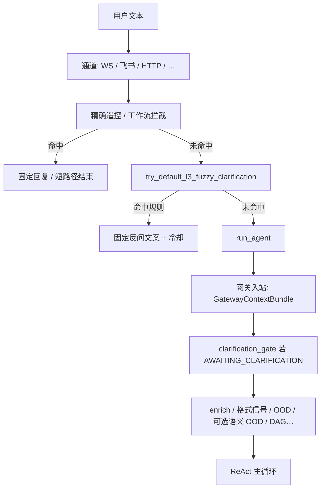
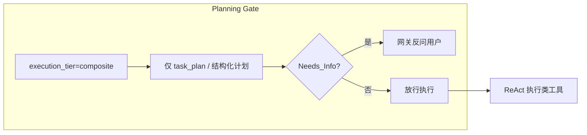

# L3 模糊 / 不标准用户指令 — 架构说明

**版本**: 1.3（2026-04）  
**SSOT 路径**: `docs/L3_AMBIGUOUS_INTENT_ARCHITECTURE.md`（本文档为「模糊与不标准指令」的**现状架构 + 痛点对标 + 目标态改造方案**单一事实来源。）

**范围**: 用户说法**不清晰、不标准、或处于「澄清会话」**时，系统在**不调主 ReAct 模型**与**调主模型**之间如何分工；以及相对 **OpenClaw 类「先规划再执行」**产品的差距与建议演进。

**非目标**: 本文**不**声称已实现单一全局「模糊度打分模型」；**§1–§5** 描述**当前仓库行为**，**§6–§7** 含**对标分析与路线图**（部分能力已有雏形，见各小节标注）。

**相关文档**:

- 意图总览（入站 → ReAct 前）: [USER_INTENT_RECOGNITION_ARCHITECTURE.md](./USER_INTENT_RECOGNITION_ARCHITECTURE.md)  
- 模糊遥控澄清（规则引擎 + HR 插件）: [L3_FUZZY_INTENT_CLARIFICATION.md](./L3_FUZZY_INTENT_CLARIFICATION.md)  
- 网关战役与配置快照: [USER_INTENT_RECOGNITION_REMEDIATION_PLAN.md](./USER_INTENT_RECOGNITION_REMEDIATION_PLAN.md)  
- 执行面规划与 task_plan 门禁: [L3_AGENT_CONTEXT_MEMORY_AND_PROMPT.md](./L3_AGENT_CONTEXT_MEMORY_AND_PROMPT.md)、`l3_node/task_plan_policy.py`  
- Cursor 规则: `.cursor/rules/085-l3-fuzzy-intent-clarification.mdc`  
- 风险缓释与槽位: `global_escape_hatch.py`、`slot_filling_guard.py`、`slot_filling_session.py`、`slot_specs.py`、`slot_clarification_llm.py`、`plan_static_linter.py`、`registry.py`（`required_slots`）

---

## 1. 「模糊」在系统里的几种含义

| 类型 | 用户表现 | 系统期望行为 |
|------|----------|----------------|
| **A. 短句遥控但不标准** | 像业务口令但用词随意（尤其 IM） | 优先**固定反问**，引导发**明确短指令**（通常**不调 LLM**） |
| **B. 已在澄清态中的续句** | 助理刚问过选项，用户短答或换话题 | **TTL / 打断词 / 漂移检测** 更新会话状态；**尚无**通用「实体 → ID」消解 |
| **C. 开放域长句语义不清** | 任务描述含糊、缺参数、多步边界不清 | 主要由 **ReAct + 主模型** 边想边调工具；**尚无**强制的「先规划再执行」闸门 |
| **D. 表面异常 / 非业务域** | 乱码夹带、纯闲聊（若开启语义闸） | **L0.5 规则 OOD** 或 **L1.5 小模型语义 OOD**（可配置） |

A 与 B 以**确定性/规则为主**；C 以**模型为主**；D 为**安全与域策略**。

---

## 2. 总数据流（谁先谁后）— 现状

**要点**:

1. **精确优先**：各通道必须先跑本通道精确匹配（如 `try_lark_workflow_command_intercept`），未命中再进模糊澄清框架（见 `L3_FUZZY_INTENT_CLARIFICATION.md`）。  
2. **模糊澄清不抢答闲聊**：单独「好的」「同意」等**无动作短句** intentionally **不**在澄清层抢答，交给 Agent 与上下文（产品约束）。  
3. **`run_agent` 内**的网关流水线与主模型是**另一条轴**，与 A 类模糊澄清**叠加**而非互斥。

---

## 3. 组件与代码落点

### 3.1 L3 模糊意图澄清（类型 A）

| 项 | 说明 |
|----|------|
| **引擎** | `l3_node/intent_clarification.py`：`ClarificationRule`、`try_fuzzy_clarification`、`try_default_l3_fuzzy_clarification` |
| **规则注册** | `default_l3_clarification_rules()` 汇总各域插件 |
| **当前域插件** | `l3_node/intent_clarification_plugins/hr_recruitment_lark.py`（招聘·飞书） |
| **冷却** | 默认按 `(channel_id, rule_id, text.casefold())` 约 **12s** 去重，防刷屏 |
| **入口** | 通道在「精确未命中」分支调用；详见 `L3_FUZZY_INTENT_CLARIFICATION.md` |

**输出**: 命中则直接返回 `reply` 字符串；**不**进入 `run_agent`（除非调用方另行分支）。

**局限（对标 §6）**: 新域依赖**手写规则**，无 **Schema 驱动的通用必填槽位**与自动生成追问。

---

### 3.2 网关澄清门控（类型 B）

| 项 | 说明 |
|----|------|
| **触发条件** | `GatewayContextBundle.system_state == AWAITING_CLARIFICATION` |
| **实现** | `l3_node/intent_gateway/clarification_gate.py` → `apply_clarification_gate` |
| **调用点** | `l3_node/intent_gateway/gateway_pipeline.py` → `apply_gateway_ingress_pipeline` |
| **行为** | **TTL 过期** → 恢复 `NORMAL`；**打断词**（可配置）→ 退出澄清态；**漂移**：用户极短句与上一轮助理「澄清式问句」**字二元组重叠**低于阈值 → 结束澄清态 |

**配置**（`nexus_config.json` → `intent_gateway`）:

- `clarification_drift_overlap_min`  
- `clarification_interrupt_keywords`（缺省用代码内默认列表）

**与 A 的区别**: A 是「首句像遥控但不标准」；B 是「**已经**在等多轮澄清时的后续句」。

**局限（对标 §6）**: 对「那个比较卡的」这类**指代消解**没有标准路径映射到 **hostname / 实体 ID**；漂移检测可能**误退出**澄清态或把压力全丢回 ReAct。

---

### 3.3 `run_agent` 内与「模糊」相关的网关能力（类型 C / D）

进入 `l3_node/agent_core.run_agent` 后，在拼 system prompt 与主循环前，可能依次涉及（**按配置开关**）：

| 能力 | 作用 | 与模糊的关系 |
|------|------|----------------|
| **L0.5 `ood_signals`** | 键盘乱码、混合注入等**表面**异常 | **硬拦**整轮主模型；非「语义模糊」 |
| **L1.5 `semantic_ood_llm`** | 小模型判 `in_domain` / `out_of_domain` / `uncertain` | **默认关闭**；`uncertain` **fail-open**，不因「有点模糊」就拒答 |
| **可选扩写 / Embedding 路由** | `classification_llm_rewrite`、`embedding_router` | 改善分类面，**不**等价于专用模糊分类器 |
| **DAG 拆分** | 启发式或 LLM + `dependency_analysis` | 复合意图结构；与「缺参数」正交 |

细节与默认项见 `l3_node/intent_gateway/config.py`、`USER_INTENT_RECOGNITION_REMEDIATION_PLAN.md`。

---

### 3.4 主 Agent（类型 C 的主路径）

- **开放域**、信息不足、需追问或选工具：由 **ReAct 内主模型 + tools** 处理。  
- 系统**没有**单独的「全局模糊度 → 必澄清」微服务；也**没有**与 OpenClaw 同构的**强制 Brainstorm → Plan → Execute** 状态机。  
- **已有雏形（非等价）**: `gateway_planning_mandatory`（多子意图等）+ `execution_inject` 注入规划说明；`task_plan_policy.task_plan_gate_blocks_action` + 可选 `force_task_plan_file` 可在**部分动作前**要求已写 `task_plan.md`。这属于**软/硬门禁片段**，**不**保证「规划阶段仅产出计划、缺信息则只追问不碰执行工具」。  
- 观测误判时需结合：通道、是否 direct bypass、thought/action 日志、隐式信号等（见 `USER_INTENT_RECOGNITION_ARCHITECTURE.md` §6）。

---

## 4. 配置与扩展清单（现状）

| 目标 | 建议动作 |
|------|----------|
| 新业务域「短句模糊遥控」 | 在 `intent_clarification_plugins/` 新增规则集，并在 `default_l3_clarification_rules()` 注册；更新 `L3_FUZZY_INTENT_CLARIFICATION.md` §6 |
| 调整澄清会话 TTL / 打断 / 漂移 | 改 `intent_gateway` 配置 + 上游写入 `AWAITING_CLARIFICATION` 与 `clarification_deadline_ts` 的逻辑 |
| 企业节点收紧「闲聊」 | 开启 `semantic_ood_llm_enabled` 等（见 `semantic_ood_llm.py` / `config.py`），注意 `uncertain` 仍放行 |
| 复合意图死锁可见性 | `dag_splitting_enabled` + `dag_splitting_llm_enabled`；环检测见 `topology.validate_subintent_dag` |
| 强化 C 类「先计划」 | 见 **§7.2** 与 `task_plan_policy.py` / `intelligence_b_execution.get_force_task_plan_file()` |

---

## 5. 小结表（现状）

| 用户输入特征 | 主要处理机制 | 典型是否调主 ReAct LLM |
|--------------|----------------|-------------------------|
| 像遥控但不标准（短、命中插件） | `intent_clarification` | 否（固定反问） |
| 澄清态续答 | `clarification_gate` | 可能进入（取决于是否已 `run_agent`） |
| 长句任务不清 | ReAct + 工具 | 是 |
| 乱码 / 夹带 | L0.5 OOD | 否（硬拦或改道） |
| 流利但非业务域（可选） | L1.5 语义 OOD | 否（仅当 `out_of_domain` 且置信够） |

---

## 6. 现状痛点与 OpenClaw 对标（分析）

以下对标**描述产品/架构取向**，OpenClaw 具体实现以对方版本为准；目的是明确 Jachin **差距与风险**，而非逐 API 对比。

### 6.1 C 类：ReAct「无头苍蝇」困境

| 维度 | Jachin 现状 | OpenClaw 取向（参考） |
|------|-------------|------------------------|
| **长句模糊任务** | 主要进入 **ReAct**，由模型在 Thought/Action 中自行试探工具；缺参时可能多轮空转、幻觉调用或晚失败 | 常见模式强调 **先 brainstorm/plan，再 execute**；在规划阶段暴露**缺参**并**先追问用户**，减少「执行到一半才报错」 |
| **风险** | 工具白名单与 prompt 可缓解，但**无强制**「规划态与执行态」分离 | 规划与执行分离可降低无效工具调用与 Token 浪费 |

**结论**: Jachin 需在网关或执行策略上显式引入 **Planning Gate（§7.2）**，而不是仅依赖 ReAct 自觉。

---

### 6.2 B 类：澄清状态机的「失忆与死胡同」

| 维度 | Jachin 现状 | OpenClaw 取向（参考） |
|------|-------------|------------------------|
| **澄清续答** | TTL、打断词、**字二元组漂移**；**无**标准「选项列表 → 实体 ID」映射 | 更强调整合**记忆与观测**（如运行时状态），做**指代消解**与参数收敛 |
| **风险** | 用户答「那个比较卡的」时，易被当作漂移退出澄清，或进入 ReAct 后仍无法绑定 **hostname / 服务名** | 易形成**挂死感**或**错误执行对象** |

**结论**: 需在 `AWAITING_CLARIFICATION` 下增加 **Entity Resolver（§7.3）** 路径，与漂移检测**并行或优先**于简单漂移判死刑。

---

### 6.3 A 类与「意图补全」缺位

| 维度 | Jachin 现状 | 目标取向 |
|------|-------------|----------|
| **短句模糊** | **域插件 + 固定文案**，扩展靠加规则 | **Schema 驱动**：注册意图时声明 **required_slots**，缺槽则**禁止**下 ReAct，统一走澄清 |
| **未知业务域** | 无通用「槽位收集」位面 | **Slot-filling Tracker（§7.1）** 作为网关独立阶段 |

---

## 7. 目标态改造：意图补全与反向规划（Intent Completion & Reverse Planning）

> **状态说明**: 本节为**架构目标与实施要点**；除文中明确指出的**已有雏形**外，其余需按里程碑迭代开发。实施时请同步 [USER_INTENT_RECOGNITION_REMEDIATION_PLAN.md](./USER_INTENT_RECOGNITION_REMEDIATION_PLAN.md) 与 `l3_node/intent_gateway/registry.py` 等模块。

### 7.1 维度一：槽位驱动的通用追问层（Slot-filling Tracker）

**目标**: 覆盖 **A/C 类「缺参数」**，避免把「未就绪」的请求直接扔进 ReAct。

| 要点 | 说明 |
|------|------|
| **意图注册表升级** | 在 Intent Registry（及/或 `SubIntentNode` 扩展）为可执行意图声明 **`required_slots`**（如 `hostname`、`time_range`、`report_format`），可选 `slot_schema`（类型、枚举、正则）。 |
| **网关前置拦截** | 分类/路由判定动作后，若 **必填槽位未填满**，**不得**进入标准 ReAct 执行链（可与 L2 预检、RBAC 同层或紧邻）。 |
| **状态** | 进入 **`AWAITING_CLARIFICATION`**，写入 `clarification_handle`（关联待填槽位列表）与合理 **TTL**。 |
| **澄清话术** | 优先 **模板 + 槽位名**；可选 **qwen-turbo** 仅生成「友好问句」（输入：缺失槽位 + 用户原句），输出需 **结构化校验** 防跑题。 |
| **填满后** | 合并槽位 → 恢复 `NORMAL` → 再下 ReAct 或子图执行。 |
| **防死循环** | 必须配合 **§8.1**：`max_clarification_retries` 与槽位降级 / Abort，禁止无限追问。 |

**与现状关系**: `intent_clarification` 仍为**短句遥控**补充；Slot-filling 为**跨域通用层**，二者可组合（先槽位，再仍不匹配则固定规则）。

---

### 7.2 维度二：规划门禁（Planning Gate）— 强制「先想清楚」

**目标**: 对标 OpenClaw 式 **Plan → Execute**，约束 **C 类复杂模糊** 不在无计划时乱调执行类工具。

| 要点 | 说明 |
|------|------|
| **复杂度 / 层级标签** | 网关启发式或小模型输出 **`execution_tier`**，例如 `simple` | `composite` | `critical`；满足多子意图、多工具关键词、DAG 多节点等条件时标 **`composite`**。 |
| **强制规划态** | `composite` 时进入 **PlanningNode**（逻辑阶段即可，不必单独进程）：本阶段 **仅允许** 产出/更新 **`task_plan.md`（或等价结构化计划）**，**禁止** `delegate` / `coordinate` / `shell_exec` / `apply_patch` / 非计划类 MCP 等（列表可配置）。 |
| **缺信息协议** | 规划输出约定机器可读片段，例如 **`[Needs_Info: …]`** 或 JSON 字段；网关**拦截**后转为对用户的**单一清晰反问**，**不**进入执行阶段。 |
| **放行条件** | 计划通过校验（步骤完整、依赖无环、必填槽位已引用或已标 Needs_Info 已解决）后，置 `execution_tier=executing` 再进 ReAct。 |
| **防假借条** | 放行前必须经过 **§8.2 Static Plan Linter**（工具 id ∈ 真实白名单），并重试有界。 |

**与现状关系**: 已有 **`gateway_planning_mandatory`**、`task_plan_gate_blocks_action`、`force_task_plan_file` —— 可在此基础上**收紧**为「composite **必须**先过规划阶段」与「Needs_Info **硬拦截**」，并明确 **与 direct bypass 互斥**（避免绕过）。

**目标数据流（示意）**:

---

### 7.3 维度三：澄清态下的实体消解（Entity Resolver）

**目标**: 解决 **B 类**「非标准答句」映射到 **系统实体 ID**，减少漂移误杀与 ReAct 乱猜。

| 要点 | 说明 |
|------|------|
| **触发** | `system_state == AWAITING_CLARIFICATION` **且** `clarification_handle` 标明当前在等待**离散选项 / 实体选择**（非自由闲聊）。 |
| ** Resolver 输入** | 用户新句、上一轮选项列表（含 `id` + 展示名）、**只读上下文**（如最近监控快照、CMDB 缓存、会话内已提及实体）。 |
| ** Resolver 输出** | `resolved_entity_id` + 置信度；低置信则 **生成二次追问** 或列出 Top-K 请用户点选。 |
| **防双胞胎** | Top1/Top2 **margin** 过小时 **禁止静默消解**，强制二次澄清；见 **§8.3**。 |
| **与漂移关系** | **不得**在未跑 Resolver 前，仅凭短句与助理问句 **低重叠** 就 `drift_abort`；应 **先尝试消解**，失败再回退漂移/超时策略。 |
| **实现形态** | 可先做 **规则 + 小模型 JSON**；高风险域再接 **只读工具**（如查询当前 CPU 最高节点）— 须 RBAC 与审计。 |

**与现状关系**: `clarification_gate.py` 需扩展 **分支**：`resolve_entities` → 成功则写入 bundle 槽位并可能结束澄清。

---

## 8. 风险缓释：§7 目标态的四大反模式与硬约束

> 本节是对 **§7.1～§7.3** 的**强制补丁**：防止「追问死循环」「假计划放行」「消解掷骰子」「状态机吞掉紧急取消」。  
> **代码落点**（已实现/骨架）：`global_escape_hatch.py`、`slot_filling_guard.py`、`plan_static_linter.py`、`intent_gateway/config.py`；入站流水线在 `gateway_pipeline.apply_gateway_ingress_pipeline` **最先**调用 L0 逃生舱。

### 8.1 痛点一：槽位追问的无限死循环（Slot-filling Infinite Loop）

**漏洞**: 必填槽位未填满则一直 `AWAITING_CLARIFICATION` 并重复同一问句；用户答「不知道」「我偏不告诉你」时，体验崩溃且浪费轮次。

**架构约束（必须遵守）**:

| 项 | 说明 |
|----|------|
| **max_clarification_retries** | 配置项 `slot_filling_max_clarification_retries`（默认 **3**）。每向用户发出一轮槽位追问前调用 `bump_slot_clarification_round(bundle, skill_id)`；轮次持久化在 **`slot_filling_session.py`**（键：`session_id` 或 `lark_cid` + `skill_id`），避免每请求新建 `GatewayContextBundle` 丢计数。 |
| **槽位降级协议** | 达到上限后 **`try_slot_filling_degradation`**：强制 `system_state→NORMAL`，清空 `clarification_handle` / 待填槽位；置 `slot_filling_abort_pending`；向用户返回 **`[Abort_Intent: …]`** 类文案（可配置 `slot_filling_abort_reply_zh`）。 |
| **禁止** | **不得**在超限后仍停留在澄清态复读同一模板。 |
| **可选兜底** | 产品可配置：Abort 后本轮是否改为 **单次**「闲聊/协助」completion（`uncertain` 兜底），而非继续原意图；须在执行面显式分支，避免再次自动挂载原 Skill。 |

**实现状态（已接线）**: `registry.PreflightEntry.required_slots` + `IntentRegistry.run_preflights`：缺槽则 **直接返回追问字符串**，`run_agent` **不进入 ReAct**；`slot_filling_guard`、`slot_filling_session`、`slot_specs`、`slot_clarification_llm`（模板默认 / qwen-turbo 可选 `slot_clarification_llm_enabled`）。演示意图 **`core.slot_gated_restart_demo`**（`slot_filling_demo_restart_enabled`，默认关）要求句内含 IPv4。

---

### 8.2 痛点二：规划门禁的「假借条」工具幻觉（Planning Gate Linter Bypass）

**漏洞**: `task_plan.md` 写得漂亮但出现 **不存在的** `mcp:…` / `core:…` / `jpp:…`；若无 `Needs_Info` 仍放行，ReAct 第一步即失败或误触越权。

**架构约束（必须遵守）**:

| 项 | 说明 |
|----|------|
| **Static Plan Linter** | 放行执行前 **纯代码** 扫描计划文本，**正则提取**工具 id，与 **当前节点真实 Tool/MCP 白名单**（及 L2 可见 MCP 并集）比对。 |
| **失败路径** | 发现未知 id → **打回 PlanningNode** 重写，并附带 **具体错误列表**（哪个 id 不在白名单）。 |
| **重试上限** | 配置 `planning_static_linter_max_retries`（默认 **2**）；超限则 **禁止进入执行态**，向用户报告「计划含不可用工具」并建议缩小范围或 `Needs_Info`。 |
| **与 Needs_Info 关系** | Linter **不替代** `Needs_Info`；二者串联：先 Needs_Info 语义缺参，再 Linter 工具存在性。 |

**实现状态**: `l3_node/intent_gateway/plan_static_linter.py`（`extract_tool_mentions`、`lint_plan_against_allowlist`）；**待** Planning Gate 在 `agent_core` / 规划阶段出口调用并计数重试。

---

### 8.3 痛点三：实体消解的「双胞胎」歧义（Entity Resolver Ambiguity）

**漏洞**: Top-1 与 Top-2 分数接近时，模型**静默**选一台机（如 Titan），用户本意是 Apollo，导致**业务级误操作**。

**架构约束（必须遵守）**:

| 项 | 说明 |
|----|------|
| **分数与 Margin** | Resolver 必须输出 **Top-K 概率或分数**；若 `score_top1 - score_top2 < entity_resolver_min_top1_top2_margin`（默认 **0.08**，可配），视为 **歧义未消解**。 |
| **禁止静默消解** | 禁止在 margin 不足时写入唯一 `resolved_entity_id` 并继续执行 **破坏性操作**（重启、删数据、发外网等）；须 **二次澄清**：「发现 Titan 与 Apollo 均满足描述，请指定 id 或序号」。 |
| **关键操作** | 对 `critical` / 补偿前校验类意图，可强制 **即使 margin 够** 也要求用户点选确认（产品策略位）。 |

**实现状态**: 配置项 `entity_resolver_min_top1_top2_margin` 已写入 `config.py`；**待** Entity Resolver 实现体读取并分支。

---

### 8.4 痛点四：全局「重置词」最高优先级缺失（Global Escape Hatch）

**漏洞**: 用户说「停！全停下！把日志清空」时，系统仍把整句当槽位值或规划片段解析，**无法立即脱出** Planning / 多轮槽位 / 消解子状态机。

**架构约束（必须遵守）**:

| 项 | 说明 |
|----|------|
| **L0 优先级** | 在 **`apply_gateway_ingress_pipeline` 最前**（先于 `apply_clarification_gate`）执行 **`apply_global_escape_hatch`**。 |
| **逃生词表** | 默认含：`取消`、`重置`、`reset`、`abort`、`算了`、`全停下`、`别干了`、`停`；可通过 `global_escape_keywords` 覆盖；`global_escape_hatch_enabled` 可关。 |
| **匹配策略** | **短句**（长度上限内）包含关键词即触发；**长句**仅当 **以关键词开头** 时触发，避免长正文误含「取消」二字。 |
| **复位动作** | `system_state→NORMAL`，清空 `clarification_handle` / `clarification_deadline_ts`，并从 `bundle.extra` **剥离**规划/DAG/槽位挂起键（见代码 `_EXTRA_KEYS_CLEAR_ON_ESCAPE`）。 |
| **磁盘 task_plan.md** | 网关**不**自动删工作区文件；可在执行面检测 `global_escape_hatch` 后提示用户或异步清理（另议）。 |

**实现状态**: **已接入** `l3_node/intent_gateway/global_escape_hatch.py` + `gateway_pipeline.py`。

---

## 9. 演进里程碑建议（工程）

| 阶段 | 交付物 | 依赖 |
|------|--------|------|
| **M1** | Registry `required_slots` + 缺槽拦截 + 模板追问 + `AWAITING_CLARIFICATION` + **接线 `slot_filling_guard`** | `registry.py`、`bundle` |
| **M2** | `execution_tier` + Planning Gate + **`plan_static_linter` 放行闸** + `Needs_Info` | `agent_core`、工具白名单 |
| **M3** | Entity Resolver + **margin 歧义二次澄清** + 调整漂移顺序 | `clarification_gate.py`、配置 `entity_resolver_min_top1_top2_margin` |
| **M4** | **L0 逃生舱**观测与误触审计（可选收紧匹配） | 已完成基线；加指标 |
| **M5** | 观测：槽位填满率、Linter 打回次数、消解歧义率、逃生触发率 | 日志/事件 |

---

*§1–§5、§6 现状描述与仓库 `l3_node/intent_clarification.py`、`l3_node/intent_gateway/clarification_gate.py`、`l3_node/agent_core.py`、`l3_node/task_plan_policy.py` 对齐；§7 为目标态；**§8 为 §7 的强制风险缓释（含已落地/骨架代码）**；§9 为里程碑。落地后以 PR 与配置为准。*
