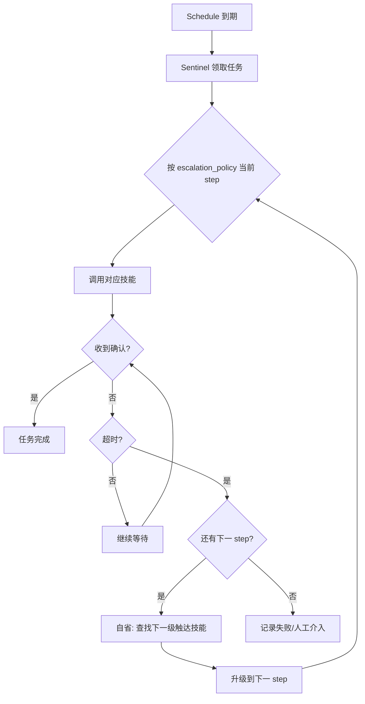

# The Sentinel（哨兵系统）设计愿景

## 文档信息

- **版本**: v0.1
- **创建日期**: 2026-02-13
- **状态**: 设计愿景（非实现规范）
- **目的**: 定义从「执行者」到「守护者」的架构升级，供后续迭代参考

---

## 一、核心差距：从「执行者」到「守护者」

### 1.1 当前模式 (v3.2 基础版)：闹钟式

| 环节 | 行为 | 结果 |
|------|------|------|
| **触发** | 日历时间到了 | 调用 NotificationSkill 发送弹窗 |
| **执行** | 弹窗发出 | 任务结束 |
| **后续** | 用户没看？ | AI 不管了 |

**本质**：这是「闹钟」—— 发完就完，不关心是否被感知。

### 1.2 目标模式 (J.A.R.V.I.S. 版)：守护式

| 环节 | 行为 | 结果 |
|------|------|------|
| **触发** | 日历时间到了 | 目标变为「确保主人知道这件事」(Ensure Acknowledgement) |
| **循环** | 发弹窗 → 没反应？ | 自省：我有其他能触达主人的技能吗？ |
| **决策** | 发现 VoIP Skill | 此事优先级 Critical，必须打电话 |
| **执行** | 调用电话技能 | 电话接通 → 任务完成 |
| **确认** | 主人接听 | 确认收到 → 任务闭环 |

**本质**：这是「贾维斯」—— 以「确保主人感知」为目标，主动升级手段直到达成。

---

## 二、架构升级：引入 The Sentinel

### 2.1 定位

在 **Tier 2 (core/brain/)** 下增加 **Sentinel（哨兵）** 模块：

- **形态**：永不休眠的 Ray Actor
- **职责**：监控待办/提醒/事件，以「确认触达」为目标执行升级策略
- **与现有系统关系**：
  - 消费 `core/schedule` 的到期任务
  - 调用技能系统（Notification、VoIP、Push 等）
  - 依赖技能自省机制选择合适工具

### 2.2 在整体架构中的位置

```
Tier 2 (Jachin Hive)
├── Control Plane (FastAPI)
├── Brain Orchestrator (意图解析、任务编排)
├── Ray Cluster (Worker 执行)
├── Schedule Store (日历/待办/提醒)
├── Skill Registry (技能发现与执行)
└── [NEW] Sentinel Actor  ← 永驻 Ray Actor，监控到期任务并执行升级策略
```

---

## 三、任务分级系统 (Task Priority & SLA)

### 3.1 设计目标

不仅仅是记录「下午 3 点约会」，还要记录：

- **重要性 (Priority)**：决定 AI 会多「拼命」地提醒
- **确认策略 (Escalation Policy)**：失败后如何升级

### 3.2 任务模型扩展（概念）

```yaml
# 概念模型，非实现
Task:
  id: "date_night_001"
  content: "和女朋友的约会"
  priority: CRITICAL        # LOW | NORMAL | HIGH | CRITICAL
  deadline: "19:00"
  status: PENDING_ACK      # 等待确认
  escalation_policy:
    - step: 1
      tool: "desktop_notify"
      timeout: "5m"        # 先弹窗，等 5 分钟
    - step: 2
      tool: "mobile_push"
      timeout: "10m"       # 没反应？推手机
    - step: 3
      tool: "voip_call"
      args:
        speech: "紧急提醒：您有重要约会即将开始..."
      # 还没反应？打电话！
```

### 3.3 优先级与行为映射（建议）

| Priority | 行为特征 | 升级意愿 |
|----------|----------|----------|
| LOW | 弹窗一次，不升级 | 用户错过就算了 |
| NORMAL | 弹窗 + 5 分钟后可推手机 | 适度升级 |
| HIGH | 弹窗 → 推手机 → 可考虑电话 | 多手段尝试 |
| CRITICAL | 弹窗 → 推手机 → 必须电话/其他高触达手段 | 确保触达 |

---

## 四、技能自省机制 (Skill Introspection)

### 4.1 问题

AI 需要知道自己「拥有」什么能力。当安装了 VoIP 插件时，Sentinel 需要能发现：「我现在需要触达用户，但弹窗失败了，有没有打扰度更高但能确保触达的技能？」

### 4.2 能力声明（Manifest 扩展概念）

技能在 `manifest.yaml` 中声明能力维度，例如：

```yaml
# 概念：VoIP 技能的能力声明
capabilities:
  - name: "user.reach"      # 触达用户
    level: "high"           # 触达强度：low(弹窗) | medium(推送) | high(电话)
    cost: "high"            # 打扰度：用户感知的侵入性
    description: "直接拨打电话，确保用户接听"
```

### 4.3 自省查询逻辑（概念）

```
Sentinel 决策时：
  需求：触达用户，当前手段（desktop_notify）失败
  查询：技能注册表中 capability="user.reach" 且 level > current
  筛选：按 priority 与 cost 权衡，选择下一级手段
  执行：调用 VoIP Skill
```

---

## 五、升级策略 (Escalation Policy)

### 5.1 策略结构

每个任务可绑定一条升级策略链：

```
Step 1: desktop_notify (timeout 5m)
   ↓ 超时无确认
Step 2: mobile_push (timeout 10m)
   ↓ 超时无确认
Step 3: voip_call (无超时，执行即视为尝试触达)
```

### 5.2 确认 (Acknowledgement) 定义

- **桌面弹窗**：用户点击「知道了」或关闭弹窗 → 确认
- **手机推送**：用户点击通知进入 App → 确认
- **电话**：接通并播放提醒语音 → 视为已触达（可扩展为「用户按键确认」）

### 5.3 与优先级的联动

- **LOW**：仅 Step 1，无升级
- **NORMAL**：Step 1 → Step 2（可选）
- **HIGH**：Step 1 → Step 2 → Step 3（按需）
- **CRITICAL**：Step 1 → Step 2 → Step 3（必须走完直到触达）

---

## 六、Sentinel 工作流（概念）



---

## 七、与现有模块的对接点

| 现有模块 | Sentinel 对接方式 |
|----------|-------------------|
| **core/schedule** | 轮询或订阅「即将到期」任务，领取后标记状态 |
| **Skill Registry** | 按 capability（如 user.reach）查询可用技能 |
| **Plugin Executor** | 调用 Notification、VoIP、Push 等技能的 invoke |
| **Ray** | Sentinel 本身为 Ray Actor，可常驻、可扩展 |

---

## 八、实现阶段建议（非本文范围）

1. **Phase A**：扩展 Schedule 模型，增加 priority、escalation_policy
2. **Phase B**：技能 Manifest 增加 capability 声明，Registry 支持按 capability 查询
3. **Phase C**：实现 Sentinel Ray Actor，先支持单步（desktop_notify）
4. **Phase D**：实现超时与升级逻辑，接入多技能
5. **Phase E**：确认反馈闭环（弹窗点击、电话接通等）

---

## 九、修订记录

| 日期 | 版本 | 说明 |
|------|------|------|
| 2026-02-13 | v0.1 | 初版：执行者→守护者差距、Sentinel 定位、任务分级、技能自省、升级策略 |
