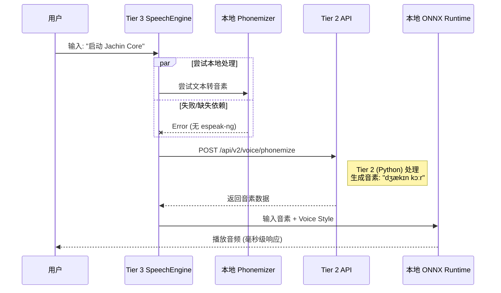

# Jachin 语音规则与架构总结（TTS + 语音模式与安全协议）

本文档覆盖：**TTS 合成规则与分层架构**、**语音交互三种模式**、**安全指令协议**。  
语音模式与安全协议详细设计见 → [VOICE_MODES_AND_SAFETY_PROTOCOL.md](./VOICE_MODES_AND_SAFETY_PROTOCOL.md)。

---

## 一、规则概览 (`.cursor/rules/055-tts-service.mdc`)

### 1. Capability Check (自检机制)

| 检查项 | 条件 | 说明 |
|--------|------|------|
| **Architecture** | x86_64 或 aarch64 | 仅支持这两种架构 |
| **Memory** | 可用 RAM ≥ 1GB | 低于则禁用本地 TTS |
| **Compute** | RealTimeFactor ≤ 0.8 | 推理过慢则禁用本地 TTS |

### 2. Fallback Chain (故障转移)

`speak(text)` 必须按以下顺序调用：

1. **Local (Kokoro ONNX)**：桌面/高端设备默认，中英混合用 `zm` 风格
2. **Edge (Tier 2 XTTS)**：Local 不可用或文本长度 > 500 字符时回退
3. **Cloud (Aliyun Qwen/CosyVoice)**：Tier 2 不可达时的最后兜底

### 3. Model Management

- 不将 `.onnx` 文件（~100MB）打包进安装包
- 实现 `ModelManager`，首次启动时从 Tier 2 (Hive) 或 Cloud 下载 `kokoro-v0_19.onnx` 和 `voices.json`

### 4. 中英混合优化

- 调用 Kokoro 时**强制** Language Code 为 `z` (Chinese)，自动处理夹杂的英文单词
- **不切换模型**，只切换 Style 向量（如 `zm`）

### 5. 树莓派兼容性

- 使用 `#[cfg(target_arch = "aarch64")]` 宏
- 针对 ARM 架构降低线程数配置（如 `with_intra_threads(2)`）

---

## 二、语音交互设计（三种模式与安全指令协议）

### 1. 三种语音模式

| 模式 | 技术难度 | 资源消耗 | 误触风险 | 适用场景 |
|------|----------|----------|----------|----------|
| **A. 录音模式 (Push-to-Talk)** | ⭐ 低 | 低 | 极低 | 隐私高、环境嘈杂、长文本 |
| **B. 唤醒模式 (Wake-Up)** | ⭐⭐ 中 | 中 (常驻 KWS) | 低 | 远场、双手占用 (做饭、打字) |
| **C. 识别模式 (Continuous)** | ⭐⭐⭐ 高 | 高 (VAD+STT 常驻) | **高** | 沉浸式闲聊、头脑风暴、陪伴 |

- **模式 A**：当前 Chat 已支持（按住/点击麦克风录音 → 送 Layer 2 STT → 对话）。
- **模式 B**：Layer 3 轻量 KWS（唤醒词如 "Jachin"）→ 检测到后发 `WAKE_UP` 事件 → 播放「叮」→ 开启约 5 秒录音 → 送 Layer 2。
- **模式 C**：Layer 3 VAD 有人说话即推流；Layer 2 实时 STT + **语义路由器** 区分 CHAT / COMMAND。

### 2. 安全指令协议（原则：闲聊随意，执行命令必须「带刺」）

- **命令前缀**：系统级操作须带触发短语，如 `"系统指令"`、`"Jachin Execute"`；无前缀仅 LLM 回复，**禁止** FileTool/ShellTool。
- **二次确认**：高风险操作（删除、格式化、关机等）须弹窗确认或口述确认码（如 Alpha-9）后再执行。
- **UI 反馈 (Alert Mode)**：检测到系统指令时 UI 切为橙/红边框；高风险待确认时红色边框 + 确认弹窗。

实现状态与 API 见下文「四、实现状态」与「五、API 端点」；完整设计见 [VOICE_MODES_AND_SAFETY_PROTOCOL.md](./VOICE_MODES_AND_SAFETY_PROTOCOL.md)。

---

## 三、架构

### 分层结构

```
┌─────────────────────────────────────────────────────────────────┐
│  Tier 3 (Terminal) - clients/desktop/src-tauri/src/tts/        │
│  ┌─────────────┐  ┌──────────────┐  ┌─────────────────────┐   │
│  │ SpeechEngine│  │ LocalKokoro  │  │ ModelManager        │   │
│  │ (统一入口)   │  │ (ONNX)      │  │ (按需下载)           │   │
│  └──────┬──────┘  └──────┬───────┘  └──────────┬──────────┘   │
│         │                │                      │               │
│         │  Phonemizer    │  Split-Inference    │               │
│         ▼                ▼                      ▼               │
├─────────┼────────────────┼──────────────────────┼─────────────┤
│  Tier 2 (Hive) - core/voice/tts.py, core/api/voice.py          │
│         │  Edge TTS / XTTS / Phonemize API                     │
│         ▼                                                      │
├─────────────────────────────────────────────────────────────────┤
│  Cloud - 阿里云 Qwen / CosyVoice                               │
└─────────────────────────────────────────────────────────────────┘
```

### 模块职责

| 模块 | 路径 | 职责 |
|------|------|------|
| **SpeechEngine** | `tts/manager.rs` | 自检、Provider 选择、Fallback 调度 |
| **LocalKokoroEngine** | `tts/local_kokoro.rs` | Kokoro ONNX 推理，中英混合、线程配置 |
| **Phonemizer** | `tts/phonemizer.rs` | 文本→音素，支持 Split-Inference |
| **CloudAliyunAdapter** | `tts/cloud_adapter.rs` | 阿里云 REST 兜底 |
| **ModelManager** | `tts/model_manager.rs` | 模型下载与缓存 |
| **Tier 2 TTS** | `core/voice/tts.py` | Edge TTS / 阿里云，供 Edge 层调用 |

### Provider 选择逻辑

```
decide_provider(text):
  if local_enabled AND local_loaded AND len(text) ≤ 500  → Local
  if len(text) > 500                                     → Edge
  if !local_enabled OR !local_loaded                     → Edge
  else                                                   → Cloud (兜底)
```

---

## 四、性能分析

### 1. 本地 Kokoro

| 项目 | 配置 |
|------|------|
| **x86_64** | `intra_threads = 0`（自动按物理核数） |
| **aarch64** | `intra_threads = 2`（降低争抢） |
| **模型** | kokoro-v0_19.onnx |
| **语言** | `z` (Chinese) |
| **风格** | `zm` (中英混合) |

### 2. 文本长度阈值

- **≤ 500 字符**：优先 Local
- **> 500 字符**：走 Edge，减轻本地负载

### 3. Split-Inference

- 本地 Phonemizer 不可用时，由 Tier 2 处理音素
- 终端仅负责 ONNX 推理，降低端侧复杂度

**Split-Inference 时序图：**



### 4. 模型加载

- 不打包 ONNX，首次使用再下载
- 缓存目录：`ProjectDirs::cache_dir()/tts/`
- 减少安装包体积和启动时间

---

## 五、实现状态

| 功能 | 状态 |
|------|------|
| 自检（架构、内存） | ✅ 已实现 |
| 自检（Compute benchmark） | ⏳ 暂用 arch+memory 简化 |
| Fallback Chain | ✅ 已实现 |
| Local Kokoro 推理 | ✅ 已实现（需 --features tts-local） |
| Phonemizer trait | ✅ 已实现 |
| RemotePhonemizer (Split-Inference) | ✅ 已实现 |
| ModelManager | ✅ 已实现 |
| Cloud 阿里云 | ✅ 接口已实现 |
| Tier 2 Edge TTS | ✅ 已有（Python） |
| 中英混合 (language=z, style=zm) | ✅ 已配置 |
| aarch64 线程数 | ✅ 已实现 |
| Tauri 命令 `tts_self_check` | ✅ 已实现 |
| Tauri 命令 `tts_has_model` / `tts_ensure_model` / `tts_speak` | ✅ 已实现 |
| Tier 2 phonemize API | ✅ 已实现（需 misaki） |
| Tier 2 TTS models 静态服务 | ✅ 已实现 |
| 一键部署 (deploy.ps1) | ✅ 已实现 |
| 前端优先本地 TTS | ✅ 已实现 |
| **语音模式与安全协议** | |
| 唤醒词骨架 (STT KWS) | ✅ 已实现（`stt/keyword_spotting.rs`，WAKE_UP 事件 + Tauri 命令） |
| 语义路由器 IntentRouter | ✅ 已实现（`core/voice/intent_router.py`，COMMAND/CHAT + risk_level） |
| 意图路由 API `/api/v2/voice/intent` | ✅ 已实现 |
| 前端 riskLevel + Alert Mode 边框 | ✅ 已实现 |
| 高风险二次确认弹窗 | ✅ 已实现 |

---

## 六、API 端点 (Tier 2)

| 端点 | 方法 | 用途 |
|------|------|------|
| `/api/v2/voice/synthesize` | POST | 文本合成语音 |
| `/api/v2/voice/phonemize` | POST | 文本→音素（Split-Inference） |
| `/api/v2/voice/voices` | GET | 语音列表 |
| `/api/v2/voice/intent` | POST | 语义路由（安全指令协议）：请求 `{ "text" }`，返回 `intent_type`(CHAT/COMMAND)、`risk_level`、`stripped_text` |
| `/api/v2/tts/models/{filename}` | GET | 模型下载（kokoro-v0_19.onnx, voices.json） |

**Tauri 命令（语音/唤醒）**：`stt_start_wake_listener`、`stt_stop_wake_listener`、`stt_wake_listener_running`、`stt_emit_wake_up`（测试）；事件 `WAKE_UP`。

---

## 七、需要注意的工程细节 (Action Items)

落地时需注意以下事项：

### A. ONNX Runtime 的动态库问题

Rust 的 `ort` crate 在编译/运行时需要链接：

- **Windows**: `onnxruntime.dll`
- **Linux/Android**: `libonnxruntime.so`

**建议：**

- 在 `src-tauri/build.rs` 中处理好动态库的下载和链接
- 或在 `ModelManager` 中一并下载对应的动态库，放到运行目录
- `ort` 默认启用 `download-binaries` 时会在构建时拉取，需确认目标平台支持

### B. Tier 2 的静态文件服务

文档中提到的 `GET /api/v2/tts/models/{filename}` 需要 Tier 2 提供静态文件服务。

**建议：**

- 在 Tier 2 的 FastAPI 代码中配置 `StaticFiles` 挂载
- 确保服务器上已下载好 `kokoro-v0_19.onnx` 和 `voices.json` 并放到对应目录

### C. Android 端的权限

若将来部署到 Android，`ort` 可能涉及文件读取等权限。

**建议：**

- 在 `AndroidManifest.xml` 中检查并声明所需权限（如 `READ_EXTERNAL_STORAGE`、`WRITE_EXTERNAL_STORAGE` 等）
