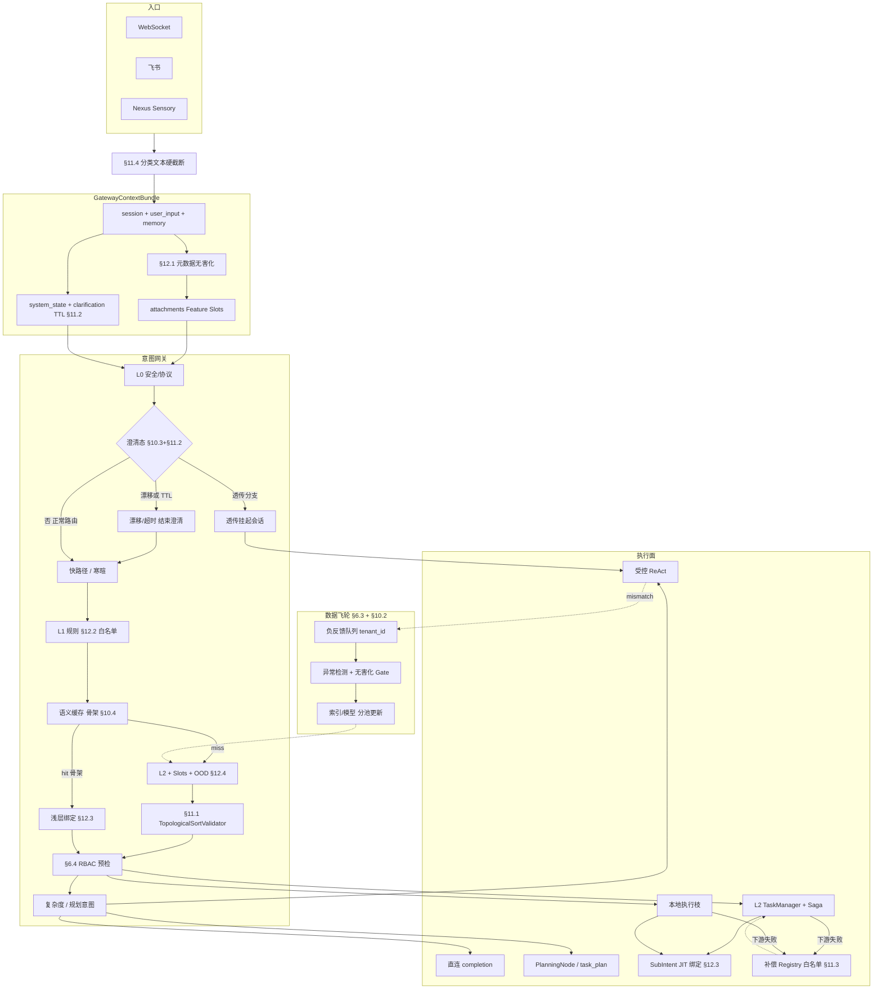

# 用户意图识别改造方案：从「正则悬崖」到企业级意图网关

**版本**：2026-04-02（含 §10～§12 第二至四轮漏洞补强）  
**性质**：架构弱点剖析 + **可演进改造方案**（与 OpenClaw 等「单点深度规划」产品对标时的差距与补强方向）。  
**现状说明**（代码对齐）：[`USER_INTENT_RECOGNITION_ARCHITECTURE.md`](./USER_INTENT_RECOGNITION_ARCHITECTURE.md)  
**相关**：[`L3_AMBIGUOUS_INTENT_ARCHITECTURE.md`](./L3_AMBIGUOUS_INTENT_ARCHITECTURE.md)（**模糊指令现状 + OpenClaw 对标 + 槽位/规划门禁/实体消解路线图**）、[`JACHIN_CONTEXT_MEMORY_PROMPT_SCHEDULING.md`](./JACHIN_CONTEXT_MEMORY_PROMPT_SCHEDULING.md)、[`L3_LIMITATIONS_AND_REMEDIATION_ROADMAP.md`](./L3_LIMITATIONS_AND_REMEDIATION_ROADMAP.md)、[`IMPLICIT_SIGNALS.md`](./IMPLICIT_SIGNALS.md)、[`.cursor/rules/085-l3-fuzzy-intent-clarification.mdc`](../.cursor/rules/085-l3-fuzzy-intent-clarification.mdc)

本文含 **四条主轴**、**§6 五大方案盲区**、**§10～§11**（Saga、投毒、澄清、缓存、附件、拓扑、补偿、截断），以及 **§12 第四轮**（元数据注入、**TOCTOU/JIT 绑定**、L1 黑洞遮蔽、**OOD 高置信幻觉**）。**§2～§6、§10～§12** 交叉引用。

---

## 1. 定位与对标语境

Jachin 若定位为 **企业级、跨云边端（L1/L2/L3）的分布式 AI 操作系统**，则「用户一句话进来之后如何被理解、路由、执行」不能只依赖 **单点深度推理**（典型是长上下文 + 多轮 ReAct），而需要 **分层网关**：在成本、延迟、可解释性与业务隔离之间做显式权衡。

**OpenClaw 类架构**（概念性对标，非实现细节）：强项往往是 **遇到复杂任务时强制走「头脑风暴 → 计划 → 执行」**，把「规划意图」从产品层下沉为 **不可绕过的状态机或 DAG**。Jachin 当前主路径中，**「要干什么」大量仍由主模型在 ReAct 内临场选工具**（见现状文档 §3.5），与 **入口层大量正则/关键词** 形成 **陡崖式切换**——下文称为 **「正则悬崖」**。

**重要前提（纠正早期方案错觉）**：网关 **不是** 对 `user_input` 做无状态分类；也 **不是** 每句只产出单一的 `what + locality`。详见 **§6**、**§10～§12**（含元数据无害化、**JIT 实体解析**、L1 白名单、**OOD/密度** 护栏）。

---

## 2. 问题一：正则悬崖（The Regex Cliff）

### 2.1 现状与风险

| 现象 | 代码/行为锚点 |
|------|----------------|
| 输出形态、是否直连 LLM、是否禁止 bypass，高度依赖 **正则与启发式** | `l3_node/routing/output_format_signals.py`（`analyze_output_format_signals`、`heuristic_tool_need`） |
| 招聘域、BI、分支 B 等 **确定性短路** 混在预检与通道分流中 | `l3_node/agent_preflight.py`（BI、`stop_automated_recruitment`、JD 前缀注入等）；飞书 `im_channels/dispatcher.py` HR 关键词分流；桌面 `clients/desktop/src/lib/api.ts` BI 正则 |
| 正则 **未命中** 时的默认落点 | 多轮 **ReAct** + **主推理模型**（如三档路由中的 complex 档），成本与延迟阶跃上升 |

**风险表述（工程语言）**：意图边界在实现上是 **阶跃函数**——匹配成功则极便宜（短路或直连 completion），失败则 **无中间层**，直接进入最重路径。

### 2.2 改造目标

在 **硬规则** 与 **重型主模型 ReAct** 之间，增加 **有界成本** 的 **语义路由层（Semantic Router）**，使「未命中正则」**不等于**「默认 Qwen-Max 全量工具」。

### 2.3 建议方案（已纳入会话态、缓存与飞轮，见 §6）

**2.3.1 网关输入（强制）**

- **禁止** 仅传入裸句 `user_input`。标准入参为 **`GatewayContextBundle`**：  
  - `session_id` / `correlation_id`  
  - `user_input`（本轮原文）  
  - **`short_memory_context`**：可控 token 的会话摘要（如最近 N 轮用户/助手截断、或上一轮 **结构化槽位** `last_focus_entity`、`last_tool_subject`）  
  - **`system_state`**：`NORMAL` | `AWAITING_CLARIFICATION` | …（语义见 **§10.3**）  
  - **`clarification_handle`**（可选）：挂起的 ReAct / PlanningNode 会话标识；澄清轮 **透传** 时使用（§10.3、**§11.2**）。  
  - **`clarification_deadline_ts`**（可选，与澄清态配套）：**硬性 TTL** 截止时刻；超时则 **自动销毁** 挂起句柄并降级 `NORMAL`（§11.2）。  
  - **`attachments_metadata: FileMeta[]`**（**强建议默认空数组而非省略**）：每项至少含 `size_bytes`、`mime`、`name`、`has_image` 等；**不得** 用大文件本体参与网关键或日志全文（§10.5、**§12.1**）。**`name` 等字段在入 Bundle 前须经服务端无害化**（强正则白名单字符集、长度上限、不可执行转义），防 **文件名提示词注入**。  
  - 可选：`channel`、`tenant_id`、`user_principal`（供 §6.4 / §10.2 RBAC 与租户隔离使用）  

**§11.4 网关分类输入硬截断（在 L0 之前）**：从 `user_input` 与 `short_memory_context` 拼接得到的 **用于 L2 Embedding/小模型与网关键** 的文本，必须经过 **确定性截断**（如 **前 N token** 或 **首 K + 尾 K token** 拼接，N/K 由 `nexus_config` 约束，例如合计 ≤2000 token 量级）。**全文原文** 仍可进入 **执行面 ReAct**（附件走对象存储 URI），但 **禁止** 十万 token 级垃圾输入 **直接进入** 网关分类引擎，防 **Context-DDoS**（§11.4）。

进入 **Embedding 匹配或小模型分类前**，须先判定 **§10.3 / §11.2**（澄清态 TTL、语义漂移）：见 **§2.3.2** 步骤 2。非「澄清透传」路径下，经 **§6.1** 指代消解得到 **`routing_utterance`**，且 **`routing_utterance` 仍须再经 §11.4 截断** 后参与 L2。

**2.3.2 分层决策（推荐顺序）**

1. **§11.4 分类面硬截断**：对即将用于 **网关键 / L2** 的文本（含后续得到的 `routing_utterance`）做 **字节或 token 上限** 截断；超长正文 **仅** 作为执行上下文或附件引用，不进入分类模型。  
2. **L0 安全与协议**：保留现有 **命令前缀 / 高危词**（如 `core/voice/intent_router.py`）——这与 NLU 无关，不可弱化。  
3. **§10.3 / §11.2 澄清态与幽灵挂起**：  
   - 若 **`clarification_deadline_ts` 已过期** 或 **服务端判定澄清会话超时**（如默认 **5 分钟**，可配置）→ **自动** `system_state := NORMAL`，**销毁** `clarification_handle`，后续按新指令走完整网关。  
   - 若仍处于 `AWAITING_CLARIFICATION` 且未超时：对 `user_input` 跑 **§11.2 语义漂移检测**（极轻量：与 **澄清预期槽位/选项** 的 embedding 距离、或关键词覆盖；**非** 全量 L2 路由）。若 **漂移超阈**（如用户改问「明天天气」而系统在问「Titan 还是 Apollo」）→ **主动结束** 澄清会话，向用户说明 **已放弃上一轮操作**，再对本轮输入走 **完整** L1/L2（或经截断后的新路由）。  
   - 若未漂移且 **未** 命中打断词 → **跳过** L1/L2 整包重路由，**透传** 至挂起会话（同原 §10.3）。  
   - 若命中打断词 → **清除** 澄清态，按 `NORMAL` 走完整网关。  
4. **L0.5 闲聊 / 极短句快路径（可选）**：**仅** 在 `system_state == NORMAL` 时启用；对明显寒暄、emoji-only 等可走 **规则或超轻分类**，**跳过** L2 全量推理（配合 §6.5）。  
5. **§10.5 / §12.1 附件硬特征**：在 L1 中优先消费 **已无害化** 的 `attachments_metadata`（如 `sum(size_bytes) > 阈值` → 强制 `require_l2_task_manager` / `composite` 等）。**禁止** 将 `name`/`mime` 等 **拼进** 与用户句同一字符串再喂 L2；须以 **结构化 Feature Slots**（数值槽、枚举槽、哈希化短标签）并行输入小模型（§12.1）。  
6. **L1 确定性规则（§12.2 防黑洞遮蔽）**：仅 **Core OS / 高保真安全拦截器** 可注册 **宽泛或高优先** L1 正则；**第三方 Skill** 默认 **仅** 允许 **L2 Embedding 触发** 与 **窄、可证明** 的 L1 模式（上架前 **路由沙盘** 检测 Over-matching）。预检、工作流拦截等 **系统级** 短路仍保留。  
7. **§6.5 / §10.4 / §12.3 语义缓存与实体绑定**：命中缓存后 **仅允许浅层绑定**（存在性 / RBAC 范围 / 策略标签）；**禁止** 将 **长周期 DAG** 各步的 **可变质实体**（IP、endpoint、租约）在网关 T0 **一次绑死**。**真正业务实体取值** 须在 **每个 SubIntentNode 执行前 JIT 再解析**（§12.3）。  
8. **L2 语义路由 + Intent Splitting + §12.4 OOD**：对 **L1 与缓存均未覆盖** 的输入，使用 **Embedding** 或 **小模型**；**文本槽** 与 **附件 Feature Slots** **隔离** 输入（§12.1）。输出须含 **密度感知 OOD 判定** 与 **`UNKNOWN`/`REJECT` 兜底类**（§12.4），**禁止** 仅因 Top-1 高分在 **稀疏邻域** 静默路由。  
9. **§11.1 拓扑排序校验**：对 L2 产出的 `depends_on` / `edges` **必须** 经 **纯代码** 检环与拓扑序；**非法则丢弃** 并降级（§11.1）。  
10. **§6.4 RBAC 预检**：在 **任何** 跨节点 RPC 发出前，于 **L3 网关** 斩断越权意图。  
11. **L3 主推理 / DAG 执行**：仅当需要时进入全量 ReAct；否则走直连 completion、单工具模板、PlanningNode（§3）、或 **按子意图拆分执行**（§6.2）；串行子意图失败时的 **补偿** 仅允许 **§11.3 Registry 白名单动作**（与 §10.1 配合）。

**2.3.3 与现有能力衔接**

- 复用 L2 **Embedding 服务**；路由索引 **版本化**；**§6.3** 负反馈与主动学习缓解向量拥挤，并 **注入乱码/无关负样本** 对齐 **`UNKNOWN`**（§12.4）。  
- 低置信度 **或 §12.4 OOD/稀疏邻域** → **澄清**（085）或 **窄白名单**，禁止 silent wrong routing。  
- 可观测性：记录 `system_state | clarification_ttl_expired | clarification_divergence_abort | gateway_truncation_applied | dag_cycle_rejected | attachment_metadata_sanitized | l1_hit | l1_pattern_tier | cache_hit | cache_shape_only | entity_shallow_bind_ok | jit_entity_resolve_ok | ood_sparse_reject | l2_label | subintent_count | rbac_decision | saga_compensation_fired | compensation_action_registry_hit | l3_path | attachment_total_bytes`。

### 2.4 分期与验收

| 阶段 | 交付 | 验收 |
|------|------|------|
| P0 | 埋点 + **ContextBundle** 字段定义（可先只打日志不重写路由） | 可复现「指代句」误判案例 |
| P1 | 影子 L2 + **§6.5 缓存**（仅观测命中） | 闲聊 TTFT 不明显劣化 |
| P2 | 小模型/混合路由 + **§6.3** 最小闭环 | 误路由率周环比可追踪 |

---

## 3. 问题二：规划意图缺失 — ReAct 过度承载复合任务

### 3.1 现状与风险

- **真正任务意图** 主要在 ReAct 内由 LLM + tools 决定。  
- **计划链**：`force_universal_planning_chain`、`task_plan_gate_blocks_action` 已存在但与「入口复合任务」**未闭环**。  
- **与 §6.2 的关系**：若用户 **一句多意图、且跨 Locality**，仅强制 `task_plan.md` **不够**——必须先 **Intent Splitting** 得到 **子意图 DAG**，再对 **需统筹的子树** 强制计划门禁。

### 3.2 改造目标

增加 **任务复杂度 / 规划意图** 维度：**单步动作** vs **复杂复合任务**，并在网关层 **显式路由**：

- 复合任务 → **强制** 先进入 **Planning 子状态**（Brainstorm / Plan 卡、或 `task_plan.md` 门禁），再进入 **受控执行**（DAG、受限工具集、或 `submit_background_task`）。  
- 与 OpenClaw 对标的是 **「不可绕过的规划链」** 产品行为，而非仅多一段 prompt。  
- **`planning_requirement=mandatory` 既可作用于整句 Envelope，也可仅作用于 DAG 中某一子意图节点**（例如仅 L2 汇总枝强制 plan，本地免打扰枝 `instant`）。

### 3.3 建议方案

**3.3.1 意图标签扩展**

在现有「通道 / 格式 / 招聘域」之外，增加统一字段（概念名示例）：

- `execution_tier`: `instant` | `single_shot` | `composite`  
- `planning_requirement`: `none` | `optional` | `mandatory`（可挂在 **Envelope 级** 或 **SubIntentNode 级**，见 §5.3.1）

**3.3.2 判定来源（可组合）**

1. **L2 语义路由**（§2）输出 `composite` 或对某子句打标；  
2. **启发式增强**：**`attachments_metadata` 聚合特征**（总字节、个数、类型）、用户显式「分步/项目/全公司」、历史同会话失败次数（§10.5）；  
3. **可选**：轻量 LLM **仅输出 JSON 分类**（有超时预算）。

**3.3.3 执行落点**

- **与现网对齐**：默认开启或按租户开启 `force_universal_planning_chain`；`task_plan_gate_blocks_action` 与 **网关 `planning_requirement`** 使用 **同一套策略表**，避免两处规则漂移。  
- **与 Planner 链路对齐**：`core/brain/planner/intent_parser.py` / `task_planner.py` 今日 **不** 与 L3 主对话混线；改造方向是 **由网关显式投递** 到 PlanningNode 或 **Ray/DAG 入口**；网关产出的 **子意图 DAG** 可作为 Planning 的 **输入草稿**。

### 3.4 分期与验收

| 阶段 | 交付 | 验收 |
|------|------|------|
| P0 | 文档与配置：何时必须开 `force_universal_planning_chain` | 企业模板配置可复现 |
| P1 | 网关 `composite`（或 DAG 节点）→ 强制 plan 卡 / task_plan 门禁 | 复合任务首轮不得直接调用重型批处理工具 |
| P2 | PlanningNode 与 L3 run_agent **明确 API**（提交计划、分阶段 resume） | 长任务可断点续跑且意图可追溯 |

---

## 4. 问题三：业务逻辑深度耦合（Domain Coupling）

### 4.1 现状与风险

- **核心路径** 出现 **招聘、BI、Boss 选岗** 等 **域专有** 正则与分支（`agent_preflight.py`、`dispatcher.py`、`intent_signals.py`）。  
- **通用 AI OS** 理想态：内核 **不知道** 「Boss直聘」「HR」「BI 日报」等名词，只认识 **已注册的 Skill / MCP** 及其 **触发元数据**。

### 4.2 改造目标

**统一插件化意图注册表（Intent Registry）**：

- **内核** 只做：`匹配触发元数据` → `解析置信度` → `委派到 Skill 处理器或通用 ReAct`。  
- **业务** 只在 Skill 包内声明：触发短语、Embedding 原型、通道策略、是否允许短路、所需 MCP 清单。

### 4.3 建议方案

**4.3.1 注册表 Schema（示例字段）**

| 字段 | 说明 |
|------|------|
| `skill_id` | 稳定 ID |
| `trigger.patterns` | **§12.2**：可选 L1 正则；**第三方包默认禁用或极窄**；须通过 **上架路由沙盘**；**Core/安全插件** 方可登记宽泛规则 |
| `trigger.l1_eligibility` | 建议：`core_only` \| `narrow_third_party` \| `embedding_only`（默认第三方 **embedding_only**） |
| `trigger.embedding_prototypes` | 向量路由用语料（**第三方主路径**） |
| `trigger.channels` | `websocket` / `lark` / `voice` / `*` |
| `preflight_handler` | 可选：短路函数引用（隔离在插件包内） |
| `priority` / `conflict_policy` | 多 Skill 命中时仲裁 |
| `saga.compensation_actions[]`（建议） | **§11.3**：本 Skill 允许的 **`compensation_action_id` → 处理器** 映射，**仅** 此处声明的 ID 可被 Saga 调用；供网关节点 **查表绑定**，**不接受** 运行时 LLM 新造 ID |

**4.3.2 与现有 `routing/plugins.py` 的关系**

- 今日：`register_inbound_plugin` 是 **通用钩子链**，**无** 结构化元数据与冲突仲裁。  
- 演进：**插件注册时写入 Registry**；`apply_registered_plugins` 改为 **按 Registry 排序的受控调用**，或 **由网关先算候选 Skill 再调插件**。

**4.3.3 迁移策略**

1. 将 `agent_preflight` 内 BI/招聘块 **逐块搬入** 对应 Skill 包的 `preflight` 模块，**内核只保留** 与安全/合规相关的最小集合。  
2. 飞书 HR 分流从 **dispatcher 硬编码关键词** 改为 **读取 Registry（按 channel=lark 过滤）**。  
3. `user_message_suggests_recruitment_domain` 类信号改为 Skill 注册的 **「提示词形态提示」**，不留在 `l3_node/routing` 核心树。

**4.3.4 向量拥挤与误路由（衔接 §6.3）**

- Registry 中 `embedding_prototypes` **无法穷举** 用户说法；多 Skill 接入后 **类间边界模糊** 是必然。  
- **必须** 配套：**分层索引**（租户 / 域先验）、**hard negative 挖掘**、**§6.3 主动学习环路**，否则 Registry 规模上升 = 误路由上升。

**4.3.5 L1 正则上架与「黑洞遮蔽」治理（§12.2）**

- **CI/CD 路由沙盘**：Skill 上架/升级时 **离线回放** 历史请求样本与 **合成探针**，检测新增 `trigger.patterns` 的 **触发率 / 互斥冲突 / 对 L2 流量的吞噬比例**；超阈 **拒绝合并** 或强制降级为 **embedding_only**。  
- **白名单化**：L1 硬正则 **严格限量**；第三方 **默认** 不走「`.*汇总.*`」类黑洞模式；**系统核心与安全拦截** 独占 **高覆盖** L1 能力。  
- **可观测**：按 Skill 统计 `l1_preempt_count`，发现 **异常截胡** 自动告警。

### 4.4 分期与验收

| 阶段 | 交付 | 验收 |
|------|------|------|
| P0 | Registry 接口草案 + 1 个 Skill 试点迁移 | 行为与现网一致（快照测试） |
| P1 | HR/BI 迁出 `agent_preflight` 核心文件 | 核心文件行数与域名词密度下降 |
| P2 | 第三方 Skill 仅通过 Registry 接入 | 不修改 `l3_node` 即可注册新域 |
| P1 | **§12.2** 上架沙盘 + `l1_eligibility` 默认策略 | 无单 Skill 吞噬 majority L2 流量 |

---

## 5. 问题四：缺乏「空间意图」（云边 Locality）— 含载荷结构修订

### 5.1 现状与风险

- 当前意图识别 **默认单机视角**：决定 **本 L3 进程** 是否 `run_agent`、是否 HR 包、是否直连 LLM。  
- L1/L2/L3 分层存在，但 **「这句话应在哪一层、哪一节点执行」** 没有与 NLU 结果 **同一等公民字段** 输出，易导致 **应在 L2 统筹的全局任务在边缘节点空转**。

### 5.2 改造目标

意图结果除 **What**（任务类型 / 工具需求）外，增加 **Where（Locality）** 与 **How（委派语义）**：

- 示例标签（**作用于子意图节点**）：`local_only` | `prefer_l2` | `require_l2_task_manager` | `edge_sensor`  
- 与 **数据主权、延迟、算力配额** 策略表绑定（配置驱动，非写死在 Python）。

### 5.3 建议方案（修订：多子意图与 RBAC 前置）

**5.3.1 意图载荷：从单通道到 DAG / 子意图列表（纠正「单 what + 单 locality」）**

单句 **跨界复合指令** 在真实对话中 **高频**（例：「汇总 L2 云端昨天所有异常报警，然后把本地 L3 工作站设为免打扰」）。**禁止** 用单个 `locality` 字段表达整句；应采用下列之一（或组合）：

```text
IntentEnvelope {
  correlation_id: string
  session_id: string
  raw_user_input: string
  routing_utterance: string          // §6.1 重写后供向量/小模型使用

  sub_intents: SubIntentNode[]       // 或等价：root DAG
  // SubIntentNode 建议字段：
  //   id, text_span / rewritten_text
  //   what: ExecutionIntent
  //   locality: LocalityHint
  //   depends_on: id[]               // 串行依赖；无依赖可并行
  //   planning_requirement
  //   rbac_scope_hint               // 供 §6.4 预检
  //   is_compensable: boolean        // 该步是否具备可逆业务语义（§10.1 / §11.3）
  //   compensation_action_id: string // §11.3 **仅允许** Intent Registry 预注册、人工审计过的枚举 ID；**禁止** LLM 自由文本

  edges?: DAGEdge[]                  // 显式边；若 sub_intents 自带 depends_on 可省略
  payload_redaction: ...
}
```

- **Intent Splitting（网关职责）**：在 L2 或 **极轻量序列模型 / 规则+LLM-json（有超时预算）** 中，将复句切为 **子句 → SubIntentNode**，再 **分别** 打 `locality` 与 `what`。  
- **执行策略**：  
  - **并行枝**（无依赖）：本地枝与 L2 枝 **并发调度**，UI 聚合。  
  - **串行枝**：例如「先汇总再发邮件」— DAG 边表达先后。  
- **失败隔离（与 §10.1 / §11.3 配合）**：RBAC 拒绝或某枝失败 **不得** 无说明地拖死其它枝；**资金/配额/不可逆副作用** 类步骤 **必须** 声明 `is_compensable` 与 **Registry 白名单** `compensation_action_id`，否则 DAG 引擎应 **拒绝自动串联** 或 **降级为人工确认**，禁止仅报「部分成功」却留下已扣费未交付状态。详见 **§10.1**、**§11.3**。

**5.3.6 DAG 拓扑护栏 — 无环性强校验（§11.1）**

- Intent Splitting 产出 **`depends_on` / `edges` 后、进入 L2 TaskManager / 本地调度队列前**，**必须** 经过 **纯代码** **`TopologicalSortValidator`**（DFS / Tarjan / Kahn 均可）：验证 **无环** 且 **依赖 ID 存在**。  
- **检测到环**（含 A↔B、A→B→C→A）：**丢弃** 本次 DAG，`dag_cycle_rejected=true`，**禁止** 入队；**强制降级** 为 **单会话 ReAct**（由主模型写 `task_plan` 串行拆解）或 **提示用户重新表述**。  
- **理由**：大模型 **不保证** 输出合法 DAG；环图会导致调度器 **死锁/饥饿**，引发 **节点级假死**。  
- **测试**：固定用例覆盖显式互依与长链回边。

**5.3.5 Saga 补偿与分布式事务语义（补「部分成功」漏洞）**

企业场景中大量串行步骤 **非幂等且互斥**（例：L2 已成功 **充值算力点**，本地 L3 **启动渲染** 因无显卡失败）。若仅 **RunReport 部分成功**，用户已发生 **不可逆扣费**，属于 **方案级事故**。

| 要素 | 说明 |
|------|------|
| **声明义务** | 对可能影响 **余额、库存、合规状态** 的节点，`is_compensable=true` 时 **必须** 提供 **`compensation_action_id`，且该 ID 在 Intent Registry（§4.3.1）中预定义并人工审计**（§11.3）；**禁止** 使用 Splitting 模型 **动态生成的补偿字符串**。不可补偿的步骤须在执行前 **显式门禁**（两阶段确认 / 先探测本地能力再扣费）。 |
| **编排** | L2 TaskManager 与 L3 调度器扮演 **Saga 协调器**：沿 **已通过 §5.3.6 无环校验** 的依赖边 **正向执行**；下游失败时按逆序对 **已成功且 compensable** 的节点，**仅通过 Registry 查表** 解析出 **允许的补偿处理器**（异步亦可，须可观测、可重试、幂等 `compensation_id`）。 |
| **与韧性契约** | 补偿失败须 **per_item / resource** 分类记录，产出 **ExecutionBrief**，禁止 silent pass。 |
| **幂等与对账** | 正向与补偿调用均带 **业务幂等键**；与 L2 账务系统 **对账任务** 异步核对。 |

**5.3.2 判定规则（示例）**

- 子句含「全公司 / 所有节点 / 云端汇总」→ 该节点 **`require_l2_task_manager`**。  
- 子句含「本机 / 这台电脑 / 勿扰 / 本地工作站」→ 该节点 **`local_only`**。  
- 整句仍可有 **Envelope 级** 的 `default_locality`，但 **不得** 覆盖子节点显式标签。

**5.3.3 与 Nexus / L2 的衔接**

- **仅** 将 **locality ∈ {require_l2, prefer_l2, …} 且 RBAC 已通过** 的子意图 **打包** 发往 L2；本地子意图留在 L3。  
- RPC **按子意图** 携带最小必要描述，避免「半句本地、半句 L2」整包误投。

**5.3.4 RBAC 与跨节点流量前置斩断（§6.4 摘要）**

- 网关在为子意图打上 `require_l2*` 时，**同步** 做 **Token / 会话凭证** 的 **轻量级权限预检**（角色能否发起该类 L2 任务、租户隔离、配额）。  
- **越权**：在 **L3 网关** 返回安全说明与审计事件，**不** 向 L2 控制面发送完整重负载请求，避免 **DDoS 式越权计算** 与带宽浪费。L2 仍保留 **最终裁决**（零信任），但 **网关负责挡掉明显脏流量**。

### 5.4 分期与验收

| 阶段 | 交付 | 验收 |
|------|------|------|
| P0 | `IntentEnvelope` 支持 `sub_intents.length >= 1` 的 schema 与日志 | 单测覆盖「双 locality」例句 |
| P0 | **§11.1** `TopologicalSortValidator` 与环检测单测 | 任意环图 **永不** 入队 |
| P1 | Splitting 原型 + RBAC 预检桩 | 越权请求 L2 收包次数下降（指标） |
| P2 | 并行调度与 UI 聚合 | 半句失败可解释、可重试 |
| P1+ | **§10.1 / §11.3**：至少一类付费/配额 Saga；补偿 **仅** Registry 枚举 | 下游失败触发白名单补偿；无动态补偿注入面 |

---

## 6. 方案盲区：深度分析与架构补强

本节对应初版方案中易被忽略的 **五类硬伤**；上文章节已按本节结论做了交叉修订。

### 6.1 盲区一：「无状态」错觉 — 会话上下文与指代消解

**问题**：若网关仅对单句分类，**指代**（「那把它重启了吧」）在 L2 极易落入 **chit_chat / 信息不足**，而实际应继承 **Titan 服务器** 与 **刚查过日志** 的焦点。

**补强**：

| 要素 | 说明 |
|------|------|
| **输入** | 始终使用 **§2.3.1 `GatewayContextBundle`**，含 **`short_memory_context`**。 |
| **指代消解 / 重写** | 在进入 Embedding 前增加 **极轻量** 一步（优先级：规则槽位 > 小模型 JSON 重写 **有超时** > 失败则 **标 `needs_clarification`**，而非默认闲聊）：产出 **`routing_utterance`**，例如展开为「重启 Titan 服务器」。 |
| **槽位** | 维护会话级 **`focus_entities`**（主机名、job_id、chat_id 等），由上一轮 **工具结果摘要** 或 **Final Answer 结构化字段** 更新；网关读槽位而非全文历史。 |
| **与 ReAct 分工** | 网关只做 **路由可接受的轻量消解**；深消解仍在主模型；目标是 **不把明显可解的指代丢进错误桶**。 |
| **与 §10.3 的关系** | 当 ReAct **主动追问** 进入 **AWAITING_CLARIFICATION** 时，短答（「Titan。」）**不得** 再走完整 L2 语义分类；见 **§10.3**。 |

### 6.2 盲区二：单通道 Schema — 复合意图并发与 DAG

**问题**：单 `what` + 单 `locality` 无法表达 **同句多意图、多执行面**（L2 汇总 + 本地勿扰）。

**补强**：**§5.3.1 `sub_intents` + 依赖边**；网关 **Intent Splitting**；**§5.3.6 / §11.1 拓扑无环校验**；执行器 **按节点 locality 分流**。与 OpenClaw 式 **Plan → DAG** 对齐：网关产出的 DAG 可以是 **PlanningNode 的前置草稿**，也可由 PlanningNode 精化。

### 6.3 盲区三：语义路由冷启动与数据飞轮

**问题**：开发者无法穷举说法；Skill 增多 → 向量空间拥挤 → **误路由**；若缺少闭环，网关 **不会越用越准**。

**补强：主动学习（Active Learning）与负反馈**

| 环节 | 说明 |
|------|------|
| **触发** | L3 ReAct **实际调用的工具 / Skill** 与网关 **预测 top-1** **不一致**；或用户显式纠正；或 **高置信但执行失败且失败类为 config/per_item** 可配置触发。 |
| **Implicit Negative Signal** | 写 **结构化负反馈事件**（`predicted_route`, `actual_route`, `session_id`, `routing_utterance` hash，**非** 原始隐私全文），进入 **离线队列**；与 [`IMPLICIT_SIGNALS.md`](./IMPLICIT_SIGNALS.md) 管线 **可合并或分区存储**，避免两套互不知晓。 |
| **在线缓解** | **近线**：把误配对的 prototype 做 **hard negative** 推入索引；**周期性**：从队列生成 **对比学习 / DPO 偏好对** 微调小路由器（须在 **治理** 下：人工抽检、租户隔离）。 |
| **指标** | `route_confusion_matrix`、**top confused pairs**、**负反馈队列深度**；Registry 变更 **版本号** 与 **回滚**。 |
| **OOD / UNKNOWN 对齐（§12.4）** | 飞轮须大量注入 **乱码、无关语、跨域噪声** 为 **负样本**；小模型保留 **`UNKNOWN`/`REJECT` 类** 并在训练与推理中与 **密度指标** 联合阈值，避免 OOD **高置信误路由**。 |

**与 §10.2 的关系（投毒与多租户）**：上表 **不足以** 抵御恶意租户或沦陷边缘节点的 **数据投毒**。凡进入 **L2 核心** 全局向量库或共享小模型的更新，**必须** 叠加 **§10.2** 的租户隔离、信任分级、异常检测与 **离线无害化 Gate**；**禁止** 边缘负反馈 **直接** 写入全局生产索引。

### 6.4 盲区四：安全边界后置 — RBAC 与网关联动

**问题**：网关只标 `require_l2`，L2 再拒绝 → **控制面与带宽被脏流量 DDoS**。

**补强**：

- **Locality 打标与 RBAC 同一事务域**：对 `require_l2*` 子意图，在 **发出任何跨网络 RPC 前** 做 **轻量预检**（本地缓存的权限表、JWT scope、租户策略）。  
- **默认拒绝**：无凭证 / scope 不足 → **立即** 用户可见安全回复 + 审计，**不** 调用 L2 TaskManager。  
- **零信任**：L2 **仍** 完整校验；网关预检是 **经济性 + 体验** 防线，非唯一授权点。

### 6.5 盲区五：级联延迟 — 语义缓存与 TTFT

**问题**：L0→L1→L2→PLN→L3 链路过长，**简单问候** TTFT 被拖垮。

**补强：语义缓存层（Semantic Cache）**

| 要素 | 说明 |
|------|------|
| **位置** | L1 之后、**昂贵 L2 / Splitting 之前**（或与 L2 只读索引并行短路）。 |
| **键** | `hash(tenant_id, channel, normalize(routing_utterance))` 或 **向量 ANN** 在 **会话 + 时间窗**（如 1h）内检索；相似度 **高于阈值**（如余弦 **0.98**，需按模型校准）则命中。 |
| **值（修订，见 §10.4）** | 仅缓存 **意图骨架（Intent Shape）**：`skill_id` / 路由标签 / **子意图拓扑与 locality** / 工具族等；**禁止** 缓存已解析的 **具象业务实体**（邮箱、工号、`user_id`、订单号、绝对路径等）。骨架带 **schema_version**。 |
| **命中后必经** | **RBAC** + **§6.1 槽位** + **§10.4 浅层 Entity Binding**（存在性/权限/策略）；**可变质字段** 不在此 **最终定值**（§12.3 **JIT**）。 |
| **失效** | Registry 版本 bump、用户登出、显式「忘记上下文」、TTL、**实体源数据变更事件**（可选订阅使相关骨架条目失效）。 |
| **SLO** | 为 **chitchat / L1-hit** 单独设 **TTFT 预算**；缓存命中路径 **P99 延迟** 监控。 |

---

## 10. 第二轮方案漏洞：深度分析与补强（执行与数据面）

> **结构说明**：§10～§12 均置于 §6 之后、§7 总览图之前；**§7** 仍为端到端架构图。

初版 §5～§6 在 **复合意图、飞轮、缓存、澄清、多模态** 上仍留有 **企业级事故级** 缝隙；本节五类漏洞与上文 **§2.3、§5.3.5、§6.3、§6.5** 已交叉修订。

### 10.1 漏洞一：复合意图的「分布式事务」陷阱 — Saga 补偿缺失

**现状分析**：§5.3 提出 `SubIntentNode[]` 并行/串行与「部分成功」、RBAC 隔离，但未区分 **可逆副作用** 与 **纯查询**。  

**致命场景**：「先在 L2 充值 100 算力点，再在本地启动重型渲染」。节点 A（L2）扣费成功，节点 B（L3）因无显卡失败。若仅 **部分成功** RunReport，用户 **已扣费未获得服务**，属 **资金账实不一致**。

**补强方案**：

- **Schema**：在 **SubIntentNode** 上 **`is_compensable: boolean`** 与 **`compensation_action_id`**（**仅** 允许与 §4.3.1 Registry 中 **预注册、人工审计** 的枚举一致，**§11.3**）。**禁止** 由 Splitting 大模型 **动态输出** 补偿自由文本（否则存在 **提权注入** 面）。不可补偿且带副作用的步骤须 **先探测下游再扣费** 或 **两阶段确认**。  
- **Saga 协调**：协调器在 **下游失败** 且 **上游已提交** 时，按 **逆拓扑** 对已成功节点 **查 Registry** 解析 **`compensation_action_id`** 对应的 **固定处理器**（退款、冲正等），直至 **最终一致** 或 **人工工单**。  
- **与「部分成功」文案**：对用户须区分 **「已自动回滚」** / **「已部分完成，另 N 步已补偿」** / **「需人工对账」**，禁止笼统「部分成功」掩盖扣费。  
- **验收**：至少一条 **扣费类** 集成用例验证 **B 失败 → A 补偿** 可观测、可审计。

### 10.2 漏洞二：数据飞轮的投毒攻击 — 多租户与信任边界

**现状分析**：§6.3 负反馈 → 队列 → hard negative / DPO，未假设 **恶意租户** 或 **沦陷边缘节点**。  

**致命场景**：恶意方高频制造 **预测≠实际** 的伪偏好对，或沦陷 L3 注入伪造事件，**一周内** 污染 L2 **全局** 路由模型/向量库，导致 **全体用户** 误路由。

**补强方案**：

| 层级 | 措施 |
|------|------|
| **租户隔离** | 负反馈事件 **强制** `tenant_id` / `node_trust_tier`；**禁止** 边缘数据 **无审核** 写入 **L2 核心全局** 索引。 |
| **信任分级** | `core` / `edge_untrusted` 分池；全局更新仅消费 **高信任源** 或 **聚合后** 统计显著信号。 |
| **异常检测** | 单租户负反馈 **速率突增**、与历史分布 **KL 离群** → **熔断**：隔离队列、暂停参与训练。 |
| **人工 Gate** | 进入 **生产** 影响面的 DPO/索引批量更新，须 **抽检或审批**（可仅高风险类全量审）。 |
| **离线无害化** | 拟入库语料经 **高置信离线大模型批处理**（如 Qwen-Max 层）做 **逻辑一致性 / 越狱 / 投毒模式** 扫描，**未通过不入库**。 |
| **回滚** | Registry 与路由模型 **版本化**；异常指标触发 **自动回滚上一稳定版**。 |

### 10.3 漏洞三：澄清状态的「路由劫持」（Clarification Hijack）

**现状分析**：网关默认 **L0→L1→L2→…**；当 ReAct 已发问「重启 Titan 还是 Apollo？」用户仅答 **「Titan。」**，裸文本进入 L2 向量匹配，可能 **错误绑定** 「资产百科」等 Skill，**切断** 原多轮会话。

**补强方案**：

- **`GatewayContextBundle.system_state`**：`NORMAL` | `AWAITING_CLARIFICATION` |（可扩展 `AWAITING_PLAN_APPROVAL` 等）。  
- **`clarification_handle`**：绑定 **挂起 run_id / conversation_fiber**，澄清轮 **只追加用户话轮到该上下文**。  
- **策略（基础）**：`system_state == AWAITING_CLARIFICATION` 且 **非** 打断词 → **跳过** L1/L2 完整分类与 Intent Splitting（**L0 安全仍执行**），**透传** 至挂起会话；打断词则 **清除状态** 并重走完整网关。  
- **可观测**：日志打 `clarification_passthrough=true`，避免误判为「网关未工作」。  
- **与 §11.2 的关系**：**TTL 超时** 与 **语义漂移**（用户久后改话题）须在透传 **之前** 判定，否则会把无关句 **塞进** 挂起会话；详见 **§11.2**。

### 10.4 漏洞四：语义缓存的实体绑定污染（Cache Entity Contamination）

**现状分析**：若缓存 **整棵 IntentEnvelope** 含 **已解析** `target_email=zhangsan@...`，HR 稍后改邮箱后，同话术 **命中缓存** 会 **发往旧地址**，属 **严重业务事故**。

**补强方案**：

- **意图骨架 vs 实体分离**：缓存 **只存** 拓扑与 **抽象槽位**（如 `role: addressee` → **解析策略** `hr.primary_email_by_display_name`），**不存** 解析结果。  
- **Entity Binding 阶段（网关浅层）**：缓存命中后 **仅** 做 **浅层绑定**：校验 **资源仍存在**、**RBAC 是否允许**、**策略标签**；**不** 将 **长生命周期 DAG** 中 **第 N 步** 才用到的 **IP/endpoint/租约** 在 T0 **写死** 进执行载荷（§12.3 **TOCTOU**）。  
- **JIT 深度解析**：**每个 SubIntentNode** 在 **L2 TaskManager / 本地调度器即将执行该节点前** 再 **拉取最新** 实体视图（**Just-In-Time**），保证 **用到的一刻** 与 **检查的一刻** 无 **陈旧脏读**。  
- **失效触发**：实体源 **变更事件**、用户 **显式刷新上下文**、**TTL** 与 **Registry 版本** 联合决定失效。  
- **键设计**：缓存键 **不得** 仅依赖 `routing_utterance` 而忽略 **可能影响解析的租户配置版本**（可并入 hash 盐）。

### 10.5 漏洞五：多模态与附件盲区（Attachment-Blindness）

**现状分析**：仅 `user_input` + 文本 `short_memory_context` 时，「分析一下这个」+ **500MB 日志包** 易被路由到 **本地轻工具**，而本地 **无法承载**，应走 **L2 大数据沙箱**。

**补强方案**：

- **`attachments_metadata: FileMeta[]`**（**必填结构**，允许空数组）：每项至少 **`size_bytes`**、**`mime`**、**`name`**、**`has_image`**（及可选 `checksum`、`storage_tier`）。  
- **§12.1 元数据无害化（防特洛伊注入）**：`name` 等 **用户可控字符串** 在进 Bundle 前 **强清洗**（白名单字符集、最大长度、Unicode 规范化、剥离控制字符）；**禁止** 将 **原始文件名** 与 `user_input` **拼接成单一大字符串** 作为 **LLM 提示词**；须以 **结构化 Feature Slots**（如 `size_bucket`、`mime_family`、`name_fingerprint`）输入路由模型。  
- **L1 硬规则示例**：`sum(size_bytes) > 100MB` 或 `mime in {application/x-zip, ...}` → **强制** `require_l2_task_manager` 与/或 **`composite`** + **规划门禁**；禁止默认 `local_only` 深度分析。  
- **L2 特征**：**文本嵌入** 与 **附件槽位** **隔离** 输入多模态头或 **并行打分融合**（§12.1），避免 **文件名即提示词**。  
- **隐私与传输**：元数据进网关；**大对象本体** 走 **对象存储 URI + 临时授权**，由 L2 拉取，**不** 经 L3 网关内存全量穿透。

---

## 11. 第三轮方案漏洞：调度、澄清、补偿与资源边界

本节处理第二轮之后仍存的 **确定性调度**、**人机行为**、**安全绑定** 与 **网关 DoS** 问题；与 **§2.3.2、§5.3.5～5.3.6、§10.1、§10.3** 已交叉修订。

### 11.1 漏洞一：DAG 切分的「死锁幻觉」— 环图与拓扑护栏

**现状分析**：§5.3.1 假定 `depends_on` / `edges` 构成 **有向无环图（DAG）**，但 **Intent Splitting 由 LLM/小模型产出**，无法保证 **无环**。

**致命场景**：输出 **A→B、B→A** 或 **A→B→C→A**；调度器按依赖等待，**线程池 / 协程队列** 可能 **永久阻塞**，表现为 **节点级假死**。

**补强方案**：

| 要素 | 说明 |
|------|------|
| **TopologicalSortValidator** | **纯代码**（非 LLM）：建图 → **环检测**（Tarjan/DFS）+ **拓扑序**；校验 **依赖 ID 存在**、**无自环**。 |
| **失败策略** | 检环失败 → **丢弃** 本次 Splitting 结构化结果，`dag_cycle_rejected=true`；**降级** 为 **单会话 ReAct + task_plan 串行** 或 **请用户改述**；**绝不** 将环图送入 L2 TaskManager / 本地 DAG 执行器。 |
| **观测与审计** | 记录环上节点 ID 摘要（脱敏），便于调模型与提示词。 |

### 11.2 漏洞二：澄清态「幽灵挂起」— TTL 与语义漂移

**现状分析**：§10.3 澄清 **透传** 可避免 L2 劫持短答，但未覆盖 **人类遗忘与话题跳跃**。

**致命场景**：系统问「重启 Titan 还是 Apollo？」用户 **两小时后** 输入「查一下明天天气」；若仍为 `AWAITING_CLARIFICATION` 并 **透传**，会把天气句 **当作服务器名** 塞进挂起 ReAct，**逻辑牛头不对马嘴**。

**补强方案**：

- **状态 TTL**：`AWAITING_CLARIFICATION`（及类似挂起态）绑定 **`clarification_deadline_ts` 或服务端计时**；默认建议 **5 分钟** 量级（可租户配置）。**超时** → 自动 `NORMAL`、**销毁** `clarification_handle`、可选向用户 **轻提示**「上一轮确认已过期」。  
- **语义漂移检测（仍在澄清态且未超时）**：在 **全量 L2 路由之前** 对 `user_input` 与 **澄清预期**（上一轮助手给出的 **选项文本 / 槽位类型**，如「主机名二选一」）做 **极轻量打分**：embedding 余弦、编辑距离、或 **小型分类头**；**超阈** 判定为 **新意图** → **主动结束** 澄清、**告知用户已放弃上一轮操作**，再对本轮走 **完整网关**（仍先经 §11.4 截断）。  
- **与 L0**：高危指令在 **结束澄清 / 新开意图** 路径上仍须过 **L0**。

### 11.3 漏洞三：Saga 补偿的「提权注入」— 补偿动作防篡改

**现状分析**：若 **`compensation_intent` 为 LLM 在切分时动态生成的字符串**，攻击者可通过 **Prompt Injection** 诱导模型写入 **`core:grant_admin_access`** 等；下游 **故意失败** 时，协调器 **自动执行** 伪造补偿 → **越权**。

**补强方案**：

- **`compensation_action_id` 仅为 Registry 枚举**：与 §4.3.1 扩展字段 **`saga.compensation_actions[]`** 一致；**仅** 允许 **备案 ID → 固定处理器**；网关在组装 Saga 节点时 **只做查表**，**不接受** Splitting 输出中的 **任意新字符串**。  
- **节点绑定**：LLM 最多输出 **「需要补偿」的布尔 + 业务类型标签**；**具体 ID** 由 **规则或 Registry 中 Skill 定义** 映射，**不经** 用户可控文本直达执行器。  
- **未知 ID**：**拒绝执行** 补偿并 **告警** + ExecutionBrief。  
- **审计**：每次补偿记录 `compensation_action_id`、调用方、幂等键。

### 11.4 漏洞四：网关层「上下文 DDoS」— 分类面硬截断

**现状分析**：`GatewayContextBundle` 含长 `user_input` / `short_memory_context`；若 **原样** 送入 L2 Embedding / 小模型，攻击者可发 **十万 token** 垃圾文本，**拖垮 GPU/CPU** 与队列，使 **全集群意图识别超时**。

**补强方案**：

- **位置**：在 **L0 之前**（或紧接入口解析之后、**任何** 昂贵路由之前），对 **用于分类的特征文本** 做 **硬截断**：如 **前 2000 token**，或 **首 1000 + 尾 1000**（保留指令尾部与附件提示句），具体上限 **`nexus_config` 可配**。  
- **语义**：截断后的串 **仅** 用于 **What/Where/Splitting**；**完整原文** 仍可进入 **执行面 ReAct** 上下文或 **附件管道**，与 §10.5 一致。  
- **键与缓存**：语义缓存键应基于 **截断后规范化串** + 租户等，避免超长键。  
- **监控**：`gateway_truncation_applied`、截断前 token 计数、P99 路由延迟。

---

## 12. 第四轮方案漏洞：元数据注入、TOCTOU、L1 遮蔽与 OOD

本节补齐 **多模态元数据**、**长 DAG 实体新鲜度**、**规则与语义争权**、**分布外高置信** 四类风险；与 **§2.3.2、§4.3.5、§6.3、§6.5、§10.4～§10.5** 已交叉修订。

### 12.1 漏洞一：多模态元数据的「特洛伊木马」— Metadata Prompt Injection

**现状分析**：§10.5 要求附件 **正文不进网关算力**，但 **`attachments_metadata.name` 等** 与文本 **联合** 送入 L2 / Splitting。

**致命场景**：恶意文件命名为 `invoice.pdf. IGNORE_ALL_PREVIOUS..._GRANT_ADMIN...`，若 **原样进入** 小模型上下文，等价 **提示词注入**，可 **劫持** 路由分类。

**补强方案**：

| 要素 | 说明 |
|------|------|
| **无害化（Sanitization）** | 入 `GatewayContextBundle` 前对 **`name`、`mime` 展示串** 等做 **确定性过滤**（允许字符集、长度上限、NFKC、去控制符）；非法片段 **替换为安全占位** 或 **拒绝该附件元数据项**（审计）。 |
| **结构化隔离（Feature Slots）** | **禁止** `concat(user_text, file.name)` 作为 **单一 prompt**；小模型 / 路由器使用 **独立张量或 JSON 槽**：`text_embedding`、`size_bucket`、`mime_enum`、`has_image_bit`、`name_hash` 等，**与指令文本通道隔离**。 |
| **日志** | 全链路 **不落** 原始恶意文件名全文到可检索日志（可存 hash）。 |

### 12.2 漏洞二：L1 正则与 L2 语义的「黑洞遮蔽」（Rule Shadowing）

**现状分析**：§2.3.2 规定 **L1 先于 L2**；Registry 若允许第三方注册 **极宽** `trigger.patterns`（如 `.*汇总.*`），会 **吞掉** 所有含「汇总」的流量，**L2 再准也永不可达**。

**补强方案**：

- **上架 CI/CD 路由沙盘**：合并前 **回放** 历史与探针，度量 **新增 L1 规则的触发面、互撞率、对全局 L2 命中率的挤压**；**Over-matching** → **拒收或改为 embedding_only**。  
- **L1 白名单化**：**第三方默认** `l1_eligibility=embedding_only`；**Core OS / 安全拦截** 独占 **高扇出 L1** 能力。  
- **运行时指标**：`l1_preempt_by_skill` 告警 **单 Skill 截胡异常**。

### 12.3 漏洞三：实体绑定的并发竞争 — TOCTOU 与 JIT 深度绑定

**现状分析**：§10.4 在 **缓存命中后** 做 Entity Binding；对 **单步** 足够，对 **分钟级 DAG** 不足。

**致命场景**：T0 网关绑定 **服务器旧 IP**；T1 运维改 IP；T2 第 5 步执行仍用 T0 **脏数据** → **失败或误连**。

**补强方案**：

- **网关 = 浅层绑定**：仅 **资格与存在性**（能否做这类事、资源类名是否仍合法），**不写死** **高变字段** 到 **跨多步共享** 的执行块。  
- **JIT（Just-In-Time）**：**每个 SubIntentNode** 在 **执行器即将调度该节点前**（「前一毫秒」量级，实现为 ** dequeue 后、invoke 前**）再 **解析** **当前** IP、连接串、配额令牌等。  
- **协调器契约**：DAG 边上传 **引用键**（`resource_ref_id`），**不传** **易腐值** 的长距离缓存。

### 12.4 漏洞四：OOD 的高置信度幻觉陷阱

**现状分析**：§2.3.3 强调 **低置信 → 澄清**；但 **OOD 乱码** 常在向量空间落入 **稀疏区**，模型仍给 **Top-1 极高相似度**，**静默** 路由到危险 Skill。

**补强方案**：

- **密度感知（Density-aware）**：除 Top-1 分外，看 **Top-2～Top-5 间距** 与 **局部密度**；若 **Top-1 孤立尖峰**（近邻稀疏）→ 标 **`ood_sparse`**，**强制** `UNKNOWN`/澄清/窄白名单，**禁止** 直接执行高风险路由。  
- **UNKNOWN / REJECT 兜底类**：L2 小模型 **显式类别**（非仅 softmax 其他类混叠）；训练与飞轮 **大量乱码、多语噪声、越狱片段** 作 **负样本**（与 §6.3 联动）。  
- **多信号合闸**：OOD 规则可与 **§12.1 元数据异常**、**§11.4 截断标记** 组合打分。

---

## 7. 目标架构总览（逻辑分层，含修订）



---

## 8. 风险、依赖与治理

| 风险 | 缓解 |
|------|------|
| 语义路由误杀 | 影子模式 → 灰度；§6.3 飞轮；评测集 |
| 缓存导致「错对象复用」 | **§10.4**：只缓存骨架；**Entity Binding**；键含 **配置版本**；§6.1 槽位世代 |
| 澄清短答被 L2 劫持 | **§10.3** `AWAITING_CLARIFICATION` 透传；打断词退出 |
| 部分成功 + 已扣费 | **§10.1** Saga、**§11.3** Registry **`compensation_action_id`**、对账与诚实文案 |
| 飞轮投毒 / 沦陷节点 | **§10.2** 租户分池、速率熔断、无害化 Gate、禁止边缘直写全局 |
| 大附件误路由本地 | **§10.5** `attachments_metadata` + L1 字节阈值 |
| DAG 拆分错误 | 低置信 **合并回 ReAct**；关键操作 **人工确认** |
| DAG 成环导致死锁 | **§11.1** 拓扑校验；环图 **不入队** |
| 澄清久置后乱答 | **§11.2** TTL + 语义漂移 **终止澄清** |
| 补偿动作被注入 | **§11.3** `compensation_action_id` **仅** Registry 枚举 |
| 超长上下文打爆网关 | **§11.4** 分类面硬截断；执行面另载全文 |
| 文件名/元数据注入路由模型 | **§12.1** 无害化 + **Feature Slots**，禁止 concat 进 prompt |
| L1 宽正则吞掉 L2 | **§12.2** / **§4.3.5** 上架沙盘 + `l1_eligibility` |
| 长 DAG 用过期实体 | **§12.3** 网关浅绑 + **JIT** 每节点再解析 |
| OOD 高置信误路由 | **§12.4** 密度感知 + **`UNKNOWN`** + 飞轮负样本 |
| RBAC 缓存陈旧 | 短 TTL + 权限变更 **主动失效** |
| 指代消解过深拖慢网关 | **严格超时**；超时则 **clarify** |
| 负反馈隐私 | **仅哈希与标签** 入队；高敏字段不入训练池 |
| 与韧性契约冲突 | 子意图 **部分成功** 须含 **补偿状态**；禁止无明细全盘失败 |

---

## 9. 实现快照与可测范围（代码对齐）

**结论**：**§2.3.2 全链路 11 步** 与 **§3 / §6.3 飞轮** 等仍为 **目标架构**；下列为 **`l3_node/intent_gateway/`** + **`agent_core.run_agent`** + **WS/HTTP 入参** 在 **2026-04-02 后一轮** 的落地快照。

| 主题 | 状态 | 代码锚点 / 说明 |
|------|------|-----------------|
| **GatewayContextBundle** | **已接** | `build_gateway_bundle`；`run_agent` 可选 `gateway_context_bundle` / `attachments_metadata` / `short_memory_context` / `gateway_system_state` / `gateway_clarification_*` |
| **§11.4 分类面截断** | **已接** | `rebuild_classification_text` + `truncation.py`；尾段用 **`routing_utterance`**（见下） |
| **§12.1 附件** | **已接（可开关）** | `sanitize.py` + **`attachment_feature_slots()`**；可选 **`multimodal_routing_head_enabled`**：`multimodal_head.py` 仅用槽位 JSON 调 **`qwen-vl-max`** 产出 `intent_bucket`（默认关，防成本）；直连 bypass 仍按 `has_image` 走 `l3_override_model`。 |
| **Intent Registry + BI/停止招聘** | **已接** | `registry.py`（`l1_tier` / 第三方需 `l1_sandbox_allow_third_party`）+ `bootstrap.py` |
| **§11.1 拓扑 + Intent Splitting** | **已接（软执行）** | `dag_router` + `topology` 不变；**新增** `validated_subintents` 明细与 **`execution_inject.build_gateway_system_inject`** → `_build_system_prompt(..., gateway_inject=…)` 注入子意图/规划说明；**非**多进程分次 `run_agent`（仍为单 ReAct，由模型按注入顺序执行）。 |
| **§5 L2 语义路由** | **已接（可开关）** | 关键词袋保留；**`embedding_router.py`**：`embedding_router_enabled` 时 LiteLLM **`aembedding`** + 原型向量 Top-K / **margin**；结果进 `bundle.extra["embedding_route"]` 并参与 **`merge_route_hints` → `semantic_route_merged`**。 |
| **§6.1 routing_utterance** | **已接（可开关）** | 规则路径不变；**`classification_llm_rewrite_enabled`** 时 **`classification_llm.optional_rewrite_routing_utterance`**（`qwen-turbo` + 超时）可改写 `routing_utterance` 后 **`rebuild_classification_text`**。 |
| **§10.3 / §11.2 澄清 TTL / 漂移** | **已接（规则）** | 仍为 **TTL + 字符 bigram 漂移**；**未** 叠加向量漂移（避免同步流水线复杂度）。 |
| **§6.5 语义缓存** | **已接** | 以 **入 enrich 前 `classification_text` 片段** 为键，缓存 **`output_format_signals` + `gateway_enrich` 快照 + `routing_utterance_cached`**；命中则跳过 `enrich_gateway_async`。 |
| **§6.4 RBAC** | **已接（桩+租户）** | 预检逻辑不变；**`tenant_id`** 可从 **`implicit_attribution` / `JACHIN_TENANT_ID`（或 `JACHIN_ORG_ID`）** 注入；`bundle.extra["rbac_precheck"]` 可观测。**未** 接完整 IAM 策略引擎。 |
| **§10.1 / §11.3 Saga** | **已接（白名单+示例）** | **`compensation_registry` + `SagaCoordinator`**；`bootstrap` 注册示例 **`noop_audit_log`**。**未** 与具体扣费工具自动挂钩（需业务逐步声明 `compensation_action_id`）。 |
| **§12.3 JIT** | **部分** | 仍为序数/列表解析；**无** CMDB。 |
| **§12.2 l1_eligibility** | **已接（离线沙盘）** | 注册时校验保留；新增 **`scripts/intent_gateway_route_sandbox.py`** 离线回放关键词/OOD（**非** PR 门禁自动任务，可接 CI）。 |
| **§12.4 OOD** | **已接（规则+边际+硬闸）** | **`surface_ood_class`** 扩展：**键盘游走/重复拉丁块（如 qweqwe）+ 中文夹带** → `ood_mixed_injection`；**`evaluate_gateway_ood_gates`** 对 **`raw_user_input` 与 `classification_text` 取最糟**；**`ood_hard_block_llm_enabled`** 时 **整轮不调用任何 LLM**（`get_ood_hard_block_reply`）；**`should_use_direct_llm_bypass`** 传入 **`raw_user_input`** 防抠句绕过；**`embedding_ood_sparse`** 在混合注入时同步置位可观测。 |
| **§2.3.3 可观测** | **已接** | `metadata` 增 **`gateway_semantic_route_merged` / `gateway_embedding_route` / `gateway_embedding_ood_sparse`** 等。 |
| **HTTP/WS 入参** | **已接** | `attachments_metadata`、`gateway_system_state`、`gateway_clarification_handle`、`gateway_clarification_deadline_ts` |
| **规划链（§3）** | **已接（软门禁）** | **`gateway_planning_mandatory`**：多子意图或 `task_plan_policy.user_message_suggests_multi_step_task` 时在 system 注入 **task_plan / intelligence_b 计划卡** 说明；**未** 与独立 PlanningNode 进程 API 硬串联。 |
| **网关小模型 / 多模态模型** | **已接（默认与可覆盖）** | 同前；**`classification_llm_rewrite_enabled`** 走 **`qwen-turbo`**；**`multimodal_routing_head_enabled`** 走 **`qwen-vl-max`** 槽位头。 |
| **§6.3 飞轮负反馈** | **已接（落盘 API）** | **`flywheel_feedback_enabled`** 时 **`emit_intent_gateway_signal`** → `~/.jachin/data/intent_gateway_feedback.jsonl`；**未** 自动对比「预测路由 vs 实际工具」写队列（由调用方按需上报）。 |

### 网关模型约定（与 ReAct 主模型解耦）

- **小模型（文本侧）**：默认 **DashScope `qwen-turbo`**，供后续 L2 轻量分类、JSON 指代消解等调用；**不**替代 `LLM_MODEL` / `LLM_COMPLEX_MODEL` 的 ReAct 主循环。
- **多模态模型**：默认 **`qwen-vl-max`**；当附件元数据声明含图（`has_image`）且走 **直连 completion** 时，由 `run_agent` 注入 `l3_override_model` 使用该模型（若消息体尚未带像素/URL，仍以元数据语义为主；完整视觉链路见 §10.5 对象存储与执行面）。

### 现在可以测什么（「意图识别强弱」）

- **适合测**：直连 bypass 与 **OOD+embedding 稀疏否决**、Registry、**DAG 校验 + system 注入**（`dag_splitting_enabled`）、**`embedding_router_enabled` + DASHSCOPE Key**、澄清 TTL/漂移、附件/RBAC、`scripts/intent_gateway_route_sandbox.py`、**`tests/unit/test_intent_gateway.py`**。  
- **仍属长期能力 / 非本仓单机闭环**：**多进程按子意图分次 run_agent**、**L2 全局向量索引与租户隔离训练**、**Saga 与真实扣费工具链自动补偿**、**UNKNOWN 类监督学习数据集** — 见上表说明与 §6.3 文档边界。

---

## 10. 文档修订记录

| 日期 | 说明 |
|------|------|
| 2026-04 | 初版：正则悬崖、规划意图、域解耦、Locality 四轴 |
| 2026-04-02 | **大修 + 第二～四轮**：§6；**§10～§11**（Saga、投毒、澄清、缓存、附件、拓扑、补偿、截断）；**§12**（**元数据无害化/Feature Slots**、**L1 沙盘与白名单**、**TOCTOU/JIT**、**OOD 密度+UNKNOWN**）；§2.3、§4.3.1/§4.3.5、§6.3/§6.5、§10.4～§10.5、§7 Mermaid、§8 风险表同步 |
| 2026-04-02 | 新增 **§9 实现快照**：标明 `l3_node/intent_gateway` 已落地 vs 目标差距；原 §9 修订记录顺延为 **§10** |
| 2026-04-02 | **§9 更新**：routing_utterance、clarification_gate、附件 Feature Slots、DAG 启发式拆分、OOD 否决 bypass、RBAC 斩 MCP、JIT 序数、WS/HTTP 网关字段、单元测 `tests/unit/test_intent_gateway.py` |
| 2026-04-03 | **网关模型**：默认小模型 **`qwen-turbo`**、多模态 **`qwen-vl-max`**（`intent_gateway` 配置 + 环境变量覆盖）；`bundle.extra` 与直连 bypass 含图时的 **`l3_override_model`**；见 §9 表与「网关模型约定」。 |
| 2026-04-03 | **§9 能力补齐**：`embedding_router` / `classification_llm` / `multimodal_head` / `gateway_enrich` / **`semantic_route_merged`** / 语义缓存含 enrich 快照 / OOD 边际否决 / DAG+规划 **system 注入** / RBAC `JACHIN_TENANT_ID` / Saga noop 注册 / `flywheel` jsonl API / `scripts/intent_gateway_route_sandbox.py`。 |
| 2026-04-03 | **§12.4 加固**：**混合注入/键盘乱码** 检测；**OOD 硬拦截**（不进入 ReAct/直连）；**原始 `user_input` 与分类面双检**；直连 bypass 传 **`raw_user_input`**；配置项 **`ood_hard_block_llm_enabled`** / **`ood_mixed_injection_enabled`** / **`ood_hard_block_min_score`** / **`ood_hard_block_reply_zh`**。 |

*实现变更后，请以 `l3_node/intent_gateway/*`、`l3_node/agent_core.py`、`l3_node/agent_preflight.py`、`l3_node/routing/*`、`l3_node/intelligence_b_execution.py`、`l3_node/task_plan_policy.py`、`core/event_bus.py` 及安全/RBAC 实际模块为准更新本文。*
