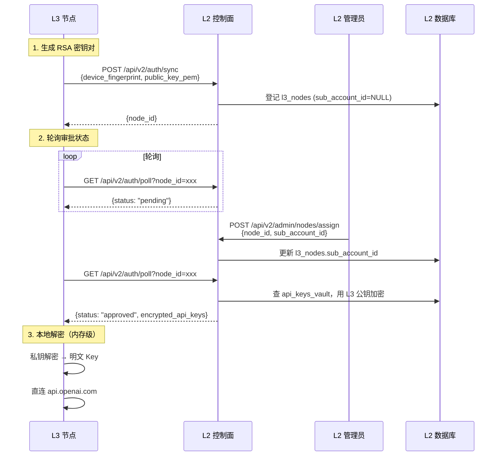
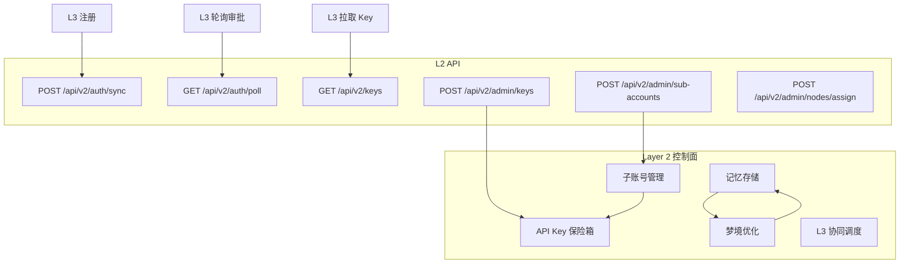
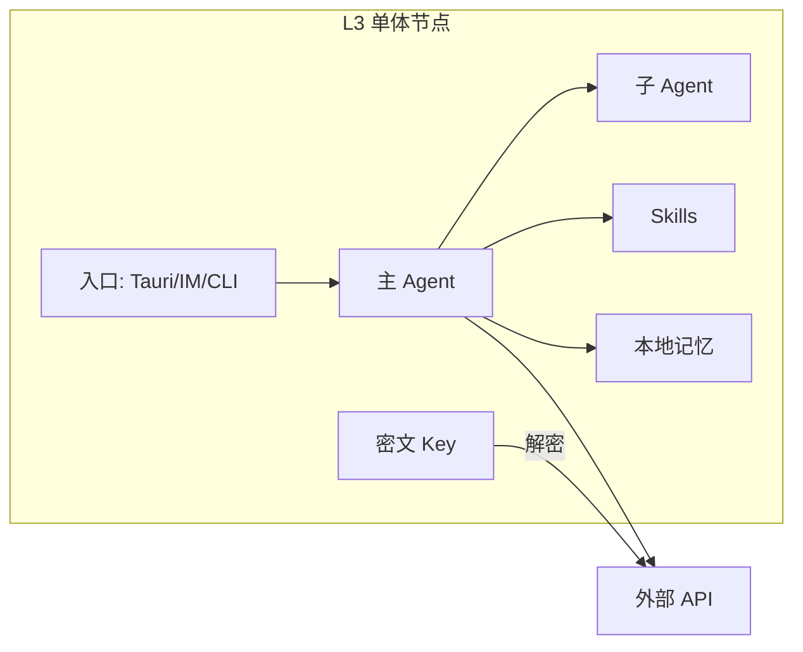

# Jachin Nexus V2 架构图与流程图

**版本**: 2.0  
**状态**: 设计规范  
**关联**: [ARCHITECTURE_V2_LAYER3_STANDALONE.md](ARCHITECTURE_V2_LAYER3_STANDALONE.md)

---

## 一、三层架构总览

```
┌─────────────────────────────────────────────────────────────────────────────────┐
│  Layer 1：平台 (cloud/nexus)                                                      │
│  • 用户主账号注册/登录                                                            │
│  • 平台主账号管理平台内部                                                          │
│  • 与 L2/L3 无直接耦合                                                            │
└─────────────────────────────────────────────────────────────────────────────────┘
                                        │
                                        │ 用户主账号登录 L2 管理
                                        ▼
┌─────────────────────────────────────────────────────────────────────────────────┐
│  Layer 2：控制面 (core/)                                                          │
│  • 子账号、权限、API Key 保险箱                                                    │
│  • 记忆存储、梦境优化、L3 协同调度                                                 │
│  • 不代理 L3 推理请求                                                              │
└─────────────────────────────────────────────────────────────────────────────────┘
                                        │
                                        │ 密文 Key 下发 / 记忆同步
                                        ▼
┌─────────────────────────────────────────────────────────────────────────────────┐
│  Layer 3：执行面 (clients/desktop + l3_node/)                                     │
│  • 单体 OpenClaw：多 Agent、多 Skill、本地记忆                                     │
│  • 持密文 Key，请求时解密后直连外部 API                                           │
│  • 可与 L2 同机部署                                                                │
└─────────────────────────────────────────────────────────────────────────────────┘
```

---

## 二、API Key 零信任流转



---

## 三、L2 控制面职责



---

## 四、L3 单体执行流



---

## 五、V2 文件结构

```
jachin-system/
├── core/                    # Layer 2 控制面
│   ├── db/                  # L2 数据库 (sub_accounts, api_keys_vault, l3_nodes)
│   ├── security/            # crypto_manager
│   ├── api/routes/
│   │   ├── v2_auth.py       # POST /auth/sync, GET /auth/poll, GET /keys
│   │   ├── v2_admin.py      # POST /admin/sub-accounts, /admin/keys
│   │   └── v2_memory.py     # POST /memory/sync
│   └── ...
├── cloud/nexus/             # Layer 1 平台
├── clients/desktop/         # Layer 3 终端 (Tauri)
├── l3_node/                 # L3 单体执行引擎 ✅
│   ├── llm_client.py        # SecurityContext + LiteLLMEngine 直连
│   ├── agent_core.py        # ReAct Agent + MemorySyncDaemon
│   ├── bootstrap.py        # 引导：注册、拉 Key、创建引擎
│   └── engine/hooks_pipeline.py
└── docs/
```

---

## 六、已废弃组件

| 组件 | 状态 | 说明 |
|------|------|------|
| `core/api/cluster.py` | 已删除 | 依赖 ray_cluster |
| `config/ray_config.yaml` | 已删除 | Ray 配置 |
| **Dapr** | 已弃用 | clients/desktop 已统一直连后端 |
| **Ray Cluster** | 已弃用 | task_planner/resource_allocator 已用占位类型 |
| **PostgreSQL** (L2) | 已弃用 | L2 使用 SQLite |
| `/api/v3/orchestrator/plan` | 410 | 原依赖 Ray |
| `/api/v3/orchestrator/execute` | 410 | 原依赖 Ray |

## 七、合规报告

详见 [V2_ARCHITECTURE_COMPLIANCE_REPORT.md](V2_ARCHITECTURE_COMPLIANCE_REPORT.md)
