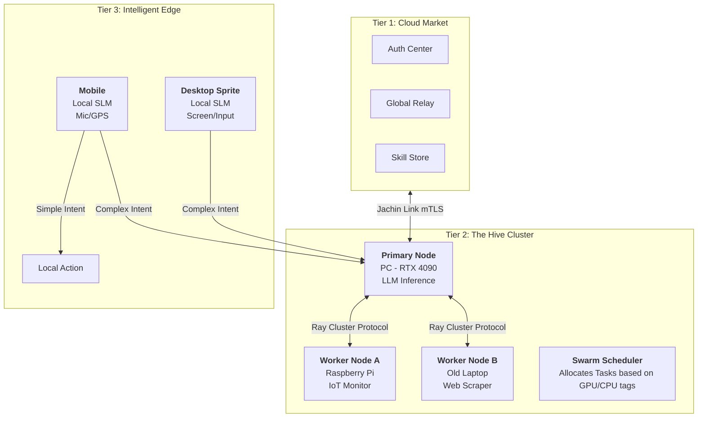
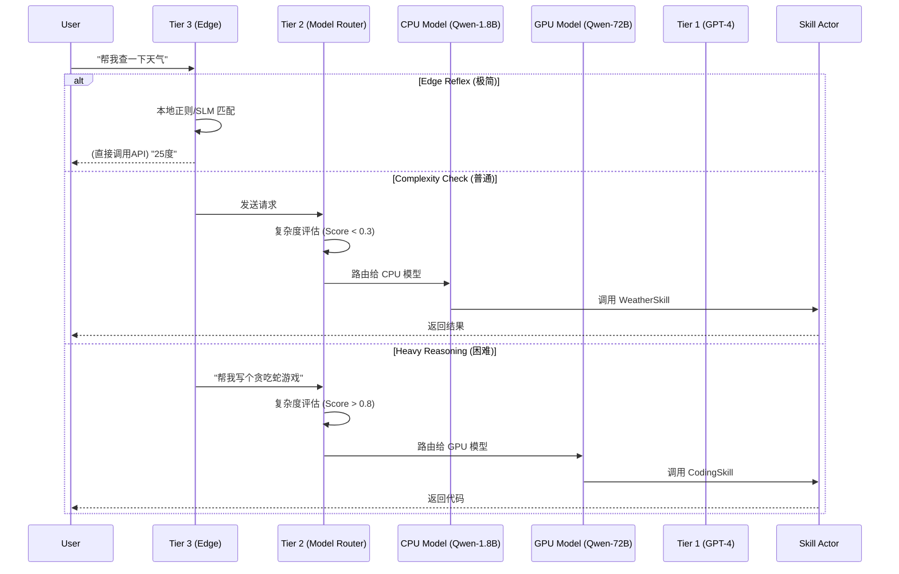
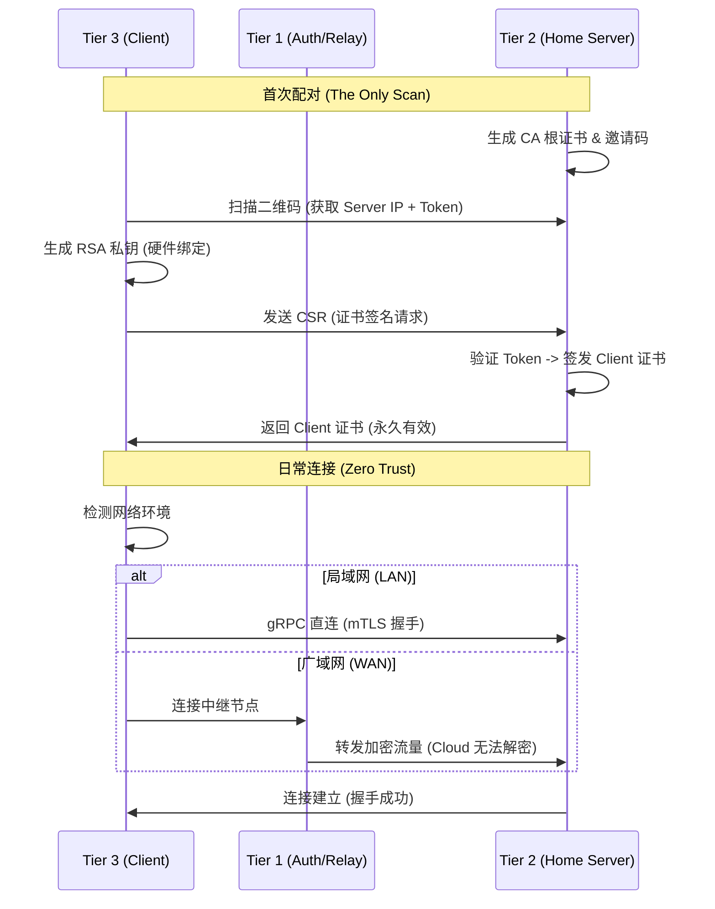
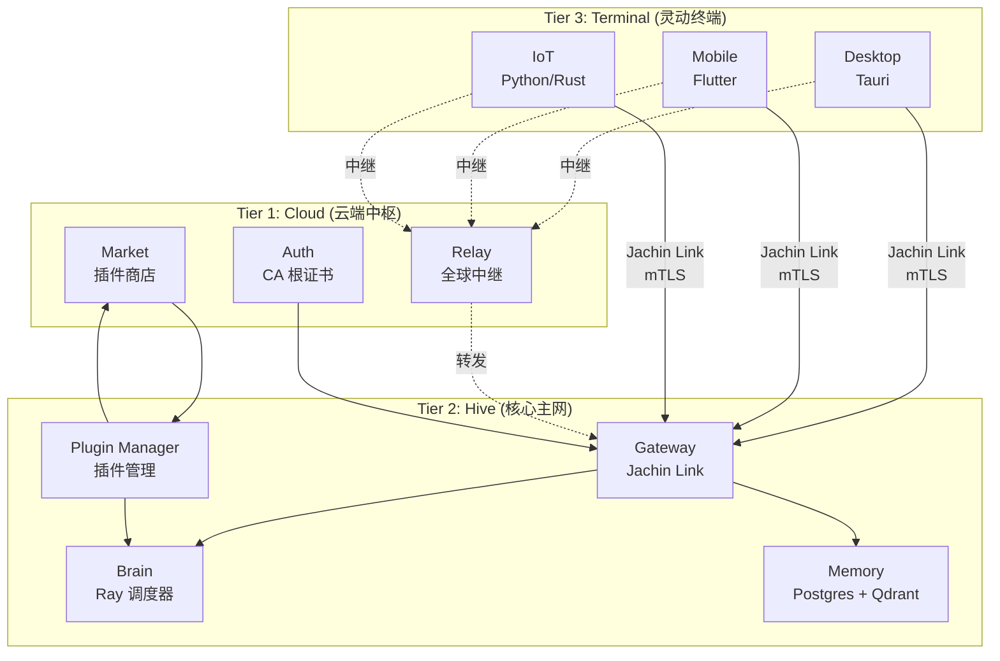
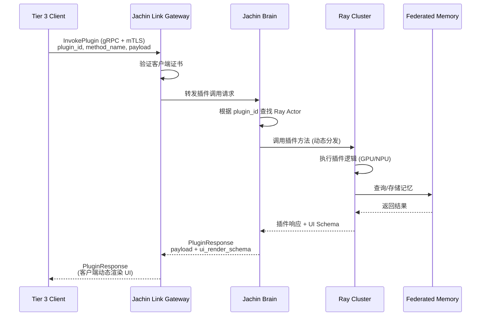
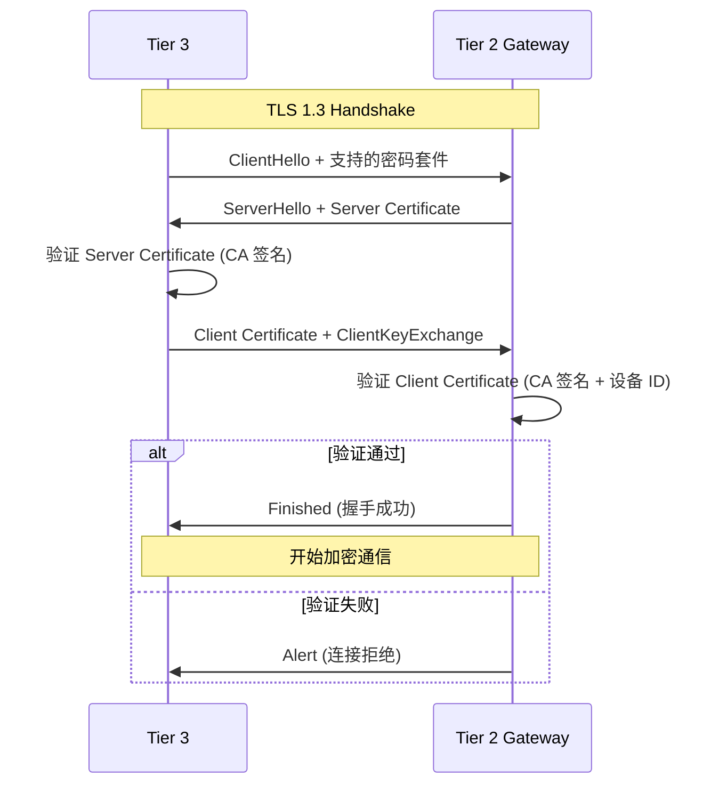
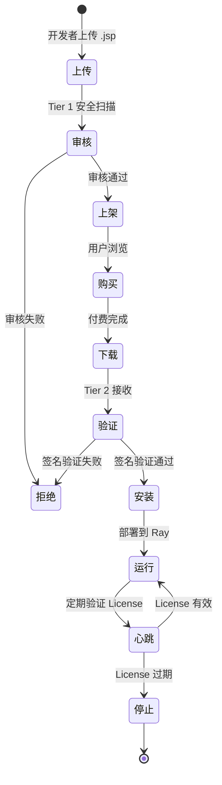

# Jachin-System 架构图与流程图

**版本**: v3.2 → v4.0 (Swarm & Edge)  
**日期**: 2026-02  
**状态**: ✅ 已更新

> **重要更新**: 协议已升级为通用信封模式（Envelope Pattern），支持插件无限扩展而无需修改协议。详见白皮书 4.4 章节。

---

## 0. v4.0 蜂群与边缘架构 (Swarm & Edge)

### 图 A: 全局蜂群拓扑 (Global Swarm Topology)

Tier 2 不再是一台机器，而是由家庭/办公室中多台设备组成的算力网络。



### 图 B: 大小脑路由逻辑 (Big-Little Brain Routing)

任务按复杂度分流，确保「杀鸡不用牛刀」。



### 流程说明

- **Edge Reflex**: Tier 3 本地 SLM/规则引擎处理极简指令，无需 Tier 2 介入
- **Model Router**: Tier 2 入口根据 `estimate_complexity_score(query)` 路由：Score < 0.3 → SmallModel，> 0.8 → CloudModel
- **Swarm Scheduler**: 根据 `capability.compute` (cpu_light | gpu_heavy) 将任务分配到对应 Ray Node

---

## 1. Jachin Link 连接流程 (The Stealth Connection)

### 序列图



### 流程说明

#### 首次配对阶段（The Only Scan）
1. **Tier 2 (Hive)** 生成自签名 CA 根证书和配对二维码
2. **Tier 3 (User)** 扫描二维码，获取 Server ID 和临时 Token
3. **Tier 3** 在本地生成 RSA 私钥（硬件绑定）
4. **Tier 3** 生成 CSR（证书签名请求）并发送给 Tier 2
5. **Tier 2** 验证 Token 有效性，签发客户端证书
6. **Tier 2** 返回客户端证书（PEM 格式），永久有效

#### 日常连接阶段（Zero Trust）
1. **Tier 3** 检测当前网络环境
2. **局域网场景**：
   - 使用 mDNS 发现 Tier 2
   - 直接建立 gRPC over HTTPS 连接
   - mTLS 双向认证
3. **广域网场景**：
   - 连接 Tier 1 中继节点
   - Tier 1 转发加密流量（端到端加密，无法解密）
   - 最终到达 Tier 2
4. **连接建立**：mTLS 握手成功，开始传输 AI 指令

---

## 2. 插件商业闭环流程 (The Economy Loop)

### 流程图

```mermaid
graph LR
    Dev[开发者] -->|上传/定价| Market[Tier 1 商城]
    Market -->|安全扫描/签名| Market
    User[用户] -->|浏览/付费| Market
    Market -->|分账 (70/30)| Dev
    Market -->|下发 .jsp + License| Hive[Tier 2 本地]
    Hive -->|验证签名| Installer[插件管理器]
    Installer -->|部署隔离环境| Ray[Ray Worker]
    Ray -->|每日心跳验证| Market
```

### 流程说明

#### 开发者侧
1. **开发者** 上传插件包（.jsp）到 Tier 1 Market
2. **开发者** 设定价格（免费/一次性/订阅）
3. **Tier 1 Market** 进行安全扫描和代码审核
4. **Tier 1 Market** 添加官方签名（`developer_signature`）
5. 插件上架，等待用户购买

#### 用户侧
1. **用户** 在 Tier 1 Market 浏览插件
2. **用户** 付费购买（或选择免费插件）
3. **Tier 1 Market** 生成 License Key
4. **Tier 1 Market** 下发 .jsp 包和 License Key 到 Tier 2

#### Tier 2 侧
1. **插件管理器** 接收 .jsp 包
2. **插件管理器** 验证 Tier 1 官方签名
3. **插件管理器** 验证 License Key（付费插件）
4. **插件管理器** 解压插件到 `skills_repo/`
5. **插件管理器** 创建 Ray RuntimeEnv（隔离环境）
6. **Ray Worker** 运行插件代码
7. **Ray Worker** 定期向 Tier 1 Market 发送心跳验证 License

#### 商业模式
- **分账比例**: 开发者 70%，平台 30%
- **License 验证**: 每日心跳，确保 License 有效
- **DRM 机制**: License 过期或退款时，自动停止插件运行

---

## 3. 三层架构交互图

### 架构概览



---

## 4. 数据流图

### AI 指令处理流程



---

## 5. 安全模型

### mTLS 双向认证流程



---

## 6. 插件生命周期

### 插件安装到运行流程



---

## 相关文档

- [v3.2 白皮书](whitepaper_v3.2_final.md) - 完整架构设计（含大小脑协同 3.5 节）
- [技术栈升级报告](V3.2_TECH_STACK_UPGRADE.md) - 实现细节
- [实施状态](V3.2_IMPLEMENTATION_STATUS_CONSOLIDATED.md) - 开发进度
