# Jachin 三层系统架构详解

> **分册**: 01 / 07 · [返回索引](./README.md)  
> **代码锚点**: `core/`（L2）、`l3_node/`（L3）、`cloud/nexus/`（L1）

---

## 目录

1. [设计原则与分层哲学](#一设计原则与分层哲学)
2. [三层职责总览](#二三层职责总览)
3. [L1 全球商城（Cloud）](#三l1-全球商城cloud)
4. [L2 本地数字仓库（Control Plane）](#四l2-本地数字仓库control-plane)
5. [L3 执行面（Execution Plane）](#五l3-执行面execution-plane)
6. [跨层数据流与时序](#六跨层数据流与时序)
7. [API Key 零信任安全模型](#七api-key-零信任安全模型)
8. [Skill/MCP 分发流程](#八skillmcp-分发流程)
9. [多节点集群拓扑](#九多节点集群拓扑)
10. [环境变量速查](#十环境变量速查)

---

## 一、设计原则与分层哲学

| 原则 | 说明 |
|------|------|
| **L2 不代理推理** | 控制面只管权限/Key/调度，LLM 调用全部在 L3 闭环 |
| **API Key 零信任** | L2 用 L3 公钥加密下发，L3 私钥解密后明文 Key 仅存内存 |
| **一店一库** | 每个企业有独立的 L2（数字仓库）；L1 是全局商城，不接触企业数据 |
| **本地闭环记忆** | L3 跨会话记忆在本机 Memory Nexus（SQLite）闭环，不依赖 L2 |
| **云边分治** | L1 负责商业分发，L2 负责企业控制，L3 负责设备侧推理 |

---

## 二、三层职责总览

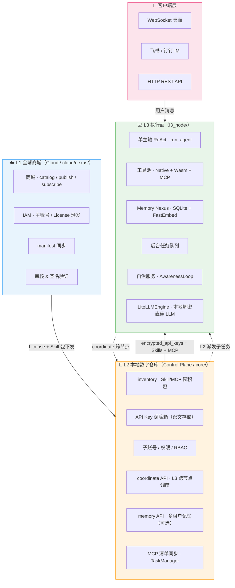

---

## 三、L1 全球商城（Cloud）

### 3.1 职责

L1 是**商业收银台**，只处理商业逻辑，**不接触企业明文数据，不提供推理算力**。

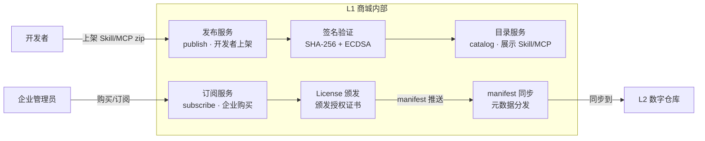

### 3.2 商品形态与四大原语映射

| 商品形态 | 文件格式 | 执行归类（四大原语） | 执行位置 |
|----------|---------|------------------|---------|
| Skill（含 Wasm） | `.jpp` / `.jsp` (ZIP) | **Tools（jpp）** + **Skills（SKILL.md）** | L3 本地沙箱 |
| MCP 插件 | `.jmp` (ZIP) | **MCP** (`mcp:*`) | L3 MCPManager |
| 纯声明 Skill | `SKILL.md` | **Skills** | L3 system prompt 注入 |

---

## 四、L2 本地数字仓库（Control Plane）

### 4.1 内部组件架构

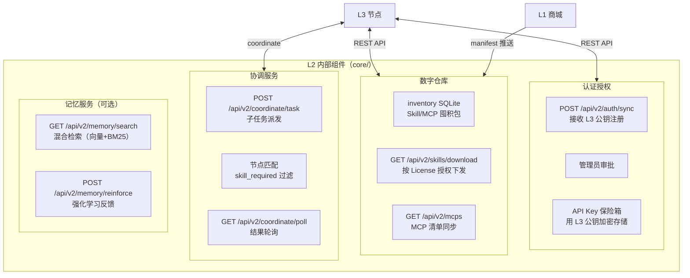

### 4.2 L2 关键 API 列表

| API | 方向 | 说明 |
|-----|------|------|
| `POST /api/v2/auth/sync` | L3 → L2 | L3 注册（携带公钥） |
| `GET /api/v2/auth/poll` | L3 → L2 | 轮询审批状态 |
| `GET /api/v2/keys` | L3 → L2 | 拉取密文 API Keys |
| `POST /api/v2/admin/nodes/assign` | 管理员 → L2 | 将节点分配给子账号 |
| `GET /api/v2/skills` | L3 → L2 | 拉取可用 Skill 列表 |
| `GET /api/v2/mcps` | L3 → L2 | 拉取 MCP 清单 |
| `POST /api/v2/coordinate/task` | L3 → L2 | 发起跨节点任务 |
| `GET /api/v2/coordinate/poll` | L3 → L2 | 轮询子任务结果 |
| `GET /api/v2/memory/search` | L3 → L2 | 多租户记忆检索（可选） |
| `POST /api/v2/memory/reinforce` | L3 → L2 | 反馈强化分（可选） |

---

## 五、L3 执行面（Execution Plane）

### 5.1 L3 内部组件全图

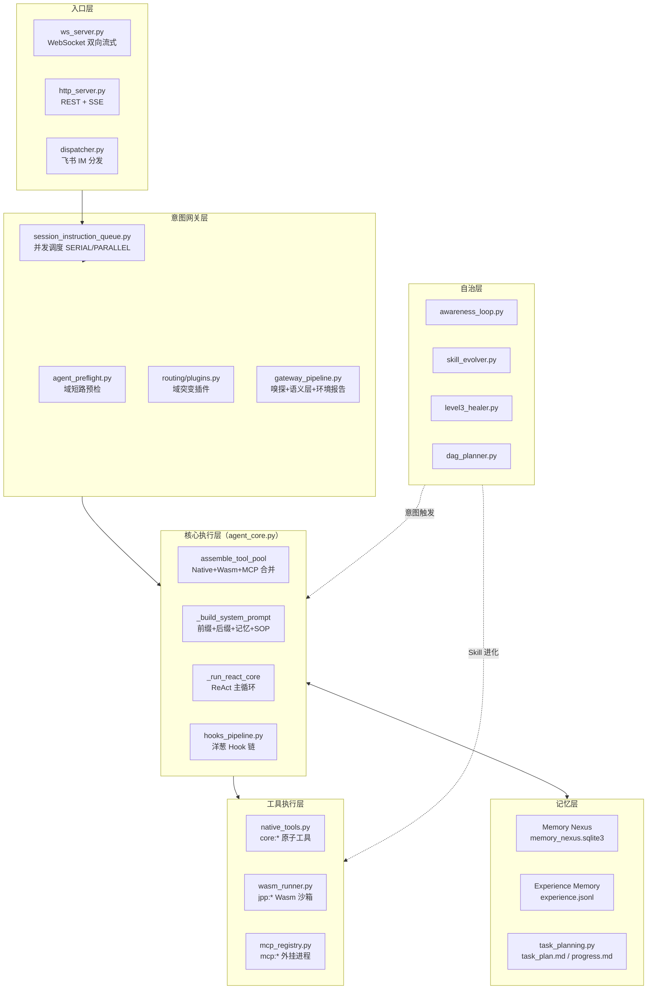

### 5.2 L3 启动流程

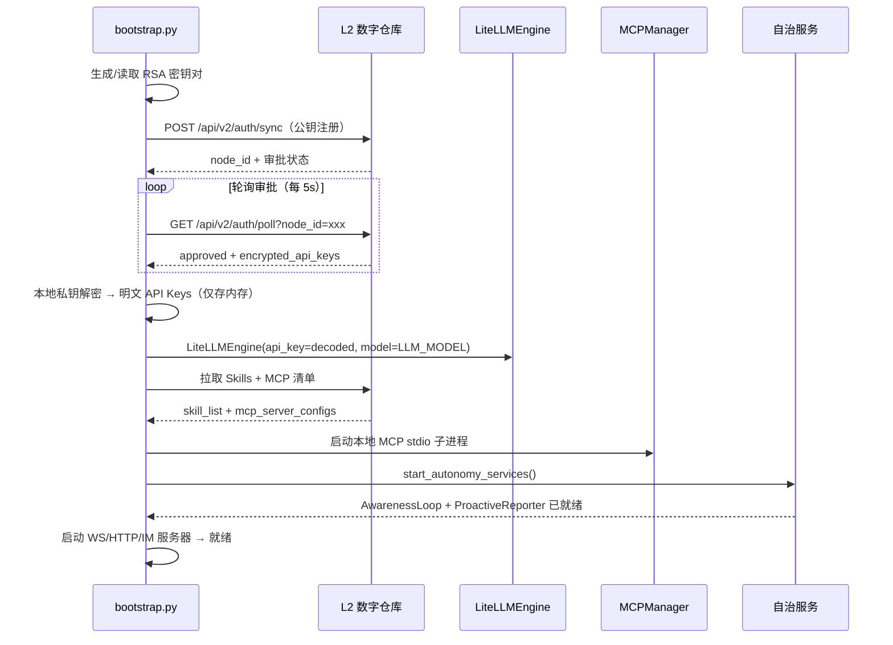

---

## 六、跨层数据流与时序

### 6.1 完整启动 + 运行时序

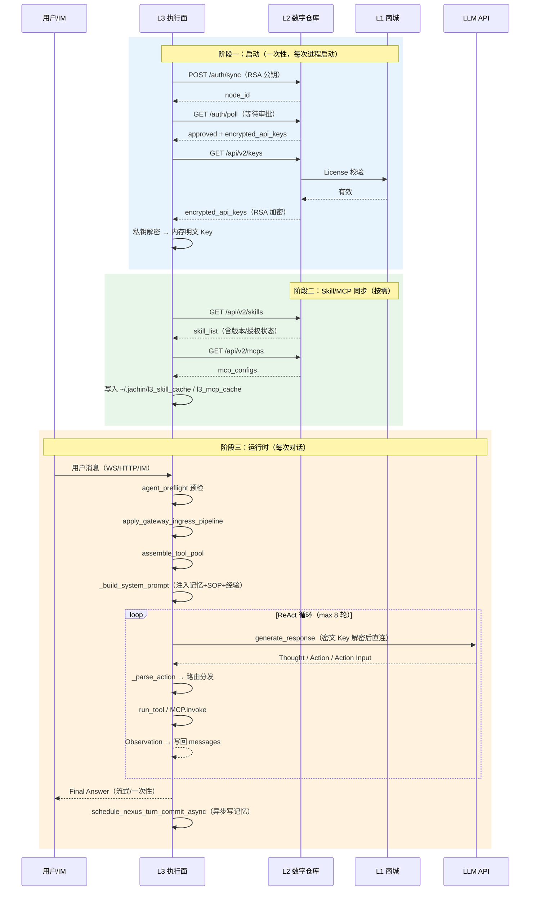

### 6.2 coordinate 跨节点时序

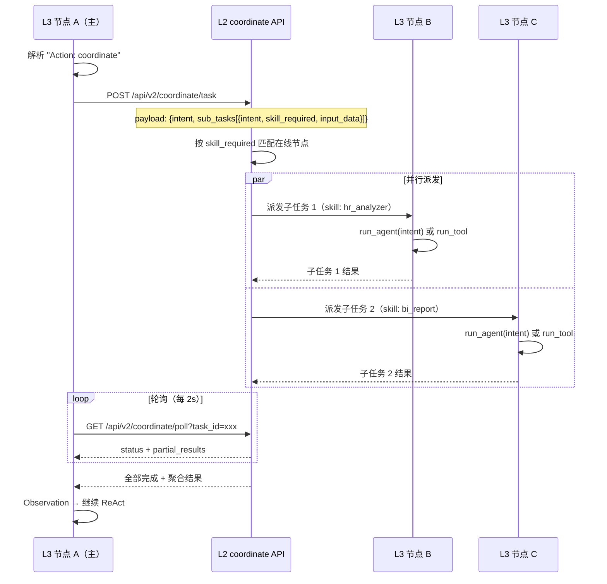

---

## 七、API Key 零信任安全模型

### 7.1 密钥流转全流程

```mermaid
flowchart LR
    subgraph L3_KEYGEN["L3 密钥生成（一次性）"]
        GEN["RSA 4096 密钥对生成\n~/.jachin/keys/node_private.pem\n~/.jachin/keys/node_public.pem"]
    end

    subgraph L2_ENCRYPT["L2 加密下发"]
        L2_RECV["接收公钥 + 注册 node_id"]
        ADMIN["管理员审批\nPOST /api/v2/admin/nodes/assign"]
        ENCRYPT["用 L3 公钥加密\nRSA-OAEP + AES-256 对 API Keys 加密"]
        STORE["密文存 L2 数据库\n明文永不落盘"]
    end

    subgraph L3_DECRYPT["L3 解密使用"]
        PULL["GET /api/v2/keys → 密文包"]
        DECRYPT["本地私钥解密\n~/.jachin/keys/node_private.pem"]
        MEMORY["内存明文 Key\n仅在 LiteLLMEngine 实例内"]
        DIRECT["HTTPS 直连 LLM API\napi.openai.com / dashscope"]
    end

    GEN -->|"公钥"| L2_RECV
    L2_RECV --> ADMIN --> ENCRYPT --> STORE
    STORE -->|"encrypted_api_keys"| PULL
    PULL --> DECRYPT --> MEMORY --> DIRECT

    style MEMORY fill:#fff9c4,stroke:#fbc02d
    style DECRYPT fill:#c8e6c9,stroke:#388e3c
    style DIRECT fill:#e3f2fd,stroke:#1976d2
```

### 7.2 安全边界约束

| 约束 | 实现 |
|------|------|
| L3 明文 Key 仅存内存 | 解密结果仅传给 `LiteLLMEngine`，不写磁盘、不打日志 |
| L2 不持有明文 | 只存 RSA 加密后的密文包 |
| Key 轮换 | L2 可重新下发新密文包，L3 重启后重新拉取 |
| 断网降级 | `PolicyEnforcer` 断网时从 `role_permissions` 缓存降级 |
| 子账号隔离 | L3 需携带 `X-Sub-Account-Id` 才能访问受限 API |

---

## 八、Skill/MCP 分发流程

### 8.1 Skill 从开发到运行的全链路

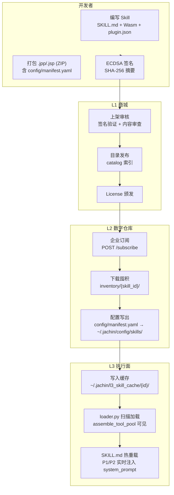

### 8.2 MCP 分发与启动流程

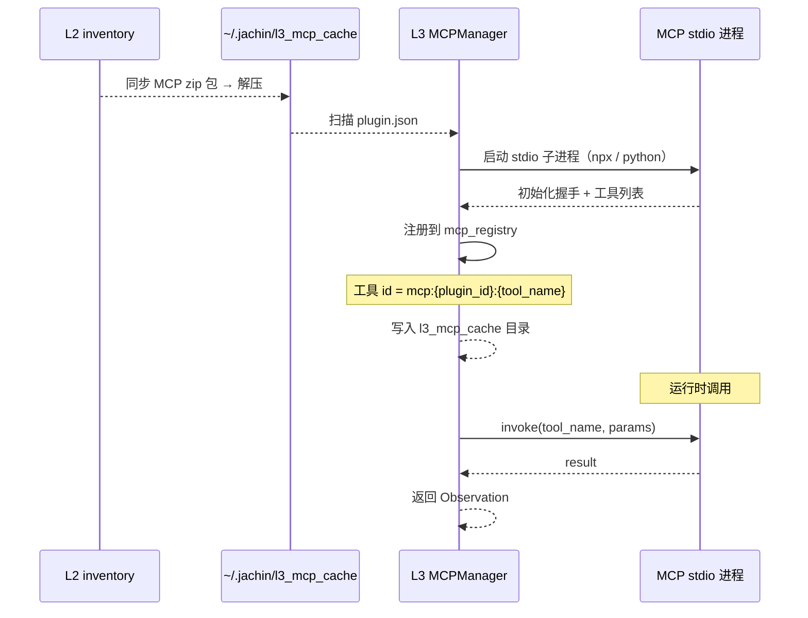

---

## 九、多节点集群拓扑

### 9.1 典型企业部署拓扑

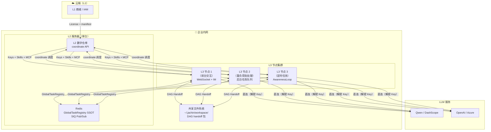

### 9.2 DAG 跨节点转交流程

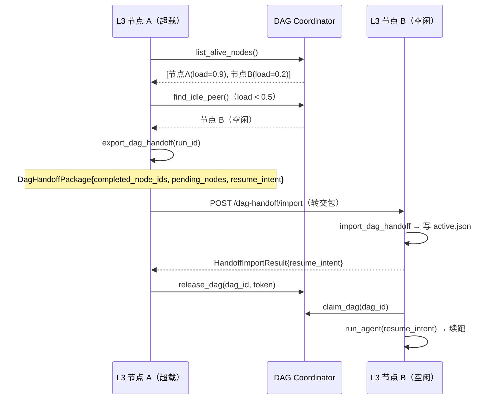

---

## 十、环境变量速查

| 变量 | 层级 | 作用 | 默认值 |
|------|------|------|--------|
| `JACHIN_HOME` | L3 | 配置根目录 | `~/.jachin` |
| `LLM_MODEL` | L3 | 日常档模型 | `qwen3.5-plus` |
| `LLM_COMPLEX_MODEL` | L3 | 复杂档模型 | `qwen-max` |
| `LLM_CODER_MODEL` | L3 | 编码档模型 | `qwen3-coder-plus` |
| `DASHSCOPE_API_KEY` | L3 | DashScope Key（启动前可选，通常由 L2 下发） | — |
| `JACHIN_L2_BASE_URL` | L3 | L2 服务地址 | — |
| `JACHIN_GLOBAL_REGISTRY_ENABLE` | L3 | 开启跨进程任务注册表 | `0` |
| `JACHIN_GLOBAL_REGISTRY_REDIS` | L3 | 使用 Redis 集群 SSOT | `0` |
| `JACHIN_REDIS_URL` | L3 | Redis 连接串 | — |
| `JACHIN_COORDINATOR_ENABLE` | L3 | 开启 DAG Coordinator | `0` |
| `JACHIN_COORDINATOR_PEER_URLS` | L3 | Peer 节点 URL 列表（逗号分隔） | — |
| `JACHIN_L2_STDIO_MCP` | L2 | L2 启动 stdio MCP 子进程（回滚模式） | `0` |

---

**上一篇**: [README.md](./README.md)  
**下一篇**: [02_MAIN_AGENT_DESIGN.md](./02_MAIN_AGENT_DESIGN.md)
