# Jachin 主 Agent 设计详解

> **分册**: 02 / 07 · [返回索引](./README.md)  
> **代码锚点**: `l3_node/agent_core.py`（`run_agent`、`_build_system_prompt`、`_run_react_core`）  
> **专题 SSOT**: [`L3_AGENT_CONTEXT_MEMORY_AND_PROMPT.md`](../L3_AGENT_CONTEXT_MEMORY_AND_PROMPT.md)、[`JACHIN_HYBRID_AGENT_ARCHITECTURE.md`](../architecture/JACHIN_HYBRID_AGENT_ARCHITECTURE.md)

---

## 目录

1. [核心设计哲学](#一核心设计哲学)
2. [run_agent 入口全流程](#二run_agent-入口全流程)
3. [ReAct 循环引擎](#三react-循环引擎)
4. [System Prompt 拼装工程](#四system-prompt-拼装工程)
5. [三档模型自动路由](#五三档模型自动路由)
6. [工具池组装（assemble_tool_pool）](#六工具池组装assemble_tool_pool)
7. [意图网关与预检（agent_preflight）](#七意图网关与预检agent_preflight)
8. [Hook 链体系](#八hook-链体系)
9. [上下文管理与 metadata](#九上下文管理与-metadata)
10. [前台/后台通道区分](#十前台后台通道区分)

---

## 一、核心设计哲学

Jachin 主 Agent 的最核心原则：

```
单主轴 ReAct：永远只有一条 run_agent 主循环
                ↕ 按需扩展
  ┌─────────────────────────────────────────┐
  │  delegate → SubAgent (嵌套 run_agent)    │
  │  coordinate → L2 跨节点（轮询等待）       │
  │  submit_background_task → 异步队列        │
  └─────────────────────────────────────────┘
```

**不是**「对等多 Agent 拓扑」：主 Agent 是绝对中心，其他形态是其正交分支。

---

## 二、run_agent 入口全流程

### 2.1 入口总览

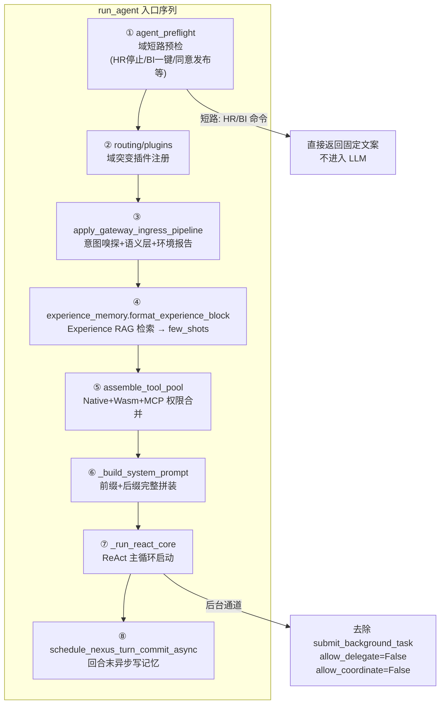

### 2.2 详细入口时序

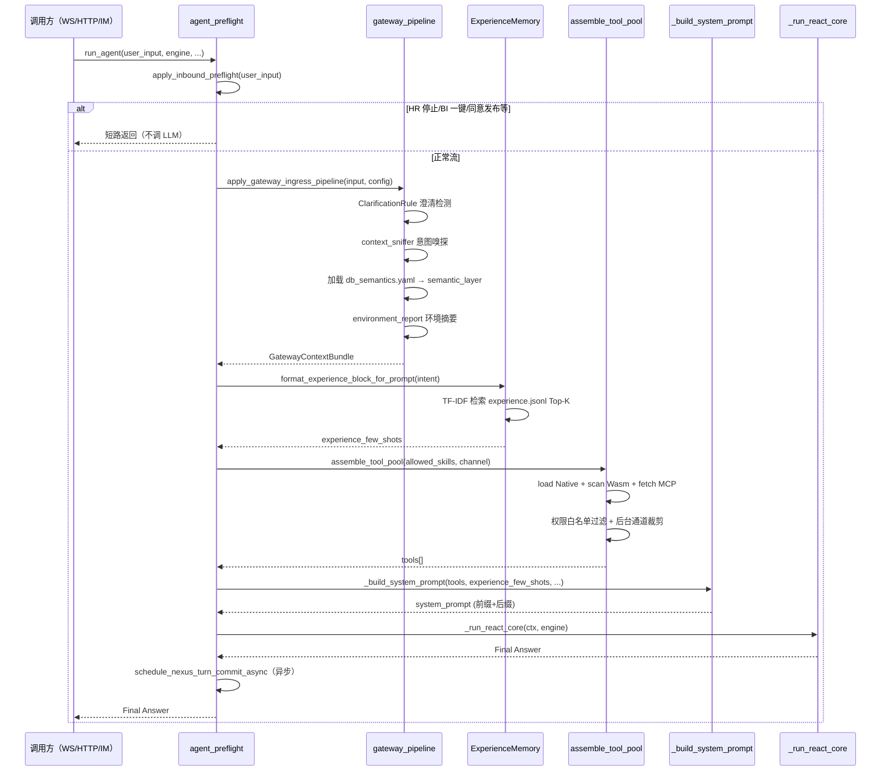

---

## 三、ReAct 循环引擎

### 3.1 单轮迭代完整流程

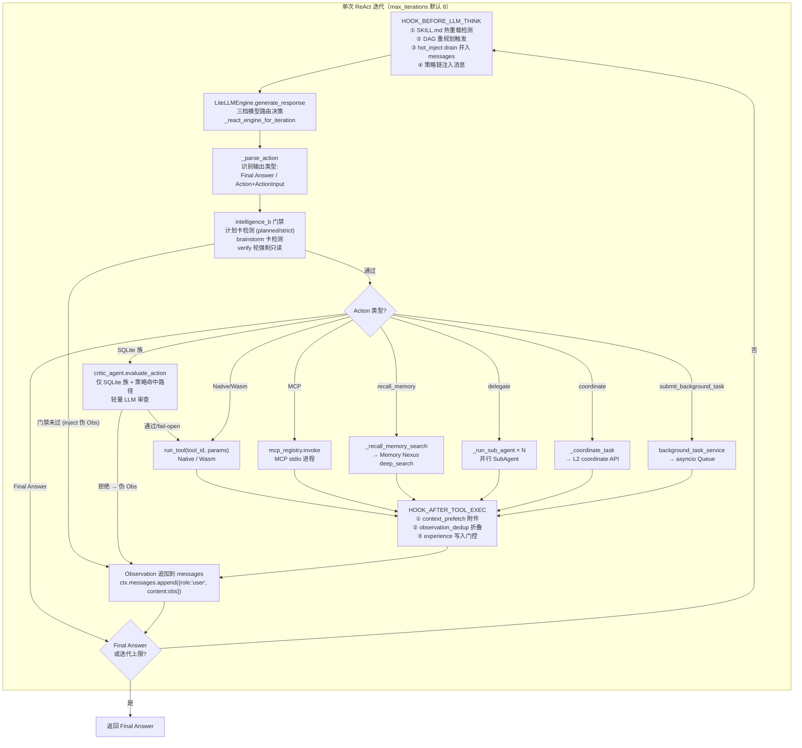

### 3.2 ReAct 详细时序

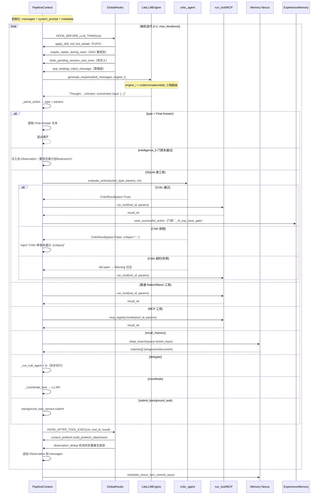

### 3.3 _parse_action 解析逻辑

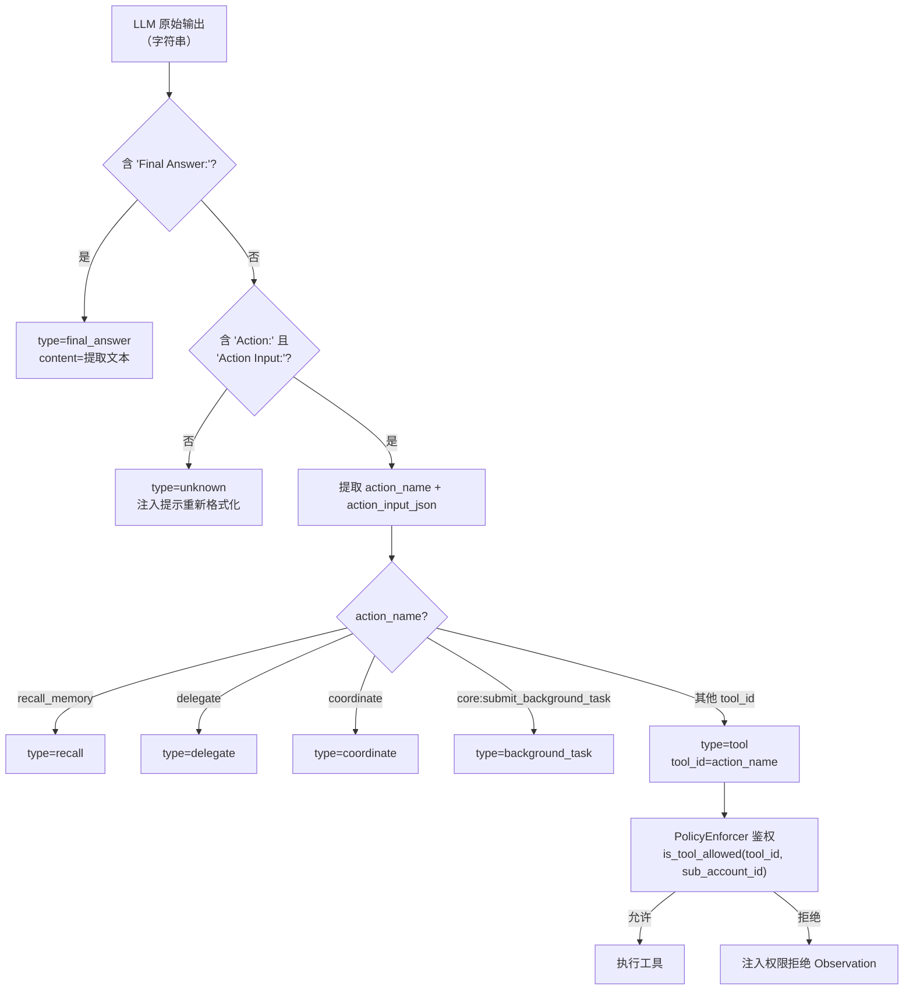

---

## 四、System Prompt 拼装工程

### 4.1 拼装层次结构

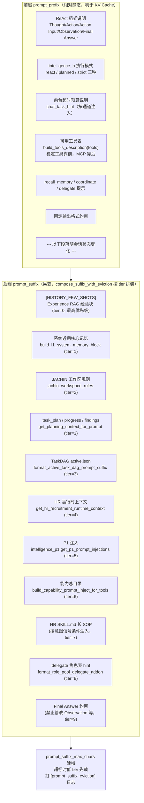

### 4.2 后缀 tier 优先级与裁剪规则

| tier | 内容块 | 优先级 | 备注 |
|------|--------|--------|------|
| 0 | Experience RAG `[HISTORY_FEW_SHOTS]` | 最高 | 历史成功路径，最重要 |
| 1 | Memory Nexus L1 近期核心记忆 | 高 | L0(Core_Profile) + L1(General_Chat) |
| 2 | JACHIN 工作区规则 | 高 | `workspace/JACHIN.md` |
| 3 | task_plan / progress + TaskDAG | 中 | 跨轮任务状态 |
| 4 | HR 运行时上下文 | 中 | 含 scheduler 状态 |
| 5 | P1 注入 | 中 | 意图-工具统计 |
| 6 | 能力总目录 | 低 | DOMAIN_REGISTRY 注入 |
| 7 | HR SKILL.md 长 SOP | 低 | 按意图信号条件注入 |
| 8 | delegate 角色表 | 低 | 仅当 allow_delegate=True |
| 9 | Final Answer 约束 | 最低 | 格式约束兜底 |

### 4.3 子 Agent System Prompt（简化版）

子 Agent **不走** `_build_system_prompt` 完整流程，使用简化版：

```
{role_short_prompt}            ← SUB_AGENT_PROMPTS[role]
可用工具：
{build_tools_description(allowed_tools)}
输出格式：Thought / Action / Action Input / Observation / Final Answer
```

---

## 五、三档模型自动路由

### 5.1 路由决策树

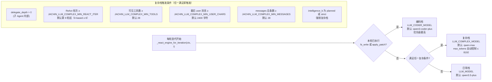

### 5.2 模型路由配置

| 配置方式 | 优先级 | 说明 |
|----------|--------|------|
| `nexus_config.json` → `llm.complex_model_name` | 高 | 覆盖 `LLM_COMPLEX_MODEL` |
| 环境变量 `LLM_COMPLEX_MODEL` | 中 | 进程级设置 |
| 环境变量 `LLM_MODEL` | 低 | 日常档默认 |
| `JACHIN_LLM_COMPLEX_DISABLE=1` | 特殊 | 关闭自动复杂路由 |

---

## 六、工具池组装（assemble_tool_pool）

### 6.1 组装流程

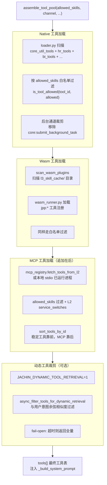

### 6.2 工具 ID 命名规范

| 前缀 | 原语归类 | 示例 |
|------|---------|------|
| `core:` | Tools（Native） | `core:fs_read`、`core:shell_exec`、`core:local_memory_search` |
| `jpp:` | Tools（Wasm） | `jpp:hr_analyzer4`、`jpp:bi_report` |
| `mcp:` | MCP | `mcp:atom_web_scraper:search`、`mcp:feishu:send_message` |

---

## 七、意图网关与预检（agent_preflight）

### 7.1 预检短路逻辑

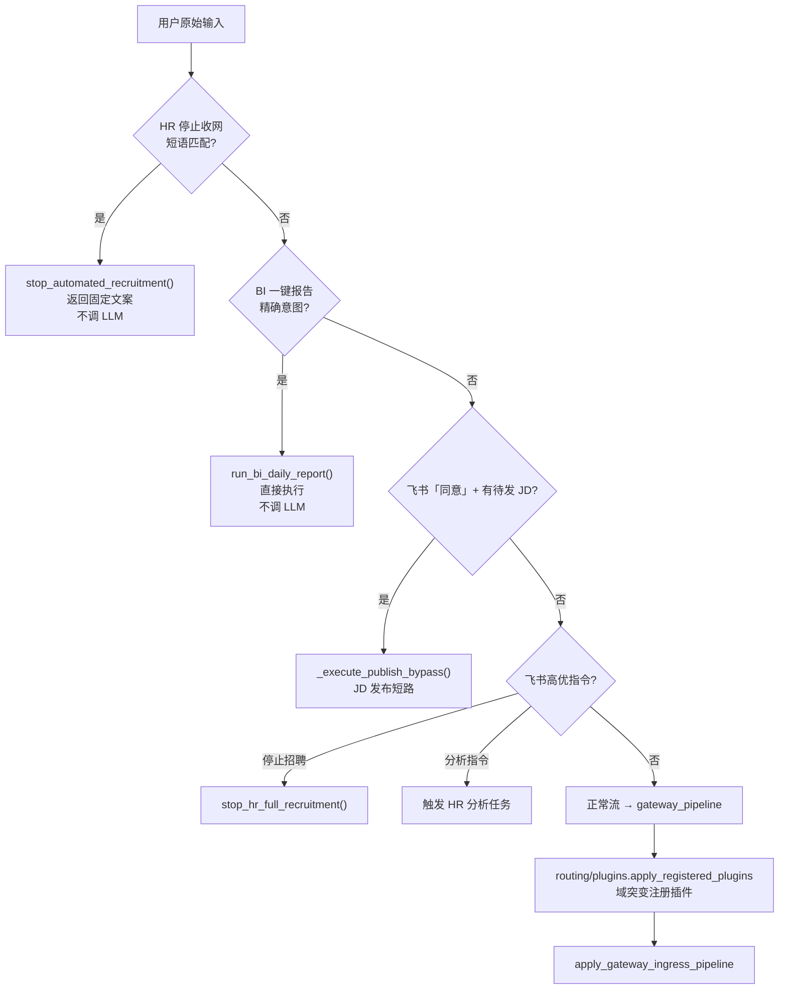

### 7.2 意图网关内部

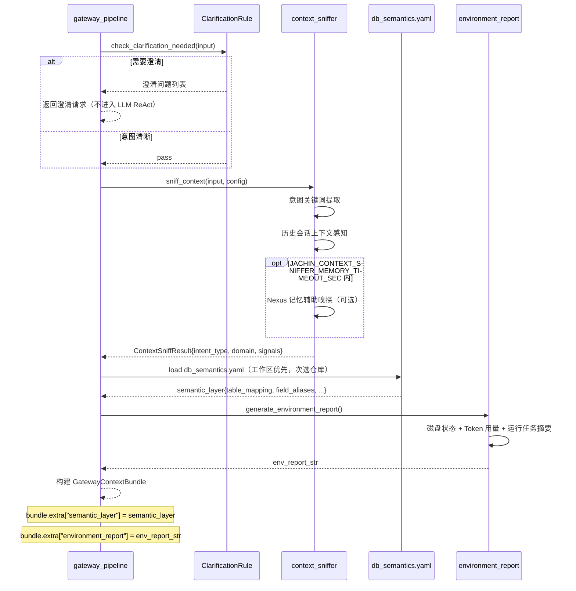

---

## 八、Hook 链体系

### 8.1 Hook 触发点全景

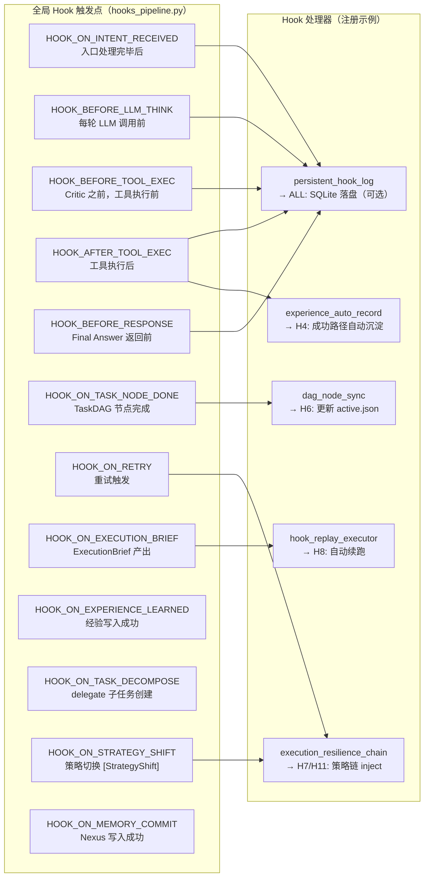

### 8.2 Hook 持久化与回放

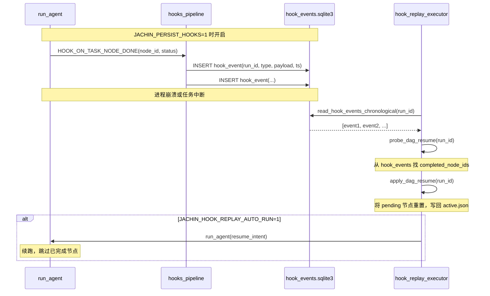

---

## 九、上下文管理与 metadata

### 9.1 PipelineContext.metadata 关键字段

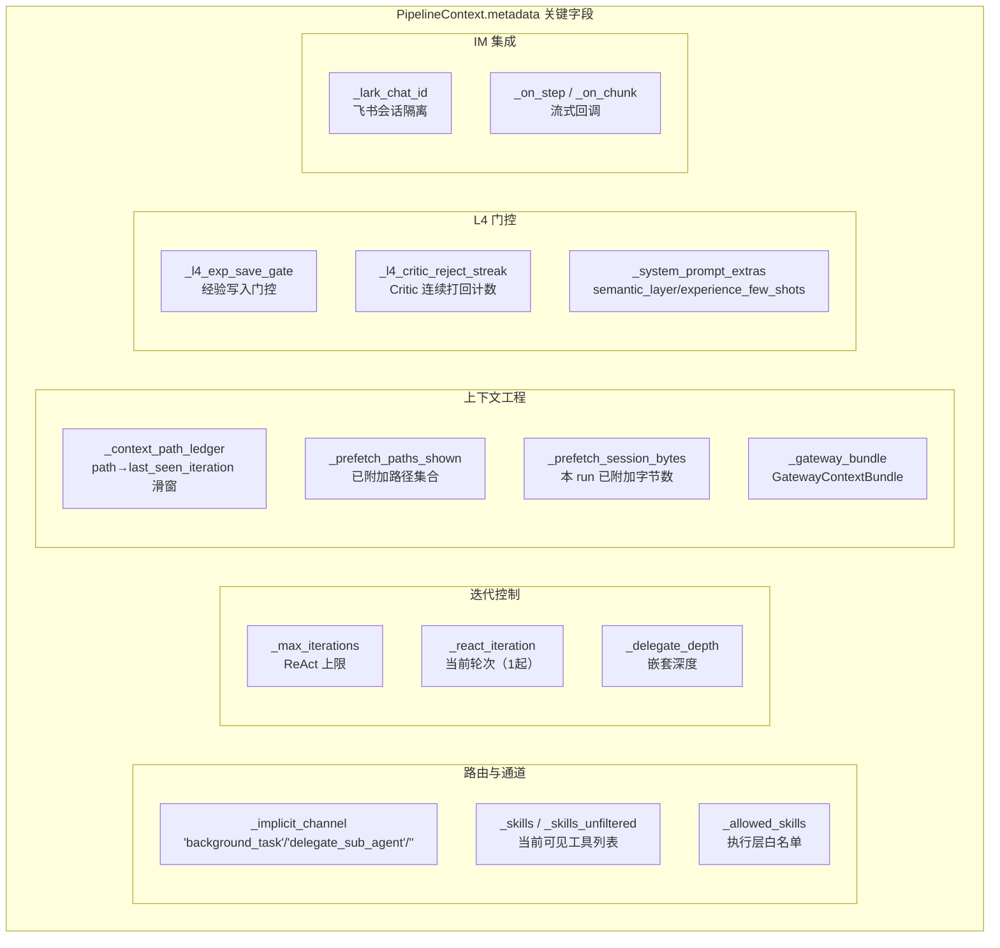

### 9.2 context_path_ledger 去重机制

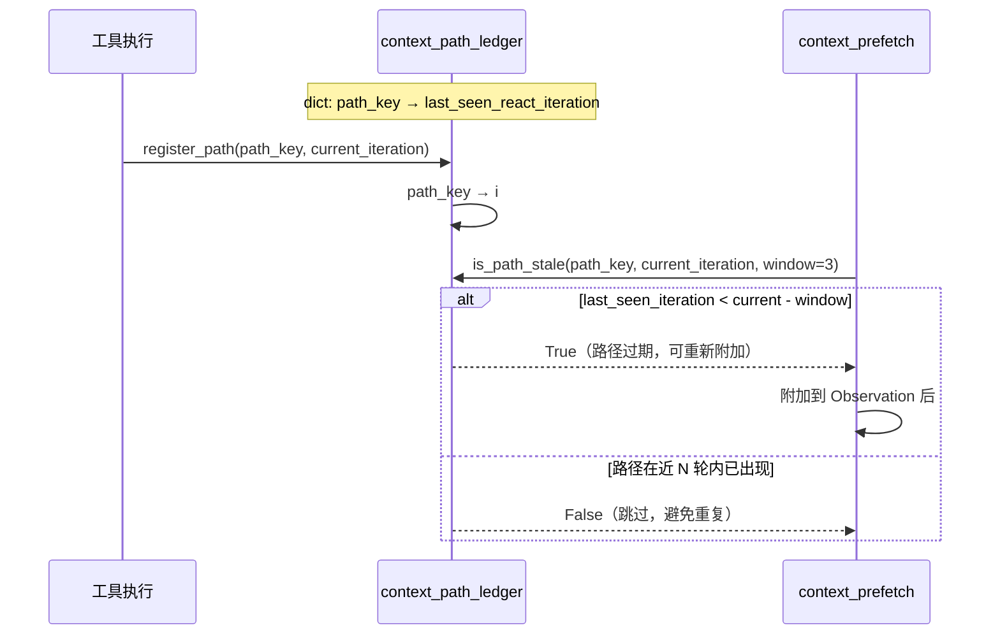

---

## 十、前台/后台通道区分

### 10.1 通道差异对比

| 特性 | 前台（websocket/lark_im） | 后台（background_task） |
|------|--------------------------|------------------------|
| `run_agent` 调用方式 | 同步（SIQ/chat_lock 保序） | 异步（bg-worker-N 消费） |
| 可用工具 | 完整工具表 | 去除 `submit_background_task` |
| allow_delegate | ✅ 允许 | ✗ 关闭 |
| allow_coordinate | ✅ 允许 | ✗ 关闭 |
| context_prefetch | ✅ 附加 | ✗ 跳过 |
| 超时机制 | `asyncio.wait_for` 前台预算 | 无超时限制 |
| 结果推送 | 流式返回用户 | WebSocket broadcast |
| TaskDAG 重规划 | ✅ 每 N 轮 | ✗ 关闭 |

### 10.2 后台任务提交与执行

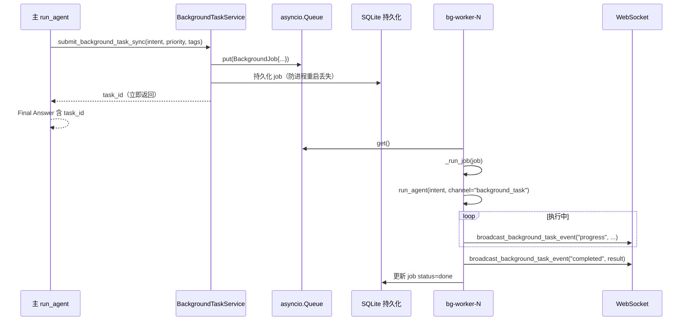

---

**上一篇**: [01_THREE_LAYER_SYSTEM.md](./01_THREE_LAYER_SYSTEM.md)  
**下一篇**: [03_MULTI_AGENT.md](./03_MULTI_AGENT.md) — 多 Agent 架构详解
