# Jachin 多 Agent 架构详解

> **分册**: 03 / 07 · [返回索引](./README.md)  
> **代码锚点**: `l3_node/agent_core.py`（delegate/coordinate 分支）、`l3_node/primitives/multi_agent/`、`l3_node/primitives/agent_tasks/background_task_service.py`

---

## 目录

1. [设计原则：单主轴 + 正交分支](#一设计原则单主轴--正交分支)
2. [四种多 Agent 形态](#二四种多-agent-形态)
3. [delegate — 同进程 SubAgent（主路径）](#三delegate--同进程-subagent主路径)
4. [SubAgent 角色体系](#四subagent-角色体系)
5. [三种编排模式](#五三种编排模式)
6. [coordinate — 跨节点 L2 调度](#六coordinate--跨节点-l2-调度)
7. [后台异步 Agent Task](#七后台异步-agent-task)
8. [StructuredResultMerger（结果合并）](#八structuredresultmerger结果合并)
9. [并发控制与限速](#九并发控制与限速)
10. [禁止事项与安全边界](#十禁止事项与安全边界)

---

## 一、设计原则：单主轴 + 正交分支

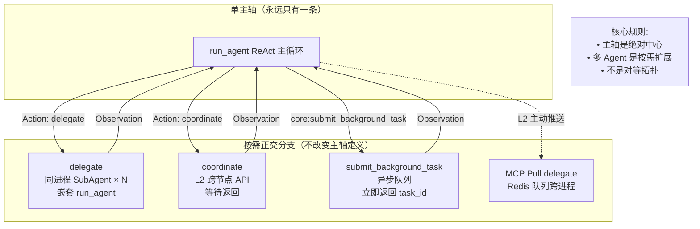

**多 Agent 的价值场景**：

| 场景 | 单 Agent 问题 | 多 Agent 价值 |
|------|-------------|--------------|
| 同时分析 10 份简历 | 串行 O(n) 时间，前台等待 | FanOut 并行 → O(1) |
| 编码 + 文档 + 测试 | 角色混淆，模型切换出错 | 专属角色 SubAgent |
| 大型重构任务 | max_iterations 耗尽截断 | Pipeline 分阶段 |
| 方案评审 | 单模型无法自我质疑 | Discussion 辩论模式 |
| 多设备集群 | 单节点算力/速率有限 | coordinate 跨节点 |

---

## 二、四种多 Agent 形态

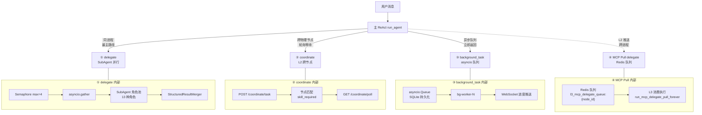

---

## 三、delegate — 同进程 SubAgent（主路径）

### 3.1 完整执行流程

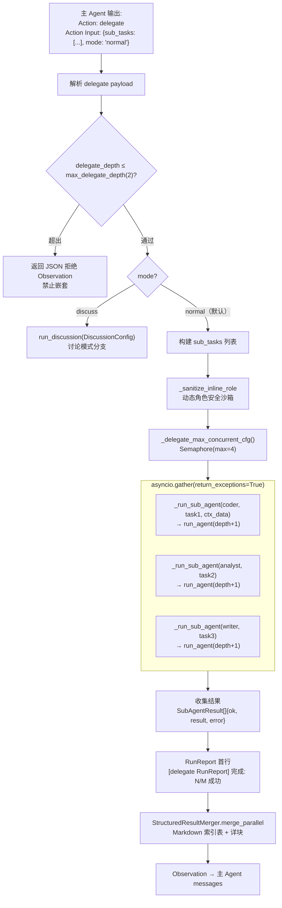

### 3.2 delegate 详细时序

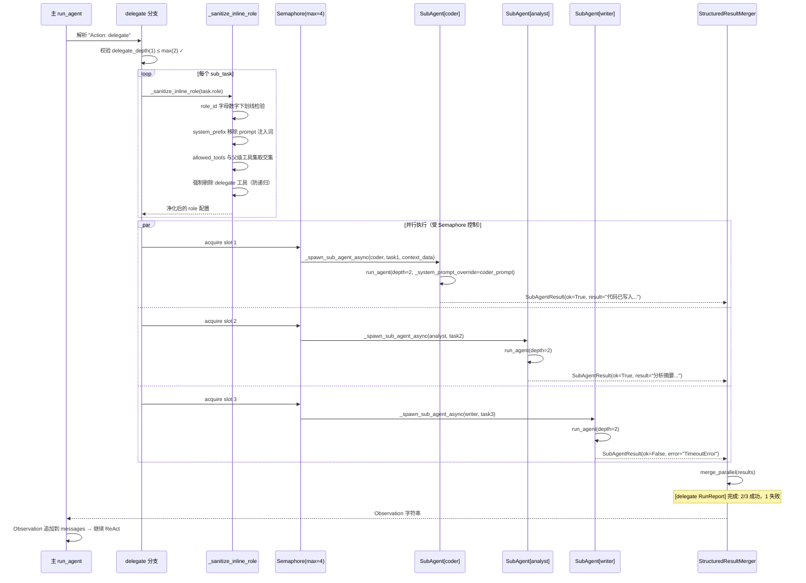

---

## 四、SubAgent 角色体系

### 4.1 角色分类与工具集

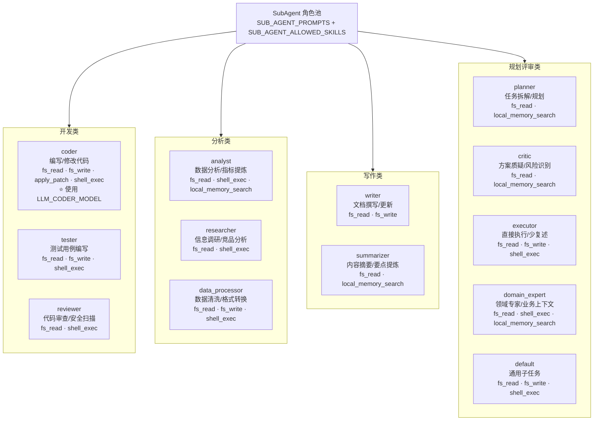

### 4.2 SubAgent 生命周期

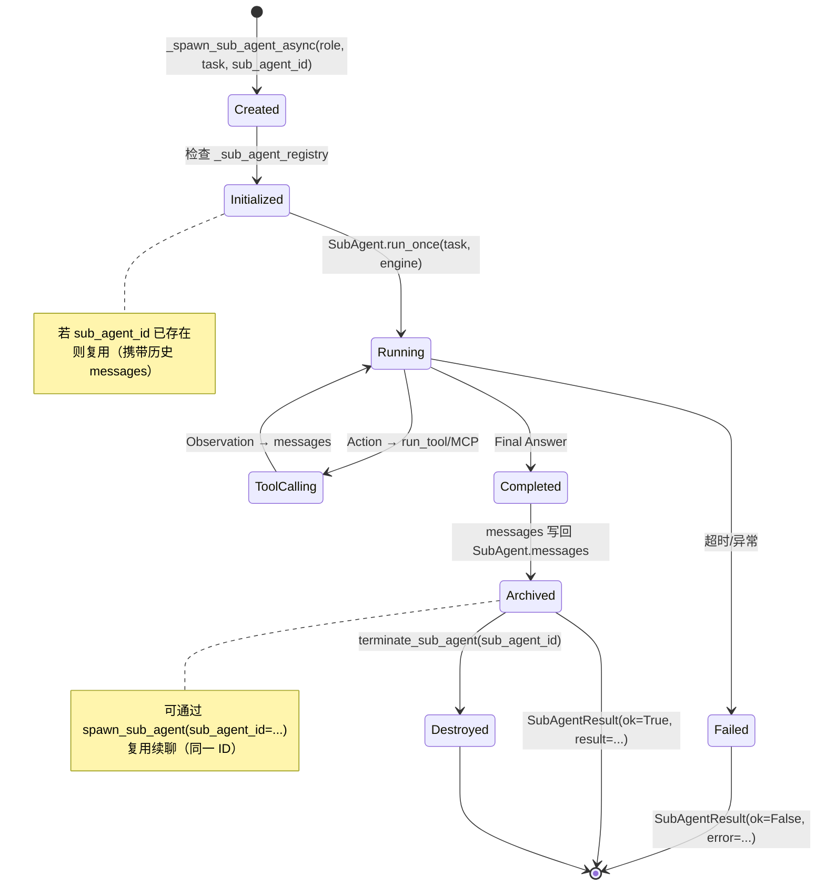

### 4.3 动态角色安全沙箱

当 `sub_tasks[i]["role"]` 为 dict（内联角色）时触发：

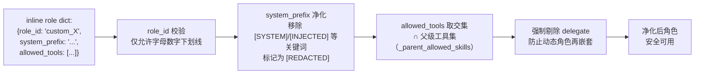

---

## 五、三种编排模式

### 5.1 模式 A：FanOut 并行（批量同构）

**适用**：多份相同类型的子任务，互相独立，可并行处理。

```mermaid
flowchart LR
    INPUT_F["输入列表\n[item1, item2, ..., itemN]"]
    FAN2["fanout_parallel()\nl3_node/primitives/multi_agent/fanout.py"]

    subgraph PAR_F["asyncio.gather(max_concurrent=3)"]
        F1_W["SubAgent[analyst]\nitem1"]
        F2_W["SubAgent[analyst]\nitem2"]
        F3_W["SubAgent[analyst]\nitem3"]
        FN_W["SubAgent[analyst]\nitemN"]
    end

    INPUT_F --> FAN2 --> PAR_F

    subgraph RESULT_F["FanoutResult"]
        FR_S["status: completed/partial/failed"]
        FR_O["ok_count: N"]
        FR_F["failed_count: M"]
        FR_I["items: FanoutItemResult[]\n{index, ok, result, error, error_class}"]
        FR_D["degraded: bool (有失败但有成功)"]
        FR_E["elapsed_sec: float"]
    end

    PAR_F --> RESULT_F
```

**典型使用代码示意**：

```python
# 批量简历分析
result = await fanout_parallel(
    items=[
        {"role": "analyst", "task": f"分析候选人简历，评估是否匹配后端工程师 JD",
         "context_data": resume_text}
        for resume_text in resume_list
    ],
    engine=engine,
    max_concurrent=3,
    delegate_depth=1,
)
if result.status in ("completed", "partial"):
    for item in result.ok_items:
        print(f"简历 {item.index}: {item.result[:300]}")
```

### 5.2 模式 B：Pipeline 流水线（有依赖链）

**适用**：多阶段任务，前一阶段输出是后一阶段输入。

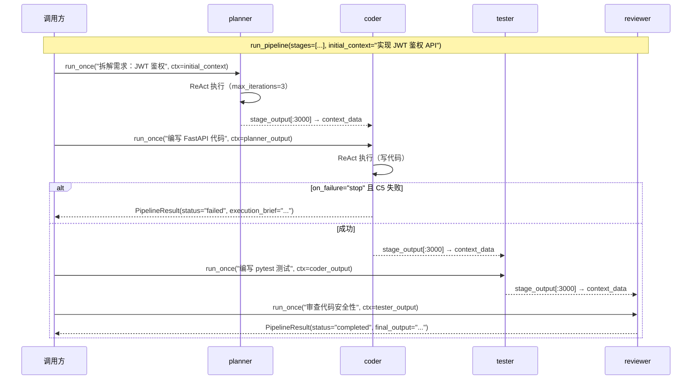

**失败策略对比**：

| 策略 | 行为 | 适用场景 |
|------|------|---------|
| `on_failure="stop"`（默认） | 失败时生成 ExecutionBrief 并中止 | 强依赖链，后续阶段依赖前阶段 |
| `on_failure="continue"` | 跳过失败阶段，继续后续 | 非阻塞采集，部分缺失可接受 |

### 5.3 模式 C：Discussion 讨论/辩论（复杂决策）

**适用**：方案评审、架构选型、有争议的判断。

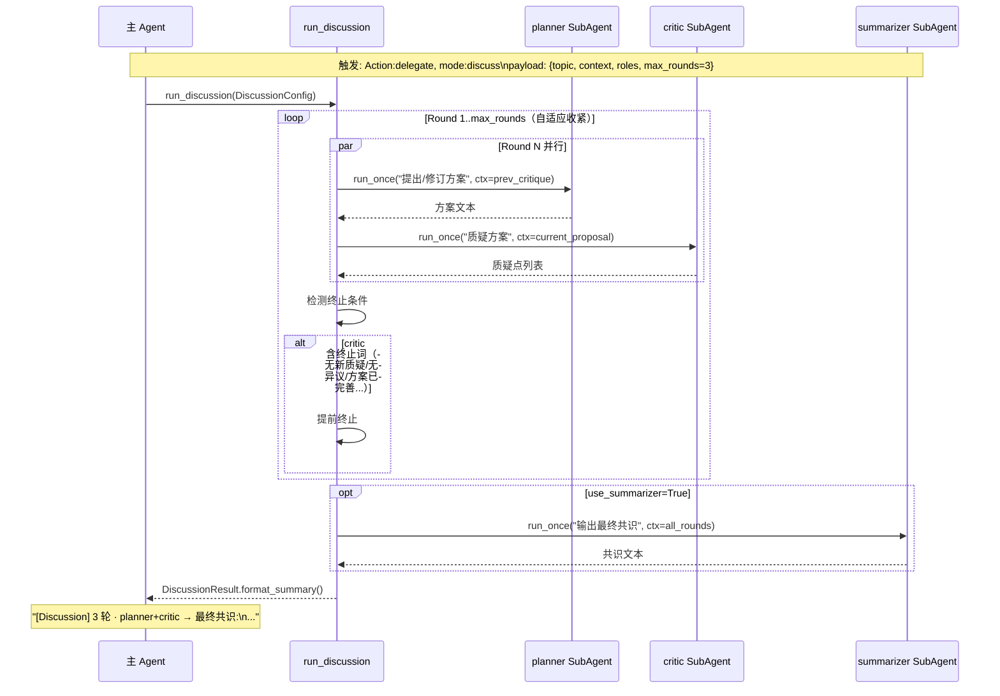

**自适应轮次**（`JACHIN_DISCUSS_ADAPTIVE_ROUNDS=1`）：

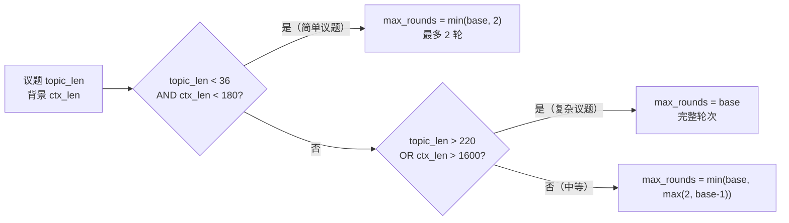

---

## 六、coordinate — 跨节点 L2 调度

### 6.1 coordinate 完整时序

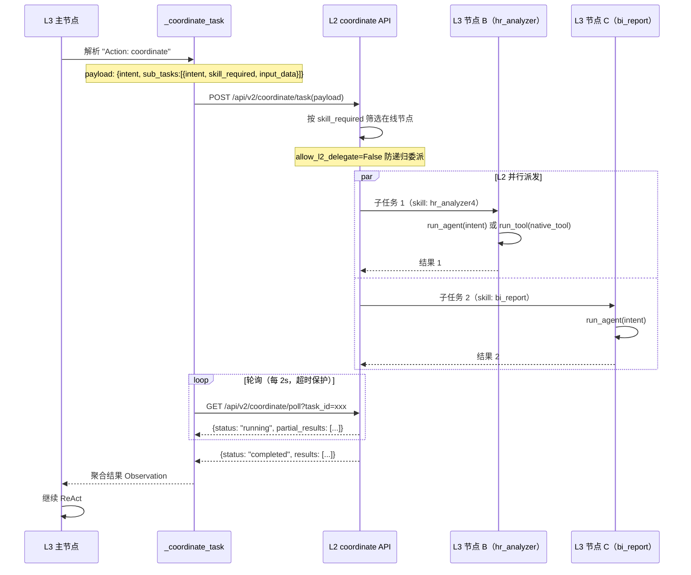

### 6.2 coordinate 与 delegate 对比

| 维度 | delegate | coordinate |
|------|---------|-----------|
| 执行位置 | 同一 L3 进程内 | 不同 L3 节点 |
| 通信方式 | 函数调用（asyncio） | HTTP REST API |
| 等待方式 | asyncio.gather | 轮询 /poll |
| 节点选择 | 按 role → 工具白名单 | 按 skill_required → 节点匹配 |
| 适用规模 | 单节点多角色 | 多节点分布式 |
| 后台通道 | ✗ 禁止 | ✗ 禁止 |

---

## 七、后台异步 Agent Task

### 7.1 完整生命周期

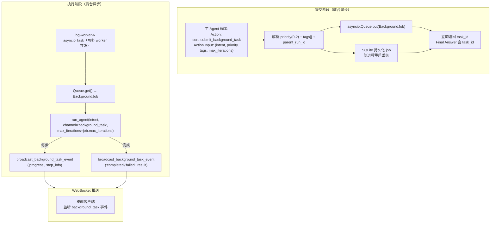

### 7.2 BackgroundJob 数据结构

| 字段 | 类型 | 说明 |
|------|------|------|
| `task_id` | str | UUID，唯一标识 |
| `intent` | str | 要执行的任务意图文本 |
| `max_iterations` | int | ReAct 最大轮次（默认 24） |
| `priority` | int | 0=普通，1=较高，2=紧急 |
| `tags` | list[str] | 如 `["hr", "recruitment"]`，用于监控筛选 |
| `parent_run_id` | str | 父 run_agent 的 run_id，可观测性归因 |
| `status` | str | pending/running/completed/failed |
| `created_at` | float | Unix 时间戳 |
| `result` | str | 完成后的输出 |

---

## 八、StructuredResultMerger（结果合并）

### 8.1 并行结果合并格式

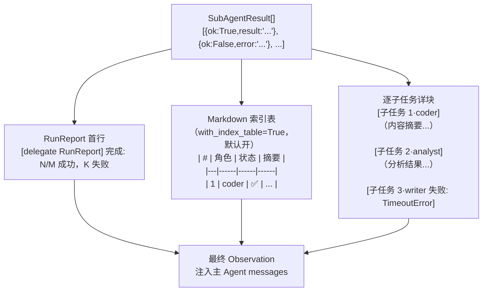

### 8.2 讨论模式合并格式

```
[Discussion] 3 轮 · planner + critic

Round 1:
  [planner] 提出初始方案...
  [critic] 质疑点: 1. 性能 2. 安全

Round 2:
  [planner] 修订方案（针对质疑）...
  [critic] 质疑点: 1. 边界情况

Round 3:
  [planner] 最终方案...
  [critic] 无新质疑 ← 终止条件

[summarizer] 最终共识: ...
```

---

## 九、并发控制与限速

### 9.1 Semaphore 并发控制

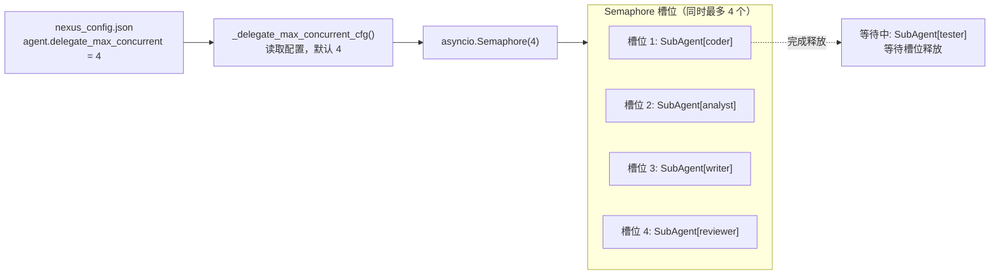

### 9.2 关键配置参数

| 参数 | 位置 | 默认 | 说明 |
|------|------|------|------|
| `agent.max_delegate_depth` | `nexus_config.json` | `2` | 最大嵌套深度，防无限递归 |
| `agent.delegate_max_concurrent` | `nexus_config.json` | `4` | 单次 delegate 最大并发 SubAgent 数 |
| `agent.sub_agent_max_total_tokens` | `nexus_config.json` | `120000` | 子 Agent 单次 Token 上限 |
| `multi_agent.max_discussion_rounds` | `nexus_config.json` | `3` | 讨论最大轮次（1..12） |
| `multi_agent.discussion_item_max_iterations` | `nexus_config.json` | `3` | 讨论每轮 SubAgent 最大迭代（1..24） |
| `JACHIN_DISCUSS_MAX_ROUNDS` | 环境变量 | — | 覆盖 max_discussion_rounds |
| `JACHIN_DISCUSS_ITEM_MAX_ITER` | 环境变量 | — | 覆盖 discussion_item_max_iterations |
| `JACHIN_DISCUSS_ADAPTIVE_ROUNDS` | 环境变量 | `0` | 开启自适应轮次收紧 |

---

## 十、禁止事项与安全边界

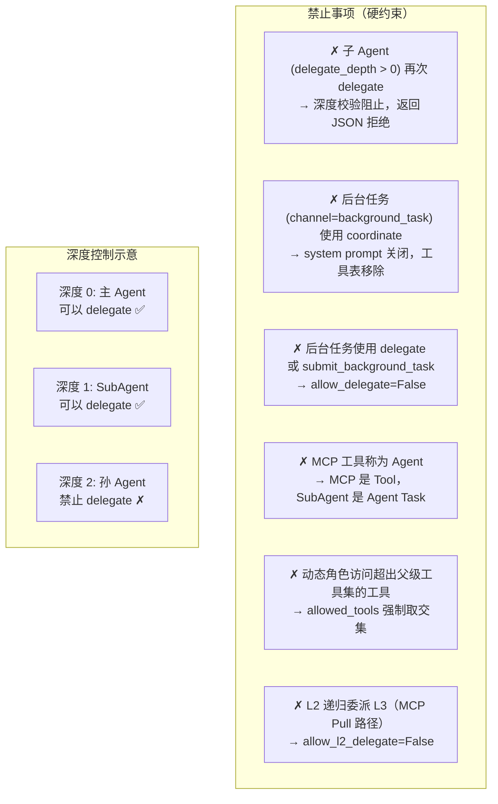

**可观测日志标签**（发生时打印，可检索）：

| 日志标签 | 含义 |
|---------|------|
| `[delegate RunReport]` | delegate 子任务完成汇总 |
| `[FanOut RunReport]` | FanOut 并行完成汇总 |
| `[Pipeline]` | Pipeline 阶段执行日志 |
| `[Discussion]` | 讨论模式轮次摘要 |
| `[SubAgent]` | 子 Agent 执行详情 |
| `[L3 Agent] delegate RunReport` | delegate 深度+状态 JSON |

---

**上一篇**: [02_MAIN_AGENT_DESIGN.md](./02_MAIN_AGENT_DESIGN.md)  
**下一篇**: [04_MEMORY_ARCHITECTURE.md](./04_MEMORY_ARCHITECTURE.md) — 记忆架构详解
