# Jachin 记忆架构详解：三层记忆体系

> **分册**: 04 / 07 · [返回索引](./README.md)  
> **代码锚点**: `l3_client/local_mcps/jachin_memory_nexus/memory_backend.py`、`l3_node/memory_nexus_bridge.py`、`l3_node/experience_memory.py`、`l3_node/task_planning.py`  
> **专题 SSOT**: [`MEMORY_NEXUS_L3.md`](../architecture/MEMORY_NEXUS_L3.md)、[`JACHIN_MEMORY_ARCHITECTURE.md`](../architecture/JACHIN_MEMORY_ARCHITECTURE.md)

---

## 目录

1. [记忆体系总览](#一记忆体系总览)
2. [短期记忆（In-Context）](#二短期记忆in-context)
3. [中期记忆（Session-Level）](#三中期记忆session-level)
4. [长期记忆：Memory Nexus](#四长期记忆memory-nexus)
5. [长期记忆：Experience Memory](#五长期记忆experience-memory)
6. [长期记忆：PersistedIntent](#六长期记忆persistedintent)
7. [记忆检索算法详解](#七记忆检索算法详解)
8. [记忆注入 Prompt 全流程](#八记忆注入-prompt-全流程)
9. [记忆写入全路径](#九记忆写入全路径)
10. [遗留与停用项](#十遗留与停用项)

---

## 一、记忆体系总览

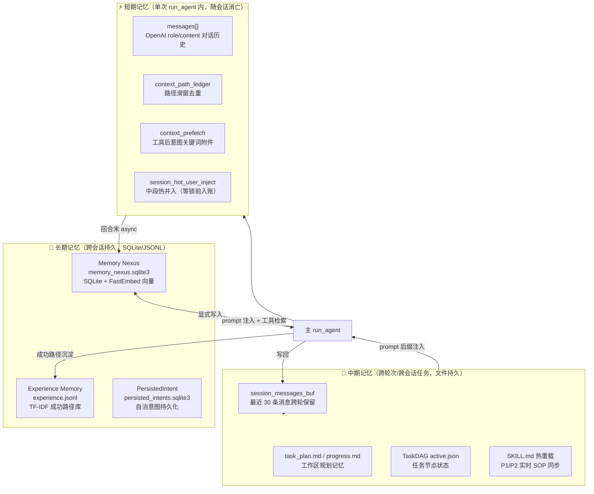

---

## 二、短期记忆（In-Context）

### 2.1 短期记忆组成

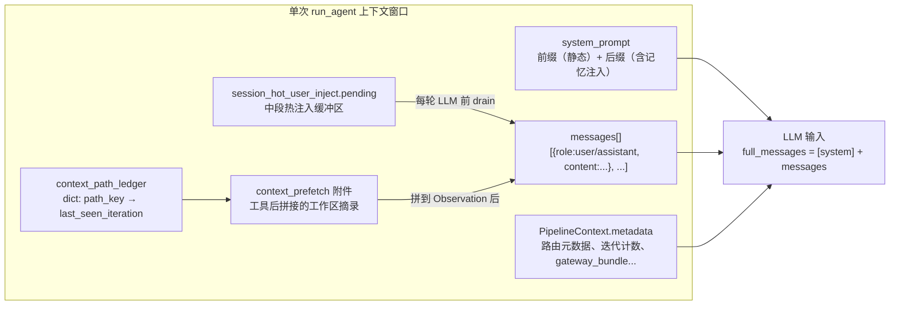

### 2.2 context_path_ledger 去重机制

**问题**：Agent 在多轮迭代中可能反复读取同一文件，造成上下文膨胀。

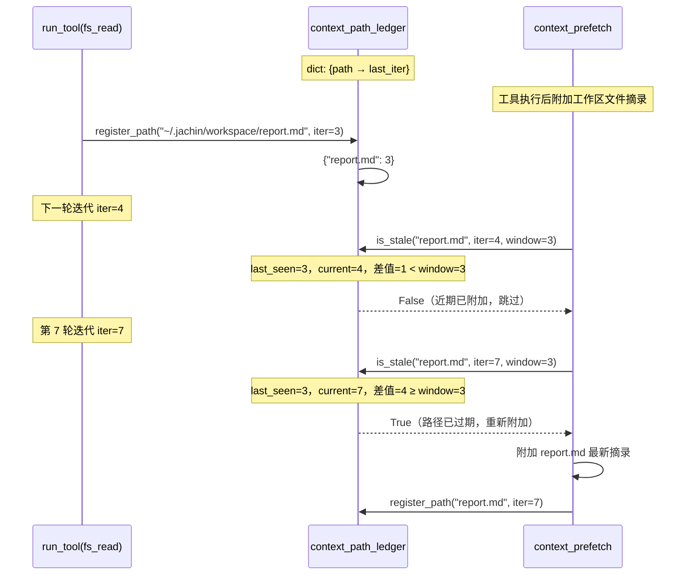

### 2.3 session_hot_user_inject 热并入

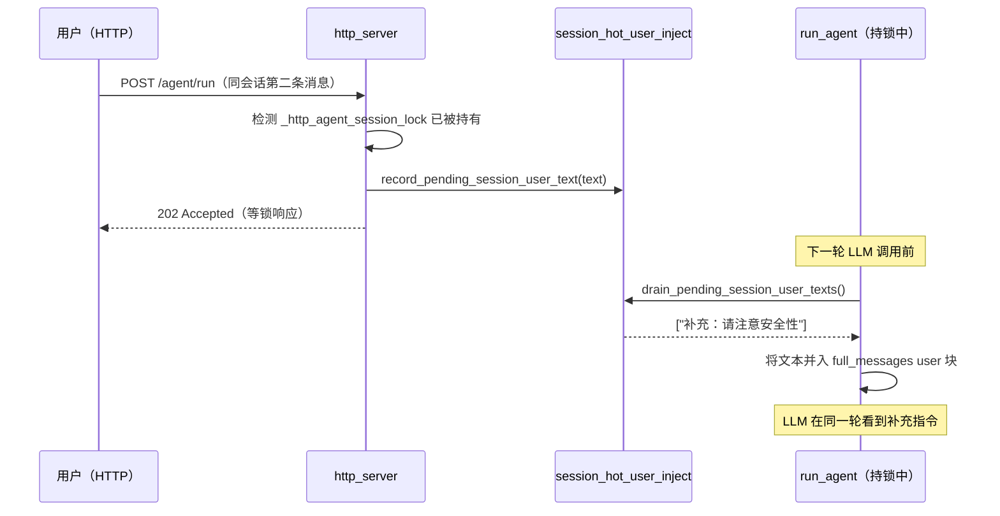

---

## 三、中期记忆（Session-Level）

### 3.1 session_messages_buf 跨轮保留

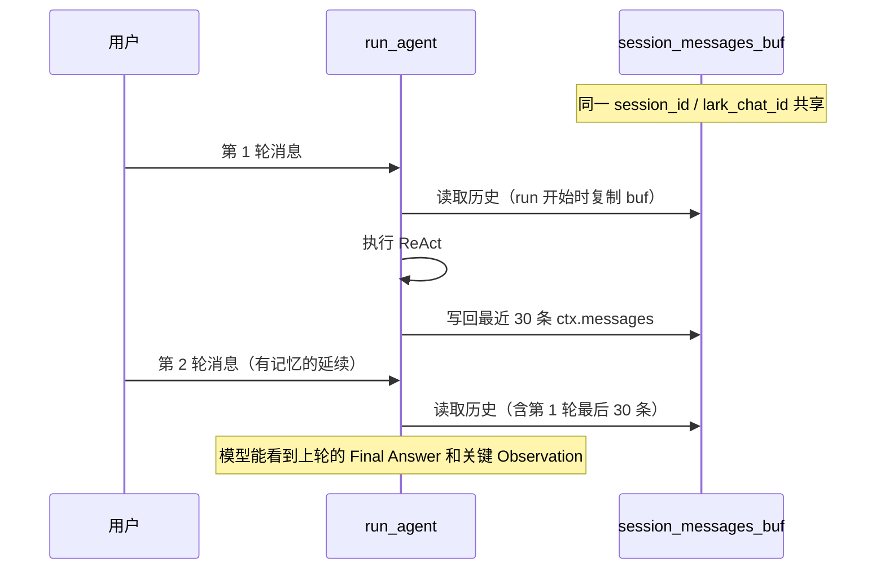

**30 条限制的意义**：防止长会话 token 膨胀，同时保留关键上文（如「同意」确认、上轮结论）。

### 3.2 工作区文件记忆

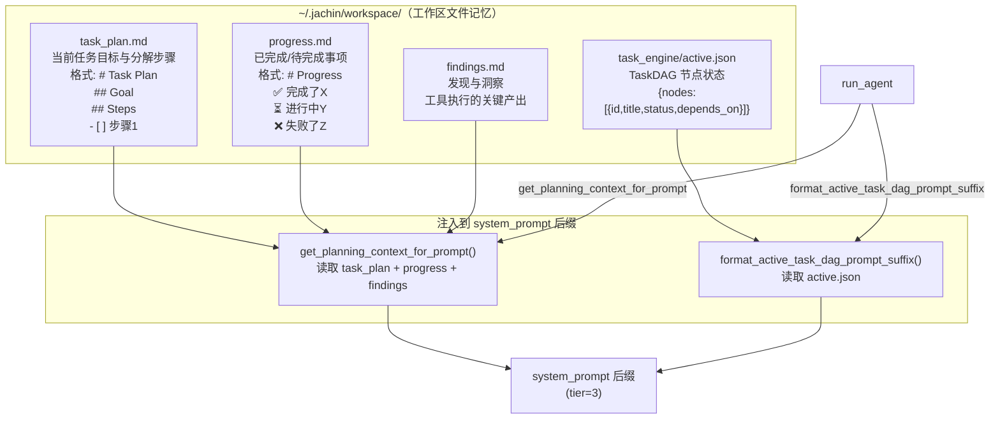

### 3.3 SKILL.md 热重载（实时 SOP 记忆）

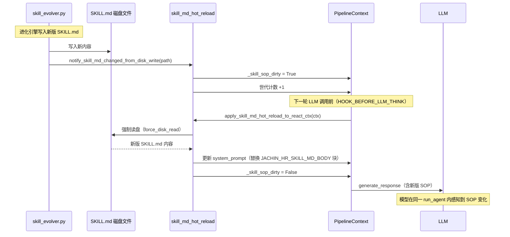

---

## 四、长期记忆：Memory Nexus

### 4.1 物理存储架构

```
~/.jachin/palace_db/
└─ memory_nexus.sqlite3
   └─ 表: drawers
      ├─ drawer_id        TEXT    (UUID, 主键)
      ├─ wing             TEXT    (翼区: Episodes/Knowledge/Procedures/Core/Inbox)
      ├─ room             TEXT    (房间名: General_Chat/Core_Profile/Kalaroko_Default/...)
      ├─ document         TEXT    (原文内容，verbatim)
      ├─ embedding        BLOB    (float32 向量，FastEmbed 生成)
      ├─ dim              INTEGER (向量维度)
      ├─ timestamp        REAL    (Unix 时间戳，用于时间衰减)
      └─ extra_meta_json  TEXT    (JSON 附加元数据)
```

**设计选择**：单一 SQLite 文件，无外部向量库依赖，便于单机部署和打包分发。

### 4.2 Wing 命名空间体系

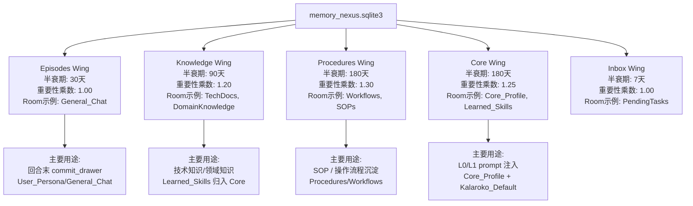

**Wing 归一化**：`normalize_wing()` 将别名统一：
- `user_persona` → `Core`
- `e2e_monitors` → `Core`（监控类）
- `learned_skills` → `Core`

### 4.3 Memory Nexus 核心操作

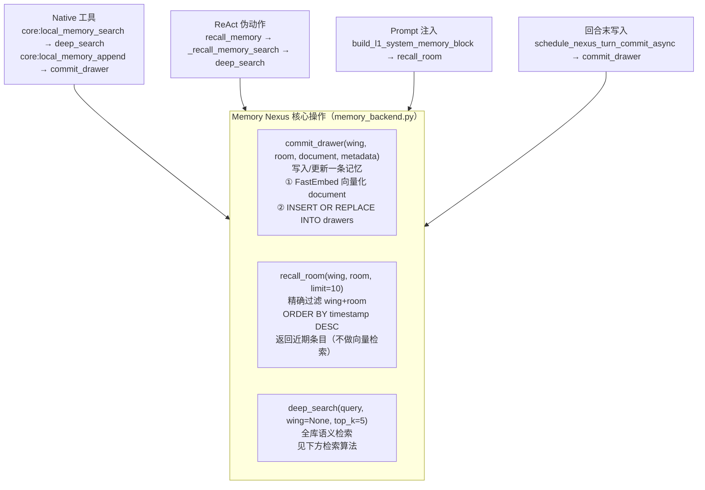

### 4.4 Deep Search 检索算法全流程

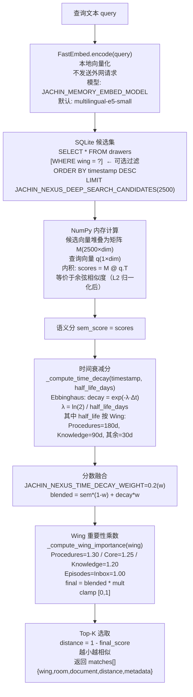

**不使用 HNSW**：候选集 2500 条时 NumPy 矩阵乘法在毫秒级完成，无需近似最近邻索引，减少依赖复杂度。

### 4.5 向量写入流程

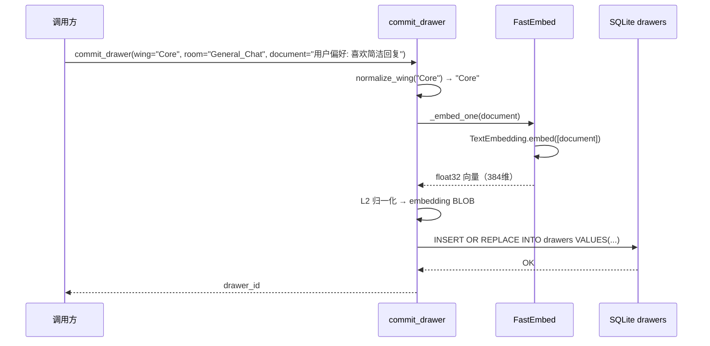

---

## 五、长期记忆：Experience Memory

Experience Memory 专门存储**成功的工具调用路径**，用于 few-shot 经验注入。

### 5.1 写入流程（成功路径沉淀）

```mermaid
flowchart LR
    subgraph WRITE_EXP["经验写入触发条件"]
        COND1["read_query / write_query 工具成功\n且 Observation 启发式判断为成功"]
        COND2["Critic 通过（或 fail-open）"]
        COND3["_l4_exp_save_gate 门控通过\n防止重复写入同一动作"]
    end

    subgraph WRITE_PATH["写入路径"]
        SAVE_ACT["experience_memory.save_successful_action\n(intent, action_type, params, observation)"]
        SAVE_MA["experience_memory.save_multi_agent_episode\n(JACHIN_EXPERIENCE_RECORD_MULTI_AGENT=1)\nmulti_agent:discuss / multi_agent:parallel_delegate"]
        FAIL_EP["save_run_failure_episode\n(JACHIN_EXPERIENCE_AUTO_RECORD_FAIL=1)\nrun_agent:brief 类型"]
    end

    subgraph STORAGE["存储"]
        JSONL3["~/.jachin/l4_experience/experience.jsonl\nNDJSON 格式\n每行: {intent, action_type, params, observation, ts, episode_type}"]
    end

    WRITE_EXP --> WRITE_PATH --> JSONL3
```

### 5.2 检索流程（每次 run_agent 开始）

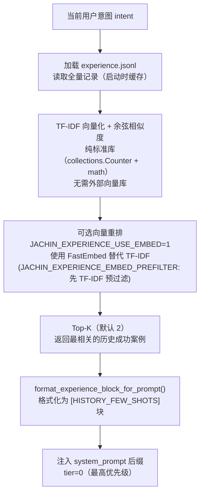

**HISTORY_FEW_SHOTS 块格式示例**：

```
[HISTORY_FEW_SHOTS]
以下是类似任务的历史成功经验，可作为参考：

经验 1（相似度: 0.87）:
  意图: 分析 Q1 销售数据，找出异常门店
  成功动作: core:shell_exec → python analyze.py --quarter Q1
  结果摘要: 发现 3 家门店销量异常，已输出报告

经验 2（相似度: 0.72）:
  意图: 读取 CSV 数据并生成图表
  成功动作: jpp:bi_report → {data_path: "data.csv", chart_type: "bar"}
  结果摘要: 已生成 Q1 对比图表，保存为 report.png
```

---

## 六、长期记忆：PersistedIntent

自治意图持久化详见 [07_OBSERVABILITY_AUTONOMY.md](./07_OBSERVABILITY_AUTONOMY.md)，简要说明：

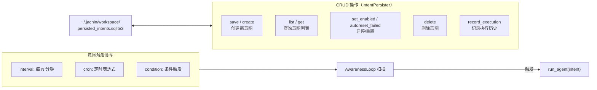

---

## 七、记忆检索算法详解

### 7.1 时间衰减（Ebbinghaus 遗忘曲线）

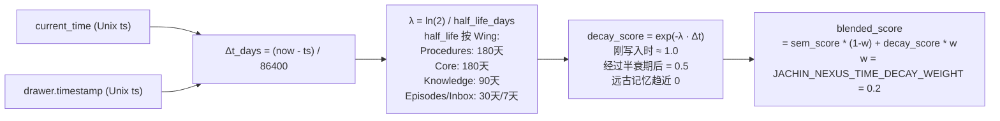

### 7.2 Wing 重要性乘数

| Wing | 乘数 | 含义 |
|------|------|------|
| Procedures | 1.30 | SOP 流程最重要，优先召回 |
| Core | 1.25 | 用户核心记忆，次重要 |
| Knowledge | 1.20 | 知识类记忆 |
| Episodes | 1.00 | 对话历史（基准） |
| Inbox | 1.00 | 临时记忆（基准） |

可通过 `JACHIN_WING_IMPORTANCE_OVERRIDE` 运行时 JSON 覆盖单 Wing 系数。

### 7.3 完整打分公式

```
final_score = clamp(blend(sem, decay, w) × wing_mult, 0, 1)

其中:
  sem       = cosine_similarity(query_vec, drawer_vec)
  decay     = exp(-ln(2)/half_life × Δt_days)
  blend     = sem*(1-w) + decay*w    // w=0.2 默认
  wing_mult = Wing 重要性乘数（1.00~1.30）
  distance  = 1 - final_score        // 对外返回，越小越相似
```

---

## 八、记忆注入 Prompt 全流程

### 8.1 注入时序

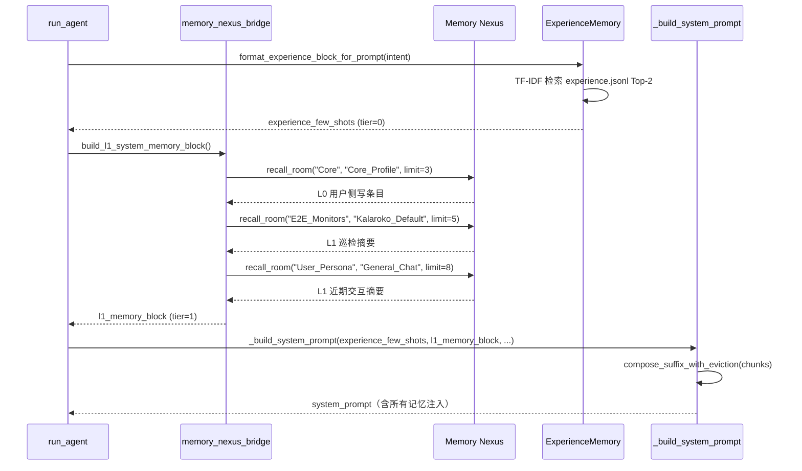

### 8.2 三层注入层级对比

| 层级 | 数据源 | 写入时机 | 检索方式 | Prompt 位置 |
|------|--------|---------|---------|------------|
| **L0** | User_Persona/Core_Profile | 用户画像更新时 | recall_room（精确） | 后缀 tier=1 最前 |
| **L1** | General_Chat/Kalaroko_Default | 每轮回合末 | recall_room（精确） | 后缀 tier=1 |
| **按需** | 全库 | 模型主动调用 | deep_search（语义） | Observation（工具返回） |
| **经验** | experience.jsonl | 成功路径沉淀 | TF-IDF 相似度 | 后缀 tier=0 |

---

## 九、记忆写入全路径

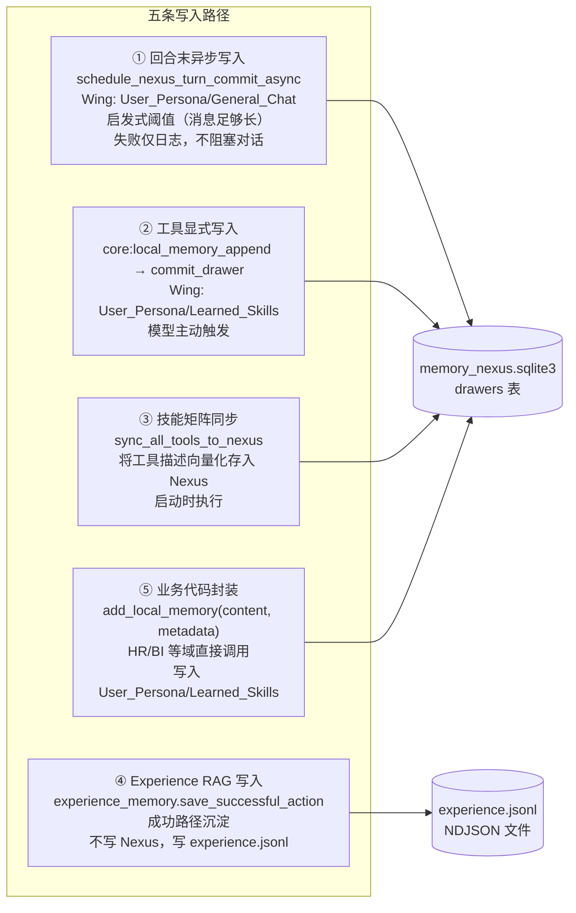

### 9.1 回合末写入详细判断

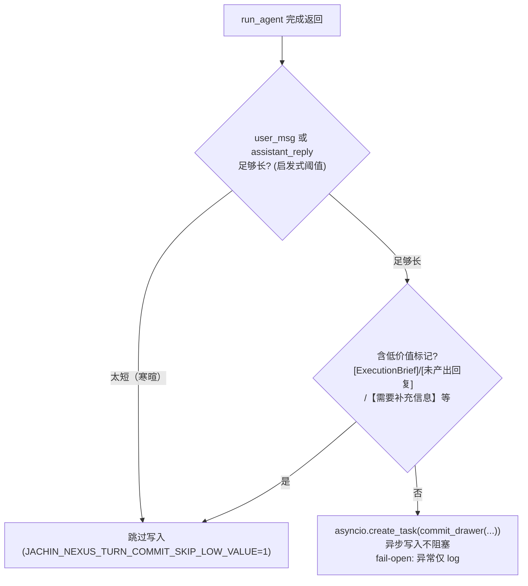

---

## 十、遗留与停用项

| 项目 | 状态 | 替代方案 |
|------|------|---------|
| `~/.jachin/memory/l3_local.json` | **只读/诊断** | Memory Nexus（SQLite） |
| `l3_local_shard_<id>.json` | **只读** | Memory Nexus 共享 SSOT |
| `memory_compactor.compact_local_memory_if_needed` | **全局 no-op** | 上下文 Compaction（非 JSON 梦境合并） |
| `l3_memory.json` + MemorySyncDaemon | **已删除** | Memory Nexus 本地闭环，无需 L2 同步 |
| `merge_from_l2()` | **空操作** | 历史兼容占位 |
| `bump_urgent_l3_local_sync()` | **兼容占位** | 不再驱动任何 L2 同步 |
| Chroma HTTP 客户端降级路径 | **已移除** | 单 SQLite 文件（`CHROMA_USE_HTTP_CLIENT` 配置保留无害） |

**重要**：`get_local_memory_for_prompt()` 已委托 Memory Nexus L1 块（`build_l1_system_memory_block`），旧 JSON 被动衰减参数不再生效。

---

**上一篇**: [03_MULTI_AGENT.md](./03_MULTI_AGENT.md)  
**下一篇**: [05_AGI_CORE_CAPABILITIES.md](./05_AGI_CORE_CAPABILITIES.md) — AGI 核心能力模块
