# Jachin AGI 核心能力模块详解

> **分册**: 05 / 07 · [返回索引](./README.md)  
> **代码锚点**: `l3_node/awareness_loop.py`、`l3_node/skill_evolver.py`、`l3_node/critic_agent.py`、`l3_node/intelligence_b.py`、`l3_node/dag_planner.py`  
> **专题 SSOT**: [`AGI_OPTIMIZATION_ROADMAP.md`](../AGI_OPTIMIZATION_ROADMAP.md)

---

## 目录

1. [AGI 能力全景图](#一agi-能力全景图)
2. [意图网关与语义层（Intent Gateway）](#二意图网关与语义层intent-gateway)
3. [内联 Critic（Inline Critic）](#三内联-criticinline-critic)
4. [intelligence_b 执行门控](#四intelligence_b-执行门控)
5. [无人值守自治系统（AwarenessLoop）](#五无人值守自治系统awarenessloop)
6. [Skill 自动进化飞轮（SkillEvolver）](#六skill-自动进化飞轮skillevolver)
7. [TaskDAG 任务编排引擎](#七taskdag-任务编排引擎)
8. [全局任务注册表（GlobalTaskRegistry）](#八全局任务注册表globaltaskregistry)
9. [Guardrails 多层护栏](#九guardrails-多层护栏)
10. [AGI 闭环飞轮](#十agi-闭环飞轮)

---

## 一、AGI 能力全景图

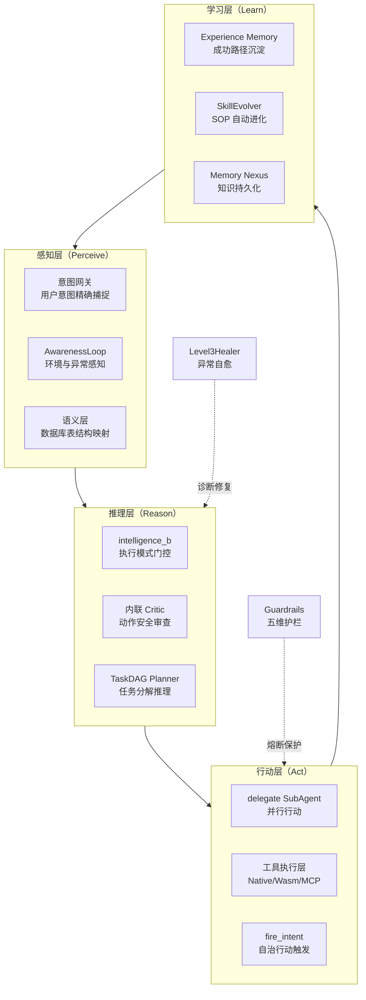
```mermaid
flowchart TB
    subgraph SENSE["感知层（Perceive）"]
        GW_S["意图网关\n用户意图精确捕捉"]
        AWL_S["AwarenessLoop\n环境与异常感知"]
        SEG_S["语义层\n数据库表结构映射"]
    end

    subgraph REASON["推理层（Reason）"]
        IB_R["intelligence_b\n执行模式门控"]
        CRITIC_R["内联 Critic\n动作安全审查"]
        DAG_R["TaskDAG Planner\n任务分解推理"]
    end

    subgraph ACT["行动层（Act）"]
        DELEGATE_A["delegate SubAgent\n并行行动"]
        TOOLS_A["工具执行层\nNative/Wasm/MCP"]
        INTENT_A["fire_intent\n自治行动触发"]
    end

    subgraph LEARN["学习层（Learn）"]
        EXP_L["Experience Memory\n成功路径沉淀"]
        EVOL_L["SkillEvolver\nSOP 自动进化"]
        NEXUS_L["Memory Nexus\n知识持久化"]
    end

    SENSE --> REASON --> ACT --> LEARN --> SENSE

    HEAL["Level3Healer\n异常自愈"]
    GUARD["Guardrails\n五维护栏"]

    HEAL -.->|"诊断修复"| REASON
    GUARD -.->|"熔断保护"| ACT
```

---

## 二、意图网关与语义层（Intent Gateway）

### 2.1 澄清门控（ClarificationRule）

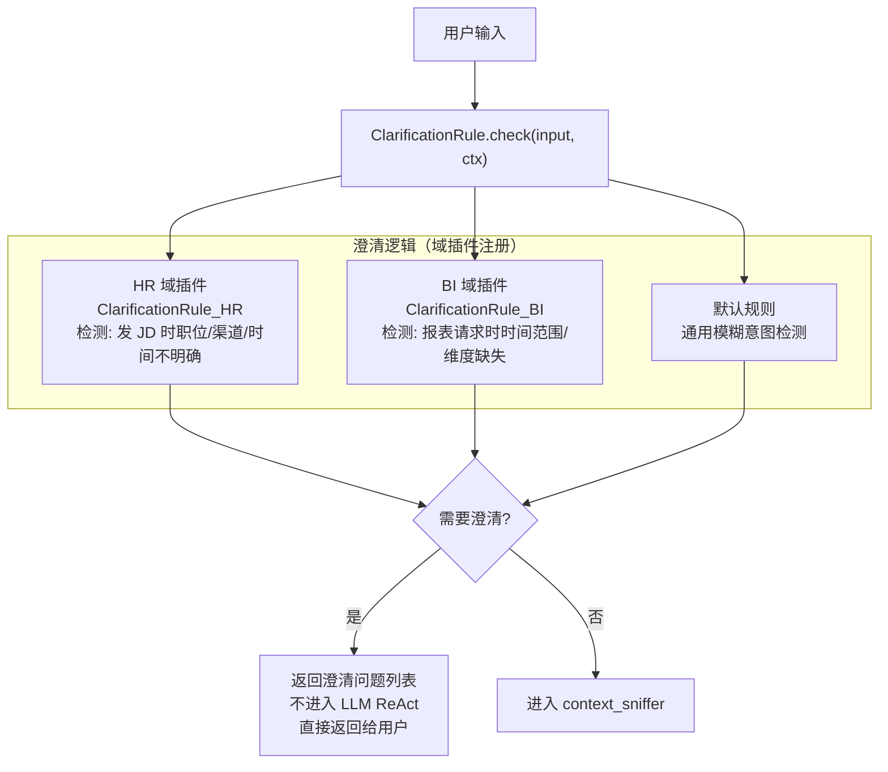
```mermaid
flowchart TB
    INPUT4["用户输入"]

    INPUT4 --> CLR_CHK["ClarificationRule.check(input, ctx)"]

    subgraph CLR_LOGIC["澄清逻辑（域插件注册）"]
        CLR_HR["HR 域插件\nClarificationRule_HR\n检测: 发 JD 时职位/渠道/时间不明确"]
        CLR_BI["BI 域插件\nClarificationRule_BI\n检测: 报表请求时时间范围/维度缺失"]
        CLR_DEFAULT["默认规则\n通用模糊意图检测"]
    end

    CLR_CHK --> CLR_HR & CLR_BI & CLR_DEFAULT

    CLR_HR & CLR_BI & CLR_DEFAULT --> CLR_RESULT{"需要澄清?"}

    CLR_RESULT -->|"是"| CLR_RETURN["返回澄清问题列表\n不进入 LLM ReAct\n直接返回给用户"]
    CLR_RESULT -->|"否"| CONTINUE["进入 context_sniffer"]
```

### 2.2 语义层（Semantic Layer）

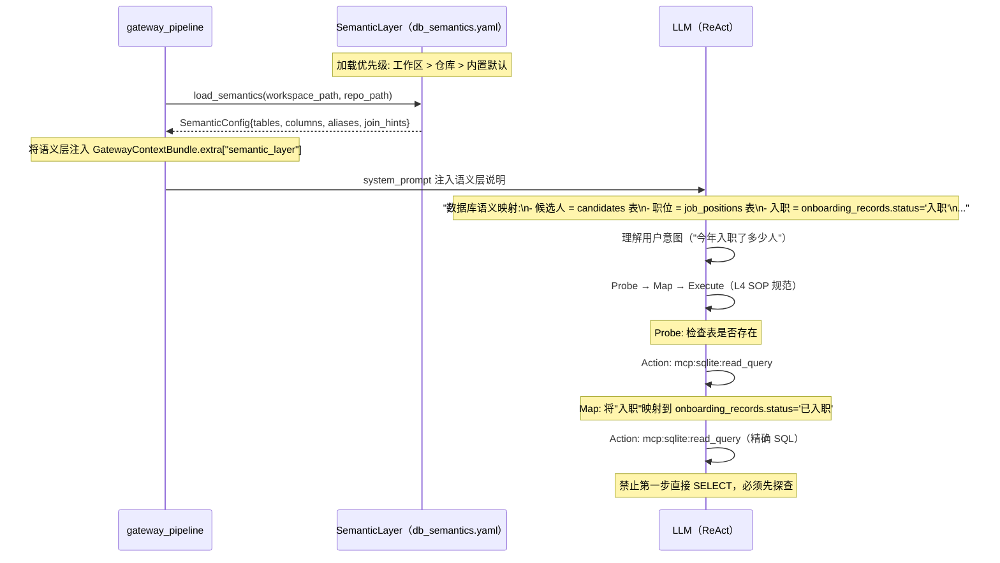
```mermaid
sequenceDiagram
    participant GW9 as gateway_pipeline
    participant SEM9 as SemanticLayer（db_semantics.yaml）
    participant LLM9 as LLM（ReAct）

    Note over SEM9: 加载优先级: 工作区 > 仓库 > 内置默认

    GW9->>SEM9: load_semantics(workspace_path, repo_path)
    SEM9-->>GW9: SemanticConfig{tables, columns, aliases, join_hints}

    Note over GW9: 将语义层注入 GatewayContextBundle.extra["semantic_layer"]

    GW9->>LLM9: system_prompt 注入语义层说明
    Note over LLM9: "数据库语义映射:\n- 候选人 = candidates 表\n- 职位 = job_positions 表\n- 入职 = onboarding_records.status='入职'\n..."

    LLM9->>LLM9: 理解用户意图（"今年入职了多少人"）
    LLM9->>LLM9: Probe → Map → Execute（L4 SOP 规范）

    Note over LLM9: Probe: 检查表是否存在
    LLM9->>LLM9: Action: mcp:sqlite:read_query
    Note over LLM9: Map: 将"入职"映射到 onboarding_records.status='已入职'
    LLM9->>LLM9: Action: mcp:sqlite:read_query（精确 SQL）
    Note over LLM9: 禁止第一步直接 SELECT，必须先探查
```

**L4 SOP 三步规范**：

| 阶段 | 操作 | 禁止 |
|------|------|------|
| **Probe（探查）** | `PRAGMA table_info(candidates)` | 直接 `SELECT *` |
| **Map（映射）** | 语义层对齐，确定精确字段 | 猜测字段名 |
| **Execute（执行）** | 带条件 WHERE 的精确查询 | `DELETE/DROP` 等破坏性 |

---

## 三、内联 Critic（Inline Critic）

### 3.1 Critic 触发路径

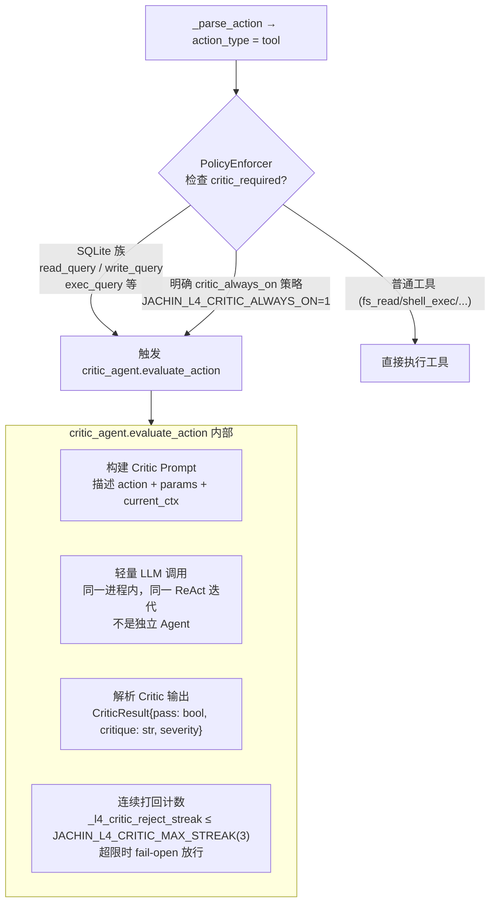
```mermaid
flowchart TB
    PARSE9["_parse_action → action_type = tool"]
    PARSE9 --> POLICY{"PolicyEnforcer\n检查 critic_required?"}

    POLICY -->|"SQLite 族\nread_query / write_query\nexec_query 等"| CRITIC_TRIGGER["触发 critic_agent.evaluate_action"]
    POLICY -->|"明确 critic_always_on 策略\nJACHIN_L4_CRITIC_ALWAYS_ON=1"| CRITIC_TRIGGER
    POLICY -->|"普通工具 (fs_read/shell_exec/...)"| DIRECT_EXEC["直接执行工具"]

    subgraph CRITIC_INTERNAL["critic_agent.evaluate_action 内部"]
        PROMPT_C["构建 Critic Prompt\n描述 action + params + current_ctx"]
        LLM_C["轻量 LLM 调用\n同一进程内，同一 ReAct 迭代\n不是独立 Agent"]
        PARSE_C["解析 Critic 输出\nCriticResult{pass: bool, critique: str, severity}"]
        RATE_LIM["连续打回计数\n_l4_critic_reject_streak ≤ JACHIN_L4_CRITIC_MAX_STREAK(3)\n超限时 fail-open 放行"]
    end

    CRITIC_TRIGGER --> CRITIC_INTERNAL
```

### 3.2 Critic 完整时序

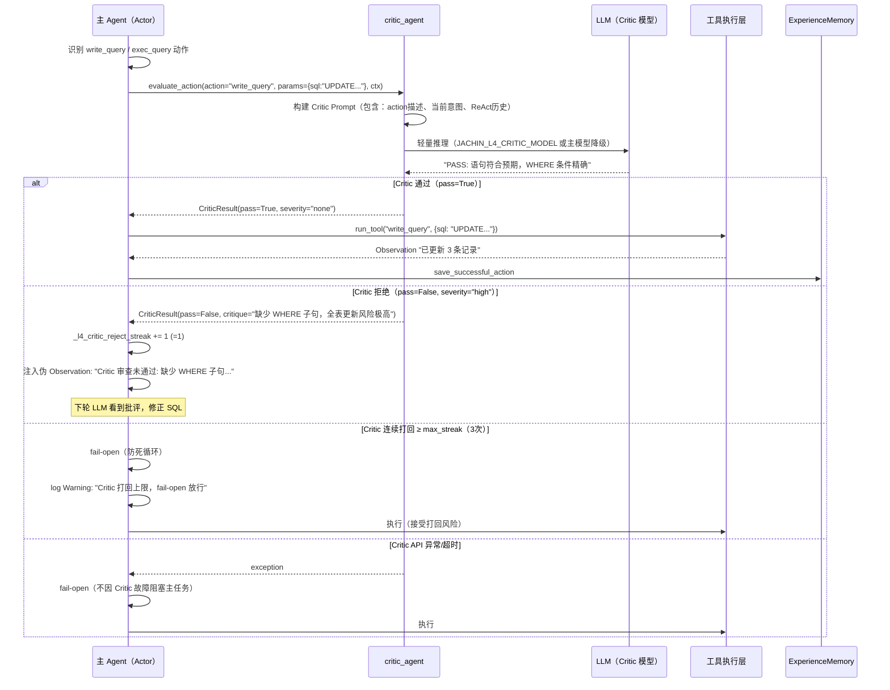
```mermaid
sequenceDiagram
    participant ACTOR9 as 主 Agent（Actor）
    participant CRITIC9 as critic_agent
    participant LLM_C2 as LLM（Critic 模型）
    participant TOOL9 as 工具执行层
    participant EXP9 as ExperienceMemory

    ACTOR9->>ACTOR9: 识别 write_query / exec_query 动作
    ACTOR9->>CRITIC9: evaluate_action(action="write_query", params={sql:"UPDATE..."}, ctx)

    CRITIC9->>CRITIC9: 构建 Critic Prompt（包含：action描述、当前意图、ReAct历史）
    CRITIC9->>LLM_C2: 轻量推理（JACHIN_L4_CRITIC_MODEL 或主模型降级）
    LLM_C2-->>CRITIC9: "PASS: 语句符合预期，WHERE 条件精确"

    alt Critic 通过（pass=True）
        CRITIC9-->>ACTOR9: CriticResult(pass=True, severity="none")
        ACTOR9->>TOOL9: run_tool("write_query", {sql: "UPDATE..."})
        TOOL9-->>ACTOR9: Observation "已更新 3 条记录"
        ACTOR9->>EXP9: save_successful_action
    else Critic 拒绝（pass=False, severity="high"）
        CRITIC9-->>ACTOR9: CriticResult(pass=False, critique="缺少 WHERE 子句，全表更新风险极高")
        ACTOR9->>ACTOR9: _l4_critic_reject_streak += 1 (=1)
        ACTOR9->>ACTOR9: 注入伪 Observation: "Critic 审查未通过: 缺少 WHERE 子句..."
        Note over ACTOR9: 下轮 LLM 看到批评，修正 SQL
    else Critic 连续打回 ≥ max_streak（3次）
        ACTOR9->>ACTOR9: fail-open（防死循环）
        ACTOR9->>ACTOR9: log Warning: "Critic 打回上限，fail-open 放行"
        ACTOR9->>TOOL9: 执行（接受打回风险）
    else Critic API 异常/超时
        CRITIC9-->>ACTOR9: exception
        ACTOR9->>ACTOR9: fail-open（不因 Critic 故障阻塞主任务）
        ACTOR9->>TOOL9: 执行
    end
```

### 3.3 Critic 设计约束

| 约束 | 说明 |
|------|------|
| 同进程轻量调用 | 不是独立进程，不是并行 Agent，在同一 ReAct 迭代内同步完成 |
| fail-open 原则 | Critic 异常/超时时放行，不因审查工具故障阻塞主任务 |
| 连续打回上限 | `max_streak=3`（可配置），防止 Critic 进入拒绝死循环 |
| 专用模型 | `JACHIN_L4_CRITIC_MODEL` 可指定更小的审查模型，节省 Token |
| 审查范围 | SQLite 族（写操作危险）+ `critic_always_on` 白名单 |

---

## 四、intelligence_b 执行门控

### 4.1 三种执行模式

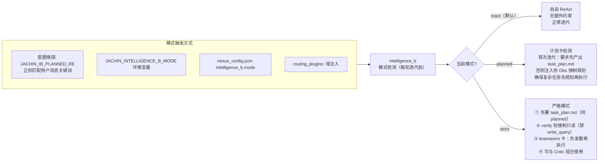
```mermaid
flowchart LR
    IB_START["intelligence_b\n模式检测（每轮迭代前）"]

    IB_START --> MODE{"当前模式?"}

    MODE -->|"react（默认）"| REACT_MODE["自由 ReAct\n无额外约束\n正常迭代"]

    MODE -->|"planned"| PLAN_MODE["计划卡检测\n首次迭代：要求先产出 task_plan.md\n否则注入伪 Obs 强制规划\n确保复杂任务先规划再执行"]

    MODE -->|"strict"| STRICT_MODE["严格模式\n① 先要 task_plan.md（同 planned）\n② verify 轮强制只读（禁 write_query）\n③ brainstorm 卡：先发散再执行\n④ 可与 Critic 组合使用"]

    subgraph TRIGGER["模式触发方式"]
        T1["意图嗅探: JACHIN_IB_PLANNED_RE\n正则匹配用户消息关键词"]
        T2["JACHIN_INTELLIGENCE_B_MODE 环境变量"]
        T3["nexus_config.json intelligence_b.mode"]
        T4["routing_plugins: 域注入"]
    end

    TRIGGER --> IB_START
```

### 4.2 计划卡检测逻辑（planned 模式）

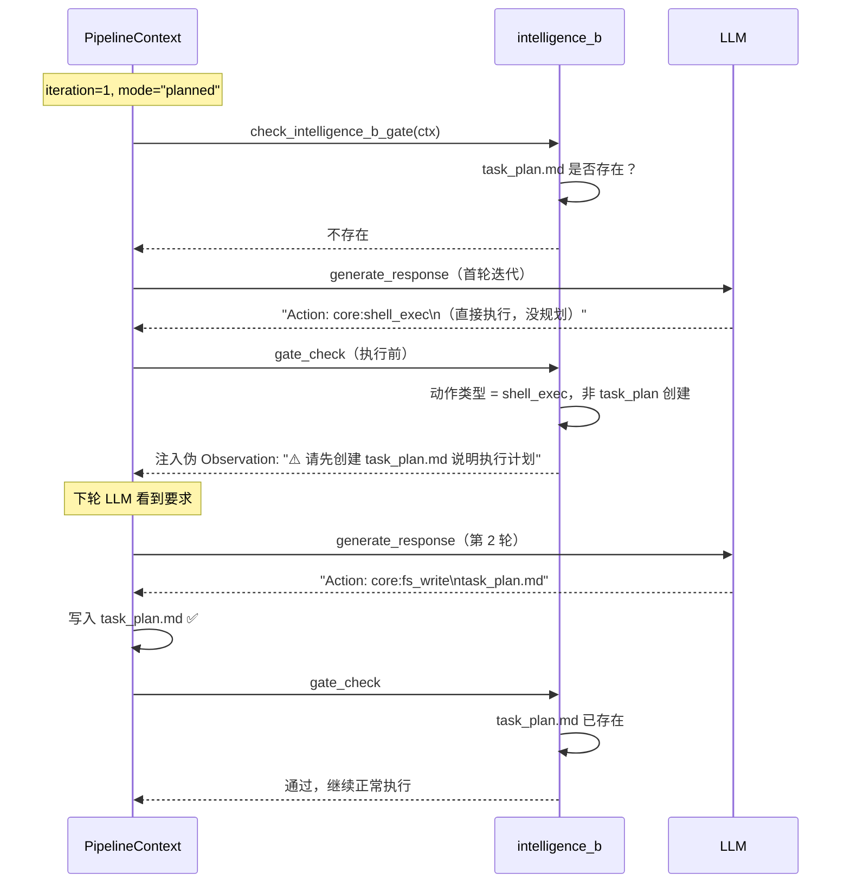
```mermaid
sequenceDiagram
    participant CTX12 as PipelineContext
    participant IB12 as intelligence_b
    participant LLM12 as LLM

    Note over CTX12: iteration=1, mode="planned"

    CTX12->>IB12: check_intelligence_b_gate(ctx)
    IB12->>IB12: task_plan.md 是否存在？
    IB12-->>CTX12: 不存在

    CTX12->>LLM12: generate_response（首轮迭代）
    LLM12-->>CTX12: "Action: core:shell_exec\n（直接执行，没规划）"

    CTX12->>IB12: gate_check（执行前）
    IB12->>IB12: 动作类型 = shell_exec，非 task_plan 创建
    IB12-->>CTX12: 注入伪 Observation: "⚠️ 请先创建 task_plan.md 说明执行计划"

    Note over CTX12: 下轮 LLM 看到要求

    CTX12->>LLM12: generate_response（第 2 轮）
    LLM12-->>CTX12: "Action: core:fs_write\ntask_plan.md"

    CTX12->>CTX12: 写入 task_plan.md ✅
    CTX12->>IB12: gate_check
    IB12->>IB12: task_plan.md 已存在
    IB12-->>CTX12: 通过，继续正常执行
```

---

## 五、无人值守自治系统（AwarenessLoop）

### 5.1 自治系统组件

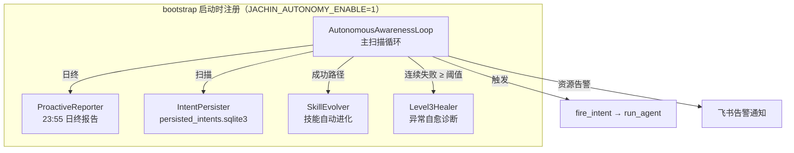
```mermaid
flowchart TB
    subgraph BOOTSTRAP["bootstrap 启动时注册（JACHIN_AUTONOMY_ENABLE=1）"]
        AWL_COMP["AutonomousAwarenessLoop\n主扫描循环"]
        PR_COMP["ProactiveReporter\n23:55 日终报告"]
        IP_COMP["IntentPersister\npersisted_intents.sqlite3"]
        SE_COMP["SkillEvolver\n技能自动进化"]
        L3H_COMP["Level3Healer\n异常自愈诊断"]
    end

    AWL_COMP -->|"扫描"| IP_COMP
    AWL_COMP -->|"触发"| FIRE9["fire_intent → run_agent"]
    AWL_COMP -->|"资源告警"| ALERT9["飞书告警通知"]
    AWL_COMP -->|"连续失败 ≥ 阈值"| L3H_COMP
    AWL_COMP -->|"成功路径"| SE_COMP
    AWL_COMP -->|"日终"| PR_COMP
```

### 5.2 意图扫描主循环

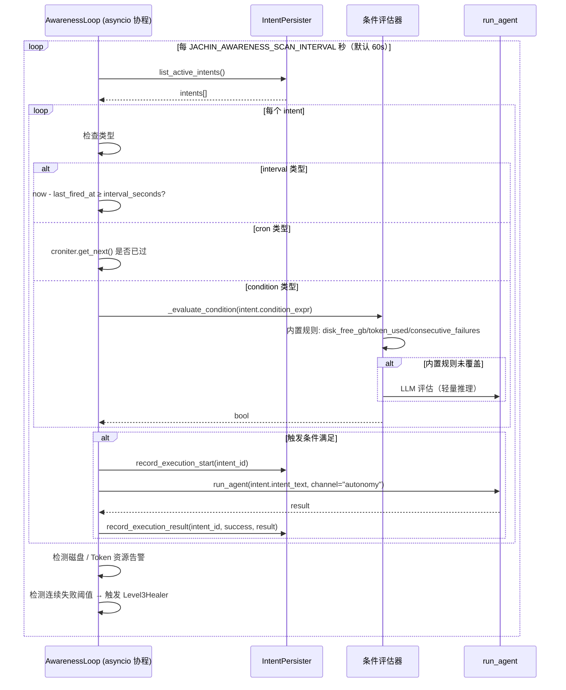
```mermaid
sequenceDiagram
    participant AWL2 as AwarenessLoop (asyncio 协程)
    participant IP2 as IntentPersister
    participant COND9 as 条件评估器
    participant RUN9 as run_agent

    loop 每 JACHIN_AWARENESS_SCAN_INTERVAL 秒（默认 60s）
        AWL2->>IP2: list_active_intents()
        IP2-->>AWL2: intents[]

        loop 每个 intent
            AWL2->>AWL2: 检查类型

            alt interval 类型
                AWL2->>AWL2: now - last_fired_at ≥ interval_seconds?
            else cron 类型
                AWL2->>AWL2: croniter.get_next() 是否已过
            else condition 类型
                AWL2->>COND9: _evaluate_condition(intent.condition_expr)
                COND9->>COND9: 内置规则: disk_free_gb/token_used/consecutive_failures
                alt 内置规则未覆盖
                    COND9->>RUN9: LLM 评估（轻量推理）
                end
                COND9-->>AWL2: bool
            end

            alt 触发条件满足
                AWL2->>IP2: record_execution_start(intent_id)
                AWL2->>RUN9: run_agent(intent.intent_text, channel="autonomy")
                RUN9-->>AWL2: result
                AWL2->>IP2: record_execution_result(intent_id, success, result)
            end
        end

        AWL2->>AWL2: 检测磁盘 / Token 资源告警
        AWL2->>AWL2: 检测连续失败阈值 → 触发 Level3Healer
    end
```

### 5.3 自治状态机

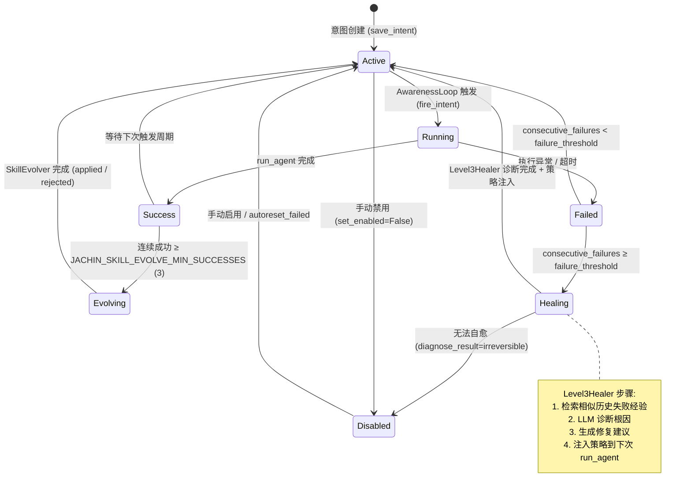
```mermaid
stateDiagram-v2
    [*] --> Active: 意图创建 (save_intent)

    Active --> Running: AwarenessLoop 触发 (fire_intent)
    Running --> Success: run_agent 完成
    Running --> Failed: 执行异常 / 超时

    Success --> Active: 等待下次触发周期
    Success --> Evolving: 连续成功 ≥ JACHIN_SKILL_EVOLVE_MIN_SUCCESSES (3)

    Failed --> Active: consecutive_failures < failure_threshold
    Failed --> Healing: consecutive_failures ≥ failure_threshold

    Healing --> Active: Level3Healer 诊断完成 + 策略注入
    Healing --> Disabled: 无法自愈 (diagnose_result=irreversible)

    Active --> Disabled: 手动禁用 (set_enabled=False)
    Disabled --> Active: 手动启用 / autoreset_failed

    Evolving --> Active: SkillEvolver 完成 (applied / rejected)

    note right of Healing
        Level3Healer 步骤:
        1. 检索相似历史失败经验
        2. LLM 诊断根因
        3. 生成修复建议
        4. 注入策略到下次 run_agent
    end note
```

### 5.4 Level3Healer 自愈诊断

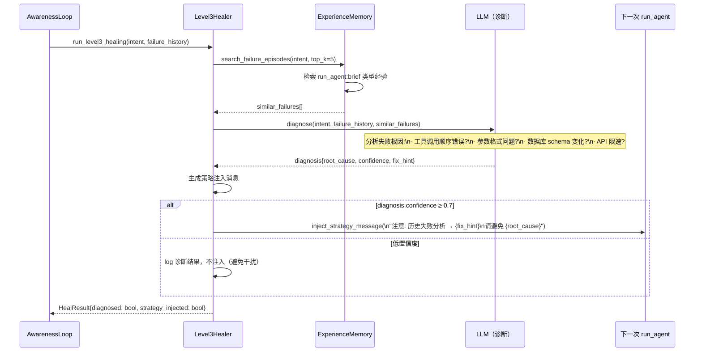
```mermaid
sequenceDiagram
    participant AWL3 as AwarenessLoop
    participant HEAL9 as Level3Healer
    participant EXP3 as ExperienceMemory
    participant LLM3 as LLM（诊断）
    participant NEXT_RUN as 下一次 run_agent

    AWL3->>HEAL9: run_level3_healing(intent, failure_history)
    HEAL9->>EXP3: search_failure_episodes(intent, top_k=5)
    EXP3->>EXP3: 检索 run_agent:brief 类型经验
    EXP3-->>HEAL9: similar_failures[]

    HEAL9->>LLM3: diagnose(intent, failure_history, similar_failures)
    Note over LLM3: 分析失败根因:\n- 工具调用顺序错误?\n- 参数格式问题?\n- 数据库 schema 变化?\n- API 限速?
    LLM3-->>HEAL9: diagnosis{root_cause, confidence, fix_hint}

    HEAL9->>HEAL9: 生成策略注入消息

    alt diagnosis.confidence ≥ 0.7
        HEAL9->>NEXT_RUN: inject_strategy_message(\n"注意: 历史失败分析 → {fix_hint}\n请避免 {root_cause}")
    else 低置信度
        HEAL9->>HEAL9: log 诊断结果，不注入（避免干扰）
    end

    HEAL9-->>AWL3: HealResult{diagnosed: bool, strategy_injected: bool}
```

---

## 六、Skill 自动进化飞轮（SkillEvolver）

### 6.1 进化全流程

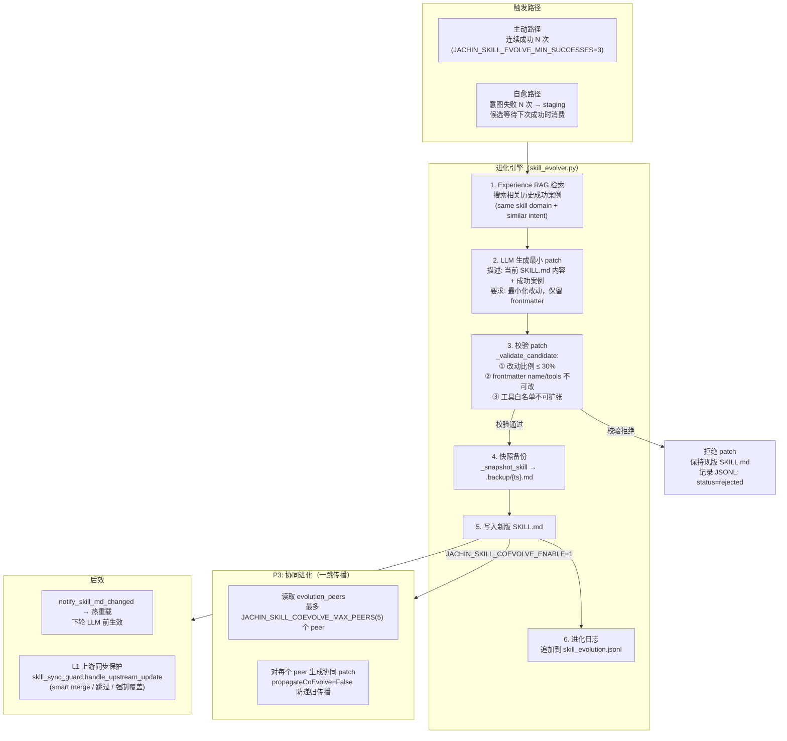
```mermaid
flowchart TB
    subgraph TRIGGER9["触发路径"]
        PROACTIVE2["主动路径\n连续成功 N 次\n(JACHIN_SKILL_EVOLVE_MIN_SUCCESSES=3)"]
        HEALING2["自愈路径\n意图失败 N 次 → staging\n候选等待下次成功时消费"]
    end

    subgraph EVOLVE9["进化引擎（skill_evolver.py）"]
        RAG9["1. Experience RAG 检索\n搜索相关历史成功案例\n(same skill domain + similar intent)"]
        LLM_PATCH["2. LLM 生成最小 patch\n描述: 当前 SKILL.md 内容 + 成功案例\n要求: 最小化改动，保留 frontmatter"]
        VALIDATE9["3. 校验 patch\n_validate_candidate:\n① 改动比例 ≤ 30%\n② frontmatter name/tools 不可改\n③ 工具白名单不可扩张"]
        SNAPSHOT9["4. 快照备份\n_snapshot_skill → .backup/{ts}.md"]
        WRITE9["5. 写入新版 SKILL.md"]
        LOG9["6. 进化日志\n追加到 skill_evolution.jsonl"]
    end

    subgraph CO_EVOLVE["P3: 协同进化（一跳传播）"]
        PEERS9["读取 evolution_peers\n最多 JACHIN_SKILL_COEVOLVE_MAX_PEERS(5) 个 peer"]
        CO_PATCH["对每个 peer 生成协同 patch\npropagateCoEvolve=False 防递归传播"]
    end

    subgraph POST["后效"]
        HOT3["notify_skill_md_changed → 热重载\n下轮 LLM 前生效"]
        UPSTREAM2["L1 上游同步保护\nskill_sync_guard.handle_upstream_update\n(smart merge / 跳过 / 强制覆盖)"]
    end

    TRIGGER9 --> RAG9 --> LLM_PATCH --> VALIDATE9

    VALIDATE9 -->|"校验通过"| SNAPSHOT9 --> WRITE9 --> LOG9
    VALIDATE9 -->|"校验拒绝"| REJECT9["拒绝 patch\n保持现版 SKILL.md\n记录 JSONL: status=rejected"]

    WRITE9 --> POST
    WRITE9 -->|"JACHIN_SKILL_COEVOLVE_ENABLE=1"| CO_EVOLVE
```

### 6.2 L1 上游同步保护

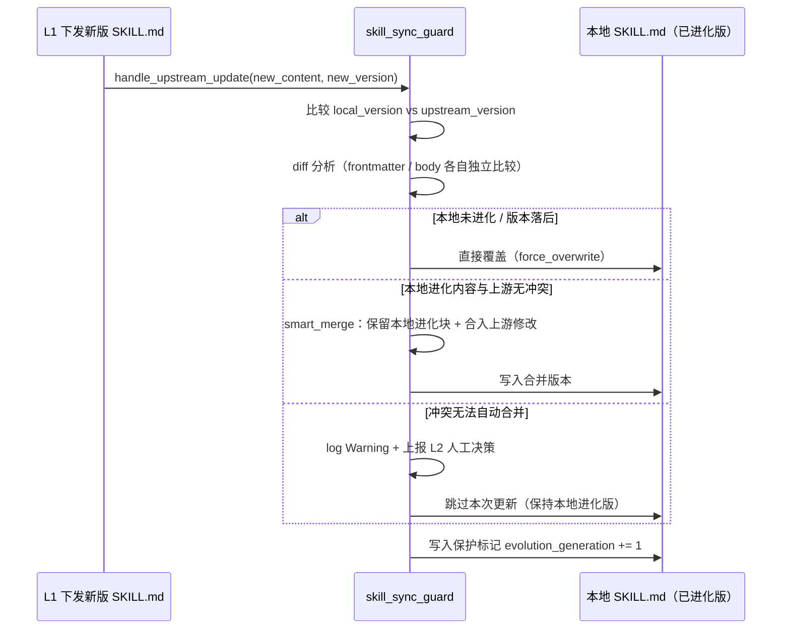
```mermaid
sequenceDiagram
    participant L1_NEW as L1 下发新版 SKILL.md
    participant GUARD9 as skill_sync_guard
    participant LOCAL9 as 本地 SKILL.md（已进化版）

    L1_NEW->>GUARD9: handle_upstream_update(new_content, new_version)

    GUARD9->>GUARD9: 比较 local_version vs upstream_version
    GUARD9->>GUARD9: diff 分析（frontmatter / body 各自独立比较）

    alt 本地未进化 / 版本落后
        GUARD9->>LOCAL9: 直接覆盖（force_overwrite）
    else 本地进化内容与上游无冲突
        GUARD9->>GUARD9: smart_merge：保留本地进化块 + 合入上游修改
        GUARD9->>LOCAL9: 写入合并版本
    else 冲突无法自动合并
        GUARD9->>GUARD9: log Warning + 上报 L2 人工决策
        GUARD9->>LOCAL9: 跳过本次更新（保持本地进化版）
    end

    GUARD9->>LOCAL9: 写入保护标记 evolution_generation += 1
```

### 6.3 进化日志格式（skill_evolution.jsonl）

```json
{
  "ts": 1748390400.0,
  "skill_id": "hr_analyzer4",
  "episode_type": "evolution:proactive",
  "trigger_reason": "3次连续成功：简历分析任务",
  "patch_summary": "优化简历评分算法：增加技能关键词权重",
  "changed_ratio": 0.08,
  "status": "applied",
  "evolution_generation": 4,
  "backup_path": ".backup/hr_analyzer4_1748390400.md"
}
```

---

## 七、TaskDAG 任务编排引擎

### 7.1 TaskDAG 完整生命周期

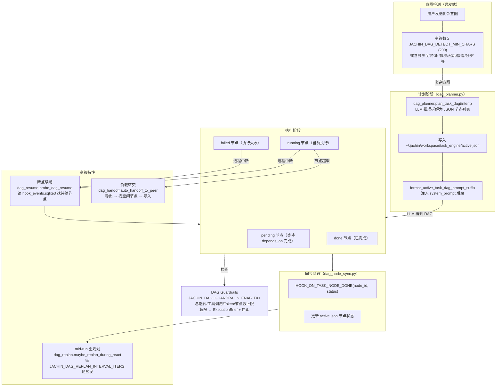
```mermaid
flowchart TB
    subgraph DETECT["意图检测（启发式）"]
        USER9["用户发送复杂意图"]
        HEUR["字符数 ≥ JACHIN_DAG_DETECT_MIN_CHARS (200)\n或含多步关键词: '依次/然后/接着/分步' 等"]
    end

    subgraph PLAN9["计划阶段（dag_planner.py）"]
        PLAN_LLM["dag_planner.plan_task_dag(intent)\nLLM 推理拆解为 JSON 节点列表"]
        PLAN_WRITE["写入 ~/.jachin/workspace/task_engine/active.json"]
        PLAN_FORMAT["format_active_task_dag_prompt_suffix\n注入 system_prompt 后缀"]
    end

    subgraph EXEC9["执行阶段"]
        NODE_P["pending 节点（等待 depends_on 完成）"]
        NODE_R["running 节点（当前执行）"]
        NODE_D["done 节点（已完成）"]
        NODE_F["failed 节点（执行失败）"]
    end

    subgraph SYNC9["同步阶段（dag_node_sync.py）"]
        HOOK_DONE["HOOK_ON_TASK_NODE_DONE(node_id, status)"]
        WRITE_DAG["更新 active.json 节点状态"]
    end

    subgraph ADVANCE["高级特性"]
        REPLAN9["mid-run 重规划\ndag_replan.maybe_replan_during_react\n每 JACHIN_DAG_REPLAN_INTERVAL_ITERS 轮触发"]
        RESUME9["断点续跑\ndag_resume.probe_dag_resume\n读 hook_events.sqlite3 找待续节点"]
        HANDOFF9["负载转交\ndag_handoff.auto_handoff_to_peer\n导出 → 找空闲节点 → 导入"]
    end

    USER9 --> HEUR
    HEUR -->|"复杂意图"| PLAN_LLM --> PLAN_WRITE --> PLAN_FORMAT
    PLAN_FORMAT -->|"LLM 看到 DAG"| EXEC9
    EXEC9 --> SYNC9 --> REPLAN9
    NODE_F & NODE_R -->|"进程中断"| RESUME9 --> EXEC9
    NODE_R -->|"节点超载"| HANDOFF9

    GUARD_DAG["DAG Guardrails\nJACHIN_DAG_GUARDRAILS_ENABLE=1\n总迭代/工具调用/Token/节点数上限\n超限 → ExecutionBrief + 停止"]
    EXEC9 -.->|"检查"| GUARD_DAG
```

### 7.2 DAG active.json 格式

```json
{
  "dag_id": "dag_20260528_abc123",
  "intent": "完整重构用户认证模块，含测试和文档",
  "created_at": 1748390400.0,
  "nodes": [
    {
      "id": "n1",
      "title": "分析现有认证代码",
      "status": "done",
      "depends_on": [],
      "result_summary": "发现 JWT 实现有 3 处安全问题"
    },
    {
      "id": "n2",
      "title": "重写认证核心逻辑",
      "status": "running",
      "depends_on": ["n1"],
      "result_summary": null
    },
    {
      "id": "n3",
      "title": "编写单元测试",
      "status": "pending",
      "depends_on": ["n2"],
      "result_summary": null
    },
    {
      "id": "n4",
      "title": "更新 API 文档",
      "status": "pending",
      "depends_on": ["n2"],
      "result_summary": null
    }
  ]
}
```

### 7.3 mid-run 重规划时序

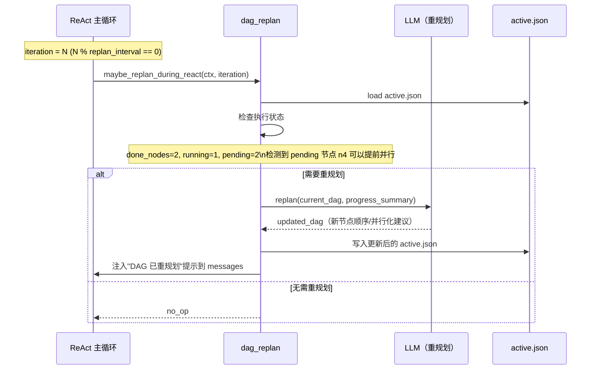
```mermaid
sequenceDiagram
    participant REACT9 as ReAct 主循环
    participant REPLAN9 as dag_replan
    participant LLM_RP as LLM（重规划）
    participant DAG9 as active.json

    Note over REACT9: iteration = N (N % replan_interval == 0)

    REACT9->>REPLAN9: maybe_replan_during_react(ctx, iteration)
    REPLAN9->>DAG9: load active.json
    REPLAN9->>REPLAN9: 检查执行状态
    Note over REPLAN9: done_nodes=2, running=1, pending=2\n检测到 pending 节点 n4 可以提前并行

    alt 需要重规划
        REPLAN9->>LLM_RP: replan(current_dag, progress_summary)
        LLM_RP-->>REPLAN9: updated_dag（新节点顺序/并行化建议）
        REPLAN9->>DAG9: 写入更新后的 active.json
        REPLAN9->>REACT9: 注入"DAG 已重规划"提示到 messages
    else 无需重规划
        REPLAN9-->>REACT9: no_op
    end
```

---

## 八、全局任务注册表（GlobalTaskRegistry）

### 8.1 架构与后端选择

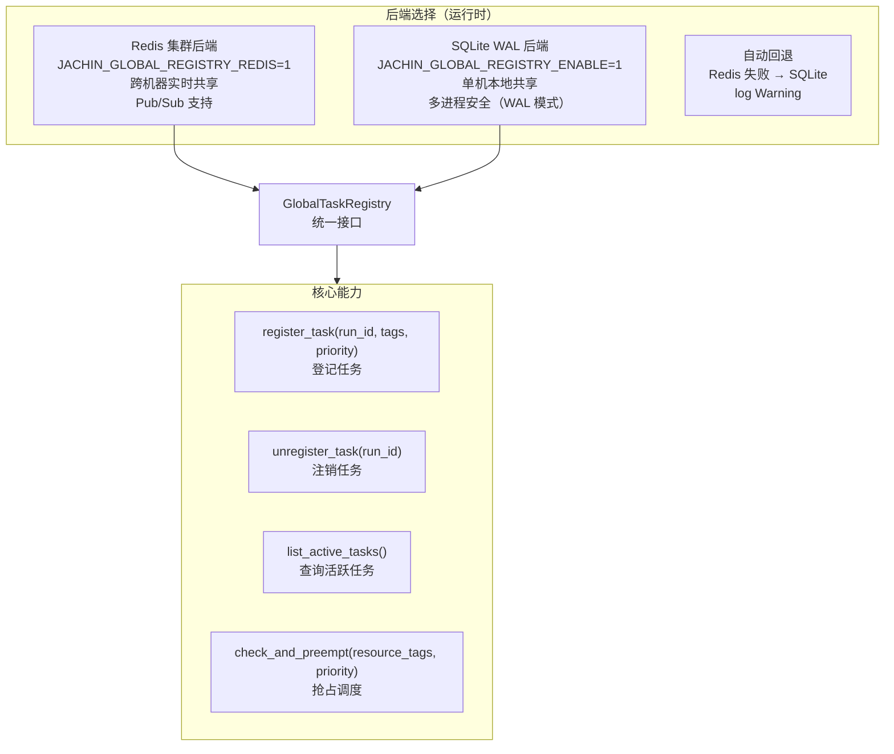
```mermaid
flowchart TB
    subgraph SSOT_CHOICE["后端选择（运行时）"]
        REDIS_B["Redis 集群后端\nJACHIN_GLOBAL_REGISTRY_REDIS=1\n跨机器实时共享\nPub/Sub 支持"]
        SQLITE_B["SQLite WAL 后端\nJACHIN_GLOBAL_REGISTRY_ENABLE=1\n单机本地共享\n多进程安全（WAL 模式）"]
        AUTO_FALLBACK["自动回退\nRedis 失败 → SQLite\nlog Warning"]
    end

    REDIS_B & SQLITE_B --> REGISTRY["GlobalTaskRegistry\n统一接口"]

    subgraph FEATURES["核心能力"]
        REG_TASK["register_task(run_id, tags, priority)\n登记任务"]
        UNREG_TASK["unregister_task(run_id)\n注销任务"]
        LIST_TASKS["list_active_tasks()\n查询活跃任务"]
        PREEMPT["check_and_preempt(resource_tags, priority)\n抢占调度"]
    end

    REGISTRY --> FEATURES
```

### 8.2 抢占调度流程

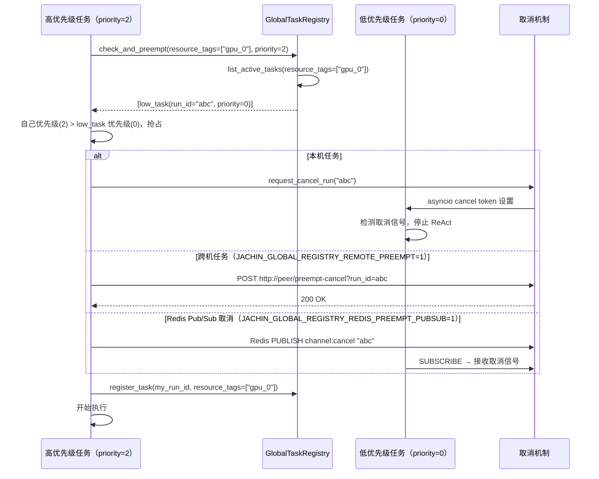
```mermaid
sequenceDiagram
    participant HIGH as 高优先级任务（priority=2）
    participant REG2 as GlobalTaskRegistry
    participant LOW as 低优先级任务（priority=0）
    participant CANCEL as 取消机制

    HIGH->>REG2: check_and_preempt(resource_tags=["gpu_0"], priority=2)
    REG2->>REG2: list_active_tasks(resource_tags=["gpu_0"])
    REG2-->>HIGH: [low_task(run_id="abc", priority=0)]

    HIGH->>HIGH: 自己优先级(2) > low_task 优先级(0)，抢占

    alt 本机任务
        HIGH->>CANCEL: request_cancel_run("abc")
        CANCEL->>LOW: asyncio cancel token 设置
        LOW->>LOW: 检测取消信号，停止 ReAct
    else 跨机任务（JACHIN_GLOBAL_REGISTRY_REMOTE_PREEMPT=1）
        HIGH->>CANCEL: POST http://peer/preempt-cancel?run_id=abc
        CANCEL-->>HIGH: 200 OK
    else Redis Pub/Sub 取消（JACHIN_GLOBAL_REGISTRY_REDIS_PREEMPT_PUBSUB=1）
        HIGH->>CANCEL: Redis PUBLISH channel:cancel "abc"
        LOW->>CANCEL: SUBSCRIBE → 接收取消信号
    end

    HIGH->>REG2: register_task(my_run_id, resource_tags=["gpu_0"])
    HIGH->>HIGH: 开始执行
```

---

## 九、Guardrails 多层护栏

### 9.1 五维护栏体系

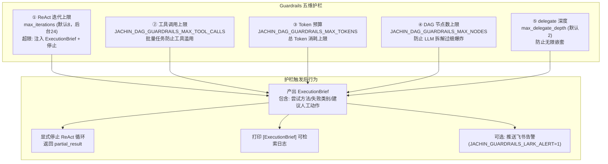
```mermaid
flowchart TB
    subgraph GUARD_ALL["Guardrails 五维护栏"]
        G1["① ReAct 迭代上限\nmax_iterations (默认8，后台24)\n超限: 注入 ExecutionBrief + 停止"]
        G2["② 工具调用上限\nJACHIN_DAG_GUARDRAILS_MAX_TOOL_CALLS\n批量任务防止工具滥用"]
        G3["③ Token 预算\nJACHIN_DAG_GUARDRAILS_MAX_TOKENS\n总 Token 消耗上限"]
        G4["④ DAG 节点数上限\nJACHIN_DAG_GUARDRAILS_MAX_NODES\n防止 LLM 拆解过细爆炸"]
        G5["⑤ delegate 深度\nmax_delegate_depth (默认2)\n防止无限嵌套"]
    end

    subgraph ESCALATION["护栏触发后行为"]
        BRIEF9["产出 ExecutionBrief\n包含: 尝试方法/失败类别/建议人工动作"]
        STOP9["显式停止 ReAct 循环\n返回 partial_result"]
        LOG9["打印 [ExecutionBrief] 可检索日志"]
        PUSH9["可选: 推送飞书告警\n(JACHIN_GUARDRAILS_LARK_ALERT=1)"]
    end

    G1 & G2 & G3 & G4 & G5 --> BRIEF9 --> STOP9 & LOG9 & PUSH9
```

### 9.2 ExecutionBrief 格式

```
[ExecutionBrief]
---
任务: 批量分析 150 份候选人简历
执行摘要:
  ✅ 已完成: 127/150 (84.7%)
  ❌ 失败: 23/150 (15.3%)

尝试方法:
  1. FanOut 并行（max_concurrent=3）→ 部分成功
  2. 逐份重试失败项 → 超出 Token 预算

失败类别分布:
  - transient（网络超时）: 15 份
  - per_item（PDF 损坏）: 8 份

建议人工动作:
  1. 检查 23 份失败简历（路径见 failed_items.json）
  2. 网络超时项可重新触发（run_id: bg_20260528_xxx）
  3. 损坏 PDF 需手动修复后重传

已产出结果: ~/.jachin/workspace/resume_analysis_partial.json
---
```

---

## 十、AGI 闭环飞轮

### 10.1 自我改进闭环

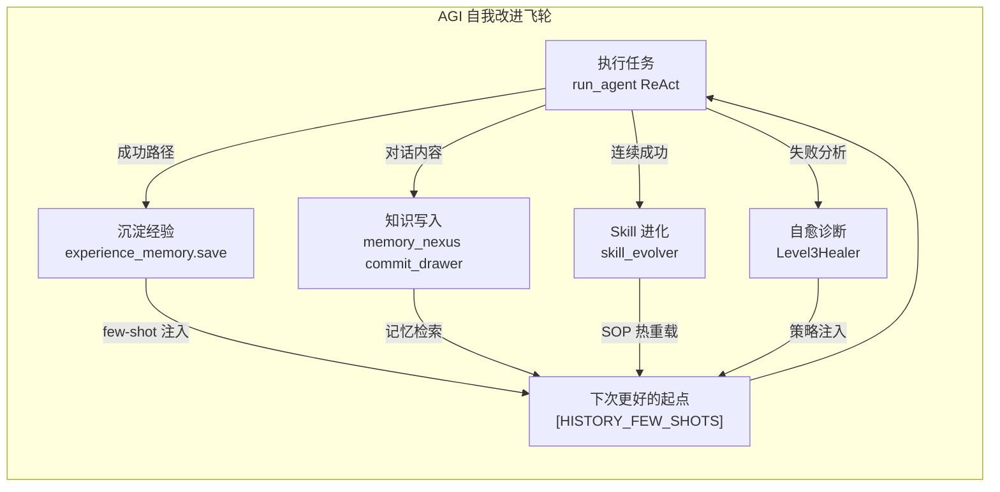
```mermaid
flowchart LR
    subgraph FLYWHEEL["AGI 自我改进飞轮"]
        EXEC10["执行任务\nrun_agent ReAct"]

        EXEC10 -->|"成功路径"| EXP10["沉淀经验\nexperience_memory.save"]
        EXEC10 -->|"对话内容"| NEXUS10["知识写入\nmemory_nexus commit_drawer"]
        EXEC10 -->|"连续成功"| EVOLVE10["Skill 进化\nskill_evolver"]
        EXEC10 -->|"失败分析"| HEAL10["自愈诊断\nLevel3Healer"]

        EXP10 -->|"few-shot 注入"| PROMPT10["下次更好的起点\n[HISTORY_FEW_SHOTS]"]
        NEXUS10 -->|"记忆检索"| PROMPT10
        EVOLVE10 -->|"SOP 热重载"| PROMPT10
        HEAL10 -->|"策略注入"| PROMPT10

        PROMPT10 --> EXEC10
    end
```

### 10.2 AGI 度量指标

| 指标 | 观测路径 | 良性趋势 |
|------|---------|---------|
| 经验库增长速率 | `wc -l experience.jsonl` | 持续增加（每轮成功 +1~2 条） |
| Skill 进化频率 | `skill_evolution.jsonl` 每周条目数 | 每周 1~5 次进化 |
| Critic 拒绝率 | `_l4_critic_reject_streak` 统计 | < 10%（少量拒绝是正常的） |
| 自愈成功率 | `level3_healer` 日志 | 诊断准确率 > 70% |
| 首轮命中率 | `[ExperienceRAG]` 日志 | 经验命中率 > 40% |
| ReAct 迭代均值 | run_agent 日志 | 随经验积累应下降 |

---

**上一篇**: [04_MEMORY_ARCHITECTURE.md](./04_MEMORY_ARCHITECTURE.md)  
**下一篇**: [06_CONCURRENCY_RESILIENCE.md](./06_CONCURRENCY_RESILIENCE.md) — 并发调度与韧性保障
