# Jachin 并发调度与韧性保障详解

> **分册**: 06 / 07 · [返回索引](./README.md)  
> **代码锚点**: `l3_node/session_instruction_queue.py`、`l3_node/background_task_service.py`、`l3_node/execution_resilience.py`、`l3_node/global_task_registry.py`  
> **专题 SSOT**: [`JACHIN_EXECUTION_RESILIENCE_CONTRACT.md`](../JACHIN_EXECUTION_RESILIENCE_CONTRACT.md)、[`前台闲聊与后台重负荷任务的物理隔离与背压熔断.md`](../前台闲聊与后台重负荷任务的物理隔离与背压熔断.md)

---

## 目录

1. [设计哲学：四原则](#一设计哲学四原则)
2. [前台/后台物理隔离](#二前台后台物理隔离)
3. [并发调度层（SessionInstructionQueue）](#三并发调度层sessioninstructionqueue)
4. [飞书 IM 第二条指令处理策略](#四飞书-im-第二条指令处理策略)
5. [执行韧性契约（RunReport + ExecutionBrief）](#五执行韧性契约runreport--executionbrief)
6. [错误分类与重试策略](#六错误分类与重试策略)
7. [策略链（StrategyChain）](#七策略链strategychain)
8. [背压与熔断](#八背压与熔断)
9. [asyncio 并发控制详解](#九asyncio-并发控制详解)
10. [韧性检查清单](#十韧性检查清单)

---

## 一、设计哲学：四原则

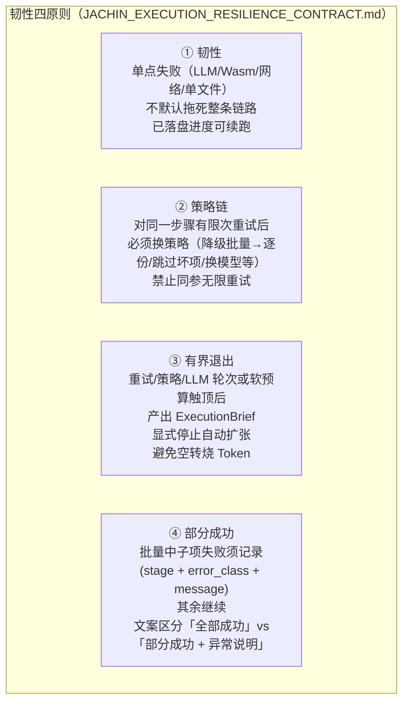

---

## 二、前台/后台物理隔离

### 2.1 双轨架构

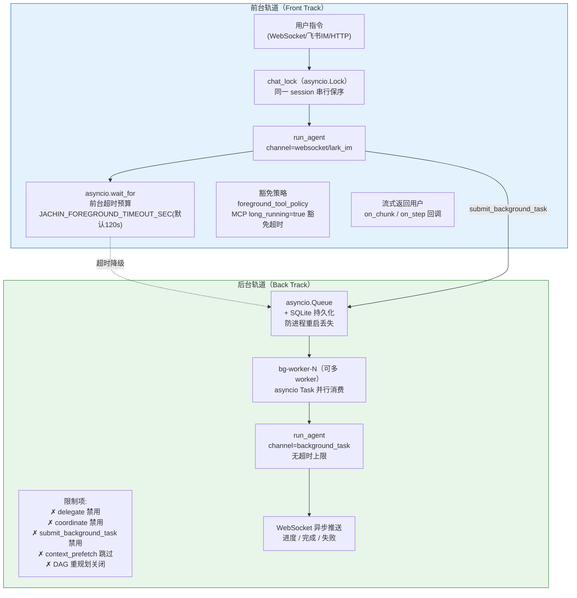

### 2.2 前台超时降级流程

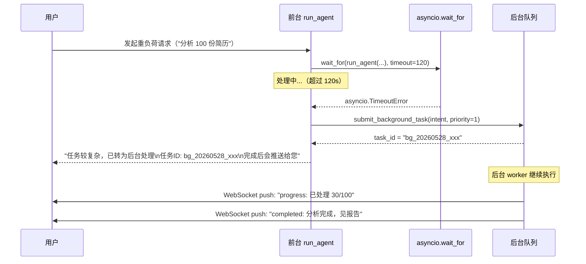

---

## 三、并发调度层（SessionInstructionQueue）

### 3.1 SIQ 双模式

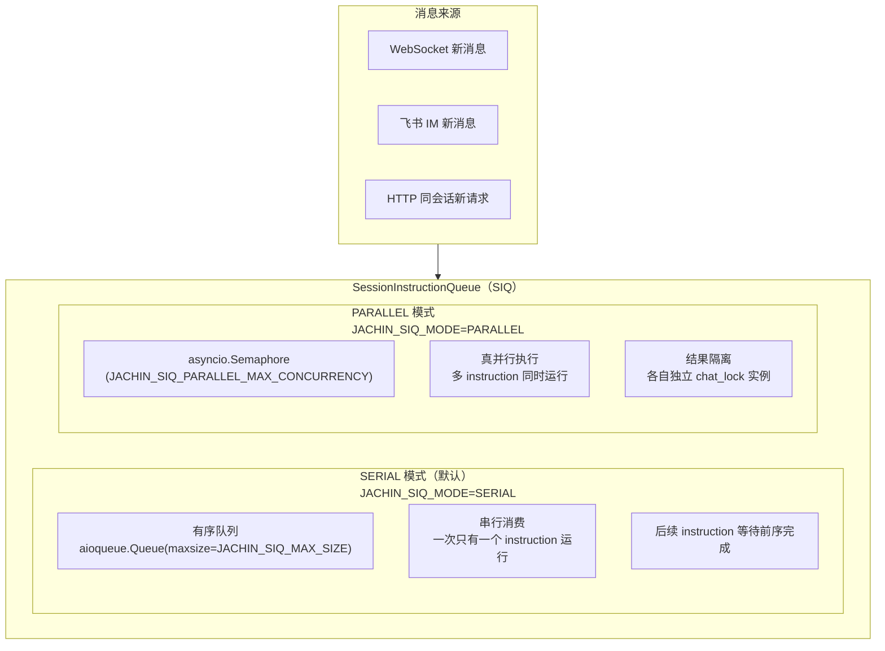

### 3.2 SIQ 提交时序

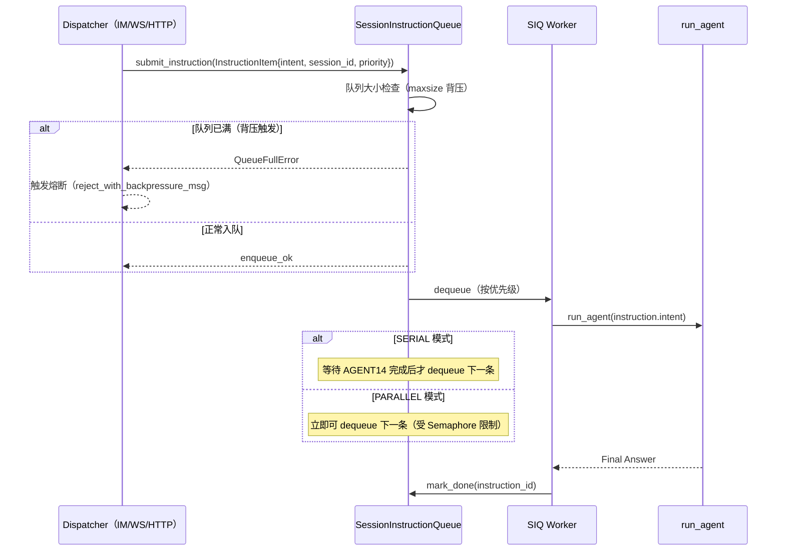

---

## 四、飞书 IM 第二条指令处理策略

### 4.1 四种处理策略

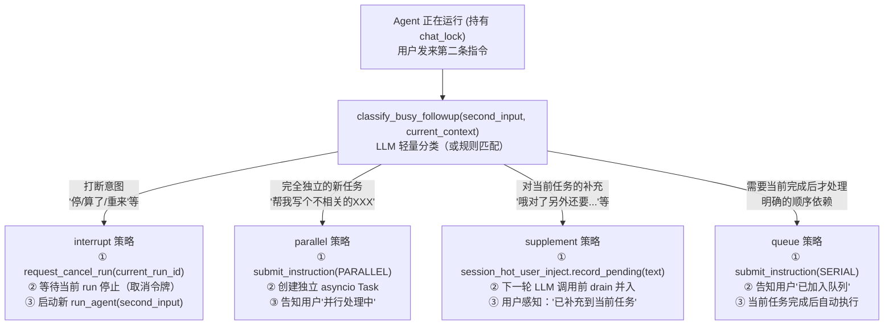

### 4.2 interrupt 策略时序

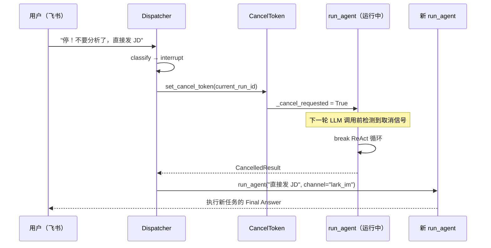

### 4.3 supplement 策略（热注入）

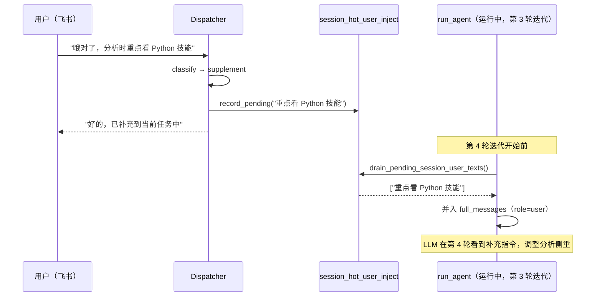

---

## 五、执行韧性契约（RunReport + ExecutionBrief）

### 5.1 RunReport 数据结构

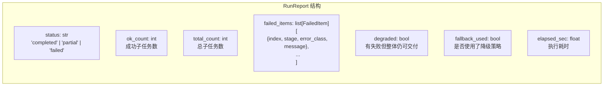

**输出格式约定**：

```
[delegate RunReport] 完成: 8/10 成功，2 失败
| 序号 | 角色     | 状态  | 摘要               |
|------|---------|-------|--------------------|
| 1    | analyst | ✅    | Q1 报告分析完成     |
| 2    | analyst | ✅    | Q2 报告分析完成     |
| 3    | analyst | ❌    | TimeoutError       |
...

[子任务 1·analyst]
（详细分析内容...）

[子任务 3 失败: TimeoutError]
网络连接超时，建议重试
```

### 5.2 批量任务韧性保障

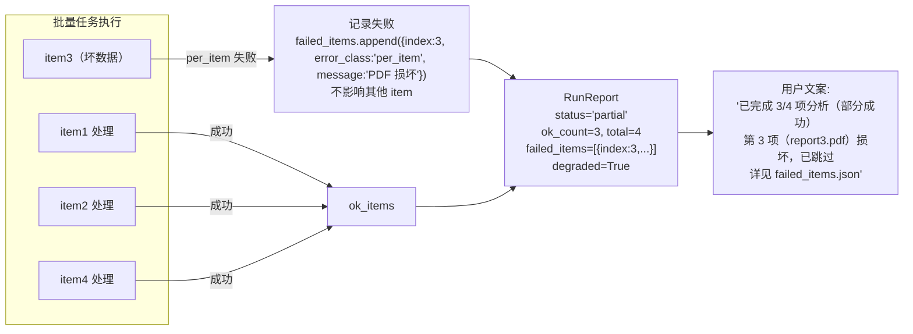

**严禁行为**（合规代码不得出现）：

```python
# ❌ 禁止：单项失败静默吞掉
try:
    process(item)
except Exception:
    pass  # 上层误判成功！

# ❌ 禁止：单项失败导致全批失败
try:
    for item in items:
        process(item)
except Exception as e:
    raise  # 截断整批，丢失已处理进度！

# ✅ 正确：记录失败，继续其余
failed_items = []
for item in items:
    try:
        process(item)
        ok_count += 1
    except Exception as e:
        failed_items.append(FailedItem(index=i, error_class=classify(e), message=str(e)))
```

---

## 六、错误分类与重试策略

### 6.1 五类错误分类

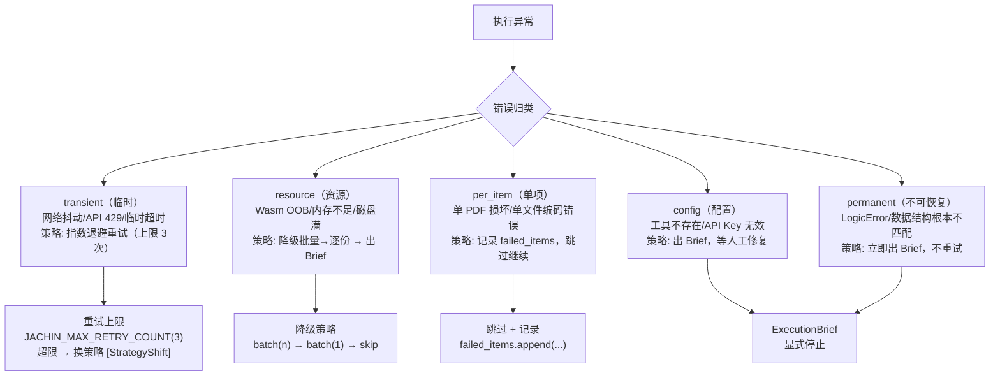

### 6.2 分类判断逻辑

```python
def classify_error(exc: Exception) -> ErrorClass:
    if isinstance(exc, (httpx.TimeoutException, aiohttp.ServerTimeoutError)):
        return "transient"
    if isinstance(exc, httpx.HTTPStatusError) and exc.response.status_code == 429:
        return "transient"  # Rate limit，可重试
    if isinstance(exc, (MemoryError, WasmOOBError)):
        return "resource"
    if isinstance(exc, (FileNotFoundError, CorruptedFileError)):
        return "per_item"
    if isinstance(exc, (AuthError, ToolNotFoundError)):
        return "config"
    # 兜底 → permanent（不确定的归为不可恢复，保守处理）
    return "permanent"
```

---

## 七、策略链（StrategyChain）

### 7.1 策略链流程

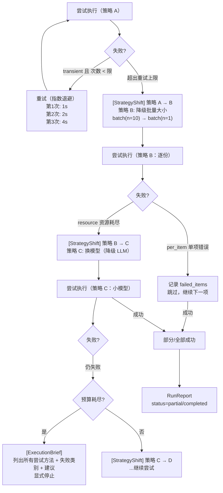

### 7.2 策略链可观测日志

| 日志标签 | 触发时机 | 格式示例 |
|---------|---------|---------|
| `[StrategyShift]` | 策略切换 | `[StrategyShift] batch(10)→batch(1): 3次重试后切换` |
| `[ExecutionBrief]` | 有界退出 | `[ExecutionBrief] 4策略均失败，建议人工介入` |
| `[RetryAttempt]` | 重试 | `[RetryAttempt] 2/3: transient error, 2s 后重试` |
| `[SkipItem]` | per_item 跳过 | `[SkipItem] idx=3: PDF 损坏，已跳过` |

---

## 八、背压与熔断

### 8.1 背压机制

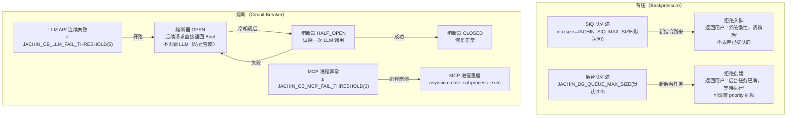

### 8.2 前台预算告警

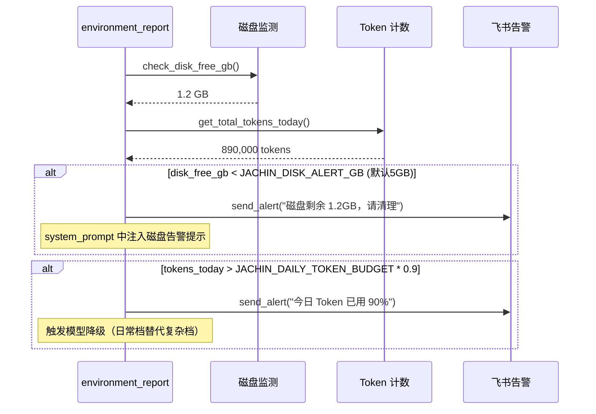

---

## 九、asyncio 并发控制详解

### 9.1 关键锁与同步原语

| 原语 | 位置 | 作用 |
|------|------|------|
| `asyncio.Lock` → `chat_lock` | 前台 run_agent | 同一 session 串行保序 |
| `asyncio.Semaphore(max=4)` → delegate | `_delegate_max_concurrent_cfg` | 限制并行 SubAgent 数 |
| `asyncio.Semaphore` → SIQ PARALLEL | `SessionInstructionQueue` | 限制并行指令数 |
| `asyncio.Queue` → BG Queue | `BackgroundTaskService` | 后台任务缓冲 |
| `asyncio.Event` → cancel_token | 各 run_agent | 跨协程取消信号 |
| `asyncio.gather(return_exceptions=True)` | delegate/FanOut | 收集并行结果（不因单个异常中断） |

### 9.2 delegate 并发控制详图

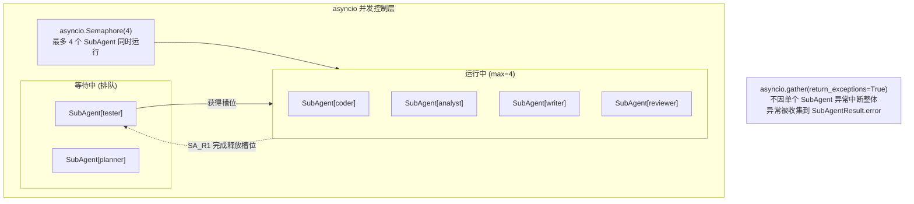

### 9.3 取消信号传播链

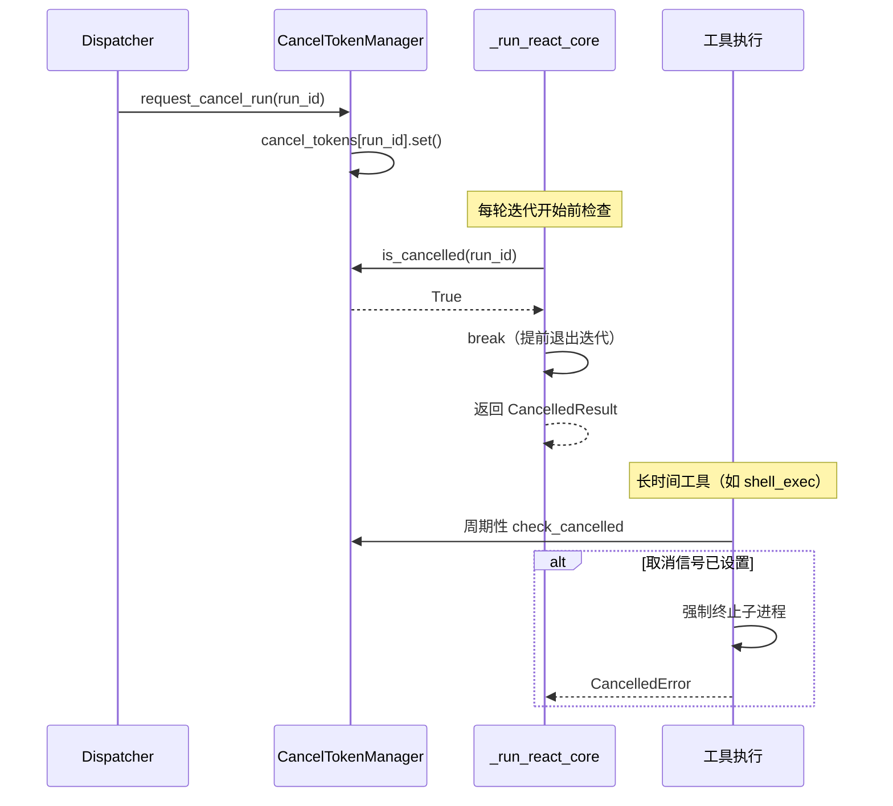

---

## 十、韧性检查清单

在修改 Skill、工具、调度器等代码时，过一遍以下检查：

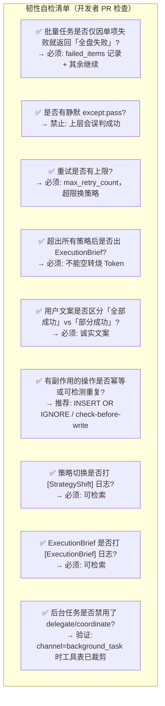

**配置快查**：

| 参数 | 作用 | 默认 |
|------|------|------|
| `JACHIN_MAX_RETRY_COUNT` | 全局重试上限 | `3` |
| `JACHIN_FOREGROUND_TIMEOUT_SEC` | 前台超时（秒） | `120` |
| `JACHIN_SIQ_MAX_SIZE` | SIQ 队列容量 | `50` |
| `JACHIN_SIQ_MODE` | SIQ 模式 | `SERIAL` |
| `JACHIN_SIQ_PARALLEL_MAX_CONCURRENCY` | 并行模式并发上限 | `3` |
| `JACHIN_BG_QUEUE_MAX_SIZE` | 后台队列容量 | `200` |
| `JACHIN_CB_LLM_FAIL_THRESHOLD` | LLM 熔断阈值 | `5` |
| `JACHIN_DISK_ALERT_GB` | 磁盘告警阈值（GB） | `5` |
| `JACHIN_NEXUS_TIME_DECAY_WEIGHT` | 记忆时间衰减权重 | `0.2` |

---

**上一篇**: [05_AGI_CORE_CAPABILITIES.md](./05_AGI_CORE_CAPABILITIES.md)  
**下一篇**: [07_OBSERVABILITY_AUTONOMY.md](./07_OBSERVABILITY_AUTONOMY.md) — 可观测性与自治能力
