# Jachin 可观测性与自治能力详解

> **分册**: 07 / 07 · [返回索引](./README.md)  
> **代码锚点**: `l3_node/http_server.py`（诊断端点）、`l3_node/awareness_loop.py`、`l3_node/dag_resume.py`、`l3_node/dag_handoff.py`、`l3_node/global_task_registry.py`

---

## 目录

1. [可观测性体系总览](#一可观测性体系总览)
2. [诊断 HTTP 端点全景](#二诊断-http-端点全景)
3. [可观测日志标签体系](#三可观测日志标签体系)
4. [Hook 事件持久化与回放](#四hook-事件持久化与回放)
5. [自治状态机完整详解](#五自治状态机完整详解)
6. [DAG 续跑与断点恢复](#六dag-续跑与断点恢复)
7. [DAG 跨节点转交（Handoff）](#七dag-跨节点转交handoff)
8. [ProactiveReporter 日终报告](#八proactivereporter-日终报告)
9. [运行时快照与监控面板](#九运行时快照与监控面板)
10. [告警与飞书通知](#十告警与飞书通知)

---

## 一、可观测性体系总览

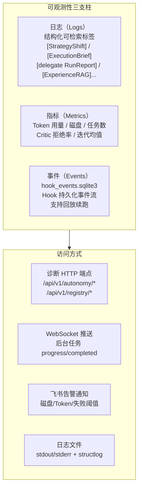

---

## 二、诊断 HTTP 端点全景

### 2.1 端点完整列表

| 端点 | 方法 | 用途 | 典型使用场景 |
|------|------|------|------------|
| `/api/v1/autonomy/status` | GET | 可观测性全局面板（Token/磁盘/任务/告警） | 监控仪表盘 |
| `/api/v1/registry/runtime-snapshot` | GET | 前台任务快照 + hot_inject 缓冲 | 查看当前运行状态 |
| `/api/v1/registry/global-tasks` | GET | 全局任务注册表（跨进程） | 查看所有活跃任务 |
| `/api/v1/registry/task-dag-active` | GET | 当前 TaskDAG active.json 内容 | DAG 进度追踪 |
| `/api/v1/registry/hook-events-recent` | GET | Hook 事件历史（含 run_id 精确筛） | 事件回溯调试 |
| `/api/v1/registry/hook-replay` | POST | 触发 Hook 事件回放（续跑） | 失败任务恢复 |
| `/api/v1/registry/dag-resume` | POST | DAG 轻量续跑（dry_run / apply） | 断点续跑 |
| `/api/v1/registry/dag-guardrails` | GET | DAG 预算护栏状态 | 护栏监控 |
| `/dag-handoff/export` | POST | 导出 DAG 转交包 | 负载均衡/迁移 |
| `/dag-handoff/import` | POST | 导入 DAG 转交包 | 接受转交 |
| `/dag-handoff/auto-transfer` | POST | 自动转交到空闲 peer | 自动负载均衡 |
| `/api/v1/autonomy/intents` | GET | 持久化意图列表 | 查看自治任务 |
| `/api/v1/autonomy/intents` | POST | 创建持久化意图 | 注册自治任务 |
| `/api/v1/autonomy/intents/{id}` | PUT | 更新意图（启停/修改） | 管理自治任务 |
| `/api/v1/autonomy/intents/{id}` | DELETE | 删除意图 | 注销自治任务 |

### 2.2 /api/v1/autonomy/status 响应格式

```json
{
  "status": "healthy",
  "timestamp": 1748390400.0,
  "version": "v1.0.0",
  "uptime_sec": 86400,
  "token_usage": {
    "today_total": 456789,
    "daily_budget": 1000000,
    "usage_pct": 45.7,
    "alerts": []
  },
  "disk": {
    "free_gb": 42.3,
    "alert_threshold_gb": 5.0,
    "status": "ok"
  },
  "active_tasks": {
    "foreground": 1,
    "background": 3,
    "autonomy": 0
  },
  "awareness_loop": {
    "running": true,
    "scan_interval_sec": 60,
    "last_scan_at": 1748390380.0,
    "active_intents": 5
  },
  "skill_evolution": {
    "total_evolutions": 12,
    "last_evolution_at": 1748300000.0
  }
}
```

### 2.3 /api/v1/registry/runtime-snapshot 响应

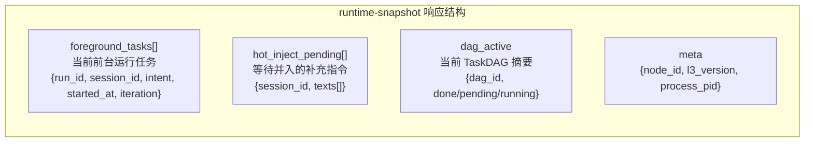

---

## 三、可观测日志标签体系

### 3.1 可检索日志标签全表

| 标签 | 触发场景 | 用于排查 |
|------|---------|---------|
| `[delegate RunReport]` | delegate 子任务完成汇总 | 子任务成功/失败率 |
| `[FanOut RunReport]` | FanOut 并行完成汇总 | 批量任务效率 |
| `[Pipeline]` | Pipeline 流水线阶段 | 依赖链执行顺序 |
| `[ExecutionBrief]` | 任务有界退出 | 为何停止、失败类别 |
| `[StrategyShift]` | 策略切换 | 降级路径追踪 |
| `[Discussion]` | 讨论模式轮次摘要 | 辩论过程审查 |
| `[L3 Agent]` | coordinate/delegate RunReport | 跨节点/并行执行 |
| `[SubAgent]` | 子 Agent 执行日志 | 子任务内部状态 |
| `[ExperienceRAG]` | 经验检索/写入 | few-shot 命中率 |
| `[SkillEvolution]` | Skill 进化事件 JSONL | 进化过程审计 |
| `[StrategyInject]` | 策略消息注入 | 韧性链路追踪 |
| `[RetryAttempt]` | 重试触发 | 重试频率分析 |
| `[SkipItem]` | per_item 跳过 | 坏数据追踪 |
| `[hook_events]` | Hook 事件持久化 | 事件回放需求 |
| `[DAGResume]` | DAG 续跑触发 | 断点恢复验证 |
| `[DAGHandoff]` | DAG 跨节点转交 | 负载均衡追踪 |
| `[prompt_suffix_eviction]` | System prompt 后缀裁剪 | Token 优化诊断 |
| `[CriticReject]` | Critic 审查拒绝 | 危险操作拦截统计 |

### 3.2 日志结构示例

```python
# structlog 格式（JSON）
{
    "ts": "2026-05-28T09:45:00+08:00",
    "level": "info",
    "tag": "[delegate RunReport]",
    "run_id": "run_20260528_abc123",
    "session_id": "sess_xyz",
    "ok_count": 8,
    "total_count": 10,
    "failed_items": [
        {"index": 3, "error_class": "transient", "message": "TimeoutError"},
        {"index": 7, "error_class": "per_item", "message": "PDF 损坏"}
    ],
    "elapsed_sec": 34.2
}

# [StrategyShift]
{
    "tag": "[StrategyShift]",
    "from_strategy": "batch(n=10)",
    "to_strategy": "batch(n=1)",
    "reason": "3次 resource 错误后降级",
    "attempt": 3
}
```

---

## 四、Hook 事件持久化与回放

### 4.1 Hook 持久化存储

```
~/.jachin/workspace/
└─ hook_events.sqlite3
   └─ 表: hook_events
      ├─ event_id     TEXT (UUID)
      ├─ run_id       TEXT (关联的 run_agent 实例)
      ├─ dag_id       TEXT (关联的 DAG)
      ├─ hook_type    TEXT (HOOK_ON_TASK_NODE_DONE / HOOK_AFTER_TOOL_EXEC / ...)
      ├─ payload_json TEXT (事件数据 JSON)
      ├─ timestamp    REAL (Unix 时间戳)
      └─ session_id   TEXT (会话标识)
```

### 4.2 事件写入流程

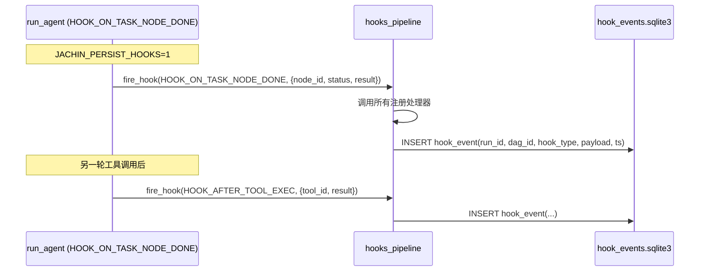

### 4.3 回放与续跑时序

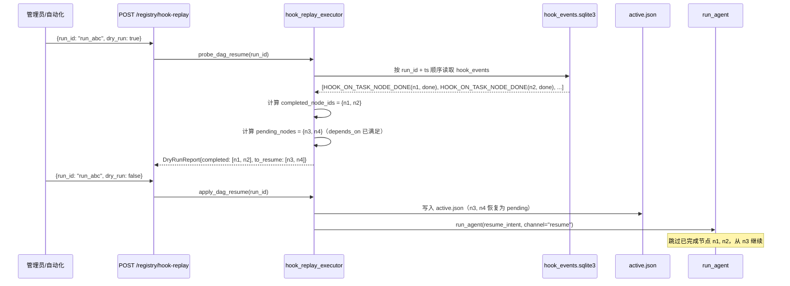

---

## 五、自治状态机完整详解

### 5.1 完整状态机

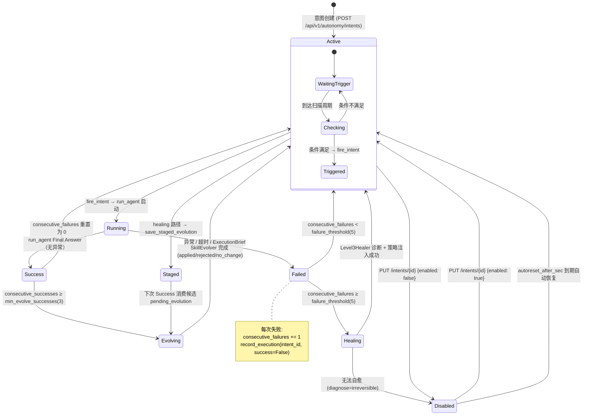

### 5.2 意图触发类型详解

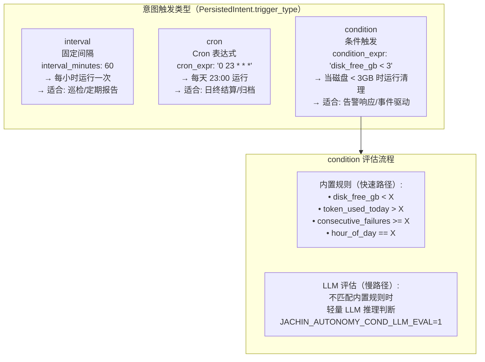

---

## 六、DAG 续跑与断点恢复

### 6.1 续跑决策树

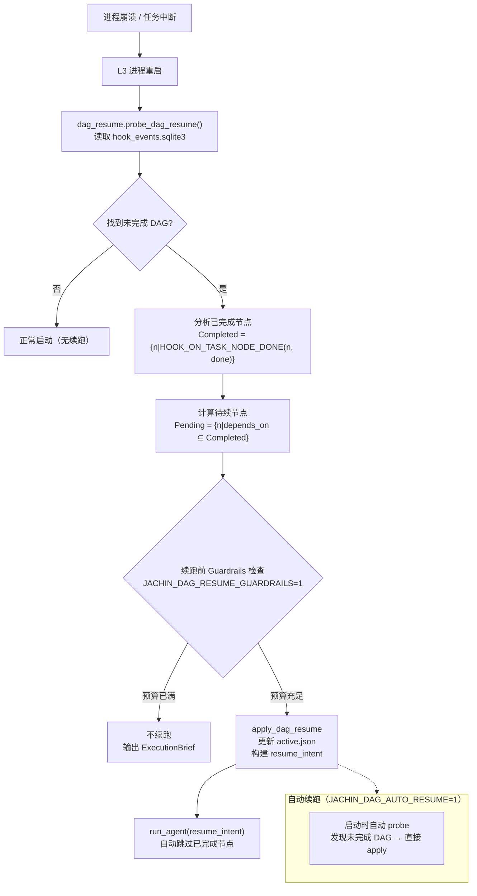

### 6.2 续跑 intent 格式

```
[DAGResume] 续跑 run_id=run_20260528_abc123

DAG ID: dag_20260528_def456
已完成节点: n1(分析代码), n2(编写接口), n3(单元测试)
待续节点: n4(集成测试), n5(更新文档)

请从节点 n4 继续执行，跳过已完成的节点。
当前进度: 3/5 完成（60%）
已知信息: n3 产出 "测试覆盖率 87%"
```

---

## 七、DAG 跨节点转交（Handoff）

### 7.1 转交完整流程

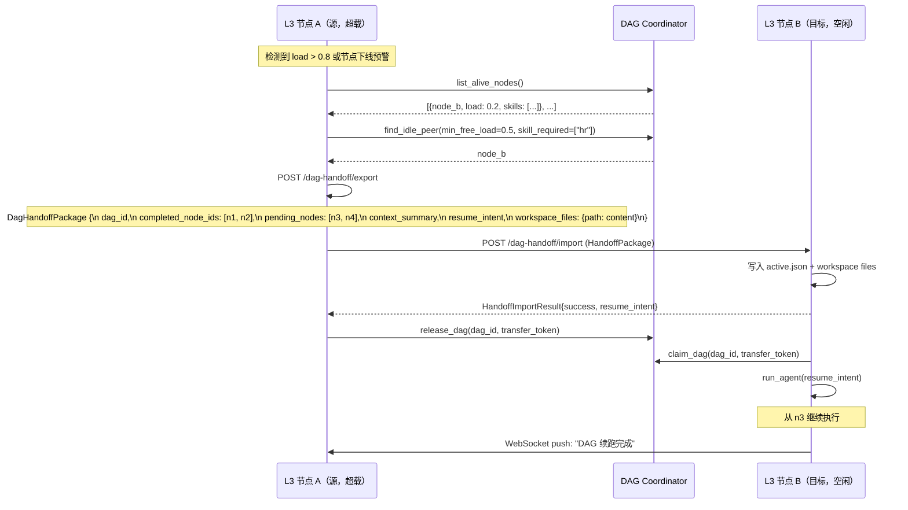

### 7.2 自动转交触发条件

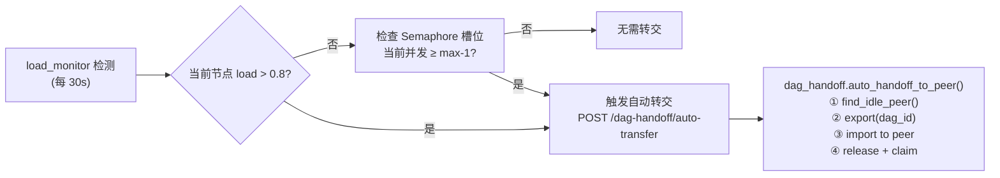

---

## 八、ProactiveReporter 日终报告

### 8.1 报告触发时序

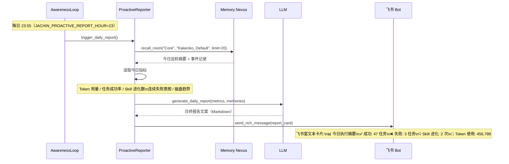

### 8.2 报告内容结构

```
📊 Jachin 日终报告 · 2026-05-28

执行摘要
────────
  ✅ 完成任务: 47
  ❌ 失败任务: 3（已触发 Level3Healer 诊断）
  ⏱️  平均 ReAct 迭代: 3.2 轮
  📝 Memory 写入: 128 条

资源状态
────────
  🔑 Token 今日: 456,789 / 1,000,000 (45.7%)
  💾 磁盘剩余: 42.3 GB ✅
  🔄 后台队列: 0 待处理

AGI 进化
────────
  🧠 Experience 记录: +23 条（累计 847）
  ⚙️  Skill 进化: 2 次（hr_analyzer4 · bi_report）
  🔍 Level3Healer: 修复 2 个意图（成功率 100%）

待关注
────────
  ⚠️  候选人分析任务 3 次失败（根因: API 429）
     建议: 降低并发，或申请更高 QPS 配额
```

---

## 九、运行时快照与监控面板

### 9.1 监控数据层次

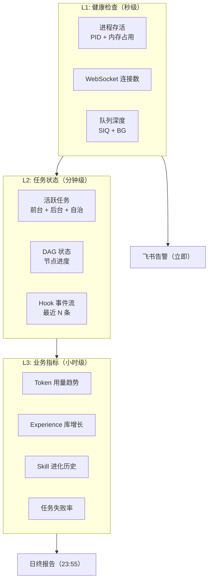

### 9.2 GET /api/v1/registry/hook-events-recent 示例

```json
{
  "run_id": "run_20260528_abc123",
  "events": [
    {
      "event_id": "evt_001",
      "ts": 1748390300.0,
      "hook_type": "HOOK_ON_TASK_NODE_DONE",
      "payload": {"node_id": "n1", "status": "done", "elapsed": 12.3}
    },
    {
      "event_id": "evt_002",
      "ts": 1748390400.0,
      "hook_type": "HOOK_AFTER_TOOL_EXEC",
      "payload": {"tool_id": "core:fs_write", "success": true}
    }
  ],
  "total": 2,
  "dag_id": "dag_20260528_def456"
}
```

### 9.3 GET /api/v1/registry/dag-guardrails 示例

```json
{
  "dag_id": "dag_20260528_def456",
  "guardrails_enabled": true,
  "budget": {
    "max_iterations": 50,
    "used_iterations": 23,
    "max_tool_calls": 100,
    "used_tool_calls": 41,
    "max_tokens": 200000,
    "used_tokens": 89000,
    "max_nodes": 20,
    "total_nodes": 5
  },
  "status": "within_budget",
  "alerts": []
}
```

---

## 十、告警与飞书通知

### 10.1 告警触发矩阵

| 告警类型 | 触发条件 | 级别 | 飞书消息类型 |
|---------|---------|------|------------|
| 磁盘告警 | `disk_free_gb < JACHIN_DISK_ALERT_GB` | ⚠️ Warning | 文本 + 动作按钮 |
| Token 告警 | `token_today > budget * 0.9` | ⚠️ Warning | 文本 |
| Token 超限 | `token_today > budget` | 🔴 Critical | 富文本卡片 |
| 意图连续失败 | `consecutive_failures >= threshold` | 🔴 Critical | 富文本卡片 + 诊断摘要 |
| Skill 进化完成 | 每次进化成功 | ℹ️ Info | 简单文本 |
| DAG 转交完成 | handoff 成功 | ℹ️ Info | 简单文本 |
| 日终报告 | 每日 23:55 | 📊 Report | 富文本卡片 |
| Level3Healer 诊断 | 连续失败 → 自愈 | ⚠️ Warning | 富文本卡片 + 建议 |

### 10.2 飞书告警发送时序

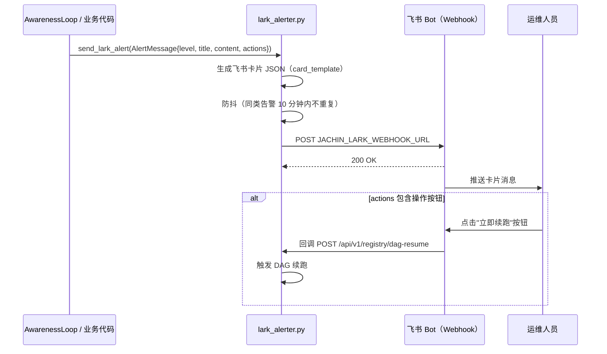

### 10.3 资源监控告警流程

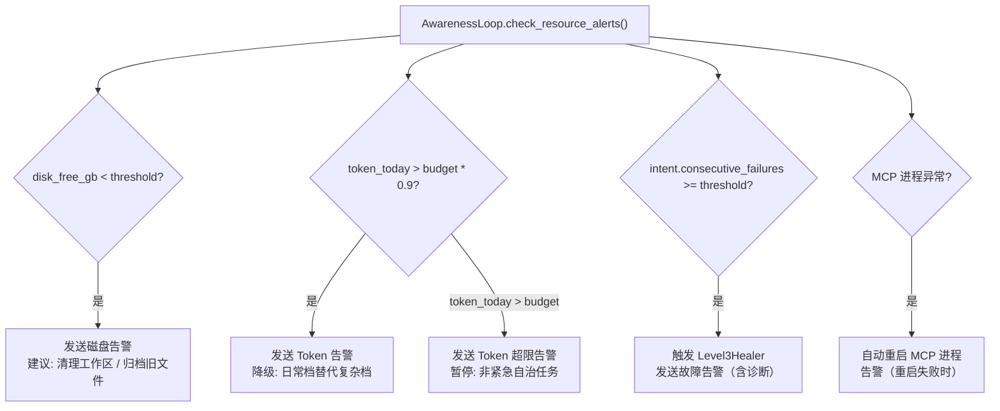

---

**上一篇**: [06_CONCURRENCY_RESILIENCE.md](./06_CONCURRENCY_RESILIENCE.md)  
**索引**: [README.md](./README.md)
