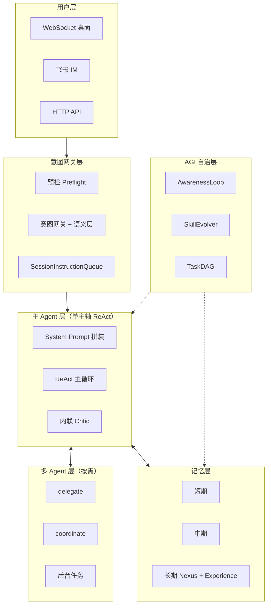

# Jachin 系统架构文档（2026）

> **版本**: v1.1 — 2026-05-28  
> **定位**: 系统架构全景的**总—分**文档集；本目录为工程图与实现细节 SSOT。  
> **全局规范**: [`docs/ARCHITECTURE.md`](../ARCHITECTURE.md) · **一页快照**: [`docs/architecture/CURRENT_SYSTEM_ARCHITECTURE.md`](../architecture/CURRENT_SYSTEM_ARCHITECTURE.md)

---

## 阅读顺序

| # | 文档 | 主题 |
|---|------|------|
| 01 | [三层系统架构](./01_THREE_LAYER_SYSTEM.md) | L1/L2/L3 分工、启动时序、API Key 零信任、Skill/MCP 分发、多节点拓扑 |
| 02 | [主 Agent 设计](./02_MAIN_AGENT_DESIGN.md) | `run_agent` 入口、ReAct 循环、System Prompt 拼装、三档模型路由、Hook 链 |
| 03 | [多 Agent 架构](./03_MULTI_AGENT.md) | delegate / coordinate / 后台任务、SubAgent 角色、FanOut / Pipeline / Discussion |
| 04 | [记忆架构](./04_MEMORY_ARCHITECTURE.md) | 短期 / 中期 / 长期三层记忆、Memory Nexus、Experience RAG |
| 05 | [AGI 核心能力](./05_AGI_CORE_CAPABILITIES.md) | 意图网关、内联 Critic、AwarenessLoop、SkillEvolver、TaskDAG、Guardrails |
| 06 | [并发调度与韧性](./06_CONCURRENCY_RESILIENCE.md) | 前后台隔离、SIQ、RunReport / ExecutionBrief、错误分类与策略链 |
| 07 | [可观测性与自治](./07_OBSERVABILITY_AUTONOMY.md) | 诊断 HTTP 端点、日志标签、Hook 回放、DAG 续跑 / 转交、飞书告警 |

---

## 架构哲学（总览）

| 哲学 | 体现 |
|------|------|
| **单主轴优先** | 默认一条 `run_agent` ReAct 主循环；多 Agent 按需扩展 |
| **四大原语正交** | Tools / MCP / Skills / Agent Tasks 互不混淆 |
| **本地闭环记忆** | L3 Memory Nexus（SQLite + FastEmbed），不依赖 L2 同步守护 |
| **执行韧性优先** | 部分成功 + 有界退出 + RunReport |
| **AGI 自治飞轮** | Experience RAG + Skill 进化 + AwarenessLoop |

---

## 专题 SSOT（本目录不重复展开）

| 主题 | 文档 |
|------|------|
| 四大原语术语 | [`docs/FOUR_PRIMITIVES.md`](../FOUR_PRIMITIVES.md) |
| L3 混合智能体（执行主轴） | [`docs/architecture/JACHIN_HYBRID_AGENT_ARCHITECTURE.md`](../architecture/JACHIN_HYBRID_AGENT_ARCHITECTURE.md) |
| 工具池与 MCP 组装 | [`docs/architecture/L3_TOOL_POOL_AND_MCP_ASSEMBLY.md`](../architecture/L3_TOOL_POOL_AND_MCP_ASSEMBLY.md) |
| Memory Nexus 实现 | [`docs/architecture/MEMORY_NEXUS_L3.md`](../architecture/MEMORY_NEXUS_L3.md) |
| Agent 上下文与 Prompt | [`docs/L3_AGENT_CONTEXT_MEMORY_AND_PROMPT.md`](../L3_AGENT_CONTEXT_MEMORY_AND_PROMPT.md) |
| 执行韧性契约 | [`docs/JACHIN_EXECUTION_RESILIENCE_CONTRACT.md`](../JACHIN_EXECUTION_RESILIENCE_CONTRACT.md) |
| AGI 优化路线图 | [`docs/AGI_OPTIMIZATION_ROADMAP.md`](../AGI_OPTIMIZATION_ROADMAP.md) |

---

## 鸟瞰图

