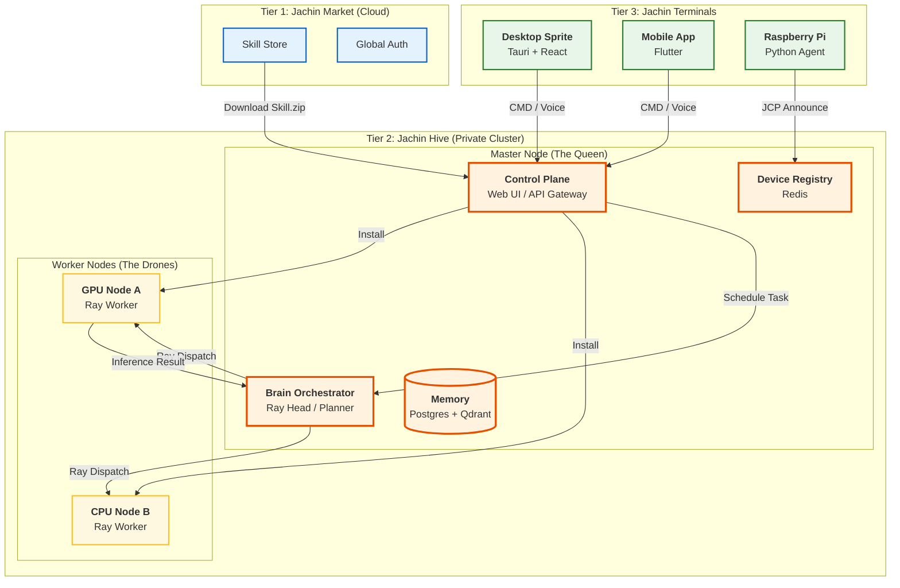
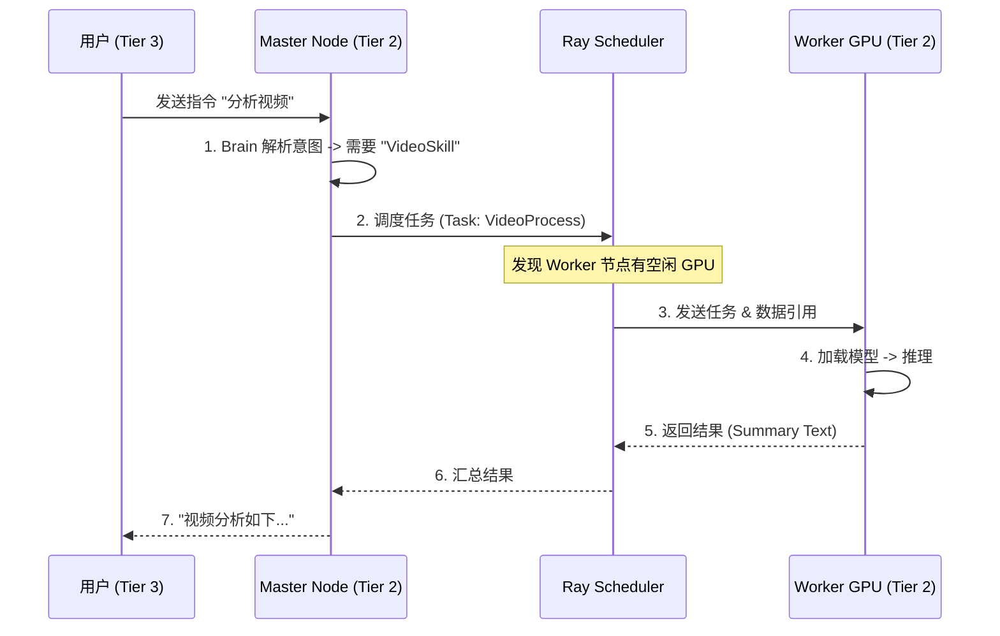
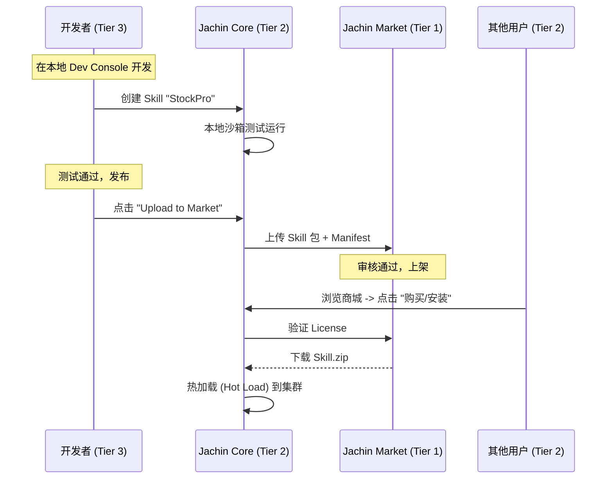
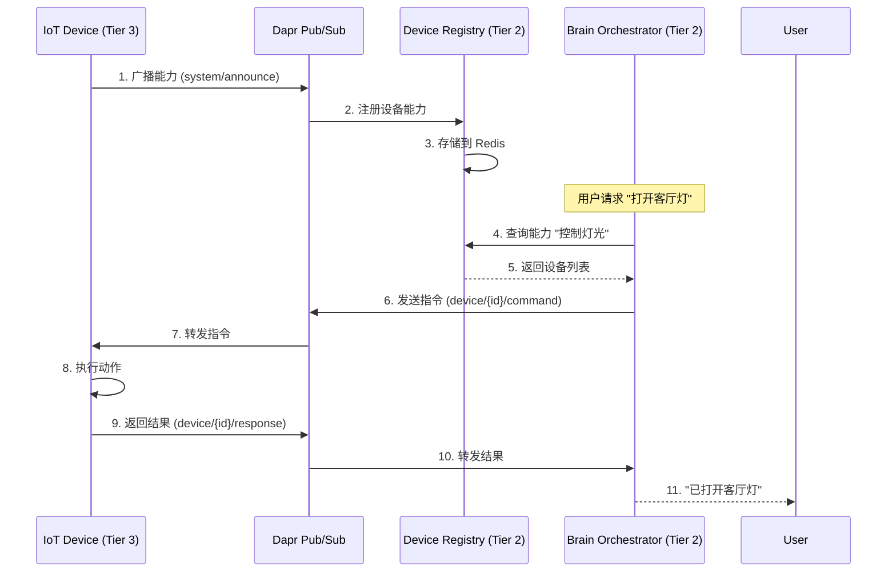

# Jachin-System v3.2 架构设计文档

## 文档信息

- **版本**: v3.2
- **最后更新**: 2026-02-03
- **定位**: 分布式智能体操作系统 (Distributed Agent OS)
- **规范引用**: [ARCHITECTURE_DESIGN_SPEC.md](./ARCHITECTURE_DESIGN_SPEC.md)（正式架构规范 v1.0，术语 Layer = Tier）

---

## 一、项目愿景

Jachin-System 是一个**本地优先、可无限扩展的 AI 智能体生态系统**。它旨在为个人、家庭和中小型团队提供一个私有的"钢铁侠"级算力中心。它不仅仅是助手，更是连接物理世界（IoT）、数字资产（Memory）和云端能力（Marketplace）的操作系统。

### 核心价值主张

1. **隐私优先**: 所有数据存储在本地，用户完全掌控
2. **弹性扩展**: 从单台笔记本（Single Mode）平滑扩展到百卡集群（Cluster Mode）
3. **能力即服务**: 技能插件化，支持自然语言开发、一键分发与热加载
4. **联邦记忆**: 数据在物理上隔离（隐私），在逻辑上分层（共享）

---

## 二、三层架构 (The Trinity)

```
云端分发 (Cloud) + 蜂巢算力 (Hive) + 灵动终端 (Terminal)
```

### Tier 1: Jachin Market (The Cloud)

**职责**: 全球技能商店、用户授权中心、计费网关

**核心功能**:
- 技能商店：浏览、搜索、购买技能
- 用户授权：OAuth 2.0 / JWT 认证
- 计费网关：订阅、一次性购买、使用量计费
- 技能审核：代码安全扫描、功能测试

**技术栈**: Go / Python（高并发接口）

**部署**: 云端 SaaS（AWS / 阿里云）

---

### Tier 2: Jachin Hive (The Core)

**职责**: 私有主网，运行在本地高性能设备上

**核心功能**:
- **AI 推理**: 本地/云端模型适配，支持 Ray 分布式计算
- **记忆存储**: PostgreSQL（关系型数据）+ Qdrant（向量数据）
- **设备管理**: JCP 协议，设备注册与能力发现
- **任务编排**: Ray Scheduler，智能任务分发
- **技能运行时**: Docker / Wasm 沙箱，安全执行

**架构模式**:
- **Master Node (The Queen)**: Control Plane、Brain Orchestrator、Memory、Device Registry
- **Worker Nodes (The Drones)**: GPU Node、CPU Node，执行实际计算任务

**技术栈**:
- Control Plane: FastAPI + Dapr
- Compute: Ray（分布式计算框架）
- Storage: PostgreSQL + Qdrant
- Protocol: JCP (基于 Dapr Pub/Sub)
- Discovery: mDNS / Zeroconf

**部署**: Docker / PyInstaller（Server 模式用 Docker，Personal 模式打包成 .exe 服务）

---

### Tier 3: Jachin Terminal (The Edge)

**职责**: 用户交互界面，只负责 I/O，不负责重度计算

**核心功能**:
- **桌面精灵**: Tauri v2 + React，透明窗口、系统级 API
- **手机 App**: Flutter，跨平台移动端
- **IoT 节点**: 树莓派/ESP32，传感器数据采集、设备控制

**技术栈**:
- Desktop: Tauri v2 + React
- Mobile: Flutter
- IoT: Python / MicroPython

**通信**: 通过 Dapr Pub/Sub 与 Tier 2 通信

---

## 三、核心机制（与规范对齐）

### 3.1 混合生命周期 (Hybrid Lifecycle)

L3 技能运行模式（详见 [ARCHITECTURE_DESIGN_SPEC.md](./ARCHITECTURE_DESIGN_SPEC.md) §3.1）：

| 模式 | 适用场景 | 行为 |
|------|----------|------|
| **Ephemeral (即时)** | 简单通知、一次性查询 | RAM 加载 → 执行 → 立即销毁 |
| **Cached (缓存)** | 游戏、复杂工具、静态资产 | Hash 校验 → 缺失则拉取 → 磁盘缓存 → 随用随开 |
| **Resident (常驻)** | 语音唤醒、安防、网关 | 长期驻留后台，Keep-Alive / 休眠唤醒 |

### 3.2 智能缓存策略 (Intelligent Caching)

- **Assets**（重）: 模型/素材，Hash 不匹配时增量下载
- **Logic**（轻）: 代码，每次校验 Hash，有更新即下载（KB 级）
- **L3 本地**: LRU 算法清理长期不用的 Assets

### 3.3 拓扑模式 (Topology Modes)

| 模式 | 场景 | 实现 |
|------|------|------|
| **Super Node** | 单机 PC/Mac | L2+L3 同机，Loopback 通信，Volume Mapping 零拷贝 |
| **Distributed Cluster** | NAS + Gaming PC + Robot | Ray Cluster + mDNS 服务发现 |

---

## 四、系统架构图



---

## 五、核心业务流程

### 1. 分布式推理流程 (Distributed Inference)

当用户说"帮我分析这个 1GB 的视频"时，系统如何调度？



### 2. 技能开发与分发流程 (Skill Dev & Distribute)



### 3. 设备能力发现流程 (Device Capability Discovery)



---

## 六、文件结构

```
jachin-system/
├── .cursor/rules/             # [AI] 所有的 .mdc 规则文件
├── cloud/                     # [Tier 1] 云端代码 (Go/Python)
│   ├── marketplace/           # 商城后端
│   └── auth/                  # 鉴权中心
├── core/                      # [Tier 2] 核心蜂巢代码 (Python)
│   ├── app/                   # 桌面服务封装 (Tray Icon, System Service)
│   ├── api/                   # FastAPI 网关
│   ├── brain/                 # 智能层
│   │   ├── llm/               # 本地/云端模型适配器
│   │   ├── ray_cluster/       # [NEW] Ray 集群管理与调度
│   │   └── planner/           # 任务编排
│   ├── runtime/               # 技能运行沙箱 (Docker/Wasm)
│   ├── registry/              # JCP 设备与能力注册表
│   ├── memory/                # Qdrant 记忆管理 (含权限过滤)
│   ├── web_ui/                # [NEW] 本地管理后台 (React Build)
│   └── main.py                # 启动入口 (自动检测 Single/Cluster 模式)
├── clients/                   # [Tier 3] 客户端
│   ├── desktop/               # Tauri v2 桌面精灵
│   ├── mobile/                # Flutter App
│   └── iot/                   # 树莓派/ESP32 脚本
├── skills_repo/               # [Local] 已安装技能存储库
├── installer/                 # [Deploy] 一键安装/集群配对脚本
├── docker-compose.yml         # 基础设施 (Redis, Qdrant, Postgres)
└── requirements.txt
```

---

## 七、技术栈清单

| 领域 | 技术选型 | 理由 |
|------|---------|------|
| **Tier 1 (Cloud)** | Go / Python | 高并发接口，处理全球 License 验证 |
| **Tier 2 (Control)** | FastAPI + Dapr | 只有 Dapr 能优雅处理 Python/Rust/Go 混合微服务 |
| **Tier 2 (Compute)** | Ray | 专门用于 AI 的分布式计算框架，比 K8s 轻量，原生支持 Python |
| **Tier 2 (Storage)** | PostgreSQL + Qdrant | 关系型数据（权限/用户）+ 向量数据（记忆） |
| **Tier 3 (Client)** | Tauri v2 + React | 极致性能与内存占用，支持透明窗口和系统级 API |
| **Protocol** | JCP (based on Pub/Sub) | 自研能力发现协议，基于 Dapr Pub/Sub |
| **Discovery** | mDNS / Zeroconf | 局域网内 Tier 3 自动发现 Tier 2 Master IP |
| **Deployment** | Docker / PyInstaller | Server 模式用 Docker，Personal 模式打包成 .exe 服务 |

---

## 八、关键设计决策

### 1. 为什么选择 Ray 而不是 Kubernetes？

- **轻量级**: Ray 专为 AI 工作负载设计，比 K8s 更轻量
- **原生 Python**: Ray 原生支持 Python，无需容器化
- **动态调度**: Ray 支持动态任务调度，适合 AI 推理场景
- **资源感知**: Ray 自动感知 GPU/CPU 资源，智能分配任务

### 2. 为什么保留 Dapr？

- **多语言支持**: Dapr 支持 Python/Rust/Go 混合微服务
- **服务网格**: Dapr 提供统一的服务发现、状态管理、Pub/Sub
- **本地优先**: Dapr 可以在本地运行，无需云端依赖

### 3. 为什么技能系统使用 Docker/Wasm？

- **安全隔离**: Docker/Wasm 提供沙箱环境，防止恶意代码
- **热加载**: 支持动态加载技能，无需重启系统
- **跨平台**: Docker 支持多平台，Wasm 支持浏览器

### 4. 为什么记忆系统分离 PostgreSQL 和 Qdrant？

- **关系型数据**: PostgreSQL 存储用户、权限、设备等结构化数据
- **向量数据**: Qdrant 存储记忆向量，支持语义搜索
- **性能优化**: 分离存储可以针对不同场景优化

---

## 九、相关文档

- **[ARCHITECTURE_DESIGN_SPEC.md](./ARCHITECTURE_DESIGN_SPEC.md)** - 正式架构规范 v1.0（Single Source of Truth）
- **[whitepaper_v4.0_swarm.md](./whitepaper_v4.0_swarm.md)** - v4.0 蜂群智能白皮书
- **[ARCHITECTURE_V3.2_GAP_ANALYSIS.md](./ARCHITECTURE_V3.2_GAP_ANALYSIS.md)** - 架构差距分析
- **[SENTINEL_DESIGN.md](./SENTINEL_DESIGN.md)** - 哨兵系统设计愿景（执行者→守护者）
- **[PROJECT_STRUCTURE.md](../PROJECT_STRUCTURE.md)** - 项目结构说明

---

**文档版本**: v3.2.0  
**最后更新**: 2026-02-03  
**维护者**: Jachin-System Team
