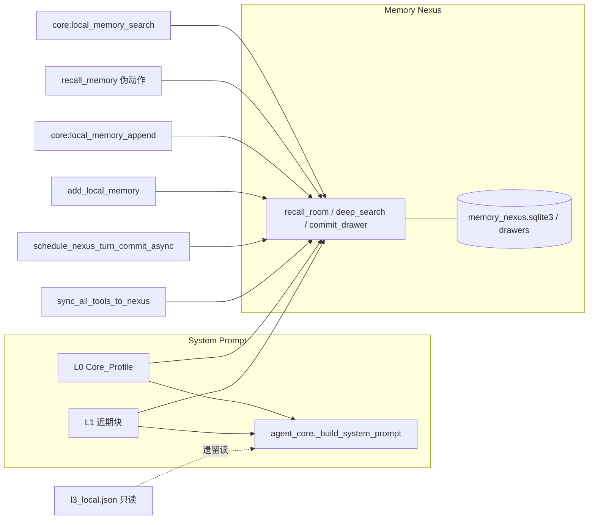

# Jachin L3 记忆架构（现行）

本文描述仓库内与「跨轮次记忆」相关的**实现级**架构：**跨会话记忆在 L3 内由 Memory Nexus（SQLite + FastEmbed）闭环**，不依赖 L2 记忆 API 或同步守护进程。与四大原语中的 **Tools**（`core:local_memory_*`）及 **Agent 上下文**（system prompt、意图网关嗅探）对齐。

**Nexus 契约细项**见 [`MEMORY_NEXUS_L3.md`](./MEMORY_NEXUS_L3.md)。  
**Prompt 调度**见 [`../L3_AGENT_CONTEXT_MEMORY_AND_PROMPT.md`](../L3_AGENT_CONTEXT_MEMORY_AND_PROMPT.md)、[`../JACHIN_CONTEXT_MEMORY_PROMPT_SCHEDULING.md`](../JACHIN_CONTEXT_MEMORY_PROMPT_SCHEDULING.md)。  
**写入与打分叙事**见 [`../MEMORY_WRITE_AND_SCORE_NARRATIVE.md`](../MEMORY_WRITE_AND_SCORE_NARRATIVE.md)。

---

## 1. 总览：命名空间区分

| 名称 / 路径 | 角色 | 典型用途 |
|-------------|------|----------|
| **Memory Nexus（SQLite + FastEmbed）** | L3 **唯一**跨会话记忆主存 | L0/L1 注入、`deep_search`、`commit_drawer`、回合末 commit、技能矩阵、`recall_memory` 伪动作（与 `core:local_memory_search` 同源） |
| **`~/.jachin/memory/l3_local.json`（及 shard）** | **遗留** JSON | 只读/诊断、HR/workflow 指针；**新记忆写入已迁 Nexus（SQLite）** |
| **`core_memory`（SQLite）** | Core 层碎片/生物侧 | `core/memory_store.py` 等；**不是** Nexus（与 Nexus 为不同 SQLite 用途） |
| **对话 Compaction** | Token 折叠 | 折叠**消息列表**；非 JSON「梦境合并」 |

> **说明**：L2 控制面仍可承担配对、Key 下发、`coordinate` 等；**产品化跨会话宿主记忆不再经 L2 `/memory/sync` 或 `/memory/search`**。若需集中式多节点记忆，应另行设计同步层，而非本文所述默认路径。

---

## 2. Memory Nexus（MemPalace / SQLite + FastEmbed）

### 2.1 数据模型与检索

- **Wing → Room → Drawer**：verbatim 文本 + 元数据（JSON）；与实现中表字段一一对应。
- **存储介质**：单一 SQLite 文件 **`~/.jachin/palace_db/memory_nexus.sqlite3`**，表 **`drawers`**（`drawer_id`, `wing`, `room`, `document`, `embedding` BLOB、`dim`, `timestamp`, `extra_meta_json`）。**不依赖**外部分向量库服务或网络向量 API；与旧版 `palace_db` 目录同父级，便于桌面打包与单文件分发。
- **向量化（Embedding）**：宿主进程内 **`fastembed.TextEmbedding`**（`memory_backend.py`），默认模型可由环境变量覆盖；写入/更新抽屉时对正文生成 L2 归一化 float32 向量并落库。
- **Deep Search（语义检索）**：
  - **不再使用** HNSW 等近似最近邻索引。
  - **候选集**：SQLite 按 **`ORDER BY timestamp DESC`**，并结合可选 **wing** 过滤，最多取 **`JACHIN_NEXUS_DEEP_SEARCH_CANDIDATES`**（默认 **2500**）条。
  - **打分**：在内存中用 **NumPy** 将候选向量堆叠为矩阵，与查询向量做内积（等价于归一化后的余弦相似度）；返回 **Top-K**；对外仍以 `distance` 字段表示 **1 − cos_sim**（越小越相似），与旧版 API 习惯一致。
- **实现**：`l3_client/local_mcps/jachin_memory_nexus/memory_backend.py`。

### 2.2 注入 Prompt（L0 / L1）

| 层级 | Wing/Room | 说明 |
|------|-----------|------|
| **L0** | `User_Persona` / `Core_Profile` | 统帅侧写 |
| **L1** | `E2E_Monitors`/`Kalaroko_Default`、`User_Persona`/`General_Chat` | 「系统近期核心记忆」块 |

入口：`agent_core` **await** `memory_nexus_bridge` 异步函数；超时 `JACHIN_MEMORY_NEXUS_PROMPT_TIMEOUT_SEC`；`JACHIN_MEMORY_NEXUS_PROMPT_DISABLE` 可关整块。

### 2.3 Native 工具与伪动作

| 入口 | 行为 |
|------|------|
| `core:local_memory_search` | `deep_search` → 格式化 Observation |
| `core:local_memory_append` | `commit_drawer` |
| **`recall_memory`（ReAct 伪动作）** | 与上表同源：`agent_core._recall_memory_search` → `search_local_memories`，**不访问 L2** |

`add_local_memory` → **`User_Persona` / `Learned_Skills`**。

### 2.4 回合末异步写入

`schedule_nexus_turn_commit_async` → `User_Persona` / `General_Chat`；失败仅日志。

### 2.5 技能矩阵与动态工具检索

`sync_all_tools_to_nexus`、`JACHIN_DYNAMIC_TOOL_RETRIEVAL` 下的 **`async_filter_tools_for_dynamic_retrieval`**（内部 `to_thread` + `wait_for`，fail-open 全量池）；超时环境变量 `JACHIN_DYNAMIC_TOOL_RETRIEVAL_ASYNC_TIMEOUT_SEC`。

---

## 3. 意图网关 · Context Sniffer

默认不在嗅探阶段调用 Memory Nexus（避免阻塞）；`intent_gateway.context_sniffer_memory_chroma_enabled`（配置键名保留历史后缀 `chroma`）为真时可开启嗅探侧 Nexus 拉取；超时 `JACHIN_CONTEXT_SNIFFER_MEMORY_TIMEOUT_SEC`。

---

## 4. 遗留与已移除项

### 4.1 `l3_local.json`

只读/分片/HR；`merge_from_l2` 为空操作（历史名保留）。

### 4.2 JSON「梦境合并」

`memory_compactor` 全局 no-op。

### 4.3 `memory_sync_signals`

`bump_urgent_l3_local_sync` 为兼容占位，**不再**驱动任何 L2 同步。

### 4.4 已移除：`l3_memory.json` + MemorySyncDaemon

原 `agent_core` 内周期性 `POST /api/v2/memory/sync` 已删除；**不再**维护 `~/.jachin/l3_memory.json` 作为 L3↔L2 记忆载荷。

---

## 5. 环境变量（速查）

| 变量 | 作用 |
|------|------|
| `JACHIN_MEMORY_NEXUS_PROMPT_DISABLE` | 关闭 L0/L1 |
| `JACHIN_MEMORY_NEXUS_PROMPT_TIMEOUT_SEC` | L0/L1 读超时 |
| `JACHIN_MEMORY_EMBED_MODEL` | FastEmbed 模型名（默认多语言 MiniLM，见 `memory_backend.py`） |
| `JACHIN_NEXUS_DEEP_SEARCH_CANDIDATES` | Deep Search 参与 NumPy 打分的最大候选条数（默认 2500） |
| `JACHIN_DYNAMIC_TOOL_RETRIEVAL` | 动态工具裁剪 |
| `JACHIN_CONTEXT_SNIFFER_MEMORY_TIMEOUT_SEC` | 嗅探记忆超时 |

---

## 6. 代码锚点

| 主题 | 文件 |
|------|------|
| Nexus 桥接 | `l3_node/memory_nexus_bridge.py` |
| SQLite + FastEmbed 底座 | `l3_client/local_mcps/jachin_memory_nexus/memory_backend.py` |
| 检索 / 门面 | `l3_node/local_memory_search.py`、`l3_node/memory_facade.py` |
| 写入封装 | `l3_node/local_memory.py` |
| ReAct + `recall_memory` | `l3_node/agent_core.py`（`_recall_memory_search`） |
| 嗅探 | `l3_node/intent_gateway/context_sniffer.py`、`config.py` |

---

## 7. 修订记录

| 日期 | 说明 |
|------|------|
| 2026-04 | 首版总览。 |
| 2026-04 | L3 记忆闭环：移除 L2 sync 守护；`recall_memory` 改走 Nexus。 |
| 2026-04 | Nexus 存储迁至 **SQLite + FastEmbed + NumPy**；单文件 `memory_nexus.sqlite3` / 表 `drawers`；文档与实现对齐。 |
