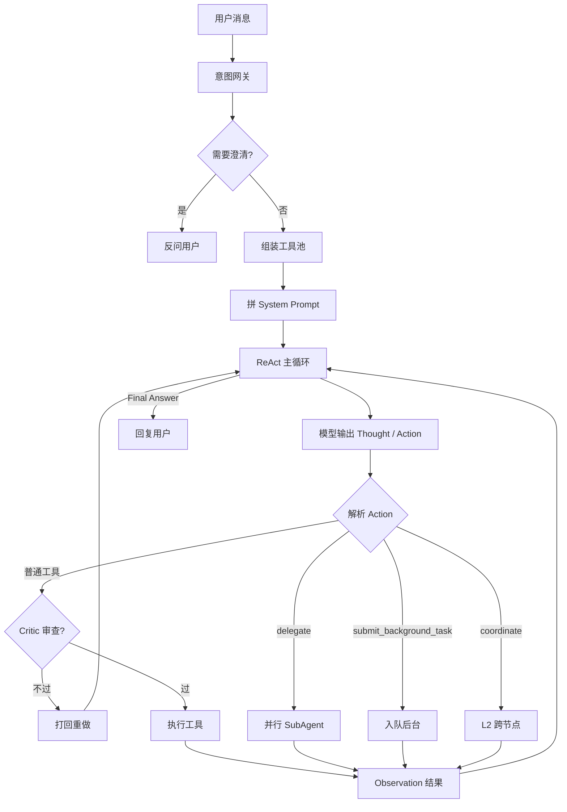
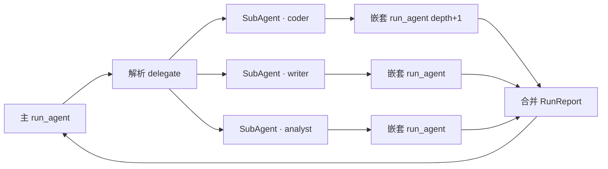
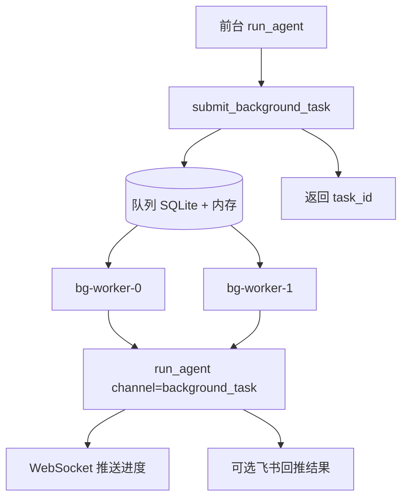
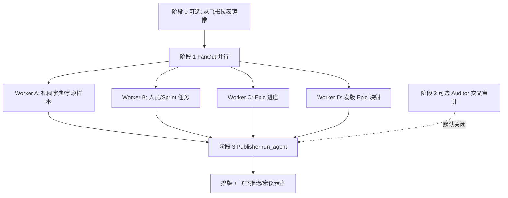
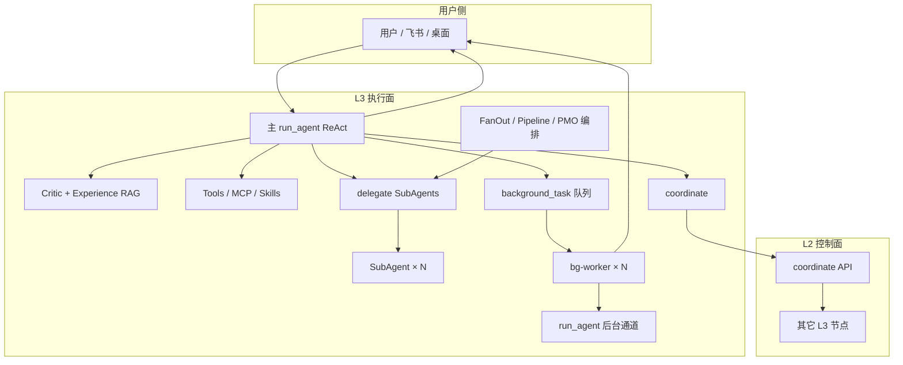

# Jachin 多 Agent 工作模式全景（人话版）

> **写给谁**：想搞懂「Jachin 里到底有几个 Agent、怎么分工、怎么协作、谁管谁」的产品、运维和开发同学。  
> **版本**：2026-06-11  
> **技术 SSOT（偏实现）**：[`MULTI_AGENT_ARCHITECTURE.md`](../MULTI_AGENT_ARCHITECTURE.md)、[`JACHIN_HYBRID_AGENT_ARCHITECTURE.md`](./JACHIN_HYBRID_AGENT_ARCHITECTURE.md)、[`前台闲聊与后台重负荷任务的物理隔离与背压熔断.md`](../前台闲聊与后台重负荷任务的物理隔离与背压熔断.md)

---

## 一、先建立正确的心智模型

很多人听到「多 Agent」，会想象成：**好几个平等的大模型在会议室里互相聊天、各自有独立人格**。Jachin **不是**这种默认形态。

更准确的说法是：

> **Jachin 默认只有一条「主脑」在跟用户对话**——它走 ReAct 循环：想一步 → 调工具或派活 → 看结果 → 再想一步 → 直到给出最终答案。  
> 「多 Agent」指的是：**在同一条技术主线上，按需再开几条子脑**，或者 **把重活丢到后台队列**，或者 **让 L2 控制面把任务分到别的机器上**。

可以把它想成一家公司的运作方式：

| 角色 | 在 Jachin 里对应什么 | 干什么 |
|------|---------------------|--------|
| **前台接待** | 主 `run_agent`（用户会话） | 听懂需求、拆任务、汇总结果、跟用户说话 |
| **专项小组** | `delegate` 派出的 SubAgent | 写代码、做分析、写文档……各干一行 |
| **夜班车间** | `core:submit_background_task` 后台 Worker | 耗时长的活，不堵前台 |
| **外地分公司** | `coordinate` + L2 | 多机集群时跨节点干活 |
| **质检员** | 内联 Critic | 危险操作（尤其数据库）执行前先拦一道 |
| **老师傅笔记** | Experience RAG | 把以前成功过的做法塞进提示词里参考 |

**一句话**：不是「很多 Agent 乱飞」，而是 **「一个主脑 + 多种派活方式 + 几道安全与管理护栏」**。

---

## 二、四大原语：先分清「工具」和「Agent」

Jachin 用四个词划分能力边界（详见 [`FOUR_PRIMITIVES.md`](../FOUR_PRIMITIVES.md)）：

| 原语 | 人话 | 例子 |
|------|------|------|
| **Tools** | 一次就能干完的原子动作 | 读文件、跑 SQL、发 HTTP |
| **MCP** | 外挂进程提供的工具 | 浏览器自动化、Office、飞书 API |
| **Skills** | 说明书 + 人设 + 工具白名单 | PMO 战报 SOP、招聘流程 SKILL.md |
| **Agent Tasks** | **多轮**子运行时 | `delegate`、后台任务、`coordinate` |

**容易踩坑**：MCP 不是 Agent；SubAgent 才是 Agent Task。  
主脑调 MCP = 用工具；主脑 `delegate` = 临时雇一个专员子脑。

---

## 三、主脑的一天：从用户发消息到出结果

下面是一条 **最常见** 的请求路径（聊天 / 飞书 / 桌面控制台，本质相同）：



### 3.1 进门前：意图网关帮主脑「摸情况」

在 ReAct 正式开始前，系统会先做一批 **不用大模型瞎猜** 的准备工作（`intent_gateway`）：

- 用户是不是还在回答上一个澄清问题？
- 有没有大附件需要特殊路由？
- 当前工作区、数据库语义层（`db_semantics.yaml`）是什么？
- 有没有 HR、BI、PMO 等域的 **预检短路**（该走的固定流程直接走）？

你可以理解为：主脑上班前先看了 **值班简报**，而不是白纸一张进场。

### 3.2 主循环里：ReAct 怎么转

每一轮大致是：

1. 大模型输出 **Thought**（在想什么）和 **Action**（要干什么）
2. 宿主解析 Action —— 可能是调工具，也可能是 **派 SubAgent / 交后台 / 走 L2**
3. 若是危险工具（尤其 SQLite 写操作），**Critic 先审**；不过就伪造一条「Observation：你错了，重来」
4. 执行成功 → 把结果写回对话 → 下一轮
5. 直到模型输出 **Final Answer**

默认主会话大约 **8 轮** ReAct 上限（可配置）；子 Agent 更紧，后台任务更松（默认 24 轮）。

### 3.3 三条「增强轨道」（L4，但不是第五个 Agent）

这些 **不单独起进程**，而是挂在主循环上：

| 能力 | 干什么 | 是不是独立 Agent？ |
|------|--------|-------------------|
| **语义层** | 告诉模型数据库/业务字段是什么意思 | 否，是提示词里的业务字典 |
| **Probe → Map → Execute** | 查表结构 → 对齐语义 → 再执行 SQL | 否，是 SOP 流程 |
| **Experience RAG** | 从历史成功案例里捞 1～2 条相似做法 | 否，是 JSONL 检索 + 提示词注入 |
| **Critic** | 执行前再审一遍 SQL/危险操作 | 否，是同轮里多一次轻量 LLM 调用 |

---

## 四、多 Agent 的五种「排兵布阵」方式

Jachin 里「多 Agent」具体落地为 **五种机制**。它们可以单独用，也可以组合（例如 PMO 用 FanOut + 再跑一轮 Publisher）。

### 4.1 `delegate` —— 主脑当场派专员（最常用）

**场景**：一个请求里同时要「写代码 + 写文档 + 做分析」，或者模型自己判断需要分工。

**怎么触发**：主脑在 ReAct 里输出：

```
Action: delegate
Action Input: {"sub_tasks": [
  {"role": "coder", "task": "实现 API"},
  {"role": "writer", "task": "写 README"}
]}
```

**实际发生什么**：



**关键规则（用人话说）**：

- 子 Agent **不能再 delegate**（防止套娃无限嵌套）
- 嵌套深度默认最多 **2 层**
- 一次 parallel delegate 默认最多 **4 个** SubAgent 同时跑（防 API 打爆）
- 每个角色只有 **最小工具集**（coder 能写文件，但默认不能乱发邮件、乱调外网 MCP）
- 部分子任务失败 → **不会全盘作废**，会出结构化摘要告诉主脑「3 成 1 败」

**内置角色一览**（`role` 字段）：

| 角色 | 擅长 | 典型活 |
|------|------|--------|
| `coder` | 写改代码 | 功能、Bugfix（会自动切编码模型） |
| `writer` | 文档 | README、报告 |
| `researcher` | 调研 | 竞品、资料搜集 |
| `analyst` | 数据分析 | 报表、指标解读 |
| `planner` | 拆任务 | 方案、里程碑 |
| `verification` | **对抗性验证** | 跑测试/构建/curl 证明交付物是否 work；**必须**输出 `VERDICT: PASS/FAIL/PARTIAL` |
| `reviewer` | 审查 | Code Review、静态检查（偏代码质量，非对抗性验收） |
| `summarizer` | 摘要 | 长文提炼 |
| `data_processor` | 洗数据 | CSV/JSON 转换 |
| `tester` | 测试 | 用例、测试报告 |
| `critic` / `executor` / `domain_expert` | 专向场景 | 讨论模式、领域任务 |
| `default` | 通用 | 其它 |

还可以传 **自定义 role 字典**（带 `system_prefix`、`allowed_tools`），PMO Worker 就是这种模式。

#### 讨论模式（`mode: discuss`）

除了默认的 **并行各干各**，还有 **开会式** 协作：

- 第一轮：planner + critic **并行**出方案
- 后续轮：按轮修订
- 可选 summarizer 收尾
- 结果作为 Observation 还给主脑

适合「方案要先吵清楚再动手」的场景，而不是 silently 各写各的。

---

### 4.2 `core:submit_background_task` —— 扔给夜班（前台不堵）

**场景**：统合冒烟、大批量分析、PMO 全量战报、招聘批处理等 **可能要跑几十分钟** 的活。

**怎么触发**：主脑在 ReAct 里调用工具 `core:submit_background_task`，立刻拿到 `task_id`，前台可以先回复用户「已提交，稍后通知」。



**和前台的区别**：

| 维度 | 前台主会话 | 后台 Worker |
|------|-----------|-------------|
| 用户等待 | 同步等 | 异步，先拿 task_id |
| ReAct 轮次 | 默认 ~8 | 默认 ~24 |
| 能否 delegate/coordinate | 可以 | **不可以**（防套娃） |
| 工具超时 | 默认 5 秒同步 cap | 豁免，可跑长任务 |
| 队列满了 | — | 直接拒绝，提示 resource_exhausted |

**管理细节**：

- 默认 **3** 个 Worker 并发，队列深度 **32**
- 进程崩溃 → 启动时把「跑一半」的任务标为 `interrupted`，写 zombie 清单，用户可用 `core:check_interrupted_tasks` 查看
- 优雅停机 → 队列里还没被取走的 job 写回 SQLite

这就是文档 [`前台闲聊与后台重负荷任务的物理隔离与背压熔断.md`](../前台闲聊与后台重负荷任务的物理隔离与背压熔断.md) 的核心：**聊天归聊天，重活归重活，队列满就诚实拒绝，别拖死前台**。

---

### 4.3 `coordinate` —— 多机集群时的「总公司派单」

**场景**：企业内网多台 Jachin 节点（多个 L3），任务要按技能标签分到不同机器。

**流程简述**：

1. 主 L3 把 intent + sub_tasks POST 给 **L2**
2. L2 按 `skill_required` 等指标派给合适节点
3. 各节点本地 `run_agent` 或 `run_tool` 执行
4. 主 L3 轮询聚合结果（默认最长等约 120 秒）

**单节点部署**时也会走这套协议，只是子任务还是分给 **本机自己**——架构统一，方便以后扩集群。

**注意**：后台 Worker **不能** coordinate；子 Agent 通道也有额外限制。

---

### 4.4 FanOut / Pipeline —— 代码编排（不等大模型说 delegate）

有时 **宿主代码** 已经知道要并行或分阶段，不必等 LLM 输出 `Action: delegate`：

| 机制 | 像什么 | 适用 |
|------|--------|------|
| **FanOut** | 流水线旁开多条并行工位 | 10 份简历同时初筛、多数据源并行查 |
| **Pipeline** | 装配线上一站接一站 | 先 planner → 再 coder → 再 reviewer |

**FanOut 特点**：一项失败，其它继续；最后出 `FanoutResult`（ok_count / failed_items）。

**Pipeline 特点**：上一站输出自动塞进下一站 `context_data`（截断约 3000 字）；默认 **一站失败全线停**，并出 ExecutionBrief 告诉人该怎么介入。

代码入口：`l3_node/primitives/multi_agent/fanout.py`、`pipeline.py`。

---

### 4.5 领域专用编排 —— 以 PMO 为例

PMO 战报是 Jachin 多 Agent **最完整的产品级样例**（`l3_node/pmo_multi_agent_orchestrator.py`）：



**分工逻辑（人话）**：

- **Worker A～D**：像四个 **只负责查数、吐 JSON** 的数据专员；工具白名单极窄（ mostly `core:db_query` 和少量 PMO 原生工具）
- **宿主预取**：B/C/D 很多数据主进程先查好塞进 context，避免四个 Worker 重复跑同一 SQL
- **Publisher**：单独一轮 Agent，只负责 **排版 + 推送**，工具锁在发报相关能力上
- **Auditor**（可选）：Verification Agent 对抗性交叉审计；默认关（`PMO_ENABLE_VERIFICATION_AUDIT=1` 开启），须输出 VERDICT

这和通用 `delegate` 的差别在于：**编排写在 Python 里，步骤、SQL 编号、产物 JSON 格式都是 SSOT**，不靠模型即兴发挥。

---

## 五、协作时「信息怎么传」

多 Agent 最难的是 **上下文别丢、别串、别重复劳动**。Jachin 主要用这些办法：

| 机制 | 传什么 | 典型场景 |
|------|--------|----------|
| **delegate `context_data`** | 结构化片段拼进子任务 | 把 CSV 片段、表名交给 analyst |
| **Pipeline 自动传递** | 上一阶段输出 → 下一阶段输入 | 方案 → 代码 → 审查 |
| **PMO 宿主 bootstrap** | 预查 personnel/epics 注入 Worker | 避免 B/C 重复查库 |
| **会话缓冲** | 最近 ~30 条消息写回 session | 用户多轮对话连贯 |
| **SubAgent registry** | 同一 `sub_agent_id` 保留历史 messages | 同一专员连续改稿 |
| **Memory Nexus（Chroma）** | 跨会话向量记忆 | `core:local_memory_search`、`recall_memory` |
| **Experience JSONL** | 成功 SQL/工具调用模式 | 下轮类似问题软参考 |
| **task_plan.md / progress.md** | 工作区计划文件 | 长任务强制先写计划（可配置） |
| **DAG handoff** | 跨进程恢复工作流节点 | 集群化演进中 |

**记忆分工（简化）**：

- **Memory Nexus**：「这个用户/组织以前聊过什么、沉淀过什么知识」
- **Experience RAG**：「这类技术操作以前怎么成功的」—— 更偏 **操作范式**，不是聊天历史
- **工作区文件**：「这个任务本身的计划与进度」—— 给人也给人看

---

## 六、谁用什么模型？—— 三档路由

不是每个 Agent 都用同一个模型。`_react_engine_for_iteration` 会 **按轮次动态换引擎**：

| 档位 | 默认模型 | 什么时候用 |
|------|----------|------------|
| **日常** | qwen3.5-plus | 默认主路径 |
| **复杂** | qwen-max | 子 Agent、ReAct 后期、工具特别多、用户消息很长、strict/planned 模式 |
| **编码** | qwen3-coder-plus | 刚写过文件/补丁，或编程意图明显 |
| **视觉** | 多模态模型 | 用户消息带图片 |

子 Agent（`delegate_depth > 0`）会 **自动倾向复杂档**，因为子任务通常更专、更难。

环境变量：`LLM_MODEL`、`LLM_COMPLEX_MODEL`、`LLM_CODER_MODEL`；关闭复杂自动路由：`JACHIN_LLM_COMPLEX_DISABLE=1`。

---

## 七、怎么「管」—— 生命周期、限额与韧性

### 7.1 限额一览（默认值，可在 `~/.jachin/nexus_config.json` 改）

| 控制项 | 默认值 | 目的 |
|--------|--------|------|
| 主会话 ReAct 轮次 | 8 | 防前台无限烧 Token |
| 子 Agent ReAct 轮次 | 3 | 子任务要短平快 |
| 后台任务 ReAct 轮次 | 24 | 长任务够用 |
| delegate 最大深度 | 2 | 防 delegate 套 delegate |
| delegate 最大并发 | 4 | 防 API Rate Limit |
| 后台 Worker 数 | 3 | 与 CPU/API 配额平衡 |
| 后台队列长度 | 32 | 背压 |
| 前台工具同步超时 | 5 秒 | 防一个慢 MCP 卡死聊天 |
| 子 Agent Token 预算 | ~190k | 防单个子脑爆 context |

**豁免通道**：`background_task`、`delegate_sub_agent` 不受前台 5 秒工具超时限制。

### 7.2 规划门禁（可选，偏「严谨模式」）

配置 `intelligence_b.force_task_plan_file` 等开关后，主脑在 **没写 `task_plan.md` 之前**，可能被禁止：

- delegate
- coordinate
- 提交后台任务
- 写文件类工具

意图是：**大活先写计划，再动手**。HR 等域可以有话术豁免。

### 7.3 执行韧性（部分失败怎么办）

Jachin 要求多 Agent 路径遵守 [`JACHIN_EXECUTION_RESILIENCE_CONTRACT.md`](../JACHIN_EXECUTION_RESILIENCE_CONTRACT.md)，人话版：

1. **单点失败不默认拖死全家** —— 10 个子任务挂 1 个，其余结果仍交付
2. **重试有上限，然后换策略或出 Brief** —— 别同参无限重试
3. **RunReport 说人话** —— 「3/4 成功，1 失败」，附失败原因
4. **Critic 挂了默认放行**（fail-open）—— 但会打 Warning，避免审查服务挂掉导致全线停摆

### 7.4 可观测性

- 日志里搜：`[delegate RunReport]`、`[FanOut RunReport]`、`[Pipeline]`、`[StrategyShift]`、`[ExecutionBrief]`
- 后台任务：WebSocket `subscribe_background_tasks`、`.background_tasks/tasks_index.jsonl`
- 桌面控制台：统合冒烟、后台任务状态面板

---

## 八、和其它「编排层」怎么配合

Jachin 还有 **长期三层编排**（[`ORCHESTRATION_ARCHITECTURE.md`](../ORCHESTRATION_ARCHITECTURE.md)），和多 Agent  **正交**：

| 层 | 干什么 | 例子 |
|----|--------|------|
| **L1 技能路由** | 上万 Skill 里先圈小候选集 | `suggest_skills_from_intent` |
| **L2 领域子图** | 强状态机业务 | 招聘 `hr_recruitment_dag` |
| **L3 YAML 胶水** | 跨域串工具链 | `core:workflow_run`、`domain_ref` |

**重要**：招聘 DAG **没有被** YAML/delegate 替换；HR 仍是独立状态机，只是多了统一注册/调用入口。

另外：

- **定时任务**（`util:schedule_task` / `deferred_task_scheduler`）到点 → 往往 **提交后台 Agent Task**
- **生物钟 cron_thinker**（发版公告 → 次日冒烟）→ 子进程跑统合冒烟，不是另起一个 Agent 人格
- **MCP Pull delegate**（L2 Redis 队列）→ 跨进程执行 MCP，和 SubAgent 不同层

---

## 九、一图总览：Jachin 多 Agent 全景



---

## 十、和「理想架构」还差什么（诚实说明）

读代码和文档时要心里有数：**有些能力是「方向已定、细节还在打磨」**：

| 话题 | 现状 | 备注 |
|------|------|------|
| Skill 加载 | 工具列表仍偏「枚举进 prompt」 | 目标态是统一 `use_skill` 按需加载 |
| 后台优先级 | `priority` 字段已有 | 队列目前仍偏 FIFO |
| 前台 5 秒超时 | 超时不会杀线程 | 极慢工具仍可能占线程池 |
| 集群 DAG | HTTP handoff 已有 | 中心化 L2 协调器仍在演进 |
| Experience 路径 | 代码默认在 workspace 下 JSONL | 与部分文档路径表述略有出入 |

这些 **不影响** 理解主流程，但解释「为什么偶尔和文档一字不差对不上」。

---

## 十一、快速对照表：我该用哪种多 Agent？

| 你的需求 | 推荐机制 |
|----------|----------|
| 聊天里临时拆几个专活（写码+写文档） | 主脑 `delegate` |
| 要吵架式定方案 | `delegate` + `mode: discuss` |
| 跑 30 分钟、用户不能干等 | `core:submit_background_task` |
| 10 份同质文档并行分析 | 代码 `fanout_parallel` |
| 严格阶段依赖（先规划后实现后审查） | 代码 `run_pipeline` |
| 多台 Jachin 机器分工 | `coordinate` |
| 固定 SOP、要强约束产物格式 | 领域编排（如 PMO orchestrator） |
| 招聘全链路 | `hr_recruitment` 领域 DAG（不是 generic delegate） |

---

## 十二、相关文档与代码入口

| 想了解… | 去看… |
|---------|--------|
| 机制全景与 RunReport | [`MULTI_AGENT_ARCHITECTURE.md`](../MULTI_AGENT_ARCHITECTURE.md) |
| 单主轴 + Critic + 经验飞轮 | [`JACHIN_HYBRID_AGENT_ARCHITECTURE.md`](./JACHIN_HYBRID_AGENT_ARCHITECTURE.md) |
| 前台/后台隔离与队列 | [`前台闲聊与后台重负荷任务的物理隔离与背压熔断.md`](../前台闲聊与后台重负荷任务的物理隔离与背压熔断.md) |
| 四大原语术语 | [`FOUR_PRIMITIVES.md`](../FOUR_PRIMITIVES.md) |
| 执行韧性契约 | [`JACHIN_EXECUTION_RESILIENCE_CONTRACT.md`](../JACHIN_EXECUTION_RESILIENCE_CONTRACT.md) |
| 长期 L1/L2/L3 编排 | [`ORCHESTRATION_ARCHITECTURE.md`](../ORCHESTRATION_ARCHITECTURE.md) |
| PMO 多 Worker 规格 | [`PMO_WORKER_B_SPEC.md`](./PMO_WORKER_B_SPEC.md) 等 |

| 代码锚点 | 文件 |
|----------|------|
| 主 ReAct + delegate + SubAgent | `l3_node/agent_core.py` |
| 后台队列 | `l3_node/primitives/agent_tasks/background_task_service.py` |
| FanOut / Pipeline / Discussion | `l3_node/primitives/multi_agent/` |
| PMO 三阶段编排 | `l3_node/pmo_multi_agent_orchestrator.py` |
| 工具池组装 | `l3_node/primitives/tools/tool_pool.py` |
| 内联 Critic | `l3_node/critic_agent.py` |
| 经验 RAG | `l3_node/experience_memory.py` |

---

## 十三、总结（给忙人看的三句话）

1. **Jachin 默认是一个跟用户对话的主脑**；多 Agent = 同进程子脑、后台队列、或 L2 跨机，不是一群平等 Bot 互聊。  
2. **分工靠 role + 工具白名单 + 编排代码**；协作靠 context 传递、RunReport 合并、记忆与经验飞轮；**管理靠深度/并发/队列/超时/背压**。  
3. **产品级样板看 PMO**：FanOut 并行搬砖 → Publisher 统一发报；通用聊天看 `delegate` + 后台任务。

若你接下来要 **改某一域的多 Agent 行为**，先说清楚是「模型自己 delegate」还是「宿主代码 fanout/pipeline」，再动刀——两条路的约束和调试方式完全不同。

---

## 十四、对比 Claude Code 的多 Agent 设计，Jachin 能借鉴什么？

> 本节基于 Claude Code 的多 Agent 协作机制说明（见用户提供的原文），对比 Jachin 现有架构，分析差异、找出真正有价值的借鉴点，以及什么东西不适合照搬。

---

### 14.1 先做一个「逐项对照」

看 Claude Code 和 Jachin，两套系统其实有很多**相似的底层逻辑**，只是具体做法和侧重点不同：

| 维度 | Claude Code 怎么做 | Jachin 怎么做 | 差距大吗？ |
|------|-------------------|---------------|-----------|
| 多 Agent 触发 | LLM 输出 `Agent(...)` 工具调用 | LLM 输出 `Action: delegate` | 几乎等价，形式不同 |
| 子 Agent 角色 | `subagent_type`（general/explore/plan/verification/worker…） | `role`（coder/analyst/reviewer/planner…） | 类似，但 Jachin 少几个专门化类型 |
| 只读 Agent | Explore/Plan **硬隔离工具层** | 无专门「只读 SubAgent」类型，只有工具白名单 | **有差距**，Jachin 缺工具层硬隔离 |
| 验证 Agent | `verification` 必须出 PASS/FAIL/PARTIAL，被设计成「尽量搞砸」 | `reviewer` 角色存在但没有强制对抗性 | **有差距**，验证设计不够强 |
| 后台异步 | `run_in_background: true`，禁止轮询 | `core:submit_background_task`，WebSocket 推送 | 基本等价 |
| 任务清单 | `TaskCreate/TaskUpdate`，磁盘持久化，支持认领与依赖 | `TodoWrite`（本会话），或 `task_plan.md`（工作区文件） | **有差距**，Jachin 缺多 Agent 共享任务板 |
| Agent 通信 | `SendMessage` 显式 ID/名字，有全员广播 | 无，子 Agent 通过 Observation 汇报，无侧信道 | **有差距**，Jachin 里 Agent 之间不互发消息 |
| 协调员角色 | 专职 Coordinator 不亲自动手，只综合+派单 | 无内置「只编排、不执行」的专用 Agent 身份 | **有差距** |
| 团队蜂群 | `TeamCreate`，多具名 Agent 并行，共享任务板 | FanOut + delegate，但没有持久化「团队」概念 | **有差距** |
| Synthesis 义务 | 文档反复强调：主脑/协调员必须自己读懂结果再写 spec | 没有明文规定，Observation 直接喂给主模型下一轮 | 理念一致，但 Jachin 没有结构化约束 |
| 上下文继承 | Fork 模式继承完整历史，普通 spawn 零上下文 | delegate 可传 `context_data`，但无 Fork 机制 | 部分差距 |
| 队友之间通信 | `SendMessage` 点对点，Lead 自动收摘要 | 无侧信道，子 Agent 不互发消息 | 有差距，但要想清楚是否真的需要 |

---

### 14.2 哪些差距是真正值得借鉴的？

不是所有差距都要补，有些是 Claude Code 针对其产品形态（IDE 里的开发助手）的特化，Jachin 面向企业 PMO/HR/BI/飞书集成，场景不一样。下面区分**值得学**和**不适合照搬**的。

---

#### ✅ 借鉴点一：Verification Agent 要设计成「对抗性挑剔者」，不是走过场

**Claude Code 怎么做**：`verification` 类型的 Agent 系统提示里明确写「你的任务是证明实现**不能**工作，尽量找漏洞；最后必须出 VERDICT: PASS / FAIL / PARTIAL；不允许不跑就出 PASS」。

**Jachin 现状**：有 `reviewer` 角色，但没有这种强制对抗性的设计约束。PMO Auditor 默认还是关闭的。

**怎么借鉴**：

- 对**任何产品级输出**（PMO 战报、招聘分析报告、代码生成），都应该有一个专门的「挑刺轮」，而不是只让 Publisher 自己检查自己。
- 核心改变是**提示词设计**：把 reviewer 的任务描述从「审查正确性」改成「尽力找出错误、不确定、数据异常，直到找不到才出 PASS」。
- 在现有 PMO 三阶段基础上，可以把阶段二的 Auditor **升级为强制对抗审查**，而不是默认关闭的可选步骤。
- **注意**：这不需要改架构，只需改提示词和角色定义，成本低。

---

#### ✅ 借鉴点二：给「只读 Agent」在工具层做硬隔离，不依赖提示词约束

**Claude Code 怎么做**：Explore、Plan 类型的 Agent，在工具层**物理禁止**写文件、改 git、磁盘写入，不只靠提示词说「不要改文件」。

**Jachin 现状**：有工具白名单机制（`allowed_tools` / `SUB_AGENT_ALLOWED_SKILLS`），但没有明确的「只读 SubAgent 类型」，每次都要在 delegate 的 `role` 里手写工具列表。

**怎么借鉴**：

- 定义几个**内置只读角色**，例如 `readonly_analyst`、`readonly_researcher`，在角色定义里**强制排除**所有写类工具（`fs_write`、`apply_patch`、`shell_exec` 写模式等）。
- 把「只查不改」的承诺从提示词层下沉到工具池组装层——`assemble_tool_pool` 时，如果 channel 是 `readonly_*`，直接过滤掉所有写工具。
- 现有的 PMO Worker A/B/C/D 其实就是这个模式的雏形（工具白名单极窄），可以把这个模式抽象成通用机制。

---

#### ✅ 借鉴点三：Synthesis 义务要显式化，防止「甩锅式」任务描述

**Claude Code 怎么做**：协调员模式有明文规定——「Agent 报了研究结果后，**协调员必须自己读懂**，再写出带文件路径、行号、具体操作的 spec 给 worker，禁止写『根据你的发现去修』这种话」。

**Jachin 现状**：主脑收到 SubAgent 的 Observation 后，下一轮提示词里没有显式要求「先综合、再派活」，模型可能直接基于上轮结果继续 delegate，导致任务描述越来越模糊。

**怎么借鉴**：

- 在 delegate 结果被写回 Observation 后，系统提示词里可以加一条 **SOP 约束**：「若你收到多个 SubAgent 的汇报结果，在下一次 delegate 前，必须先输出一段 `[Synthesis]` 总结，包含具体路径、数据或行号，再派新 SubAgent」。
- 这不需要改任何代码，**只需改 System Prompt 里的 ReAct 格式约束**。
- 效果：主模型不会把一堆 SubAgent 报告原封不动塞给下一个 SubAgent，降低因上下文传递失真导致的幻觉。

---

#### ✅ 借鉴点四：协调员角色——让主脑可以「只编排、不执行」

**Claude Code 怎么做**：`CLAUDE_CODE_COORDINATOR_MODE=1` 时，主会话变成专职协调员，系统提示明确写「你不亲自写代码，只负责拆任务、派活、综合结果、跟用户汇报」。

**Jachin 现状**：没有内置的「只编排」身份。主脑同时承担「理解用户意图 + 拆任务 + 执行工具 + 汇报」所有职责，容易角色混乱——一会儿自己写 SQL，一会儿 delegate，逻辑不清晰。

**怎么借鉴**：

- 对于**复杂的多阶段任务**（比如「整体复盘整个项目进度并生成报告」），可以在 System Prompt 里注入一个**临时编排人格**：「本任务你是编排者，不直接调用数据工具，只负责拆子任务、接收 SubAgent 汇报、综合后给用户结论」。
- 这个开关可以通过 `nexus_config.json` 里加一个 `agent.orchestrator_mode_for_complex_tasks` 来控制，当用户意图被分类为「宏观分析/全局编排」时自动注入。
- PMO 多 Agent Orchestrator 其实已经是这个思路的代码实现——**可以把它的编排逻辑提炼成可复用的通用编排人格，不要只有 PMO 域能用**。

---

#### ✅ 借鉴点五：任务板（Task List）要持久化且多 Agent 可共享

**Claude Code 怎么做**：`TaskCreate/TaskUpdate` 存在磁盘（`~/.claude/tasks/{team}/`），多个 Agent 都能读写，支持依赖关系（`blockedBy`/`blocks`），支持认领（设 owner），支持状态流转（pending → in_progress → completed）。

**Jachin 现状**：
- `TodoWrite` 是单会话内存级，不能跨 Agent 共享。
- `task_plan.md` / `progress.md` 是工作区文件，可以持久化，但没有结构化的 owner / blockedBy 语义，需要模型自己解析 Markdown。
- 后台任务的 `tasks_index.jsonl` 是任务日志，不是多 Agent 协同的任务板。

**怎么借鉴**：

- **轻量版**（成本低）：在 `task_plan.md` 里约定一个结构化格式（YAML front-matter 或 Markdown 表格），明确包含 `owner`、`status`、`depends_on` 字段，让各个 SubAgent 按格式读写这一文件，主脑在 Synthesis 时也按格式更新进度。这不需要改代码，只需制定写作规范。
- **完整版**（成本高，适合未来）：在 `background_task_service` 旁边实现一套轻量的结构化任务板（SQLite 一张表），支持多 Agent 通过工具 `core:task_claim` / `core:task_update` 认领和更新任务，主脑通过 `core:task_board` 查看全局进度。
- **现在可以做的**：先把 `task_plan.md` 的格式标准化，在 System Prompt 里约定 `[Task Owner]`、`[Task Status]` 的写法，测试 PMO / HR 的 FanOut 场景能否自然接入。

---

#### ✅ 借鉴点六：「idle = 等待」的心智模型，以及后台 Agent 的通知协议

**Claude Code 怎么做**：队友完成一轮工作后会进入 idle，这是正常状态，不是 bug；Lead 收到 idle 通知后决定是继续派任务还是收工；明确禁止 Lead 轮询队友的进度。

**Jachin 现状**：后台任务通过 WebSocket 推进度事件，设计理念一致。但**前台 delegate 没有 idle 的概念**——SubAgent 要么跑完，要么出错，没有「我做完这一步了，等你决定下一步」的中间状态。

**怎么借鉴**：

- 对于**交互式 Pipeline**（例如用户要在每个阶段确认才能继续），可以给 SubAgent 增加一个「阶段完成，等待指令」的返回信号，主脑收到后可以先给用户看中间结果再决定是否继续。
- 这在 Jachin 的 Pipeline 里可以通过 `PipelineStage` 增加 `pause_for_user_confirm` 标志来实现——阶段结束后把结果推给用户，等用户确认再继续下一阶段。

---

### 14.3 哪些东西不适合照搬？

有些 Claude Code 的设计是针对其特定场景（VSCode IDE 里的开发助手），Jachin 照搬会南辕北辙：

**❌ 团队蜂群（TeamCreate + 多具名队友）**

Claude Code 的团队模式很酷，但它假设一个前提：用户在 IDE 里盯着，能看到多个 Terminal 分屏，能理解「前端 Agent 在干 A，后端 Agent 在干 B」。  
Jachin 的用户场景是**飞书聊天机器人**或**企业控制台**，用户不盯屏，他们只想收到最终结果。在飞书里「多个 Agent 并行干活、相互发消息」不会让用户觉得透明，只会让他们困惑「我到底在和谁说话」。  
**结论**：队友通信机制本身不适合照搬；但背后的「共享任务板 + 角色认领」思路是值得借鉴的（参见借鉴点五）。

**❌ Fork 机制（继承完整对话上下文）**

Fork 是 Claude Code 为 IDE 场景设计的捷径：主会话已经和用户聊了很久，Fork 出去的子 Agent 不用重新 briefing，继承历史。  
Jachin 的 SubAgent 是 `run_agent` 的嵌套调用，上下文是结构化传递的（`context_data`），而不是把几百条聊天记录整个塞进去。前者更精准，后者传输成本高、容易带入噪音。  
**结论**：Jachin 的精准 `context_data` 传递比 Fork 更适合企业场景，不需要改成 Fork 模式。

**❌ 队友之间互发消息（`SendMessage` 多 Agent 侧信道）**

让 Agent A 给 Agent B 发消息，Agent B 可以修改方案后再给 Agent C——这是一种**点对点协商**机制，适合「一起写一个复杂程序」的场景。  
Jachin 的 PMO / HR 场景是**数据驱动的单向流水线**：查数据 → 整合 → 发报。没有「我觉得这个方案不对，让我们商量一下」的需求。强行引入侧信道会让可观测性变差，调 bug 极难。  
**结论**：暂不借鉴。如果未来出现「两个 Agent 需要协商方案」的场景（如设计评审），可以用现有的 `discuss` 模式（让模型轮流发言），而不是引入新的消息协议。

**❌ 把工具权限管理挪到「Agent 类型名」上**

Claude Code 用 `subagent_type` 隐式决定工具权限（例如 Explore 类型 → 自动只读）。  
Jachin 现在是显式白名单（`allowed_tools`），这其实**更灵活也更可审计**，因为你能在代码里直接看到每个 Worker 被允许用哪些工具，而不需要去查某个类型名背后藏了什么。  
**结论**：不要废弃现有的显式白名单机制，但可以在上面**封装几个命名良好的预设类型**（只读研究型、只写执行型等），让开发者不需要每次手写工具列表。

---

### 14.4 总结：Jachin 的多 Agent 进化路线图（按优先级排）

根据以上分析，按「改动成本低、收益大」到「改动成本高」排序：

| 优先级 | 借鉴点 | 怎么做 | 改动范围 |
|--------|--------|--------|----------|
| 🔴 **高** | Verification 对抗性设计 | 改 reviewer 角色的提示词，要求出 PASS/FAIL/PARTIAL | 提示词，无需改代码 |
| 🔴 **高** | Synthesis 义务显式化 | System Prompt 里加约束：多个 SubAgent 汇报后必须先 `[Synthesis]` | 提示词，无需改代码 |
| 🟡 **中** | 只读角色工具层硬隔离 | 在 `assemble_tool_pool` 里，对 `readonly_*` channel 强制过滤写工具 | `tool_pool.py` + 角色定义 |
| 🟡 **中** | 协调员人格注入 | 复杂宏观任务时注入「只编排、不执行」的 system prompt 段落 | System Prompt 组装逻辑 |
| 🟡 **中** | `task_plan.md` 格式标准化 | 约定包含 owner/status/depends_on 的结构化字段 | 文档规范 + 提示词 |
| 🟢 **低** | Pipeline 中间确认机制 | `PipelineStage` 增加 `pause_for_user_confirm` 标志 | `pipeline.py` |
| 🟢 **低** | 结构化任务板工具 | `core:task_claim` / `core:task_board` 等工具 | 新增工具，不影响主流程 |

---

**一句话结语**：Claude Code 和 Jachin 的多 Agent 架构底层逻辑高度相似，不是「你对我错」的关系，而是各自针对不同场景做了取舍。Jachin 最值得借鉴的不是「加更多 Agent 类型」，而是**把已有机制的约束做得更硬**——验证更对抗、综合更显式、只读更彻底。这三件事都不需要大改架构，改提示词和工具白名单就能见效。
