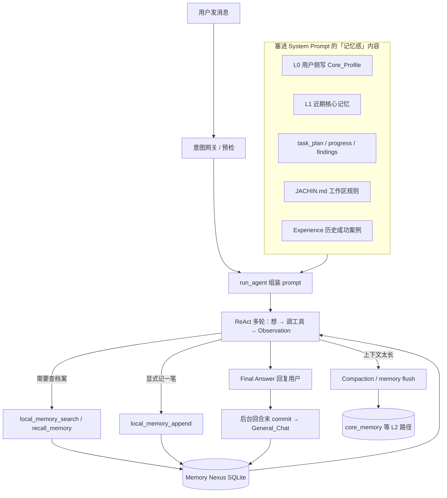

# Jachin 记忆模块 — 人话指南

> **写给谁看**：产品、运维、新同学，或任何想搞懂「Jachin 到底怎么记住东西」的人。  
> **技术细节 SSOT** 仍见 [`JACHIN_MEMORY_ARCHITECTURE.md`](./JACHIN_MEMORY_ARCHITECTURE.md)、[`MEMORY_NEXUS_L3.md`](./MEMORY_NEXUS_L3.md)。

---

## 1. 一句话先说清楚

**Jachin 的记忆不是「一个大文件夹里塞所有聊天记录」，而是好几条分工明确的管道：有的负责「这次对话里能看见什么」，有的负责「下次还能想起来」，有的负责「长任务写到磁盘上续上」。**

你可以把它想成：**短期工作台 + 长期档案柜 + 任务笔记本 +（可选）边缘侧的「睡觉整理」**。

---

## 2. 先分清两件最容易混的事

| 概念 | 人话 | 典型例子 |
|------|------|----------|
| **上下文（Context）** | 这一轮对话里，模型**眼前**能看到的文字，受 token 预算限制 | 最近 30 条消息、工具返回的 Observation、从 workspace 预取的一小段 md |
| **记忆（Memory）** | **跨轮、跨会话**仍保留的信息，需要时再**挑着**塞进 prompt 或让模型主动查 | 「用户偏好用 Python」「上周巡检发现磁盘告警」 |

**关键直觉**：

- 上下文满了会被 **Compaction（压缩折叠）** —— 相当于把桌上摊开的资料收成摘要，**不是**把档案柜里的文件删掉。
- 记忆是 **落盘的**，下次开新会话还能用；但也不会把全部记忆一次性塞给模型（太贵、太吵），而是 **按需唤醒 + 按需搜索**。

---

## 3. 主角：Memory Nexus（记忆宫殿）

这是 **L3 桌面/边缘 Agent 跨会话记忆的默认主路径**。今天你在 Jachin 里聊过的、系统学到的、巡检记录的，**主要都进这里**。

### 3.1 它存在哪？

- 本地一个 SQLite 文件：`~/.jachin/palace_db/memory_nexus.sqlite3`
- **不需要**单独起一个向量数据库服务，**不需要**把记忆同步到 L2 才能用（单机闭环）
- 每条记忆会算一个 embedding（本地 FastEmbed），用来 **按意思搜**，不是只能按关键词搜

### 3.2 为什么叫「宫殿」？Wing → Room → Drawer

这是给记忆 **分房间、贴标签** 的方式，方便「该从哪抽屉拿东西」：

```
记忆宫殿 (MemPalace)
├── Wing（翼区 / 大类）
│   ├── Room（房间 / 子类）
│   │   └── Drawer（抽屉 / 一条具体记忆，原文 + 时间 + 元数据）
```

**常见翼区（举例）**：

| Wing | Room | 大致放什么 |
|------|------|------------|
| `User_Persona` | `Core_Profile` | 用户画像、长期偏好（**L0**，最重要的一条侧写） |
| `User_Persona` | `General_Chat` | 近期聊天里值得留下的摘要 |
| `User_Persona` | `Learned_Skills` | 学会的事实、偏好、技能相关结论 |
| `E2E_Monitors` | `Kalaroko_Default` | 系统巡检、监控类摘要 |
| `System_Core` | `Skill_Matrix` | 技能/工具矩阵（供动态工具检索） |

规范上还在演进 **五类 Wing 语义**（Episodes / Knowledge / Procedures / Core / Inbox），带「半衰期」概念 —— 意思是：**不同种类的记忆，默认「多久不碰就相对不那么重要」**，见 `wing_registry.py`。

**人话**：不是把所有话堆在一个 `history.txt`，而是 **分抽屉存，取的时候知道去哪个区找**。

---

## 4. 记忆怎么「用」？两条路：被动唤醒 vs 主动搜索

### 4.1 被动唤醒 —— 开聊时自动塞一点「近期核心记忆」

每次 Agent 组装 system prompt 时，会从固定抽屉 **拉最近几条**，拼成一块：

> **【系统近期核心记忆】**  
> - [系统巡检 …] …  
> - [用户交互 …] …

这叫 **L1 唤醒栈**。另外还有 **L0**：从 `User_Persona/Core_Profile` 取 **最新一条** 用户侧写，放在更靠前的位置。

**设计意图**：

- 让模型 **一开口就知道「最近发生过什么」**，不用用户每次重复背景
- 只塞 **少量、高信号** 的条目，避免 prompt 爆炸
- 读记忆 **有超时、可关闭**；失败了 **不打断对话**（fail-open：没记忆也能聊）

### 4.2 主动搜索 —— 模型觉得不够时自己查

模型在 ReAct 循环里可以：

- 调工具 **`core:local_memory_search`**（语义搜索全库或某 Wing）
- 或写 **`Action: recall_memory`**（和上面是 **同一条后端**，只是写法不同）

搜出来的结果作为 **Observation** 进上下文，**不是**写进 system 永久块。

**人话**：L1 像「开机自动弹出的最近事项」；search/recall 像「自己去档案柜翻箱倒柜查资料」。

---

## 5. 记忆怎么「写」？谁在什么时候落盘？

| 时机 | 做什么 | 人话 |
|------|--------|------|
| **回合结束（异步）** | `schedule_nexus_turn_commit_async` | 聊完一轮，若内容够「有信息量」，**后台悄悄**写一条到 `User_Persona/General_Chat`，不挡用户 |
| **显式工具写入** | `core:local_memory_append` | 模型或业务逻辑 **主动记一笔**（默认进 `Learned_Skills`） |
| **封装 API** | `add_local_memory` | 代码里写「用户画像/学会的东西」的便捷入口 |
| **Compaction 前刷新（L2 路径）** | memory flush | 对话太长快装不下时，**先让模型把该留的写进 core_memory**，再压上下文 |
| **任务 checkpoint** | 可选写入 Nexus | 长任务压缩后，把 findings 等摘要 **也可** 进记忆库（进化自旧 JSON checkpoint） |

**重要原则**：

- **写入失败只打日志，不拖死主对话**（和「读记忆 fail-open」对称）
- **不是每句废话都记** —— 回合末 commit 有长度等启发式，避免档案柜被垃圾塞满

---

## 6. 和 Memory Nexus 并列的其它「记得住」的东西

这些 **不是** Nexus 替代品，而是 **各管一摊**：

### 6.1 工作区规划文件（任务笔记本）

路径在 `~/.jachin/workspace/`：

- `task_plan.md` — 这任务打算怎么做  
- `progress.md` — 做到哪了  
- `findings.md` — 发现了什么  

**用途**：长任务 **跨会话续跑**；会注入 system prompt。  
**人话**：这是 **明文任务板**，给你和 Agent 共同看的；Nexus 是 **结构化档案柜**。

### 6.2 Experience RAG（经验飞轮）

- 文件：`~/.jachin/workspace/.jachin_experience.jsonl`  
- **记的是**：某类意图下 **成功用过的工具路径**（尤其 SQLite 读写，且 Critic 通过时）  
- **用法**：相似问题再来时，在 prompt 里塞几条 **[HISTORY_FEW_SHOTS]**，像「上次这么干成了」

**和 Nexus 的区别**：

- Experience 偏 **「怎么干」的操作经验**，轻量 JSONL + 文本相似度  
- Nexus 偏 **「是什么 / 用户是谁 / 发生过什么」** 的通用记忆

### 6.3 L2「生物学记忆」管线（可选、偏控制面/边缘核）

若部署了 L2 控制面，还有一套 **仿人脑分层** 的设计（`core/biological_memory.py`）：

| 层 | 比喻 | 存什么 |
|----|------|--------|
| 海马体 | 短期日志 | 24 小时内原始交互 |
| 梦境引擎 | 睡觉整理 | 聚类、去重、压缩（Dream Weaver） |
| 大脑皮层 | 长期核心 | `core_memory` 表 — 高密度 tag + 规则 |

另有 **Memory Flush**：上下文快满时，**静默一轮** 提醒模型把该留的写进 core_memory；还可导出 `MEMORY.md`。

**和 L3 Nexus 的关系**：

- **L3 默认宿主记忆 = Nexus 闭环**，不依赖 L2 `/memory/sync`  
- L2 管线更适合 **多节点、企业控制面、混合检索 + 打分 explain** 等场景  
- 两套 **可以并存**，但 **别混成一个名字** —— 查 bug 时先问「是 Nexus 还是 core_memory？」

### 6.4 对话 Compaction（压上下文，不是合并记忆）

- 位置：`core/compaction_hook.py`、`l3_node/l3_compaction_bridge.py`  
- **只折叠当前 messages 列表**，给模型腾 token  
- **不是** 旧版 `l3_local.json` 那种「梦境 LLM 合并 JSON 记忆」（那条路 **已停用**）

### 6.5 遗留 `l3_local.json`

- 路径：`~/.jachin/memory/l3_local.json`  
- **新写入已迁到 Nexus**；文件可能还在，用于 **旧数据只读、HR 指针、诊断**  
- 别再把它当主记忆库

---

## 7. 一整条用户消息进来之后（简化流程）



---

## 8. 检索为什么「越用越准」？（加分项）

Nexus 侧 **deep_search** 本质是：**最近若干条候选 + 向量相似度 Top-K**（本地 NumPy，无 HNSW 索引）。

若走 L2 混合检索，还有：

- 向量 + 关键词（BM25）+ **用户 reinforce 反馈**  
- 隐式信号（跳过、追问、停留等）→ 排序加权  

对外可一句话说：**「显式点赞 + 使用行为，都会进同一套排序公式」** —— 见 [`MEMORY_WRITE_AND_SCORE_NARRATIVE.md`](../MEMORY_WRITE_AND_SCORE_NARRATIVE.md)。

---

## 9. 和「旧印象」可能对不上的地方

| 旧说法 | 现在 |
|--------|------|
| 记忆靠 L2 sync / `l3_memory.json` | **已移除**；L3 默认 **Nexus 本地闭环** |
| 记忆在 Chroma 向量库 | 现行实现是 **SQLite + FastEmbed**（文档里偶有历史「Chroma」字样，以架构 SSOT 为准） |
| JSON 梦境合并 `l3_local` | **全局停用**；Compaction 只压 **对话**，不 LLM 合并 JSON |
| 所有记忆每次全量注入 prompt | **否**；L0/L1 少量被动 + 工具按需 search |

---

## 10. 给不同角色的「怎么用」

**普通用户**

- 正常聊即可；重要偏好可以说清楚一句「请记住：…」，或依赖回合末自动沉淀  
- 长任务用 workspace 里 `task_plan.md` / `progress.md` 续上，比纯聊天可靠  

**开发 / 集成**

- 写记忆：`add_local_memory` 或 `core:local_memory_append`  
- 读记忆：`core:local_memory_search` 或 prompt 里已有的 L0/L1  
- 别往 `l3_local.json` 新写主路径  

**运维 / 排障**

- Nexus 库：`~/.jachin/palace_db/memory_nexus.sqlite3`  
- 关 L0/L1 注入：`JACHIN_MEMORY_NEXUS_PROMPT_DISABLE=1`  
- 读超时：`JACHIN_MEMORY_NEXUS_PROMPT_TIMEOUT_SEC`（默认约 2s）

---

## 11. 相关文档索引

| 文档 | 内容 |
|------|------|
| [`JACHIN_MEMORY_ARCHITECTURE.md`](./JACHIN_MEMORY_ARCHITECTURE.md) | 实现级总览、环境变量、代码锚点 |
| [`MEMORY_NEXUS_L3.md`](./MEMORY_NEXUS_L3.md) | Nexus API：commit / recall / deep_search |
| [`L3_AGENT_CONTEXT_MEMORY_AND_PROMPT.md`](../L3_AGENT_CONTEXT_MEMORY_AND_PROMPT.md) | Agent、上下文、记忆、Prompt 拼装 |
| [`JACHIN_CONTEXT_MEMORY_PROMPT_SCHEDULING.md`](../JACHIN_CONTEXT_MEMORY_PROMPT_SCHEDULING.md) | 上下文 vs 记忆边界、调度 |
| [`MEMORY_WRITE_AND_SCORE_NARRATIVE.md`](../MEMORY_WRITE_AND_SCORE_NARRATIVE.md) | 写入节奏、排序分产品叙事 |
| [`JACHIN_HYBRID_AGENT_ARCHITECTURE.md`](./JACHIN_HYBRID_AGENT_ARCHITECTURE.md) | Experience RAG、Critic 与记忆的关系 |

---

## 12. 修订记录

| 日期 | 说明 |
|------|------|
| 2026-06-15 | 首版人话指南：区分 Context/Memory、Nexus 主路径、并列能力与旧方案澄清 |
