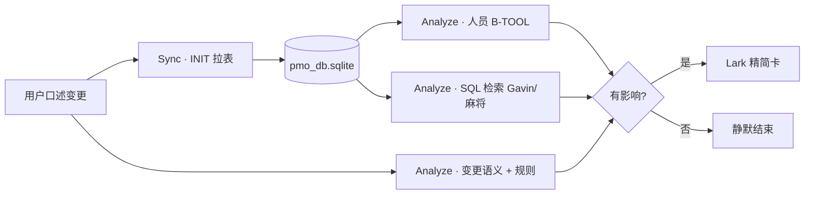

# PMO 变更预警 · 案例复盘：Gavin「麻将开发」插单（2026-06-05）

> **文档定位**：记录一次 **真实执行的变更预警演练**——从用户一句「给 Gavin 加了麻将需求，请分析并必要时推 Lark」出发，完整还原：**怎么拆问题、分几轮查什么、用什么工具、读了哪些资料、每轮得出什么、最后为什么预警**。  
> **读者**：产品、PMO、后端 / Agent 工程师；不要求读过 ReAct 源码。  
> **关联设计**：[`PMO_CHANGE_ALERT_DESIGN.md`](./PMO_CHANGE_ALERT_DESIGN.md)（目标架构）· [`PMO_PERSONNEL_QUERY_CASE_STUDY_0601_SPRINT.md`](./PMO_PERSONNEL_QUERY_CASE_STUDY_0601_SPRINT.md)（人员 SSOT）· 推送脚本 `scripts/send_pmo_change_alert_mahjong.py`  
> **说明**：本次是 **Phase 0 模拟 Webhook**（变更内容由用户口述 + 镜像库交叉验证），尚未接入自动 diff / 飞书 Bitable 事件回调。

---

## 1. 用户到底要什么？

用户原话大意：

> 需求表给 **Gavin** 加了一个新大需求 **「麻将开发」**，下面有一个子需求 **「麻将花色增加开发」**；Sprint 是 **6 月 1 号周期**，Start **6/5**，可接受交付 **6/6**，期待交付 **6/5**。  
> 请走一遍检查流程，分析变动是否合理、对项目和人员有什么影响；**没影响就结束**；**有影响就预警**，推到 Lark 群 `oc_437c98d11106295fb10751a5481ee465`。

拆成四条 **可验收** 的子任务：

| 序号 | 子任务 | 完成标准 |
|------|--------|----------|
| ① | 理解「这次变了什么」 | 能写出变更摘要（Epic / 子任务 / 人 / 日期 / Sprint） |
| ② | 判断 **对人** 是否合理 | 按 Skill §1.4.1b「节奏判定」，不是数任务条数 |
| ③ | 判断 **对项目** 是否合理 | Sprint 容量、日期自洽、跨视图是否对齐 |
| ④ | **有条件推送** | 有影响 → Lark；无影响 → 静默结束 |

用户还提供了 Lark App 凭证。推送是 **交付动作**，但分析不能依赖「能不能发出去」——先查数、再结论、最后才发卡片。

---

## 2. 第一步：怎么拆解用户问题？

接到需求后，没有立刻跑 Agent 或发飞书，而是先对照 [`PMO_CHANGE_ALERT_DESIGN.md`](./PMO_CHANGE_ALERT_DESIGN.md) §2 里的 **四个问题**，把模糊需求压成可执行 checklist：

| 问题 | 本次答案（假设 / 待验证） |
|------|---------------------------|
| **什么叫「临时调整」？** | 插单：新 Epic + 新子任务，改负责人、改 Sprint 内排期 |
| **预警说什么、给谁？** | 精简变更卡，不是三表宏观看板；目标群 `oc_437c…` |
| **数据从哪来才可信？** | SQLite 镜像 `pmo_raw_records` 是 SSOT；用户口述的变更需与库内 **交叉验证** |
| **多快要响？** | 用户要求 **当场分析**，等价于模拟 Webhook 触发的一次分支 B |

进一步拆成 **三条分析轴线**（设计文档 §3.2）：

1. **变更本身**：字段 diff、日期是否自洽、严重度  
2. **人员负荷**：Gavin 在 `2026/06/01-Sprint` 内是否已 🚨 / 🟡  
3. **项目整体**：Epic 是否挤占当周 P0、产品表与开发表是否「各说各话」

**关键判断**：用户描述的是 **「刚写入飞书表、可能尚未进镜像」** 的场景——因此流程必须是 **「口述变更 + 库内现状」双源分析**，不能假设库里已经有「麻将」两行。

---

## 3. 整体安排：五层流水线（本次实际走了哪几段）

设计文档里的五层是：Detect → Sync → Diff → Analyze → Alert。  
**本次实际执行**映射如下：



| 层级 | 本次是否执行 | 说明 |
|------|--------------|------|
| Detect | ⚠️ 人工替代 | 无 Webhook；变更来自用户消息 |
| Sync | ✅ | `--init` 全量拉表 + mirror_import |
| Diff | ⚠️ 半自动 | 用 SQL `LIKE '%麻将%'` 验证是否入库；无 before/after Tool |
| Analyze | ✅ | B-TOOL + 规则 + §1.4.1b |
| Alert | ✅ | Python 脚本发 Lark 卡片 |

---

## 4. 分轮执行过程（共 6 轮 + 推送 2 次尝试）

下面按 **时间顺序** 写每一轮：**在想什么 → 用了什么 → 看到什么 → 得出什么**。

---

### 第 0 轮 · 定调与工具选型（未动数据）

**在想什么**

- 变更预警 **不要** 走默认多 Agent 宏观看板（分支 A）：那是三表战报，又慢又和场景不符。  
- **不要** 先上 LLM ReAct：人员矩阵已有 Python Tool，能秒级出 JSON。  
- 正确顺序：**先 Sync / 探针 → 再规则分析 → 最后才推送**。

**查阅资料**

| 资料 | 用途 |
|------|------|
| `skills_repo/pmo-copilot/SKILL.md` §1.4.1b | 人员预警必须「节奏判定」 |
| `PMO_CHANGE_ALERT_DESIGN.md` §6 | 分析轴线、静默策略、卡片应含哪些段 |
| `config/mcps/atom_lark_notifier/config.yaml` | 默认 PMO 机器人、群 ID 约定 |
| `l3_node/channels/lark/im.py` | `send_markdown_card` 推送方式 |

**本轮结论**

- 用 **Worker B 宿主预取** 看 Gavin 本周真实负荷。  
- 用 **INIT** 尽量让镜像接近飞书现状。  
- 用 **SQL** 验证「麻将」是否已入库。  
- 推送走 **精简 Markdown 卡**，版式后续可 polish（用户已反馈「有点丑」）。

---

### 第 1 轮 · 人员基线探针（无 LLM）

**工具**

```text
python scripts/run_pmo_worker_b_probe.py --brief
```

**代码路径**

- 脚本 → `l3_node/pmo_worker_result_backfill.run_worker_b_host_bootstrap()`  
- 内部 → `core:pmo_personnel_report`（`recent_window: true`）  
- 数据 → `~/.jachin/workspace/pmo_db.sqlite`，视图 SSOT **`vewCz1FFJi`**

**看到什么**

| 字段 | 值 |
|------|-----|
| current_sprint | `2026/06/01-Sprint` |
| Gavin 本周任务数 | **1 条** |
| 全项目本周任务 | 35 条 / 14 人 |
| current_sprint 解析 | `sd_lte_today_max` ✅（没有用错「未来 Sprint」） |

**思考**

探针 `--brief` 只打印 **每人本周几条**，不打印交付日 / Progress / 状态（见 `run_pmo_worker_b_probe.py` 的 `_print_brief`）。第一眼很容易走向两种 **错误捷径**：

| 错误捷径 | 若在此轮采信会怎样 |
|----------|-------------------|
| 「Patrick 8 条最多 → 该预警 Patrick」 | 用 COUNT 排名当过载，违反 Skill §1.4.1b |
| 「Gavin 只有 1 条 → 插单没问题 / 分析结束」 | 条数少 ≠ 节奏正常；**后面第 4 轮会证明错**（FB外跳 Due 6/2、6/5 仍无 Progress） |

因此在本轮输出之上，还要叠两层约束：

1. **规则层（第 0 轮已读 SSOT）**：Skill §1.4.1b 规定预警看 **计划周期 × 完成进度 × 当前时间**，**不是**谁任务条数最多；典型场景明确写——条数全组最多但均按时完成 → ✅，**不得**仅因条数多标 🚨。  
2. **数据层（本轮实际有什么）**：有 Sprint 窗、Gavin 本周 **1 条**、全组条数分布；**没有** Expected Delivery、Progress、状态——而 §1.4.1b 判定 **必须** 后几项。

**第 1 轮合法动作（门禁表）**

在本轮信息下，对「Gavin 是否该预警 / 是否结束分析」**只有下面三种思路**；前两种 **不允许** 作为终判，第三种才是唯一合法出口：

| 动作 | 是否允许 | 理由 |
|------|----------|------|
| 宣布「Gavin 没问题，分析结束」 | ❌ 信息不足 | 尚未看到交付日、Progress；「1 条」不能推出 ✅ |
| 宣布「Gavin 一定过载」 | ❌ 尚未看延期/进度 | 尚未对比「今天 vs 计划交付」；不能凭插单口述提前 🚨 |
| **标记基线成立，下一轮补字段** | ✅ | 范围与 Sprint 已钉死；缺的是 §1.4.1b 必填字段 → 第 2 轮 SQL / B-TOOL 明细 |

推导链（为何不是「结论脱口而出」）：

```text
探针输出条数表
  → 识别：输出形态在诱惑 COUNT 排名（与 Skill 禁止项同形）
  → 切换：§1.4.1b 需要 交付日 / Progress / 今天
  → 发现：--brief 未提供上述字段
  → 门禁：禁止终判 ✅ 或 🚨
  → 唯一合法出口：基线 + 下一轮 todo
```

**本轮结论**

- 基线成立：分析锁定 **`2026/06/01-Sprint` + 人名 Gavin**。  
- 需要第 2 轮把 Gavin 那 1 条的 **日期和状态** 拉出来。

---

### 第 2 轮 · 库内定向检索（SQL + 小脚本）

**工具**

- 自写临时查询脚本（已删除，逻辑等价于 `core:db_query`）  
- 查询表 `pmo_raw_records`，视图 `vewCz1FFJi`、`vewpI8lyYw`

**检索两类内容**

1. **Gavin** 在人员看板 / 开发表的所有行  
2. **「麻将」** 关键字全库

**看到什么**

| 检索 | 结果 |
|------|------|
| Gavin · vewCz1FFJi | 2 行，实质同一任务「FB外跳-程序开发」；一行有 Start/Due 毫秒时间戳 |
| Gavin · vewpI8lyYw | 30 行历史任务；当前 Sprint 相关可见「FB外跳」P0 |
| **`麻将` 全库** | **0 条** |

**思考**

- 用户说 **已经加了** 麻将需求，但镜像 **没有** → 三种可能：  
  1. 刚保存，尚未被本次拉取覆盖；  
  2. 写在产品表/other view，INIT 12 视图里 **人员/开发主表还没有**；  
  3. 开发表分页上限（后续 INIT 日志印证了 vewpI8lyYw **超过 2000 条分页**）。  
- 因此分析策略调整为：**变更摘要信用户口述，人员现状信镜像库，结论里必须标注「镜像未收录麻将」**。

**本轮结论**

- 不能假装在库里 JOIN 到了「麻将」行。  
- Gavin 当前 Sprint **可确认** 的任务是 **FB外跳 P0**。

---

### 第 3 轮 · 同步飞书最新数据（INIT）

**工具**

```text
python scripts/run_pmo_copilot_skill.py --init
```

**背后调用链**

1. `mcp:atom_bi_project_context` — 拉 §1.1 共 12 个 wiki 视图  
2. 落盘 `~/.jachin/workspace/pmo_lark_pull/*.md` + `*.records.json`  
3. `core:pmo_mirror_import` — **零 LLM** 写入 SQLite  

**看到什么**

- 耗时约 60s  
- **4,986** 条记录、12 个视图，状态 `ok`  
- 日志警告：`vewpI8lyYw` **已达 2000 条分页上限**，后续页未拉全  

**思考**

- 镜像 **比上一轮新**，但若麻将写在开发表较后页，仍可能 **不在镜像里**。  
- 必须 **再跑一轮** 第 2 轮同款检索，确认是否出现「麻将」。

**本轮结论**

- Sync 完成，数据时间戳更新。  
- 存在 **数据完整性风险**，要在预警里写进 ⚠️，不能装「全量必达」。

---

### 第 4 轮 · INIT 后复验（重复检索 + B-TOOL 明细）

**工具**

- 再次 SQL：`LIKE '%麻将%'`  
- Python：`run_worker_b_host_bootstrap()`，筛 `person == 'Gavin'`

**看到什么**

| 项 | 结果 |
|----|------|
| 麻将 | 仍为 **0 条** |
| Gavin 任务 | 仍 **1 条**；`start_date` → **2026-06-01**，`expected_delivery_date` → **2026-06-02** |
| priority | P0；progress / status **空** |

**思考 · 人员轴（§1.4.1b）**

- 今天是 **2026-06-05（周五）**。  
- 计划交付 **6/2**，已过 **3 天**，Progress 仍空 → **🚨 延期 / 进度严重落后**（不是「条数多」，是 **完成率相对时间进度** 落后）。  
- 用户新需求：**Start = Expected = 6/5** → 等于 **在延期未清的情况下，同日再插一条当日必须交** 的任务。

**思考 · 变更轴**

| 检查 | 结论 |
|------|------|
| Start = Expected = 6/5 | **零缓冲排期**，对新开发任务不合理 |
| 可接受 6/6 | 仅比 Expected 多 1 天，偏紧 |
| 新 Epic 中途进 06/01 Sprint | 与未闭环 P0 **并行**，挤占同一负责人 |

**思考 · 项目轴**

- 用 grep 扫仓库 / 产品池快照：仅有 **「泉州麻将 / Victor / pending」**，无「麻将开发 / Gavin」→ **跨视图未对齐**（Auditor 所称「幽灵需求 / 产品开发各写各的」风险）。  
- 尝试 `run_pmo_sprint_epic_report` 导入失败（函数名在模块内路径不同），**未阻塞**：本案例核心在人，不在 Epic 计数。

**本轮结论**

- **有影响**，且 **必须预警**。  
- 不是「Gavin 只有 1 条所以没事」，而是 **那 1 条已延期 + 新插单日期冲突**。

---

### 第 5 轮 · 撰写预警结论与 Lark 卡片

**工具**

- 新建 `scripts/send_pmo_change_alert_mahjong.py`（结构化 Markdown + `send_markdown_card`）  
- 凭证：**仅环境变量**，不写进仓库  

**卡片结构（对齐设计文档 §7，版式待优化）**

1. 📌 变更摘要（来自用户 + 镜像未收录说明）  
2. 👥 人员影响表（Gavin + §1.4.1b 依据句）  
3. ⚠️ 项目 / 排期 / 跨视图 / 镜像缺口  
4. 💡 建议动作（只建议，不改表）  
5.  Footer：`change_alert_result: alert_sent`

**用户反馈（记录备改）**

- **内容方向对**；**版式偏丑、不易读** → 后续应接 `native_table_card` 或 PMO 专用 polish，与宏观看板 `pmo_report_format` 统一。

---

### 第 6 轮 · 推送 Lark（两次尝试）

| 次序 | 凭证 | 结果 | 原因 |
|------|------|------|------|
| ① | 用户提供的 `cli_a9253a96…` | ❌ | `Bot/User can NOT be out of the chat` — **机器人未加入目标群** |
| ② | `config/mcps/atom_lark_notifier/config.yaml` 内 PMO 机器人 | ✅ | 该 bot 已在群内 |

**思考**

- 推送失败 **不能** 等于「分析失败」；要把 **bot 入群** 写进运维 checklist。  
- 生产环境应 **配置 SSOT 一个 bot**，避免临场换凭证。

**最终结果**

- 群 `oc_437c98d11106295fb10751a5481ee465` 收到 **变更预警卡片**。  
- 判定：**Gavin 🚨 延期叠加 + 同日插单**；项目侧 ⚠️ 日期紧、跨视图未对齐、镜像未收录。

---

## 5. 三个分析角度 · 汇总与完成方式

上表是三轴结论的 **摘要**。下面说明：**这三方向从哪来、本次实际怎么做的、有没有把数据丢给大模型**——避免读成「模型看了一眼表就填好了三行」。

### 5.1 三个方向是怎么定出来的？（不是现场发明的）

它们来自 [`PMO_CHANGE_ALERT_DESIGN.md`](./PMO_CHANGE_ALERT_DESIGN.md) 对「变更预警」的固定拆解，在本案例第 0 轮定调时就被 adopt，**不是**第 4 轮看到结果再反凑的三个标题：

| 汇总表中的角度 | 设计文档来源 | 对应「在问什么」 |
|----------------|--------------|------------------|
| **变更 / 排期** | §3.1 变更类型 + §6.3 严重度 / 日期规则 | 这次 **插单/新 Epic** 的字段是否合理、排期有没有零缓冲 |
| **人员负荷** | §3.2 轴线一「个人负荷」+ Skill §1.4.1b | 负责人 Gavin **在当前 Sprint 内** 完成进度是否跟得上时间 |
| **项目 / 数据** | §3.2 轴线二「整体不合理」+ Auditor 轻量检查项 | 产品/开发是否各写各的、镜像是否可信、Sync 是否完整 |

设计文档原先把后两条叫「个人负荷 / 整体不合理」；案例汇总表把 **「变更本身」** 单拆成第一轴——因为用户口述里已经给出 Start/Due/Sprint，**即使镜像里还没有「麻将」行**，也必须对 **变更语义** 先做一轮排期合理性判断，不能等 diff Tool 就绪才分析。

---

### 5.2 本次有没有「扩充成提示词 → 喂给大模型 → 出结论」？

**没有。** 本次演练 **未调用** `run_agent` / ReAct，也 **没有** 向 LLM 发送一条合并了 SQLite 全表的 system prompt。

实际分工是：

```text
Python Tool + SQL + 规则（§1.4.1b / 设计文档 §6.3）→ 结构化事实
    → 执行者（Agent 会话内推理）按三轴 checklist 归纳
    → 写入 send_pmo_change_alert_mahjong.py 里的 Markdown 正文
    → send_markdown_card 推送（纯 API，无 LLM）
```

这与 [`PMO_CHANGE_ALERT_DESIGN.md`](./PMO_CHANGE_ALERT_DESIGN.md) §5.2 的目标分工一致：**查对与规则在 Tool / Python；LLM 只负责 narrate**。本次连 narrate 也是 **按固定卡片模板手写**，没有多一轮「请模型写预警文案」。

**若将来产品化**，三轴会对应 **三条内部检查单**（可注入分支 B 的 Agent system，但 **输入应是 JSON 事实包，不是 raw 表**）。下面用「等价检查单」描述本次 **脑子里跑的逻辑**——便于你们以后写 Skill / Agent prompt。

---

### 5.3 轴一 · 变更 / 排期 —— 怎么完成的

**等价检查单（非本次 LLM prompt，而是规则清单）**

```text
输入：
  - 用户口述变更：Epic「麻将开发」、子任务「麻将花色增加开发」
  - Sprint = 2026/06/01-Sprint
  - Start = Expected = 2026-06-05，Acceptable = 2026-06-06
  - 运行日 = 2026-06-05（周五）

必答：
  1. Start 与 Expected 是否同日？→ 零缓冲
  2. Acceptable 比 Expected 多几天？→ 仅 +1 天
  3. 新 Epic 是否落在 current_sprint 中途？→ 是（Sprint 6/1 起，今天 6/5）
  4. 镜像中是否已能 JOIN 到该行？→ 第 2/4 轮 SQL：0 条（单独记 ⚠️，但不阻止对口述字段做排期判断）

禁止：
  - 用「库里搜不到」推出「变更不存在」——只能推出「镜像未收录」
```

**用的数据**

| 来源 | 内容 |
|------|------|
| **用户消息** | Epic/子任务名、Gavin、Sprint、Start/Due/Acceptable |
| **B-TOOL（第 1/4 轮）** | `current_sprint = 2026/06/01-Sprint`（判断「Mid-sprint 插单」） |
| **SQL `LIKE '%麻将%'`** | 0 条 → 排期轴结论里 **不** 依赖库内该行，但项目轴会引用 |

**推理方式**：**纯规则 + 日期算术**，无模型参与。例如 Start=Due=6/5 → 标注「零缓冲」；Sprint 6/1 且 today 6/5 → 标注「Mid-sprint 插 Epic」。

**结论**：⚠️ 零缓冲；Mid-sprint 插 Epic。

---

### 5.4 轴二 · 人员负荷 —— 怎么完成的

**等价检查单（对齐 Skill §1.4.1b）**

```text
输入：
  - 受影响人：Gavin（用户指定 + B-TOOL 确认存在）
  - current_sprint：2026/06/01-Sprint
  - 该员在本 Sprint 的计划任务明细（含 Due、Progress、priority）

步骤：
  1. 筛「本周期计划任务」M（vewCz1FFJi SSOT，B-TOOL personnel_tasks[]）
  2. 看已终态/实质完成 K（Progress、状态；本次均为空 → K≈0）
  3. 对比「今天」在 Sprint/周内的位置（6/5 周五，Sprint 已进行约 5 天）
  4. 计划交付日 < 今天 且仍未终态 → 叠加 🚨 延期
  5. 在用户口述「再插一条 Start=Due=today」上 → 叙述「节奏恶化」，禁止用 COUNT 排名

禁止：
  - Gavin 只有 1 条 → ✅（第 1 轮门禁已否）
  - Patrick 8 条 → 🚨 Gavin（条数排名）
```

**用的数据（全部来自 Tool/SQL，非 LLM 编造）**

| 字段 | 值 | 来自 |
|------|-----|------|
| person | Gavin | 用户 + `personnel_tasks[]` |
| 本周任务 | 1 条（FB外跳-程序开发） | `run_worker_b_host_bootstrap()` |
| priority | P0 | 同上 |
| expected_delivery_date | **2026-06-02**（毫秒戳换算） | 同上 |
| progress / status | **空** | 同上 |
| 运行日 | 2026-06-05 | 系统日期 |
| 口述新增 | 麻将花色… Due=6/5 | 用户消息（作 **叠加情景**，非库内第二行） |

**推理方式**：按 §1.4.1b **节奏判定**——Due 6/2 已过 3 天仍无 Progress → 🚨 延期/严重落后；在此基线上 **叠加** 用户描述的同日插单 → 🚨 延期 + 插单恶化。**没有** 把「2 条任务」当主因。

**结论**：🚨 延期 + 插单恶化节奏。

---

### 5.5 轴三 · 项目 / 数据 —— 怎么完成的

**等价检查单（Auditor 轻量子集 + Sync 质量）**

```text
输入：
  - 镜像全库检索「麻将」
  - 产品池侧是否已有可对齐需求（grep/历史 md 快照）
  - INIT 日志是否暴露分页/完整性问题

必答：
  1. 开发/人员主表能否找到变更行？→ 0 条 → ⚠️ 镜像缺口
  2. 产品池是否存在同名/同 Epic 对齐？→ 仅「泉州麻将/Victor/pending」≠「麻将开发/Gavin」→ ⚠️ 幽灵/跨视图风险
  3. 拉表是否可信？→ vewpI8lyYw 2000 条分页警告 → ⚠️ 完整性风险

禁止：
  - 镜像 0 条 → 断言「PM 没改表」（可能是 lag / 视图 / 分页）
```

**用的数据**

| 证据 | 结果 | 来自 |
|------|------|------|
| `pmo_raw_records` `LIKE '%麻将%'` | 0 | 第 2、4 轮 SQL |
| 产品池「泉州麻将」 | Victor / pending，与本次 Gavin 插单不对齐 | 仓库内 bi_project 快照 grep |
| INIT stderr | vewpI8lyYw 超 2000 条分页未拉全 | 第 3 轮 `--init` 日志 |

**推理方式**：**交叉核对 + 数据质量门禁**，未跑完整 Auditor Agent；规则来自架构文档「幽灵需求 / 状态倒挂 / 镜像 SSOT」的 **简化版**。

**结论**：⚠️ 幽灵风险 + 镜像缺口。

---

### 5.6 三轴结论如何合并成「推不推送」？

三轴 **独立算完后**，用设计文档 §6.6 的 **决策门** 做布尔合并（仍是规则，非 LLM）：

| 轴 | 符号 | 是否触发推送 |
|----|------|--------------|
| 变更/排期 | ⚠️ | 计入 |
| 人员 | 🚨 | **触发** |
| 项目/数据 | ⚠️ | 计入 |

```text
存在 🚨 或 ⚠️ 项目影响 → 推送
全员 ✅ 且 变更合理 → 静默（本次不适用）
```

本次：人员轴 🚨  alone 已足够推送；项目轴 ⚠️ 写入卡片 **第二段**，不重复升级成 🚨。

**写入 Lark 的正文**：第 5 轮把三轴结论 **填进固定 Markdown 模板**（`send_pmo_change_alert_mahjong.py`），不是模型 streaming 生成。

---

### 5.7 汇总表（结论索引）

| 角度 | 问什么 | 本次用的证据 | 谁算的 | 结论 |
|------|--------|--------------|--------|------|
| **变更 / 排期** | 新需求日期是否合理？ | 用户口述 + `current_sprint` | 规则 / 日期 | ⚠️ 零缓冲；Mid-sprint 插 Epic |
| **人员负荷** | Gavin 是否超负荷？ | B-TOOL：FB外跳 P0，Due 6/2，Progress 空；今天 6/5 | §1.4.1b | 🚨 延期 + 插单恶化节奏 |
| **项目 / 数据** | 整体是否矛盾、数据是否可信？ | 麻将 0 条；泉州麻将≠本次；INIT 分页警告 | Auditor 轻量规则 | ⚠️ 幽灵风险 + 镜像缺口 |

**决策门**

```text
存在 🚨 或 ⚠️ 项目影响 → 推送
全员 ✅ 且 变更合理 → 静默（本次不适用）
```

**目标态对照（供实现分支 B Agent 时参考）**：将来应产出类似下面的 **JSON 事实包** 再 optional 交给 LLM 写人话；本次是人工（Agent 会话）直接填模板。

```json
{
  "change_summary": { "epic": "麻将开发", "assignee": "Gavin", "start": "2026-06-05", "due": "2026-06-05" },
  "schedule_risks": ["zero_buffer", "mid_sprint_epic"],
  "personnel": [{
    "person": "Gavin",
    "verdict": "alert",
    "reason": "due_2026-06-02_overdue_no_progress_plus_same_day_insert"
  }],
  "project_risks": ["mirror_row_missing", "cross_view_mismatch"],
  "decision": "alert_sent"
}
```


---

## 6. 迭代关系一览（不是 six 独立实验，而是一条链）

```text
第0轮 定调 → 第1轮 人员基线 → 第2轮 SQL（发现无麻将）
    → 第3轮 INIT 刷新 → 第4轮 复验 + 三维分析 → 第5轮 写卡 → 第6轮 推送
```

若 **第 4 轮** 镜像里出现了「麻将」行，会多一步 **字段级 diff**（设计文档 Phase 1 的 `core:pmo_change_diff`）；本次 **跳过了自动 diff**，用 **用户口述 + 检索为 0** 间接证明「新行未进库或未进主视图」。

---

## 7. 工具清单（按「谁该干什么」）

| 工具 / 脚本 | 类型 | 本次用途 | 为何用它 |
|-------------|------|----------|----------|
| `run_pmo_worker_b_probe.py` | CLI | Gavin 本周任务数、current_sprint | 无 LLM、与 FanOut 同路径 |
| `run_worker_b_host_bootstrap()` | Python | 交付日毫秒戳 → 日期 | 人员明细 SSOT |
| `run_pmo_copilot_skill.py --init` | CLI | 拉飞书 12 视图入库 | 让镜像尽量新 |
| SQL on `pmo_raw_records` | db_query 等价 | Gavin / 麻将 检索 | 验证变更是否入库 |
| `send_pmo_change_alert_mahjong.py` | 一次性脚本 | 发 Lark 精简卡 | 分支 B 交付 |
| `send_markdown_card` · `im.py` | Lark API | 实际 HTTP 发送 | 无 Webhook 时用 App 凭证 |
| **未使用** | `run_agent` ReAct | — | 查数已由 Tool 覆盖，避免幻觉 |
| **未使用** | 多 Agent FanOut | — | 宏观看板过重 |
| **未使用** | Webhook / change_queue | — | 尚未实现 |

---

## 8. 若「没有影响」本会怎样？

假设另一种事实：

- Gavin 本周 **0 延期**，Progress 正常；  
- 新任务 Expected **6/12**，Sprint 仍 06/01 但 **不与其他 P0 并行**；  
- 镜像能查到「麻将」且产品 / 开发 **状态一致**；

则流程会在 **第 4 轮** 给出 **全员 ✅**，**第 5～6 轮跳过**，Final Answer 等价于：

```text
change_alert_result: all_clear
（不调用 atom_lark_notifier）
```

这与 `SKILL.resource-monitor.md`「有问题才推」一致。

---

## 9. 对「预警系统」产品化的启示

从本次演练反推 **系统应做成什么样**（与 [`PMO_CHANGE_ALERT_DESIGN.md`](./PMO_CHANGE_ALERT_DESIGN.md) 对齐）：

| 启示 | 说明 |
|------|------|
| **双源输入** | Webhook body（变了什么）+ 镜像库（现状怎样）；缺一不可 |
| **Tool 先行** | 人员 / Sprint 用 Python Tool；LLM 只 narrate |
| **镜像缺口要大声说** | 检索 0 条 ≠ 「没问题」，可能是 **Sync  lag / 分页 / 写错视图** |
| **三维结论分开展示** | 变更摘要 / 人员 / 项目；不要混成一段 |
| **版式要产品化** | 本次卡片「丑」→ 应用 `native_table_card` + 固定模板（设计 §7） |
| **Bot 入群是前置条件** | 凭证对了但不在群 = 交付失败 |
| **Phase 1 优先 diff Tool** | 可避免「口述变更 + 手工 SQL」 |

---

## 10. 附录 · 关键数据快照（2026-06-05 演练时）

**用户描述的变更（待入库验证）**

| 字段 | 值 |
|------|-----|
| Epic | 麻将开发 |
| 子需求 | 麻将花色增加开发 |
| 负责人 | Gavin |
| Sprint | 2026/06/01-Sprint |
| Start | 2026-06-05 |
| Expected | 2026-06-05 |
| Acceptable | 2026-06-06 |

**镜像库中 Gavin（INIT 后）**

| 字段 | 值 |
|------|-----|
| 任务 | FB外跳-程序开发 |
| priority | P0 |
| Sprint | 2026/06/01-Sprint |
| Expected | 2026-06-02 |
| Progress | 空 |
| 麻将关键字 | 0 条 |

**推送**

| 项 | 值 |
|----|-----|
| 目标群 | `oc_437c98d11106295fb10751a5481ee465` |
| 结果 | 成功（PMO 配置 bot） |
| 脚本 | `scripts/send_pmo_change_alert_mahjong.py` |

---

## 11. 如何在 Jachin 里复刻这个过程：变更预警子 Skill 落地方案

> **本节回答**：「这次 Cursor 做了什么」→「在 Jachin 里该由谁做、怎么分工、提示词怎么写」。  
> 写法：尽量用人话，避免堆术语。

---

### 11.1 先说结论：整体分工方式

本次演练可以用一句话概括它的分工原则：

> **「能确定的事情交给程序，只有要写人话的地方才用大模型。」**

所以复刻的核心原则也是这个——**不是把流程都交给大模型跑 ReAct，而是让 Python Tool 负责查数、计算、打分，然后把一个整理好的「事实包」交给 Agent，Agent 只负责用人话写预警卡、判断推不推送。**

具体来说，整条流水线拆成三段：

```
第一段：数据收集（全是 Python / Tool，零 LLM）
    → 拉表 Sync + B-TOOL 人员快照 + SQL 检索变更实体 + 日期规则打分

第二段：三轴分析（Agent 单次推理，轻量 ReAct）
    → 拿到第一段产出的 JSON 事实包，用三条检查单写 verdict

第三段：卡片 + 推送（有条件，固定模板）
    → 有 🚨/⚠️ 才调 atom_lark_notifier；全员 ✅ 则静默
```

---

### 11.2 Webhook 消息解析：触发点在哪里

未来 Lark 机器人监测到飞书 Bitable 记录变更，会发过来一条消息。格式大概是 JSON，不是人话，类似这样：

```json
{
  "event_type": "bitable.record.updated",
  "table_id": "tblfK9gk6vTQpJtB",
  "view_id": "vewpI8lyYw",
  "record_id": "recXXXXXX",
  "changed_fields": {
    "Person in charge/Participant": { "after": [{"en_name": "Gavin"}] },
    "Expected Delivery Date": { "before": null, "after": 1780416000000 },
    "Sprint": { "after": "2026/06/01-Sprint" },
    "Requirement": { "after": "麻将花色增加开发" }
  },
  "parent_record_id": "recYYYYYY"
}
```

**这条消息不应该直接丢给大模型解析。** 应该用一个轻量 Python 函数把它拆成标准化的「变更摘要结构体」，字段对齐我们自己的格式，再往下走。这个解析函数就是 `core:pmo_change_diff` 里的一部分（设计文档 Phase 1 规划的）。

解析完之后产出：

```json
{
  "change_type": "insert_subtask",
  "epic": "麻将开发",
  "task": "麻将花色增加开发",
  "assignee": ["Gavin"],
  "sprint": "2026/06/01-Sprint",
  "start_date": "2026-06-05",
  "expected_due": "2026-06-05",
  "acceptable_due": "2026-06-06",
  "severity_score": 85,
  "severity_reasons": ["zero_buffer", "mid_sprint_insert", "assignee_has_overdue"]
}
```

`severity_score` 是 Python 按规则表算的，不是 LLM 猜的。

---

### 11.3 第一段该封装成什么 Tool

**以下步骤直接用 Python Tool，不走 LLM，秒级完成：**

| 封装成哪个 Tool | 干什么 | 本次案例对应哪轮 |
|----------------|--------|-----------------|
| `core:pmo_personnel_report` | 拉 B-TOOL 快照：Gavin 本 Sprint 所有任务、交付日、Progress | 第 1 轮 `--brief` + 第 4 轮明细 |
| `core:pmo_change_diff`（新增） | 解析 Webhook JSON → 变更摘要结构体 + 严重度打分 | 第 2/4 轮 SQL + 变更轴规则 |
| `core:db_query` | 关键词检索 `pmo_raw_records`（验证变更是否入库、产品侧对齐） | 第 2/4 轮 LIKE 查询 |
| `core:pmo_mirror_import` | 如果镜像太旧（超过 N 小时）先 INIT 刷新 | 第 3 轮 INIT |

**这四个 Tool 的产出合在一起，就是给 Agent 的「事实包」。** 实际上 Agent 启动之前这些就跑完了（宿主预取，和宏观看板里 FanOut 前跑 B-TOOL / C-TOOL 的做法一样）。

**不要用 Tool 做的事情：**
- ❌ Tool 不负责判断「这个人是否超载」——那是 §1.4.1b 的推理，属于人话叙述，给 Agent 做
- ❌ Tool 不负责写 Lark 卡片的段落文案——那属于 narrate，给 Agent 做
- ❌ Tool 不负责决定「推不推送」的理由文案——只出 0/1 标志，理由让 Agent 写

---

### 11.4 是否需要多 Agent？答案是：不需要，用单 Agent 就够

宏观看板（分支 A）用了多 Agent（Worker B / C / Auditor / Publisher），因为它要并行拉很多数据、最后还要产出三张 GFM 大表。但变更预警 **不一样**：

- 受影响的人 **已知**（从 Webhook 里拿），不需要扫全组
- 需求层只查 **这一条变更**，不需要全量 Epic 计数
- 输出是**精简卡片**，不是三表战报
- 整个分析最多 6～8 轮 ReAct，不需要 FanOut 拆并发

所以设计是：**单 Agent，轻量 ReAct，不超过 8 轮。**

如果未来要扩展成「批量监控多个变更同时触发」，可以再考虑多 Agent，但 Phase 0/1 完全没必要。

---

### 11.5 单 Agent 的 ReAct 分几轮、每轮干什么

Agent 启动时，事实包已经由宿主 Python 预取完毕，注入 user 消息里。Agent 的任务主要是**推理 + 写卡片 + 推送**，不是从头查数据。

**理想情况（宿主预取成功）：**

```
轮次 0（宿主 Python，启动前就完成，不计入 ReAct）
  → 运行 B-TOOL：拿 Gavin 的 personnel_tasks[]
  → 运行 pmo_change_diff：解析 Webhook JSON → 变更结构体 + severity_score
  → 如果镜像过期：先 pmo_mirror_import

轮次 1（ReAct · 补充检索）
  Action: core:db_query
  目的：在 pmo_raw_records 里搜变更关键词（确认是否已入库）+ 跨视图对齐（产品侧有没有同名 Epic）
  Thought 产出：镜像收录 ✅/❌ + 产品侧状态

轮次 2（ReAct · 三轴分析 + 写 verdict）
  Action: 无（纯推理）
  Thought：按三轴检查单走一遍（见 11.6），产出 verdict JSON
  禁止：在 Thought 里就宣布「已分析完成」——必须在下一轮把 verdict 写进 Lark 卡片

轮次 3（ReAct · 组装卡片 + 推送）
  Action: mcp:atom_lark_notifier
  卡片：三轴结论填进固定模板
  Thought 末尾：change_alert_result: alert_sent 或 all_clear

Final Answer：≤3 句话确认结果
```

**如果宿主预取失败（B-TOOL 出错 / 镜像空）：**

轮次 1 变成补查：先调 `core:db_query` 拿 Gavin 本周任务明细，再继续后面的流程。最多多加 1～2 轮，总轮次控制在 8 轮以内。

---

### 11.6 三个分析方向怎么给大模型——分成三条检查单，不是一股脑

**最差做法（不要这样）：**

> 「请分析这次变更对项目、人员、排期的影响，写一个预警卡发到飞书。」

这样 LLM 会自由发挥，什么都可能出来，容易幻觉。

**正确做法：把三轴展开成三条结构化检查单，注入到 Skill 的 Persona 或 system prompt 里。** Agent 拿到事实包之后，按检查单一条一条过，不允许跳过，不允许随意扩展。

**检查单内容（写进 `SKILL.change-alert.md` 的正文）：**

```
【轴一 · 变更 / 排期合理性】（纯规则，Agent 按结果写判断，不自由发挥）
  必答：
    □ Start = Expected 是否同日？→ 是则标注「零缓冲」
    □ Expected 与 Acceptable 差几天？→ ≤1 天则标注「缓冲极短」
    □ 新 Epic 是否在 current_sprint 中途插入？→ 是则标注「Mid-sprint 插单」
    □ 镜像中是否检索到该变更行？→ 否则标注「⚠️ 镜像未收录，数据以用户口述为准」
  禁止：
    □ 用「镜像 0 条」断言「PM 没改表」
    □ 不给出「严重度」只写「请注意」

【轴二 · 人员负荷（§1.4.1b）】（输入来自 B-TOOL JSON，不允许猜）
  必答：
    □ 该人本 Sprint 计划任务数 M？（来自 personnel_tasks[]）
    □ 已终态 / 实质完成数 K？（看 Progress / 状态字段）
    □ 今天在 Sprint 周期里的位置？（运行日 vs sprint_date）
    □ 计划交付日 < 今天 且仍未终态 → 叠加 🚨 延期
    □ 插单后 M+1，节奏如何变化？
  禁止：
    □ 用「任务条数 1 条 → ✅」做结论
    □ 用「全组条数最多的人 → 过载」
    □ Final Answer 里写「请 PM 评估」而不给判定符号

【轴三 · 项目 / 数据质量】（输入来自 db_query + INIT 日志）
  必答：
    □ 产品侧有无同名 / 同 Epic 对齐？→ 无则标注「⚠️ 跨视图未对齐」
    □ INIT 有无分页警告？→ 有则标注「⚠️ 镜像可能不完整」
    □ 变更行在开发/人员主表中有无出现？
  禁止：
    □ 跨视图异常了还写「项目整体正常」
```

**这三条检查单是固定死的**，不因每次变更内容不同而改变。变的是事实包里的数据。这样 Agent 有明确的约束，不会自由发挥，也不会漏掉哪个方向。

**给大模型的输入结构**（user 消息里放的内容）：

```
【变更消息（来自 Webhook 解析）】
{change_summary_json}

【当前人员快照（B-TOOL 产出）】
{personnel_tasks_for_affected_persons_json}

【数据库检索结果】
{db_query_results_json}

【当前系统时间】
{today_date} （{weekday}）

请按 Skill §轴一/轴二/轴三 三条检查单逐一完成分析，产出 verdict JSON，再填入预警卡模板推送。
```

**注意：不是把整个 `pmo_raw_records` 表交给 LLM——那样太大，而且 LLM 自己 JOIN 容易幻觉。** 只给「已经过 Tool 筛选和格式化的 JSON 片段」。

---

### 11.7 约束与自由度：哪些锁死、哪些放开

|  | 锁死（写进 Skill / 宿主代码，LLM 无法绕过） | 放开（让 LLM 发挥） |
|---|---|---|
| **输入格式** | 三轴检查单必须全部回答 | 检查单每条的「依据一句话」可自由措辞 |
| **判定符号** | 🚨/🟡/✅/⚠️ 来自规则，不是 LLM 自赋 | 写进卡片的「判定理由」人话表达 |
| **推送条件** | 有 🚨 或 ⚠️ 才推，否则 all_clear 静默 | 推送时「建议动作」的具体措辞 |
| **卡片结构** | 四段固定（变更摘要/人员/项目/建议） | 每段内文字内容 |
| **工具顺序** | B-TOOL 必须先于三轴分析 | — |
| **Final Answer** | 首行必须是 `change_alert_result: alert_sent/all_clear` | Final Answer 第二段可加说明 |

**一句话说清楚约束和自由的边界：**

> 「数字和判定符号是程序算的、规则定的，不让大模型碰；人话是大模型写的，但只能写在固定的框框里。」

---

### 11.8 子 Skill 文件该长什么样

建议创建 `skills_repo/pmo-copilot/SKILL.change-alert.md`，格式对齐 `SKILL.resource-monitor.md`，内容包含：

```yaml
---
name: pmo-change-alert
version: "1.0.0"
description: "PMO 变更预警 v1：Webhook 触发 + 三轴分析 + 有问题才推 Lark 精简卡"
persona: |
  你是 PMO 变更影响分析 Agent。
  触发方式：收到一条飞书 Bitable 变更（Webhook 解析后的 JSON）+ 宿主预取的人员快照。
  职责：按三条固定检查单（轴一排期/轴二人员/轴三项目数据）逐一分析，
        用 §1.4.1b 节奏判定人员负荷，有 🚨/⚠️ 则双群推送精简卡，全 ✅ 则静默。
  严禁：生成三表宏观看板；严禁用任务条数排名当过载；严禁在事实不足时终判。
  Final Answer 首行必须是：change_alert_result: alert_sent 或 change_alert_result: all_clear
mcp_tools:
  - mcp:atom_lark_notifier
native_tools:
  - core:db_query
  - core:pmo_personnel_report   # 宿主预取，Agent 补用
  - core:pmo_mirror_import       # 仅库空时
tools:
  - prefer: "core:db_query"
  - prefer: "mcp:atom_lark_notifier"
---
```

正文放：
- 三轴检查单（11.6 节）
- §1.4.1b 节奏判定规则摘录
- 预警卡固定模板（设计文档 §7）
- 执行复盘自检清单

---

### 11.9 与现有分支 B 的关系

现在主 Skill 里已经有「分支 B · webhook_table_change」，但只有三行描述，没有完整 SOP。 **本子 Skill 就是分支 B 的具体落地实现**，关系是：

```
主 Skill (SKILL.md) 分支 B
    └── 路由到 SKILL.change-alert.md（子 Skill）
            ├── 宿主 Python：预取 B-TOOL + 解析 Webhook
            ├── Agent：三轴检查单 + 写卡片
            └── mcp:atom_lark_notifier：有问题才推
```

主 Skill 不需要改内容，只需要在分支 B 的路由注释里加一行指向子 Skill 文件的引用。

---

### 11.10 落地路线图（对应设计文档的 Phase 0/1/2）

| Phase | 触发方式 | Webhook 解析 | diff Tool | 状态 |
|-------|----------|-------------|-----------|------|
| **Phase 0（现在）** | 用户手动发 Lark 描述变更 / CLI `-m` | 不需要，用户说清楚了 | 不需要 | ✅ 本案例已跑通 |
| **Phase 1（下一步）** | 定时轮询拉盘 + Python diff | 自动 diff | `core:pmo_change_diff`（新写） | 🔲 需开发 |
| **Phase 2（完整）** | 飞书 Bitable 事件 → pmo_change_queue → 调度器 | 自动 | 同上 | 🔲 需运维（公网端点） |

**Phase 0 已经验证了最核心的东西**：三轴分析逻辑、§1.4.1b 判定、卡片结构、推送机制——这些都 OK。

Phase 1/2 需要补的只是「**自动发现变更**」这一段，分析和推送部分不用再重新验证。

---

### 11.11 版式问题怎么解决（用户反馈「有点丑」）

本次卡片是手写 Markdown，表格对齐靠肉眼，不好看。正式落地时应该：

1. 用 `native_table_card: true`（`atom_lark_notifier` 已支持），让飞书渲染成原生表格
2. 卡片头部 `header.template` 用 `orange`（表示警告）或 `red`（表示严重）
3. 人员影响表控制在 3 列以内（人名 / 判定 / 依据句），不超宽
4. 建议动作写成 `action` 按钮（飞书卡片可以放确认按钮，未来甚至可以点击触发排期调整）

这些是 Lark 卡片的 UI 层优化，不影响分析逻辑，可以在 Phase 1 时一起 polish。

---

---

## 12. 真实变更的多样性：「麻将案例」只是最简单的一种

> 本节回答：如果真实变更不像麻将案例那么「完整干净」，系统该怎么处理？

---

### 12.1 为什么麻将案例是「最简单的情况」

麻将案例之所以流程顺畅，是因为变更信息**全都给齐了**：

- 有明确负责人（Gavin）
- 有完整日期（Start / Expected / Acceptable）
- 有 Sprint 归属
- 有 Epic 和子任务名

真实场景里，PM 改一条飞书记录，通常**只改了其中某几个字段**，其他字段空着、或者根本没有负责人。这种情况下，预警系统必须能**优雅地降级**，而不是「字段不全 → 系统崩溃」或「字段不全 → 当作没有影响」。

---

### 12.2 真实变更的六种常见形态

下面列出你们在实际项目中最可能遇到的变更类型，以及每种情况下系统应该怎么处理。

---

#### 类型 A · 只加了需求，没有负责人（最常见的模糊变更）

**长什么样：**

> 产品在需求表里新建了一行「麻将大厅重做」，填了需求名、Sprint、交付日，但**负责人字段空着**。

**问题在哪：**

没有负责人，人员轴（轴二）就无法执行 §1.4.1b 判定，因为不知道要查谁的任务快照。

**系统应该怎么做：**

| 步骤 | 动作 |
|------|------|
| 变更解析 | 负责人 = 空；`assignee_missing: true` |
| 人员轴 | **跳过个人负荷判定**，但要标注「⚠️ 未分配责任人，无法评估人员影响」 |
| 排期轴 | 正常分析日期合理性（Start/Due/Sprint），不依赖负责人 |
| 项目轴 | 正常检查跨视图、镜像收录 |
| 推送条件 | 排期或项目轴有 ⚠️ 则推送；**卡片人员段写「无负责人，建议 PM 指定」** |
| 静默条件 | 排期和项目轴均 ✅ 且无跨视图异常 → 静默 |

**核心原则：负责人缺失不等于「不需要预警」，只是人员轴的输入缺失，其他两轴照常跑。**

---

#### 类型 B · 只改了一个交付日期

**长什么样：**

> Seth 的某个任务，原来 Expected 是 6/10，PM 改成了 6/5（提前了 5 天）。

**这是最高风险的变更之一**，但表面上「只改了一个日期」，信息也很完整。

**系统应该怎么做：**

| 步骤 | 动作 |
|------|------|
| 变更解析 | `change_type: due_moved_earlier`；`field_diffs: [{before: 6/10, after: 6/5}]` |
| 排期轴 | 日期提前量算出来：`delta_days: -5`；与今天对比（`today > new_due` → 已过截止） |
| 人员轴 | 查 Seth 当前 Sprint 里的任务快照，**重新算节奏**（原来 6/10 还有缓冲，现在 6/5 = 今天，节奏骤然恶化） |
| 项目轴 | 检查是否有 Sprint 排期变化（如原本是合理区间，改后挤进「零缓冲区」） |
| 推送条件 | `new_due ≤ today` 或 `delta_days ≤ -3` 建议直接升 🚨 |

**这类变更最容易被忽视**，因为变更本身「只有一个字段变了」，但对人员节奏的冲击可能非常大。排期轴里要写明「提前量」而不只是「改了」。

---

#### 类型 C · 改了负责人（任务转交）

**长什么样：**

> 「FB 外跳开发」原来是 Gavin，PM 改成了 Alex。

**两个人都可能受影响**：Gavin 的任务少了，但 Alex 的可能本身已经很满了。

**系统应该怎么做：**

| 步骤 | 动作 |
|------|------|
| 变更解析 | `change_type: assignee_changed`；`before_assignee: Gavin`；`after_assignee: Alex` |
| 人员轴 | 需要查**两个人**的任务快照（Gavin 减负、Alex 增负），都要过 §1.4.1b |
| 排期轴 | 转交后日期不变 → 检查 Alex 是否能在原 Due 内完成（交接也需要时间） |
| 项目轴 | 跨视图：转交后是否同步更新了产品侧的负责人 |
| 推送条件 | Alex 被发现节奏已满 → 🚨；否则 ⚠️ 标注「负责人变更，建议确认交接」 |

**不能只查「接盘人」**。转出的人减负了，但接盘人可能更危险。这是类型 A 的反面——信息完整，但影响范围变宽（一人 → 两人）。

---

#### 类型 D · 只有需求名和 Sprint，其他字段全空

**长什么样：**

> 飞书里新建了一行「Mahjong 联机对战」，Sprint 填了，其他全空。

这是最「信息不完整」的情况，**三轴都有缺口**。

**系统应该怎么做：**

| 轴 | 缺什么 | 行为 |
|----|--------|------|
| 排期轴 | 无 Start/Due | 无法判断日期合理性；标注 ⚠️「日期缺失，无法评估排期风险」 |
| 人员轴 | 无负责人 | 同类型 A；跳过个人判定，标注 ⚠️ |
| 项目轴 | 有需求名可检索 | 仍然可以查镜像是否收录、产品侧是否已有对齐 |

**推送策略：**

字段残缺本身就是一个⚠️ 信号，应推一张「数据质量预警」卡，卡片内容重点是：  
「新增需求字段不完整（缺：负责人 / Start / Due），建议 PM 补全，系统无法评估影响。」

**不能因为字段全空就静默**——空字段 = 幽灵需求，已经是一类风险了。

---

#### 类型 E · 同一时间多条变更（批量操作）

**长什么样：**

> PM 做了一次「批量调 Sprint」，把 6 个任务从 06/01-Sprint 推到了 06/08-Sprint。

**系统应该怎么做：**

单条处理容易：每条变更单独分析、各自打分。但批量时应先**合并去重**，避免对同一负责人重复推送 6 张卡片。

| 步骤 | 动作 |
|------|------|
| 变更解析 | 5 分钟内同一 `source_view` 的多条变更 → 合并为一个 `change_batch` |
| 人员轴 | 所有涉及的负责人**去重后**各查一次任务快照 |
| 排期轴 | 批量后移 Sprint 的语义是「延期认可」，不一定是 🚨；但要看原 Sprint 内有没有已过截止未完成的任务 |
| 推送 | **一张卡片**写多条变更摘要，不是 6 张卡片 |

设计文档 §6.2 里有关于「同一 `record_id` 在 5 分钟内多次变更 → 合并一条 diff」的说明，批量变更要依赖这个机制。

---

#### 类型 F · 优先级变更（P2 → P0 插队）

**长什么样：**

> 某个需求优先级从 P2 改成 P0，什么都没变，就这一个字段。

这是最直接触发人员排期冲突的变更类型。

**系统应该怎么做：**

| 轴 | 分析重点 |
|----|---------|
| 排期轴 | P0 通常意味着「立刻要」；检查 Due 是否仍在合理区间 |
| 人员轴 | 负责人当前 Sprint 里的其他 P0 数量；多个 P0 并行 → 🚨 |
| 项目轴 | P0 数量环比是否异常增加（判断是否存在「优先级膨胀」问题） |
| severity | `P0_bump` 是设计文档 §6.3 里明确列出的高 severity_reason |

---

### 12.3 「不完整变更」的统一处理框架

把上面六种情况抽象成一个共同的处理思路：

```
【变更解析完成后】

对每条变更，先对三轴的「输入可用性」做一次评估：

  轴一（排期）所需：Start / Due / Sprint / today → 缺任意一项 → 该轴降级
  轴二（人员）所需：assignee（负责人）→ 缺 → 该轴跳过
  轴三（项目）所需：需求名 / 镜像库 / 产品侧快照 → 始终可跑（需求名一般有）

  降级规则：
    0 个轴可运行 → 只出「数据质量告警」，不做影响分析
    1 个轴可运行 → 出「受限分析」，明确标注哪些轴缺数据、哪些轴正常
    2 个轴可运行 → 正常分析，标注缺口
    3 个轴均可运行 → 完整分析（如本案例）
```

**核心原则：宁愿告诉 PM「这条变更我只能分析排期，人员轴数据不够」，也不要假装分析完了然后结论是「没问题」。**

**不做的事：**
- ❌ 因为负责人缺失就把人员轴输出设为「✅ 无问题」
- ❌ 因为 Due 缺失就跳过排期轴
- ❌ 字段残缺一概静默（字段残缺本身就是一类风险）
- ❌ 多条变更发多张卡片（应合并）

---

### 12.4 「缺字段」和「字段有但值有歧义」是两类不同问题

光讨论字段缺失还不够，真实变更里还有一种情况：**字段有值，但值本身含糊**。

| 场景 | 示例 | 问题 |
|------|------|------|
| 负责人写了团队名不是个人 | `Person: "游戏组"` | 无法映射到任务快照里的具体人名 |
| Sprint 字段写的是旧格式 | `"Sprint 6/5"` 而不是 `"2026/06/01-Sprint"` | 无法 JOIN 人员快照中的 `current_sprint` |
| 日期是文字而非时间戳 | `"本周内"` | 无法做日期算术 |
| 优先级不在枚举值里 | `"紧急"` 而不是 `"P0"` | 无法套用优先级规则 |

对这类情况，解析层（Python `core:pmo_change_diff`）应输出 `field_parse_warnings[]`，标注哪个字段的值识别到了但无法标准化，然后在卡片里如实呈现。

---

### 12.5 三轴分析对「不完整信息」的具体降级规则

在 §11.6 的三条检查单基础上，补充各轴的降级行为：

**轴一 · 排期降级规则**

| 缺失字段 | 影响 | 降级行为 |
|---------|------|---------|
| Start 缺失 | 无法判断「是否零缓冲」 | 跳过 Start=Due 同日检查；标注 ⚠️ |
| Due（Expected）缺失 | 无法判断缓冲、截止 | 排期轴整体降级 → 「缺少交付日，建议补全」 |
| Sprint 缺失 | 无法判断「Mid-sprint 插入」 | 跳过插单时机检查；仍可检查 Due 是否已过 |
| today > Due | 变更写入时 Due 就已过 | 直接 🚨「已过截止日入库」 |

**轴二 · 人员负荷降级规则**

| 情况 | 行为 |
|------|------|
| `assignee` 为空 | 输出 ⚠️「责任人未分配，人员轴跳过」，不给 ✅ |
| `assignee` 是团队/组而非个人 | 输出 ⚠️「责任人为团队名，无法查个人任务快照」 |
| `assignee` 有人名但镜像里查不到该人 | 输出 ⚠️「镜像中未找到该人员任务记录，可能是新人员或拼写不一致」 |
| `assignee` 有人名且镜像有记录 | 正常执行 §1.4.1b，如本案例 |

**轴三 · 项目/数据轴**

这轴对缺字段最不敏感，因为它查的是**镜像库状态和跨视图一致性**，不强依赖变更行的具体字段值。即使 assignee 和 Due 都缺失，只要有需求名，就能查：
- 需求名在镜像里有没有
- 产品侧有没有同名 Epic
- 是否有跨视图不对齐

所以轴三**几乎总是可以给出结论**，这也是它的价值所在。

---

### 12.6 实际中变更触发预警的覆盖率目标

从上面六种类型可以看出，「能完整分析三轴」的变更只是一部分，但**每一种都有价值**：

| 变更信息完整程度 | 能分析几轴 | 是否推送 | 推送内容 |
|----------------|-----------|---------|---------|
| 全字段完整（如本案例） | 三轴 | 有影响才推 | 完整预警卡 |
| 有需求名、Sprint、Due，无负责人 | 轴一 + 轴三 | 排期有风险则推 | 缺人员分析的预警卡 |
| 只有需求名和 Sprint | 轴三 | 镜像 / 跨视图有问题则推 | 数据质量预警卡 |
| 字段全空（仅有变更事件） | 无法分析 | 推「数据质量告警」 | 「新增记录但字段全空，建议 PM 补全」 |
| 多条变更批量 | 合并后各轴 | 有影响才推 | 合并预警卡（列出所有变更） |

**这个覆盖率表应该写进 Skill 的 Persona 里**，让 Agent 在分析前先对照这个表定位「当前变更属于哪一行」，再决定走哪条分析路径。

---

### 12.7 对 §11 子 Skill 设计的补充：变更类型路由

§11.8 里的子 Skill 在 Persona 描述之外，还需要加一段「**变更类型路由**」，把上面的降级规则明确化：

```
【变更类型路由（在三轴分析前必须完成）】

收到变更事件后，先判断：

1. assignee 是否有效人名？
   → 是：轴二可运行；进入 §1.4.1b 人员任务快照查询
   → 否/空/团队名：轴二降级；输出 ⚠️ 原因，继续轴一/轴三

2. Start/Due/Sprint 是否可解析为日期？
   → 是（至少有 Due 或 Sprint）：轴一可运行
   → 否（全缺）：轴一降级；输出 ⚠️「日期缺失」

3. 是否有需求名、record_id 或其他可检索字段？
   → 是：轴三可运行（始终可运行，只要有任意标识符）
   → 否：输出「数据质量告警」，不进入三轴分析

4. 是否多条变更在同一批次（5 分钟内 / 同一 source_view）？
   → 是：合并处理，一张卡片呈现

禁止：
  □ 负责人缺失 → 输出「人员轴 ✅」
  □ Due 缺失 → 假设「排期正常」
  □ 全字段缺失 → 静默不推
```

---

### 12.8 用一个具体的「不完整变更」例子再跑一遍流程

假设这次收到的变更是：

| 字段 | 值 |
|------|-----|
| 变更类型 | 新增需求行 |
| 需求名 | 麻将大厅重做 |
| Sprint | 2026/06/01-Sprint |
| 负责人 | （空） |
| Start | （空） |
| Expected | （空） |
| Acceptable | （空） |

**跑一遍预警流程：**

**步骤一：变更类型路由**
- assignee 空 → 轴二降级
- Start/Due 全空 → 轴一降级；Sprint 存在，可判断「Mid-sprint」
- 需求名存在 → 轴三可运行

→ 结论：**轴一半降级（只能判时机，不能判缓冲）+ 轴二跳过 + 轴三正常**

**步骤二：轴一（排期，降级模式）**
- Sprint = `2026/06/01-Sprint`，today = `2026-06-05`（周五）
- 中途插入 Sprint，标 ⚠️「Mid-sprint 新增，缺 Start/Due，无法评估缓冲」
- 无 Due 可对比 → 不标 🚨

**步骤三：轴二（跳过）**
- 输出：「⚠️ 未分配负责人，无法评估人员负荷影响，建议 PM 指定责任人」

**步骤四：轴三（正常执行）**
- 镜像检索「麻将大厅重做」→ 假设同样 0 条 → ⚠️ 镜像未收录
- 产品侧检索 → 无同名需求 → ⚠️ 幽灵需求风险（与产品表未对齐）

**步骤五：决策门**

| 轴 | 结论 |
|----|------|
| 排期 | ⚠️ Mid-sprint 插入，缺日期 |
| 人员 | ⚠️ 无负责人 |
| 项目 | ⚠️ 镜像缺口 + 幽灵风险 |

→ 存在 ⚠️ → 推送

**推送卡片的内容：**

```
【变更预警】2026-06-05 · 麻将大厅重做 · 字段不完整

📌 变更摘要
- 新增需求：麻将大厅重做
- Sprint：2026/06/01-Sprint（当前 Sprint 中途插入）
- ⚠️ 负责人：未填写
- ⚠️ 交付日期：未填写

---

👥 人员影响
⚠️ 无责任人，无法评估负荷。建议 PM 在 24 小时内指定。

---

⚠️ 项目 / 数据
- 镜像库未收录该需求（可能刚写入或视图未同步）
- 产品表无同名 Epic 对齐 → 幽灵需求风险

---

💡 建议动作
1. 补填「麻将大厅重做」的负责人和交付日期
2. 产品表补录对应 Epic，避免开发/产品各写各的
3. 下次拉盘后确认镜像收录
```

**和麻将花色案例相比，这张卡没有「节奏判定」段落**——因为数据不够，输出的是「我能告诉你什么」而不是「我假装分析了」。这才是正确的处理方式。

---

## 13. 修订记录

| 日期 | 说明 |
|------|------|
| 2026-06-05 | 初稿：Gavin 麻将插单演练全流程复盘 |
| 2026-06-05 | 补充：第 1 轮门禁表（三种合法/非法动作） |
| 2026-06-05 | 补充：§5 三轴分析的完成方式与等价检查单 |
| 2026-06-05 | 补充：§11 Jachin 复刻落地方案（子 Skill 设计、工具分工、ReAct 分轮、提示词约束） |
| 2026-06-05 | 补充：§12 真实变更多样性处理（六种变更类型、降级框架、变更类型路由、不完整变更示例） |
