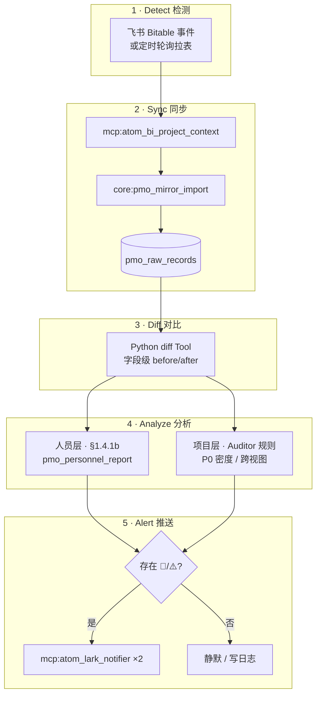
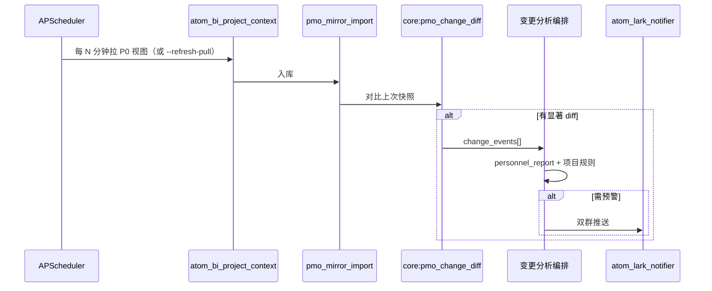

# PMO 临时需求调整 · 变更预警方案

> **这篇文档给谁看？**  
> 产品经理、PMO、后端 / Agent 工程师——想搞懂「飞书表改了之后，AI 怎么分析并预警」，读这一份就够。  
> **版本**：草案 2026-06-05 · 对齐 PMO-Copilot Skill `7.2.x` · v7 镜像库架构。  
> **关联 SSOT**：[`PMO_COPILOT_ARCHITECTURE.md`](./PMO_COPILOT_ARCHITECTURE.md) · [`PMO_DB_REFACTOR_DESIGN.md`](./PMO_DB_REFACTOR_DESIGN.md) §5 · `skills_repo/pmo-copilot/SKILL.md` 分支 B · `SKILL.resource-monitor.md`

---

## 1. 一句话：要解决什么问题？

项目经理希望在 **临时需求调整**（插单、改优先级、改负责人、改交付日、跨 Sprint 挪任务等）发生后，系统能 **自动分析影响并发出预警**，而不是等到周三/周四巡检或手动跑宏观看板才发现问题。

本方案定义：**检测什么、怎么分析、预警说什么、分几阶段落地**，并与现有 v7 能力（§1.4.1b 人员节奏判定、Auditor 交叉审计、resource-monitor 定时巡检）对齐，避免重复造轮子。

---

## 2. 需求拆解（产品分析框架）

接到「临时需求调整 + AI 预警」时，先回答四个问题，再定技术路径：

| 问题 | 目的 | 本方案默认假设 |
|------|------|----------------|
| **什么叫「临时调整」？** | 不同变更类型触发条件与严重度不同 | 见 §3.1 变更类型表 |
| **预警给谁、说什么？** | 决定推送渠道与卡片粒度 | PMO **主群 + 监控群** 双推送；精简预警卡（非三表战报） |
| **数据从哪来才可信？** | 避免 LLM 幻觉 | SSOT = `pmo_raw_records` + Python Tool；跨视图矛盾走 Auditor 规则 |
| **多快要响？** | 实时 vs 轮询 vs 日检 | Phase 0 手动触发 → Phase 1 轮询 diff → Phase 2 Webhook 事件驱动 |

拆完后应明确：**「监控变化」与「判断超负荷」是两层能力**，中间还需要 **变更前后对比（diff）** 和 **整体合理性（Sprint 容量 / 跨视图）** 两层分析。

---

## 3. 业务语义

### 3.1 「临时需求调整」变更类型

| 类型 | 典型飞书字段 | 分析关注点 |
|------|--------------|------------|
| **插单** | 新增行、新 Epic/子任务 | 本 Sprint 新增工作量；新负责人是否已 🚨 |
| **改优先级** | `priority` P2→P0 | P0 密度；是否挤占已在进行的 P0 |
| **改负责人** | `Person in charge/Participant` | 原负责人负荷变化；新负责人 §1.4.1b 判定 |
| **改交付日** | `Expected Delivery Date` / `Start Date` | 是否落入当前 Sprint；是否制造延期链 |
| **改 Sprint** | `Sprint` | 是否跨周挪任务；与 Version Goal 是否一致 |
| **改状态/范围** | `状态` / `Progress` / Requirement 文案 | 产品表 vs 开发表是否倒挂 |

**数据源说明**：监控对象是飞书 **多维表（Bitable）12 视图**，不是 Wiki 文档。视图清单见 `SKILL.md` §1.1。

### 3.2 预警的两条轴线（都要，分开展示）

| 轴线 | 典型信号 | 判定依据 | 现有能力 |
|------|----------|----------|----------|
| **个人负荷** | 插单给 Seth，他本周计划 8 项仅完成 1 项 | **§1.4.1b 节奏判定**（计划周期 × 完成进度 × 当前时间） | `core:pmo_personnel_report` · `SKILL.resource-monitor.md` |
| **整体不合理** | 本 Sprint 新增 3 个 P0；产品「已评审」开发「未开始」 | Auditor：幽灵需求、状态倒挂、Sprint 集合差 | 多 Agent 阶段二 Auditor · Step 6 跨视图 |

**禁止**：用任务条数排名（`COUNT(*)` 最多）直接标 🚨 过载——与 Skill §1.4.1b 及架构 §10.2 一致。

### 3.3 与现有 PMO 分支的关系

| 现有能力 | 分支 / 入口 | 与本方案关系 |
|----------|-------------|--------------|
| 宏观看板三表战报 | 分支 A · `/pmo` · 定时 FanOut | **互补**：变更预警发 **精简卡**，不全量三表 |
| 表格变更预警 | 分支 B · `webhook_table_change`（SKILL §2） | **本方案主路径**；实现尚未闭环 |
| 资源巡检 | `SKILL.resource-monitor.md` · 周三/周四调度 | **兜底**：无表变更也可能已过载 |
| 交互追问 | 分支 C | 人工描述变更时的 **Phase 0** 入口 |

---

## 4. 现状与缺口

### 4.1 已有（可直接复用）

1. **镜像入库**：`mcp:atom_bi_project_context` → `core:pmo_mirror_import` → `pmo_raw_records`（INIT 零 LLM）。
2. **人员 SSOT**：`vewCz1FFJi` + `core:pmo_personnel_report`（B-TOOL 预取）。
3. **Epic / Sprint**：`core:pmo_sprint_epic_report`（C-TOOL 预取）。
4. **§1.4.1b 节奏判定**：Skill 正文 + resource-monitor 子 Skill。
5. **变更队列表**：`pmo_change_queue` schema 已在 `l3_node/tools/pmo_db_tools.py`。
6. **Webhook 架构设计**：[`PMO_DB_REFACTOR_DESIGN.md`](./PMO_DB_REFACTOR_DESIGN.md) 第三层（事件 → 队列 → 增量 Agent）。
7. **Lark 触发**：`l3_node/pmo_lark_trigger.py` 卡片选项 2 → 分支 B 话术；`agent_core._pmo_user_message_suggests_branch_b()` 识别变更预警意图。

### 4.2 缺口（与 PM 话术之间的 gap）

| PM 期望 | 现状 |
|---------|------|
| 改表后 **尽快** 预警 | 仅定时巡检 + 手动触发；**无事件驱动闭环** |
| 知道 **改了什么** | v7 只有镜像快照，**无变更前后 diff** |
| 插单是否 **合理** | §1.4.1b 可判受影响的人；缺「本 Sprint P0 +N」等 **容量级** 规则 |
| Lark 监控 **文档** | 实际应监控 **Bitable 记录**，非 Wiki doc |

### 4.3 实现状态一览

| 组件 | 状态 | 路径 / 说明 |
|------|------|-------------|
| `pmo_change_queue` 表 | ✅ schema 已有 | `pmo_db_tools.py` |
| `pmo_webhook_receiver.py` | ❌ 未实现 | 设计见 `PMO_DB_REFACTOR_DESIGN.md` §5.2 |
| 记录级 diff Tool | ❌ 未实现 | 本方案 §6.2 建议新增 |
| 分支 B Agent SOP | ⚠️ SKILL 已写，编排未专设 | `SKILL.md` §2 分支 B |
| 卡片选项 2 触发文案 | ⚠️ 与 SKILL 分支 B 不完全一致 | `pmo_lark_trigger.py` `_ACTION_MESSAGES["anomaly"]` |

---

## 5. 目标架构

### 5.1 五层流水线

「监控文档变化 → 判断是否超负荷」只是其中一段；完整链路如下：



### 5.2 设计原则（对齐 v7 哲学）

| 能力 | 放在哪 | 为什么 |
|------|--------|--------|
| **字段 diff、严重度打分** | **Python Tool** | 稳定、可单测、可回放 |
| **人员负荷** | **`core:pmo_personnel_report` + §1.4.1b** | 禁止 LLM 临场 JOIN 算过载 |
| **跨视图 / Sprint 容量** | **Auditor 规则子集**（或轻量 Python） | 与宏观看板审计一致 |
| **预警文案** | **LLM 可选**（叙述层） | 只读结构化 JSON，不写 SQL |
| **推送** | **`mcp:atom_lark_notifier`** | 有 🚨 才推；对齐 resource-monitor |

### 5.3 在四大原语中的定位

| 原语 | 变更预警中的角色 |
|------|------------------|
| **Tools** | `core:pmo_mirror_import`、`core:pmo_personnel_report`、`core:pmo_sprint_epic_report`、**待增** `core:pmo_change_diff`（建议名） |
| **MCP** | `atom_bi_project_context`（拉表）、`atom_lark_notifier`（推送） |
| **Skills** | 主 Skill 分支 B；可扩展 `SKILL.change-alert.md` 或在 `SKILL.resource-monitor.md` 旁独立子 Skill |
| **Agent Tasks** | 轻量 ReAct（5～8 轮）或 **宿主 Python 编排**（推荐：diff 后仅 narrate） |

---

## 6. 分析规则（Detect → Alert 细则）

### 6.1 监控范围（建议）

| 优先级 | `source_view` | 用途 |
|--------|---------------|------|
| **P0** | `vewCz1FFJi` | 人员任务 SSOT · 负荷判定 |
| **P0** | `vewpI8lyYw` | 开发 Epic/子任务 · 插单/P0/Sprint |
| **P1** | `vew8TxMcSh` / `vewL9Mofgd` | 产品侧交叉 · 状态倒挂 |
| **P2** | 其余 9 视图 | INIT 全量保留；变更分析按需 |

Phase 1 可先 **P0 三视图** diff，降低噪声。

### 6.2 Diff 层（建议新增 Tool）

**输入**：本次 mirror 前后同一 `record_id`（或 `row_index` + `source_view`）的 `fields` JSON。

**输出**（结构化 JSON 示例）：

```json
{
  "change_id": "uuid",
  "detected_at": "2026-06-05T10:30:00+08:00",
  "source_view": "vewpI8lyYw",
  "record_id": "recXXX",
  "requirement_name": "在线奖励包",
  "change_type": "priority_bump",
  "field_diffs": [
    {"field": "priority", "before": "P2", "after": "P0"},
    {"field": "Expected Delivery Date", "before": "2026-06-15", "after": "2026-06-08"},
    {"field": "Person in charge/Participant", "before": ["Jack Looi"], "after": ["Seth"]}
  ],
  "severity_score": 85,
  "severity_reasons": ["P0_bump", "due_moved_into_current_sprint", "assignee_changed"]
}
```

**实现要点**：

- 快照基线：每次成功 `pmo_mirror_import` 后，对关注视图写 `fields` hash 或 copy 到 `pmo_record_snapshots`（新表，可选）。
- 合并：同一 `record_id` 在 5 分钟内多次变更 → 合并为一条 diff 再分析（对齐 `PMO_DB_REFACTOR_DESIGN.md` Webhook 合并策略）。
- **零 LLM**：diff 本身纯 Python。

### 6.3 严重度规则（Python 规则链）

在 diff 之后、人员分析之前，对每条变更打 `severity_score`（0～100，供排序与静默门控）：

| 规则 ID | 条件 | 加分 |
|---------|------|------|
| R-CHG-1 | `priority` 升至 P0 | +30 |
| R-CHG-2 | 交付日移入 **current_sprint** 内 | +25 |
| R-CHG-3 | 负责人变更 | +15 |
| R-CHG-4 | 新增行且 Sprint = current_sprint | +20 |
| R-CHG-5 | 状态回退（如 开发中→待开始） | +20 |

`severity_score < 40` 且人员层全员 ✅ → **默认静默**（可配置）。

### 6.4 人员层分析（§1.4.1b）

对 `field_diffs` 中涉及的 **所有负责人**（`json_each` 展开，禁止只取 `[0]`）：

1. 调 `core:pmo_personnel_report`（`recent_window: true`）。
2. 在 `personnel_tasks[]` 中筛 **本周期计划任务**，统计 M / K / 延期 L。
3. 结合运行日星期，套用 §1.4.1b 赋 🚨 / 🟡 / ✅，并写 **一句依据**。
4. 若 diff 为插单/改派：在依据句中注明 **「变更后计划 M+1」**（方向性，非硬编码阈值）。

### 6.5 项目层分析（Auditor 轻量子集）

| 检查项 | 说明 |
|--------|------|
| **P0 密度** | current_sprint 内 P0 Epic/子任务计数；相对上次快照 +Δ |
| **跨视图状态** | 同一 Requirement 在产品表 vs 开发表状态是否倒挂 |
| **幽灵需求** | 开发表有、产品池无（或反之） |
| **Sprint 一致性** | 变更后 Sprint 是否仍在 `recent_sprints` 窗内 |

输出写入 `project_risks[]`，格式与 Auditor《风险诊断书》摘要兼容，**不进三表列**。

### 6.6 静默与推送策略

对齐 `SKILL.resource-monitor.md` 哲学：

| 条件 | 行为 |
|------|------|
| diff 后 **无 🚨**、无 ⚠️ 跨视图、severity < 阈值 | **禁止** notifier；日志 `change_alert_result: all_clear` |
| 存在 🚨 或 ⚠️ 或 severity ≥ 阈值 | **双群** `atom_lark_notifier`；`change_alert_result: alert_sent` |
| 分析 Tool 部分失败 | 仍推送，卡片标注 ⚠️ 数据缺口（执行韧性 §4） |

---

## 7. 预警卡片版式（精简）

**禁止**：需求进度全览 / 版本映射三表（属分支 A）。

**建议模板**：

```
title: 【变更预警】YYYY-MM-DD HH:mm · {需求名}

markdown_content:
📌 **变更摘要**
- 需求：{name}
- 类型：{change_type 中文}
- 字段：{field_diffs  bullet 列表}

---

**👥 人员影响**（§1.4.1b）

| 人员 | 本周期计划/完成 | 变更后判定 | 依据 |
| :--- | :--- | :--- | :--- |
| **Seth** | 6 项 / 完成 2 | 🚨 进度落后 | 周四，完成率明显低于时间进度；本次插单 +1 |

---

**⚠️ 项目影响**（若有）
- 本 Sprint P0 需求 4→5
- 产品表「待评审」vs 开发表「开发中」→ 状态倒挂

---

💡 **建议动作**（可选，非自动执行）
- 确认是否从 Seth 挪出低优先级任务
- PM 确认插单是否接受

---
[🔗 开发表](vewpI8lyYw URL) | [🔗 人员看板](vewCz1FFJi URL)
```

推送目标：`config/mcps/atom_lark_notifier/config.yaml` 中 PMO 主群 + 监控群（与 resource-monitor §5 一致）。

---

## 8. 端到端示例

**场景**：PM 在开发表将「在线奖励包」P2→P0，交付日 6/15→6/8，负责人 Jack→Seth。

| 阶段 | 产出 |
|------|------|
| **Diff** | `priority_bump` + `due_moved_into_current_sprint` + `assignee_changed`；severity 85 |
| **人员** | Seth：🚨 进度落后（周四，计划 6 完成 2）；Jack：🟡 负荷减轻 |
| **项目** | P0 +1；产品表仍「待评审」→ ⚠️ 倒挂 |
| **推送** | 双群精简卡；Final Answer `change_alert_result: alert_sent` |

**决策权**：系统在卡片中给 **建议动作**，**不自动改表**。

---

## 9. 分阶段落地路线

### Phase 0 — 低成本验证（1～2 周）

**目标**：验证 PM 要的文案、阈值、推送频率，无新基础设施。

| 项 | 内容 |
|----|------|
| 触发 | Lark 固定话术 / 卡片 2 / `@机器人 插单预警：…` |
| 路径 | 分支 B 或分支 C → `pmo_personnel_report` + 人工描述变更 |
| 推送 | 精简预警卡（§7） |
| 验收 | PM 确认 3～5 个真实插单场景的卡片可读性 |

### Phase 1 — 轮询 diff（推荐优先工程化）

**目标**：伪实时（N 分钟级），无公网 Webhook。



| 项 | 内容 |
|----|------|
| 新增 | `core:pmo_change_diff` Tool；可选 `pmo_record_snapshots` 表 |
| 编排 | `l3_node/jobs/pmo_change_alert_scheduler.py`（或扩展现有 scheduler） |
| 配置 | `PMO_CHANGE_ALERT_INTERVAL_MIN`（默认 15）、`PMO_CHANGE_ALERT_DISABLE` |
| 验收 | 改表后 15 分钟内收到预警；无变更时不推送 |

### Phase 2 — Webhook 事件驱动

**目标**：改完 5 分钟内响应（运维成本更高）。

对齐 [`PMO_DB_REFACTOR_DESIGN.md`](./PMO_DB_REFACTOR_DESIGN.md) §5.2：

1. 飞书开放平台订阅 `bitable.record.updated/created/deleted`（按 `table_id` 过滤 K11 表）。
2. 新增 `l3_node/pmo_webhook_receiver.py`：写 `pmo_change_queue`、立即 HTTP 200。
3. 调度器消费队列 → 单 record 增量拉取 → mirror → diff → 分析 → 推送。
4. 队列积压时同 view 批量合并。

**运维前提**：公网 HTTPS 端点、飞书事件订阅配置。

### Phase 3 — 与宏观看板 / 巡检联动

| 联动 | 说明 |
|------|------|
| resource-monitor | 周三/周四巡检仍作 **无变更场景** 兜底 |
| 分支 A | 变更预警 **不替代** 周报；可在卡片 footer 链到最近战报 |
| Auditor | 宏观看板 Auditor 规则与变更预警 **共用** `project_risks` 检查函数（Python 模块级 SSOT） |

---

## 10. 与 PM 对齐的检查清单（启动前必问）

1. **触发源**：仅 Bitable 字段变更，还是 PM @机器人 才算「临时调整」？
2. **监控范围**：12 视图全监控，还是 Phase 1 仅 P0 三视图？
3. **静默策略**：无 🚨 不推送（推荐），还是每次变更都通知？
4. **预警粒度**：每人一条 / 每次变更一条 / 按 Sprint 日汇总？
5. **「不合理」定义**：仅人力，还是含 P0 密度、跨职能不同步、Version Goal 漂移？
6. **建议动作**：AI 是否允许写「建议从 X 挪任务」（仅文案）？

---

## 11. 代码与文档索引（规划）

| 主题 | 路径 | 阶段 |
|------|------|------|
| 业务 SKILL 分支 B | `skills_repo/pmo-copilot/SKILL.md` §2 | 已有 |
| 资源巡检子 Skill | `skills_repo/pmo-copilot/SKILL.resource-monitor.md` | 已有 |
| 变更队列表 | `l3_node/tools/pmo_db_tools.py` · `pmo_change_queue` | 已有 |
| Webhook 设计 | `docs/architecture/PMO_DB_REFACTOR_DESIGN.md` §5 | Phase 2 |
| Lark 触发 | `l3_node/pmo_lark_trigger.py` | Phase 0 对齐文案 |
| 分支 B 意图识别 | `l3_node/agent_core.py` · `_pmo_user_message_suggests_branch_b` | 已有 |
| **待增** diff Tool | `l3_node/tools/pmo_change_diff.py` · `core:pmo_change_diff` | Phase 1 |
| **待增** 变更调度 | `l3_node/jobs/pmo_change_alert_scheduler.py` | Phase 1 |
| **待增** Webhook | `l3_node/pmo_webhook_receiver.py` | Phase 2 |
| 人员 Tool | `l3_node/tools/pmo_personnel_query.py` | 复用 |
| 执行韧性 | `docs/JACHIN_EXECUTION_RESILIENCE_CONTRACT.md` | 全阶段 |

---

## 12. 风险与约束

| 风险 | 缓解 |
|------|------|
| 飞书 API 限流 / 拉表失败 | 有限重试 + 降级「仅分析上次快照与本地 diff」+ ExecutionBrief |
| diff 噪声（批量编辑） | 5 分钟合并窗口；severity 门控 |
| LLM 误判过载 | **禁止** LLM 算负荷；只 narrate Tool JSON |
| Person 双形态 JSON | 沿用 B-4 UNION + `json_each`（见人员案例 SSOT） |
| 与分支 A 推送守卫冲突 | 变更预警走独立信道 `pmo_change_alert`（不触发三表完整性探针） |

---

## 13. 验收标准（Phase 1 完成定义）

- [ ] 改 `vewpI8lyYw` 优先级/负责人/交付日后，**15 分钟内**（可配置）收到双群预警或明确 `all_clear` 日志。
- [ ] 预警卡含 **变更摘要 + 人员 §1.4.1b 依据句**；无三表战报。
- [ ] 无变更或仅低 severity 且人员全员 ✅ 时 **零 Lark 推送**。
- [ ] 跨视图倒挂时卡片有 ⚠️ 项目影响段。
- [ ] Tool / diff 单测覆盖：priority bump、assignee change、新行插单三类 fixture。
- [ ] 部分 Tool 失败时仍推送并标注缺口（部分成功）。

---

## 14. 修订记录

| 日期 | 说明 |
|------|------|
| 2026-06-05 | 初稿：需求拆解、五层架构、分阶段路线、与 v7 现有能力对齐 |

**案例复盘**（人类可读、含每轮工具与思考过程）：

- [`PMO_CHANGE_ALERT_CASE_STUDY_0605_MAHJONG.md`](./PMO_CHANGE_ALERT_CASE_STUDY_0605_MAHJONG.md) — Gavin「麻将开发」插单预警演练（2026-06-05）
