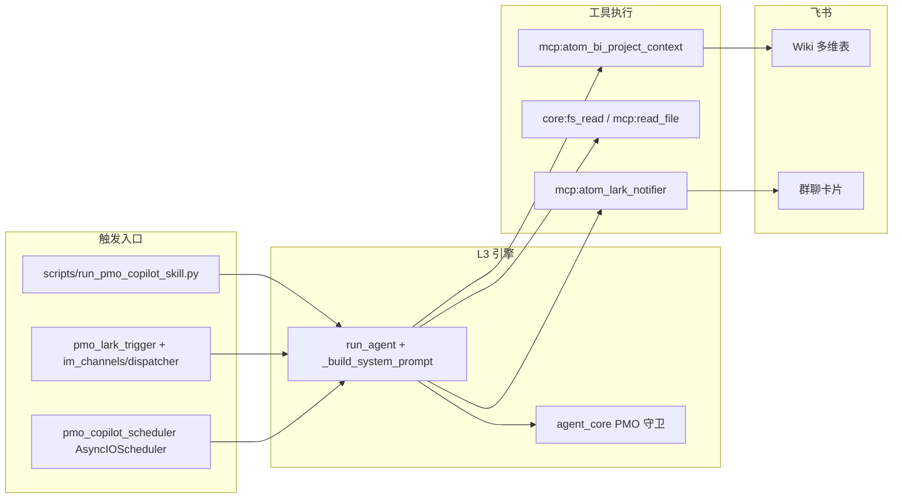
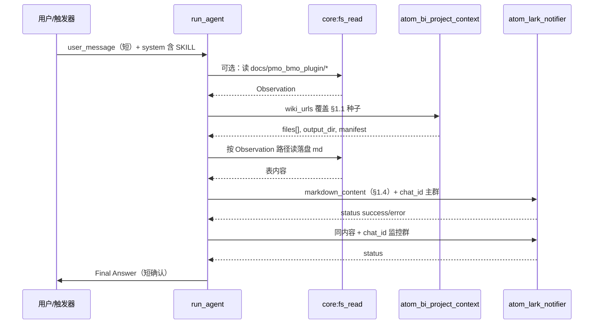

# PMO-Copilot 插件：流程架构与核心代码说明

本文档描述仓库内 **PMO（Project Management Office）看板 / 预警** 相关能力的**运行时架构**：声明式 Skill、触发入口、ReAct 工具链、飞书推送与 **L3 宿主（`agent_core`）专项守卫**。业务口径与卡片正文格式以 **`skills_repo/pmo-copilot/SKILL.md`** 为单一事实来源（SSOT），此处侧重**工程结构**。

---

## 1. 架构总览

PMO 在系统里**不是**独立进程，而是一套 **声明式 Skill + 多入口触发 + L3 `run_agent` ReAct**，依赖以下原语：

| 原语 | PMO 中的角色 |
|------|----------------|
| **Tools** | `mcp:atom_bi_project_context`（拉取飞书 Wiki/多维表）、`mcp:atom_lark_notifier`（发群）、`mcp:atom_web_scraper`（辅轨）、`core:fs_read`（读本地落盘/背景知识） |
| **Skills** | `skills_repo/pmo-copilot/SKILL.md`（宏观看板 / 变更预警）；`SKILL.resource-monitor.md`（资源负荷预警，独立调度） |
| **Agent Tasks** | 一次 `run_agent` 会话内的多轮 Thought / Action / Observation |

高层数据流如下：



### 1.1 并发与工作区隔离（概要）

| 维度 | 现状说明 |
|------|----------|
| **是否「每任务独立沙箱」** | **否**：`run_agent` 与其它入口共享**同一 Python 进程**与**应用根目录**（`JACHIN_APP_ROOT` / 仓库根）。不存在类似容器的 per-`correlation_id` 自动隔离文件系统；并发会话之间主要通过 **会话消息列表**、**metadata** 与 **工具入参**区分。 |
| **拉表落盘目录** | `mcp:atom_bi_project_context`（`sync_bi_project_context`）的目录由配置键 **`output_dir_relative`**（及运行时 merge）决定，相对路径会解析到 **项目根下**；**代码未**把 `correlation_id` / `run_id` **自动拼进**输出路径。默认 `docs/bi_daily_report/bi_project`；PMO SKILL 建议模型在调用时使用带时间戳的目录（如 `~/.jachin/workspace/pmo_lark_pull/<YYYYMMDD_HHMM>/`）以降低不同运行之间的文件混写风险——属于 **SOP 约定**，不是宿主强制规则。 |
| **输出文件命名** | 同一 `output_dir` 内按 **`01_`、`02_`… 序号 + slug** 顺序落盘（见 `tool_bi_project_context.write_md`），**不是** UUID；多次同步到同一目录时序号连续增长，需注意避免不同任务刻意共用目录导致混淆。 |
| **与「Token / 截断」关系** | 巨型 Wiki 导出主要在**磁盘**侧完整保留；**进入大模型上下文**前由 `agent_core` 对 **Observation** 做字符上限控制（见下文 **§9**），避免单次请求撑爆 token 窗口。 |

---

## 2. 声明式 Skill（业务规则 SSOT）

| 路径 | 作用 |
|------|------|
| `skills_repo/pmo-copilot/SKILL.md` | **主 Skill**：YAML frontmatter（`mcp_tools` / `native_tools` / `tools.prefer`）声明工具白名单；正文定义分支 A（宏观看板）、B（变更预警）、数据源 URL、§1.4 卡片结构（摘要 / 三表 / 风险 / 链接）、双群推送约定等。 |
| `skills_repo/pmo-copilot/SKILL.resource-monitor.md` | **资源预警**：周三/周四巡检文案与「有告警才推、全员正常则静默」协议（`resource_monitor_result: all_clear \| alert_sent`）。 |
| `docs/pmo_bmo_plugin/*.md` | Skill 要求按需读取的**前置背景知识**（名册、流程等），非代码路径但属于 PMO 语义底座。 |

**工具白名单解析**：与 PMO 相关的脚本/触发器均通过 frontmatter 生成 `allowed_tools`，再经 `expand_allowed_skills_with_implicit_sqlite_read`、`expand_allowed_skills_with_local_mcp` 扩展后，由 `assemble_tool_pool` 组装运行时工具表（与主 L3 网关一致）。

### 2.1 PMO Skill 运行逻辑与 ReAct 流程

本节说明 **Skill 文件如何变成 system 提示的一部分**、**模型在一轮会话里如何按 SKILL 约束推进**，以及与 **`run_agent` ReAct 循环**、**分支 A/B/C**、**宿主守卫** 的衔接。业务明细仍以 `skills_repo/pmo-copilot/SKILL.md` 为准。

#### 2.1.1 加载与注入（不进用户消息、进 system）

| 步骤 | 行为 |
|------|------|
| 读文件 | 入口（CLI / `pmo_lark_trigger` 等）读取 **`skills_repo/pmo-copilot/SKILL.md`** 全文。 |
| 拆 frontmatter | YAML 段解析出 `name`、`persona`、`mcp_tools`、`native_tools`、`tools.prefer` 等；正文为 Markdown。 |
| 工具白名单 | 由 frontmatter 得到 `base_allow`；再扩展隐式读库 / 本地 MCP 后 `assemble_tool_pool`，模型**只能**从该池里选 `Action` 工具 id（与网关合并规则一致）。 |
| 注入 system | 通过 **`build_gateway_skill_inject`**（或等价路径）生成 `gateway_inject` 块，由 **`_build_system_prompt(..., gateway_inject=...)`** 拼进 **system**；**`user_input`** 仍为短句任务描述（如「按分支 A 拉 §1.1…」），避免每轮用户消息重复携带整份 SKILL。 |
| persona | frontmatter 的 `persona` 与正文中的硬性约定（如 §6 推送闭环、§1.4 版式）一并进入 system，约束模型「像 PMO 协作者」行事。 |

要点：**Skill 是声明式规范 + 人设 + 工具表**，不是可执行代码；真正执行的是 **L3 对工具 id 的 dispatch**。

#### 2.1.2 ReAct 主循环（单会话内「怎么走」）

每一轮大致遵循 L3 通用形态：

1. **Thought**：模型根据 system 中的 PMO 规则、历史 Observation、当前用户意图决定下一步。
2. **Action**：写出工具 **id**（须在白名单内，如 `mcp:atom_bi_project_context`）与 **Action Input**（JSON，符合工具 schema）。
3. **Observation**：宿主执行工具，把结果写回对话（拉表落盘路径、`status`、错误摘要等）。
4. 重复直到模型输出 **`Final Answer:`**，或达到 `max_iterations` / 守卫强制纠偏。

**与 SKILL 硬约束对齐**（摘自 SKILL 精神，非代码分支）：

- 未完成本轮分支交付前，**禁止**用 `Final Answer` 只写「下一步打算」而不 **`Action:`**（见 SKILL「硬性约定」§5）。
- **分支 A/B** 的战报正文主体须在 **`mcp:atom_lark_notifier` 的 `markdown_content`**，**禁止**把完整战报仅写在 `Final Answer` 里冒充已发群（§6；`agent_core` 亦有 `_reject_pmo_false_lark_sent_guard` 等兜底）。

#### 2.1.3 意图路由：分支 A / B / C（SKILL §「一脑三线」）

模型依据 **用户措辞 / 触发源 / 会话上下文** 在三条业务线中择一（或多步内保持一条主线）；Skill §2 给出了步骤级 SOP：

| 分支 | 代号 / 典型场景 | 运行逻辑摘要 |
|------|-------------------|----------------|
| **A** | `cron_daily_report` — 宏观看板 / 定时摘要 / 「默认流程」 | **拉表**：对 §1.1 **产品 2 视图 + 开发 9 视图 + 美术**等种子 URL 调用 `mcp:atom_bi_project_context`（可一次传满 `wiki_urls`，或超时则分批须最终全覆盖）。**聚合**：按 Observation 给出的 `files[]` / manifest **字面路径** `core:fs_read` 读 Markdown，跨表对齐 Epic→Story→Task。**度量**：基于状态/日期列归纳 Sprint、完成度、人员负荷（§1.4.1b）。**推送**：生成 §1.4 结构（首屏摘要 + **三节核心表** + 风险 + 链接 + 追问），**两次** `mcp:atom_lark_notifier`（§1.3 主群 + 监控群）。**收尾**：短 `Final Answer` 确认 Observation 中的推送结果。 |
| **B** | `webhook_table_change` — 表格行变更 / 熔断预警 | 输入视为变更快照；做 **插单校验**、**§1.4.1b 负荷** 相关预警；**必须先 notifier** 再短 Final Answer；版式遵循 SKILL 对分支 B 的紧缩表 + 链接要求。 |
| **C** | `interactive_qa` — 群内追问 / 轻问答 | **实体解析**（名册 §0）→ **在最新拉取结果中检索** → 必要时 **辅轨** `atom_web_scraper`；**短答**为主；若发群则用 §1.4 **浓缩版**。与招聘类意图区分见 SKILL §2 分支 C 第 5 点。 |

**默认**：仅说「按 SKILL / 默认流程」→ 模型按 **分支 A** 执行（拉 §1.1 → §1.4 播报）。

#### 2.1.4 分支 A 推荐轮次顺序（逻辑流水线）

下列顺序是 **SOP 意义上的推荐流水线**；实际轮次可能因模型分步、重试、失败而变多，但 **交付物顺序**应保持一致：



**与宿主守卫的交叉点**（见本文第 5 节）：例如在 **三节表不全** 或 **谎称核心表未同步** 时，`atom_lark_notifier` 可能在真正请求飞书 API 前被拦截，Observation 返回 `pmo_premature_notifier_blocked` 等，模型须继续拉表/读盘直至合规后再推。

#### 2.1.5 前置背景与数据真相源（避免混线）

- **流程/人名/术语**：来自 **`docs/pmo_bmo_plugin/`**（及 SKILL §0），通过 **`core:fs_read`** 按需读取；**禁止**无依据编造。
- **结构化行数据**：以 **`mcp:atom_bi_project_context`** 本轮 **Observation** 为准；读盘路径必须来自 **返回的 `files[]` / `00_SYNC_MANIFEST.json` 字面量**（含 `01_`/`03_` 等前导零），避免臆造文件名。
- **辅轨可视化**：**`mcp:atom_web_scraper`** 仅在 API 维度不足时使用（需 CDP），仍须把证据路径与结论写回可核对形态。

---

## 3. 触发入口（四条路径）

### 3.1 CLI 一键跑 Skill

| 文件 | 说明 |
|------|------|
| `scripts/run_pmo_copilot_skill.py` | 进程内启动 LiteLLM 引擎，解析 `SKILL.md`，构造 `gateway_inject`（`build_gateway_skill_inject`），调用 `_build_system_prompt` + `run_agent`。 |
| 隐式信道 | `implicit_attribution`: `channel=pmo_copilot_cli`，`source=run_pmo_copilot_skill.py`。 |

调试：在 `~/.jachin/jachin_debug/健康skill/` 生成 `pmo_copilot_*.txt` 时间线；若设置环境变量 **`JACHIN_PMO_COPILOT_DEBUG_LOG`**，则由 `l3_node/pmo_copilot_debug_file.py` 追加完整 Action/Observation 大块。

### 3.2 飞书 IM：PMO 双重触发器

| 文件 | 说明 |
|------|------|
| `l3_node/pmo_lark_trigger.py` | **精确触发**：如 `/pmo`、`全量看板` 等 → 直接走 PMO Skill（`channel=pmo_copilot_cli`）。**模糊触发**：匹配进度类口语 → 先发**三选项确认卡片**，用户回复 `1/2/3` 或关键词后异步 `_run_pmo_skill_coro`；选项 3「简单问题」交回普通 `run_agent`（不注入 PMO）。 |
| `l3_node/im_channels/dispatcher.py` | 在 HR 与普通 `run_agent` 之前调用 `try_pmo_lark_intercept`；若返回非空，则 `route=pmo_lark_trigger` 且不再走默认 Agent。 |

`_run_pmo_skill_coro` 要点：读 `skills_repo/pmo-copilot/SKILL.md`，`build_gateway_bundle`（`implicit_attribution` 含 `channel`、`source`、`lark_chat_id`）、`assemble_tool_pool`、`gateway_block` 注入 `_build_system_prompt`，最后 `run_agent`。

### 3.3 通用 L3 会话（网关 / Cursor）

当网关注入的 **system** 中含 `PMO-Copilot` / `pmo-copilot-enterprise`（见 `agent_core._pmo_lark_push_guard_channel_active`），同样启用 PMO 系列守卫（谎称已推飞书、必须先拉表等），与 CLI 共享同一套逻辑。

### 3.4 定时：资源预警（与宏观看板独立）

| 文件 | 说明 |
|------|------|
| `l3_node/jobs/pmo_copilot_scheduler.py` | `AsyncIOScheduler`：**周三 09:30**、**周四 14:00**（Asia/Shanghai）各跑一次 `SKILL.resource-monitor.md`；信道为 **`pmo_resource_monitor_scheduler`**，**不**走宏观看板的「必须双群推送」守卫（有告警才 `atom_lark_notifier`）。日志：`~/.jachin/data/pmo_resource_monitor_log.ndjson`。 |
| `l3_node/http_server.py` | `on_startup` 调用 `init_pmo_resource_monitor_auto_start()`。可用 **`PMO_RESOURCE_MONITOR_DISABLE=1`** 关闭。 |

手工触发：`scripts/run_pmo_resource_monitor_once.py`。

### 3.5 权限与用户鉴别（User Authorization）

**结论**：当前仓库在 **PMO 专用路径**上**没有**实现「按 `user_id` / `chat_id` 白名单才允许分支 A/B/C」的硬编码鉴权；谁能触发，主要由 **飞书租户与应用配置** 决定，Jachin 侧体现为**能力一开启即对能连上机器人的会话可见**。

| 层面 | 行为 |
|------|------|
| **IM（`try_pmo_lark_intercept`）** | 任意把消息投递到**已配置 Lark 机器人**且流经 `im_channels/dispatcher` 的会话，只要 **正则/卡片流程命中** PMO 触发条件，就会启动 PMO Skill；**未见**对 `user_id` 或 `chat_id` 的允许列表校验（`l3_node/pmo_lark_trigger.py` 仅使用 `chat_id` 做会话卡片状态与 `implicit_attribution`）。**不在 PMO 群里的人**在工程上仍受飞书侧限制：未加入群则无法在该群触发；机器人未加入的会话亦无法收消息。 |
| **分支 A / B / C（语义）** | 路由由 **模型 + SKILL §2** 根据用户措辞决定，**不是**按用户角色在代码里分支；**没有**「仅某类 user_id 可跑分支 A」的引擎级开关。 |
| **「敏感数据」与分支 C** | 多维表与 Wiki 数据通过 **已配置的 Lark 应用凭证**拉取（`app_id` / `app_secret`、租户 token）。**读到的行级数据**受飞书 **数据权限 / 应用权限 / 群可见性**约束；**本仓库未**再叠加一层「仅指定 user 可调阅 HR/敏感列」的 PMO 专用 ACL。若需按人的合规控制，应在 **飞书开放平台**（应用可见范围、群成员）、**群与文档 ACL** 或 **前置网关**上实现。 |
| **CLI / 定时** | `run_pmo_copilot_skill.py`、`pmo_copilot_scheduler` 使用**本机/服务账号**凭据运行，与终端或部署 OS 权限绑定，不经过飞书 `user_id` 鉴别。 |

**运维提示**：若要在产品层做「仅 PMO 主群可跑重型分支 A」，需在 **dispatcher 前**增加自定义过滤器（例如环境变量 `PMO_ALLOWED_CHAT_IDS`）——**当前代码未包含该过滤器**，文档如实记录现状以免误判已内置 RBAC。

---

## 4. ReAct 主线程与工具链

典型 **分支 A（宏观看板）** 顺序（Skill 约束，非硬编码）：

1. **`mcp:atom_bi_project_context`**

   - 实现：`l3_node/primitives/mcp/mcp_tools/bi/tool_bi_project_context.py`
   - 按 `wiki_urls`（及 MCP 配置）拉取多维表，落盘 Markdown + manifest；PMO 须在 §1.1 覆盖产品/开发多视图等。
   - 注册：`l3_node/primitives/mcp/registry.py` → `_invoke_atom_bi_project_context_local`。

2. **读盘** — `core:fs_read` / `mcp:read_file`

   - 路径须来自上一步 **Observation 的 `files[]` / `output_dir`**（注意文件名前导零如 `03_` vs `3_`）。

3. **`mcp:atom_lark_notifier`**

   - 实现：`l3_node/primitives/mcp/mcp_tools/bi/tool_lark_notifier.py` → `send_lark_markdown`。
   - 若开启 **`native_table_card`**（默认多为 true）且正文可被解析为 GFM 管道表，则 **`build_schema_v2_card_from_markdown`**（`l3_node/channels/lark/md_native_table_card.py`）生成 **Schema 2.0 `tag:table`**，支持 **`page_size`**（配置文件 **`native_table_page_size`** 或环境变量 **`JACHIN_LARK_NATIVE_TABLE_PAGE_SIZE`**）；否则降级为单块 **`lark_md`**，**无右下角表分页**。
   - Webhook 与 IM（`chat_id`）分支均可能走交互卡片。

4. **辅轨**：`mcp:atom_web_scraper`（需 CDP）— Skill 中用于 OpenAPI 不顺手时的页面级抓取。

---

## 5. L3 `agent_core.py` 中与 PMO 相关的宿主逻辑

下列机制在 **PMO 信道激活** 时参与约束（函数名以仓库为准；行号会随版本变动）：

| 机制 | 作用 |
|------|------|
| `_pmo_lark_push_guard_channel_active` | 判断是否为 `pmo_copilot_cli` 或网关注入 PMO Skill。 |
| `_pmo_branch_a_requires_bi_pull` / `_reject_pmo_branch_a_missing_bi_pull_guard` | 分支 A 意图下，禁止未拉表就输出战报式 Final Answer。 |
| `_reject_pmo_branch_a_post_bi_fs_stall_guard` | 拉表已成功但仍「 stalls」在读盘步骤时的纠偏。 |
| `_reject_pmo_branch_a_board_without_notifier_guard` | 禁止把完整战报只写在 Final Answer 而不走 `atom_lark_notifier`。 |
| `_reject_pmo_false_lark_sent_guard` | 禁止 Final Answer 声称已发飞书但本轮无成功 Observation。 |
| `_pmo_branch_a_blocked_premature_lark_observation` | 在调用真实飞书 API **之前**拦截：**三节表不全**或**拉表已成功却谎称核心表未同步**的试错推送，返回结构化 error Observation。 |
| `_pmo_sanitize_atom_lark_notifier_inp` | 修正易与「冒烟战报」冲突的标题。 |
| **元数据**：`ctx.metadata` 如 `_pmo_bi_project_context_invoked`、`_pmo_bi_project_context_ok`、`_pmo_atom_lark_notify_ok` 等用于上述守卫。

**注意**：守卫纠正的是 **对话与工具语义**；飞书侧消息格式仍以 `tool_lark_notifier` 与 Skill 为准。

---

## 6. 配置与环境（运维速查）

| 位置 | 用途 |
|------|------|
| `config/mcps/atom_lark_notifier/config.yaml`（或 `~/.jachin/config/...` 覆盖合并） | 机器人凭证、`default_chat_id`、**`native_table_card`**、**`native_table_page_size`**、`lark_use_feishu`（国际 Lark 多为 `false`）等。 |
| `config/mcps/atom_bi_project_context/config.yaml` | Wiki 种子、拉取上限、`lark_use_feishu` 等。 |
| `.env` | `PMO_PRIMARY_CHAT_ID`、以及合并进 notifier 配置的占位符。 |
| 环境变量 | `JACHIN_LARK_NATIVE_TABLE_CARD`、`JACHIN_LARK_NATIVE_TABLE_PAGE_SIZE`、`JACHIN_PMO_COPILOT_DEBUG_LOG`、`JACHIN_LARK_NATIVE_TABLE_MAX`（单卡最大原生表张数，默认 5）、`PMO_RESOURCE_MONITOR_DISABLE`。 |
| 宿主护栏 / 大表 | **`JACHIN_REACT_OBSERVATION_MAX_CHARS`**（默认 15000）、**`JACHIN_BITABLE_RECORD_HARD_CAP`**、**`JACHIN_BI_WIKI_DISCOVER_BUDGET`** 等；详见 **§9**。 |

---

## 7. 测试与回归

| 文件 | 覆盖点 |
|------|--------|
| `tests/unit/test_pmo_false_lark_claim_regex.py` | Final Answer「谎称已推送」检测。 |
| `tests/unit/test_pmo_futile_answer_stall_regex.py` | 「只说不做」类 stall 提示。 |
| `tests/unit/test_pmo_premature_lark_block.py` | 中途飞书推送拦截（`pmo_premature_notifier_blocked` / `pmo_false_sync_claim_blocked`）。 |

---

## 8. 与「四大原语」文档的关系

PMO 不新增第五原语：多轮编排属于 **Agent Tasks（`run_agent`）**；飞书多维表拉取/播报属于 **Tools（MCP + Native）**；`SKILL.md` 属于 **Skills**。详见仓库 `docs/Jachin 视角的「四大原语」终极架构规范.md` / `docs/FOUR_PRIMITIVES.md`。

---

## 9. Token 管理与性能优化策略

本节说明：**Wiki/多维表全量**主要在磁盘侧展开，**进入 LLM 的请求**由宿主侧护栏限制，以降低 **上下文 token 超限** 与 **过大 Observation 拖垮单次 API** 的风险；**不**等同于在工具内实现向量裁剪或流式摘要（若需「先摘要再思考」，须由模型 ReAct 多轮读文件或另建流水线）。

### 9.1 工具层（`mcp:atom_bi_project_context`）——控制「源数据体积」

| 机制 | 说明 |
|------|------|
| **表级行数上限** | `max_records_per_table`（配置中常见默认 **50000**）与硬顶 **`JACHIN_BITABLE_RECORD_HARD_CAP`**（默认 **250000**）取较小；分页拉取直至无下一页或触顶（见 `tool_bi_project_context.sync_bi_project_context` 文档串与实现）。 |
| **发现链接预算** | **`JACHIN_BI_WIKI_DISCOVER_BUDGET`**（代码常量 `DISCOVERED_NODE_BUDGET`，默认 **200**）限制百科子节点 / 正文内链展开规模，避免跟链爆炸。 |
| **落盘而非全进模型** | 同步结果写入 **`output_dir`** 下多个 `NN_slug.md`；完整正文保存在文件系统，**模型通过后续 `core:fs_read` 按需读取**，而不是假定整份库装进一轮 Observation。 |
| **进程内存** | Python 侧主要为流式拼接字符串与写文件；极端宽表仍可能占用较多内存，主要由 **行数硬顶 + 发现预算**缓解；**未**在工具内单独设「进程 RSS 硬上限」。 |

### 9.2 引擎层（`l3_node/agent_core.py`）——控制「进入模型的 Observation」

| 机制 | 说明 |
|------|------|
| **单条 Observation 字符上限** | 默认 **`JACHIN_REACT_OBSERVATION_MAX_CHARS` = 15000**（`MAX_REACT_OBSERVATION_FOR_LLM`）。超长内容在写入对话历史、再次调用 LLM 前会被 **截断**（见 `_truncate_observation_for_llm` / `_effective_observation_max_len`）。 |
| **按下一跳模型放宽** | `_react_observation_cap_chars_for_model_name` 可按模型 id 提高上限（如对 **qwen3.5-plus** 等默认可到 **数十万字符量级** 的可配档），与 DashScope 理论 token 窗口「仅弱相关」，本质是 **宿主侧防撑爆请求/账单护栏**。 |
| **按工具类型** | 例如 **`mcp:fetch`** 可走独立上限 **`JACHIN_REACT_OBSERVATION_MCP_FETCH_MAX`**（默认量级 **120000**）；Playwright 类观测有更高一档（`MAX_REACT_OBSERVATION_PLAYWRIGHT_MCP`）。**`atom_bi_project_context` 若未单独分类，则走通用/模型档**，大表 Observation 列表路径可能被截断——因此 PMO SKILL 强调用 **manifest / `files[]` 字面路径** 再 **分文件 read**，而不是依赖一轮 Observation 带全长表体。 |
| **全会话 token 预算（可选）** | `nexus_config.json` 中 `agent.main_max_total_tokens` / `agent.sub_agent_max_total_tokens` 与 **`_llm_token_budget_for_run`**：子 Agent 默认有累计上限（主路径可为空表示不强制）。用于长对话防失控，与单次 Wiki 体积 **配合**而非替代 Observation 截断。 |
| **ReAct 轮次上限** | `MAX_REACT_ITERATIONS`（默认 **8**）限制工具调用轮数，防止无限工具循环 **间接**耗尽 token。 |

### 9.3 数据量极大时：截断发生在哪一层？Agent 怎么做？

「无敌大」在 PMO 里要分清 **四种不同刻度**，避免把 **飞书卡片翻页**、**拉表行数上限**、**LLM Observation 截断** 混为一谈：

| 层次 | 典型机制 | 是否「截掉业务数据」 | Agent / 用户可见效果 |
|------|----------|----------------------|------------------------|
| **① 飞书多维表拉取（工具）** | `max_records_per_table` 默认 **50000**，再与 **`JACHIN_BITABLE_RECORD_HARD_CAP`**（默认 **250000**）取小；单视图超过上限时 **停止继续分页**，落盘的 Markdown **最多只含到上限以内的行**。 | **是（源侧硬顶）** | SKILL §1.1 写明：超限则 **日志提示截断**，可在 **MCP YAML / config** 中调高上限。**不是** Agent 智能裁剪，是 **工具参数 + 环境变量**。 |
| **② 磁盘文件** | 落在 `output_dir` 的 `NN_*.md` 即本轮同步的**完整可用导出**（在 ① 的范围内）。单文件可极大（MB 级），**不**自动再抽样。 | 受 ① 限制，而非二次随机删行 | 模型用 **`core:fs_read` 整文件读取**（无行号区间参数）；见表下 **「补充」**：超大单文件的 read 结果进对话时仍可能触发 **③** 截断。 |
| **③ 写入对话的 Observation（引擎）** | **`JACHIN_REACT_OBSERVATION_MAX_CHARS`** 等对 **返回给下一跳 LLM 的字符串**做 **硬性截断**（`_truncate_observation_for_llm`）。 | **是（上下文侧截断）** | **`atom_bi_project_context` 的大段 JSON/路径列表**在对话里可能被截掉尾部；**完整表体不在 Observation 里**，而在 **磁盘文件** 里。Agent **不会** magically 消化全长，除非再走 **`fs_read`**。 |
| **④ 飞书卡片 `native_table` 的 1/N 翻页** | `native_table_page_size`（如 **4**）只控制 **卡片控件每屏可见行数**。 | **否** | SKILL 强调：**「每页约 4 条」≠ Markdown 只允许 4 行**；`markdown_content` 须写入 **全量行**，由客户端翻页展示。**禁止**为省事只写前几条（§1.4.1 / 反偷懒自检）。 |

**归纳**：**真正会「少掉行」的**主要是 **① API 行数硬顶**；**③ 只影响模型当场「看到了多少字」**，完整数据仍在 **② 文件** 中，应用 **`fs_read` 分文件、多轮** 补齐推理依据。**④ 只是 UI 分页**，不减免 SKILL 要求的「表里写全」。

**补充**：`core:fs_read` 实现为 **整文件 `read_text`**（无内置行号区间参数）。若单份 `NN_*.md` 仍极大，**单次 read 的返回值**在写入下一轮 messages 时 **同样可能被 Observation 字符上限截断**（与 **③** 同类）。超大单文件的可靠处理方式仍是：**调高宿主 Observation 上限 / 换更大上下文模型档**、**把拉表拆成更多视图/多次 output_dir**、或 **在产品上要求飞书视图级过滤**，而不是假定「读一次文件 = 模型见全文」。

### 9.4 `SKILL.md` 里有没有声明？与上述如何对齐？

| SKILL 中的位置 | 声明内容（摘要） | 与代码的关系 |
|----------------|------------------|--------------|
| **§1.1（种子与视图）** | 单视图行数超过 `max_records_per_table` / 硬顶时 **日志会提示截断**，可调 MCP 配置抬高。 | 对应 **①**；**Skill 显式承认**源侧可能有截断。 |
| **§1.3 / §1.4.1** | **飞书原生表「1/N」分页**仅影响 **展示**；战报 Markdown **必须**包含 **全部**一级需求行、**全部**人员行等，**禁止**因版面或误解「每页 4 条」而 **少写行**。 | 对应 **④**；Skill **禁止**把 UI 分页当成可以少写数据的借口。 |
| **硬性约定 §6（部分表失败）** | 某张表失败或为空时，仍要推送并在摘要 **⚠️** 说明缺口，**禁止**以「不全」为由在完成三节骨架前 **跳过 notifier**。 | 讲的是 **可用性 / 诚信交付**，不是 Observation 字节截断；与 **③** 互补：即便 Observation 被截断，仍应通过 **读盘** 尽量对齐表意。 |
| **（未写进 SKILL）** | **`JACHIN_REACT_OBSERVATION_MAX_CHARS`**、按模型放大 Observation 上限、**`MAX_REACT_ITERATIONS`** 等 | 属 **L3 宿主实现细节**；PMO Skill **不逐个枚举**这些变量，但 **§1.1** 已覆盖 **拉表截断**，**§1.4** 已覆盖 **战报不得人为截断行**。运维调优以本文 **§6 / §9** 与 `agent_core` 为准。 |

**实践要点（重申）**：拉表后 **永远以 `files[]` / manifest 路径** 为准做 **`fs_read`**；若某轮 Observation 看起来「只有半截」，**优先假设被宿主截断**，用读文件续完，再生成 **全量 Markdown 表** + **`native_table_card`** 发群。

---

## 10. 容灾与熔断机制

### 10.1 大模型（LLM）侧

| 项目 | 说明 |
|------|------|
| **模型链** | `LiteLLMEngine` 维护 `model_name` + `fallback_models`（可由环境与 `sanitize_llm_fallback_models` 清洗）。 |
| **单次 completion 尝试次数** | `max_attempts`（构造参数，**默认 2**）：在 `models_to_try` 链上循环；失败时可切到 **fallback** 模型（日志中可见 `phase=fallback_resilience` / `fallback_chain`）。 |
| **与 ReAct 的关系** | **一层**是「单次 LLM 调用」的重试/换模；**另一层**是 `run_agent` 的 **ReAct 迭代**（默认最多 **8** 轮）：工具报错 Observation 后模型可改策略再试，**不是**同参无限重试（符合仓库《执行韧性》中「有限次后换策略」的精神）。 |

### 10.2 飞书 / MCP 工具侧

| 项目 | 说明 |
|------|------|
| **HTTP 超时** | 例如 `atom_lark_notifier` 侧可配置 **`http_timeout`**（示例 **60s**），避免长时间挂死；**不等于**业务层自动重发三次。 |
| **拉表/发群失败** | 错误以 **`status: error`**、manifest `errors[]` 或 Observation 文本返回；由 **下一轮 ReAct** 决定是否重试、分批拉取或 `Final Answer` 如实告知。**宿主未**对 Lark API 做统一的指数退避「全局熔断器」封装（以当前实现为准）。 |
| **PMO 守卫** | `pmo_premature_notifier_blocked` 等 **不是**下游宕机恢复，而是 **语义护栏**：防止半成品推送；API 全挂时仍应先收到 **错误 Observation**，由模型输出可操作建议。 |

### 10.3 「熔断」在 PMO 语境下的可操作含义

- **LLM 服务商大面积故障**：依赖 **`fallback_models`** 与 **`max_attempts`**；全部失败则该轮无有效 Thought/Action，任务表现为 **中断或短错误总结**（视 `run_agent` 错误处理路径而定）。  
- **飞书 API 限流/宕机**：工具返回错误；建议在业务上 **错峰重试**、检查租户 token / 应用发布状态（`agent_core` system 提示中亦包含权限发布类引导）。  
- **无**独立的「PMO 专用 circuit breaker 单例」在本文档覆盖范围内——若后续引入，应在 `docs/JACHIN_EXECUTION_RESILIENCE_CONTRACT.md` 与实现处同步。

---

## 12. 整体评价 + 已知问题诊断与改进建议

> **写给所有人看的版本**：这一节用尽量通俗的语言解释 PMO 插件做得怎么样、哪里出了问题、为什么出问题、怎么修。

---

### 12.1 整体评价

#### ✅ 做得好的地方

| 方面 | 具体表现 |
|------|----------|
| **设计理念清晰** | 用"声明式 Skill"把业务规则集中写在一个文件（`SKILL.md`）里，改需求只改这一处，不需要动代码。这个思路非常好。 |
| **数据不造假** | 通过多处"硬性约定"（如 persona 里的「你不臆造表格数据」）反复要求 AI 只说 Observation 里有的内容，防止胡编数据。 |
| **防提前推送** | `agent_core` 里专门有守卫（`_pmo_branch_a_blocked_premature_lark_observation`），避免 AI 在表格数据还没拉完时就把半成品发到群里——这个机制很实用。 |
| **覆盖面广** | 产品 2 个视图 + 开发 9 个视图 + 美术 3 张表，数据来源清晰详尽，SKILL 里还明确标注了哪些表要排除（防止干扰）。 |
| **推送双群** | 强制推送到主群 + 监控群，且有守卫防止「只写在回答里冒充已推送」。 |

#### ❌ 存在的结构性问题（正是导致下方三个 Bug 的根本原因）

| 问题 | 通俗解释 |
|------|----------|
| **规则太多、AI 执行力跟不上** | SKILL.md 非常详细，但 AI 在一次对话里真正能读完、记住、严格执行的内容有限。规则写在 system 提示里，AI 每轮都要重新"理解"，很容易在细节上打折扣。 |
| **对 AI 读文件的信任过于乐观** | SKILL 要求读 12+ 个视图文件并交叉核对，但 AI 每读一个文件就消耗一轮（最多 8 轮），根本不够用。即使够用，读大文件时内容也会被系统截断（只能看到前 15000 字），AI 却可能假装「已全部读完」。 |
| **没有强制检查机制** | 对 AI 是否「读对了文件」「用了正确的视图数据源」没有宿主层的硬性核验，只靠 AI 自己自检，自检经常失效。 |

---

### 12.2 问题一诊断：需求进度全览 — 找错需求 + 没有翻页

#### 症状
发出去的"需求进度全览"表里的需求条目不对，而且卡片没有「1/N 翻页」箭头。

#### 🔍 找到的根本原因

**原因 A：AI 在读错视图的文件**

SKILL.md 规定，「需求进度全览」的主数据来源是飞书视图 **`vewpI8lyYw`**（开发计划·核心版本需求，包含全公司所有需求的顶层行）。

但是 AI 在实际执行时，很可能把 **`vew8TxMcSh`**（产品部门任务视图）的文件当成了主轴来用——因为这个文件通常排在拉表结果的前面、名字里有「产品」字样，AI 容易优先拿它来填表。

**`vew8TxMcSh` 是产品部门工作分配视图，里面只有产品侧的任务子项，不代表全公司需求。** 这就是为什么表里的需求总是感觉「不对」——它从一开始就用了错误的数据源。

SKILL.md 里明确写了（§1.4.2）：
> `vew8TxMcSh` 仅作产品侧补充，其子任务不得单独拆成需求行填入此表。**严禁**把美术表的设计任务混入。

但 AI 没有严格执行这条规则。

**原因 B：翻页没生效——`native_table_card` 没有被显式传入**

SKILL.md §1.3 写明：
> **PMO 每次 `mcp:atom_lark_notifier` 的 Action Input JSON 务必显式带 `"native_table_card": true`**

翻页（右下角「1/N」箭头）只有在满足以下**全部三个条件**时才会出现：
1. Action Input 里 **显式传了** `"native_table_card": true`
2. 本地配置文件 `~/.jachin/config/mcps/atom_lark_notifier/config.yaml` 里没有把这个选项覆盖成 `false`
3. `markdown_content` 里的表格是**裸写的 GFM 管道表**（`| 列1 | 列2 |`），**没有**被 ``` 代码围栏包住

实际运行中，AI 经常：
- 忘记带 `"native_table_card": true`（于是退回没有翻页的 `lark_md` 模式）
- 或者把整段表格用 ` ``` ` 包了起来，导致宿主解析失败，也退回无翻页模式

#### 💡 改进建议

| 编号 | 建议 | 谁来做 |
|------|------|--------|
| B1-1 | 在 SKILL §1.4.2 「需求进度全览」段落**最开头**用加粗警告框写明：「**主数据源 = `vewpI8lyYw` 文件，禁止用 `vew8TxMcSh` 替代**」，并列举产品视图文件名关键词，帮助 AI 识别并排除 | 改 SKILL.md |
| B1-2 | 在 SKILL 自检清单里加一条：「是否用的是含 `vewpI8lyYw` 关键词的 md 文件？若用的是含 `vew8TxMcSh` 的文件，立即重新选择」 | 改 SKILL.md |
| B1-3 | 在 SKILL §1.3 推送规范后增加一行**必填参数示例**（如 `{"native_table_card": true, "title": "...", "markdown_content": "..."}`），比单纯文字描述更不容易被 AI 遗漏 | 改 SKILL.md |
| B1-4 | 检查 `~/.jachin/config/mcps/atom_lark_notifier/config.yaml`，确认 `native_table_card: true` 且未被覆盖为 `false` | 运维操作 |

---

### 12.3 问题二诊断：人员任务矩阵 — 只显示产品部 + 格式混乱

#### 症状
人员任务矩阵里只有产品部的人，没有开发、美术、设计的人；格式也不符合要求（如任务名跑到第三列、用彩色圆圈代替了【P0】标签等）。

#### 🔍 找到的根本原因

**原因 A：AI 没有用正确的视图生成人员列表**

SKILL.md §1.4.1 写明，人员任务矩阵的**唯一主数据源**是：

> **`vewCz1FFJi`**（人工看板_按员工任务与执行情况）

这个视图是以"人"为维度来组织数据的，能看到全公司所有参与人的任务分配。

但 AI 最可能犯的错误（也是 SKILL 明确"禁止"的）：
> **禁止**仅从 `vewpI8lyYw` 或 `vew8TxMcSh` 的责任人列反推各人任务全集

也就是说，AI 很可能没有去读 `vewCz1FFJi` 的文件，而是从别的视图（如开发计划视图或产品视图）里找到"这个需求的负责人是谁"，然后反向推出"某人有什么任务"——这种方法**只能找到被指定为负责人的人，漏掉了执行人，且产品视图里只有产品部的负责人**，所以就只显示了产品部的人。

**原因 B：`vewCz1FFJi` 文件的数据被截断，AI 只看到了前几行**

如前文所述，`core:fs_read` 返回整个文件内容，但引擎有字符上限（默认 **15000 字符**）。如果 `vewCz1FFJi` 导出的 md 文件较大，AI 可能只看到了文件的前面一部分——而文件里的人员排序可能恰好是产品部在前，开发和美术在后，被截断后就完全消失了。

**原因 C：格式规则太细、AI 自检失效**

SKILL 里关于格式的规定非常细致（第二列放任务、第三列只放状态结论、用【P0】不用🔴等），但这些规则在 system 提示里占据篇幅大，AI 在进行复杂推理之后很容易把细节规则"忘掉"，导致格式乱。

#### 💡 改进建议

| 编号 | 建议 | 谁来做 |
|------|------|--------|
| B2-1 | 在 SKILL 分支 A 拉表步骤里明确要求：**在拉完全部视图之后，必须单独做一次 `core:fs_read` 读取含 `vewCz1FFJi` 关键词的文件，并在 Thought 里验证读到的人员数量是否涵盖所有部门（产品/开发/设计）** | 改 SKILL.md |
| B2-2 | 人员矩阵格式规则（第二列 vs 第三列、【P0】vs 🔴）**单独提炼成一个 2~3 行的「速查小框」**，放在 §1.4.2 对应段落的最开头，而不是埋在长段文字里 | 改 SKILL.md |
| B2-3 | 考虑将 `JACHIN_REACT_OBSERVATION_MAX_CHARS` 适当提高（或对 `atom_bi_project_context` 工具的 Observation 单独设更高上限），或将人员视图拆分为多次读取请求，避免截断 | 运维/代码层 |
| B2-4 | 在宿主守卫（`agent_core`）里考虑加一条检测：如果人员矩阵输出行数 < 3，触发警告 Observation 提示 AI「人员数量过少，请检查是否用了 `vewCz1FFJi` 视图」 | 代码层（中级难度） |

---

### 12.4 问题三诊断：深度分析不足 + 数据不精确

#### 症状
AI 给出的分析感觉很"表面"，找不到真正重要的问题；猜测是因为数据太多被截断导致分析浅。

#### 🔍 找到的根本原因

**这个猜测是正确的，但不止这一个原因：**

**原因 A：读大文件时数据确实被截断了（核心原因）**

整个 PMO 分支 A 流程需要读取 **12+ 个视图文件**，每个文件可能有几万字。但是：
- `core:fs_read` 读整个文件返回给 AI，但引擎会把 Observation 截断到 **15000 字符**（默认值）
- **15000 字符大约是一个中文文件的前 50~100 行**
- 对于有数百行的多维表导出文件，AI 实际上只能看到最前面的 50~100 行，后面的内容**完全不可见**
- 但 AI 不会告诉你"我只看到了前100行"——它会用看到的部分数据继续分析，产出一个看起来正常但覆盖不全的结果

打个比方：**就像你让一个分析师研究一份 200 页的报告，但实际上只给了他第 1~5 页，他不知道报告还有 195 页，所以交出了一份基于前 5 页的「完整分析」。**

**原因 B：ReAct 最多 8 轮，不够用来读 12 个文件**

默认 `MAX_REACT_ITERATIONS = 8`，意味着整个任务从开始到发群最多只有 8 个"思考→工具调用"的轮次。

一次完整的分支 A 流程需要：
- 1 轮：读前置背景文档
- 1~2 轮：调用 `atom_bi_project_context` 拉表（可能要分批）
- 4~6 轮：逐个 `fs_read` 关键视图文件（12 个文件至少需要 4~6 次）
- 1 轮：调用 `atom_lark_notifier` 推送主群
- 1 轮：调用 `atom_lark_notifier` 推送监控群

**加起来轻松超过 8 轮。** 超过后 AI 被强制输出 Final Answer，于是在数据还没读完的情况下就生成了分析，深度自然不够。

**原因 C：没有做真正的「跨表比对」**

SKILL 要求：
- 需求进度的参与人要用 `vewCz1FFJi` 交叉核对
- 美术板块需要综合三张不同的表
- 完成度需要结合甘特表 `vew4Im7GO3`、已完成表 `vewpxQxeGw`、未完成表 `vewQKcyDAV` 共 4 个视图

但受限于轮次和截断，AI 实际上很可能只读了 1~2 个文件就开始写分析，**跨表比对根本没有真正发生**，输出的是基于单个视图片段的"浅层归纳"，而不是真正的多表交叉分析。

#### 💡 改进建议

| 编号 | 建议 | 优先级 | 谁来做 |
|------|------|--------|--------|
| B3-1 | **把 `MAX_REACT_ITERATIONS` 从 8 调高到 16 或更高**（对 PMO 信道专门配置）。分支 A 本来就是重型任务，8 轮不够用是结构性问题 | 🔴 高 | 代码/配置 |
| B3-2 | **把 `JACHIN_REACT_OBSERVATION_MAX_CHARS` 对 PMO 信道单独提高**（如 60000 甚至更高）。现有 15000 的上限对大型多维表完全不够；或者为 `atom_bi_project_context` 工具设置独立的更高上限 | 🔴 高 | 代码/配置 |
| B3-3 | 在 SKILL 分支 A 步骤里**明确告知 AI 可能面临的截断风险**，并要求：「如果读取某个视图文件后，Observation 以 `...` 或截断提示结尾，必须在下一轮 Thought 里写明「该文件已被截断，分析结论仅基于前半部分，存在数据盲区」，并在推送的卡片首屏用 ⚠️ 注明」 | 🟡 中 | 改 SKILL.md |
| B3-4 | 考虑把「拉表 + 读文件」这两步拆成一个**专用子 Agent**（`core:submit_background_task`），让它在后台把所有视图的关键字段摘要提炼出来，再由主 Agent 负责生成战报。这样可以绕开 8 轮限制 | 🟡 中 | 架构改进（中长期） |
| B3-5 | 在 `atom_bi_project_context` 的 Observation 里**增加摘要字段**（如每个文件的行数、关键列名列表、负责人数量），让 AI 不需要读整个文件也能知道每个视图里有什么数据，从而更智能地决定读哪个文件 | 🟡 中 | 工具层改进 |

---

### 12.5 三个问题的「一句话总结」

| 问题 | 根本原因（简单版） | 最快能解决的办法 |
|------|---------------------|-----------------|
| **需求进度找错需求** | AI 用了产品视图（`vew8TxMcSh`）而不是应该用的开发全量视图（`vewpI8lyYw`） | 在 SKILL 里用加粗警告明确禁止，并加到自检清单 |
| **需求进度没有翻页** | 推送时没有带 `native_table_card: true`，退回了无翻页模式 | 在 SKILL 里加必填参数示例；检查本地配置文件 |
| **人员矩阵只有产品部** | AI 没读 `vewCz1FFJi`（全员视图），从别的视图反推人员，或读了但被截断只看到产品部那几行 | SKILL 里加强制读取步骤；提高 Observation 字符上限 |
| **格式不对** | SKILL 格式规则太长，AI 在复杂推理后忘记细节 | 把格式规则提炼为短速查表放在最显眼位置 |
| **深度分析不足** | 8 轮迭代 + 15000 字截断，AI 根本看不完数据就被迫输出结果 | 提高迭代轮次上限；提高 Observation 字符上限 |

---

### 12.6 最优先要做的三件事

> 不需要改代码，只改配置和 SKILL.md，就能解决大部分问题：

**第一件：检查并修改本地配置文件**

打开 `~/.jachin/config/mcps/atom_lark_notifier/config.yaml`，确认有以下两行：
```yaml
native_table_card: true
native_table_page_size: 4
```
如果没有或被设置成 `false`，立即修改。这是解决「翻页不出现」最直接的方法。

**第二件：调高两个环境变量**

在 `.env` 或运行环境里加入：
```
JACHIN_REACT_OBSERVATION_MAX_CHARS=60000
```
这会让 AI 每次读文件时能看到的内容增加 4 倍，大幅改善截断问题和深度分析质量。

**第三件：在 SKILL.md 的需求进度全览段落最开头加一个警告**

在 `SKILL.md` §1.4.2 里「📊 需求进度全览」段落的最开头加：

```
⚠️ 主数据源铁律：只能读含 `vewpI8lyYw` 关键词的 md 文件。含 `vew8TxMcSh` 的文件是产品部视图，
禁止用来填充需求进度全览表。如果你当前读的文件名中没有 `vewpI8lyYw`，立即停止，
重新查找正确的文件再继续。
```

---

## 11. 文档维护

- 业务规则、表格列、数据源 URL、分支定义变更：**只改** `skills_repo/pmo-copilot/SKILL.md`（及资源预警 `SKILL.resource-monitor.md`），本文仅同步**架构与代码锚点**。
- **§2.1（运行逻辑）** 应与 SKILL 中 **「一脑三线」§2、硬性约定、§1.4** 保持一致；分支步骤或默认分支变化时，优先改 SKILL，再在此节更新摘要表与序列图说明。
- **§9 / §10** 与 `agent_core`、`llm_client`、`tool_bi_project_context` 行为强相关；变更宿主护栏或 LiteLLM 默认参数时，应同步更新本节；**§9.3 / §9.4** 与 `skills_repo/pmo-copilot/SKILL.md` §1.1 / §1.4 及 **「分页 vs 行数」** 口径需同时核对。
- 若新增触发方式或宿主守卫，请在本文件「触发入口」「agent_core」两节补充路径与函数名。

---

*说明：面向仓库当前结构整理；具体行号请以 IDE 搜索为准。*
