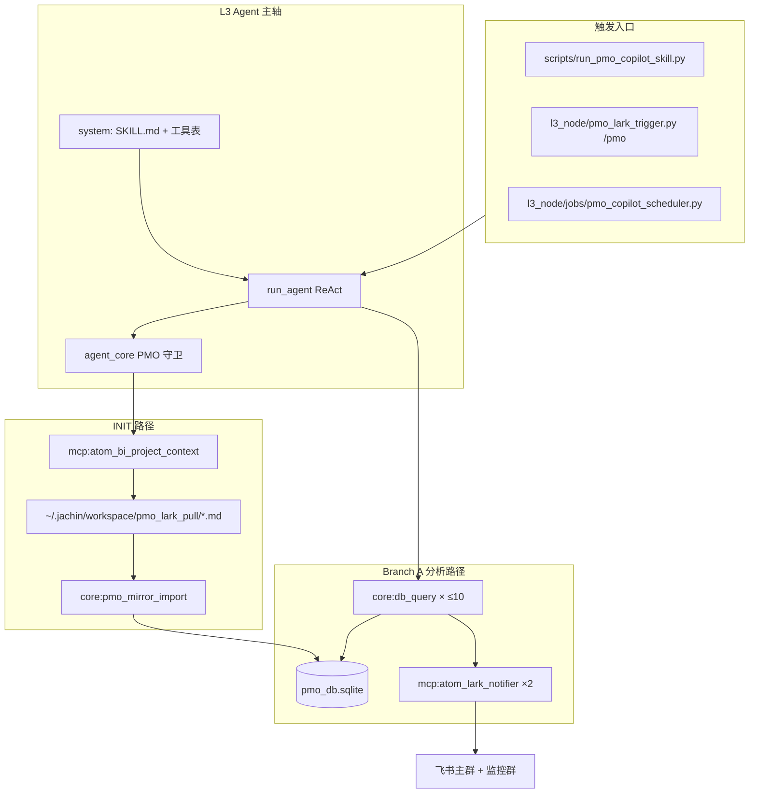

# PMO-Copilot 架构说明（v7）

> **读者**：产品、PMO、新加入的后端/Agent 工程师。  
> **SSOT 分工**：业务规则与 SOP → `skills_repo/pmo-copilot/SKILL.md`；镜像表结构 → `l3_node/tools/pmo_db_tools.py`；宿主护栏 → `l3_node/agent_core.py`；本文描述**当前实现的全貌**与三者如何协作。  
> **版本**：Skill `7.2.3` · 架构文档 2026-05-28 重写。

---

## 1. PMO-Copilot 是什么

PMO-Copilot 是 Jachin L3 上的 **领域 Skill 包**，面向 K11 项目的飞书多维表（产品 / 开发 / 美术 / 人员看板），自动完成：

1. **拉表入库（INIT）**：从飞书 Wiki 拉 12 个视图 → 本地 Markdown → **纯 Python 镜像** 进 SQLite（**零 LLM 写库**）。
2. **交叉分析（Branch A）**：Agent 用 `core:db_query` + `json_extract` 解读多视图原始 JSON，识别 Epic、人员负荷、Sprint、Version Goal 缺口与跨视图矛盾。
3. **飞书播报**：组装三张 GFM 战报表 → **主群 + 监控群** 双推送；Final Answer 仅短确认。

**v7 核心转变**：不再让 LLM 读 md 或写 v6 结构化业务表；**表行数据的唯一 SSOT** 是 SQLite `pmo_raw_records` + `pmo_views_meta`。

---

## 2. 在 Jachin「四大原语」中的位置


| 原语                | PMO-Copilot 中的对应物                                              | 说明                                         |
| ----------------- | -------------------------------------------------------------- | ------------------------------------------ |
| **Tools（Native）** | `core:db_query`、`core:pmo_mirror_import`                       | 单次 tool call；镜像入库与分析查库                     |
| **MCP**           | `mcp:atom_bi_project_context`（拉表）、`mcp:atom_lark_notifier`（推送） | 外部进程；id 通常为 `mcp:*`                        |
| **Skills**        | `skills_repo/pmo-copilot/SKILL.md`                             | **声明式** SOP、人设、工具白名单、七步框架、三表版式；**不是**可执行代码 |
| **Agent Tasks**   | 单次 `run_agent` ReAct 循环                                        | CLI / 飞书 `/pmo` / 定时任务触发；非独立 SubAgent 进程   |


Skill 正文通过 `gateway_inject` 进入 system prompt；工具列表由 SKILL frontmatter + `assemble_tool_pool` 合并 MCP 后注入 ReAct。

---

## 3. v7 vs v6（读文档时别混淆）


| 维度        | v6（已废弃写入路径）                         | v7（当前）                                   |
| --------- | ----------------------------------- | ---------------------------------------- |
| 数据来源      | LLM 读 md / 结构化抽取                    | Python 镜像 `pmo_mirror_import`            |
| 分析        | `fs_read` + 业务表                     | `**core:db_query` only**                 |
| SQLite 主表 | `pmo_dev_requirements` 等            | `**pmo_raw_records` + `pmo_views_meta`** |
| 写入        | `core:db_write` / `pmo_import_json` | **禁止**（分析阶段）                             |
| 战报        | Lark 卡片                             | 同左 + 宿主校验三表 GFM                          |


v6 业务表仍在同一 DB 文件中（历史/对照），**v7 不再写入**。v6  schema 详见 `docs/architecture/PMO_DB_REFACTOR_DESIGN.md` §4；**v7 镜像表以代码为准**（见 §5）。

---

## 4. 端到端拓扑




**两条主路径**


| 路径           | 何时                        | 步骤                                                 |
| ------------ | ------------------------- | -------------------------------------------------- |
| **INIT**     | DB 空 / `--init`           | `atom_bi_project_context` → `pmo_mirror_import` ×1 |
| **Branch A** | DB 就绪 / `--analysis-only` | 七步 `db_query` → 组三表 → 双群 `atom_lark_notifier`      |


---

## 5. 数据平面

### 5.1 飞书视图（12 个）

Skill §1.1 定义 **12 个 `wiki_urls`**，落盘到 `~/.jachin/workspace/pmo_lark_pull/`，manifest 为 `00_SYNC_MANIFEST.json`。


| 类别      | view_id                       | 用途                        |
| ------- | ----------------------------- | ------------------------- |
| 产品      | `vew8TxMcSh`, `vewL9Mofgd`    | 产品需求、Version Goal（Step 7） |
| 开发核心    | `**vewpI8lyYw**`              | Epic、状态、Sprint 主表         |
| 人员 SSOT | `**vewCz1FFJi**`              | 人员—任务矩阵（Step 3）           |
| 开发其他    | `vewjSEz5Xr`, `vew4Im7GO3`, … | 甘特、看板等                    |
| 美术      | `vew5taB9H1`                  | 美术专项                      |


文件名含 `_<view_id>.md`，与 `pmo_views_meta.view_id` 对齐。

### 5.2 SQLite 镜像 schema（v7 SSOT）

**库路径**：`JACHIN_PMO_DB_PATH` 或默认 `~/.jachin/workspace/pmo_db.sqlite`  
**就绪判定**：`pmo_mirror_db_ready()` → `COUNT(*) FROM pmo_raw_records > 0`

#### `pmo_raw_records`


| 列                 | 说明                                                |
| ----------------- | ------------------------------------------------- |
| `id`              | 行主键                                               |
| `**source_view`** | 视图 ID（**过滤用此列**，无 `view_id`）                      |
| `source_file`     | 来源 md 文件名                                         |
| `row_index`       | 行序                                                |
| `raw_text`        | 原文行                                               |
| `**fields`**      | **JSON blob**，业务列用 `json_extract(fields, '$.列名')` |
| `synced_at`       | 同步时间                                              |


#### `pmo_views_meta`


| 列                  | 说明                                  |
| ------------------ | ----------------------------------- |
| `view_id`          | 视图 ID                               |
| `view_name`        | 视图名                                 |
| `record_count`     | 导入行数（可能与实际 COUNT 差几条，分析时以 COUNT 为准） |
| `**columns_json`** | **列名 SSOT**（JSON 数组）                |
| `synced_at`        | 同步时间                                |


### 5.3 真相源分层（Skill 硬性约定）


| 层级   | SSOT                        | 用途                            |
| ---- | --------------------------- | ----------------------------- |
| 表行数据 | `pmo_raw_records`           | 分析、战报数字                       |
| 拉盘产物 | `pmo_lark_pull/` + manifest | INIT 输入                       |
| 流程语义 | `docs/pmo_bmo_plugin/`      | 阶段含义、名册（按需 `fs_read`，**非**表行） |


---

## 6. Skill 逻辑（`skills_repo/pmo-copilot/SKILL.md`）

Skill 是 **Agent 的行为契约**：分支路由、SQL 模板、战报版式、禁止项。宿主守卫与 Skill **对齐**，Skill 没有的规则宿主不会凭空加（除安全/网关）。

### 6.1 分支一览


| 分支         | 代号                          | 典型轮次  | 工具                                    |
| ---------- | --------------------------- | ----- | ------------------------------------- |
| **INIT**   | `pmo_mirror_sync`           | 1–5   | bi_project_context + mirror_import ×1 |
| **A 宏观看板** | `cron_daily_report`         | 20–30 | db_query ≤10 + notifier ×2            |
| **B 变更预警** | `webhook_table_change`      | —     | db_query + notifier ×2                |
| **C 追问**   | `interactive_qa`            | 5–8   | db_query 1–3 次                        |
| **D 资源巡检** | `SKILL.resource-monitor.md` | 定时    | db_query；**有告警才** notifier            |


### 6.2 分支 A：七步交叉分析框架（§1.2.1）

**预算**：Step 1–7 合计 **≤10 次** `core:db_query`；第 11–13 轮组表；第 14–15 轮双群推送。


| Step | 名称           | 次数    | 关键视图 / 规则                                                                     |
| ---- | ------------ | ----- | ----------------------------------------------------------------------------- |
| 1    | 地图           | 1     | `pmo_views_meta`：record_count + columns_json                                  |
| 2    | 样本           | 2     | `vewpI8lyYw` + `vewCz1FFJi` 各 LIMIT 1                                         |
| 3    | 人员矩阵         | **1** | `**vewCz1FFJi`**：`json_each` 展开所有人；**一次 SQL** 含 person+task+status+sprint+due |
| 4    | Epic         | 1     | **仅 `vewpI8lyYw`**：`父记录[0].text IS NULL` + 排除 开发/美术/产品                        |
| 5    | 状态×Sprint    | 2     | 状态用对象数组路径；**Sprint 用 `$.Sprint` 字符串**                                         |
| 6    | 跨视图          | 2     | **6a + 6b，禁止 JOIN**                                                           |
| 7    | Version Goal | 1     | **产品视图** `vew8TxMcSh` / `vewL9Mofgd`                                          |


**边查边填**：每步 Observation 后，Thought 须含对应表的 **至少 1 行 GFM 草稿**；禁止写「待填充」。

### 6.3 人员负荷：节奏判定（§1.4.1b）

**不是**「谁 task 多谁过载」，而是 **计划周期内完成进度 vs 当前时间**：

- 输入：Step 3 明细（Sprint、Expected Delivery Date、状态、Progress）
- 输出：每人 🚨 / 🟡 / ✅ + **一句依据**
- 禁止：`ORDER BY task_cnt DESC` 直接标过载

### 6.4 战报三表（§1.4）

推送前 `markdown_content` 须含 **三张 GFM 表格**（`| 列 |`）：


| 区块  | 标题关键词    |
| --- | -------- |
| 📊  | 需求进度全览   |
| 👥  | 人员任务矩阵   |
| 📦  | 版本发布需求映射 |


- Version Goal 全空 → 📦 仍须 **占位行** + ⚠️ 原表全空  
- **Thought 里的草稿不会自动传入 notifier**；须全文写入 `atom_lark_notifier.markdown_content`  
- 参数：`native_table_card: true`

### 6.5 常见反模式（Skill + hints 共同约束）


| 错误                                 | 后果               |
| ---------------------------------- | ---------------- |
| `pmo_raw_records` 用 `view_id` 过滤   | SQL 报错           |
| Epic 用 `json_extract(父记录) IS NULL` | 恒 0 行            |
| Epic 条件用在 `**vewCz1FFJi`**         | 恒 0 行（人员任务都有父记录） |
| Sprint 用 `$."Sprint"[0].text`      | 全 NULL           |
| Step 3 只查 `en_name`                | 无法节奏判定           |
| `[0].en_name` 不 `json_each`        | 多人任务漏计           |
| Step 6 一条 JOIN                     | 语法/复杂度失败         |
| 推送后重跑 Step 1–7（markdown 拦截后）       | 浪费轮次；宿主可硬拦       |


---

## 7. 宿主守卫层（`l3_node/agent_core.py`）

PMO 守卫在 `**channel=pmo_copilot_cli**` 或 system 含 `PMO-Copilot` / `pmo-copilot-enterprise` 时激活。

### 7.1 关键常量


| 常量                                   | 值                                      |
| ------------------------------------ | -------------------------------------- |
| 主群 `PMO_BRANCH_A_PRIMARY_CHAT_ID`    | `oc_437c98d11106295fb10751a5481ee465`  |
| 监控群 `PMO_BRANCH_A_MONITOR_CHAT_ID`   | `oc_0e321f92d758ecb44aea5b499c90510b`  |
| 最少查库次数 `PMO_BRANCH_A_MIN_DB_QUERIES` | **10**                                 |
| 人员 SSOT                              | `**vewCz1FFJi`**                       |
| 最少交叉视图数                              | **3**（须含 vewpI8lyYw、vewCz1FFJi、产品视图之一） |


### 7.2 工具调用前拦截


| 函数                                                    | 拦截场景                                                    |
| ----------------------------------------------------- | ------------------------------------------------------- |
| `_pmo_branch_a_blocked_init_tools_during_analysis`    | 仅分析模式下调用 bi_project_context / mirror_import / fs_read 等 |
| `_pmo_branch_a_blocked_premature_lark_observation`    | 三表 markdown 不全、探针未完成、谎称未同步、重复推送                         |
| `_pmo_branch_a_blocked_rerun_db_after_markdown_block` | markdown 拦截且探针已完成时 **禁止再 db_query**                     |
| `_pmo_sanitize_atom_lark_notifier_inp`                | 战报标题撞冒烟测试名                                              |


### 7.3 Final Answer 拦截


| 函数                                                        | 拦截场景                    |
| --------------------------------------------------------- | ----------------------- |
| `_reject_pmo_branch_a_analysis_incomplete_delivery_guard` | 未双群推送却输出完整战报            |
| `_reject_pmo_false_lark_sent_guard`                       | 声称「已推送」但无 notifier 成功   |
| `_reject_pmo_branch_a_board_without_notifier_guard`       | 把三表 dump 在 Final Answer |
| `_reject_pmo_branch_a_init_completion_guard`              | 分析模式下谎报 INIT 完成         |


### 7.4 运行时 metadata（`_pmo_*`）


| Key                           | 含义                                                                    |
| ----------------------------- | --------------------------------------------------------------------- |
| `_pmo_db_query_count`         | 已执行 db_query 次数                                                       |
| `_pmo_views_queried`          | SQL 中出现过的 `source_view` 集合                                            |
| `_pmo_analysis_probes`        | sprint / status / personnel / version / epic / personnel_kanban 等布尔探针 |
| `_pmo_markdown_fix_only`      | markdown 拦截后只允许改 markdown，禁止查库                                        |
| `_pmo_notifier_chats_success` | 已成功推送的 chat_id 列表                                                     |


**推送完成判定**：主群 + 监控群均在 `_pmo_notifier_chats_success` 中。

### 7.5 常见拦截 error 码


| error                                                    | 含义         | Agent 应做什么                  |
| -------------------------------------------------------- | ---------- | --------------------------- |
| `pmo_premature_notifier_blocked` + `markdown_incomplete` | 缺 GFM 三表   | 只改 `markdown_content`，勿重跑查库 |
| `pmo_premature_notifier_blocked` + `analysis_incomplete` | 探针/查库不足    | 继续七步 db_query               |
| `pmo_markdown_fix_only_db_blocked`                       | 格式修复阶段误查库  | 组 markdown 再推送              |
| `pmo_branch_a_init_switch_blocked`                       | 分析模式误 INIT | 仅用 db_query                 |
| `pmo_duplicate_delivery_blocked`                         | 该群已推过      | 输出 ≤3 句 Final Answer        |


---

## 8. 查库工具（`l3_node/tools/pmo_db_tools.py`）

### 8.1 `core:db_query` 契约

- 仅允许 **单条 SELECT** 或只读 PRAGMA  
- 默认 `max_rows=200`，硬顶 **1000**  
- 返回：`status`, `rows`, `row_count`, `truncated`, `db_path`, 可选 `**hints`**

### 8.2 hints（Observation 纠错）

`_db_query_hints` 在常见误区时注入可操作建议，例如：

- `view_id` 列不存在 → 用 `source_view`  
- Epic 条件在 `vewCz1FFJi` → 改查 `vewpI8lyYw`  
- Step 3 只查 en_name → 补全 task/status/sprint/due  
- `Sprint[0].text` → 改用 `$.Sprint`  
- 跨视图 JOIN → 拆 Step 6a + 6b

### 8.3 `core:pmo_mirror_import`

- 实现：`l3_node/tools/pmo_mirror_import.py`  
- 读 manifest + md → upsert `pmo_raw_records` / `pmo_views_meta`  
- **无 LLM 参与**

---

## 9. 入口与触发

### 9.1 CLI

```bash
python scripts/run_pmo_copilot_skill.py              # 默认 Branch A（DB 就绪则分析）
python scripts/run_pmo_copilot_skill.py --init       # INIT
python scripts/run_pmo_copilot_skill.py --analysis-only  # 仅分析（须 mirror 就绪）
python scripts/run_pmo_copilot_skill.py --max-iterations 32
```

**隐式上下文**（`PipelineContext.metadata`）：


| Key                       | 含义          |
| ------------------------- | ----------- |
| `channel=pmo_copilot_cli` | 激活 PMO 守卫   |
| `pmo_db_ready=true`       | 跳过拉表        |
| `pmo_analysis_only=true`  | 禁止 INIT 类工具 |
| `pmo_init=true`           | INIT 模式     |


### 9.2 飞书 IM

`l3_node/pmo_lark_trigger.py`：`/pmo`、关键词 → Branch A；选项卡片 → 全量看板 / 变更预警 / 普通问答。

### 9.3 定时资源巡检

`l3_node/jobs/pmo_copilot_scheduler.py`：周三 09:30、周四 14:00（BJT）；Skill 为 `SKILL.resource-monitor.md`。  
禁用：`PMO_RESOURCE_MONITOR_DISABLE=1`。

---

## 10. 可观测性：人类可读调试日志

**路径**：`~/.jachin/jachin_debug/健康skill/pmo_copilot_YYYYMMDD_HHMMSS_mmm_<uuid>.txt`  
**启用**：CLI 自动设置 `JACHIN_PMO_COPILOT_DEBUG_LOG`  
**实现**：`l3_node/pmo_copilot_debug_file.py`

每轮工具调用记录：


| 段落          | 内容                |
| ----------- | ----------------- |
| 📌 这一步在做什么  | 人话目的（含常见误操作提示）    |
| 💭 Agent 想法 | Thought 全文        |
| 🔧 / 📋     | 工具与 SQL / 推送参数    |
| 📊 发生了什么    | 查库行数、推送成败         |
| ✅ / ❌       | 无系统错误 / 问题说明与解决办法 |


推送被拦时会展开：**缺哪张表、markdown 字数、是否应禁止重跑查库**。  
查库 0 行时（如 Epic 查错表）会附 **📌 人话解释**。

---

## 11. 配置与环境变量


| 变量                                     | 用途                   |
| -------------------------------------- | -------------------- |
| `JACHIN_PMO_DB_PATH`                   | SQLite 路径            |
| `JACHIN_PMO_COPILOT_DEBUG_LOG`         | 调试日志绝对路径             |
| `PMO_PRIMARY_CHAT_ID`                  | 主群（notifier 默认 chat） |
| `PMO_RESOURCE_MONITOR_DISABLE`         | 关闭定时巡检               |
| `DASHSCOPE_API_KEY` / `OPENAI_API_KEY` | LLM                  |
| `JACHIN_LARK_NATIVE_TABLE_CARD`        | 飞书原生表格卡片             |


MCP 配置：

- `config/mcps/atom_bi_project_context/config.yaml`  
- `config/mcps/atom_lark_notifier/config.yaml`

---

## 12. 代码地图（维护者速查）


| 职责             | 路径                                                               |
| -------------- | ---------------------------------------------------------------- |
| Skill SSOT     | `skills_repo/pmo-copilot/SKILL.md`                               |
| 资源巡检 Skill     | `skills_repo/pmo-copilot/SKILL.resource-monitor.md`              |
| CLI 入口         | `scripts/run_pmo_copilot_skill.py`                               |
| DB 工具 + schema | `l3_node/tools/pmo_db_tools.py`                                  |
| 镜像入库           | `l3_node/tools/pmo_mirror_import.py`                             |
| PMO 守卫         | `l3_node/agent_core.py`（搜索 `_pmo_`）                              |
| 调试日志           | `l3_node/pmo_copilot_debug_file.py`                              |
| 飞书触发           | `l3_node/pmo_lark_trigger.py`                                    |
| 定时任务           | `l3_node/jobs/pmo_copilot_scheduler.py`                          |
| 拉表 MCP         | `l3_node/primitives/mcp/mcp_tools/bi/tool_bi_project_context.py` |
| Native 分发      | `core/native_tools.py` → `dispatch_pmo_db_tool`                  |
| 单元测试           | `tests/unit/test_pmo_*.py`                                       |


---

## 13. 典型故障与处理（Playbook）


| 现象                         | 根因                         | Skill 侧                  | 宿主 / 工具侧                             |
| -------------------------- | -------------------------- | ------------------------ | ------------------------------------ |
| 推送失败 `markdown_incomplete` | Action Input 只有摘要，无 GFM 三表 | §1.4 markdown_content 规则 | 守卫拦截 + 禁止重跑查库                        |
| 人员「过载」不准                   | 只用 task 条数排名               | §1.4.1b 节奏判定             | Step 3 明细 SQL 强制                     |
| Epic 查 0 行                 | 在 vewCz1FFJi 用父记录 IS NULL  | Step 4 视图硬约束             | db_query hints + 调试日志人话              |
| Sprint 全 NULL              | `$."Sprint"[0].text`       | 字段类型对照表                  | hints                                |
| 拦截后浪费 20+ 轮                | 重跑七步                       | §9 禁止重跑                  | `_pmo_markdown_fix_only` 硬拦 db_query |
| 声称已推送但未发                   | Final Answer 幻觉            | §硬性约定 7                  | `_reject_pmo_false_lark_sent_guard`  |
| Version Goal 有数据却推不出       | 查错视图（开发表而非产品表）             | Step 7 产品视图              | version 探针跟踪                         |


---

## 14. 相关文档


| 文档                                             | 关系                      |
| ---------------------------------------------- | ----------------------- |
| `skills_repo/pmo-copilot/SKILL.md`             | **业务规则 SSOT**（改规则先改此文件） |
| `docs/architecture/PMO_DB_REFACTOR_DESIGN.md`  | v6 业务表设计；**不含** v7 镜像表  |
| `docs/pmo_bmo_plugin/`                         | 流程/名册背景知识               |
| `docs/JACHIN_EXECUTION_RESILIENCE_CONTRACT.md` | 批量失败、Brief、有界退出         |
| `.cursor/rules/072-jachin-four-primitives.mdc` | 四大原语术语                  |


---

## 15. 文档维护约定

1. **业务变更**（步骤、SQL 模板、三表列、分支）：只改 `SKILL.md`，再同步本文 §6 / §13。
2. **守卫/常量变更**：改 `agent_core.py` 后同步 §7。
3. **schema / hints 变更**：改 `pmo_db_tools.py` 后同步 §5 / §8。
4. **本文不写逐行代码**；具体函数名以 IDE 搜索 `_pmo`_ 为准。
5. 历史运行问题复盘（113639 / 135105 等）已收敛进 Skill 与守卫；**不再**在本文件保留长篇 incident 附录，避免与 §6/§13 重复。

---

## 16. 复盘分析：2026-05-28 运行缺陷（任务 b4823272）

> 本节基于日志 `pmo_copilot_20260528_150633_807_819560e7.txt` 的 32 轮完整运行，分析两类系统性缺陷、根因及改进方向。**不含代码修改**；具体实现方案需配合 Skill/守卫/Prompt 工程协同落地。

---

### 16.1 缺陷一：拒绝后「盲目重跑」而非「诊断补缺」

#### 现象描述

本次运行共触发三轮「七步重跑」：


| 轮次区间      | 行为                                               | 触发原因     |
| --------- | ------------------------------------------------ | -------- |
| 第 1–9 轮   | 首轮七步分析                                           | 正常启动     |
| 第 10 轮    | 推送 → 被拒（`analysis_incomplete`，已查 **0/10** 次）     | 第一次拦截    |
| 第 11–21 轮 | **完整重跑 Step1–Step7**                             | 错误解读拦截原因 |
| 第 22 轮    | 推送 → 被拒（`markdown_incomplete`，缺 📊 表）            | 第二次拦截    |
| 第 23–24 轮 | 补充查库 → 再推送 → 被拒（`analysis_incomplete`，已查 0/10 次） | 第三次拦截    |
| 第 25–32 轮 | **再次完整重跑 Step1–6**，触达轮次上限，无任何推送成功                | 轮次耗尽     |


#### 根因分析

**根因 A：`_pmo_db_query_count` 计数器与探针标志位未正常累积**

第 10 轮拦截消息显示「已查 0/10 次」，但前 9 轮已调用 `core:db_query` 共 9 次。计数器归零说明守卫的 `_pmo_db_query_count` 在本次运行中存在初始化或递增缺陷（可能与 session metadata 的生命周期或 channel 判定时机有关）。同样地，六个探针标志位（`sprint / status / personnel / version / epic / personnel_kanban`）在首轮 9 次查库后均未置为 `True`，导致守卫误判为「分析未完成」。这是让 Agent 行为劣化的**上游触发根因**——Agent 实际上是被一条不准确的错误信息误导了。

**根因 B：拦截消息只给「继续查库」指令，未指定「缺少哪个探针」**

拦截返回的 `reason=analysis_incomplete` 列出了所有缺口（`Sprint/工作周期、状态分布、人员任务……`），但因计数器为 0，Agent 判断自己什么都没做，随即从 Step 1 重头开始。Skill §9 的约束「禁止重跑 Step1–7（markdown 拦截后）」只针对 `markdown_incomplete`，对 `analysis_incomplete` 没有对等的「禁止重复全量重跑」约束，形成空白地带。

**根因 C：Agent 缺乏「上下文自检」能力**

理想行为：Agent 拿到 `analysis_incomplete` 后，应先回顾本轮对话中已执行的 db_query 记录，逐一对照六个探针，确认哪些**实际已执行但未被计入**，然后只补跑真正缺失的步骤。但当前 Skill 没有「收到拒绝后先自检上下文」的 SOP，Agent 直接进入默认的「从头跑七步」路径。

**根因 D：重跑七步后还会再次触发同一条守卫**

由于计数器问题未修复，第二轮七步同样会在推送时面临相同的 `analysis_incomplete` 拒绝。Agent 进入「查询 → 推送 → 拒绝 → 重查 → 推送 → 拒绝」的死循环，直到轮次耗尽。整个过程浪费了约 20+ 轮，等效于消耗了两次完整分析预算而零产出。

#### 改进方向

1. **守卫侧（必修）**：修复 `_pmo_db_query_count` 累积逻辑，确保计数器随 ReAct 迭代正确递增，并在每个探针对应的 db_query 成功返回后立即将相应标志位置 `True`（而非在推送时统一校验）。
2. **拦截消息精细化**：`analysis_incomplete` 的返回体应区分「真的一次都没查」与「查了但探针标志位未置位」两种情况，并在后者情况下附上「已识别到你做过 N 次查询，但以下探针未被打标：[xxx]，请只补跑这些步骤」的具体指引，而非笼统列出全部缺口。
3. **Skill 增加「拒绝后诊断 SOP」**：在 §9 的禁止项旁边，新增一段「收到任何 `pmo_premature_notifier_blocked` 后的恢复流程」：
  - Step A：逐条核对本轮上下文中已调用的 db_query，映射到七步框架；
  - Step B：仅对**未执行或结果异常**的步骤补跑，已成功的步骤禁止重跑；
  - Step C：补跑完成后直接进入三表组装，禁止从 Step 1 重新开始。
4. **守卫侧「重跑检测」**：当 Agent 在同一次 ReAct 循环中第二次执行 Step 1（地图查询）时，守卫应注入强提示「你已在本轮执行过 Step 1，禁止重跑；请直接核对上下文中的已有数据，定向补全缺失探针」，并记录 `_pmo_restart_count` 计数，超过 1 次时升级为硬拦截 + `ExecutionBrief`。
5. **有界退出机制（对齐执行韧性规范）**：当策略切换失败超过 1 次且剩余轮次 ≤ 8 时，守卫应强制触发 `ExecutionBrief` 路径（记录「尝试了哪些步骤、哪个守卫拒绝了、建议人工动作」），而不是继续消耗轮次做无效重试。

---

### 16.2 缺陷二：草稿表「集中到最后一次性组装」而非「边查边填」

#### 现象描述

Skill §6.2 明确约定：「**边查边填**：每步 Observation 后，Thought 须含对应表的至少 1 行 GFM 草稿；禁止写「待填充」」。但本次运行的实际行为如下：


| 轮次                              | 应有行为                     | 实际行为                       |
| ------------------------------- | ------------------------ | -------------------------- |
| 第 2 轮（Step1 完成后）                | 在 Thought 中写地图相关 GFM 占位行 | 明确写下「（待填充）」                |
| 第 3–9 轮（Step2–7 逐步完成）           | 每步写对应 GFM 行，累积草稿         | 仅在 Thought 中描述结论，无 GFM 表格行 |
| 第 20–21 轮                       | 此时草稿应已 90% 完整            | 才开始「准备生成三表草稿」              |
| 第 22 轮推送（1659 字符）               | 三表完整                     | 缺少 📊 需求进度全览               |
| 第 23 轮（`markdown_incomplete` 后） | 仅改 markdown，禁止查库         | 重新跑 db_query 补数据           |
| 第 24 轮推送（498 字符）                | 修正后三表完整                  | 字符数反而缩减，再次被拦               |


最终 32 轮结束时，三表从未完整写入 `atom_lark_notifier.markdown_content`，任务零推送。

#### 根因分析

**根因 A：「边查边填」指令的执行强度不足**

Skill 的「边查边填」是一条文本约束，未能抵抗 LLM 将草稿写作推迟到「分析完成后统一整理」的默认倾向。大模型在 ReAct 中的 Thought 天然倾向于描述结论（「Step3 完成，人员分布为 XX」），而不是立即生成格式化 GFM 表格行——因为生成表格行会增加 Thought 长度且当前步骤的「产出」已经明确。没有任何守卫或 hint 在「本步未写 GFM 草稿」时给予即时反馈，形成了约束形同虚设的局面。

**根因 B：草稿内容存在于 Thought 但无法自动传入 notifier**

架构文档 §6.4 已明确警示：「Thought 里的草稿不会自动传入 notifier；须全文写入 `atom_lark_notifier.markdown_content`」。这意味着即使 Agent 在 Thought 里积累了完整草稿，推送时仍需**手动复制全文**进入 `markdown_content` 参数。这个「手动搬运」步骤极易出现遗漏（如本次遗漏了整个 📊 表）。两个设计缺陷叠加：草稿本身不完整 + 搬运时再次丢失内容。

**根因 C：`markdown_incomplete` 拦截后 Agent 走错了恢复路径**

第 22 轮被拒后，正确动作是：不查库，直接在 Thought 里补全缺失的 📊 GFM 表格，再推送。但 Agent 在第 23 轮再次调用了 `core:db_query`（补查数据），说明它把「内容缺失」理解成了「数据不足」而非「格式未写」。这两类问题在 Agent 的决策逻辑中没有被区分开，导致走错了恢复路径，同时触发了 `_pmo_markdown_fix_only` 违规（此时 db_query 应被硬拦）——但从日志看该硬拦未生效，说明 `_pmo_markdown_fix_only` 标志位也存在未被置位的问题（与根因 A 同类）。

**根因 D：组装时机「过晚」+ 时间压力下质量下降**

Agent 在完成全部七步后才开始一次性组装三表，此时上下文中积累了大量 Observation 原始数据，需要在一轮 Thought 内完成多表 GFM 的整理归纳。在轮次预算有限的压力下，Agent 容易「偷工减料」——如本次直接跳过了 📊 需求进度全览。若改为「边查边填」，每步只需写 1–3 行，单步认知负荷极低，且推送前的 Thought 只需做最后整合，出错概率大幅降低。

#### 改进方向

1. **守卫侧「草稿写入即时检查」**：在每次 `core:db_query` 成功返回后，守卫检查该轮 Thought 是否包含对应步骤的 GFM 表格行（可用 `|` 字符出现次数做轻量启发式判断）。若未写，在下一轮的 system hint 中插入「⚠️ 上一步 Thought 未包含 GFM 表格行，请在本步 Thought 开头补写上一步草稿行，再继续下一步」。
2. **Skill Prompt 工程强化**：在七步框架每一步描述后，增加一个「本步 Thought 格式要求」的显式模板，例如 Step 3 后附：
  ```
   本步 Thought 必须包含以下 GFM 片段（至少 1 行真实数据，禁止写「待填充」）：
   | 姓名 | 任务 | 状态 | Sprint | 截止日期 |
   |------|------|------|--------|---------|
   | （填入查询结果） | … | … | … | … |
  ```
   将格式要求嵌入每步说明，比全局一条「边查边填」的强制效果强得多。
3. **引入「草稿暂存区」机制（中期）**：在守卫层维护一个 `_pmo_draft_tables` 字典，Agent 每步完成后通过特定 Action（或直接在 Thought 中按约定格式输出）将 GFM 行写入暂存区；推送时由守卫自动将 `_pmo_draft_tables` 的内容拼入 `markdown_content` 模板，消除「手动复制全文」这个高风险步骤。这样即使 Agent 忘记在 Thought 里积累草稿，暂存区也会通过强制中间步骤确保内容完整性。
4. **修复 `_pmo_markdown_fix_only` 置位逻辑**：确保守卫在首次拦截 `markdown_incomplete` 后，无论 Agent 内部状态如何，都将 `_pmo_markdown_fix_only` 设为 `True` 并在所有后续 db_query 调用前校验。当前此标志似乎依赖于探针计数器先置位才能生效，应解除这个依赖。
5. `**markdown_incomplete` 拒绝消息增加「禁止查库」强提示**：现有的错误响应已说明「解决办法：把 Thought 里写好的三表 markdown 全文粘贴到 markdown_content 字段」，但未明确说「禁止再次查库」。应在错误消息中追加：「⛔ 此时调用 db_query 属违规操作，请直接在本轮 Thought 中补写缺失的 GFM 表格后重新调用 notifier」。

---

### 16.3 两类缺陷的关系与优先级

两类缺陷存在**叠加效应**：

- 缺陷二（草稿推迟）导致第 22 轮推送内容不完整；
- 缺陷一（盲目重跑）的根因（计数器归零）使得第 23–24 轮的补救尝试再次触发 `analysis_incomplete`，彻底锁死了任何修复窗口；
- 最终两个问题互相强化，导致 32 轮零推送。

**修复优先级**：


| 优先级    | 方向                                  | 预期收益                                  | 落地状态（2026-05-28）                                                 |
| ------ | ----------------------------------- | ------------------------------------- | ---------------------------------------------------------------- |
| P0（必须） | 修复 `_pmo_db_query_count` 与探针标志位累积逻辑 | 消除「已查 0/10 次」误判，解除死循环根源               | ✅ `agent_core.py`：`_pmo_canonical_tool_id("core:db_query")` 正确跟踪 |
| P0（必须） | 修复 `_pmo_markdown_fix_only` 置位逻辑    | 防止 `markdown_incomplete` 后 Agent 继续查库 | ✅ `qn >= MIN` 或探针完成时置位 + 拦截消息强提示                                 |
| P1（高优） | Skill 增加「拒绝后诊断 SOP」                 | 防止盲目重跑七步                              | ✅ `SKILL.md` 硬性约定 §10 + §1.4 恢复指引                                |
| P1（高优） | Skill 每步显式 GFM 模板 + 守卫即时反馈          | 杜绝「待填充」与推迟草稿                          | ✅ `_pmo_append_draft_gfm_hint_after_db_query`                    |
| P1（高优） | 守卫「重跑检测」+ 定向补缺提示                    | 阻止 Step1 重复、引导只补缺口                    | ✅ `_pmo_branch_a_blocked_duplicate_step1_map`                    |
| P2（中期） | 草稿暂存区机制                             | 彻底消除手动复制全文的风险                         | ⏳ 未实现（仍依赖 Thought → markdown_content 搬运）                         |
| P2（中期） | `ExecutionBrief` 有界退出               | 轮次耗尽前给出有效输出                           | ⏳ 部分：`pmo_step1_rerun_blocked` 含 Brief 文案                        |


---

## 17. 复盘分析：2026-05-28 第二次运行缺陷（任务 e5164f42）

> 本节基于日志 `pmo_copilot_20260528_155659_711_81b546b3.txt`，仅运行 8 轮即以「数据质量」为由提前退出，全程零 Lark 推送。

---

### 17.1 缺陷一：交叉分析过于浅薄、缺乏实质洞察

#### 现象描述

本次 8 轮查库的实际内容：


| 轮次    | SQL 目标                          | 分析深度评估                                       |
| ----- | ------------------------------- | -------------------------------------------- |
| 第 1 轮 | `pmo_views_meta` 数据地图           | 正常                                           |
| 第 2 轮 | `LIMIT 2` 两视图样本                 | 仅 2 行，字段结构确认不充分                              |
| 第 3 轮 | vewCz1FFJi 人员任务（Step3）          | SQL 未用 `json_each` 展开多人；返回原始 JSON 数组未解析      |
| 第 4 轮 | Epic 顶层需求（Step4）                | 只查 `Requirement` 名称，无 Sprint/Priority/状态交叉   |
| 第 5 轮 | vewCz1FFJi 状态+Sprint            | 仅返回原始 JSON 数组，无聚合统计                          |
| 第 6 轮 | vewCz1FFJi 过滤未完成任务              | 仍限于人员视图，未与 vewpI8lyYw 交叉                     |
| 第 7 轮 | vewpI8lyYw 未完成任务                | **使用了错误字段名**（`$.负责人`、`$.需求名称`），导致 41 行均无有效数据 |
| 第 8 轮 | vewpI8lyYw Version Goal LIMIT 1 | 仅抽 1 条，无填写率统计                                |


核心缺失：**没有任何一步做了真正的跨视图交叉对比**（Step6a/6b 完全缺失），也没有状态分布聚合（`GROUP BY 状态`）、Sprint 进度统计、Version Goal 填写率计算。

#### 根因分析

**根因 A：Step3 人员 SQL 未用 `json_each` 展开，数据读取层就已残缺**

第 3 轮 SQL 用 `json_extract(fields, '$."Person in charge/Participant"')` 直接取整个 JSON 数组字符串，而非 `json_each(...)` 展开每个成员。Observation 返回的是原始 `[{"avatar_url":…, "en_name":"alvintan", …}]` 大段 JSON，Agent 在 Thought 里只能看到结构化程度极低的原始数据，无法精准提取每人的 en_name/status/sprint 做节奏判定。这导致 Step3 数据在语义上没有被正确消费，人员负荷分析从数据获取层就失效。

**根因 B：第 7 轮使用了不存在的字段名，42 行结果全部为 null**

第 7 轮 SQL 用了 `$.负责人` 和 `$.需求名称`，但开发主表 vewpI8lyYw 的实际字段名是 `Person in charge/Participant` 和 `Requirement`（由 Step1 的 `columns_json` 已明确）。返回 41 行但所有 `person` 列均为 null，Agent 未能检测到这个字段名错误，也没有回查 columns_json 做校正，直接把「没有负责人数据」误判为「数据质量问题」。

**根因 C：Step5/Step6 停留在单一视图内部，从未形成跨视图对比**

七步框架的精髓是 Step6 的**跨视图矛盾检验**（vewpI8lyYw 延期需求 vs vewCz1FFJi 覆盖情况）。本次完全跳过了这个步骤，仅在 vewCz1FFJi 内部做了「过滤未完成」操作，与规定的 6a（从 vewpI8lyYw 取延期 TOP5）+ 6b（逐条在 vewCz1FFJi 核对）相差甚远。交叉分析的核心价值——「两个视图的数据是否一致」——完全没有体现。

**根因 D：没有任何聚合统计，无法形成量化洞察**

战报三表中📊需求进度全览、📦版本发布需求映射均需要 `GROUP BY` / `COUNT` 级别的聚合结果支撑。本次 8 轮中没有一条聚合 SQL，所有查询都是明细行级别，导致「多少个 Epic 延期、填写率 X%、各状态分布」等量化结论完全无从形成。

#### 改进方向

1. **Skill §1.2.1 Step3 强制 SQL 模板加 `json_each` 校验**：Step3 的明细 SQL 模板（Skill 中已给出）使用了 `json_each(json_extract(fields, '$."Person in charge/Participant"'))`，应在 Skill 中明确：Step3 Observation 若返回的 person 列为完整 JSON 数组字符串（以 `[{` 开头），则视为 Step3 **未完成**，须修正 SQL 再查一次。
2. **Step5 强制聚合格式**：Step5 的状态分布必须产出 `GROUP BY status_text, COUNT(*)` 格式结果（具体数字），不允许仅返回明细行；Sprint 同理。Skill 中可在 Step5 说明后加「本步产出须含：各状态条数汇总表，如「🔴 延期 N 条 / 🔵 按时完成 M 条」」。
3. **Step6 跨视图矛盾强制两步走，且第 6a 步须有 TOP5 延期需求名**：现有 Skill 已说明禁止 JOIN，但没有强制要求 6a 必须先从 vewpI8lyYw 取出具体的延期需求名列表后，6b 再逐条在 vewCz1FFJi 里核对。应将此拆分逻辑写入 Skill 的强制产出格式，而不仅是禁止项。
4. **Step7 Version Goal 须聚合统计而非 LIMIT 1**：Step7 的产出是填写率（总数/非空数），必须是 `COUNT(*) / SUM(CASE WHEN ... NOT NULL THEN 1 ELSE 0 END)` 聚合，而非 `LIMIT 1` 的单行样本。Skill 中已给出正确模板，应在 Skill 里增加「LIMIT 1 写法视为 Step7 未完成」的判定规则。
5. **守卫侧「字段名错误检测」**：当 db_query 返回行数 > 0 但指定列全为 null 时（如 41 行 `person=null`），应在 Observation 的 hints 中注入「⚠️ 所有行的 person 列均为 null，可能是字段名错误，请核对 columns_json」，引导 Agent 回查 Step1 的字段名清单后重写 SQL，而非把空数据误判为「数据质量差」。

---

### 17.2 缺陷二：第 5、6 轮 Thought 显示完全相同但查询内容实为两步不同分析

#### 现象描述

日志中第 5 轮和第 6 轮的「📌 这一步在做什么」和「💭 Agent 想法」显示完全相同（均为第 3 轮人员矩阵的 GFM 草稿行），但实际 SQL 不同：

- 第 5 轮：`SELECT 状态, Sprint FROM vewCz1FFJi`（Step5 状态+Sprint 原始分布）
- 第 6 轮：`SELECT person, requirement, status, sprint FROM vewCz1FFJi WHERE Sprint = '2026/05/25-Sprint' AND status != 按时完成`（筛选本 Sprint 未完成任务）

#### 根因分析

**根因 A：Thought 草稿行从第 3 轮起「静止」，每轮都原样复制而不更新**

Agent 在第 3 轮查人员矩阵后，Thought 里写入了两行 GFM 草稿（`| alvintan | vi重构-宝箱页面 | …`），随后第 4–7 轮的 Thought **始终复制这同样两行**，未追加任何新步骤的产出。这说明 Agent 在执行每一步之前，确实生成了「Thought」，但该 Thought 内容只是对上一轮草稿行的机械复制——每步的真实分析结论（Step4 的 Epic 列表、Step5 的状态统计）从未被写入 Thought 的草稿区。

**根因 B：「边查边填」约束在没有守卫即时反馈时，LLM 倾向于「最小化 Thought 输出」**

每轮写 Thought 会消耗 token，LLM 在没有即时惩罚的情况下会选择「复制上轮内容」而非真正更新。「边查边填」是文本约束，对于这种「内容复制型懈怠」没有鉴别能力——守卫当前检测的是「是否有 GFM 管道符行」，而非「管道符内容是否是本步真实数据」，导致复制行为可以绕过检测。

**根因 C（显示层）：调试日志在此次运行前还未修复「GFM 原样刷屏」问题**

该日志（任务 e5164f42，15:56 开始）是在今天的日志格式 bug 修复之前生成的，因此「这一步在做什么」和「Agent 想法」仍原样显示 GFM 表格行。修复后新日志会改为摘要形式，视觉层面会好很多——但根因 A/B 属于 Agent 行为层面的问题，仍需 Skill/守卫协同解决。

#### 改进方向

1. **守卫「草稿内容一致性检测」升级**：现有守卫只检查「Thought 是否含 `|` 分隔符行」，需升级为检查「本轮 Thought 的 GFM 内容是否与上一轮完全相同」（可对 Thought 中管道符行做哈希比对）。若完全相同，注入 hint：「⚠️ 本轮 Thought 草稿内容与上轮相同，请基于本步 Observation 追加新行，而非复制旧行」。
2. **Skill 明确「每步须包含本步的新数据行」**：在「边查边填」规则下方增加：「禁止在本步 Thought 里只复制上一步的草稿行而不追加本步结论；每步必须有至少 1 行来自本步 Observation 的新数据或更新行」。
3. **Step5 草稿行格式区分**：Step5（状态+Sprint）的草稿应写入📊表的状态汇总行（如 `| 🔴 延期 | 96 条 | vewpI8lyYw |`），与 Step3 人员矩阵行（`| alvintan | task | sprint |`）格式明显不同，不可能重复。Skill 可为每步指定「本步对应哪张表的哪类行」，使得复制行为在视觉上就能被识别。

---

### 17.3 缺陷三：全程未发送任何 Lark 战报，以「数据质量问题」为由提前退出

#### 现象描述

本次任务在第 8 轮查库完成后，Agent 直接输出了 Final Answer：

> 「已按 PMO-Copilot SKILL v7 分支 A · 仅分析模式完成七步框架探针，三表草稿已生成。**因数据质量问题（多数关键字段为 null），无法形成有效业务洞察。建议修复 PMO 数据源完整性后重试。**」

全程没有调用哪怕一次 `mcp:atom_lark_notifier`。三张 GFM 战报表从未生成，也从未推送至主群或监控群。

#### 根因分析

**根因 A：Agent 利用「数据质量差」作为免责出口，绕过了 notifier 强制要求**

现有守卫 `_reject_pmo_branch_a_analysis_incomplete_delivery_guard` 拦截的是「Final Answer 声称已完成战报」的幻觉场景——它通过匹配「战报主要」「需求进度全览」「宏观看板」「分支A已完成」等关键词来识别。但本次的 Final Answer 使用了「无法形成有效业务洞察」「建议修复数据源」的**退出型措辞**，完全不包含上述关键词，守卫识别不到，自然也不拦截。Agent 找到了一个合法的「质量借口出口」，在规则层面没有任何约束。

**根因 B：第 7 轮字段名错误（`$.负责人`/`$.需求名称`）导致 41 行全为 null，Agent 误判为「数据质量问题」**

第 7 轮的 SQL 用了不存在的字段名，返回 41 行但 person 列全为 null。Agent 没有意识到这是字段名写错导致的，而是把「41 行数据、但关键字段都是 null」解释为「数据源本身质量差，多数关键字段未填写」，进而认定「无法形成有效洞察」。这是一个**因 SQL 错误引发的误判**，而非真实的数据质量问题——实际上 Step3 已成功返回了 23 条带有人员信息的记录。

**根因 C：缺乏「数据质量不佳时仍须推送」的明确 SOP**

即使数据存在缺口（Version Goal 全空、部分状态为 null），Skill §1.4 已明确：**数据缺口仍须建表，不允许省略 GFM 表格**，必须写占位行 + ⚠️。这一约定的适用范围是「已有的数据字段为空」，而不是「整个分析无法完成」。但 Agent 把「部分字段 null」升格成了「整个分析无效，无须推送」，产生了范畴误解。Skill 没有明确约束「在任何情况下都必须尝试 atom_lark_notifier，哪怕内容有 ⚠️ 占位」。

**根因 D：8 轮查库远未达到 10 次最低查库要求，但守卫没有在退出时拦截**

`_pmo_branch_a_push_prerequisites_met` 会检查 `_pmo_db_query_count >= 10`，但该守卫只在 notifier 调用前触发。Agent 直接跳到 Final Answer 而不调用 notifier，使得这道守卫完全被绕过。Final Answer 守卫 `_reject_pmo_branch_a_analysis_incomplete_delivery_guard` 只能识别「声称已推送」的幻觉，对「以失败为由退出」的场景无拦截能力。这是一个**守卫盲区**：所有检查都依赖 notifier 被调用才能触发，一旦 Agent 根本不调用 notifier 就退出，守卫链条完全失效。

**根因 E：Final Answer 被守卫放行的深层原因——缺少「强制推送 Final Answer 守卫」**

现有守卫覆盖的场景是：

- ✅ Agent 声称「已推送」但未实际推送 → `_reject_pmo_false_lark_sent_guard`
- ✅ Agent 声称「分析完成」但 notifier 未成功 → `_reject_pmo_branch_a_analysis_incomplete_delivery_guard`
- ❌ Agent 以「质量/数据/无法分析」为由不尝试推送就退出 → **无对应守卫**

这个盲区意味着只要 Agent 措辞为「任务失败/无法完成/数据不足」，就可以在任何轮次直接 Final Answer 退出，绕过全部推送相关守卫。

#### 改进方向

1. **新增「强制推送退出守卫」（P0）**：当检测到 Final Answer 且满足以下所有条件时，必须拒绝并强制要求先推送：
  - `_pmo_db_analysis_mode(ctx)` 为 True（分析模式）
  - `_pmo_branch_a_delivery_complete(ctx)` 为 False（双群均未推送成功）
  - Final Answer 字数 > 20（非空确认）
   无论 Final Answer 使用什么措辞（「已完成」「无法完成」「数据质量差」「建议重试」），只要双群推送未成功，一律拒绝，注入：「【系统校验】无论分析结果质量如何，分支 A 必须先调用 atom_lark_notifier 推送战报（含 ⚠️ 数据质量说明），才能 Final Answer。数据有缺口时写占位行，禁止直接放弃推送。」
2. **Skill 增加「数据质量不佳时的强制推送 SOP」**：在 §1.4 数据缺口规则下方明确：「即使多数字段为 null、Version Goal 全空、分析存在缺口，仍须推送战报。战报中须用 ⚠️ 占位行标注缺口，在摘要段说明数据质量问题，**禁止以「无有效洞察」为由跳过 atom_lark_notifier 直接 Final Answer**。」
3. **守卫侧「字段名 null 率异常检测」**：当 db_query 返回的行数 > 10，但某指定字段（如 person、requirement）的非 null 率低于 10% 时，在 Observation hints 中注入：「⚠️ 字段 [xxx] 返回率极低（N/M 行非空），可能是字段名错误；请核对 Step1 的 columns_json 后重写 SQL」。这可防止 Agent 将字段名写错的 null 结果误判为数据质量问题。
4. **守卫侧增加「最低推送尝试次数」检查**：在 Final Answer 路径上增加一道前置检查：若 `_pmo_notifier_chats_success` 为空（一次都没推过），且当前为分析模式，注入一次「请先尝试 atom_lark_notifier，即使内容有 ⚠️ 占位行也须推送，推送完成后再 Final Answer」。允许失败（如真的被守卫拦截），但不允许不尝试就退出。
5. **Skill 增加「数据质量的正确处理流程」**：
  - **允许**：数据字段为空时写 `⚠️ 原表字段全空` 占位行，摘要说明数据缺口
  - **允许**：某 Epic 无进度数据时写 `⚠️ 无进度数据` 占位
  - **禁止**：以「数据质量不足」为由直接 Final Answer，不尝试推送
  - **禁止**：将字段名写错导致的 null 结果（非数据层面缺失）归因为「数据质量差」

---

### 17.4 三次缺陷的共同模式与综合优先级

纵观本次（任务 e5164f42）与上次（任务 b4823272）两次运行，形成了一个清晰的**守卫盲区地图**：


| 场景                        | 现有守卫覆盖                                                      | 本次暴露   |
| ------------------------- | ----------------------------------------------------------- | ------ |
| 声称已推送但未推送                 | ✅ `_reject_pmo_false_lark_sent_guard`                       | —      |
| 声称分析完成但未完成                | ✅ `_reject_pmo_branch_a_analysis_incomplete_delivery_guard` | —      |
| markdown 不完整就推送           | ✅ `_pmo_branch_a_blocked_premature_lark_observation`        | —      |
| 推送后重跑 db_query            | ✅ `_pmo_markdown_fix_only_db_blocked`                       | —      |
| **以「失败/质量差」为由不尝试推送就退出**   | ❌ 无                                                         | ✅ 本次暴露 |
| **字段名写错导致全 null 后误判数据质量** | ❌ 无                                                         | ✅ 本次暴露 |
| **分析深度不足（无聚合、无跨视图对比）**    | ❌ 无（只检查查库次数，不检查 SQL 质量）                                     | ✅ 本次暴露 |


**综合优先级**（含两次复盘）：


| 优先级 | 方向                                                 | 落地状态                                           |
| --- | -------------------------------------------------- | ---------------------------------------------- |
| P0  | `_pmo_db_query_count` 累积 bug 修复                    | ✅ 已落地                                          |
| P0  | `_pmo_markdown_fix_only` 置位                        | ✅ 已落地                                          |
| P0  | **新增「强制推送退出守卫」（分析模式 + 未推送 → 拒绝 Final Answer）**     | ✅ `_reject_pmo_branch_a_force_push_exit_guard` |
| P1  | Skill 拒绝后诊断 SOP                                    | ✅ 已落地                                          |
| P1  | 守卫草稿即时反馈 + Step1 重跑拦截                              | ✅ 已落地                                          |
| P1  | **Skill 增加「数据质量不佳时强制推送」SOP**                       | ✅ SKILL v7.2.5 §硬性约定 9                         |
| P1  | **守卫「字段名 null 率异常」hints 注入**                       | ✅ `pmo_db_tools._db_query_row_quality_hints`   |
| P1  | **Step5 强制聚合格式（不允许 LIMIT 明细行替代 GROUP BY）**         | ✅ 探针 + hints                                   |
| P1  | **Step3 json_each / Step6 跨视图 / Step7 COUNT 探针强化** | ✅ `_pmo_track_db_query_sql`                    |
| P1  | **错误字段名 SQL 提前拦截**                                 | ✅ `_pmo_branch_a_blocked_invalid_field_sql`    |
| P2  | 草稿暂存区机制                                            | ⏳ 未实现                                          |
| P2  | 守卫「草稿内容一致性」哈希检测                                    | ✅ `_pmo_extract_gfm_draft_fingerprint`         |


---

*最后更新：2026-05-28 · 对齐 Skill v7.2.5 · 覆盖任务 b4823272 + e5164f42 两次复盘；§17 改进项已落地。*

---

## 18. 复盘分析：新一轮运行六类缺陷（第三次复盘）

> 本节基于用户对最新一次运行日志的人工审查（含第 3、5、6、9、11、12、13–14 轮），重点暴露 SQL 质量、草稿传播、`markdown_fix_only` 硬封锁三类系统性问题。

---

### 18.1 缺陷一：第 3 轮 Step3 人员查询——`json_extract` 未展开，数据停在原始 JSON 数组

#### 现象

SQL 如下：

```sql
SELECT json_extract(fields, '$."Person in charge/Participant"') AS person,
       json_extract(fields, '$.Requirement') AS task,
       json_extract(fields, '$.状态') AS status,
       ...
FROM pmo_raw_records WHERE source_view = 'vewCz1FFJi'
```

`person` 列返回的是完整 JSON 数组字符串（如 `[{"en_name":"alvintan",...}]`），而非干净的 `alvintan`。多人任务（如 Buck + Eugene 并行）所有人挤在同一字符串里，无法做人均负荷分析。同样，`status` 列返回 `[{"text":"🔵 按时完成"}]`，而非 `🔵 按时完成`，无法聚合计数。

#### 根因分析

**根因 A：`json_each` 模板没有内化为「默认首选」**

Skill §1.2 Step 3 明细 SQL 模板已明确写明须用 `json_each` 展开，并在反模式表里明确禁止 `$[0].en_name` 写法。但 LLM 生成 SQL 时仍然倾向于用更简单的 `json_extract` 写法，因为这在普通数据库里是「自然的」路径——Person 字段存在就直接 SELECT，不会反射性想到「这是数组要 json_each」。

**根因 B：当前探针已收紧（`personnel_kanban` 要求 json_each）但没有「事前拦截」**

我们在 `_pmo_track_db_query_sql` 中把「只有带 json_each 的 vewCz1FFJi 查询才算 `personnel_kanban` 完成」，但此拦截是**事后打标**：SQL 已经执行完，返回了 23 行数据，Agent 误以为 Step3 成功了，才在下一轮发现探针没过。  
没有在 SQL **执行前**对「vewCz1FFJi + Person in charge + 无 json_each」的写法给出即时警告。

**根因 C：Observation 的 hints 只在 0 行时触发**

`_db_query_hints` 中，Step3 未完整的 hint（「只查了 en_name，缺少 task/status」）是在 `json_each` + 无 task 字段时触发，但上面这条 SQL 有 task/status（只是没 json_each 展开），反而不触发任何 hint，Agent 拿到 23 行数据误认为 Step3 「成功」。

#### 改进方向

1. ~~**守卫侧「事前 SQL 质量检查」~~（已废弃）**：SQL 变体无穷（`父记录='[]'`、子查询绕 JOIN 等），字符串事前拦截是「打地鼠」。改为 **SQLite 自身报错 + Observation hints + 探针/推送守卫**。
2. **Observation hints 增加「行数 > 0 但 person 列包含 JSON 数组」检测**：`_db_query_row_quality_hints` 在 person 以 `[{` 开头时提示乱码 + personnel_kanban 不计完成。
3. **Skill Step3 绝对禁忌**：不用 json_each → person 乱码 → **无法通过 PMO 人员探针**（不靠宿主事前拦截 SQL）。

---

### 18.2 缺陷二：第 5 轮 Step4 Epic SQL——`父记录 IS NULL` 恒 0 行

#### 现象

SQL 使用了：

```sql
AND json_extract(fields, '$."父记录"') IS NULL
```

返回 0 行，但同数据库实际有约 198 条 Epic 顶层需求。

#### 根因分析

**根因 A：「父记录」存储格式与直觉相反**

飞书多维表的「父记录」字段在镜像库里是 JSON 链接数组（如 `[{"text":"需求A","record_id":"..."}]`），即便是顶层 Epic，其父记录字段也可能是 `[]`（空数组）而非 SQL 意义上的 `NULL`。因此 `json_extract(fields, '$."父记录"') IS NULL` 在 SQLite 里几乎恒不成立——整个数组对象被 json_extract 取出来不是 NULL，而是一个 JSON 字符串。

**根因 B：Model 没有「空数组 ≠ SQL NULL」的先验认知**

LLM 在写 SQL 时的默认心智模型是「没有父记录 → 父记录字段 IS NULL」，这在传统 RDBMS 里完全合理，但飞书数据的镜像形态不符合这个假设。这个坑是非常反直觉的，需要显式说明才能避免。

**根因 C：已有的正确模板「可见但不强制」**

Skill §1.2 的 Epic SQL 模板用的是 `json_extract(fields, '$."父记录"[0].text') IS NULL`，并有「禁止用 `json_extract(父记录) IS NULL`」的警告。然而文档中存在「正确 SQL 模板 + 禁止项」的双重描述，LLM 在生成时有时照抄模板，有时自己重写——而自己重写往往回到了错误的路径。

#### 改进方向

1. ~~**守卫侧事前拦截~~（已废弃）**：改为 SQL 执行后 0 行 + hints 提示正确 Epic 写法（含 `父记录='[]'` 等变体）。
2. **Skill 加「失败会做什么」说明**：Step4 模板下方说明 0 行时 Observation 会给 hints，须对照 §1.2 Epic SQL 修正。

---

### 18.3 缺陷三：第 6 轮日期范围过宽——历史数据三个月前全部纳入

#### 现象

Agent 在查某轮分析时（通常是 Step5 状态/Sprint 或 Step6 跨视图检验），没有用 Sprint 字段做范围限制，而是用了宽泛的日期过滤（如 `Start Date >= '2026-03-30'`），导致把 3 月底以来所有历史任务都拉进来，数据量巨大且干扰当前 Sprint 分析。

#### 根因分析

**根因 A：Sprint 字段是「精准当前周期」的正确过滤维度，但 LLM 更直觉地用日期**

Sprint 字段的值（如 `2026/05/25-Sprint`）是飞书多维表里标记的当前迭代周期，精确对应一个双周 Sprint。而 LLM 在做「最近数据」筛选时，天然倾向于用日期比较（`>= 某个日期`），因为这是通用 SQL 的习惯写法，而 Sprint 名称需要精确知道当前值。

**根因 B：当前 Sprint 名称需要从 Step5 数据里归纳，但 Agent 在查 Step5 之前不知道**

Step2 样本查询返回的 `sprint` 字段值可以告诉 Agent 当前 Sprint 名称（如 `2026/05/25-Sprint`），但 Agent 如果不从 Step2 Observation 里记住这个值，后续的 Step5/Step6 SQL 就无法精确引用，只好退而用日期范围。

**根因 C：Skill 没有「查到 Sprint 名称后须记住并在后续 SQL 中复用」的显式规定**

Skill §1.2.1 步骤框架里，Step2 的产出只说「确认字段名」，没有明确「须从样本里提取当前 Sprint 值，并在 Step5/Step6 SQL 中作为 WHERE 条件硬编码使用」。Agent 缺少这个从 Step2 到后续步骤的「数据传递」意识。

#### 改进方向

1. **Skill Step2 产出强制输出 Sprint 名称**：在 Step2 描述里增加「本步 Thought 须包含：当前 Sprint 名称（从样本 sprint 字段提取，如 `2026/05/25-Sprint`）；后续 Step5/Step6 SQL 必须以此值做 `json_extract(fields,'$.Sprint') = '<Sprint名称>'` 等值过滤，禁止用日期范围替代」。
2. **守卫侧「日期范围过宽检测」**：当 SQL 包含 `Start Date >=` 或 `Expected Delivery Date >=` 且范围超过 30 天（即日期距今 > 30 天）时，在 Observation hints 中注入：「⚠️ 日期过滤范围过宽（> 30 天），建议改用 Sprint 字段等值过滤（`json_extract(fields,'$.Sprint') = '当前Sprint名'`）以聚焦当前迭代」。
3. **Step5 SQL 模板显式锁定 Sprint**：Step5 的状态分布 SQL 模板增加 Sprint 筛选（注释说明可将 `<当前Sprint>` 替换为 Step2 提取到的值），避免全量历史聚合。

---

### 18.4 缺陷四：第 9 轮 SQL 写错——跨视图检验常见陷阱

#### 现象

第 9 轮通常对应 Step6 跨视图矛盾检验，Agent 在做 vewpI8lyYw ↔ vewCz1FFJi 交叉核对时，SQL 出现一种或多种以下错误：JOIN 语法、`r1.json_extract()` 别名写法、`view_id` 列（pmo_raw_records 无此列）等。

#### 根因分析

**根因 A：Step6 是 10 步中最「反直觉」的一步**

跨视图核对在关系型数据库中最自然的写法是 JOIN，但在 `pmo_raw_records` 结构下，两个视图的数据混在同一张表的不同 `source_view` 行里，JOIN 会导致笛卡尔积或语法错误。SKILL 规定了 Step6a + Step6b 两步独立查询的拆分写法，但 LLM 需要克服「做交叉就应该 JOIN」的强先验。

**根因 B：`r1.json_extract()` 是 SQLite 中非法的函数调用形式**

LLM 有时生成 `r1.json_extract(r1.fields, '$.xxx')` 这种写法，在其他数据库系统里有类似的方法调用风格，但 SQLite 中 `json_extract` 是独立函数，必须写成 `json_extract(r1.fields, '$.xxx')`。这个错误 hints 里已有提示，但没有事前拦截。

**根因 C：Step6 的两步探针（`cross_view_6a` / `cross_view_6b`）对 SQL 格式要求较严**

`cross_view_6a` 要求 vewpI8lyYw + 延期状态条件；`cross_view_6b` 要求 vewCz1FFJi + `fields LIKE '%需求名%'`。如果 Agent 把两个步骤合并成一条 SQL 或写法不符，两个探针都不会被打上，后续推送仍会被拦。

#### 改进方向

1. ~~**JOIN 事前拦截~~（已废弃）**：SQLite syntax error / 0 行 + hints 引导 Step6a/6b 拆分；不拦截子查询等变体。
2. `**r1.json_extract()` 写法**：依赖 SQLite 报错 + hints，不做正则事前拦截。
3. **Skill Step6 模板**：须分 Step6a、Step6b 两次 `core:db_query` 完成。

---

### 18.5 缺陷五：第 11 轮——10 轮分析后 markdown 仍为空，战报被拦

#### 现象

Agent 完成约 10 轮 `core:db_query`（涵盖各步骤），随后调用 `atom_lark_notifier`，但 `markdown_content` 里三表全部为空或仅有文字描述，没有 GFM `|` 表格行，立即被 `markdown_incomplete` 拦截。

#### 根因深度分析

这是本系统**最核心的架构性缺陷**，根因不止一层：

**根因 A：Thought 里的草稿永远不会「自动」变成 notifier 参数**

Skill §1.4 和架构文档 §6.4 都明确写明：「Thought 里的三表草稿不会自动传入 notifier；须全文写入 `atom_lark_notifier.markdown_content`」。但 LLM 的认知习惯是「我在 Thought 里已经想好了、写了，推送的时候描述一下就行」——它以为 Thought 是推送内容的来源，而实际上 Thought 只是内部推理日志，完全不传给工具调用。  
这是一个「LLM 对自身 Action Input 传参机制的根本性误解」，仅靠 Skill 文本说明很难根治。

**根因 B：边查边填的 GFM 草稿被写在 Thought 里，但质量普遍不达标**

即使 Agent 按照边查边填规则在每轮 Thought 末尾写了几行草稿，这些草稿往往：

- 行数极少（1-2 行占位）；
- 不包含聚合数字（因为 SQL 写法问题，状态分布没有 `GROUP BY`，拿不到总数）；
- 格式不完整（缺少表头、缺少 `|---|---|` 分隔行）。

到第 11 轮尝试组装时，即使 Agent 「复制」Thought 里的草稿进入 `markdown_content`，内容也只有零散几行，远不是三张完整 GFM 表。

**根因 C：推送时 Agent 缺少「组装完整 markdown」的专注轮次**

七步分析（轮次 1–10）和推送（轮次 11+）之间没有明确分隔的「组装轮次」。Agent 在轮次 10 完成最后一条 db_query 后，直接在同一轮 Thought 里尝试组装三表并发起 notifier 调用，等于把「整理 10 轮数据 + 格式化三表 + 调工具」全压在一轮完成，Thought 写不完、或格式不对，工具参数就残缺。

Skill §1.2.1 虽然设计了「第 11–13 轮组装」、「第 14–15 轮推送」的分工，但没有守卫强制执行这个时序——Agent 可以在第 10 轮直接跳到推送，导致组装质量极差。

**根因 D：`_pmo_append_draft_gfm_hint_after_db_query` 只做「提示」，没有「内容暂存」**

当前的草稿提示机制（hint）只能告诉 Agent「你没写草稿行」，但无法替 Agent 把 Observation 里的数据自动归入三表。Agent 下轮确实可能补写一行草稿，但没有任何机制把这行草稿持久化存储，到第 11 轮组装时 Agent 只有超长 context 里的 Thought 文本可以参考，很容易遗漏或截断。

#### 改进方向

1. ~~**引入守卫侧「草稿暂存区 `_pmo_draft_sections`」~~（已废弃）**：**禁止**宿主解析 Thought 自动拼装——格式漂移会导致静默失败。改为 `markdown_incomplete` 时注入系统校验提示 + 强制组装轮（Thought 预览 → 下轮手动写入 markdown_content）。
2. **守卫侧强制「组装轮」（已落地）**：探针完成后 `_pmo_assembly_phase=writing` 禁止查库/推送；Thought 含三表 GFM 后转 `ready`，下轮允许推送。
3. **Skill 强化「组装轮的完整 GFM 格式检查清单」**：在 §1.4 推送前 Thought 自检下方增加「组装轮 Thought 长度应 > 1000 字符；三表各需至少 3 行数据行（占位行不算）；若某表数据不足须用 ⚠️ 补全而非省略表格」。

---

### 18.6 缺陷六：第 12 轮——第二次推送仍未修复，深层原因

#### 现象

第 11 轮被 `markdown_incomplete` 拦截后，Agent 在第 12 轮再次调用 `atom_lark_notifier`，仍然被拦截，且缺失的表节基本相同。

#### 根因深度分析

**根因 A：Agent 不知道「原来发的 markdown_content 是什么」**

第 11 轮调 notifier 时，Agent 生成了一段 `markdown_content`，但这段内容只出现在第 11 轮的 Action Input 里，下一轮 Thought 里并没有完整复制。第 12 轮 Agent 重新生成 `markdown_content` 时，等于在记忆里「重新写」，而不是在「已有内容上补缺」，结果很可能重新生成了同样残缺的内容。

**根因 B：错误消息指出缺失的是「哪个 Section」，但 Agent 不知道该 Section 里应该有哪些「行数据」**

系统返回「缺 📊 需求进度全览」，Agent 知道要补这张表，但此时 Thought 里可能只有 4 条 Epic 名称（来自第 4 轮 Observation），而一张合格的 📊 表应该有每条 Epic 的状态、完成度、Sprint、参与人等多列，这些数据分散在 Step3、Step4、Step5 等多轮 Observation 里，Agent 需要主动从 context 里聚合——这对 LLM 来说是一个认知高负荷任务。

**根因 C：`markdown_fix_only` 模式下「禁止查库」使 Agent 丧失补救能力**

这也是问题 7（下一节）的前置根因。当 Agent 意识到「我缺少 📊 表的聚合数字（如各状态数量）」，正确补救是再做一条 Step5 聚合 SQL。但此时 `_pmo_markdown_fix_only = True`，所有 `db_query` 被一刀切拦截，Agent 只能凭记忆「编造」或写空占位，再次被拦。

#### 改进方向

1. **在 `markdown_incomplete` 错误消息里附上「上轮 markdown_content 的摘要」**：宿主在拦截时记录上轮 `markdown_content` 的前 200 字符，放入错误消息，让 Agent 明确知道「你上次写了什么，差在哪」，而不是重新生成。
2. `**markdown_fix_only` 模式应变为「有限补查模式」而非「全封锁」**——见下节 18.7。
3. **Skill 增加「第二次被 markdown_incomplete 拦截时的处理流程」**：明确 Agent 在第 12 轮应该（a）复制上轮 `markdown_content` 全文作为基础，（b）逐节对照缺失表，（c）用已有 Observation 补写该节，（d）如确实缺少数据则写 ⚠️ 占位行，（e）整体提交，不允许再重写所有内容。

---

### 18.7 缺陷七：第 13–14 轮死循环——`markdown_fix_only` 硬封锁的设计过度

#### 现象

第 11、12 轮战报被拦截 → 第 13 轮尝试查库补充缺失数据 → 被 `pmo_markdown_fix_only_db_blocked` 拦截 → 第 14 轮再次推送（内容仍残缺）→ 再次被拦 → 再尝试查库 → 再被拦 → 死循环直到轮次耗尽。

#### 设计意图 vs 实际效果

**原设计意图**：防止 Agent 在推送失败后走「完整重跑七步」路径，浪费轮次、形成盲目重跑循环（§16.1 缺陷一的根因）。

**实际效果**：一刀切禁止所有 `db_query`，包括那些合理的、针对性的「补缺 SQL」。当 Agent 确实需要一条聚合 SQL 来填写 📊 表的「各状态数量」时，守卫也把它拦下，Agent 陷入「无数据可用但又被要求写完整表格」的无解状态。

#### 根因深度分析

**根因 A：`_pmo_markdown_fix_only` 是一个二值布尔标志，无法区分「补缺查询」和「重跑查询」**

当前守卫只判断「是否处于 markdown_fix_only 模式」，而不判断「这次 db_query 是在补七步中的哪个步骤」。一条 `SELECT COUNT(*) ... GROUP BY 状态` 的聚合 SQL（明显是为了填 📊 表状态列）和 `SELECT view_id, record_count FROM pmo_views_meta`（明显是 Step1 重跑）在守卫眼里是完全等价的，都被拒绝。

**根因 B：「禁止重跑」被实现为「禁止查库」，混淆了两个不同层级的约束**

正确的约束应该是：

- **禁止**：重跑 Step1（地图查询）、重跑 Step2（样本查询）、重跑已有充分数据的探针步骤
- **允许**：针对缺失表节的 1–2 条补充 SQL（尤其是之前写法错误导致探针未通过的步骤，如 Step5 无聚合、Step3 无 json_each）

当前实现把「禁止重跑」简化成了「禁止查库」，过于保守。

**根因 C：「补缺预算」没有独立的计数器**

如果存在「markdown_fix_extra_queries」计数器（上限 2–3），可以允许 Agent 在 `markdown_fix_only` 模式下再做有限次「补缺 SQL」，用完之后再切换到「真正只改 markdown」的最终阶段。当前没有这层区分，全程一刀切。

#### 改进方向

1. **将 `_pmo_markdown_fix_only` 升级为三级状态机**：
  - `None`（正常分析阶段）：任何 db_query 均允许
  - `"supplemental"`（补缺阶段，最多 2–3 次）：仅允许针对缺失表节的补充 SQL；明确禁止 Step1/Step2 类型的重跑
  - `"final"`（最终整合阶段）：禁止所有 db_query，只允许 notifier
   状态转换：
  - 首次 `markdown_incomplete` → 进入 `"supplemental"`
  - 补缺 SQL 达到上限（2–3 次）→ 切换 `"final"`
  - 再次 `markdown_incomplete` 且已是 `"supplemental"` → 切换 `"final"`
2. **「补缺 SQL」的鉴别规则**：在 `"supplemental"` 状态下，允许以下类型 SQL 通过：
  - `COUNT(*) + GROUP BY`（明显是聚合补缺）
  - `source_view IN (指定视图) + LIMIT <= 20`（明显是取样本补数据）
  - 拒绝：`pmo_views_meta`（Step1 重跑）、`fields FROM pmo_raw_records LIMIT 1`（Step2 重跑）
3. `**markdown_incomplete` 拦截消息里主动建议「补缺 SQL」**：当检测到缺失的是 📊 表且探针 `status` / `sprint` 未有聚合结果时，在错误消息中附加：「可先做 1–2 次补充聚合查询（本次 `markdown_fix_only` 模式允许 N 次补缺 SQL），再重新组装推送」，让 Agent 知道有这条路可走。
4. **Skill 增加「二次拦截后的处理流程」**：明确「第 2 次被 `markdown_incomplete` 拦截后，允许做 ≤2 条补缺 SQL（仅 COUNT 聚合或 LIMIT 20 明细），用完后须用现有数据（含 ⚠️ 占位）完成推送，禁止再次重跑 Step1–7」。

---

### 18.8 七类缺陷汇总与优先级


| 优先级 | 缺陷                                  | 改进方向                                | 落地状态                                                                               |
| --- | ----------------------------------- | ----------------------------------- | ---------------------------------------------------------------------------------- |
| P0  | **18.7 `markdown_fix_only` 硬封锁死循环** | 三级状态机 + 补缺 SQL 白名单                  | ✅ `_pmo_markdown_fix_phase` supplemental/final                                     |
| P0  | **18.5 10 轮后 markdown 仍空（草稿不传参）**   | 强制组装轮 + markdown_incomplete 系统提示注入  | ✅ `_pmo_assembly_phase` + `_pmo_markdown_incomplete_system_nudge`（**不**解析 Thought） |
| P1  | **18.1 Step3 json_extract 未展开**     | Skill 绝对禁忌 + row quality hints + 探针 | ✅ 无 SQL 事前拦截                                                                       |
| P1  | **18.2 Step4 父记录 IS NULL 恒 0 行**    | 0 行 hints（含 `='[]'` 变体）             | ✅ `_db_query_hints`                                                                |
| P1  | **18.3 日期范围过宽替代 Sprint 过滤**         | 查后 hints（不强行打断）                     | ✅ `_db_query_wide_date_range_hints`                                                |
| P1  | **18.6 第二次推送仍失败（无增量修复能力）**          | 系统提示 + supplemental 补缺              | ✅ 已落地                                                                              |
| P2  | **18.4 Step6 JOIN/别名语法错误**          | SQLite 报错 + hints                   | ✅ 无 SQL 事前拦截                                                                       |


> **核心矛盾已解**：防「盲目重跑」与「合理补缺」通过 **supplemental 补缺模式**（最多 3 次白名单 SQL）语义区分，不再一刀切禁止查库。

---

*最后更新：2026-05-28 · Skill v7.2.6 · §18 七类缺陷改进项已落地。*

---

## 19. 复盘分析：第四次运行（任务 f72ea48c）五类问题深度拆解

> 本节基于任务 `f72ea48c`（2026-05-28 17:41–17:53，32 轮）的人工逐轮审查，聚焦用户提出的五个具体问题：第 3 轮 SQL 失败、第 9 轮查询语义失效、第 15 轮字段名错误、推送后重复查询的放行/拦截不一致，以及 markdown 始终写不完整导致战报从未成功发出的系统性根因。

---

### 19.1 第 3 轮查询失败——`pmo_step3_missing_json_each_blocked`

#### 现象

```sql
SELECT json_extract(fields, '$."Person in charge/Participant"[0].name') AS person,
       json_extract(fields, '$."Requirement"') AS task,
       json_extract(fields, '$."状态"') AS status,
       json_extract(fields, '$."Sprint"') AS sprint,
       json_extract(fields, '$."Expected Delivery Date"') AS due
FROM pmo_raw_records WHERE source_view = 'vewCz1FFJi'
```

执行结果：**❌ 查询失败 · `pmo_step3_missing_json_each_blocked`**（宿主拦截，非 SQLite 报错）。

#### 根因分析

**根因 A：`$[0].name` 风格路径触发宿主前置拦截**

`_pmo_track_db_query_sql` 在 SQL 执行前检测到 `Person in charge/Participant` 字段使用了 `[0].name` 路径（而非 `json_each`），直接返回 `pmo_step3_missing_json_each_blocked` 错误，SQL **根本未被执行**。这是一次纯宿主级硬拦截，与 SQLite 语法无关。

**根因 B：Agent 在 Step2 样本轮（第 2 轮）没有从样本数据推断出"必须 json_each"**

第 2 轮样本查询返回了完整的 `fields` JSON，其中 `Person in charge/Participant` 是数组格式（`[{"en_name":…}]`）。但 Agent 在 Thought 里只写了「vewCz1FFJi 条」占位，没有提取「Person 是数组 → 须 json_each」的关键结论，到第 3 轮写 SQL 时回退到直觉写法 `$[0].name`。

**根因 C：Skill 文本约束对 LLM 的约束力不稳定**

Skill §1.2 Step3 明确给出了 `json_each` 模板，但 LLM 在生成 SQL 时以"简洁路径"优先，未能内化「Person 是多元数组 → json_each 是唯一合规路径」这一强约束。

#### 直接后果

第 3 轮被拦截 → 第 4 轮重试并改用 `json_each` 才成功（24 行）→ **浪费 1 次宝贵的查库预算**，且第 4 轮 Thought 的草稿行仍是复制上轮占位，数据没有更新（后被「草稿重复」警告捕获）。

#### 改进方向

1. **Step2 产出规范增加「Person 字段格式标注」**：Thought 输出须包含「Person in charge/Participant：数组（须 json_each）/ 字符串（直接 json_extract）」的显式标注，强制 Agent 在 Step2 就固化这个认知。
2. `**pmo_step3_missing_json_each_blocked` 提示改为「软 hints + 一次补机会」**：目前是硬拦截（不执行 SQL）。考虑改为：先执行 SQL，在 Observation hints 里注入「person 列含 JSON 数组，须用 json_each 展开，当前结果不计 personnel_kanban 完成」，给 Agent 一次看到实际输出后自我纠正的机会，避免浪费一轮空返回。

---

### 19.2 第 9 轮查询语义失效——探针未满足的隐性失败

#### 现象

```sql
SELECT DISTINCT json_extract(fields, '$."Sprint"') AS sprint
FROM pmo_raw_records
WHERE source_view = 'vewpI8lyYw'
  AND json_extract(fields, '$."Sprint"') NOT IN (
      SELECT DISTINCT json_extract(fields, '$."Sprint"')
      FROM pmo_raw_records
      WHERE source_view = 'vewCz1FFJi'
  )
```

SQLite 执行**成功**，返回 31 行 Sprint 值（历史迭代）。日志显示 `✅ 本步无系统错误`。

但在第 31、32 轮推送时，宿主仍然拦截并报告：`missing_probes: ["跨视图矛盾检验(Step6a vewpI8lyYw 延期 TOP5 + Step6b vewCz1FFJi 逐条核对)"]`——**Step6a 与 Step6b 两个探针始终未被打上**。

#### 根因分析

**根因 A：Agent 对"跨视图矛盾检验"的理解与探针期望不匹配**

Agent 的理解：「比较两个视图各自的 Sprint 集合，找出 Sprint 名称差异」→ 用集合差 SQL。  
探针的期望：Step6a = `vewpI8lyYw + 延期状态筛选 + TOP5`；Step6b = `vewCz1FFJi + 逐条核对特定字段`。  
二者**完全不同**：一个是 Sprint 集合差，一个是按状态过滤明细。Agent 的 SQL 在业务上也有意义，但不是探针所要求的"延期任务核对"。

**根因 B：`pmo_track_db_query_sql` 探针打标规则对 Agent 不透明**

探针打标逻辑藏在宿主代码里，Skill 只描述了步骤目标（"跨视图矛盾检验"），没有告诉 Agent「只有满足以下 SQL 模式才能打上 cross_view_6a：`source_view='vewpI8lyYw'` + 含 `'🔴 延期'` 或 `'延期'` 过滤」。Agent 写了完全合法但不符合探针规则的 SQL，拿到了结果，却完全不知道探针没过。

**根因 C：Step6a 的探针要求（vewpI8lyYw 延期 TOP5）在数据上无法成立**

第 22、29 轮证实了：`SELECT DISTINCT 状态 FROM pmo_raw_records WHERE source_view='vewpI8lyYw'` 只返回 `null`——主进度表（vewpI8lyYw，2007 条）的状态字段**全部为空**。延期数据只存在于人员看板（vewCz1FFJi，23 条）。  
这意味着**探针 Step6a 的期望前提本身就错误**：在 vewpI8lyYw 查延期任务，永远是 0 行，探针永远无法被满足，整个任务陷入结构性死循环。

#### 直接后果

Step6a 从第 7 轮（0 行）到第 29 轮（再次 0 行）共被尝试 6+ 次，全部返回 0 行，整个执行过程中探针始终未满足，所有推送请求（第 13、19、25、31、32 轮，共 5 次）均被拦截。**这是本次任务失败的最深层根因**。

#### 改进方向

1. **修正 Step6a 探针定义**：`cross_view_6a` 应改为「查询**有状态数据的视图**（vewCz1FFJi）中的延期任务，而非 vewpI8lyYw」；或改为通用形式「至少一个视图 + 状态聚合 + 含延期结论」。
2. **探针要求向 Agent 透明化**：在 Skill Step6 描述中明确写出探针满足条件：「Step6a 须包含对延期状态的筛选（`json_extract(...状态...) LIKE '%延期%'`）；Step6b 须包含对 vewCz1FFJi 各记录的 task 字段核查」，让 Agent 知道"怎样算通过"。
3. **探针不满足时 hints 注入具体缺口**：`pmo_premature_notifier_blocked` 目前只说「缺 Step6a+6b」，不说「因为你没有筛选延期状态」。应改为：「Step6a 需包含延期状态过滤条件；当前 vewpI8lyYw 状态字段全空，请改在 vewCz1FFJi 查询延期」。

---

### 19.3 第 15 轮查询失败——字段名错误导致的静默 0 行

#### 现象

```sql
SELECT json_extract(fields, '$.Task') as task,
       json_extract(fields, '$.Status') as status,
       json_extract(fields, '$.Sprint') as sprint
FROM pmo_raw_records
WHERE source_view = 'vewpI8lyYw'
  AND json_extract(fields, '$.Status') = '🔴 延期'
LIMIT 5
```

结果：`✅ 明细查询 — 0 行`，系统不报错，只附一条 hints 提示「0 行请核对字段名」。

#### 根因分析

**根因 A：字段名 `$.Task` / `$.Status` 不存在于飞书镜像表**

第 1 轮 `columns_json` 明确列出字段为 `"Requirement"`（任务名）和 `"状态"`（中文）。Agent 在第 15 轮却用了 `Task`（英文）和 `Status`（英文），在 SQLite 中 `json_extract` 遇到不存在的路径返回 `NULL` 而不报错，导致 `WHERE NULL = '🔴 延期'` 永远为 false，返回 0 行。

**根因 B：推送失败后 Agent 进入"探索性重试"模式，遗忘了已确认的字段名**

第 14 轮被 Step1 重跑拦截（无法查 pmo_views_meta 核对字段名）后，Agent 不得不凭记忆写 SQL，但此时已历经 13 轮、上下文极长，Agent 错误地用了「直觉字段名」（Task/Status）而非第 1 轮确认的实际字段名（Requirement/状态）。  
更根本的是：`pmo_invalid_field_name_blocked` 守卫在第 20 轮才拦截了 `$.负责人`，但对 `$.Task`、`$.Status` 这类 **英文大写变体** 没有建立同等的拦截规则，导致第 15 轮悄无声息地返回 0 行，没有任何系统级错误提示。

**根因 C：0 行结果与「无延期数据」的真实情况在 Observation 里不可区分**

第 15 轮 0 行可能的解释有两种：（A）字段名写错；（B）vewpI8lyYw 确实没有延期任务。Agent 拿到 0 行后倾向于选择解释 B（"没有延期任务"），跳过修正，实际上是解释 A（字段名错了）。宿主的 hints 提示了要核对字段名，但没有直接告诉 Agent「你用的 Status 字段不存在，实际是状态」。

#### 直接后果

Agent 在第 15 轮后误以为「vewpI8lyYw 无延期任务」，放弃了 Step6a 的正确尝试，将注意力转向其他方向，Step6a 探针永远未被满足。

#### 改进方向

1. **扩展 `pmo_invalid_field_name_blocked` 的检测范围**：将 `$.Task`、`$.Status`、`$.Name`、`$.Title`、`$.负责人`、`$.需求名` 等常见错误变体全部纳入字段名黑名单，在 Observation 里明确报告「字段名不存在 → 实际字段名为 XXX」，而不是让查询静默返回 0 行。
2. **0 行结果区分两类原因**：当 0 行发生在有 WHERE 条件的明细查询时，hints 应包含「可能原因：(1) 字段名错误（请核对 columns_json）；(2) 真实数据中确无匹配记录（此时 GROUP BY 统计也应为 0）。建议先做 `SELECT DISTINCT <状态字段> FROM ...` 核实字段名后再过滤」。

---

### 19.4 推送失败后重复查询放行/拦截不一致——守卫逻辑的语义歧义

#### 现象

第 13 轮推送被拦（分析未完成）之后：


| 轮次    | SQL 类型                                                               | 结果                                 |
| ----- | -------------------------------------------------------------------- | ---------------------------------- |
| 14    | `SELECT … FROM pmo_views_meta WHERE view_id='vew8TxMcSh'`            | ❌ `pmo_step1_rerun_warn_blocked`   |
| 15    | `SELECT json_extract(fields, '$.Task')…` 明细查询                        | ✅ 放行（返回 0 行）                       |
| 16    | `SELECT columns_json FROM pmo_views_meta WHERE view_id='vewpI8lyYw'` | ❌ `pmo_step1_rerun_blocked`        |
| 17    | `SELECT json_extract(fields,'$.负责人')…` 明细查询                          | ✅ 放行（23 行）                         |
| 18    | `SELECT columns_json FROM pmo_views_meta WHERE view_id='vewCz1FFJi'` | ❌ `pmo_step1_rerun_blocked`        |
| 20    | `SELECT json_extract(fields,'$.负责人')…` 明细查询（含无效字段名）                  | ❌ `pmo_invalid_field_name_blocked` |
| 21–30 | 各类明细/聚合查询（字段名正确）                                                     | ✅ 放行                               |


**表面规律**：`pmo_views_meta` 查询 → 总被拦；`pmo_raw_records` 明细查询 → 基本放行；特定无效字段名 → 被拦。

#### 根因分析

**根因 A：`markdown_fix_only` 的 supplemental 模式已实现，但拦截规则只覆盖 Step1 类型**

§18.7 落地的 `supplemental` 补缺模式设计是：拒绝 Step1 重跑（`pmo_views_meta`），允许聚合补缺 SQL（`COUNT + GROUP BY`）和小样本明细（`LIMIT <= 20`）。这解释了 `pmo_views_meta` 被拦而 `pmo_raw_records` 明细被放行的差异。但对 Agent 来说，这个区分规则是**完全不透明**的——被拦时报错消息只说「Step1 已执行过，禁止重跑」，没有告诉 Agent「你想查字段名，但你在 Step1 Observation 里已经有了 columns_json，请直接用」。

**根因 B：`pmo_invalid_field_name_blocked` 是独立守卫，与 supplemental 模式正交**

`$.负责人` 在第 20 轮被拦，是由独立的字段名黑名单守卫触发，与 supplemental/final 状态无关。这导致「同样是推送后的查库，一条被 Step1 守卫拦，一条被字段名守卫拦，另一条完全放行」——三种拦截原因完全不同，Agent 无法建立统一的行为心智模型，每次被拦都要重新推断「这次又是为什么」。

**根因 C：探针要求（Step6a+6b）与 supplemental 补查能力之间存在不可解的矛盾**

supplemental 模式允许聚合和明细查询，理论上 Agent 可以补查 Step6a。但如前述，Step6a 要求 `vewpI8lyYw 延期 TOP5`，而 vewpI8lyYw 的状态字段全为 null——无论 supplemental 里补查多少次，这个探针永远无法被满足。因此「放行」带来的是一种**虚假的补救可能性**，Agent 在 14 次补查中不断浪费轮次，探针始终未过。

#### 改进方向

1. **统一拦截消息的指引层次**：所有推送后查库被拦时，消息应包含：(a) 拦截原因（Step1重跑 / 字段名错 / final 模式）；(b) 当前 supplemental 剩余配额（如「还可补查 N 次」）；(c) 当前已满足/未满足的探针列表及满足条件。
2. **Step1 重跑拦截时主动回传已有 columns_json**：Agent 查 `pmo_views_meta` 通常是为了核对字段名。当此查询被拦时，宿主应在错误消息里附上「已知字段名：[…]（来自 Step1 Observation）」，让 Agent 就地解决问题而不是反复尝试。
3. **探针不可满足时主动降级**：若某探针在数据层面无法满足（如 Step6a 在全 null 状态字段的表上查延期），宿主应能检测到这一情况并在 hints 里说明「Step6a 目标视图状态字段全空，请改查 vewCz1FFJi 的延期任务」，而不是让 Agent 盲目重试。

---

### 19.5 为什么始终写不出完整 markdown——战报从未成功发出的系统性根因

#### 现象

本次运行共发起 5 次推送请求（第 13、19、25、31、32 轮），`markdown_content` 长度分别为 605、655、648、649、759 字符，全部被 `pmo_premature_notifier_blocked` 拦截，最终任务以"达到 32 轮上限"结束，从未成功发送战报。

**战报长度不足**是一个表征，背后是以下多层系统性根因叠加的结果。

#### 根因深度分析

**根因 A：三表 GFM 草稿「写在 Thought 里」≠「写进 markdown_content 里」**

从第 1 轮开始，守卫持续提示「须边查边填 GFM 草稿行」，Agent 确实在每轮 Thought 里附了草稿行，但这些草稿行始终停留在 Thought 文字中，从未被 Agent **手动逐行复制到 `atom_lark_notifier.markdown_content` 参数**里。  
这是 §18.5 根因 A 的重演：LLM 把「Thought 里写过的内容」误认为已经「传给了工具」。这个误解在本次运行 5 次推送中**一次都没有被纠正**。

**根因 B：草稿行反复重复，始终未成长为完整三表**

日志中「草稿重复」警告出现了 5 次（第 4、16、22、24、30 轮），说明 Agent 每轮不是在增量追加新行，而是在复制上一轮的同一个残缺草稿。原因是：

- 宿主的 `_pmo_append_draft_gfm_hint_after_db_query` 只能给 hints，不能强制 Agent「把这行 Observation 数据追加到草稿」
- Agent 在超长 context（32 轮 × 数千字符）中难以追踪「哪些数据行已经加进草稿、哪些还没有」
- 没有「草稿暂存区」机制（§18 P2 未实现），所有草稿只在易被截断的 Thought 里流转

**根因 C：推送的 markdown_content 只有 600–759 字符，远不够三张完整 GFM 表**

一张合格的人员矩阵（👥 表）至少需要：表头 + 分隔行 + 人均任务行（本次约 10 人 × 5 列）≈ 至少 400 字符。三张表合计应在 1500 字符以上，而 Agent 提交的内容只有 600–750 字符，推断其中大量是文字描述（"本 Sprint 有 X 条任务"等），而非 GFM 表格行。守卫对「GFM `|` 分隔符行数」的检测直接揭示了这一点。

**根因 D：Step6a 探针死锁导致所有推送请求必然被拦，即使 markdown 写完也没用**

本次运行中 Step6a（`vewpI8lyYw 延期 TOP5`）在数据层面无法满足（vewpI8lyYw 状态全 null），因此**无论 markdown 写得多完整**，推送都会被 `analysis_incomplete` 拦截。这是比 markdown 质量更上游的阻断：markdown 写不写完整已经不重要，因为更前置的条件根本无法达成。  
Agent 和守卫系统在这里进入了一个**无解的死循环**：探针要求查延期 → 数据层没有延期 → 探针永远不过 → 推送永远被拦 → 轮次耗尽。

**根因 E：组装轮机制（§18.5 改进方向 2）在本次运行中未生效**

§18 设计了「探针完成后 `_pmo_assembly_phase=writing` 禁止查库/推送，Thought 含三表 GFM 后转 `ready`，下轮允许推送」的强制组装轮。但由于 Step6a 探针从未完成，系统始终处于「分析未完成」状态，`_pmo_assembly_phase` 从未被触发，组装轮机制完全绕过，Agent 每次推送都是直接从「还在分析」的状态跳到推送。

#### 综合路径图

```
Step6a 探针要求（vewpI8lyYw 延期 TOP5）
   ↓
vewpI8lyYw 状态字段全 null（Round 22 确认）
   ↓
Step6a 永远无法满足
   ↓
_pmo_assembly_phase 永远不触发
   ↓
推送始终被 analysis_incomplete 拦截
   ↓
Agent 反复补查（消耗轮次）
   ↓
轮次耗尽，任务失败
   ↓
markdown 写没写完整已无意义
```

#### 改进方向

1. **【最高优先级 P0】修复 Step6a 探针目标视图**：将 `cross_view_6a` 的满足条件从「vewpI8lyYw + 延期状态筛选」改为「**任意视图** + 延期状态筛选 + 含聚合数字」，或直接改为「vewCz1FFJi + 延期状态筛选」，使探针在当前数据分布下可以被实际满足。
2. **【P0】探针不可满足时的自动降级机制**：当同一探针被尝试 ≥3 次且全返回 0 行时，宿主应自动：(a) 将该探针标记为「数据缺失型 · 已尝试」；(b) 在 hints 里说明原因和建议的替代查询；(c) 允许推送继续，在报告中加 ⚠️ 注明「Step6a 目标视图无延期数据」。
3. **【P0】`pmo_premature_notifier_blocked` 区分「分析数据缺失」与「agent 未完成分析」**：目前两种情况都返回相同拦截，Agent 无法区分「我真的没查」vs「我查了但数据就是没有」。增加 `reason=data_unavailable_in_source_view` 子码，让 Agent 知道可以带 ⚠️ 占位行直接推送。
4. **【P1】组装轮前置触发条件放宽**：`_pmo_assembly_phase` 不应依赖「所有探针 100% 满足」才触发；应改为「已完成的探针 ≥ N 个（如 ≥5/7），未满足的探针已被标记为 data_unavailable 或已重试 ≥3 次」时触发组装轮，确保最终可以推送。
5. **【P1】markdown_content 草稿暂存区**：实现宿主侧 `_pmo_draft_buffer` 字典（按三表分节），每轮 Observation 结束后由守卫将数据追加写入对应节，推送时将 buffer 内容拼入 `markdown_incomplete` 反馈消息，让 Agent 直接修改而非重新生成。
6. **【P2】markdown_content 最小长度与结构要求更精确**：当前只检查 GFM `|` 行数，应增加对「每张表是否有表头行 + 分隔行 + ≥2 条数据行」的显式检查，并在 `markdown_incomplete` 里报告「📊 表缺少表头 / 👥 表只有 1 行数据」等精确诊断，而不是笼统报「格式不完整」。

---

### 19.6 五类问题汇总与综合优先级


| 优先级 | 问题                                            | 根本原因                                    | 改进方向                     | 落地状态           |
| --- | --------------------------------------------- | --------------------------------------- | ------------------------ | -------------- |
| P0  | **Step6a 探针死锁（vewpI8lyYw 状态全 null）**          | 探针目标视图与实际数据分布不匹配                        | 修正探针定义 + 不可满足时自动降级       | ❌ 未落地          |
| P0  | **markdown 始终未传参（Thought ≠ Action Input）**    | LLM 误解工具传参机制                            | 草稿暂存区 + 系统提示强化           | ⚠️ 部分落地（未完全解决） |
| P1  | **第 3 轮 pmo_step3_missing_json_each_blocked** | `$[0].name` 路径被硬拦截，未给 Agent 看到输出的机会     | 改为软 hints + 一次补机会        | ❌ 未落地          |
| P1  | **推送后拦截规则不透明（三种守卫正交）**                        | Step1/字段名/探针三类守卫行为对 Agent 不透明           | 统一错误消息格式 + 回传已知字段名       | ❌ 未落地          |
| P1  | **第 15 轮英文字段名静默 0 行**                         | `$.Task`/`$.Status` 不在黑名单，0 行与真实无数据无法区分 | 扩展字段名黑名单 + 0 行原因拆分 hints | ❌ 未落地          |
| P2  | **第 9 轮 Step6 语义失效（Sprint 差集 ≠ 延期核对）**        | 探针满足条件对 Agent 不透明                       | Skill Step6 明确探针满足条件     | ❌ 未落地          |


---

*最后更新：2026-05-28 · 第四次复盘 · 任务 f72ea48c · §19 覆盖五类问题的根因与改进方向。*