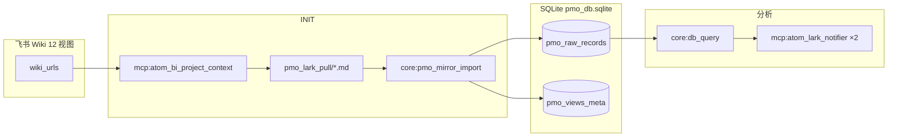
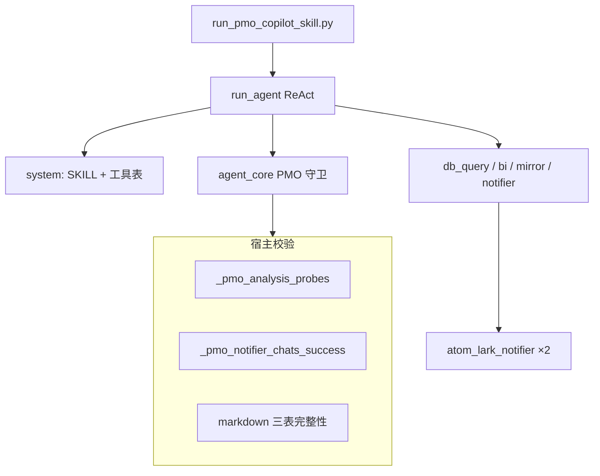
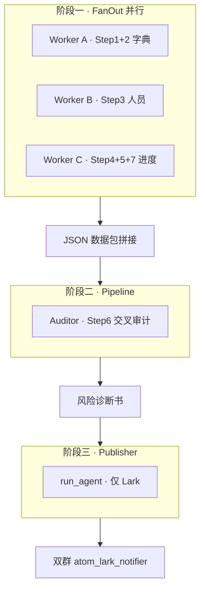

# PMO-Copilot 架构说明

> **读者**：产品、PMO、新加入的后端 / Agent 工程师。  
> **版本**：Skill `7.2.7` · 架构文档 2026-06-03（§14.4/14.5/14.6 补充实测根因分析）。  
> **SSOT 分工**：
> - 业务 SOP、三表版式、SQL 模板 → `skills_repo/pmo-copilot/SKILL.md`
> - 镜像表结构与查库工具 → `l3_node/tools/pmo_db_tools.py`
> - 宿主护栏、探针、推送校验 → `l3_node/agent_core.py`
> - 多 Agent 编排（方案 B）→ `l3_node/pmo_multi_agent_orchestrator.py`
> - CLI 入口与运行模式 → `scripts/run_pmo_copilot_skill.py`
> - 人类可读运行日志 → `l3_node/pmo_copilot_debug_file.py`

---

## 1. PMO-Copilot 是什么

PMO-Copilot 是 Jachin L3 上的 **K11 项目 PMO 自动化 Skill**，面向飞书多维表（产品 / 开发 / 美术 / 人员看板），完成：

1. **INIT（拉表 + 镜像入库）**：从飞书 Wiki 拉 12 个视图 → 本地 Markdown → **纯 Python** 写入 SQLite（**零 LLM 写库**）。
2. **交叉分析（分支 A · 宏观看板）**：基于 `pmo_raw_records` 用 `core:db_query` + `json_extract` 做七步探针，识别 Epic、人员负荷、Sprint、Version Goal 与跨视图矛盾。
3. **飞书战报**：组装 §1.4 三张 GFM 表 → **主群 + 监控群** 双推送；Final Answer 仅短确认。

**v7 核心原则**：表行数据的 SSOT 是 SQLite `pmo_raw_records` + `pmo_views_meta`；分析阶段 **禁止** LLM 读 md 汇总或写 v6 业务表。

---

## 2. 在 Jachin「四大原语」中的位置

| 原语 | PMO 中的对应物 | 说明 |
| --- | --- | --- |
| **Tools** | `core:db_query`、`core:pmo_mirror_import` | Native 原子工具；单次 tool call |
| **MCP** | `mcp:atom_bi_project_context`、`mcp:atom_lark_notifier` | 拉表落盘、飞书推送 |
| **Skills** | `skills_repo/pmo-copilot/SKILL.md` | 声明式 SOP、人设、工具白名单、七步框架、三表版式；**不是**可执行代码 |
| **Agent Tasks** | `run_agent` ReAct 循环；多 Agent 时 SubAgent（FanOut/Pipeline） | CLI / 飞书 `/pmo` / 定时任务触发 |

Skill 正文经 `gateway_inject` 进入 **system prompt**；用户消息仅为短指令（避免每轮重复携带长篇 SKILL）。

---

## 3. 数据架构（v7 镜像）

### 3.1 数据流



### 3.2 表结构（代码 SSOT）

路径：`~/.jachin/workspace/pmo_db.sqlite`（`get_pmo_db_path()`）

| 表 | 关键列 | 用途 |
| --- | --- | --- |
| `pmo_raw_records` | `source_view`, `fields`(JSON), `raw_text`, `row_index` | 各视图原文行；**无 `view_id` 列**，过滤用 `source_view='vew…'` |
| `pmo_views_meta` | `view_id`, `view_name`, `record_count`, `columns_json` | Step1 数据地图 |

v6 结构化业务表（`pmo_dev_requirements` 等）仍在同库文件中作历史对照，**v7 分析路径不再写入**。详见 `docs/architecture/PMO_DB_REFACTOR_DESIGN.md`。

### 3.3 关键视图 ID

| view_id | 语义 | 分析中的角色 |
| --- | --- | --- |
| `vewpI8lyYw` | 开发计划核心版本需求 | Epic 顶层、需求进度主表 |
| `vewCz1FFJi` | 人工看板（人员任务） | **人员矩阵 SSOT**（须 `json_each`） |
| `vew8TxMcSh` / `vewL9Mofgd` | 产品需求池 | 产品侧交叉、Version Goal |
| 其余 9 个开发视图 + 1 美术视图 | 甘特、看板等 | INIT 拉全量；分析按需 |

---

## 4. SKILL.md：业务逻辑 SSOT

路径：`skills_repo/pmo-copilot/SKILL.md`（frontmatter 版本 `7.2.7`）

### 4.1 工具白名单（frontmatter）

```yaml
mcp_tools:
  - mcp:atom_bi_project_context
  - mcp:atom_lark_notifier
  - mcp:atom_web_scraper   # 分支 B 等
native_tools:
  - core:db_query
  - core:pmo_mirror_import
```

`scripts/run_pmo_copilot_skill.py` **只**从 SKILL frontmatter 解析白名单，不在脚本内硬编码 MCP 列表。

### 4.2 硬性约定（摘要）

- **分析阶段禁止**：`core:fs_read` 读 md 做汇总、`core:db_write`、`core:pmo_import_json`、INIT 类工具（仅分析模式）。
- **推送闭环**：分支 A 须 **两次** `atom_lark_notifier`（主群 + 监控群）；Final Answer **禁止**在未双群 success 时声称已推送。
- **人员负荷**：按 §1.4.1b「计划周期 × 完成进度 × 当前时间」判定 🚨/🟡/✅；**禁止** task_cnt 排名定过载。
- **数据缺口仍须推送**：Version Goal 全空等须在战报中用 ⚠️ 占位行，禁止以「数据质量差」跳过推送。

### 4.3 §1.2.1 七步交叉分析框架（分支 A）

| Step | 名称 | 次数 | 要点 |
| --- | --- | --- | --- |
| 1 | 地图 | 1 | `pmo_views_meta` 全视图 meta |
| 2 | 样本 | 2 | vewpI8lyYw / vewCz1FFJi 字段名 + 当前 Sprint |
| 3 | 人员矩阵 | **1** | vewCz1FFJi；**一条**明细 SQL（person+task+status+sprint+due）；须 `json_each` |
| 4 | Epic | 1 | **仅** vewpI8lyYw；`父记录[0].text IS NULL` |
| 5 | 状态×Sprint | 2 | GROUP BY 聚合；Sprint 用 `$.Sprint` 禁止 `[0].text` |
| 6 | 跨视图 | 2 | 6a + 6b 分两轮；**禁止 JOIN** |
| 7 | Version Goal | 1 | COUNT 聚合；0% 仍须建 📦 表 |

单 Agent 模式预算：Step 1–7 合计 ≤10 次 `db_query`；第 11–13 轮组三表；第 14–15 轮双群推送。

### 4.4 §1.4 三表战报

 mandatory 三张 GFM 表：

- 📊 需求进度全览
- 👥 人员任务矩阵
- 📦 版本发布需求映射

推送参数：`native_table_card: true`；配置见 `config/mcps/atom_lark_notifier/config.yaml`。

### 4.5 附属 Skill

| 文件 | 用途 |
| --- | --- |
| `SKILL.resource-monitor.md` | 周三/周四资源预警巡检（精简卡，非三表宏观看板） |

---

## 5. 运行模式与 CLI 入口

入口：`scripts/run_pmo_copilot_skill.py`

| 命令 | 运行模式 | 行为 |
| --- | --- | --- |
| `python scripts/run_pmo_copilot_skill.py` | **全流程 · 多 Agent（默认）** | 库未就绪 → 先 INIT；再 FanOut→Audit→Publish（§1.2.2 Worker B/C） |
| `--analysis-only` | **仅分析 · 多 Agent（默认）** | 库须已就绪；**分析阶段与无参命令相同** |
| `--init` | **INIT 入库** | 仅 bi_project_context + pmo_mirror_import |
| `--single-agent` | **单 Agent 回退** | 无参或 `--analysis-only` 时改用 §1.2.1 七步单 Agent（无 Worker B/C FanOut） |
| `-m "…"` | 覆盖默认 user 消息 | 仅 **单 Agent 回退** 路径生效 |
| `--max-iterations N` | ReAct 上限 | 单 Agent 主循环默认 32；多 Agent 阶段三 Publisher 默认 ≤24 |

调试日志：每次运行写入 `%USERPROFILE%\.jachin\jachin_debug\健康skill\pmo_copilot_*.txt`（**v8 统一格式**：阶段 / Agent / 轮次 / 工具 / 结果 / 报错）。

---

## 6. 单 Agent 路径（ReAct 主轴）



### 6.1 流程说明

1. 解析 SKILL frontmatter → `assemble_tool_pool` 合并 MCP。
2. `gateway_inject` 将 SKILL 正文 + persona 写入 system prompt。
3. Agent 按 SKILL §1.2.1 顺序 `core:db_query`，宿主跟踪：
   - `_pmo_db_query_count`
   - `_pmo_analysis_probes`（sprint / status / personnel / epic / version / cross_view_6a/6b）
   - `_pmo_views_queried`
4. 组装 §1.4 三表 → **两次** `atom_lark_notifier`。
5. 双群均 success 后 ≤3 句 Final Answer。

### 6.2 implicit_attribution 信道

| 字段 | 含义 |
| --- | --- |
| `channel: pmo_copilot_cli` | 启用 PMO 推送守卫与调试日志 |
| `pmo_db_ready` | 镜像库已就绪，可走分析分支 |
| `pmo_analysis_only` | 禁止 INIT 类工具 |
| `pmo_init` | 仅 INIT 模式 |

---

## 7. 多 Agent 方案 B（当前 `--analysis-only` 默认）

**设计选择**：编排写在 **Python**（`pmo_multi_agent_orchestrator.py`），**不在** SKILL 内自发 `delegate`。原因：PMO 有强宿主守卫、固定七步 SOP、子 Agent 查库不计入主 ctx 探针等问题，脚本侧 FanOut + Pipeline 更可控。



### 7.1 阶段一：FanOut 并行捞数

实现：`l3_node/primitives/multi_agent/fanout.py` + `l3_node/pmo_multi_agent_queries.py`

| Worker | 职责 | 工具 | max_iterations |
| --- | --- | --- | --- |
| **A** | Step1+2：views_meta + 各视图 field_mapping（含 vewjSEz5Xr） | `core:db_query` | 8 |
| **B** | **vewCz1FFJi 主表**（B-S1+B-4）+ **vewpI8lyYw 辅表**（B-SUP）；禁止产品/美术/多表交叉 SQL；字段对齐见 `pmo_worker_b_field_align` | `core:db_query` | 14 |
| **C** | **vewpI8lyYw 单表** Epic+子任务（C-1～C-3，C-6 兜底；见 SKILL §1.2.2） | `core:db_query` | 12 |

**SSOT 分工**（Worker B/C 查什么）：

| 层级 | 位置 | 内容 |
| --- | --- | --- |
| 业务字段定义 | `skills_repo/pmo-copilot/SKILL.md` §1.2.2 | 部门、视图、必查字段、禁止捏造 |
| SQL 模板与任务 prompt | `l3_node/pmo_multi_agent_queries.py` | B-1～B-6、C-1～C-5 可复制 SQL |
| 编排与迭代上限 | `l3_node/pmo_multi_agent_orchestrator.py` | FanOut 调度、上下文 clip、Publisher 注入 |

- 每个 Worker 为 **inline role dict**（`PMO_WORKER_DB_ROLE`）：`allowed_tools: ["core:db_query"]`。
- SubAgent **仅 Native 工具**，并行时 **跳过** MCP Registry 全量初始化（避免 stdio 冲突）。
- 输出：**JSON 字符串**（Final Answer），由 Python 拼入阶段二 context；null 字段须如实上报，禁止捏造。

### 7.2 阶段二：Pipeline 交叉审计

实现：`l3_node/primitives/multi_agent/pipeline.py`

| Stage | 角色 | 工具 | 任务 |
| --- | --- | --- | --- |
| **Auditor** | `PMO_AUDITOR_ROLE`（reviewer） | **无**（禁止 db_query） | 基于阶段一 JSON 做 Step6 矛盾检验，输出《项目风险诊断书》Markdown |

检查项：幽灵需求、状态倒挂、人员超载（§1.4.1b 节奏）、Sprint 集合差。

### 7.3 阶段三：Publisher 排版发报

实现：`run_pmo_copilot_skill._async_main_multi_agent` → `run_agent`

- **工具白名单**：仅 `mcp:atom_lark_notifier`（及 expand 后的 Lark 相关）。
- **user 消息**：`PMO_PUBLISHER_USER_TEMPLATE` 注入 Worker A/B/C JSON + 审计报告。
- **system**：完整 SKILL + Publisher 补充说明。
- **implicit_attribution**（`build_pmo_multi_agent_implicit_attribution`）：
  - `pmo_multi_agent_complete: true` → 跳过七步探针门槛，允许直推。
  - `pmo_multi_agent_seed` → 预置 `_pmo_analysis_probes`、`_pmo_db_query_count` 等，满足 markdown 推送前置条件。
- **禁止**：阶段三 `core:db_query` / mirror_import / bi_project_context（`pmo_multi_agent_publish_*_blocked`）。

Publisher 任务：将 JSON + 风险诊断书填入 §1.4 三表 GFM → **两次** notifier（主群 + 监控群）→ Final Answer。

---

## 8. 宿主护栏（agent_core.py）

PMO 守卫在 `channel == pmo_copilot_cli`（及等效分支 A 意图）时激活。

### 8.1 推送前拦截（工具执行前）

| 错误码 | 含义 | 典型触发 |
| --- | --- | --- |
| `pmo_premature_notifier_blocked` | 分析未完成或 markdown 缺三表 | 探针不足 / 缺 GFM 表头 |
| `pmo_false_sync_claim_blocked` | 谎报「核心表未同步」 | 已成功拉表却写未同步 |
| `pmo_duplicate_delivery_blocked` | 同群重复推送 | 该 chat_id 本轮已成功 |
| `pmo_multi_agent_publish_db_blocked` | 阶段三禁止查库 | Publisher 误调 db_query |
| `pmo_markdown_fix_only_db_blocked` | final 阶段禁止查库 | 探针已完成仅改 markdown |

### 8.2 探针与双群交付

硬编码 chat_id（与 SKILL §1.3 一致）：

```text
PMO_BRANCH_A_PRIMARY_CHAT_ID  = oc_437c98d11106295fb10751a5481ee465
PMO_BRANCH_A_MONITOR_CHAT_ID  = oc_0e321f92d758ecb44aea5b499c90510b
```

`_pmo_branch_a_delivery_complete`：上述 **两个** chat_id 均出现在 `_pmo_notifier_chats_success` 中。

成功追踪（`_pmo_track_notifier_chat_success`）：Observation 为 `status: success` **且** Action Input **显式含 `chat_id`**。  
⚠️ **已知缺口**：若 notifier 调用未写 `chat_id`（依赖 default_chat_id 发送），实际可能已发到主群但 **宿主不记账**，导致守卫与 Final Answer 判断不一致。

### 8.3 Final Answer 出口守卫

| 守卫 | 作用 |
| --- | --- |
| `_reject_pmo_false_lark_sent_guard` | 未 notifier 成功却声称已推送 |
| `_reject_pmo_branch_a_analysis_incomplete_delivery_guard` | 未双群却输出战报摘要 |
| `_reject_pmo_branch_a_force_push_exit_guard` | 禁止以「数据质量差」跳过推送 |

各守卫有 **纠偏次数上限**（4–6 次），超限后不再拦截，存在模型幻觉收工风险。

### 8.4 多 Agent 特殊规则

- `pmo_multi_agent_complete` → `_pmo_branch_a_push_prerequisites_met` 恒为 true（跳过 db_query 探针数校验）。
- **不跳过** markdown 三表完整性校验（除非 markdown 已合规）。
- 阶段三禁止 INIT / 读盘 / 查库类工具。

---

## 9. 触发入口一览

| 入口 | 文件 | 信道 | 说明 |
| --- | --- | --- | --- |
| CLI 手动 | `scripts/run_pmo_copilot_skill.py` | `pmo_copilot_cli` | 开发/运维主入口 |
| 飞书 `/pmo` | `l3_node/pmo_lark_trigger.py` | `pmo_copilot_cli` | 精确/模糊触发 + 交互卡片 |
| PMO 定时宏观看板 | `l3_node/jobs/pmo_copilot_scheduler.py` | `pmo_copilot_cli` | 定时跑分支 A |
| 资源预警巡检 | `l3_node/jobs/pmo_copilot_scheduler.py` | `pmo_resource_monitor_scheduler` | 周三/周四；**独立**信道，不触发强制三表推送守卫 |
| 对话监控 | `l3_node/conversation_monitor.py` | — | run 结束后镜像 Q&A 到监控群；**不是** PMO 战报 |

### 9.1 飞书推送配置

`config/mcps/atom_lark_notifier/config.yaml`：

- `default_chat_id`: `${PMO_PRIMARY_CHAT_ID}`（主群）
- `monitoring_chat_id`: `oc_0e321f92d758ecb44aea5b499c90510b`
- `native_table_card: true`
- `lark_use_feishu: false`（国际 Lark）

---

## 10. 人类可读调试日志（v8）

实现：`l3_node/pmo_copilot_debug_file.py`

**所有运行模式**统一格式：

```text
PMO-Copilot 运行日志（人类可读 · v8 统一格式）
运行模式: 全流程 · 单 Agent | 多 Agent 方案 B | INIT | 仅分析 · 单 Agent

【阶段一 · …】开始
▶ Agent 启动: Worker B（analyst · 数据搬砖工）
【阶段一 · Worker B · 并行捞数 · 第 2 / 6 轮】分析 · 查库
🤖 当前 Agent: …
📋 本子 Agent 任务: …
🔧 调用了: core:db_query
📊 发生了什么 / ❌ 问题说明
◀ Agent 结束: …
【任务结束】
```

- 多 Agent：FanOut/Pipeline 用 `contextvars` 隔离并行 Worker 上下文。
- 单 Agent：session 默认上下文（主编排 Agent）。
- hook 点：`agent_core.py` 每轮 Action+Observation 调用 `append_pmo_debug_*`。

---

## 11. 代码锚点索引

| 模块 | 路径 | 职责 |
| --- | --- | --- |
| SKILL 业务 SSOT | `skills_repo/pmo-copilot/SKILL.md` | SOP、SQL、三表、推送规则 |
| CLI 入口 | `scripts/run_pmo_copilot_skill.py` | 模式路由、引擎、日志 init |
| 多 Agent 编排 | `l3_node/pmo_multi_agent_orchestrator.py` | 三阶段 workflow、Worker 任务、Publisher 模板 |
| Worker B/C SQL SSOT | `l3_node/pmo_multi_agent_queries.py` | B-1～B-6、C-1～C-5 任务体与 SQL 模板 |
| FanOut | `l3_node/primitives/multi_agent/fanout.py` | 并行 SubAgent |
| Pipeline | `l3_node/primitives/multi_agent/pipeline.py` | 顺序 Stage（Auditor） |
| PMO 守卫 | `l3_node/agent_core.py` | 探针、推送拦截、Final Answer 校验 |
| 镜像 DB | `l3_node/tools/pmo_db_tools.py` | schema、mirror_import、db_query 宿主 |
| 飞书推送 | `l3_node/primitives/mcp/mcp_tools/bi/tool_lark_notifier.py` | atom_lark_notifier 实现 |
| 调试日志 | `l3_node/pmo_copilot_debug_file.py` | v8 人类可读格式 |
| 飞书触发 | `l3_node/pmo_lark_trigger.py` | /pmo、卡片选项 |
| 定时任务 | `l3_node/jobs/pmo_copilot_scheduler.py` | 宏观看板 + 资源巡检 |
| 对话监控 | `l3_node/conversation_monitor.py` | Q&A 镜像（≠ 战报） |
| DB 设计历史 | `docs/architecture/PMO_DB_REFACTOR_DESIGN.md` | v6→v7 迁移说明 |

---

## 12. 分支 B 与其它能力（简述）

- **分支 B（变更预警）**：飞书触发选项 2；侧重阻塞/逾期人员；仍走 PMO Skill 子段落，非宏观看板三表。
- **资源预警巡检**：独立 Skill `SKILL.resource-monitor.md`；有告警才推送精简卡；`resource_monitor_result: all_clear` 时静默。
- **分支 C / 简单问答**：飞书卡片选项 3；不注入 PMO SKILL，避免重型工具链。

---

## 13. 设计思路与演进方向

### 13.1 为何 v7 镜像 + 查库

- 飞书字段为 **嵌套 JSON**，多视图 **粒度不一致**；让 LLM 读 md 易丢字段、臆造列名。
- Python 镜像保证 **行级 SSOT**；LLM 只做 **交叉解读** 与 **战报排版**。
- 宿主用探针 + SQL hints 约束 **字段路径**（如 `json_each`、Sprint 禁止 `[0].text`）。

### 13.2 为何多 Agent 方案 B

| 对比 | 单 Agent 32 轮 | 多 Agent 方案 B |
| --- | --- | --- |
| 查库 | 同一 ctx 内 10+ 轮 db_query，易超轮、探针混乱 | Worker 并行、职责单一 |
| Step6 审计 | 与排版争抢 ReAct 轮次 | Auditor 独立 Stage，无 db_query |
| 推送 | 与查库同一 Agent | Publisher 仅 Lark，seed 跳过探针 |
| 编排 | SKILL 内自发 delegate 难与守卫对齐 | Python FanOut/Pipeline 可测、可日志 |

### 13.3 已知张力与运维注意

1. **对话监控 ≠ PMO 战报**：监控群「💬 对话监控」仅为 Q&A 镜像，不能作为推送成功依据。
2. **chat_id 记账**：notifier 未显式传 `chat_id` 时可能「已发未记」，导致双群校验与体感不一致。
3. **守卫纠偏上限**：多次错误 Final Answer 后守卫停止拦截，需结合 v8 日志核对真实 Observation。
4. **Publisher 输入过长**：阶段三 user 消息含完整 JSON 包，模型易摘要式推送；依赖 markdown 完整性拦截。
5. **并行 Worker**：需 Native-only 白名单 + 跳过子 Agent 全量 MCP，否则 FanOut 会触发 MCP stdio 竞态。

---

## 14. 已观测问题根因分析与改进方向

> 本节基于 `pmo_copilot_20260602_134918_421_d910f2aa.txt`（§14.1–14.3）和 `pmo_copilot_20260603_095207_787_0a605f29.txt`（§14.4–14.6）实测日志归纳，供后续优化参考。

---

### 14.1 问题：Worker C 重复查了同一条状态分布 SQL（第2轮 / 第5轮）

**状态：已修复（2026-06-02）**

**日志现象**

Worker C 第2轮（Thought 标为"Step3·状态分布"）和第5轮（Thought 标为"Step7·状态分布"）各执行了一次完全相同的 SQL：

```sql
SELECT json_extract(json_extract(fields,'$."状态"'),'$[0].text') AS status, COUNT(*) AS cnt
FROM pmo_raw_records WHERE source_view='vewCz1FFJi' GROUP BY ...
```

两次结果一致（3 组：cnt=12 / 延期×1 / 按时完成×10），浪费了 1 个宝贵 ReAct 轮次。

**根因**

1. **步骤编号挂错，同一查询被贴了两个不同标签**：Worker C 的任务 prompt 模板包含四步子查询（Epic / 状态分布 / Sprint / Version Goal）。模型在第2轮执行时把状态分布称为"Step3·状态分布"，第5轮又把同一查询称为"Step7·状态分布"——模型认为这是两件不同的事。
2. **ReAct 上下文记忆有效但自检缺失**：模型在上下文里确实有第2轮的 Observation，但没有被要求在每次 Action 前核对"这个 SQL 已做过了吗"。Worker C 的任务指令缺少去重自检环节。
3. **任务 prompt 语义粒度过粗**：Worker C 负责"Step4+5+7"，但模板内的子步骤没有唯一标签绑定。模型自行决定步骤归属，出现同内容多次执行。

**改进思路（已实施）**

- Worker C 任务 prompt 为 SQL 分配唯一编号 `C-1`～`C-4`，要求 Final Answer 附 `completed_sql_ids`。
- `PMO_WORKER_DB_ROLE` 追加去重自检：每次 Thought 开头列出「已完成 SQL 编号」。
- Version Goal 查询修正为产品视图 `vew8TxMcSh` / `vewL9Mofgd`（与 SKILL §1.2.1 Step7 一致）。

---

### 14.2 问题：Auditor 去读了 mcp:read_file 而不是直接用上下文 JSON

**状态：已修复（2026-06-02）**

**日志现象**

```
【阶段二 · Auditor · 交叉审计 · 第 1 / 5 轮】读盘 · Markdown
🔧 调用了: mcp:read_file
📋 具体操作  context_data
❌ 读文件失败：文件不存在或不在允许读取目录内: context_data
```

`PMO_AUDITOR_ROLE` 规定 `allowed_tools: []`，Auditor 不应有任何工具权限，但 `mcp:read_file` 仍然被调用并执行（随后因路径不存在才返回错误）。

**根因**

1. **`allowed_tools: []` 对 MCP 类工具未完全生效**：当前工具白名单机制优先过滤的是 Native 工具；MCP 工具（如 `mcp:read_file`）若在工具池中存在，SubAgent 仍可能访问到，allowlist 空数组没有阻止其调用。
2. **Auditor system prompt 措辞不够封闭**：prompt 说"禁止调用 `core:db_query` 或任何**数据库工具**"，模型理解为"数据库禁止、文件读取允许"，于是把 `mcp:read_file` 作为获取数据的替代手段。
3. **模型误解 context 传入方式**：阶段一的 Worker A/B/C JSON 是通过 Pipeline 的 user 消息直接传给 Auditor 的（文本形式注入上下文），不需要读任何文件。但 Auditor 没有被明确告知"所有数据已在本条 user 消息中，无需任何工具"，模型猜测数据存在一个叫 `context_data` 的本地文件中。

**改进思路（已实施）**

- `expand_allowed_skills_with_local_mcp([])` 不再自动并入 `mcp:*`；`allowlist_is_tools_denied` + `run_agent` 对空 allowlist 跳过 MCP 合并。
- `PMO_AUDITOR_ROLE` 改为正向封闭声明（禁止一切工具含 read_file）。
- 阶段二 task 移除「数据包见 context_data」误导措辞；改用 `_build_auditor_context()` 内联 JSON + `## Worker A/B/C` 小节标题。
- SubAgent 在 `allowed_skills=[]` 时 system prompt 显式标注「无任何可用工具」。

---

### 14.3 问题：Auditor 读文件失败后直接收工，交叉审计质量偏低

**状态：已修复（2026-06-02）**

**日志现象**

Auditor 第1轮 `mcp:read_file` 失败后，没有重试也没有 fallback，直接在当前轮次输出了《项目风险诊断书》。诊断书质量如下：

- 幽灵需求：仅依据 `record_count` 差值（50 vs 23）推断，未核对具体需求名称。
- 状态倒挂：明确标注"无法直接判定，样本数据不完整"。
- 人员超载 / Sprint 集合差：未实质分析（因缺乏 Worker B/C 的明细 JSON）。

**根因**

1. **数据未完整传达到 Auditor**：从代码推断，Pipeline 传入 Auditor 的 context 是 Worker A/B/C 的 Final Answer 字符串，若字符串被截断或格式解析不正确，Auditor 看到的就只有片段（如只有 Worker A 的 views_meta）。
2. **无降级策略**：Auditor 在工具失败后没有"重新声明自己掌握的数据 → 逐条推理"的提示引导；模型选择了最快的出口——基于现有上下文拼一份表面合规的诊断书。
3. **Auditor ReAct 上限仅 5 轮**：即使模型想重试或补充分析，轮次预算也非常紧张，没有容错余量。

**改进思路（已实施）**

**传入格式**

- `_build_auditor_context()`：Worker A/B/C 输出带 `##` 小节标题内联于 task（非 context_data 文件路径）。
- Pipeline `pass_context=False`，数据全文写入 Auditor task，避免 4000 字符截断。

**Auditor 交叉分析**

- 近期仍采用方案 A（禁止 db_query）；prompt 增加降级规则：数据不足须标注「数据不足·结论仅供参考」。
- `_audit_report_has_low_confidence()`：低置信诊断书会在阶段三 Publisher user 消息追加 ⚠️ 提示。

**中长期（未实施）**

- 方案 B：Auditor 受限 Step6a/6b db_query（最多 2 次），待 allowlist 机制稳定后评估。

---

### 14.4 现象：Worker B 调试日志显示「⚠️ 无法解析（N 字符）」

**状态：调试展示 Bug（查库本身成功，非数据/SQL 问题）**

**日志现象（来自 `pmo_copilot_20260603_095207_787_0a605f29.txt`）**

```
【阶段一 · Worker B · 并行捞数 · 第 1 / 24 轮】
📊 发生了什么
   结果: ⚠️ 无法解析（13327 字符）
✅ 本步无系统错误
```

下一轮 Worker B 的 Thought 直接写「已完成: B-4」并继续执行后续步骤，说明查库实际成功、数据已被 Agent 正确读取。

**根因**

`core:db_query` 执行完毕后，`run_db_query` 返回标准 JSON（`{"status":"ok","rows":[...],...}`）。  
但在 `agent_core.py` 把 Observation 写入 ReAct 上下文之前，宿主会通过 `_pmo_append_draft_gfm_hint_after_db_query` 在 JSON 后面拼接 Markdown 文本（例如「⚠️ 草稿提醒：上一步 Thought 未包含 GFM 表格行」）。  
最终 Observation 形态是：

```text
{
  "status": "ok",
  "rows": [ ... 人员任务明细 ... ],
  ...
}

⚠️ **草稿提醒**：上一步 Thought 未包含 GFM 表格行……
```

调试日志模块 `pmo_copilot_debug_file.py` 的 `_try_parse_json` 对整段文本做 `json.loads()`，一旦 `{` 之外还有字符便失败 → 显示「⚠️ 无法解析（N 字符）」。由于解析失败不写入 `errors` 列表，所以同时显示「✅ 本步无系统错误」。

13000+ 字符符合 B-4 对 `vewCz1FFJi` + `json_each` + 全字段 + LIMIT 300 后的正常返回体积（约 20~30 条人员任务 × 多字段 × JSON indent）。

**对实际运行的影响**

- **零影响**：LLM 读到的 Observation 仍包含完整 JSON（宿主截断发生在显示层护城河 `_truncate_observation_for_llm`，13k 远低于 15k 默认上限，数据未丢失）。
- **调试日志失真**：运维人员看到「无法解析」可能误判为查库失败，需结合「✅ 本步无系统错误」与下一轮 Thought 判断。

**改进方向（未实施）**

`_summarize_db_query_observation` 改为只对 Observation **第一个完整 JSON 块**（遇到第一个顶层 `}` 截止）做解析，而不是对整段文本 `json.loads()`。这样既能正确展示查询结果摘要，又保留后续宿主注入提示的显示。

---

### 14.5 问题：Worker C Sprint 聚合恒返回 0 行

**状态：根因已明，局部修复已在代码中，但运行时防护存在漏洞**

**日志现象（同一日志文件，第 1/3/6 轮）**

```
AND json_extract(fields, '$.Sprint') GLOB '????/??/??-Sprint'
...
HAVING sprint_date IS NOT NULL AND sprint_date >= date('now', '-21 days')
结果: ✅ 聚合统计 — 0 组数据（582 字符）
```

同一 SQL 在第 3/6 轮再次执行，仍然 0 行。Worker C 共浪费了约 6 轮才自行发现需要加 `replace()`（第7轮），而第 7 轮又被宿主以「SQL 含禁止关键字」拒绝，最终通过其他查询路径补全数据。

**根因**

1. **Sprint 字段日期分隔符为斜杠，SQLite `date()` 不接受**  
   `vewpI8lyYw` 视图的 Sprint 字段存储格式为纯字符串 `2026/06/01-Sprint`（斜杠分隔）。  
   `substr('2026/06/01-Sprint', 1, 10)` → `'2026/06/01'`  
   `date('2026/06/01')` → **NULL**（SQLite `date()` 仅接受 `YYYY-MM-DD` 格式）  
   因此 `sprint_date` 别名对所有行均为 NULL，`HAVING sprint_date IS NOT NULL` 过滤掉所有行 → 0 组。

2. **GLOB 模式本身正确，不是 0 行的原因**  
   `GLOB '????/??/??-Sprint'` 能正确匹配 `2026/06/01-Sprint`（第5轮不带 GLOB 的 DISTINCT 查询返回了 32 条不同 Sprint 值，确认数据存在）。真正导致 0 行的是 HAVING 过滤，而非 GLOB。

3. **正确写法已在 SSOT SQL 模板中，但模型未严格复制**  
   `pmo_multi_agent_queries.py` 的 C-1 SQL 模板已包含：  
   `date(replace(substr(json_extract(fields, '$.Sprint'), 1, 10), '/', '-'))` — `replace()` 把 `/` 换成 `-` 后 `date()` 才能解析。  
   模型自行重写了 SQL，去掉了 `replace()`，导致返回 NULL。

4. **宿主防护 `pmo_sql_has_sprint_date_without_replace` 在本次日志中未生效**  
   该防护检测「C-1 结构 + `date(substr())` + 缺少 `replace()`」并提前拦截返回错误。  
   但日志显示 0 行而非「❌ 查询失败」，说明防护未触发。原因可能是：正则 `_C1_SPRINT_DATE_BAD_RE` 的匹配条件与实际 SQL 结构存在微小差异，或本次运行的代码版本早于该防护加入时间。

5. **第 7 轮正确 SQL 又被误拒**  
   模型自行推断出 `replace()` 并重写 SQL，但宿主以「SQL 含禁止关键字或非只读 PRAGMA」拒绝执行。这极可能是 `_validate_select_sql` 的误判（`replace()` 作为 SQLite 字符串函数不应被禁止；`_FORBIDDEN_SQL_RE` 仅禁止 `REPLACE INTO` 而非 `replace()`，具体触发原因待排查）。该误判阻断了模型的自我纠错，使修复路径又多浪费了若干轮次。

**改进方向**

| 优先级 | 措施 | 负责路径 |
| --- | --- | --- |
| P0 · 立即 | 排查 `_validate_select_sql` 为何在第7轮误拒含 `replace()` 的正确 SQL，修复误判 | `l3_node/tools/pmo_db_tools.py` |
| P0 · 立即 | 扩大 `pmo_sql_has_sprint_date_without_replace` 的检测范围：不限于 C-1 结构特征，凡是 `date(substr(Sprint字段, 1, 10))` 但无 `replace()` 一律拦截 | `pmo_db_tools.py` |
| P1 · 近期 | Worker C 任务 prompt 中 C-1 SQL 前加强制声明：**「以下 SQL 须逐字复制，禁止改写 `replace()` 或 `substr()` 参数」** | `l3_node/pmo_multi_agent_queries.py` |
| P1 · 近期 | 当 Sprint 聚合查询返回 0 行时，hints 明确提示：「Sprint 字段格式为 `YYYY/MM/DD-Sprint`（斜杠），须 `replace('/','-')` 后才能用 `date()`」 | `pmo_db_tools._db_query_hints` |

---

### 14.6 问题：SQL 由模型自由发挥 → 轮次浪费 + 自我修复路径受阻

**背景与现状评估**

用户提问：现在各 SQL 都由模型自己想，是否太浪费轮次？是否应预先给一版、并允许报错时自我修复？

**现状盘点**

| 项目 | 实际情况 |
| --- | --- |
| SQL 模板是否已写好？ | **已有**：`pmo_multi_agent_queries.py` 包含 B-S1/B-4/B-SUP、C-1～C-3（+C-6 兜底）可直接运行的完整 SQL，已注入 Worker system prompt | 
| 模板是否被严格执行？ | **否**：模型倾向于「理解后重写」而非「逐字复制」，自写变体丢失了关键细节（如 `replace()` for Sprint、`json_each` 展开 Person） |
| 有自我修复能力吗？ | **部分有**：宿主错误 hints 会在 Observation 里返回字段对齐提示（如「禁止产品字段名」），模型会据此改写 SQL；但（a）纠错本身消耗轮次，（b）正确的改写有时被宿主误拒（见 §14.5 第7轮） |
| 轮次浪费有多严重？ | Worker C 本次因 Sprint SQL 问题浪费约 6 轮（16 轮上限中占 37.5%）；Worker B 因字段名问题至少浪费 2 轮 |

**为什么会「理解后重写」而不复制**

1. **模型的本能**：LLM 在 Thought 中「理解意图 → 写新 SQL」的路径比「找到模板文本 → 原文粘贴」更自然，尤其是 system prompt 里 SQL 模板是作为**说明文字**嵌在大段 Markdown 中的，模型会先理解再生成，而不是机械抄写。

2. **缺少硬约束**：当前任务 prompt 写的是「参考以下 SQL」或「可复制 B-4 SQL」，这是**弱建议**，模型自由发挥空间大。

3. **宿主错误反馈滞后**：模型先执行（返回 0 行或错误），再被动触发宿主 hint，再重写 SQL。正确逻辑应是「执行前先确认字段名」，但多数情况下模型跳过了探针步骤直接写完整查询。

**推荐改进方案（综合评估）**

> **结论**：你提出的方向是正确的，两个维度（预写 SQL + 自我修复权限）应并行推进，且彼此不矛盾。

**维度一：强化「逐字复制」约束（成本低，短期优先）**

- 在 `WORKER_B_TASK` 和 `WORKER_C_TASK` 的每条 SQL 块前加：  
  > `⚠️ 以下 SQL 是唯一合法写法，须逐字复制 · 禁止任何改写（含字段名、函数参数、聚合方式）`
- 在 `PMO_WORKER_DB_ROLE` 全局角色 prompt 加：  
  > `每次 Thought 开头必须写「本步复制的 SQL 编号：B-x / C-x」，并从任务体中 verbatim 摘录对应 SQL 片段，不得改写`
- 在宿主 `pmo_worker_b_field_align.py` 的 hints 里把「请复制」改为「禁止改写，逐字复制 B-x SQL」（语气升级）。

这不会增加任何轮次开销，只要模型遵从即可在第 1 轮命中，彻底消除 §14.5 那种 6 轮自探过程。

**维度二：扩展「宿主 SQL 注入」（中期，最彻底）**

对于字段路径固定、格式已知的步骤（B-4 人员 SSOT、C-1 Sprint 窗口），可由**宿主在 Action 前直接替换为标准 SQL**，而不是依赖模型写 SQL：

- 在 `agent_core.py` 的 action 拦截层，检测 Thought 中明确表明本步骤编号（如「执行 B-4」），宿主直接注入该步骤的 SSOT SQL 替换模型写的 SQL。
- 这实质上把「SQL 模板执行」从 LLM 生成模式改为**宿主确定性执行**，LLM 只负责解读结果。
- 已有基础：`pmo_sql_has_*` 系列守卫已在做反向检测（拦截错误 SQL），正向注入是其对称操作。

**维度三：修复自我修复路径的阻断点（P0，见 §14.5）**

允许模型自我修复的前提是：**正确的修复 SQL 不会被宿主误拒**。当前 §14.5 第 7 轮的 `replace()` SQL 被 `_validate_select_sql` 拦截，说明「自我修复」通道本身有 Bug。优先修复该误判，才能让自我修复真正生效。

**三维方案对比**

| 方案 | 实施难度 | 轮次节省 | 可靠性 | 建议 |
| --- | --- | --- | --- | --- |
| 强化复制约束（prompt） | 低 | 中（依赖模型遵从） | 中 | 立即实施 |
| 修复宿主误拒 BUG | 低 | 间接（解锁自修复） | 高 | 立即实施 |
| 宿主 SQL 注入 | 中 | 高（直接消除浪费） | 高 | 中期实施 |

### 14.7 Worker C：父记录 string 形态与 Epic 识别（2026-06）

**镜像事实**（`vewpI8lyYw` · `pmo_raw_records.fields`）：

- 飞书 UI 序号（`1.` `2.`）**不入库**；大需求用 `Requirement` + 层级识别。
- `父记录` 常为 **plain string**（`开发`、`产品`、`平台前端`），不仅是 JSON 链接数组的 `[0].text`。
- 大需求行：`父记录` 空/NULL 或 `[0].text` NULL，且 **有** `任务编号`；排除部门占位 `Requirement`。
- 子任务行：`COALESCE(trim(父记录), 父记录[0].text)` 非空；`parent_epic=开发` 时**不**直接带 Epic 名，须按 `row_index` 归到同 Sprint **上一个**大需求。

**SSOT**：`l3_node/pmo_multi_agent_queries.py` → `WORKER_C_TASK`（C-1～C-6）；`skills_repo/pmo-copilot/SKILL.md` §1.2.3 业务语义表。

**Person/状态（C-2）**：在 `vewpI8lyYw` 常为 **plain string**（含 `''`）；**禁止** `json_extract(json_extract(Person/状态), '$[0].text')`（会 malformed JSON）。C-2 用 `trim(Person)` + `json_extract(状态)` plain。

**自愈**：C-2 malformed → 逐字复制 C-2；C-2 为 0 但 C-1 有 Sprint → 禁止删 WHERE；C-3 为 0 → **C-6** 一次。宿主 `pmo_sql_antipattern` 会拦截 nested Person/状态 与缺 任务编号 的自编 C-2。

**范围**：C-1 取近 **21 天最多 3 个** Sprint（非写死某一周期）；战报 📊 仅 `current_sprint`。

### 14.8 Worker B：vewCz1FFJi 人员任务查询（2026-06）

**镜像事实**：

- `Person in charge/Participant` 常为 **plain string**（如 `Buck`），不是数组；单独 `json_each` 全表 → **malformed JSON**。
- 有效人员任务行通常 **有 `任务编号`**；无负责人、无编号的行多为看板分组占位（勿写入 personnel_tasks[]）。
- `父记录` / department：用 `COALESCE(trim(父记录), 父记录[0].text)`；可能为「开发」或飞书 record_id。
- 日期字段（Start/Review/Acceptance/Expected Delivery）在库内多为 **毫秒时间戳**字符串。

**SSOT**：`WORKER_B_TASK` — **B-S1**（`vewCz1FFJi` 近 21 天最多 3 Sprint）→ **B-4**（UNION 人员 SSOT）→ **B-SUP**（`vewpI8lyYw` 辅表 Sprint IN，文字对照 B-4，禁止多表 SQL）。

**视图对齐**：`pmo_worker_b_field_align` 的 `dev_personnel`（B-4）与 `core:db_query` hints 与任务体一致。

---

## 15. 快速排障清单

| 现象 | 优先检查 |
| --- | --- |
| 主群无战报、Final Answer 称成功 | v8 日志 Publisher 轮次 notifier Observation；`_pmo_notifier_chats_success`；是否只有对话监控 |
| `pmo_premature_notifier_blocked` | 缺三表 GFM / 探针不足；看 `missing_sections` / `missing_probes` |
| 人员矩阵全空 / malformed JSON | Worker B 是否 B-S1→B-4 UNION（禁止单独 json_each）；是否 Sprint IN + 任务编号；参见 §14.8 |
| Epic 0 行 | 是否误在 vewCz1FFJi；vewpI8lyYw 须父记录**双形态**+任务编号（禁止仅 `[0].text IS NULL`）；参见 §14.7 |
| C-2 有 Epic、C-3 子任务 0 行 | 子任务用 COALESCE 父记录 + json_each；`parent=开发` 用 C-6 row_index 归并；参见 §14.7 |
| 多 Agent 阶段一失败 | Worker 日志；SQL 字段路径；并行 MCP 冲突（应仅 db_query） |
| `--analysis-only` 拒绝启动 | `pmo_mirror_db_ready()` 为 false → 先 `--init` |
| Worker C 出现重复 SQL | 检查第2轮 Thought 标签是否与后续轮次冲突；参见 §14.1 |
| Auditor 调用 read_file | `allowed_tools:[]` 未阻止 MCP；Auditor prompt 缺封闭声明；参见 §14.2 |
| 诊断书只有 record_count 对比 | 阶段一 JSON 未完整传入 Auditor；参见 §14.3 |
| Worker B 日志显示「⚠️ 无法解析（N 字符）」但「✅ 本步无系统错误」 | **调试展示 Bug，查库实际成功**；下一轮 Thought 若有「已完成 B-4」则确认；参见 §14.4。根因：宿主在 JSON 后追加 Markdown 提示，整段文本无法 `json.loads` |
| Worker C `missing_sql` 但日志里可见 `{"sql":"SELECT...` | Action Input 用 JSON 包装 SQL 且串内引号未转义 → `loader` 原 `json.loads` 失败 → `params={}`。修复：`parse_db_query_action_input` 回收 SELECT；**禁止** JSON 包装，须裸 SQL |
| Worker C Sprint 聚合恒返回 0 行 | Sprint 字段为 `YYYY/MM/DD-Sprint`（斜杠），`date(substr(...,1,10))` 返回 NULL；须加 `replace('/','-')`；参见 §14.5。确认方法：不带 HAVING 的 `DISTINCT Sprint` 查 `vewpI8lyYw`，若有数据则是日期格式问题 |
| Worker C/B 多轮自写 SQL 仍失败 | 检查模型是否复制了 SSOT SQL（`pmo_multi_agent_queries.py`）还是自行改写；参见 §14.6 |

---

## 16. 相关文档

| 文档 | 内容 |
| --- | --- |
| `docs/architecture/PMO_DB_QUERY_CASE_STUDY_0511_SPRINT.md` | 查库案例（Cursor 实测）+ **§10 集成方案**；**§10.2 Worker C 如何学到 Cursor 级智能化** |
| `docs/architecture/PMO_DB_REFACTOR_DESIGN.md` | v6/v7 表结构、迁移 |
| `docs/FOUR_PRIMITIVES.md` | 四大原语定义 |
| `skills_repo/pmo-copilot/SKILL.md` | 完整 SOP（含 SQL 复制即用） |
| `config/mcps/atom_lark_notifier/config.yaml` | 推送目标与 native_table |

---

*本文档随实现变更更新；业务细节以 SKILL.md 为准，守卫行为以 `agent_core.py` 为准。*
