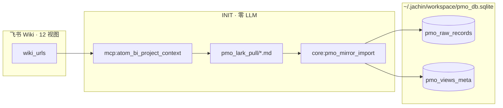
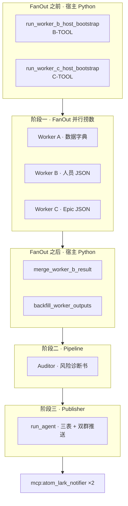

# PMO-Copilot 架构说明（2026-06 新版）

> **这篇文档给谁看？**  
> 产品、PMO、新加入的后端 / Agent 工程师——想搞懂「PMO 战报是怎么从飞书表跑到 Lark 群里的」，读这一份就够。  
> **版本**：Skill `7.2.14` · 架构文档 2026-06-04（对齐 `core:pmo_personnel_report` / `core:pmo_sprint_epic_report` / 宿主 B-TOOL·C-TOOL 预取）。

---

## 1. 一句话：PMO-Copilot 是什么？

PMO-Copilot 是跑在 Jachin L3 上的 **K11 项目 PMO 自动化 Skill**。它做三件事：

1. **INIT**：从飞书 Wiki 拉 12 个多维表视图 → 落本地 Markdown → **纯 Python 写入 SQLite**（入库阶段 **零 LLM**）。
2. **分析**：读 SQLite 镜像库，产出人员任务、大需求（Epic）、子任务、跨视图矛盾等结构化 JSON。
3. **战报**：组装三张飞书 GFM 表（📊 需求 / 👥 人员 / 📦 版本），**主群 + 监控群** 双推送。

**v7 核心原则**：表行数据的唯一真相源（SSOT）是 `pmo_raw_records` + `pmo_views_meta`；分析阶段 **禁止** LLM 读 md 汇总或写 v6 业务表。

---

## 2. 设计哲学（请先读这一节）

过去 PMO 让 LLM 多轮 `core:db_query` 手写 SQL，容易踩坑（Person 双形态、未来 Sprint 当本周、Epic 筛错表）。现在的共识是：

| 能力 | 放在哪 | 为什么 |
|------|--------|--------|
| **查对**（Sprint 窗、人员矩阵、Epic 层级、两视图合并） | **Python Tool** + **FanOut 前宿主预取** | 过程稳定、可单测、和 Cursor 探针同构 |
| **交叉审计**（B/C JSON 矛盾、幽灵需求） | **Auditor**（只读 JSON，不查库） | 规则固定，不靠 LLM 临场 JOIN |
| **人话战报**（三张 GFM 表） | **Publisher**（阶段三 `run_agent`） | 「好看」与「查对」分离 |
| **可选文字对照** | Worker B 少量 ReAct | 宿主已给全量 JSON 时，理想 **0 轮** |

**不要**指望 SubAgent 自己决定「怎么跨表合并」——跨表 **合并算法在 Tool 里**；跨 Worker **审计在 Auditor 里**。

相关案例（人类可读、含验收数据）：

- Epic / 开发子任务：[`PMO_DB_QUERY_CASE_STUDY_0511_SPRINT.md`](./PMO_DB_QUERY_CASE_STUDY_0511_SPRINT.md)
- 人员任务矩阵：[`PMO_PERSONNEL_QUERY_CASE_STUDY_0601_SPRINT.md`](./PMO_PERSONNEL_QUERY_CASE_STUDY_0601_SPRINT.md)
- 临时需求调整 · 变更预警：[`PMO_CHANGE_ALERT_DESIGN.md`](./PMO_CHANGE_ALERT_DESIGN.md)
- 变更预警演练复盘（Gavin 麻将插单）：[`PMO_CHANGE_ALERT_CASE_STUDY_0605_MAHJONG.md`](./PMO_CHANGE_ALERT_CASE_STUDY_0605_MAHJONG.md)
- 版本发布需求映射（发版邮件窗 + 已完成 Epic）：[`PMO_RELEASE_EPIC_MAPPING_CASE_STUDY_0605.md`](./PMO_RELEASE_EPIC_MAPPING_CASE_STUDY_0605.md)
- **整体交叉分析 + LLM 人话解读**（六轴 fact_pack · 非 Python 硬编码）：[`PMO_CROSS_ANALYSIS_NARRATIVE_SPEC.md`](./PMO_CROSS_ANALYSIS_NARRATIVE_SPEC.md)

---

## 3. 在 Jachin「四大原语」里是什么？

| 原语 | PMO 里对应什么 | 说明 |
|------|----------------|------|
| **Tools** | `core:db_query`、`core:pmo_mirror_import`、`core:pmo_personnel_report`、`core:pmo_sprint_epic_report`、`core:pmo_resolve_sprint` | 单次 tool call 的原子能力 |
| **MCP** | `mcp:atom_bi_project_context`（拉表）、`mcp:atom_lark_notifier`（推送） | 外部进程 |
| **Skills** | `skills_repo/pmo-copilot/SKILL.md` | **声明式** SOP、三表版式、业务规则；**不是**可执行代码 |
| **Agent Tasks** | 单 Agent ReAct；或多 Agent FanOut / Pipeline / Publisher | CLI、飞书 `/pmo`、定时任务触发 |

Skill 正文经 `gateway_inject` 进 **Publisher / 单 Agent** 的 system prompt；多 Agent 的 Worker B/C **不读 SKILL 全文**，只读短规范 + 任务体 SQL。

---

## 4. 数据从哪来？（INIT → SQLite）



### 4.1 库路径与表

| 表 | 关键列 | 用途 |
|----|--------|------|
| `pmo_raw_records` | `source_view`, `fields`(JSON), `raw_text`, `row_index` | 各视图每一行；**无 `view_id` 列**，过滤用 `source_view='vew…'` |
| `pmo_views_meta` | `view_id`, `view_name`, `record_count`, `columns_json` | 数据地图（Worker A / Step1） |

v6 结构化业务表仍在同库文件中作历史对照，**v7 分析路径不再写入**。详见 [`PMO_DB_REFACTOR_DESIGN.md`](./PMO_DB_REFACTOR_DESIGN.md)。

### 4.2 你必须记住的视图

| view_id | 中文语义 | 在战报里的角色 |
|---------|----------|----------------|
| **`vewCz1FFJi`** | 人工看板（人员任务） | 👥 **人员矩阵 SSOT** |
| **`vewpI8lyYw`** | 开发计划核心版本需求 | 📊 **大需求 Epic + 子任务** 主表 |
| `vew8TxMcSh` / `vewL9Mofgd` | 产品需求池 | 产品侧交叉、📦 Version Goal |
| `vew5taB9H1` 等 | 美术 / 甘特 / 看板 | INIT 拉全量；分析按需 |

飞书 12 视图 URL 清单见 `SKILL.md` §1.1。

---

## 5. 怎么跑？（CLI 入口）

入口：`scripts/run_pmo_copilot_skill.py`

| 命令 | 实际走什么 |
|------|------------|
| `python scripts/run_pmo_copilot_skill.py` | **默认 · 多 Agent**：库未就绪 → 先 INIT → FanOut → Audit → Publish |
| `--analysis-only` | 多 Agent 分析（库须已就绪） |
| `--init` | 仅 INIT 入库 |
| `--single-agent` | 回退 **单 Agent** §1.2.1 七步 ReAct（无 Worker B/C FanOut） |
| `-m "…"` | 覆盖 user 消息（**主要对单 Agent 回退生效**） |

调试日志：`%USERPROFILE%\.jachin\jachin_debug\健康skill\pmo_copilot_*.txt`（每阶段 / 每 Agent / 工具 / 报错）。

---

## 6. 默认路径：多 Agent 三阶段（方案 B）

**为什么用 Python 编排，而不是 SKILL 里 delegate？**  
PMO 有强宿主守卫（探针、双群推送、markdown 完整性）、固定 SOP、子 Agent 查库不计入主 ctx 等问题——**脚本侧 FanOut + Pipeline 更可控**。



### 6.1 阶段零（FanOut 前）：宿主预取

在三个 Worker 并行启动 **之前**，Python 已经跑完「最难的查数」：

| 函数 | 内部 Tool | 产出（注入 Worker context） |
|------|-----------|-------------------------------|
| `run_worker_b_host_bootstrap()` | `core:pmo_personnel_report` recent_window | `current_sprint`, `recent_sprints[]`, `personnel_tasks[]`, `requirement_context[]`, `by_person`, `unassigned_tasks`, `cross_week_tasks`, `summary` |
| `run_worker_c_host_bootstrap()` | `core:pmo_sprint_epic_report` recent_window | `current_sprint`, `epics[]`, `epic_children[]`, `dev_tasks[]`, … |
| `run_worker_d_host_bootstrap()` | `core:pmo_release_epic_mapping` | `completed_epics[]`, `markdown_section`, `window_since`/`window_until`, `completed_count` |

**`current_sprint` 规则（B/C 共用）**：在近三周 Sprint 里取 **`sprint_date ≤ today` 且日期最大** 的一档——**禁止**直接用 `recent_sprints[0]`（可能是未来预建的 Sprint，如 06/08）。

实现：`l3_node/pmo_worker_result_backfill.py` · `l3_node/tools/pmo_personnel_query.py` · `l3_node/tools/pmo_sprint_query.py`

### 6.2 阶段一：FanOut 并行捞数

实现：`l3_node/pmo_multi_agent_orchestrator.py` + `l3_node/primitives/multi_agent/fanout.py`

| Worker | 干什么 | 工具 | 理想 ReAct 轮次 |
|--------|--------|------|-----------------|
| **A** | Step1+2：`pmo_views_meta` + 各视图字段样本 | `core:db_query` | 若干轮 |
| **B** | 复制宿主 JSON → Final Answer；仅缺 `requirement_context` 时 B-SUP | `core:pmo_personnel_report`, `core:db_query` | **0～2 轮** |
| **C** | 复制宿主 JSON → Final Answer；Tool 失败时 C-1→C-2→C-3 SQL 兜底 | `core:pmo_sprint_epic_report`, `core:db_query` | **0～3 轮** |
| **D** | 复制宿主 JSON → Final Answer；仅宿主失败时调 D-TOOL 兜底 | `core:pmo_release_epic_mapping` | **0～1 轮** |

Worker 专属短规范（注入 system，**不是** SKILL 全文）：

- Worker B：[`PMO_WORKER_B_SPEC.md`](./PMO_WORKER_B_SPEC.md)
- Worker C：[`PMO_WORKER_C_SPEC.md`](./PMO_WORKER_C_SPEC.md)
- Worker D：[`PMO_WORKER_D_SPEC.md`](./PMO_WORKER_D_SPEC.md)
- **Work 总（端到端战报案例 · 拆解/工具/踩坑）**：[`PMO_WORK_ZONG_CASE_STUDY.md`](./PMO_WORK_ZONG_CASE_STUDY.md)
- **📦 版本发布需求映射（邮件窗 + Epic 清单）**：[`PMO_RELEASE_EPIC_MAPPING_CASE_STUDY_0605.md`](./PMO_RELEASE_EPIC_MAPPING_CASE_STUDY_0605.md)

SQL 模板 SSOT：`l3_node/pmo_multi_agent_queries.py`（B-S1/B-4/B-SUP、C-1～C-6）

### 6.3 FanOut 后：merge + backfill

LLM 常见毛病：**Observation 有数，Final Answer JSON 却漏字段**。因此在进 Auditor 之前，宿主再做一次确定性合并：

| 函数 | 作用 |
|------|------|
| `merge_worker_b_result(host_seed, agent_raw)` | 以宿主 `current_sprint` / `personnel_tasks` 为准；Agent 只补 `requirement_context` / `cross_check_notes` |
| `merge_worker_c_result(host_seed, agent_raw)` | 以宿主 `epics[]` 为准 |
| `backfill_worker_outputs()` | 任一 Worker JSON 空 → 再跑 B-TOOL / C-TOOL 或 SQL 兜底 |

### 6.4 阶段二：Auditor（交叉审计）

- **角色**：`PMO_AUDITOR_ROLE`（reviewer）
- **工具**：**无**（禁止 `db_query`）
- **输入**：Worker A/B/C 的 JSON 拼接 + bundle
- **输出**：《项目风险诊断书》Markdown（放战报摘要区，**不进 📊 表内列**）

检查方向（与 SKILL 一致）：

- 幽灵需求、状态倒挂
- 人员过载须按 **§1.4.1b 节奏**（计划周期 × 进度 × 时间），**禁止** task_cnt 排名
- Sprint 集合差、B/C 字段矛盾

### 6.5 阶段三：Publisher（排版发报）

- **默认**：`run_agent` 优先 **`core:pmo_macro_dashboard_push`**（Work 总 · 确定性 B/C 预取 + polish + 双群 native_table）；成功则 **禁止** 再调 notifier。
- **兜底**：仍是 `run_agent` ReAct，手工组装 §1.4 三表 + **两次** `mcp:atom_lark_notifier`
- system 注入：**完整 SKILL**（三表版式、推送闭环、§1.4.1b）
- 读阶段一/二的 JSON + 审计书，**不再**大规模查库

**三张 mandatory GFM 表**：

| 表 | 数据来源（优先） |
|----|------------------|
| 📊 需求进度全览 | Worker C `epics[]`；**6 列**（`优先级` 独立列，P0→P1→P2 排序）；`format_demand_table_gfm_row`；状态/完成度见 `pmo_workflow_stage`；**仅首列+表头**加粗（`PMO_PMO_TABLE_BOLD_SPEC`） |
| 👥 人员任务矩阵 | Worker B `personnel_tasks[]`（SSOT vewCz1FFJi）；任务列 `format_personnel_matrix_tasks_cell`（`<br>` 分行、无 `**`） |
| 📦 版本发布需求映射 | Version Goal 等；全空仍须 ⚠️ 占位行 |

推送参数：`native_table_card: true`；配置见 `config/mcps/atom_lark_notifier/config.yaml`。

**Final Answer 规则**：仅当 **两次** notifier Observation 均为 success，才可 ≤3 句确认「已推送」。

---

## 7. 回退路径：单 Agent（§1.2.1 七步）

加 `--single-agent` 时不走 FanOut，由 **一个** Agent 按 SKILL §1.2.1 顺序 `core:db_query`：

| Step | 名称 | 要点 |
|------|------|------|
| 1 | 地图 | `pmo_views_meta` |
| 2 | 样本 | vewpI8lyYw / vewCz1FFJi 字段 |
| 3 | 人员矩阵 | vewCz1FFJi；须 UNION / json_each |
| 4 | Epic | 仅 vewpI8lyYw；父记录双形态 |
| 5 | 状态×Sprint | GROUP BY |
| 6 | 跨视图 | 6a + 6b；**禁止 JOIN** |
| 7 | Version Goal | COUNT；0% 仍建 📦 表 |

预算：Step 1–7 ≤10 次 `db_query`；然后组三表 + 双群推送。

宿主在 `l3_node/agent_core.py` 跟踪探针（`_pmo_analysis_probes`、推送守卫等）。

**何时用单 Agent？** 调试 SKILL 七步、或 FanOut 未就绪时的回退；**生产默认仍推荐多 Agent + Tool 预取**。

---

## 8. Python Tool 清单（查对 SSOT）

| Tool id | 用途 | 典型入参 | 实现 |
|---------|------|----------|------|
| **`core:pmo_personnel_report`** | 👥 人员矩阵全量采集 | `{"recent_window": true}` 或 `{"sprint":"2026/06/01-Sprint"}` | `l3_node/tools/pmo_personnel_query.py` |
| **`core:pmo_sprint_epic_report`** | 📊 Epic + 开发/产品/美术子任务 | 同上 | `l3_node/tools/pmo_sprint_query.py` |
| **`core:pmo_resolve_sprint`** | 自然语言 → Sprint 名 | `{"label":"5月11"}` | 同上 |
| **`core:pmo_macro_dashboard_push`** | 宏观看板一键推送（Publisher 默认） | `{}` | `l3_node/tools/pmo_macro_dashboard.py` |
| **`core:pmo_macro_dashboard_preview`** | 宏观看板 Markdown 预览 | `{}` | 同上 |
| `core:pmo_mirror_import` | INIT 镜像入库 | manifest / pull_dir | `l3_node/tools/pmo_db_tools.py` |
| `core:db_query` | 只读 SELECT 兜底 / Worker A / 单 Agent | 裸 SQL | 同上（含 SQL 反模式 hints） |

### 8.1 `core:pmo_personnel_report` 产出什么？

顶层 JSON 字段（Worker B / 探针 / Publisher 👥 消费）：

```json
{
  "current_sprint": "2026/06/01-Sprint",
  "current_sprint_date": "2026-06-01",
  "recent_sprints": [{"sprint": "...", "sprint_date": "...", "cnt": 50}],
  "personnel_tasks": [
    {
      "person": "Buck",
      "task": "…",
      "task_no": "K11-03126",
      "sprint": "2026/06/01-Sprint",
      "priority": "P2",
      "department": "开发",
      "start_date_iso": "2026-06-01",
      "review_date_iso": "2026-06-02",
      "acceptance_date_iso": "2026-06-02",
      "expected_delivery_date_iso": "2026-06-02",
      "actual_delivery_date_iso": "2026-06-02",
      "progress": "提交测试环境",
      "status": "🔵 按时完成",
      "is_current_week": true
    }
  ],
  "requirement_context": [],
  "unassigned_tasks": [],
  "cross_week_tasks": [],
  "by_person": {},
  "summary": {},
  "completed_sql_ids": ["B-TOOL"]
}
```

内部逻辑（与案例文档一致）：B-S1 近三周 → `resolve_current_sprint` → 扫 **vewCz1FFJi + vewpI8lyYw** → Python 合并 → 按人分组 → 三类桶（有人 / 无负责人 / 跨周）。

---

## 9. SKILL.md：业务规则 SSOT

路径：`skills_repo/pmo-copilot/SKILL.md`（frontmatter `7.2.14`）

### 9.1 SKILL 管什么、不管什么

| SKILL 管 | SKILL 不管 |
|----------|------------|
| 业务语义（大需求 vs 小需求、人员 SSOT） | FanOut 调度、Worker max_iterations |
| 三表 GFM 版式、§1.4.1b 人员节奏 | Python Tool 内部实现 |
| INIT / 分析 / 推送硬性约定 | merge/backfill 代码细节 |
| SQL 编号含义（B-S1、C-2…） | SubAgent system 全文（见 WORKER_*_SPEC） |

### 9.2 硬性约定（摘要）

1. **分析阶段禁止**：`core:fs_read` 读 md 汇总、`core:db_write`、`core:pmo_import_json`。
2. **推送闭环**：分支 A 须 **两次** `atom_lark_notifier`（主群 + 监控群）。
3. **数据诚实**：Observation null → JSON null / `field_empty`；**禁止捏造**。
4. **数据差仍要推送**：Version Goal 全空 → 📦 表 ⚠️ 占位行，禁止跳过推送。
5. **人员 🚨/🟡/✅**：按 **§1.4.1b** 计划周期 × 进度 × 当前时间；**禁止** task_cnt 排名定过载。

### 9.3 业务数据采集要点（§1.2.2 · 与 Worker 对齐）

**人员（Worker B）**

| 步骤 | 视图 | 说明 |
|------|------|------|
| B-TOOL（优先） | vewCz1FFJi + vewpI8lyYw | 宿主 / Tool 一次算对 |
| B-SUP（兜底） | vewpI8lyYw | 仅辅表 `requirement_context[]`；禁止 C-2 Epic WHERE |

**Epic（Worker C）**

| 步骤 | 视图 | 说明 |
|------|------|------|
| C-TOOL（优先） | vewpI8lyYw | `core:pmo_sprint_epic_report` |
| C-1～C-3（兜底） | vewpI8lyYw | SQL 模板见 `pmo_multi_agent_queries.py` |

**窄路径（§1.2.4）**：用户只问「某 Sprint 大需求 + 开发任务」→ `pmo_resolve_sprint` + `pmo_sprint_epic_report`，**不**走七步 + 双群（除非用户要战报）。

---

## 10. 判定规则速查

### 10.1 current_sprint（本周战报用哪一档 Sprint）

```
在 recent_sprints（近 21 天、最多 3 个）里：
  取 sprint_date ≤ 今天 且 sprint_date 最大的那一档
禁止：ORDER BY sprint_date DESC 的第一行（可能是未来 Sprint）
```

### 10.2 人员矩阵（👥）

| 规则 | 内容 |
|------|------|
| SSOT 视图 | **vewCz1FFJi** |
| 有效个人任务行 | 有 **任务编号** + 有 **Person** |
| Epic/占位行 | 无 Person → `unassigned_tasks`，**不进** 👥 人名列 |
| 共担 | `Jack Looi; Baojing` **整串**算一个负责单位，不拆人 |
| 跨周 | 近三周其他 Sprint 的同人任务 → `cross_week_tasks` / 表内标注「前序延续」 |

### 10.3 大需求 Epic（📊）

| 规则 | 内容 |
|------|------|
| 主表 | **vewpI8lyYw** |
| 大需求 | 父记录 NULL/空 + 有任务编号 + 排除「开发/美术/产品」占位 Requirement |
| 子任务 | 父记录非空；`parent_epic=开发` 时按 row_index 挂到上一个大需求 |
| 战报范围 | **仅 current_sprint 一周** 的 Epic 进 📊 表 |

### 10.4 Auditor 常见检查项

- `personnel_tasks[]` 非空；`current_sprint_date ≤ today`
- Epic 行未混入 👥 人员表
- B/C 对同一 Requirement 状态是否倒挂 → 写入风险诊断书

---

## 11. 不用 LLM 怎么验？（探针脚本）

| 脚本 | 测什么 |
|------|--------|
| `python scripts/run_pmo_worker_b_probe.py` | Worker B 宿主预取 / B-TOOL；按人明细表 |
| `python scripts/run_worker_c_probe.py` | Worker C 宿主预取 / C-TOOL |
| `python scripts/run_pmo_worker_b_probe.py --out data/worker_b_out.json` | 写出完整 UTF-8 JSON |

数据库默认：`~/.jachin/workspace/pmo_db.sqlite`（须先 `--init`）。

---

## 12. 代码与文档索引（SSOT）

| 主题 | 路径 |
|------|------|
| CLI 入口 | `scripts/run_pmo_copilot_skill.py` |
| 多 Agent 编排 | `l3_node/pmo_multi_agent_orchestrator.py` |
| Worker SQL / 任务体 | `l3_node/pmo_multi_agent_queries.py` |
| 宿主预取 / merge / backfill | `l3_node/pmo_worker_result_backfill.py` |
| 人员 Tool | `l3_node/tools/pmo_personnel_query.py` |
| Epic Tool | `l3_node/tools/pmo_sprint_query.py` |
| 查库 / mirror / db_query | `l3_node/tools/pmo_db_tools.py` |
| 推送守卫 / 单 Agent 探针 | `l3_node/agent_core.py` |
| 业务 SKILL | `skills_repo/pmo-copilot/SKILL.md` |
| 镜像表设计 | `docs/architecture/PMO_DB_REFACTOR_DESIGN.md` |
| 变更预警方案 | `docs/architecture/PMO_CHANGE_ALERT_DESIGN.md` |
| 变更预警案例（0605 麻将插单） | `docs/architecture/PMO_CHANGE_ALERT_CASE_STUDY_0605_MAHJONG.md` |
| 版本发布需求映射案例（0605 发版 Epic） | `docs/architecture/PMO_RELEASE_EPIC_MAPPING_CASE_STUDY_0605.md` |
| 执行韧性契约 | `docs/JACHIN_EXECUTION_RESILIENCE_CONTRACT.md` |

---

## 13. 和旧版文档相比，什么变了？

| 旧认知 | 现网（2026-06） |
|--------|-----------------|
| Worker B 全靠 LLM 跑 B-S1/B-4/B-SUP | FanOut 前 **B-TOOL** 预取；Worker B 理想 0 轮 |
| Worker C 全靠 LLM 跑 C-1～C-3 | FanOut 前 **C-TOOL** 预取；SQL 仅兜底 |
| `current_sprint = recent_sprints[0]` | **`sd ≤ today` 取最大**（B/C 共用 `resolve_current_sprint`） |
| 人员合并靠 LLM 跨表 | **`pmo_personnel_query` Python 两视图合并** |
| 单 Agent 是默认 | **多 Agent + Tool 预取是默认**；单 Agent 是 `--single-agent` 回退 |

---

## 14. 修订记录

| 日期 | 说明 |
|------|------|
| 2026-06-04 | **全文重写**：对齐 B-TOOL/C-TOOL、宿主 merge、`pmo_personnel_report`、案例文档、探针脚本；人类可读结构 |
| 2026-06-03 及更早 | 旧版 §14.x 实测根因分析（已归档入案例文档，不再维护于本文） |
