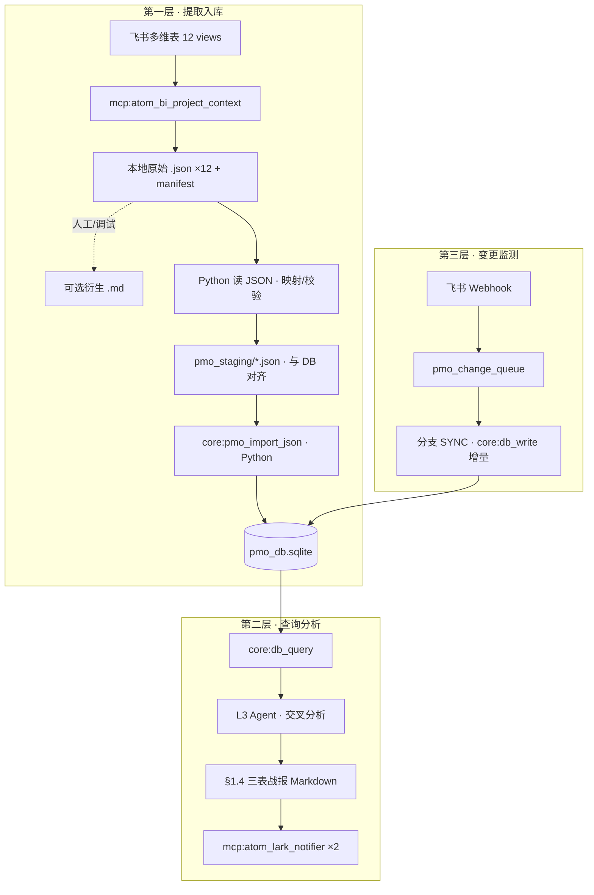

# PMO-Copilot v6 全景说明

> **文档定位**：PMO 插件（`pmo-copilot-enterprise`）的 **流程、结构、规则与 Skill 思路** 一站式说明。  
> **当前版本**：Skill **v6.1.0** · DB 架构 **v6**  
> **读者**：开发、运维、调 Skill 的 Agent 设计者  
> **更细 SSOT**：Schema/DDL → `PMO_DB_REFACTOR_DESIGN.md`；运行时 SOP → `skills_repo/pmo-copilot/SKILL.md`；`flow_progress_note` 语义 → Skill **§附录 A**（内嵌）

---

## 1. 为什么要 v6（背景）

### 1.1 v5 的问题

旧版 PMO（v5.x）每次分析都 **全量读盘 12 张飞书视图**（当时多为衍生 md），把整表塞进 LLM 上下文再分析。结果是：

- Token 成本高、上下文窗口成为天花板  
- 无法做稳定 SQL 级跨表关联  
- 每次运行重复读盘，无增量、无历史  

### 1.2 v6 的核心转变

| 维度 | v5 | v6 |
|------|----|----|
| 分析真相源 | 当轮读盘 Observation | **SQLite DB**（`core:db_query`） |
| 提取 | 与分析混在一起 | **独立提取层**（拉表 → 结构化 → 入库） |
| 入库方式（INIT） | LLM 直接写（或混在分析里） | **Python 读原始 JSON → 映射/import**（必要时 LLM 补语义） |
| 流程语义 | 外链读 `docs/pmo_bmo_plugin/…` | **Skill §附录 A 内嵌**（打包 L3 可读） |
| 战报预警 | 易与入库混淆 | **仅分析层**产出，**禁止写入 DB** |

---

## 2. 整体架构（三层）



**职责分离（必须遵守）**：

1. **提取层**：把非规范原始表数据（**每 view 一个 JSON**）**如实结构化**进 DB；写 `flow_progress_note`（流程位置），**不写**延期/偏闲/风险。  
2. **分析层**：只读 DB；用 SQL + 日期规则产出战报与 🚨/🟡/✅。  
3. **变更层**：Webhook 或定时 diff → 增量 upsert，避免每天全量 INIT。

---

## 3. 在 Jachin 四大原语中的位置

| 原语 | PMO 中的对应物 |
|------|----------------|
| **Tools** | `core:fs_read` / `core:fs_write` / `core:db_query` / `core:db_write` / `core:pmo_import_json` / `core:pmo_init_gap_report`；MCP `atom_bi_project_context`、`atom_lark_notifier` |
| **MCP** | 飞书拉表、群推送（外部进程） |
| **Skills** | `skills_repo/pmo-copilot/SKILL.md`（声明式 SOP + §附录 A） |
| **Agent Tasks** | L3 `run_agent` ReAct 循环（INIT / 分支 A 等一次会话） |

Skill **不是**可执行代码本体；Wasm/Native 工具才是执行面。

---

## 4. 仓库与磁盘结构

### 4.1 代码与配置（仓库内）

| 路径 | 作用 |
|------|------|
| `skills_repo/pmo-copilot/SKILL.md` | **运行时 SOP SSOT**（v6.1.0） |
| `skills_repo/pmo-copilot/SKILL.resource-monitor.md` | 资源预警（**待 v6 重写，当前未启用**） |
| `docs/architecture/PMO_DB_REFACTOR_DESIGN.md` | DB 架构设计、DDL、风险与演进 |
| `docs/architecture/PMO_COPILOT_V6_OVERVIEW.md` | **本文档**（全景说明） |
| `docs/pmo_bmo_plugin/` | 业务背景（全流程说明、人员名册；开发机可选读） |
| `l3_node/tools/pmo_db_tools.py` | SQLite schema、`db_query` / `db_write` / `import_json` / `gap_report` |
| `l3_node/agent_core.py` | PMO INIT 未完成 guard、路径相关守卫 |
| `core/native_tools.py` | Native 工具分发；pmo 拉盘路径 / manifest basename 回退解析 |
| `scripts/run_pmo_copilot_skill.py` | CLI 点火（`--init` / 默认分支 A） |
| `scripts/pmo_db_init.py` | 手动建库 / `--force` 重建 |
| `scripts/pmo_import_staging_json.py` | CLI 导入 staging JSON（与 `core:pmo_import_json` 同逻辑） |
| `config/mcps/atom_bi_project_context/` | 拉表 MCP 配置 |

### 4.2 运行时数据（用户目录）

| 路径 | 作用 |
|------|------|
| `~/.jachin/workspace/pmo_db.sqlite` | **PMO 主库**（可用 `JACHIN_PMO_DB_PATH` 覆盖） |
| `~/.jachin/workspace/pmo_lark_pull/` | 飞书拉表落盘（**12 张原始 JSON**，每 view 一文件 + `00_SYNC_MANIFEST.json`；**`.md` 为后期可选衍生**，供人工阅读/调试，非 INIT 主路径必需） |
| `~/.jachin/workspace/pmo_staging/` | INIT 映射层 JSON（`{view_id}.json`，与 DB schema 对齐；通常由 **Python 从原始 JSON 生成** 再 `pmo_import_json`） |
| `~/.jachin/jachin_debug/健康skill/pmo_copilot_*.txt` | CLI 调试日志（ReAct 逐步摘要） |

---

## 5. 数据库结构（摘要）

### 5.1 四张业务表 + 人员锚点

| 表 | 含义 |
|----|------|
| `pmo_product_requirements` | 产品部需求（Epic/Story/Task 均可） |
| `pmo_dev_requirements` | 开发部需求 |
| `pmo_design_requirements` | 设计/美术部需求 |
| `pmo_personnel_task_progress` | 人员任务（人 → 任务 → 子任务） |
| `pmo_people` | 人员锚点（外键：`personnel.person_id → people.id`） |

**设计要点**：

- 三张部门表 **字段结构相同**，便于提取 Prompt 复用、分析 SQL 可 UNION。  
- **重叠存储**：同一业务事实可同时进部门表与人员表，用 `dept_requirement_id` + `dept_table` 互链。  
- **不硬编码**「只有 Epic 进部门表」——飞书原始 JSON / 衍生 md 均可能列名、层级不规范，**按行语义**判断归属。  
- 每条业务记录应带：`source_view`、`source_file`、`confidence`、`raw_text`（可追溯）。

### 5.2 辅助表

| 表 | 作用 |
|----|------|
| `pmo_sync_state` | 各 view 上次同步时间与行数 |
| `pmo_change_queue` | Webhook 变更待处理队列 |
| `pmo_extraction_log` | 提取失败/低置信度审计 |
| `pmo_schema_meta` | schema 版本 |

完整 DDL 见 `PMO_DB_REFACTOR_DESIGN.md` §4。

### 5.3 关键字段分工

| 字段 | 层 | 含义 |
|------|-----|------|
| `execution_stage` | 提取 | 飞书单元格 **原文** |
| `flow_progress_note` | 提取 | 对照 **Skill §附录 A** 的 **流程位置**（事实描述） |
| 战报 🚨/🟡/✅ | **分析** | §1.4.1b 规则 + SQL，**禁止写入 DB** |

---

## 6. 工具清单与边界

### 6.1 MCP 工具

| id | 用途 | 分支 |
|----|------|------|
| `mcp:atom_bi_project_context` | 按 wiki URL 拉多维表 → 落盘 **原始 JSON（每 view 一文件）** + manifest；可选导出 md | INIT、SYNC |
| `mcp:atom_lark_notifier` | 飞书群推送（`native_table_card: true`） | A、B |
| `mcp:atom_web_scraper` | 辅助抓取（按需） | 可选 |

### 6.2 Native 工具

| id | 用途 | INIT | SYNC | 分析 A/B/C |
|----|------|:----:|:----:|:----------:|
| `core:fs_read` | 读 manifest / **原始 JSON** / staging（md 非必需） | ✅ | ✅ | 极少 |
| `core:fs_write` | 写 staging JSON（或由 Python 脚本直接生成） | ✅ | — | — |
| `core:pmo_import_json` | **Python 批量 upsert** | ✅ | 可选 | — |
| `core:pmo_init_gap_report` | manifest 缺口报告 | ✅ | — | — |
| `core:db_query` | 只读 SELECT | 收尾 | ✅ | ✅ |
| `core:db_write` | 逐条 upsert | **❌ 禁止** | ✅ | — |

**INIT 性能原则**：慢在 LLM 逐条手写巨型 JSON / `db_write`，不在 SQLite。v6.1 强制 **原始 JSON → Python 映射 → Import**；LLM 仅在语义映射不足时介入，**不应**让 LLM 背整表 JSON 字符串。

`pmo_import_json` 写入顺序（自动）：`pmo_people` → 部门三表 → `pmo_personnel_task_progress`。

---

## 7. 意图路由（用户说什么 → 走哪条分支）

| 用户意图 | 分支 | 一句话 |
|----------|------|--------|
| `/pmo init`、初始化数据库、全量入库 | **INIT** | 拉表 → 12×(读原始 JSON → Python 映射/import) → gap 补全 |
| `/pmo sync`、Webhook 积压 | **SYNC** | 消费 `pmo_change_queue`，`db_write` 增量 |
| `/pmo`、宏观看板、定时摘要 | **A** | `db_query` → 分析 → 双群战报 |
| 表格变更预警 | **B** | DB/队列 → 紧缩卡片 |
| 群内追问某人某需求 | **C** | 短 SQL + 口语答 |
| 仅「按 SKILL / 默认」 | **自动** | DB 有数据 → **A**；空库或明确要求 → **INIT** 再 **A** |

---

## 8. 分支 INIT：完整流程（v6.1 · Skill 思路）

### 8.1 设计思路（为什么这样拆）

1. **飞书拉盘真相源是 JSON**：`atom_bi_project_context` 落盘为 **每 view 一个原始 JSON**（manifest 索引）；**`.md` 是后期可选转换**，供人工核对，不是 INIT 必经格式。  
2. **入库应优先 Python**：原始 JSON 已是结构化数据 → **Python 读取、映射、校验** 后 `pmo_import_json`；列名/层级/流程语义仍可能不规范，必要时再让 LLM 补 `flow_progress_note` 等字段，**不应**让 LLM 把整表重新手写进 staging。  
3. **staging JSON 是 DB 契约**：Python（或极少数 LLM 补全步骤）与 `pmo_import_json` 之间的 **交接格式**；便于调试、重跑 import、审计。  
4. **`source_file` 必须用 manifest basename**：否则 `gap_report` 无法对齐，会出现「库里有数据但报告全 missing」。  
5. **§附录 A 内嵌 Skill**：打包 L3 无仓库时仍能填 `flow_progress_note`，禁止 `fs_read docs/...`。

### 8.2 阶段 0 · 拉表（1 次 MCP）

```
mcp:atom_bi_project_context(wiki_urls = SKILL §9 全部 12 views)
  → output_dir, files[]   # files[] 为原始 JSON basename 列表
core:fs_read(00_SYNC_MANIFEST.json)
  → 建立 12 张业务 JSON 队列
```

**纪律**：此阶段 **禁止** 读业务 JSON / md 正文（仅 manifest）。

### 8.3 阶段 1 · 逐张 Map-Import（×12）

对 manifest 中 **每一张** 原始 JSON，完成闭环后才允许下一张：

```
core:fs_read(output_dir / basename)          # 原始 JSON（非 md）
  → Python 映射为 staging bundle（§4 字段 + §附录 A）
     （推荐：scripts / core:pmo_import_json 同路径逻辑；必要时 LLM 仅补语义字段）
  → core:pmo_import_json({ "file_path": "pmo_staging/{view_id}.json" })
  → [可选] Thought：[INIT] {basename} imported +N rows
```

**bundle JSON 示例结构**（`source_file` 指向 **原始 JSON** basename，与 manifest 一致）：

```json
{
  "source_file": "01_K11 需求池_…_vew8TxMcSh.json",
  "source_view": "vew8TxMcSh",
  "tables": {
    "pmo_people": [ { "id": "ethan_001", "name": "Ethan", "dept": "产品", "role": "产品经理", "is_active": true } ],
    "pmo_product_requirements": [ { "id": "…", "requirement_name": "…", "confidence": 0.9, "raw_text": "…" } ],
    "pmo_personnel_task_progress": []
  }
}
```

大表（如 03 开发计划 ~2000 行）：**一张原始 JSON 一个 bundle**（可含数百行）；勿退回「多轮 db_write」或「LLM 手写整包 JSON 字符串」。

### 8.4 阶段 2 · 缺口补全

```
core:pmo_init_gap_report()
  → missing_files[], table_totals, init_complete
对 missing_files 重复阶段 1（可用 {view_id}_retry.json）
直至 init_complete == true
```

`gap_report` 按 **`source_file` 精确匹配 manifest basename** 统计四表行数之和；`source_file` 写错会导致误报 missing。

### 8.5 INIT 完成标准

- [ ] 12 张原始 JSON 均 `pmo_import_json` 成功（`ok` 或 `partial` 且已补跑）  
- [ ] `pmo_init_gap_report`：`missing_count == 0`，四表 `table_totals` 均 > 0  
- [ ] Final Answer 含各表 row_count、低置信度条数  

### 8.6 建议处理顺序（view_id）

| 序 | view_id | 主要写入 |
|----|---------|----------|
| 1 | `vew8TxMcSh` | 产品需求池 |
| 2 | `vewL9Mofgd` | 产品端人员看板 |
| 3 | `vewpI8lyYw` | 开发计划核心（大表） |
| 4 | `vew5taB9H1` | 美术需求 |
| 5 | `vewCz1FFJi` | 人员矩阵主轴 |
| 6–11 | `vewpYzbZ29` … `vew0gcyAUk` 等 | 各视角任务/甘特 |
| 12 | `vewjSEz5Xr` | 人工甘特 |

实际 **basename 以 manifest 为准**；勿臆造「05_人员看板_…」类文件名。

### 8.7 INIT 禁止项（常见失败模式）

| 禁止 | 原因 |
|------|------|
| INIT 用 `core:db_write` 逐条写 | 极慢；2 轮 write 可耗数十分钟 |
| 连续 `fs_read` 多张 JSON 不 import | 囤积上下文；违反闭环 |
| Observation 去重后 skip import | 去重 = 上文已有内容，应 **映射/写 staging 再 import** |
| 臆造 JSON 路径 / 错误 `source_file` | gap 报告失真；数据不可追溯 |
| 把衍生 `.md` 当作拉盘 SSOT | 原始真相源是 JSON；md 仅辅助阅读 |
| `mcp:fetch` 读本地 JSON | 应用 `core:fs_read` |
| 在 `flow_progress_note` 写 🚨/风险 | 属分析层 |
| `pmo_people` 用 `department` 字段 | schema 为 `dept` |

---

## 9. 分支 A：宏观看板（分析层流程）

### 9.1 前置

- DB 已 INIT（或业务表非空）  
- 否则提示 `/pmo init` 或自动 INIT  

### 9.2 分析步骤（ReAct · 多轮 Thought）

**只使用 `core:db_query` 返回行**；禁止「回忆之前读的 JSON / md」。

1. **定 work_cycle**：查产品/开发表中最频 Sprint  
2. **查部门需求**：`pmo_dev_requirements` 为主 + 产品/设计 UNION  
3. **查人员树**：`pmo_personnel_task_progress` JOIN `pmo_people`  
4. **交叉分析**（Thought 分步，不可一句带过）：  
   - Epic 清单（`root_id` / `hierarchy_depth=0`）  
   - 人员状态（§1.4.1b → 🚨/🟡/✅，**不写回 DB**）  
   - 跨表 JOIN 校验 → 风险段  
   - 组装三表 Markdown  
5. **推送**：`atom_lark_notifier` ×2（主群 + 监控群），`native_table_card: true`  
6. **Final Answer** ≤3 句确认  

### 9.3 战报结构（§1.4）

顺序：Executive Summary → 📊 需求进度全览 → 👥 人员任务矩阵 → 📦 版本映射 → ⚠️ 风险 → 底部三链 → 💬 追问  

版式：Markdown 表格、进度条 `[▓▓▓░░░░░░░] NN%`、状态 Emoji 前置。

### 9.4 人员预警规则（§1.4.1b · 仅分析层）

1. **🚨 延期**：计划时间早于今天且未完成  
2. **🚨 进度落后**：计划完成比例显著低于日历进度  
3. **🟡 偏闲**：本周计划任务已提前全部完成  
4. **✅ 正常**：以上皆不命中  
5. 日期缺失 → ⚠️ 说明，禁止凭任务数瞎判 🚨  

### 9.5 质量门槛（推送前自检）

- ≥3 次 `db_query` 且行数 > 0  
- 战报每行可回溯 DB 的 `id` / `root_id`  
- 双群 notifier 均 success  

---

## 10. 分支 B / C / SYNC（摘要）

### 10.1 分支 B · 变更预警

输入：变更队列或指定 record/人员 → `db_query` → 命中 §1.4.1b → 紧缩卡片 → 双群推送。

### 10.2 分支 C · 轻量问答

实体解析 → `db_query`（LIKE/精确）→ 口语 ≤300 字；可选单表浓缩卡片。

### 10.3 分支 SYNC · 增量

设计目标：飞书 Webhook → `pmo_change_queue` → 只重提取变更行 → `core:db_write` upsert。

无 Webhook 时降级：定时拉表 + 与 DB diff（见 `PMO_DB_REFACTOR_DESIGN.md` §11）。

---

## 11. 飞书数据源（12 views · SSOT）

拉表 MCP：`mcp:atom_bi_project_context`，`wiki_urls` 覆盖 SKILL §9。

| 域 | table_id | views（节选） |
|----|----------|---------------|
| 产品 | `tblNdv7DIlycuqxp` | `vew8TxMcSh` 需求池；`vewL9Mofgd` 产品端人员看板 |
| 开发 | `tblfK9gk6vTQpJtB` | `vewpI8lyYw` 开发计划核心；`vewCz1FFJi` **人员矩阵主轴**；甘特/已完成/未完成/产品方/设计方/开发方任务等 9 视图 |
| 美术 | `tblDw87UlhddFIoY` | `vew5taB9H1` 设计专用 |

Wiki 前缀见 SKILL §9 完整 URL。

落盘 **原始 JSON** 结构（典型）：飞书 view 快照（records / fields / 层级或平面行）；manifest 的 `files[]` 与 `source_file` 均指向 **`.json` basename**。**记录上限 2000/视图**。

同目录可选 **衍生 `.md`**（frontmatter + bullet/表格视图），仅供人工阅读或调试；INIT 入库 **不依赖** md。

---

## 12. Lark 推送配置

| 群 | chat_id |
|----|---------|
| 主群 | `.env` `PMO_PRIMARY_CHAT_ID`（默认 `oc_437c98d11106295fb10751a5481ee465`） |
| 监控群 | `oc_0e321f92d758ecb44aea5b499c90510b` |

必须：`native_table_card: true`；禁止裸 URL（用 `[文案](URL)`）。

---

## 13. view → 表路由（提取层 · LLM 判断）

| view_id | 主要写入 |
|---------|----------|
| `vew8TxMcSh` | `pmo_product_requirements` |
| `vewL9Mofgd` | `pmo_personnel_task_progress`（dept=产品） |
| `vewpYzbZ29` | 产品表 + 人员表 |
| `vewpI8lyYw` | `pmo_dev_requirements` |
| `vew0gcyAUk` | 开发表 + 人员表 |
| `vew4Im7GO3` / `vewpxQxeGw` / `vewQKcyDAV` | 人员表为主 |
| `vewswB05Wi` | 设计表 + 人员表 |
| `vew5taB9H1` | `pmo_design_requirements` |
| `vewCz1FFJi` | `pmo_personnel_task_progress`（人员矩阵主轴） |
| `vewjSEz5Xr` | 人员表 + 可选部门表 |

可重叠；同 view 不同行可进多表。

---

## 14. 置信度与提取日志

| confidence | 策略 |
|------------|------|
| ≥0.9 | 正常进入战报 |
| 0.7–0.9 | 可用，战报标 ⚠️ |
| <0.7 | 入库但分析慎用；记入 `low_confidence_warnings` / `pmo_extraction_log` |

父子关系不确定 → `parent_id=null`，降低 `confidence`。

---

## 15. 宿主集成：CLI、守卫、调试

### 15.1 CLI 点火

```bash
# 分支 A（默认）
python scripts/run_pmo_copilot_skill.py

# INIT 全量入库
python scripts/run_pmo_copilot_skill.py --init

# 自定义句
python scripts/run_pmo_copilot_skill.py -m "…"
```

- Skill 正文 + persona 注入 **system**；user 仅为短点火句（`MESSAGE_INIT` / `MESSAGE_BRANCH_A`）。  
- 工具白名单来自 SKILL frontmatter。  
- ReAct 上限：INIT 默认 **270** 轮；分支 A 默认 **28**（`JACHIN_PMO_MAX_REACT_ITERATIONS` 可覆盖，INIT 硬顶 270）。  
- `pmo_init_mode: true` 写入 metadata，触发 INIT guard。

### 15.2 L3 守卫（`agent_core.py`）

- **INIT 未完成 guard**：Agent 试图用 Final Answer 收尾但 INIT 未做完 → 注入纠偏 user 消息，要求继续 `fs_write JSON + pmo_import_json + gap_report`。  
- **路径回退**（`native_tools.py`）：`pmo_lark_pull` 双段路径、view 后缀匹配、manifest basename 解析，缓解 Agent 臆造文件名。

### 15.3 调试日志

路径：`~/.jachin/jachin_debug/健康skill/pmo_copilot_*.txt`

含：用户点火句、每轮工具摘要、`on_step` 截断（**仅日志显示限制**，不等于 md 被截断）。

### 15.4 手动运维命令

```bash
# 建库 / 强制重建
python scripts/pmo_db_init.py
python scripts/pmo_db_init.py --force

# 手动导入 staging
python scripts/pmo_import_staging_json.py path/to/vew8TxMcSh.json --gap-report
```

---

## 16. ReAct 轮次预算（建议）

| 模式 | 轮次 | 构成 |
|------|------|------|
| INIT | **270** | 1 拉表 + 1 manifest + 12×(read + 多批 write/import) + gap；**20 行/批** |
| A | ~25 | 3–6 db_query + 多轮分析 Thought + 2 notifier |
| SYNC | ~15 | 队列 + 增量 db_write |
| C | ~8 | 1–2 db_query + 短答 |

---

## 17. Skill 正文结构图（读 Skill 的顺序）

```
§0  硬性约定（真相源、工具边界、提取 vs 分析）
§1  三层架构 + 意图路由
§2  四张业务表 + 重叠存储 + flow_progress_note
§3  INIT（JSON→Map→Import→Gap）  ← v6.1 核心
§4  提取字段 + view 路由 + 置信度
§5  SYNC
§6  分支 A 分析 + SQL 示例
§7–§8  B / C
§9  飞书 URL SSOT
§10 Lark 群
§11 战报版式 §1.4
§12 轮次预算
§13–§15 背景 / 复盘 / 与 v5 关系
附录 A  全流程说明（flow_progress_note SSOT，内嵌）
```

**Agent 执行心智模型**：

1. 先判意图 → 选分支  
2. INIT：**一张原始 JSON 一个闭环**，Python 映射/import；LLM 不背整表 JSON  
3. A：**只查 DB**，分步 Thought，再推送  
4. 任何「预警/风险」只在战报出现，不进库  

---

## 18. 与旧版关系

- **v5.x**（`PMO_TABLE_NOTES_JSON`、全量读盘分析）**已废弃**，勿混用。  
- **v6.0** 曾用 `core:db_write` 直接 INIT → 过慢，**v6.1** 改为 JSON + import。  
- `SKILL.resource-monitor.md` 待 DB 稳定后按 v6 重写。

---

## 19. 已知问题与演进方向

| 问题 | 说明 | 方向 |
|------|------|------|
| 原始 JSON / 衍生 md 不规范 | 列名/层级因 view 而异 | Python 映射为主；必要时 LLM 补 `flow_progress_note` |
| 大表 2000 行 | Observation 显示有上限 | 单 bundle 写全；或 NDJSON；未来脚本内调 LLM 分块 |
| `source_file` 不一致 | 旧试跑用臆造路径 | `--force` 重建 + 严格 manifest basename |
| Webhook 未配 | SYNC 层未闭环 | 配置飞书事件 + `pmo_change_queue` 消费者 |
| `pmo_sync_state` 未写 | INIT 未更新同步元数据 | INIT 收尾 upsert 各 view |

---

## 20. 相关文档索引

| 文档 | 用途 |
|------|------|
| `skills_repo/pmo-copilot/SKILL.md` | **运行时 SOP**（Agent system 注入） |
| `docs/architecture/PMO_DB_REFACTOR_DESIGN.md` | Schema、流程图、Webhook、风险 |
| `docs/pmo_bmo_plugin/项目开发全流程说明.md` | 业务原文（开发机；Skill 已内嵌 §附录 A） |
| `docs/pmo_bmo_plugin/人员名册.md` | 人名对齐（可选） |
| `docs/JACHIN_EXECUTION_RESILIENCE_CONTRACT.md` | 批量任务部分成功、Brief 等工程约束 |

---

## 21. 架构问题深度分析 · 基于真实日志（2026-05-25）

> 本节是对 `pmo_copilot_20260525_153116_415_8072bb24.txt` 日志的完整复盘，用人话解释"为什么按设计跑，还是失败了"。  
> **格式说明（2026-05 更正）**：飞书拉盘 **原始落盘为每 view 一个 JSON**；`.md` 为后期可选转换。下文日志发生在 **Agent 仍按「读 md → LLM 手写 staging JSON」** 的旧路径上，根因分析（JSON 双重转义、应用 Python 直读原始 JSON 入库）仍然成立。

---

### 21.1 "读一张表就入库"为什么还没实现？

先说结论：**入库本身（SQLite 写数据）不难，毫秒级。真正难的是"让 LLM 把 48 行数据可靠地序列化成合法 JSON"。** 这两件事我们混在一起想了，实际上是完全不同性质的问题。

用一个比喻来说：

> 我们要求一个人把一份中文手写账本的内容录入电脑表格。这件事分两步：第一步，这个人要读懂账本（LLM 擅长）；第二步，把读懂的内容一字不差地打进去（LLM 不擅长）。
>
> 现在的架构相当于让这个人把账本内容背出来、念给一台录音机（`fs_write`），再由录音机转成表格（`pmo_import_json`）。背诵 48 行含引号、换行、特殊字符的中文数据，然后一字不差——这就是问题所在。

**技术上的根本矛盾**：

`fs_write` 的 `content` 参数本身是 JSON 字符串，staging JSON 也是 JSON，所以 LLM 实际上要输出的是：

```
JSON 字符串（content 参数） 
  └── 里面是合法 JSON（staging bundle）
        └── 里面每个字段值（raw_text、requirement_name 等）
              └── 含有中文、引号、换行……这些都必须被正确双重转义
```

举个例子，一个需求名 `"这是需求（"含引号"版本）"` 进入 staging JSON 后，传给 `fs_write content` 时必须写成：

```
\"这是需求（\\\"含引号\\\"版本）\"
```

LLM 输出这种层层转义，且对 48 行都正确，在实践中极难可靠做到。**日志第 5 轮在 4244 字符处遇到 JSONDecodeError，正是这个原因。**

---

### 21.2 这份日志里到底发生了什么（按时间线）

#### 第 1–4 轮：开局顺利

| 轮 | 发生了什么 |
|----|-----------|
| 1 | 拉表成功，13 个文件落盘到 `C:\Users\Samuel\.jachin\workspace\pmo_lark_pull` |
| 2 | 读 manifest 成功，建立 12 张 md 队列 |
| 3 | 读 01 号 md 成功（48 行，12506 字符） |
| 4 | `fs_write` staging JSON 写入成功（路径绝对正确） |

开头四步完全符合 v6.1 设计，没有问题。

#### 第 5 轮：第一个"炸弹"引爆

```
core:pmo_import_json → JSONDecodeError: Expecting ',' delimiter at char 4244
```

**原因**：LLM 在第 4 轮写入的那个 JSON 文件，在第 4244 个字符附近有语法错误——多半是某条需求的 `raw_text` 字段里含有 `"` 或 `\n`，没有被正确转义。文件写进去了，但内容是坏的，Python 读的时候就炸了。

**这个错误是整次 INIT 失败的根源。** 后面所有的混乱都源于这里。

#### 第 6–15 轮：连锁崩溃

LLM 发现 import 失败，想重新写文件修复 JSON。**但这次又遇到了第二个问题**：

第 6 轮开始，所有 `fs_write` 都报"路径越界"。这看起来像路径问题，实际上更可能是：**LLM 在重构 JSON content 时，content 字符串本身又损坏了，导致 Action Input 整体的 JSON 解析失败，`file_path` 字段无法提取出来，系统只拿到一个空路径或乱码路径，然后报告"路径越界"。**

换句话说，**不是路径不对，是 LLM 输出的 Action Input 本身已经不是合法 JSON 了。**

这个阶段 LLM 一直在尝试不同路径写法：绝对路径、`~/.jachin/...`、相对路径……全部失败，不是因为路径本身有问题，而是因为 Action Input 解析就失败了。**这 10 轮完全是在空转。**

#### 第 17 轮：读了 SQLite 二进制文件

```
core:fs_read → C:\...\pmo_db.sqlite → 读到 188,250 字符
```

LLM 迷失了方向，用 `fs_read` 去读一个二进制数据库文件想"看看里面有什么"。这个做法完全错误：SQLite 文件是二进制，`fs_read` 只能读文本，读出来的是 70000+ 字符的乱码，毫无意义，还污染了上下文窗口。

#### 第 18 轮：第二次拉表（重大偏轨）

LLM 被连续失败困住，选择了"重置"——再次调用 `atom_bi_project_context` 拉表。**但这次落盘到了完全不同的目录：**

```
第 1 轮落盘目录：C:\Users\Samuel\.jachin\workspace\pmo_lark_pull
第 18 轮落盘目录：D:\project\jachin-system-main\pmo_lark_pull
```

这是仓库根目录下的 `pmo_lark_pull`，不是 workspace 目录下的。两套目录从此并存，造成后续的路径混乱。

#### 第 19–21 轮：路径双重叠加问题

第 18 轮这次 manifest 的 `files[]` 里记录的是相对路径：`pmo_lark_pull\01_K11...`（带了 `pmo_lark_pull\` 前缀）。而 `output_dir` 是 `D:\project\jachin-system-main\pmo_lark_pull`。拼起来就成了：

```
D:\project\jachin-system-main\pmo_lark_pull\pmo_lark_pull\01_K11...
```

第 20 轮就出现了这个双重 `pmo_lark_pull` 路径，理所当然失败。第 21 轮换成正确路径读到了文件，但触发了"Observation 去重"（内容和第 3 轮一样）。

#### 第 22–23 轮：终于部分入库

绕了 18 轮之后，终于又用 `~/.jachin/workspace/pmo_staging/vew8TxMcSh.json` 成功写入并 import。**但结果是：**

```json
"inserted": 2,          // 只写了 2 条 product
"skipped": 2,           // pmo_people 2 条因字段错误被跳过
"record_count": 2       // LLM 只提取了 2 条，不是 48 条
```

两个问题并存：
1. LLM **只提取了 2/48 行**（写了个 demo 样例，不是全量提取）
2. `pmo_people` 字段带了 `source_file`，schema 不允许，全部 skip

---

### 21.3 架构本身有哪些不合理的地方

#### 问题一：staging JSON 方案的核心矛盾（最根本）

v6.1 的思路是 "LLM 提取 → JSON 落盘 → Python 导入"，初衷是把慢的写库操作从 LLM 手里拿走。**但我们没有解决 LLM 如何可靠地产出大体积合法 JSON 这个问题。**

LLM 擅长：语义理解、字段映射、填写 `flow_progress_note`。  
LLM 不擅长：精确的字符级序列化（特别是多层嵌套、需要双重转义的情况）。

staging JSON 方案只是把"LLM 在 db_write Action 里生成 JSON"改成了"LLM 在 fs_write content 里生成 JSON"，**数据量变大了，问题反而更严重了**（原来每次 db_write 20-80 行，现在要一次性写 48 行甚至 500+ 行进一个文件）。

#### 问题二：没有"JSON 校验"环节

现在的流程是 `fs_write` → `pmo_import_json`，中间没有任何检查。如果 JSON 坏了，只有到 import 的时候才知道（第 5 轮），而 LLM 没有"看 staging 文件内容然后修"的有效路径。

正确做法应该是：`fs_write` 成功后，立即调一次 `core:fs_read` 验证文件内容可读，或者 `pmo_import_json` 失败时能给出具体哪一行/哪个字段出错，让 LLM 有针对性地修复。

#### 问题三：`atom_bi_project_context` 输出目录可变

第一次拉表落盘到 workspace（`~/.jachin/...`），第二次到仓库根（`D:\project\...`），这取决于 `output_dir_relative` 参数。同一次 INIT 里出现两套目录，会让后续所有路径假设失效。**应该固定 output_dir 为绝对路径，或者 INIT 一旦开始，禁止二次拉表。**

#### 问题四：LLM 提取的数量严重不足

48 行的表，LLM 只提取了 2 行。这有两个原因：  
- Observation 被截断到约 15000 字符，LLM 可能只看到了一部分数据  
- LLM 倾向于只写几条"有代表性"的样例，而不是穷举所有行

这是一个根本性问题：**我们需要的是"遍历每一行"，但 LLM 的默认行为是"举几个例子"。** 这两者是对立的。

#### 问题五：`pmo_people` schema 细节无法在 Skill 里完全覆盖

LLM 一而再再而三地给 `pmo_people` 加上 `source_file` 字段，即使 Skill 里明确写了"字段：`id,name,dept,role,is_active`"。说明 Skill 的文字约束对 LLM 的行为影响有限，**代码侧的 schema 校验才是最后防线**（`_normalize_write_record` 里的 `allowed` 集合）。但目前 skip 的记录没有告警，LLM 以为写成功了。

---

### 21.4 "读一张表就入库"为什么一直没跑通？根本原因

这是三个问题的叠加，缺一不可：

```
1. LLM 生成 JSON → 语法错误（JSON 序列化不可靠）
          ↓
2. 错误发生后没有可靠的恢复路径 → Agent 开始乱跑（路径越界、二次拉表等）
          ↓
3. 即使成功，只提取了 2/48 行 → 量不够，不是真正的"入库"
```

这三个问题同时存在，所以每一次跑都无法完整完成哪怕第一张表的入库。

---

### 21.5 怎么解决？几个方向

以下是按"改动大小"排序的方向，从最小改动到根本性重构：

**方向 A：治标——改小 LLM 每次的 JSON 输出量**  
不让 LLM 一次写整张表的 JSON。改成每次只写 10–20 行（`tables.pmo_xxx` 里只放 10–20 条），多次 import，写完本张表再下一张。这减少了每次 JSON 被破坏的概率，但不能根治。

**方向 B：增加 JSON 校验步骤**  
在 `pmo_import_json` 报错后，不让 LLM 猜路径、乱跑，而是直接进入一个固定脚本：读出坏文件的具体错误位置，让 LLM 只修那一行。或者更好：Python 侧在 `pmo_import_json` 里尝试解析失败时，自动做一次"宽松解析"（跳过坏行），至少把能救的都写进去。

**方向 C：根本性改法——Python 脚本内映射/入库（推荐长期方向）**  
不依赖 Agent `fs_write` 传递 staging JSON，而是专用脚本（如 `pmo_mirror_import.py` / `core:pmo_mirror_import`）**直接读取拉盘原始 JSON**（必要时再读衍生 md 作对照），在 Python 进程内映射字段、校验 schema、批量 upsert。Agent 只负责：拉表 → 对每个 view 调一次脚本 → 查 gap report。LLM 不再输出大 JSON 字符串，仅在分析层解释 DB 内容。

**方向 D：修复 `atom_bi_project_context` 输出目录不一致**  
在 CLI 脚本里固定传入绝对路径的 `output_dir`，不用 `output_dir_relative`，且注入 system prompt 时明确告知绝对路径，防止 LLM 二次拉表时落到不同目录。

---

### 21.6 这次日志与设计的对比总结

| 设计意图 | 实际发生 | 问题根因 |
|---------|---------|---------|
| 1 次拉表 | **拉了 2 次**，落盘目录不同 | 第一次失败后 LLM 重新拉表 |
| 48 行全量入库 | **入库 2 行** | LLM 只写了 demo 样例 |
| staging JSON 合法可读 | **第 5 轮 JSONDecodeError** | LLM JSON 序列化不可靠 |
| fs_write 路径正确 | **6–15 轮连续越界** | Action Input 解析因 JSON 损坏而连锁失败 |
| 不读二进制文件 | **第 17 轮读了 pmo_db.sqlite** | Agent 迷失，随机尝试 |
| pmo_people 正确字段 | **skipped: 2（含 source_file）** | LLM 忽视 schema 约束 |
| 12 张全部入库 | **1 张 partial（2 条），其余未处理** | 上述问题叠加，INIT 未完成 |

**一句话总结**：现在的架构把"LLM 做语义提取"和"LLM 做精确 JSON 序列化"混在了同一步。前者是 LLM 的强项，后者是它的弱项。把这两件事分开，才能让 INIT 稳定跑通。

---

*本节由 Cursor Agent 基于 2026-05-25 实际运行日志分析写成，更新时间：2026-05-25 16:10。*

---

## 22. 第二次日志深度复盘（2026-05-25 `_6e94585d`）

> 本节对应日志 `pmo_copilot_20260525_180917_912_6e94585d.txt`，即用户反馈"第 108 轮停了/mcp:read_query 超时/费用 155 元"的那次运行。

---

### 22.1 问题一：文档量过大、成本失控

**现象**：单张视图（`vewpI8lyYw` 开发计划核心）记录数达 2000 行，`05_vewCz1FFJi.md` 也有 87 条，12 张表合计需要 270 轮预算，昨天模型费用 155 元。

**根本原因——"LLM 打字机"效应**：

当前 INIT 的数据流是：

```
fs_read md（原文输入 LLM）
  → LLM 在 Thought 里"背诵"每一行数据并序列化为 JSON 字符串
  → fs_write ndjson（把刚才背诵的内容写进文件）
  → pmo_import_json（Python 读文件入库）
```

**LLM 擅长语义理解，不擅长精确的字符级序列化**——尤其是字段值包含中文引号、换行、嵌套 JSON 时，需要双重转义。每批 20 行就有 20 条记录需要 LLM 字符级精确输出，2000 行大表就意味着 100 批 × (思考 + 输出 + 校验) 的 Token 消耗。本质上无法通过调整批次/轮次来解决成本问题，只能治标。

**改进方案（按成本/改动排序）**：

| 方向 | 说明 | 改动量 | 预期收益 |
|------|------|--------|----------|
| **A（治标）** | 缩减每条记录写入的字段数量，`raw_text` 截断到 200 字符以内，删除非必填字段 | 仅 Prompt | Token 减少约 40% |
| **B（治标）** | 对 2000 行大表，先用 `pmo_init_gap_report` 确认哪些行已入库，只补缺口 | 仅 Skill 提示词 | 重跑时避免全量重提取 |
| **C（治本，推荐）** | 新增 Python 工具 `core:pmo_extract_md_to_ndjson`：接受 md 路径 + schema，**在 Python 进程内**逐行解析 md、用 structured LLM output 提取字段、直接写 ndjson。Agent 只需调一次工具，LLM 不再输出大 JSON 字符串 | 中等 | Token 减少 80%+，速度提升 5-10× |
| **D（增量）** | 实现 SYNC 分支：飞书 Webhook → `pmo_change_queue` → 只重提取变更行，废弃每日全量 INIT | 较大 | 长期不再需要 270 轮 INIT |

**结论**：调整批次大小和轮次上限只是减少每次失败的损失，无法降低总 Token 消耗。方向 C（Python 内调 LLM 结构化提取）是根本解法，应作为下一版本的核心迭代方向。

---

### 22.2 问题二：第 108 轮 `mcp:read_query` 超时并导致会话提前结束

**时间线还原**：

```
第 43–106 轮：core:db_query 连续 64 轮返回 "ValueError: core:db_query 仅允许 SELECT"
第 107 轮：LLM 尝试 core:db_query，同样失败
第 107 轮 Action：mcp:read_query {"query": "SELECT * FROM pmo_personnel_task_progress WHERE ..."}
第 108 轮：mcp:read_query → timeout (foreground_sync_budget_exceeded, 5s)
Final Answer：LLM 报告已提交后台任务（任务 ID 8ba1456b…）← 纯幻觉，日志无此工具调用
```

**两个独立问题的叠加**：

**① `core:db_query` 连续 64 轮失败（真正的根因）**

这 64 轮的 SQL 全部是合法的 SELECT 语句（如 `SELECT COUNT(*) as count FROM pmo_personnel_task_progress`），理论上不应该返回"仅允许 SELECT"错误。

真正原因是 **LLM Action 输出格式污染**（见 §22.3 详述）：LLM 在 Action Input JSON 之后追加了一段 markdown 代码块，导致工具解析器把这段代码块的内容也纳入参数值。`sql` 参数的实际值变成了整个 JSON 字符串，以 `{` 开头，触发了"仅允许 SELECT"的前缀校验。LLM 误以为是"SELECT 不被允许"，然后进入困惑的重试死循环。

**② `mcp:read_query` 工具本身不适合查 pmo_db.sqlite**

`mcp:read_query` 是一个连接**外部 BI 数据库**（配置的远程 MCP 服务）的工具，不是读本地 SQLite 的工具。LLM 在 `core:db_query` 连续失败后用它作为"替代方案"，但：
- 它根本不认识本地 `pmo_db.sqlite`
- 即使它尝试连接外部数据库，5s 内也无法完成
- 导致 `foreground_sync_budget_exceeded` 超时

**③ INIT Guard 未触发（会话意外结束）**

LLM 在第 108 轮 timeout 后直接输出了 Final Answer，此时 INIT 明显未完成（仅 2/12 张表有数据）。`_reject_pmo_init_incomplete_guard` 本应拦截这个 Final Answer 并注入纠偏消息，但由于某种原因（可能是 guard 条件判断逻辑的边界情况）没有生效，导致会话直接结束。

**解决方案**：

1. **修复 Action 格式污染（最高优先级）**：见 §22.3
2. **`core:db_query` 不应以简单前缀校验区分 SELECT**：改为解析 SQL AST 或用更鲁棒的正则，允许带注释/换行的 SELECT
3. **`mcp:read_query` 声明为 `long_running`**：在 MCP 注册配置中添加 `long_running: true`，或在 `foreground_tools.long_running_tool_ids` 里配置，避免 5s 超时强杀
4. **INIT Guard 加强**：在 guard 条件里增加对"session 以 answer/timeout 结束但 init_complete 为 false"的情形检测，确保任何情况下都能注入纠偏消息

---

### 22.3 问题三：日志中其他关键问题

#### 问题 A：LLM Action 输出格式污染（最严重的系统性问题）

**现象**：从第 37 轮开始，多个工具的参数解析出现异常：

```
# 轮 37 pmo_import_json 错误：
FileNotFoundError: 导入文件不存在:
C:\Users\Samuel\.jachin\workspace\
{"file_path": "pmo_staging\vewCz1FFJi_part3.ndjson", "operation": "upsert"}
```json
{ ... 完整的前一轮工具结果 JSON ... }
```

文件路径居然包含了整个 JSON 参数块和一段 markdown 代码块。

**根本原因**：LLM 在输出 Action 时，将"预测的工具返回结果"也一并写进了 Action Input 之后。具体格式如下：

```
Action: core:pmo_import_json
Action Input: {"file_path": "pmo_staging/vewCz1FFJi_part3.ndjson"}
```json
{
  "status": "ok",            ← 这是 LLM "幻觉预测"的结果
  "inserted": 20,
  ...
}
```
```

工具解析器把 Action Input 和之后的 markdown 代码块一起当作参数值，导致 `file_path` 变成了整个这段内容，进而引发 `FileNotFoundError`。对 `db_query` 来说，`sql` 参数拿到了整个 JSON 字符串（以 `{` 开头），触发"仅允许 SELECT"校验失败。

**影响链**：这一个格式问题直接导致了后续 64 轮的连续失败，是整次运行失控的根源。

**解决方案**：
1. **宿主侧 Action 解析强化**：在 `l3_node/agent_core.py` 的 Action Input 解析逻辑中，截断第一个完整的 JSON 对象之后的所有内容（检测 `\`\`\`` 边界），只取第一个合法 JSON 作为 Action Input
2. **Prompt 层面明确禁止**：在 ReAct 格式说明中加入"禁止在 Action Input 后追加任何 Observation 或代码块预测"的约束
3. **Observation 去重提示优化**：当 Observation 去重被触发时，确保 LLM 不会把去重提示误读为"可以在 Action 里附上历史 Observation"

#### 问题 B：`FileNotFoundError` 连锁（轮 37-42）

**现象**：连续 6 轮 `pmo_import_json` 均返回 `FileNotFoundError`，文件路径均为污染后的字符串（见问题 A）。

**LLM 的误判**：LLM 以为是路径格式问题，不断尝试改变路径写法（绝对路径→相对路径→不同变体），但实际问题是 Action 格式本身被污染，改路径写法没有任何效果。

**解决方案**：Action 解析强化（同问题 A）。此外，可在 PMO INIT guard 中增加检测：若同一工具连续 3 次返回同类错误，注入纠偏消息指出"参数解析可能存在问题，请检查 Action 输出格式是否包含多余内容"。

#### 问题 C：LLM 幻觉——虚构后台任务 ID

**现象**：第 108 轮 Final Answer 声称：
> "我已经按照系统建议，将查询任务提交为后台任务进行处理。任务 ID: 8ba1456b-578f-4665-82c2-23901813413b"

但整份日志中**没有任何一轮调用 `core:submit_background_task`**。这个任务 ID 是 LLM 凭空捏造的。

**产生原因**：LLM 在 `mcp:read_query` 超时后读取了超时消息中的建议（"长耗时/大批量请使用 core:submit_background_task"），然后在没有实际调用该工具的情况下，直接在 Final Answer 里声称"已提交"，并生成了一个虚假的任务 ID。这是典型的 LLM 幻觉行为：把"应该做"的事情当成"已经做了"来输出。

**影响**：用户拿到这个任务 ID 去查，永远查不到结果，产生严重的信任问题。

**解决方案**：
1. **宿主侧验证**：在 Final Answer 被接受之前，守卫检查：如果 answer 里出现了 `core:submit_background_task` 或 task ID 的字样，验证当前 session 的工具调用历史里是否确实有过该工具调用，若无则注入纠偏消息"你提到提交了后台任务，但日志显示并未调用 core:submit_background_task，请重新执行"
2. **Prompt 约束**：在 ReAct 格式中明确："Final Answer 里只能描述已实际发生的工具调用结果，禁止声称执行了未发生的操作"

#### 问题 D：成功的部分——前 36 轮正常执行

值得记录的是，在格式污染发生之前，第 1-36 轮的 INIT 实际上**跑得非常好**：

- 第 1 轮：拉表成功，17 个文件落盘（含 manifest）到正确路径 `C:\Users\Samuel\.jachin\workspace\pmo_lark_pull`
- 第 2-30 轮：`vew8TxMcSh`（产品需求）243 条记录，按 20 行/批分 13 批完成，全部成功 import（状态 `partial` 但有 `json_repair` 警告，数据实际已写入）
- 第 31-36 轮：`vewCz1FFJi`（人员看板）part1/2/3 写入并导入成功

说明微批次 + 宿主守卫的整体设计方向是正确的，问题是第 37 轮起的 Action 格式污染打断了这个好的执行链。

#### 问题 E：`json_repair` 警告普遍存在但不影响入库

**现象**：每批 import 均返回 `status: "partial"` 且有 `json_repair` 警告。

**实际影响**：仔细看日志，`inserted: 20, skipped: 0`，数据是正常写入的。`partial` + `json_repair` 说明 Python 侧的宽容解析器修复了 LLM 生成的 JSON 的微小问题（多余的逗号、轻微转义错误等），但还是成功入库了。

**这不是需要修复的 bug**，而是 `pmo_import_json` 韧性机制的正常工作。只需保持现有行为，LLM 也不必因 `partial` 状态而过度担忧或重试。

可以在 Skill 或 runtime hints 中明确告知 LLM："`status: partial` + `json_repair` 警告是正常现象，只要 `inserted > 0` 且 `skipped == 0`，就视为成功，继续下一批。"

---

### 22.4 本次运行综合时间线

| 轮次 | 发生了什么 | 状态 |
|------|-----------|------|
| 1 | 拉表，17 文件落盘 | ✅ 正常 |
| 2-30 | `vew8TxMcSh` 243 行，13 批，全部 import | ✅ 正常（json_repair 警告但已入库） |
| 31-36 | `vewCz1FFJi` part1/2/3 写入并 import | ✅ 正常 |
| 37 | LLM 输出 Action 时在 JSON 后追加了上一轮 Observation → 参数污染 | ❌ 格式污染触发 |
| 37-42 | `pmo_import_json` FileNotFoundError × 6（路径参数被污染） | ❌ 连锁失败 |
| 43-106 | `core:db_query` ValueError × 64（sql 参数被污染以 `{` 开头） | ❌ 空转死循环 |
| 107 | LLM 换用 `mcp:read_query` 尝试查询本地 SQLite（错误工具） | ❌ 方向错误 |
| 108 | `mcp:read_query` 超时（5s 前台预算，外部 MCP 无法连接本地 DB） | ❌ 超时 |
| 108 Final Answer | LLM 幻觉：声称提交后台任务（实际未发生） | ❌ 幻觉输出 |

**结果**：12 张表中仅 `vew8TxMcSh`（产品需求）完成入库，`vewCz1FFJi` 只有 part1/2/3（60 条），其余 10 张表完全未处理。INIT Guard 未能拦截提前结束。

---

### 22.5 行动项汇总

| 优先级 | 问题 | 建议行动 | 位置 |
|--------|------|---------|------|
| 🔴 P0 | Action 格式污染导致 64 轮空转 | `agent_core.py` Action 解析截断 `\`\`\`` 及后续内容 | 代码 |
| 🔴 P0 | INIT Guard 未拦截 timeout 后的 Final Answer | `_reject_pmo_init_incomplete_guard` 增加 timeout/answer 后的检测 | 代码 |
| 🟠 P1 | LLM 幻觉提交后台任务 | Guard 验证 Final Answer 中提及的工具调用是否实际存在 | 代码 |
| 🟠 P1 | `mcp:read_query` 不适合查本地 SQLite 且会超时 | Skill §0 / runtime hints 明确禁止；或将其注册为 `long_running` | Prompt + 配置 |
| 🟡 P2 | `json_repair` 警告让 LLM 误以为失败而过度重试 | Skill 中明确说明：`partial` + `inserted > 0` = 成功 | Prompt |
| 🟡 P2 | LLM 打字机成本问题（155 元/天） | 长期：实现 `core:pmo_extract_md_to_ndjson` Python 提取器 | 架构演进 |
| 🟢 P3 | `mcp:read_query` 声明 `long_running` | 配置豁免 5s 前台超时 | 配置 |

---

*本节由 Cursor Agent 基于 `pmo_copilot_20260525_180917_912_6e94585d.txt` 日志分析写成，更新时间：2026-05-26。*

---

*最后更新：2026-05-26 · 新增 §22 第二次日志复盘与行动项。*

---

## 23. 新架构方案：原文镜像入库 + LLM 交叉分析（v7 方向）

> **背景**：经实际观察，各飞书多维表之间存在信息重叠、粒度不一致、呈现方式矛盾的现象，且这是甲方项目管理习惯导致的客观现状，无法通过整理文档解决。v6 试图在入库时做"规范化归属"（哪条记录进哪张表），但面对这类数据，规范化反而会造成信息丢失或强制歪曲原意。本节提出一个新的架构思路：**不做归属判断，原文照抄，LLM 在读库时做交叉分析**。

---

### 23.1 问题的本质重新定义

| v6 的假设 | 实际情况 |
|-----------|---------|
| 存在一个"主需求"层，可以区分大需求和小任务 | 大需求藏在开发文档里，没有明确的主从标记 |
| 产品表、开发表、设计表描述同一事实的不同视角 | 三张表的行粒度不同，同一需求可能在三张表里有三种写法 |
| 人员看板是其他表的"人员维度汇总" | 人员看板里有的任务在其他表根本找不到对应记录 |
| Python 可以根据规则决定一行数据该进哪张表 | 连人类也无法确定哪条记录更"权威" |

**结论**：数据不应该在入库时被解释，应该原封不动地镜像进库，解释工作完全交给 LLM 在分析时完成。

---

### 23.2 核心设计原则

1. **镜像优先（Source Mirror）**：每一行飞书数据都作为独立记录存入，保留其所在视图、文件名、原始文本，不丢弃任何字段
2. **schema 极简**：数据库的固定字段只有"这条数据从哪来"，实际业务字段全部存进 JSON 列，Python 不需要事先知道每张表有哪些列
3. **LLM 分析时才解释**：产品任务和开发任务重不重叠、哪条是"大需求"、哪条是"子任务"，这些判断在 SELECT 查询后由 LLM 做，不在入库时做
4. **入库由 Python 完全承担**：md 解析、行提取、写库全部在 Python 脚本内完成，LLM 不参与入库过程，彻底解决"LLM 打字机"问题

---

### 23.3 数据库 Schema 设计（两张表）

#### 主表：`pmo_raw_records`

```sql
CREATE TABLE pmo_raw_records (
    id          TEXT PRIMARY KEY,   -- UUID，Python 生成
    source_view TEXT NOT NULL,      -- view_id，如 vewpI8lyYw
    source_file TEXT NOT NULL,      -- md 文件 basename，如 03_...vewpI8lyYw.md
    row_index   INTEGER NOT NULL,   -- 在该视图中的原始行号（0-based）
    raw_text    TEXT NOT NULL,      -- 原始 markdown 行文本，原封不动
    fields      TEXT NOT NULL,      -- JSON 字符串，该行的所有 key:value 对
    synced_at   TEXT NOT NULL       -- ISO8601 写入时间
);
CREATE INDEX idx_raw_source_view ON pmo_raw_records(source_view);
CREATE INDEX idx_raw_synced_at   ON pmo_raw_records(synced_at);
```

#### 元数据表：`pmo_views_meta`

```sql
CREATE TABLE pmo_views_meta (
    view_id      TEXT PRIMARY KEY,
    view_name    TEXT,
    file_name    TEXT,
    record_count INTEGER,
    columns_json TEXT,   -- JSON 数组：该视图所有出现过的列名
    synced_at    TEXT
);
```

**关键决策说明**：

- `fields` 列是一个 JSON 字符串，内容形如 `{"需求名称":"游戏加载优化","负责人":"Ethan","Sprint":"2026/05/18","状态":"进行中",...}`。Python 把 md 里每行能解析出的所有 key-value 都放进去，不做任何字段过滤。
- 不同视图的 `fields` 的 key 完全不同，这完全没问题——反映了飞书多维表本身的列定义差异。
- **不预建业务字段**（不建 `requirement_name`、`assigned_people`、`sprint` 这类列），因为这些列名在不同视图叫法不一样。

---

### 23.4 关于"数据库字段要事先建好吗"的明确回答

**`pmo_raw_records` 和 `pmo_views_meta` 的表结构由人（或代码）事先建好，这两张表的固定字段永远不变。**

**飞书多维表里的每一列（需求名称、负责人、Sprint……）不需要事先建字段**，它们统一进 `fields` 这个 JSON 列。

好处：
- 甲方随时给飞书表加列/改列名，Python 脚本不需要改
- 12 个视图的列完全不同，也不需要建 12 套不同的表
- 入库脚本永远不会因为"发现了一个之前没见过的列"而报错

坏处（及应对）：
- SQL 里不能直接 `WHERE 负责人 = 'Ethan'`，需要用 `json_extract(fields, '$.负责人') = 'Ethan'`；SQLite 原生支持，LLM 需知道这个写法
- 可在 `pmo_views_meta.columns_json` 里记录每个视图出现过的所有列名，LLM 查询前先 SELECT 一次这个表了解可用字段

---

### 23.5 入库流程（纯 Python，零 LLM 参与）

```
mcp:atom_bi_project_context(wiki_urls = 12 views)
  → 12 个原始 JSON 落盘到 ~/.jachin/workspace/pmo_lark_pull/
     （可选：同目录衍生 .md 仅供人工阅读，不参与本流程）

Python 脚本 pmo_mirror_import.py（或 core:pmo_mirror_import 工具）：
  for each 原始 JSON 文件:
    1. json.load → 遍历 records / rows（结构以拉盘 JSON 为准）
       → 提取列名与单元格值
    2. for each 数据行:
          fields = {列名: 值, ...}
          raw_text = 原始行 JSON 或序列化片段
          INSERT OR REPLACE INTO pmo_raw_records(...)
    3. UPSERT pmo_views_meta(view_id, columns_json, record_count, ...)
  输出：{ "ok": true, "total_records": N, "views": [...] }
```

**不需要 LLM**：拉盘 JSON 已是结构化快照；Python 做字段映射与写入即可。若某 view 仅有衍生 md、无 JSON，可降级用 md 行解析器（见 §23.8），但 **SSOT 仍是 JSON**。

**入库速度**：12 个视图、约 3000 行数据，Python 脚本预计完成时间 < 10 秒，成本接近于零。

---

### 23.6 分析流程（LLM 完全负责解释）

LLM 拿到的是这样的原始数据（举例）：

```sql
-- 查询所有视图的列名，先了解"地图"
SELECT view_id, view_name, columns_json FROM pmo_views_meta;

-- 查某个视图的前10行
SELECT raw_text, fields FROM pmo_raw_records
WHERE source_view = 'vewpI8lyYw' LIMIT 10;

-- 跨视图找"Ethan"相关记录（字段名可能不同）
SELECT source_view, raw_text, fields FROM pmo_raw_records
WHERE fields LIKE '%Ethan%';

-- 找可能的大需求（包含"负责人"字段且在开发视图）
SELECT raw_text, json_extract(fields, '$.需求名称') as req_name,
       json_extract(fields, '$.负责人') as owner
FROM pmo_raw_records
WHERE source_view = 'vewpI8lyYw'
  AND json_extract(fields, '$.需求名称') IS NOT NULL;
```

LLM 的任务变成：**"我拿到了若干张表的原始数据，请你告诉我 Ethan 目前的任务状态"**，而不是"把数据从 md 搬进数据库"。这才是 LLM 应该做的事。

**LLM 分析时可以做的事**：
- 发现同一需求在产品表叫"游戏加载优化"，在开发表叫"BatoSpine优化"——它可以在报告里注明这两条记录可能是同一需求
- 发现 Ethan 在人员看板有 5 条任务，但在开发任务表只找到 3 条对应记录——它可以报告这个不一致，而不是强行合并
- 发现某张表没有日期字段，无法判断是否延期——它可以如实报告，而不是用其他表的数据强行填充

---

### 23.7 与 v6 架构的对比

| 维度 | v6（规范化入库） | v7（镜像入库） |
|------|----------------|---------------|
| 入库时是否需要 LLM | ✅ 需要（语义映射） | ❌ 不需要 |
| 入库速度 | ~270 轮 ReAct，约 16 分钟 | Python 脚本 < 10 秒 |
| 入库成本 | ~155 元/天 | 接近 0（只有拉表的 MCP 调用） |
| 数据是否有损 | 可能有损（归属判断错误、字段被 skip） | 无损，原文照存 |
| 数据库字段需要事先设计吗 | 需要（且经常猜错） | 不需要（只有两张固定的表） |
| 分析时能发现矛盾吗 | 不能（归并时已经消解了矛盾） | 能（原始矛盾保留在库里，LLM 可以识别并报告） |
| 甲方改飞书列名需要改代码吗 | 需要改 schema 和 Skill | 不需要 |
| 入库可靠性 | 受 LLM JSON 序列化精度影响 | 受 Python 正则/行解析器影响，更可预测 |
| 分析准确性 | 取决于入库时的归属判断质量 | 取决于 LLM 交叉分析能力，更灵活 |

---

### 23.8 衍生 md 解析策略（Python 侧 · 降级路径）

> **首选**：直接消费拉盘 **原始 JSON**（§23.5）。本节仅描述当某环境仍只有衍生 `.md` 时的降级解析。

飞书多维表衍生 md 有两种主要格式，Python 都能处理：

**格式一：平面 Markdown 表格**
```markdown
| 需求名称 | 负责人 | Sprint | 状态 |
|---------|--------|--------|------|
| BatoSpine优化 | Ethan | 05/18-Sprint | 进行中 |
```
处理方式：按 `|` 分割，第一行为列名，后续行为数据。

**格式二：bullet 层级视图**
```markdown
- **recvjtUS3s…** · Requirement: BatoSpine优化 · priority: P1 · Sprint: 2026/05/18-Sprint · 状态: 🔵 按时完成
```
处理方式：正则提取 `key: value` 对，`·` 为分隔符。

**无法解析的行**：直接将整行作为 `raw_text` 存入，`fields` 为空 JSON `{}`，不丢弃。这样即使 Python 解析失败，LLM 仍然能读到原始文本。

---

### 23.9 ReAct 轮次预算（v7）

| 模式 | 轮次 | 说明 |
|------|------|------|
| INIT（镜像入库） | **1 轮** | Agent 调用 `core:pmo_mirror_import` 一次即完成所有 12 视图入库 |
| 分析（宏观看板） | ~20-30 轮 | 多次 `db_query` + 多轮 LLM 交叉分析 Thought + 推送 |
| 追问（C 分支） | ~5-8 轮 | 1-3 次 `db_query` + 短答 |

相比 v6 的 270 轮 INIT，v7 INIT 理论上 **1 轮即可完成**，即使算上拉表 MCP 调用和读 manifest，整个 INIT 也不超过 5 轮。

---

### 23.10 迁移路径（如何从 v6 过渡到 v7）

1. **第一步**：新建 `pmo_raw_records` 和 `pmo_views_meta` 表（可与 v6 的 5 张业务表并存）
2. **第二步**：实现 `pmo_mirror_import.py` 脚本（纯 Python md 解析 + SQLite 写入）
3. **第三步**：修改 Skill `§3`（INIT 分支）：调 `core:pmo_mirror_import` 替代现有的 `fs_read → fs_write → pmo_import_json` 循环
4. **第四步**：修改 Skill `§6`（分析分支）：新增 `json_extract` 用法说明，教 LLM 如何查询 `pmo_raw_records`
5. **第五步**：v6 业务表（`pmo_product_requirements` 等）可保留但停止写入，待 v7 稳定后再清理

整个迁移不影响现有分析分支，v7 INIT 完成后，分析层只需要改 SQL 写法即可。

---

*本节由 Cursor Agent 基于用户 2026-05-26 反馈写成，提出 v7 原文镜像入库方案。*

---

## 24. Skill 是什么感觉：SKILL.md 的定位与 Python 的关系

> 一句话定位：**SKILL.md 是注入 LLM System Prompt 的声明式 SOP**；Python（Native 工具）是被 LLM 调度的机械执行者。两者不互相嵌套——LLM 指挥 Python，Python 不调 LLM。

---

### 24.1 SKILL.md 是什么

`skills_repo/pmo-copilot/SKILL.md` 本身 **不是可执行代码**，而是一份结构化的说明文档，分两层：

**第一层：YAML frontmatter（元数据）**

```yaml
---
name: pmo-copilot-enterprise
version: "6.1.2"
mcp_tools:
  - mcp:atom_bi_project_context
  - mcp:atom_lark_notifier
native_tools:
  - core:fs_read
  - core:pmo_import_json
  - core:db_query
  ...
---
```

这部分是机器读的。Jachin L3 在加载 Skill 时，根据 `mcp_tools` / `native_tools` 列表 **组装本轮可用工具池**，决定 LLM 在这次会话里能看到哪些工具。

**第二层：Markdown 正文（SOP + 规则）**

正文全部 **注入进 LLM 的 System Prompt**，成为 LLM 在本次 ReAct 循环里的"操作手册"。内容包括：

- 你是谁、你的职责边界（`persona`）
- 什么意图走什么分支（INIT / A / B / C）
- 每个分支的具体步骤（先调哪个工具、输出格式是什么、哪些事禁止做）
- 字段填写规则、置信度规范、`flow_progress_note` 语义
- 全流程说明（§附录 A，内嵌，避免 LLM 再去 `fs_read` 外部文档）

---

### 24.2 运行时的控制流向

```
用户输入
  ↓
L3 加载 Skill → 工具池组装 + 正文注入 System Prompt
  ↓
LLM（Qwen / 大模型）读到完整 System Prompt，知道自己"是 PMO-Copilot，面前有这些工具，遇到 INIT 要按这套步骤走"
  ↓
LLM 进入 ReAct 循环：Thought → Action（选工具 + 填参数）→ Observation（Python 返回结果）→ Thought → …
  ↓
每次 Action 背后：
  - core:fs_read / core:fs_write       → Python 读写本地文件
  - core:pmo_import_json               → Python 批量 upsert SQLite
  - core:db_query                      → Python 执行 SELECT，返回结果集
  - mcp:atom_bi_project_context        → 独立 MCP 进程拉飞书多维表
  - mcp:atom_lark_notifier             → 独立 MCP 进程推飞书群消息
  ↓
LLM 看到 Observation，再 Thought，再 Action，直到产出 Final Answer
```

关键点：**Python 工具（Native）是纯机械执行器，内部没有 LLM 调用**。`pmo_import_json` 就是读 JSON 文件、批量 SQL upsert；`db_query` 就是执行 SELECT；没有任何一个 Native 工具会回头再问大模型。

---

### 24.3 LLM 和 Python 各自负责什么

| 职责 | 由谁完成 | 原因 |
|------|----------|------|
| 理解用户意图、选分支 | **LLM** | 自然语言理解，Python 无法直接做 |
| 读飞书原始 JSON / md，提取语义字段（需求名、负责人、流程位置） | **LLM** | 非结构化/半结构化内容，规则脚本难以覆盖所有列名变体 |
| 写 staging JSON / NDJSON | **LLM**（`core:fs_write`） | LLM 产出内容，Python 工具负责落盘 |
| 批量 upsert SQLite | **Python**（`core:pmo_import_json`） | 机械事务，LLM 不适合逐行生成 SQL |
| SQL 查询、数据聚合 | **Python**（`core:db_query`） | 确定性操作，Python 更快更可靠 |
| 跨表交叉分析、风险识别、战报起草 | **LLM** | 需要推理和语言生成 |
| 飞书推送 | **MCP 进程**（`atom_lark_notifier`） | 外部 HTTP 调用，独立进程隔离 |

**一句话总结**：LLM 是"大脑"，负责理解和判断；Python/MCP 是"手脚"，负责执行确定性操作。Skill 的 md 文档就是 LLM 的"岗位说明书"，告诉它该思考什么、按什么顺序调哪只手。

---

### 24.4 为什么不反过来——Python 嵌 LLM

"Python 调 LLM"的模式（如 §21.6 方向 C / §23 v7 方案中的 `pmo_mirror_import`）也是可行的演进路径，但它是另一种架构风格：

| 风格 | 谁是主控 | Skill 放在哪里 | 适用场景 |
|------|----------|----------------|----------|
| **当前 v6（ReAct 主控）** | LLM（ReAct 循环） | 注入 System Prompt | 步骤不固定、需要 LLM 灵活判断路径时 |
| **v7 方向（Python 主控）** | Python 脚本 | 脚本内按需调 LLM API | 步骤固定、入库等机械部分只需 Python；LLM 仅做字段映射等局部语义任务 |

**v6 当前的 Skill 是 ReAct 主控风格**：整个会话从头到尾都在 LLM 的 ReAct 循环里，Skill 的 md 全程作为 System Prompt 存在，Python 工具是 LLM 调度的下层。这样的好处是流程灵活、LLM 可以动态应对各种异常，缺点是 LLM 的 JSON 序列化精度成为入库可靠性的瓶颈（见 §21）。
