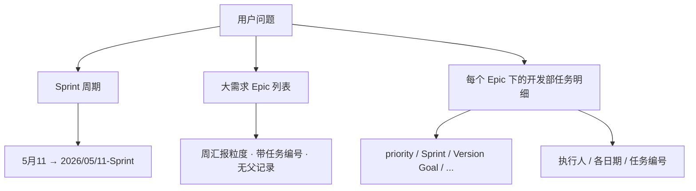
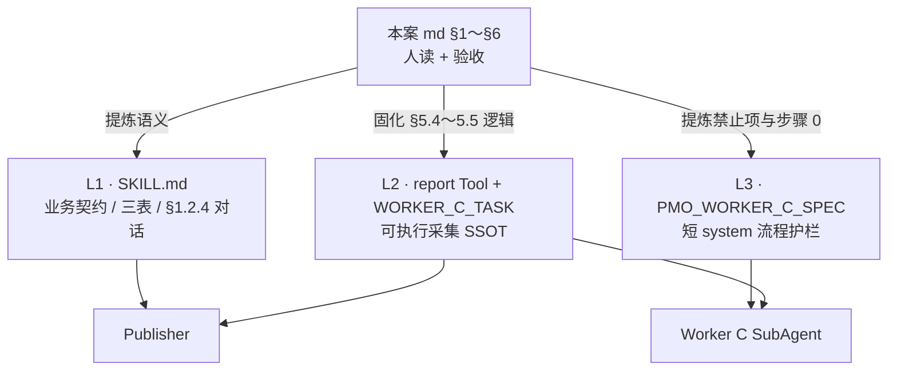
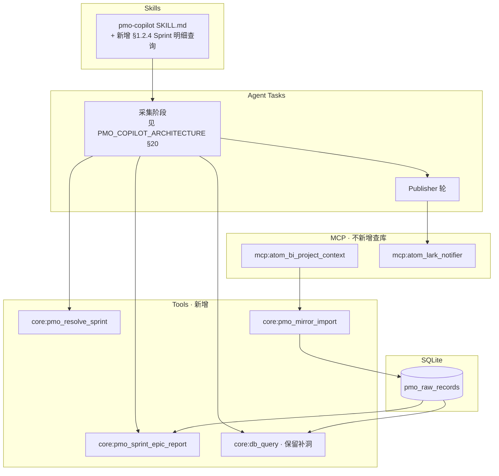

# PMO 镜像库查数案例：2026/05/11-Sprint 大需求与开发任务

> **文档用途**：记录一次「只查 `pmo_db.sqlite`、不改系统代码」的完整解题过程，方便 PMO、产品和工程师复现同类查询。  
> **案例日期**：2026-06-03  
> **数据库路径**：`C:\Users\Samuel\.jachin\workspace\pmo_db.sqlite`  
> **验证结论**：查询结果已与飞书看板人工核对，**数据正确**。

---

## 1. 用户到底要什么？

原始问题可以拆成三层：



| 层级 | 含义 | 在飞书 UI 上的样子 |
|------|------|-------------------|
| **时间窗** | 「5 月 11 这个周期」 | Sprint 列 = `2026/05/11-Sprint` |
| **大需求** | 周会要逐项报进度的 Epic | Sprint 分组下带序号、无上级父行的那一层 |
| **开发部任务** | 大需求下面、`父记录 = 开发` 再下面的具体任务 | 如「游戏加载-Mines 图片压缩…」 |

用户列出的字段，在库里对应飞书列名（英文键）如下：

| 用户说法 | 镜像 JSON 字段名 |
|----------|------------------|
| 优先级 priority | `priority` |
| Sprint 周期 | `Sprint` |
| Version Goal | `Version Goal` |
| Expectation/Purpose | `Expectation/Purpose` |
| 过程状态 progress | `Progress`（有时也用 `状态`） |
| 执行人 Person in charge | `Person in charge/Participant` |
| Start / Review / Acceptance Date | `Start Date` / `Review Date` / `Acceptance Date` |
| Expected / Actual Delivery Date | `Expected Delivery Date` / `Actual Delivery Date` |
| 任务编号 | `任务编号` |

**硬性约束**：不许改 Jachin 仓库里的 Skill、Agent、导入逻辑——**只允许读**上述 SQLite 文件。

---

## 2. 是谁在解题？和 PMO-Copilot 有什么关系？

这里必须分清两套「Agent」，避免以后读文档时混淆。

| 维度 | 本次案例（Cursor 里的编程助手） | Jachin PMO-Copilot（产品内 Skill） |
|------|--------------------------------|-------------------------------------|
| **运行环境** | Cursor IDE 对话 | `python scripts/run_pmo_copilot_skill.py` → L3 `run_agent` |
| **系统提示词来源** | Cursor 默认 Agent 说明 + 仓库 `.cursor/rules` + 用户规则 | `skills_repo/pmo-copilot/SKILL.md` + `pmo_multi_agent_orchestrator.py` 里 Worker A/B/C 角色前缀 |
| **查库方式** | 本机 **Python `sqlite3` 标准库** 直连数据库 | 工具 **`core:db_query`**（`l3_node/tools/pmo_db_tools.py`） |
| **是否改代码** | 否（仅临时脚本探查，未提交仓库） | 分析模式也不写库 |

**本次并没有启动 PMO-Copilot 的多 Agent 流水线**；但解题时**主动对照**了仓库里已经写好的业务规则（`SKILL.md §1.2.3`、`pmo_multi_agent_queries.py` 的 C-2/C-3 SQL），所以逻辑与 Worker C 一致，结果才能和飞书一致。

### 2.1 本次 Cursor Agent 实际怎么「工作」

可以把它理解成简化的 **ReAct 循环**（想一步 → 用工具 → 看结果 → 再想），而不是一条 SQL 蒙对：

1. **Thought**：先搞清楚库里有几张表、字段在哪，不能猜表名。  
2. **Action**：执行 Shell / 读文档 / 写一小段 Python 探针。  
3. **Observation**：表结构、`work_cycle` 样本、raw JSON 键名。  
4. 重复直到能稳定列出 Epic + 开发子任务。  
5. **Final Answer**：用人类可读的表格汇总（对话里回复用户）。

**系统提示词**：用户没有为这次对话单独写 prompt；生效的是 Cursor 内置的 Agent 指令，以及仓库规则（例如：四大原语、PMO 应用 `pmo_raw_records` 为 SSOT、禁止乱改无关代码等）。  
**没有**给 Cursor 注入 `SKILL.md` 全文；助手是通过 **Grep / Read** 主动打开相关文件对齐语义的。

### 2.2 若用 PMO-Copilot，系统提示词长什么样（对照）

产品内是多 Agent **方案 B**（见 `docs/architecture/PMO_COPILOT_ARCHITECTURE.md` §20）：

| 子 Agent | 角色 id | 提示词里强制什么 | 和本案例的关系 |
|----------|---------|------------------|----------------|
| **Worker A** | `analyst` | 查 `pmo_views_meta` + 每视图一条 `fields` 样本 | 本案例用 Python 查了 `columns_json`，等价 Step1 |
| **Worker B** | `analyst` | 人员看板 `vewCz1FFJi`（B-4 SSOT） | 本案例**未做**人员矩阵（用户问的是 Epic→开发任务） |
| **Worker C** | `analyst` | `vewpI8lyYw` 的 C-1/C-2/C-3：近三周 Sprint、大需求、子任务 | **本案例核心逻辑与 C-2/C-3 同构** |

Worker C 任务体片段（仓库 SSOT：`l3_node/pmo_multi_agent_queries.py`）大意是：

- **C-2**：`父记录` 为空 + 有 `任务编号` + 排除「开发/产品/美术…」占位行 → `epics[]`  
- **C-3**：`父记录` 非空 → `epic_children[]`；若 `父记录 = 开发`，需用 **行序** 挂回上一条大需求  

编排器还会在 Worker 的 system 前缀里追加：禁止硬编码需求名、禁止对 Person/状态 乱用 `[0].text`（否则 `malformed JSON`）等——这些坑在本案例的探针阶段也特意避开了。

---

## 3. 用了哪些工具？（按时间顺序）

| 步骤 | 工具 | 做什么 | 得到什么 |
|------|------|--------|----------|
| 1 | **Shell** | 尝试 `sqlite3 xxx.db ".tables"` | Windows 未安装 `sqlite3.exe`，命令失败 |
| 2 | **Shell + Python** | `sqlite3.connect()` 列库表、`PRAGMA table_info` | 发现 v6 表 `pmo_dev_requirements` 等与 v7 主路径 `pmo_raw_records` 并存 |
| 3 | **Grep** | 在仓库搜 `vewpI8lyYw`、`5月11`、PMO 架构 | 确认视图 ID、Sprint 命名规范 |
| 4 | **Read** | `PMO_COPILOT_ARCHITECTURE.md`、`pmo_multi_agent_queries.py` | 对齐「大需求 vs 部门小需求」规则 |
| 5 | **Shell + Python** | 查 `pmo_views_meta.columns_json` | 40 列英文字段名与用户问题一一对应 |
| 6 | **Shell + Python** | 按 Sprint 过滤 + 解析 `fields` JSON + `row_index` 建树 | **15 个大需求、26 条开发子任务** |
| 7 | **对话输出** | 整理表格、毫秒时间戳转日期 | 用户可见的中文战报式答案 |

**未使用**：`core:db_query`、MCP 拉表、LiteLLM、PMO CLI。  
**未修改**：任何 `l3_node/`、`skills_repo/` 下的生产代码。

---

## 4. 问题拆解与决策（为什么这样查）

### 4.1 先探库，再写业务 SQL

数据库里同时存在两类表：

| 类型 | 代表表 | 本次是否采用 | 原因 |
|------|--------|--------------|------|
| **v7 原文镜像** | `pmo_raw_records` + `pmo_views_meta` | ✅ 采用 | 架构文档写明：分析 SSOT 是 `fields` JSON |
| **v6 结构化抽取** | `pmo_product_requirements`、`pmo_dev_requirements` 等 | ❌ 已弃用 / 可从库中删除 | 与 `pmo_raw_records` 不同步，易误导；本地清理见 `scripts/purge_pmo_v6_tables.py` |

若只看 `pmo_dev_requirements`，会误以为「05/11 周期没有开发任务」——这是**表选错**，不是飞书没数据。分析请只查 **`pmo_raw_records`**。

### 4.2 把「5 月 11」翻译成机器可过滤的值

用户说的是自然语言 **「5 月 11 这个周期」**；数据库里不会存这四个汉字。Cursor 在这一步的目标只有一件事：**在库里找到「周期」对应哪一列、哪一种字符串写法**，然后再写过滤条件。下面按真实操作顺序写（不是事后理想化流程）。

#### 4.2.1 这一步在整体拆解里占什么位置


| 子问题 | 若猜错会怎样 | 本案例结果 |
|--------|----------------|------------|
| 表选对了吗？ | 查 v6 表 → 05/11 像「没数据」 | 最终用 **`pmo_raw_records`** |
| 列选对了吗？ | 用 `work_cycle` 只覆盖部分镜像 | 飞书 JSON 里是 **`Sprint`**（首字母大写） |
| 字面值写对了吗？ | `5月11` / `2026-05-11` → 0 行 | 必须是 **`2026/05/11-Sprint`** |

#### 4.2.2 Cursor 用了什么工具（逐步）

| 顺序 | Cursor 工具 | 具体动作 | Observation（看到了什么） |
|------|-------------|----------|---------------------------|
| 1 | **Shell** | 执行 `sqlite3 "…pmo_db.sqlite" ".tables"` | ❌ Windows 未安装 `sqlite3.exe`，命令不存在 |
| 2 | **Write + Shell** | 写临时脚本 `data/_pmo_query_tmp.py`，用 **Python 标准库 `sqlite3`** 连库 | ✅ 列出全部表名；确认有 `pmo_raw_records`、`pmo_product_requirements` 等 |
| 3 | **Write + Shell** | 脚本 `_pmo_query_tmp2.py`：`SELECT DISTINCT work_cycle FROM pmo_product_requirements` 等 | ✅ 在 **`work_cycle`** 里第一次看到 `2026/05/11-Sprint`（与 `2026/05/04-Sprint`、`2026/05/18-Sprint` 并列） |
| 4 | **Write + Shell** | 同脚本对 `pmo_dev_requirements` 做 `work_cycle LIKE '%5月11%'` / `'%0511%'` 计数 | ⚠️ **匹配数为 0**；只有 `2026/05/18-Sprint`、`2026/05/25-Sprint` → 触发「表或字段不对」警觉 |
| 5 | **Grep** | 在仓库搜 `vewpI8lyYw`、`5月11`、`PMO_COPILOT` | ✅ 对齐架构：周需求在视图 **`vewpI8lyYw`**，周期字段在 JSON 的 **`Sprint`**，不是 v6 的 `work_cycle` |
| 6 | **Read** | 打开 `l3_node/pmo_multi_agent_queries.py`（Worker C-1） | ✅ 确认 Sprint 格式为 **`YYYY/MM/DD-Sprint`**，且 C-1 用 `json_extract(fields, '$.Sprint')` |
| 7 | **Write + Shell** | 读 `pmo_raw_records` 样本：`json.loads(fields)` 看键名 | ✅ 样本行键里确有 **`Sprint`**、`Requirement`、`任务编号`（不是空 `fields`） |
| 8 | **Write + Shell** | 用 `SPRINT = "2026/05/11-Sprint"` 做 `COUNT` / 拉 Epic 样本 | ✅ 该 Sprint 下能稳定筛出 15 条大需求 → **翻译成功** |

说明：临时 Python 脚本跑完即删，**没有**改仓库业务代码；等价于你本机用 `python -c` 或 DBeaver 执行探针 SQL。

#### 4.2.3 自然语言 → 机器值的推理链（为何是 `2026/05/11-Sprint`）

1. **「周期」= 飞书 Sprint 列**  
   用户说的不是 `start_date` 某一天，而是 PMO 周会里的 **Sprint 迭代窗口**（与截图里列名 Sprint 一致）。

2. **「5 月 11」= Sprint 名称里的周一日期**  
   K11 项目命名规则（仓库 SKILL / Worker C）：`2026/05/11-Sprint` 表示以 **2026-05-11 所在周** 为一轮迭代，不是中文「5月11」四字入库。

3. **年份 2026 从哪来**  
   库里其它 Sprint 已是 `2026/05/04-Sprint`、`2026/05/18-Sprint`；用户对话日期在 2026 年 6 月，故取 **`2026/05/11`**，而不是 2025。

4. **为何否定其它写法**（探针验证，不是拍脑袋）

   | 尝试过的过滤 | 结果 |
   |--------------|------|
   | `work_cycle LIKE '%5月11%'`（v6 表） | 0 行或乱码计数，不可用 |
   | `work_cycle LIKE '%0511%'` | 仍对不上 v7 主数据 |
   | `json_extract(fields,'$.Sprint') = '2026-05-11'` | 0 行（分隔符是 `/` 不是 `-`，且无 `-Sprint` 后缀） |
   | `json_extract(fields,'$.Sprint') = '2026/05/11-Sprint'` | ✅ 与飞书、与后续 15 Epic 一致 |

#### 4.2.4 最终落库的过滤写法（v7 主路径）

在 **`pmo_raw_records`** 的 **`fields` JSON** 内，Sprint 存的是完整字符串：

```text
2026/05/11-Sprint
```

不是「5月11」中文，也不是 `2026-05-11` 短日期。写 SQL 或 Python 时用：

**单行只属于该 Sprint（常见）**

```sql
json_extract(fields, '$.Sprint') = '2026/05/11-Sprint'
```

**一行跨多个 Sprint（飞书用分号拼接）**

```sql
json_extract(fields, '$.Sprint') LIKE '%2026/05/11-Sprint%'
-- 或 Python: sprint_match(s) 判断 '2026/05/11-Sprint' in s.split('; ')
```

**务必同时限制视图**（否则扫到别的表镜像行）：

```sql
WHERE source_view = 'vewpI8lyYw'
  AND json_extract(fields, '$.Sprint') = '2026/05/11-Sprint'
```

#### 4.2.5 怎样判断「这一步成功了」

当时用的成功标准很简单，三条都满足才算 §4.2 完成：

1. **有数据**：`vewpI8lyYw` + 上述 Sprint 条件下，`COUNT(*) > 0`（本库为数百行量级，Epic 层 15 条）。  
2. **样本可读**：任意抽 1 条 `json.loads(fields)`，`Sprint` 字段肉眼等于 `2026/05/11-Sprint`。  
3. **交叉不矛盾**：同一 Requirement 若还带 `2026/05/04-Sprint; 2026/05/11-Sprint`，用 `LIKE` 或分号拆分纳入 05/11，与飞书「跨周需求」一致。

若只完成第 1 条但 Epic 数为 0，说明 Sprint 字面值仍错；若 v6 表有数而 `pmo_raw_records` 为 0，说明 **表选错**（见 §4.1）——本案例在 §4.2 第 4 步就靠 `pmo_dev_requirements` 计数为 0 识别出这个问题。

### 4.3 怎样算一条「大需求 Epic」

与 `SKILL.md §1.2.3` / Worker C-2 一致，**四条同时满足**：

1. `source_view = 'vewpI8lyYw'`（版本核心需求视图）  
2. `父记录` 为空（或空字符串；少数为 JSON 数组，需双形态判断）  
3. `任务编号` 非空（例如 `K11-02633`）  
4. `Requirement` 不是部门占位词（`开发`、`产品`、`美术`、`测试`…）

本次得到 **15** 条，与周会「大需求」行数一致。

### 4.4 怎样算「开发部子任务」

飞书层级通常是：

```text
大需求 Epic
  └── 开发          ← 父记录指向 Epic，Requirement 常显示「开发」
        └── 具体任务  ← 父记录 = 「开发」，Requirement 为「Epic名-子项」
```

库里用两条规则抓取：

1. **直接规则**：`父记录` 解析为 `开发`，且 `Requirement` 不是部门占位。  
2. **归属规则**：按 `row_index` 升序扫描同视图；遇到大需求行则记下当前 Epic 名；后面的 `父记录=开发` 行挂到该 Epic。

这与 Worker C 文档里「`parent_epic=开发` 时用行序归并到上一个大需求」一致。  
**没有**硬编码「游戏加载」「Tongits」等名字，所以以后 Epic 增减仍适用。

### 4.5 字段提取与常见坑

| 坑 | 现象 | 本案例做法 |
|----|------|------------|
| 对 `Person`、`状态` 套 `[0].text` | SQLite 报 `malformed JSON` | 先判断 `json_type`；字符串则直接 `json_extract` |
| 在 `pmo_dev_requirements` 查 05/11 | 0 行或错 Sprint | 改查 `pmo_raw_records` |
| 日期显示为 `1778428800000` | 飞书导出为**毫秒时间戳** | 除以 1000 再格式化为 `YYYY-MM-DD`（UTC，与本地 +8 可能差一天） |
| Epic 行也要 Version Goal | 多为空 | 如实报空；明细在子任务行 |

---

## 5. 一步步执行记录（可复现）

### 第 1 步：连接数据库，列出所有表

```python
import sqlite3
conn = sqlite3.connect(r"C:\Users\Samuel\.jachin\workspace\pmo_db.sqlite")
cur.execute("SELECT name FROM sqlite_master WHERE type='table' ORDER BY name")
```

关键发现：`pmo_raw_records`、`pmo_views_meta` 存在且应有数据。

### 第 2 步：确认 Sprint 真实取值

与 **§4.2** 同一探针：先扫 v6 `work_cycle` 见到 `2026/05/11-Sprint`，再在 **`pmo_raw_records` + `vewpI8lyYw` + `$.Sprint`** 上验证通过。

### 第 3 步：读视图字段字典

```sql
SELECT view_id, view_name, columns_json
FROM pmo_views_meta
WHERE view_id IN ('vewpI8lyYw', 'vewjSEz5Xr', 'vewCz1FFJi');
```

确认用户要的英文字段都在 `vewpI8lyYw`（40 列）里。

### 第 4 步：用与 C-2 等价的条件筛大需求

**并不是「一眼写出最终 SQL 就查对了」**。实际路径是：先写一版过于宽松的筛选 → SQL 报错或行数爆炸 → **Read/Grep 仓库里的 Worker C-2 模板** → 收紧规则 → 仍因 `父记录` 双形态在 Shell 里踩坑 → **改在 Python 里 `json.loads` 逐行判断** → 数出来 **15** 条，与飞书周会大需求行数一致。下面按这个真实顺序写。

#### 4步.1 这一步要回答的子问题

| 子问题 | 错误做法 | 本案例正确做法 |
|--------|----------|----------------|
| 什么叫「大需求」？ | 把所有无父记录行都当 Epic | 还要 **有任务编号**、**排除「开发」等占位行** |
| 条件写在哪？ | 继续用 v6 表 | 只查 **`pmo_raw_records` + `vewpI8lyYw`** |
| 用 SQL 还是代码？ | 强行一条超长 `json_extract` | Sprint 用 SQL 过滤；Epic 规则用 **Python 解析 `fields`** |
| 怎样算成功？ | `COUNT(*)` 很大就行 | **15 条** Epic，且名称能与飞书顶层行对上 |

#### 4步.2 用了什么工具（按时间顺序）

| 顺序 | 工具 | 做了什么 | 结果 |
|------|------|----------|------|
| 1 | **Write + Shell** | 脚本 `_pmo_query_main.py`：在 `vewpI8lyYw` 里用「`父记录[0].text` IS NULL + Sprint 含 05/11」试筛 | ❌ SQLite **`malformed JSON`**（镜像里 `父记录` 常为 **plain string**，不是数组） |
| 2 | **Read** | 打开 `l3_node/pmo_multi_agent_queries.py` 第 80～92 行 | ✅ 拿到仓库 SSOT：`_PARENT_EPIC_NULL_SQL`、`_DEPT_PLACEHOLDER_IN`、C-2 完整 WHERE |
| 3 | **Grep + Read** | 搜 `§1.2.3`、`父记录`、`C-2` → `skills_repo/pmo-copilot/SKILL.md` | ✅ 确认「大需求 = 无父记录 + 有编号 + 非部门占位」，与飞书红框语义一致 |
| 4 | **Write + Shell** | `_pmo_query_tmp3.py`：宽松条件 `node_kind Epic` + `work_cycle LIKE %05/11%` 在 **v6 产品表** 上计数 | ⚠️ **227** 条——明显过多，说明条件太宽或表不对 |
| 5 | **Write + Shell** | 同一阶段改查 `pmo_raw_records`：只看 `Sprint` 精确匹配 + 样本 `json.loads` 看键 | ✅ 确认 Epic 行有 `Requirement`、`任务编号`；顶层行 **Person 常为空** |
| 6 | **Write + Shell** | `_pmo_query_0511.py`：Pull 全表 `vewpI8lyYw` + 05/11 Sprint 行 → Python 函数 `is_big_epic()` | ✅ **15** 条 Epic，与人工核对一致 |

临时脚本事后已删除；逻辑已收敛进下文「概念 SQL + Python 伪代码」。

#### 4步.3 SQL 条件是怎么「拼」出来的（对照 Worker C-2）

仓库里 PMO-Copilot **Worker C-2** 的 WHERE 不是 Cursor 发明的，而是从下面片段 **逐条翻译** 成可执行条件（Sprint 列表在本案例收窄为固定的 `2026/05/11-Sprint` 一周）：

```81:92:l3_node/pmo_multi_agent_queries.py
_PARENT_EPIC_NULL_SQL = (
    "(json_extract(fields, '$.\"父记录\"') IS NULL\n"
    "   OR json_extract(fields, '$.\"父记录\"') = ''\n"
    "   OR json_extract(fields, '$.\"父记录\"[0].text') IS NULL)"
)
_DEPT_PLACEHOLDER_IN = (
    "'开发','美术','产品','测试','平台前端','平台后端','游戏','中台','后台','游戏客户端'"
)
```

拼进 SELECT 后，**概念上**等价于：

```sql
-- 概念等价于 Worker C-2（本案例 Sprint 固定为 05/11 一周，非 C-1 近三周 IN）
SELECT
  json_extract(fields, '$.Requirement')       AS epic_name,
  json_extract(fields, '$.Sprint')             AS sprint,
  json_extract(fields, '$.priority')           AS priority,
  json_extract(fields, '$."Version Goal"')     AS version_goal,
  json_extract(fields, '$."Expectation/Purpose"') AS expectation_purpose,
  json_extract(fields, '$.Progress')           AS progress,
  trim(json_extract(fields, '$."Person in charge/Participant"')) AS person,
  json_extract(fields, '$."Start Date"')       AS start_date,
  json_extract(fields, '$."Review Date"')       AS review_date,
  json_extract(fields, '$."Acceptance Date"')  AS acceptance_date,
  json_extract(fields, '$."Expected Delivery Date"') AS expected_delivery_date,
  json_extract(fields, '$."Actual Delivery Date"')   AS actual_delivery_date,
  json_extract(fields, '$."任务编号"')         AS task_no
FROM pmo_raw_records
WHERE source_view = 'vewpI8lyYw'
  AND json_extract(fields, '$.Sprint') = '2026/05/11-Sprint'
  -- 父记录「为空」三选一（字符串 / NULL / 数组无 text），见 _PARENT_EPIC_NULL_SQL
  AND (
    json_extract(fields, '$."父记录"') IS NULL
    OR json_extract(fields, '$."父记录"') = ''
    OR json_extract(fields, '$."父记录"[0].text') IS NULL
  )
  AND json_extract(fields, '$."任务编号"') IS NOT NULL
  AND trim(json_extract(fields, '$.Requirement')) != ''
  AND json_extract(fields, '$.Requirement') NOT IN (
    '开发','美术','产品','测试','平台前端','平台后端','游戏','中台','后台','游戏客户端'
  )
ORDER BY epic_name;
```

**为什么没有「一步在 Shell 里跑通这条 SQL」？**

- 在 Windows 上直接复制 C-2 时，若误写成 **只** `json_extract(fields, '$."父记录"[0].text') IS NULL`，会把 **plain string 的「开发」父行** 判错，或触发 **malformed JSON**。  
- 本案例在探针阶段已遇到过一次报错，因此 **Epic 筛选改为 Python**：`fields = json.loads(...)`，用 `parent_text(fields)` 统一处理字符串 / 数组两种 `父记录`，逻辑与 `_PARENT_EPIC_NULL_SQL` **同义**，但更稳。

Python 侧核心判断（与上表 SQL 同义，便于复现）：

```python
def parent_text(fields: dict) -> str | None:
    p = fields.get("父记录")
    if p is None:
        return None
    if isinstance(p, str):
        return p.strip() or None
    if isinstance(p, list) and p and isinstance(p[0], dict):
        return (p[0].get("text") or "").strip() or None
    return None

def is_big_epic(fields: dict) -> bool:
    req = (fields.get("Requirement") or "").strip()
    if not req or req in DEPT_PLACEHOLDERS:
        return False
    if parent_text(fields):
        return False
    if not fields.get("任务编号"):
        return False
    sprint = fields.get("Sprint") or ""
    return sprint == "2026/05/11-Sprint" or "2026/05/11-Sprint" in sprint.split("; ")
```

#### 4步.4 从「错」到「对」的三次收敛（不是一次写对）

| 轮次 | 条件 | 行数 / 现象 | 结论 |
|------|------|-------------|------|
| A | 仅 `父记录[0].text IS NULL` + Sprint | SQL 报错 | 父记录不能按单一 JSON 形态写 |
| B | v6 表 `node_kind=Epic` + work_cycle 含 05/11 | **227** | 表错 + 规则太宽，会把 Story/重复镜像算进去 |
| C | v7 + `is_big_epic()`（C-2 四条） | **15** | 与飞书周会大需求一致 → **采用** |

第 B 轮说明：即使用对了 Sprint 字符串，若缺少 **「必须有任务编号」** 和 **「排除开发/产品占位行」**，会把部门中间层、子任务误算进 Epic，数量会远大于 15。

#### 4步.5 怎样判断「这一步成功了」

1. **数量级**：`vewpI8lyYw` + `2026/05/11-Sprint` 下 Epic **= 15**（不是 0，也不是两百多）。  
2. **抽样**：任意 Epic 如 `游戏加载`、`后台BI数据优化`，在飞书里都是 Sprint 分组下带 **K11-xxxxx** 编号的顶层行。  
3. **排除**：单独一行 `Requirement = 开发` 且 `父记录` 指向某 Epic 的，**不会**出现在 Epic 列表里（它们留给 §5 第 5 步当子任务/中间层）。

结果：**15 行大需求（Epic）**；字段若为空（如 Epic 行上的 Version Goal、Person），在结果里**如实留空**，不编造。

### 第 5 步：筛开发子任务并挂接 Epic

1. 取出 `source_view='vewpI8lyYw'` 且 Sprint 含 `2026/05/11-Sprint` 的所有行，按 `row_index` 排序。  
2. 遍历：若满足 Epic 条件 → 记 `current_epic`；若 `父记录=='开发'` → 记入 `dev_tasks`，`parent_epic = current_epic`。  
3. 输出每条任务的 priority、各日期、Person、任务编号等。

结果：**26 条开发任务**，分布在 **7 个大需求** 下（其余 8 个大需求在本 Sprint 切片无「开发」子行）。

### 第 6 步：人工可读化

**不是**再查一次库，也**不是**单独跑了一个「排版 MCP/Tool」。  
第 5 步结束时，手里已经有一份 **结构化结果**（Python 打印到终端 + 内存里的 `epics[]` / `dev_tasks[]`）。第 6 步做的是：**把机器 JSON 翻成 PMO 能直接看的 Markdown**，由 **Cursor Agent（LLM）在对话里组装 Final Answer** 完成；日期换算等简单规则在写回复前用 **Shell/Python 心算或脚本** 处理好。

在 Jachin 里，同一角色对应 **Publisher 轮**（`SKILL.md` §1.4 三表 + `mcp:atom_lark_notifier`），不是 `core:db_query`。

#### 6步.1 这一步在流水线里占什么位置


| 输入 | 输出 | 谁来做 |
|------|------|--------|
| `task_no`、`priority`、毫秒日期、空字符串 | 带中文列名的表格、按 Epic 分节 | **Agent 排版**（本案例 = Cursor 对话回复） |
| 用户原始问题里的字段清单 | 列与用户问题一一对应 | Agent 对照本文档 §1 字段表 |
| 15 / 26 / 7 这些数字 | §6 摘要表 | 对 `epics[]`、`dev_tasks[]` **计数**（可脚本可手算） |

#### 6步.2 用了什么工具（按时间顺序）

| 顺序 | 工具 | 做了什么 | 说明 |
|------|------|----------|------|
| 1 | **（无工具）Observation** | 读第 5 步 Shell 输出：每个 Epic 下打印的 `### 开发任务` 块 | 数据已在终端/上下文里，不必再 `db_query` |
| 2 | **Shell / Python** | `datetime.fromtimestamp(ms/1000)` 把 `1778428800000` → `2026-05-10` 等 | 可在脚本里做，也可在写回复前逐条换算；**不写入库** |
| 3 | **Read**（可选） | 回看用户消息 + 本文档 §1「用户说法 ↔ JSON 字段名」 | 保证表头叫「预计交货日期」而不是裸 `Expected Delivery Date` |
| 4 | **Agent 生成（Final Answer）** | 在 Cursor 对话里写 Markdown：先总览表，再按 Epic 展开子表 | **没有**调用 Write 生成独立 `.md` 战报文件给用户 |
| 5 | **（曾用 Write）** | 临时写入 `data/_pmo_0511_query_result.json` 便于自检 | 全量 JSON 备份；**非**给人看的 deliverable，事后已删 |

**没有使用**：Grep（本步不需要）、新的 SQL、飞书推送。  
**与 Tool 边界**：若已封装 `core:pmo_sprint_epic_report`，Tool 只到 **JSON**；第 6 步仍在 **Agent + Skill**（Jachin 即 Publisher）。

#### 6步.3 「组装成人话」具体怎么做（四条规则）

**① 先对齐用户问题的列，再填值**

用户问的是一串业务名（priority、Version Goal、执行人、各日期…）。排版时按 **§1 表格** 做列，而不是把 JSON 键名原样扔给用户：

| 用户说法 | 回复表头示例 | 数据从哪来 |
|----------|--------------|------------|
| 任务编号 | 任务编号 / 编号 | `任务编号` → `K11-02764` |
| 优先级 priority | priority / 优先级 | `priority` → `P0` |
| 执行人 | 执行人 / Person in charge | `person_in_charge`，多人用 `; ` 连接 |
| 预计/实际交货 | 预计交货 / 实际交货 | 毫秒 → `YYYY-MM-DD` 后再填入 |

**② 按 Epic 分组，而不是 41 行平铺**

结构是：

```text
## 一、15 个大需求（清单表）
## 二、有开发任务的 Epic（每个 Epic 一个小节）
   ### Epic 8 · 游戏加载
   | 开发任务 | 编号 | P | 执行人 | … |
   | … | … | … | … |
```

这样和飞书「大需求 → 开发 → 子任务」层级一致，PMO 不用自己在心里 join。

**③ 日期：机器数 → 人话**

库里常见 `Start Date: 1778428800000`（毫秒）。换算规则：

```python
# 概念代码（案例里用 UTC 格式化）
from datetime import datetime, timezone
datetime.fromtimestamp(1778428800000 / 1000, tz=timezone.utc).strftime("%Y-%m-%d")
# → 2026-05-10（与本地 +8 可能差一天，回复里可注明 UTC）
```

子任务表里的日期列用 **换算后的 `2026-05-xx`**；Epic 顶层行若本来就没有日期，表内写 **「—」或「全空」**，不拿子任务日期顶替 Epic 行（避免造假）。

**④ 空字段要「说清楚是空」，不是漏查**

Epic 层常见 `Version Goal`、`Progress`、`Person` 在镜像里就是 `null`/空串。回复里：

- 表格单元格写 **—** 或 **全空**；  
- 正文点明：**「镜像中该列为空，非查询遗漏」**（对应用户规则里的数据诚实）。

开发子任务里多数有 Person、日期；Epic 层没有执行人时**不编造 Ethan 等**——案例里 15 条 Epic 的 Person 多为空，与库一致。

#### 6步.4 汇总表（§6）是怎么来的

文档 **§6 最终结果摘要** 不是第四次查库，而是对第 5 步结果的 **聚合统计 + 命名列举**：

| 指标 | 怎么算 / 怎么写 |
|------|-----------------|
| Sprint | 固定写入已验证的 `2026/05/11-Sprint` |
| 大需求 15 | `len(epics)`，且每条满足 §4.3 四条 |
| 开发子任务 26 | `len(dev_tasks)`，`父记录=开发` 挂接后去重 |
| 有开发任务的 Epic 7 | 存在 `dev_tasks` 且 `parent_epic == epic.requirement` 的 Epic 个数；并 **点名** 7 个名称方便核对 |

「后台 BI、Tongits、游戏加载…」来自第 5 步分组输出里 **非空子任务** 的 Epic 名列表，不是硬编码在文档里的常量（换 Sprint 重跑会变）。

#### 6步.5 怎样判断「人工可读化成功了」

1. **对照用户清单**：用户问的每个字段在表里有列或有「空」的说明。  
2. **可核对**：PMO 拿飞书 `2026/05/11-Sprint` 视图，能对着 15 个 Epic 名、26 条开发任务名逐条找到。  
3. **不夸大**：没把 8 个「无开发子行」的 Epic 说成「没有开发」——而是写清「本 Sprint 切片下无 `父记录=开发` 子行」。  
4. **用户确认**：本案例你已确认「数据全部都是对的」——第 6 步以该反馈为验收。

#### 6步.6 在 Jachin 里谁来做同一件事（对照）

| 本案例（Cursor） | Jachin PMO-Copilot |
|------------------|-------------------|
| Agent 在对话里出 Markdown 表 | **Publisher** `run_agent` 一轮，按 §1.4 输出三张 GFM 表 |
| 无飞书推送 | `mcp:atom_lark_notifier` ×2（主群 + 监控群） |
| 诚实空值靠 Agent 自觉 | SKILL + `_HONESTY_BLOCK`、Auditor 检查 `field_empty` |
| 日期仍建议在 Tool 层转好 | 未来 `core:pmo_sprint_epic_report` 可输出 ISO 日期，减轻 Publisher 算错 |

---

## 6. 最终结果摘要（便于对照文档）

本节是第 6 步的 **「总览页」**：给忙的人一眼看指标；细节在第 6 步按 Epic 展开的子表里。

| 指标 | 数值 | 含义（人话） |
|------|------|--------------|
| Sprint | `2026/05/11-Sprint` | 本次过滤用的迭代周，对应用户说的「5 月 11 周期」 |
| 大需求（Epic） | **15** | 周会要报进度的顶层需求行数 |
| 开发子任务 | **26** | 挂在「开发」下的具体任务行数 |
| 有开发子任务的 Epic | **7** | 15 个 Epic 里，只有 7 个在本 Sprint 镜像里带了开发子任务；其余 8 个不是没 Epic，而是 **没有开发子行** |

完整行级明细在当次对话的 Markdown 回复中（按 Epic 分节的长表）；机器可读全量曾落于临时 JSON，**复现查数**请跑第 5 步逻辑（或未来的 `core:pmo_sprint_epic_report`），**复现版式**由 Agent/Publisher 按 §1 字段表重新排版。

---

## 7. Jachin 快速入口（集成后）

```bash
# 1) 镜像未就绪时
python scripts/run_pmo_copilot_skill.py --init

# 2) 周战报 / 分析（多 Agent 或单 Agent，见 §10）
python scripts/run_pmo_copilot_skill.py --analysis-only

# 3) 仅问「某 Sprint 大需求 + 开发任务」（集成后推荐显式 user message）
python scripts/run_pmo_copilot_skill.py --analysis-only --message "查询 2026/05/11-Sprint 大需求及开发部任务明细"
```

**完整集成规格见下文 §10**；**Worker C 如何学到本案 Cursor 查对能力**见 **§10.2**。  
**实现状态（2026-06-03）**：已落地 `core:pmo_sprint_epic_report`、`core:pmo_resolve_sprint`（`l3_node/tools/pmo_sprint_query.py`）、Worker C 宿主预取 + `PMO_WORKER_C_SPEC.md`、Skill §1.2.4；单测/实库 `2026/05/11-Sprint` 验收 **15/26/7**。

---

## 8. 经验总结（给后来的人）

1. **先问 SSOT 表**：v7 分析只看 `pmo_raw_records`，别看废弃感的 v6 业务表。  
2. **先对齐视图 ID**：开发大需求在 `vewpI8lyYw`，人员矩阵在 `vewCz1FFJi`，产品状态在 `vew8TxMcSh`。  
3. **层级靠结构，不靠记名字**：`父记录` + `任务编号` + 部门占位排除 + `row_index` 归并。  
4. **JSON 字段分类型**：开发表的 Person/状态常常是字符串，别照搬产品表 `[0].text` 写法。  
5. **Cursor 手工查库 ≈ Worker C + Tool**：查对逻辑进 **`core:pmo_sprint_epic_report`** + Worker C 专属短规范（§10.2），不是把案例全文塞进 Skill。  
6. **文档与代码 SSOT**：  
   - 架构：`docs/architecture/PMO_COPILOT_ARCHITECTURE.md`  
   - SQL 模板：`l3_node/pmo_multi_agent_queries.py`  
   - 业务语义：`skills_repo/pmo-copilot/SKILL.md` §1.2.3  

---

## 9. 修订记录

| 日期 | 说明 |
|------|------|
| 2026-06-03 | 首版：基于 Cursor Agent 实测查库过程整理，结果已用户确认正确 |
| 2026-06-03 | 增补 §10：Jachin 集成方案（Tool / Skill / 编排 / 判定，无代码） |
| 2026-06-03 | `pmo-copilot` SKILL v7.2.13：移除 Worker/多 Agent 正文，编排仅指架构文档 |
| 2026-06-03 | §10.2 新增：Cursor 智能化分解 + Worker C 如何学到（三层载体 / 专属规范 / 实施清单） |
| 2026-06-03 | **代码落地**：`pmo_sprint_query.py`、Worker C 预取/backfill、Skill v7.2.14 |

---

## 10. Jachin 集成方案：复现本案例全流程

> **目标**：用户在 Jachin 中说「查 5月11 周期大需求及开发任务各字段」，系统稳定得到与本文档 §6 一致的 **15 Epic / 26 开发任务** 及可读战报，且不再依赖 Agent 每轮手写 C-2 SQL。  
> **范围**：本文档 §1～§6 的查数 + 人话化；**不**替代 PMO 全量七步探针、双群推送以外的分支 B。  
> **原则**：**查对 = Native Tool（Python）**；**听懂人话 / 排版 / 推送 = Skill + Agent**；**不新增查库 MCP**。  
> **Worker C 智能化**：先读 **§10.2**（如何把 Cursor 本案能力教给 Worker C）；Tool/编排细则见 §10.3～§10.13。

### 10.1 复现定义（验收标准）

| 维度 | 目标态（以 2026/05/11-Sprint 为基准场景） | 验收方式 |
|------|------------------------------------------|----------|
| 数据正确性 | Epic **15** 条；开发子任务 **26** 条；有开发子任务的 Epic **7** 个 | 与飞书 `vewpI8lyYw` 人工核对（本案例已验收） |
| 数据源 | 仅 `pmo_raw_records`，`source_view=vewpI8lyYw`；**禁止**读 v6 表 | `pmo_mirror_db_ready` + 无 `pmo_dev_requirements` 误查 |
| Sprint 解析 | 「5月11」「05/11」→ `2026/05/11-Sprint`（可配置 year） | Tool `resolve` 或 Agent 澄清后传入精确 sprint |
| 字段完整 | 用户问到的列均有值或显式 `null`/`field_empty` | Publisher 表头对照 §1 字段表 |
| 层级 | 大需求与子任务分开展示；`parent_epic` 正确 | JSON 结构 + 📊 表每行一大需求 |
| 性能/成本 | 该查询 **≤2 次** tool call（resolve + report），非 10+ 轮 db_query | 调试日志 / `_pmo_db_query_count` |

---

### 10.2 如何让 Worker C 学到 Cursor 级智能化（核心导读）

> **读者**：要让 FanOut 里「采集大需求+子任务」的子 Agent 达到本案 Cursor 的**查对稳定性**，请读本节再动代码。  
> **误区**：把本文档 §1～§6 全文注入 Worker C 的 system，或指望加长 `SKILL.md` 让 Worker C 自己读——**均无效**（见 §10.2.1）。  
> **正解**：把 Cursor 真正起作用的能力**拆到三层载体**；Worker C 只负责其中「采集 JSON」一段，且**优先用 Python Tool 而非 LLM 猜 SQL**。

#### 10.2.1 Cursor 的「智能化」到底是什么？

本案 Cursor **不是**「一条 SQL 写对」，而是 **ReAct + 多工具 + Python 解析** 的组合（§2.1、§5）：

| 能力块 | 本案 Cursor 怎么做 | 现网 Worker C（未集成 §10 Tool 前） | 要对齐应落在哪 |
|--------|-------------------|-------------------------------------|----------------|
| 探表、弃 v6、认 Sprint | Shell/Python 探针 + Read/Grep 仓库 | 假定 INIT 已完成；C-1 用 SQL，易踩日期格式 | INIT + `pmo_resolve_sprint`（窄路径） |
| **Epic / 开发任务判对** | **`json.loads(fields)` + 父记录双形态 + `row_index` 扫表** | 多轮 `json_extract` SQL，易 malformed / 227 条 | **`core:pmo_sprint_epic_report`（Python）** |
| 指定「5月11」单 Sprint | 用户句 + 探针 → `2026/05/11-Sprint` | 任务体写死 **近 21 天最多 3 Sprint** | 窄路径主 Agent；或 orchestrator 向 Worker C 注入 `target_sprint` |
| 试错、改策略 | 多轮 Thought，宽筛→收窄 | 同编号 SQL 重试 ≤2 次，**不能**换解析策略 | Tool 一次算对；SQL 仅兜底 |
| **人话表格（§6）** | LLM 在对话里排版 | Worker C 要求 **只出 JSON** | **Publisher** + `SKILL.md` §1.4 |

结论：**「查对」的智能化在 Python；「好看」的智能化在 Publisher。** Worker C 的目标是与 Cursor **§5 第 4～5 步** 同级，不是复刻 Cursor 全文探索过程。

#### 10.2.2 Worker C 运行时读什么？（不是 SKILL.md）

多 Agent FanOut 里，Worker C 是 `SubAgent`，**不会**加载 `pmo-copilot/SKILL.md` 全文（SKILL 只给单 Agent 回退路径和阶段三 Publisher 用 `gateway_inject`）。

| 注入位置 | 代码 SSOT | 放什么 | 上限/注意 |
|----------|-----------|--------|-----------|
| **system** | `pmo_multi_agent_orchestrator.py` → `_PMO_WORKER_C_RULES` + `_PMO_WORKER_SHARED` | 流程顺序、禁止项、JSON 字段名、**先 Tool 后 SQL** | `PMO_WORKER_SYSTEM_PREFIX_MAX_CHARS` ≈ **3200**；宜抽成 `docs/architecture/PMO_WORKER_C_SPEC.md` 加载 |
| **user 任务体** | `pmo_multi_agent_queries.py` → `WORKER_C_TASK` | C-1～C-6 **逐字 SQL**（兜底）、`completed_sql_ids` | 可较长；**不要**与 system 重复贴全文 SQL |
| **工具白名单** | `PMO_WORKER_C_ROLE["allowed_tools"]` | 实现后：`core:pmo_sprint_epic_report` + `core:db_query` | 无 Tool 则模型只能 SQL 兜底 |
| **可选 context** | FanOut `context_data`（仿 Worker B 宿主预取） | 宿主已跑 report 的 `epics[]`/`dev_tasks[]` | 最稳：Worker C **几乎不安排**采集轮次 |

你要的「给 Worker C 单独写一个小 md，当 system 注入」= **把 `_PMO_WORKER_C_RULES` 提炼成 `PMO_WORKER_C_SPEC.md`（建议 ≤2500 字）**，启动时读入 `system_prefix`。**不是**注入本案 `PMO_DB_QUERY_CASE_STUDY_*.md` 全文。

#### 10.2.3 三层「教学」模型（案例知识 → Worker C）



| 层 | 教 Worker C 什么 | 是否注入 Worker C system | 案例对应 |
|----|------------------|--------------------------|----------|
| **L1** | 什么叫大需求、诚实空值、三表列含义 | **否**（Worker C 不读；Auditor/Publisher/人读） | §1、§6 表头 |
| **L2a** | **怎么算对** 15 Epic / 26 开发任务 | **否**（Python 执行，非 prompt） | §5 第 4～5 步 → `core:pmo_sprint_epic_report` |
| **L2b** | Tool 失败时 C-1→C-2→C-3 顺序 | **user 任务体** | §5 + `pmo_multi_agent_queries.py` |
| **L3** | 必须先 Tool、禁止 malformed JSON、Final Answer 形状 | **是**（专属短规范） | §5 教训 + §10.9 规则摘要 |

**智能化 ≠ prompt 更长**；**智能化 = 把 Cursor 里只有 Python 能做对的部分，从 ReAct 挪到 L2a**。

#### 10.2.4 Worker C 专属短规范应写什么？（`PMO_WORKER_C_SPEC` 提纲）

建议单独维护 `docs/architecture/PMO_WORKER_C_SPEC.md`（或继续用 `_PMO_WORKER_C_RULES` 字符串），**只含流程与护栏**，结构如下：

```markdown
## 0. 目标
输出 JSON：current_sprint, recent_sprints[], epics[], epic_children[], completed_sql_ids
禁止 GFM 战报；禁止 vewCz1FFJi/产品/美术表（纠错仅 fields LIMIT 1）

## 1. 步骤 0（必须，实现 report Tool 后）
Action: core:pmo_sprint_epic_report
Action Input: {"sprint": "<current_sprint 或宿主 target_sprint>"}
成功 → 用 Observation 填 epics[] / epic_children[]（或 dev_tasks[] 映射），跳至 Final Answer

## 2. 步骤 1～3（仅步骤 0 失败）
严格按 user 任务体 C-1 → C-2 → C-3 逐字 SQL；C-6 最多 1 次

## 3. 禁止（本案教训）
- 禁止仅 父记录[0].text IS NULL 当 Epic 条件
- 禁止对 Person/状态用 [0].text（malformed JSON）
- 禁止 JSON 包装 db_query；禁止未失败就重跑 C-2

## 4. 数据诚实
Observation null → JSON null；禁止编造 priority/人名/日期
```

**不要**在此文件贴完整 C-2/C-3 SQL（放 `WORKER_C_TASK`，避免 system 截断后丢失「步骤 0 必须先 Tool」）。

#### 10.2.5 三种稳定度（你要的「智能化」到哪一档）

| 档位 | 做法 | ReAct 轮次（采集） | 能否达到本案 15/26 |
|------|------|-------------------|-------------------|
| **A · 仅加长 system** | 只写 `PMO_WORKER_C_SPEC`，仍只有 `db_query` | 常 6～12 轮，易重复 SQL | **难稳定** |
| **B · Tool 优先（推荐）** | L3 规定步骤 0 + `allowed_tools` 含 report；L2b SQL 兜底 | **1～4 轮** | **可稳定**（单测 + 飞书核对） |
| **C · 宿主预取（最稳）** | FanOut 前 Python 跑 report，`context_data` 注入 Worker C | **0～2 轮**（核对 JSON） | **最接近** Cursor「脚本已跑出 epics[]」 |

本案 Cursor 在跑脚本后，LLM 主要做 **§6 排版**；档位 **C** 最还原「数据已在手、少折腾查库」的体验。

#### 10.2.6 案例两条用户路径 → 谁学 Cursor 的哪一段

| 用户意图 | 学本案 Cursor 的 Agent | 集成形态 |
|----------|------------------------|----------|
| 「查 5月11 大需求+开发字段」（本案原问） | **主 Agent** + `SKILL` §1.2.4 + resolve/report | §10.6 **模式 A**（窄路径） |
| 周战报「近三周 + current_sprint」 | **Worker C** + report Tool + `PMO_WORKER_C_SPEC` | §10.6 **模式 B**（全量 FanOut） |

勿让 Worker C 同时承担「任意 Sprint ad-hoc」与「战报近三周」两套入口，否则即使用专属 system，模型也易 **安排乱轮次**。

#### 10.2.7 实施清单：按顺序「教」Worker C（可勾选）

1. **[P0]** 实现 `core:pmo_sprint_epic_report`，逻辑同源 §5 第 4～5 步 + `pmo_multi_agent_queries` 常量；单测 `epic_count=15`、`dev_task_count=26`。  
2. **[P0]** 新建或充实 `PMO_WORKER_C_SPEC.md` → 载入 `_PMO_WORKER_C_RULES`（步骤 0 必须先 report）。  
3. **[P0]** `WORKER_C_TASK` **顶部**增加「步骤 0：report」；保留 C-1～C-3 为 **仅失败时** 兜底。  
4. **[P0]** `PMO_WORKER_C_ROLE["allowed_tools"]` 增加 `core:pmo_sprint_epic_report`。  
5. **[P1]** `pmo_worker_result_backfill.backfill_worker_c`：**先** report Tool，**再** `sql_worker_c_c2`。  
6. **[P2 可选]** FanOut 前宿主对 `current_sprint` 预跑 report → `context_data`（档位 C）。  
7. **[P1]** `SKILL.md` §1.2.4 + 执行映射表（L1，给 Publisher/窄路径，**不**替代 Worker C spec）。  
8. **[验收]** §10.12 自检清单 + 调试日志可见 report，而非 10+ 轮 C-2 试错（与 §10.2.5 档位 B/C 一致）。

#### 10.2.8 仍由谁负责「像 Cursor 一样会说话」？

| 本案步骤 | 负责方 |
|----------|--------|
| §5 第 4～5 步 查对 | `core:pmo_sprint_epic_report` + Worker C JSON |
| §5 第 6 步 中文表、按 Epic 分节 | **Publisher**（`SKILL` §1.4 + `pmo_report_format.py`） |
| §4.2 口语 Sprint | `core:pmo_resolve_sprint` 或主 Agent 澄清（窄路径） |

Worker C **不应**在 Final Answer 里写 §6 那种 Markdown 战报；那会导致与 Auditor/Publisher 职责混乱。

---

### 10.3 四大原语分工（身份一览）



| 原语 | 身份 | 本案例职责 |
|------|------|------------|
| **MCP** | 现有 `atom_bi`、`atom_lark_notifier` | INIT 拉表；战报推送。**不**新增 `mcp:pmo_query` |
| **Tools** | 新增 1～2 个 `core:*` + 保留 `db_query` / `mirror_import` | **固化 §4～§5 查数**；日期 ISO 化；返回 JSON |
| **Skills** | 扩写 `pmo-copilot/SKILL.md` | 何时调新 Tool、字段对照、诚实空值、与 §1.4 三表关系 |
| **Agent Tasks** | `run_agent`、FanOut Worker C、Publisher | 拆人话 → 调 Tool → 排版 / 推送 |

---

### 10.4 需新增的 Tools（规格，不写实现代码）

#### 10.4.1 `core:pmo_resolve_sprint`（可选但推荐）

**用途**：对应案例 **§4.2**（自然语言 / 日期 → 机器 Sprint 名）。

| 项 | 说明 |
|----|------|
| 入参 | `sprint`（精确串，可选）· `sprint_date`（`YYYY-MM-DD`，可选）· `label`（自然语言，如 `5月11`，可选）· `year`（整数，可选；默认取库内 Sprint 最大年） |
| 行为 | 只读 `pmo_raw_records`，`DISTINCT Sprint`；按 `YYYY/MM/DD-Sprint` 正则匹配 `sprint_date` 或 `label`；入参全空时列出近三周 Sprint 供选 |
| 出参 | `status`、`resolved_sprint`（唯一匹配时）、`candidates[]`（每项含 `{sprint, sprint_date, row_count}`）、`ambiguous: true`（候选 > 1） |
| 失败 | `error_class=config`（库空/镜像未就绪）· `ambiguous=true` 时 Agent 须向用户列出候选让其确认，**禁止猜** |

**判定成功**：`resolved_sprint` 非空且能在 `pmo_raw_records` 找到对应行；或 `candidates` 列出 ≥1 条供用户选择。

#### 10.4.2 `core:pmo_sprint_epic_report`（核心）

**用途**：对应案例 **§5 第 4～5 步**（Epic + 开发子任务一次性 JSON）。

| 项 | 说明 |
|----|------|
| 入参 | **`sprint`**（必填，如 `2026/05/11-Sprint`）· `department`（默认 `"development"`，内部映射到 `父记录=开发`；扩展其他部门时同理）· `source_view`（默认 `"vewpI8lyYw"`） |
| 逻辑 SSOT | 与本文档 **§4.3、§4.4、§5 第 4～5 步** 一致；`父记录` 用双形态（同 `pmo_multi_agent_queries._PARENT_EPIC_NULL_SQL` / `parent_text()`）；开发任务用 **`row_index` 行序** 挂 `parent_epic` |
| 出参 | `sprint`（回显实际过滤值）、`epics[]`、`dev_tasks[]`、`summary{sprint, epic_count, dev_task_count, epics_with_dev}`；日期字段 **ISO `YYYY-MM-DD`**（毫秒在 Tool 内转换）；无任务编号的子任务（如「大富翁」「台球」）保留入 `dev_tasks[]`，`task_no=null` |
| 禁止 | 写库；读 v6 表（`pmo_dev_requirements` 等）；硬编码 Epic 名称列表 |

**判定成功**：与 §10.1 基准场景计数一致（允许后续 Sprint 行数变化，但规则不变）。

#### 10.4.3 保留的现有 Tools

| Tool | 角色 |
|------|------|
| `core:pmo_mirror_import` | INIT；无镜像则 report 返回 `config` 错误并提示 `--init` |
| `core:db_query` | 人员看板 `vewCz1FFJi`、产品视图、Version Goal 补全、Auditor 交叉核对；**非**本案例主路径 |
| `core:pmo_import_json` / `core:db_write` | 分析阶段仍 **禁止**（SKILL 既有约定） |

#### 10.4.4 实现落点（工程索引，供开发时对照）

| 产物 | 建议路径 | 说明 |
|------|----------|------|
| 查询内核模块 | **`l3_node/tools/pmo_sprint_query.py`** | 与现有 `pmo_db_tools.py`、`pmo_mirror_import.py` 同目录（`l3_node/pmo/` 不存在，勿新建） |
| Tool 描述 + dispatch | `l3_node/tools/pmo_db_tools.py` | 参照现有 `tool_id == "core:db_query"` 分支在 `run_tool()` 里增加两条 `if` |
| Tool 发现 / 白名单 | `l3_node/primitives/tools/loader.py` | 参照 `"core:pmo_mirror_import"` 在白名单集合中注册 `"core:pmo_sprint_epic_report"`、`"core:pmo_resolve_sprint"` |
| C-2 共用常量 | `l3_node/pmo_multi_agent_queries.py` | 直接 `from pmo_multi_agent_queries import _PARENT_EPIC_NULL_SQL, _DEPT_PLACEHOLDER_IN`；**禁止**在新模块里复制一份 |
| 单测 | `tests/unit/test_pmo_sprint_epic_report.py` | 用 fixture SQLite（含 `pmo_raw_records` 样本行）验证 epic_count=15、dev_task_count=26 |
| v6 清理 | `scripts/purge_pmo_v6_tables.py`（已有） | INIT 后若检测到 v6 表非空，打印提示建议运行 |

---

### 10.5 案例六步 → Jachin 阶段映射

| 案例步骤 | Cursor 做了什么 | Jachin 目标态 |
|----------|-----------------|---------------|
| §4.1 探表 | Python 列库表、弃 v6 | **INIT 前置检查**：`pmo_mirror_db_ready()`；Skill §1.2 禁止 v6 |
| §4.2 Sprint 翻译 | 探针 + 规则推断 | **`core:pmo_resolve_sprint`** 或 Agent 澄清后传精确 `sprint` |
| §5 第1步 字段字典 | 查 `pmo_views_meta` 获取列名 | 按需查询；**`pmo_sprint_epic_report` 不依赖**每轮重跑 Step1 |
| §5 第4步 Epic 筛选 | Python `is_big_epic()` | **`core:pmo_sprint_epic_report` 内建**（与 C-2 共用常量） |
| §5 第5步 开发任务挂接 | `row_index` 行序扫描 | **同上 Tool**（R-DEV-1 规则） |
| §5 第6步 人话化 | Agent Markdown Final Answer | **Publisher** + Skill §1.4 / 新增 **§1.2.4 对话表** |
| 推送 | 无 | 全量 PMO 仍 **双群 notifier**；窄路径（仅对话明细）可 **不推送** |

---

### 10.6 整体编排（两种模式）

#### 模式 A · 窄路径（「只复现本案例」）

**触发**：用户 message 含「大需求」「开发任务」「Sprint」「5月11」「Epic 明细」等（宿主 `heuristic` 或 Skill 路由，**禁止**硬编码 Epic 名）。

```text
用户消息
  → run_agent（pmo-copilot Skill 注入）
  → Thought：识别为 Sprint 明细查询（非全量七步战报）
  → Action：core:pmo_resolve_sprint（若 sprint 未精确；已精确则跳过）
  → Action：core:pmo_sprint_epic_report(sprint=resolved_sprint)
       ├─ 正常：epic_count ≥ 1 → Final Answer：按 §1.2.4 输出 Markdown
       └─ 异常：epic_count = 0 → 重试 1 次；仍 0 → R-OUT-1 ExecutionBrief
  → （可选）1 次 core:db_query 补 vewCz1FFJi 执行人交叉
  → Final Answer：Epic 总览表 + 分节开发任务子表
  → 不调用 atom_lark_notifier（窄路径）
```

**轮次预算**：ReAct **≤4 轮**（resolve + report + 可选补查 + Final Answer）；超出预算须触发 ExecutionBrief 而非无限重试。

#### 模式 B · 嵌入 PMO 方案 B 全量分析（推荐与现网一致）

**触发**：`python scripts/run_pmo_copilot_skill.py --analysis-only`（FanOut → Audit → Publish）。

> Worker C / Worker B / Auditor / Publisher 等名称定义见 `PMO_COPILOT_ARCHITECTURE.md` §20，本表仅列本案例集成带来的**增量变更**。

| 阶段 | 变更要点 |
|------|----------|
| **INIT** | 不变：`atom_bi` → `pmo_mirror_import` |
| **Worker C**（采集：大需求+子任务） | **第 1 优先** `core:pmo_sprint_epic_report`（`current_sprint` 来自 C-1 或 resolve）；Observation 填入 `epics[]`、`dev_tasks[]`；**仅失败时** 回退 C-2/C-3 SQL（每编号最多 2 次，沿用 `_WORKER_C_SELF_HEAL_BLOCK`） |
| **Worker B**（采集：人员看板） | 不变（人员 SSOT `vewCz1FFJi`）；可与 report 出参交叉核对执行人 |
| **Auditor** | 增加检查：`epic_count` 是否在 §10.9.3 阈值内；`dev_tasks` 是否带 `parent_epic`；是否误用 v6 表 |
| **Publisher** | 📊 需求进度全览：**每行一个大需求**，进度由 `dev_tasks` 聚合；禁止把 26 条子任务当 Epic 重复列行 |

**回填**：`pmo_worker_result_backfill` 在 Worker C Final Answer 漏写 `epics[]` 时，**优先调 report Tool**，再退回 `sql_worker_c_c2`。

---

### 10.7 Skill 怎么写（`pmo-copilot/SKILL.md` 增补）

**原则**：Skill **只写**业务规则、视图、工具白名单、输出格式；**不写** FanOut / Worker A/B/C / Auditor 等宿主编排名（见 `PMO_COPILOT_ARCHITECTURE.md` §20）。v7.2.13 起 §1.2 已用该原则整理。

在 **§1.2.2 / §1.2.3** 旁新增 **§1.2.4 · Sprint 大需求 + 开发任务明细查询（本案例 SSOT）**，要点如下（**不**硬编码 15 个 Epic 名）：

1. **触发语**：用户指定 Sprint / 「5月11周期」/ 「大需求 + 开发部字段」→ **优先** `core:pmo_sprint_epic_report`（实现后）。  
2. **工具顺序**：镜像已就绪 → `pmo_resolve_sprint`（可选）→ **`pmo_sprint_epic_report`** → 必要时 `core:db_query` 仅补 `vewCz1FFJi` 交叉。  
3. **禁止**：分析阶段查 v6 表；禁止自编 `任务标题`、`负责人` 等字段名。  
4. **字段表**：引用本文档 **§1**；null → `—` 或 `field_empty`（与 §1.2.2 数据诚实一致）。  
5. **输出结构（对话）**：摘要表（§6）+ 按 Epic 分节开发任务表（§5 第 6 步）。  
6. **与 §1.4 三表**：全量战报仍出三表；📊 行来自 `epics[]` + 子任务汇总，**禁止**把子任务当 Epic 重复列行。  
7. **frontmatter**（待 P0/P1 实现后添加）：`native_tools` 增加 `core:pmo_sprint_epic_report`（P0 必须）、`core:pmo_resolve_sprint`（P3 可选）；`run_pmo_copilot_skill.py` 解析白名单同步更新。

**Persona 一句**：指定 Sprint 的 Epic/开发明细以 **`core:pmo_sprint_epic_report` Observation** 为 SSOT，不以多轮手写 C-2 SQL 猜测为准。

---

### 10.8 宿主编排与代码改什么（不进 Skill 正文）

| 位置 | 改什么 |
|------|--------|
| `PMO_COPILOT_ARCHITECTURE.md` §20 | FanOut、Worker 分工、Auditor 规则（**SSOT**） |
| `pmo_multi_agent_orchestrator.py` | 采集阶段优先调 `core:pmo_sprint_epic_report`；SQL 仅兜底 |
| `pmo_multi_agent_queries.py` | C-1～C-6 SQL 模板与 Tool 逻辑同源 |
| `agent_core.py` | 可选：Sprint 明细启发式；拦截 v6 表 `db_query` |
| `pmo_worker_result_backfill.py` | `epics[]` 空时回填 report Tool |

---

### 10.9 判定规则（宿主 + Auditor + 人工）

#### 10.9.1 Tool 层（确定性）

| 规则 ID | 条件 | 结果 |
|---------|------|------|
| R-DB-1 | `pmo_raw_records` 行数 = 0 | `status=error`，`error_class=config`，提示 INIT |
| R-SPRINT-1 | `sprint` 参数空且 resolve 无唯一结果 | `ambiguous=true`，不猜 Sprint |
| R-EPIC-1 | `父记录` 非空（双形态判断后） | 不进 `epics[]` |
| R-EPIC-2 | 无 `任务编号` | 不进 `epics[]` |
| R-EPIC-3 | `Requirement ∈ {开发,产品,美术,…}` | 不进 `epics[]` |
| R-DEV-1 | `父记录` 解析为 `开发`（无论 `task_no` 是否为空） | 进 `dev_tasks[]`，`parent_epic`=行序向上归并到上一条 Epic |
| R-DEV-2 | 同一 `task_no` 出现多次（多视图交叉时） | 去重，保留 `row_index` 较小者 |
| R-DEV-3 | `task_no` 为 null 但 `父记录=开发` | 仍进 `dev_tasks[]`，`task_no=null`（案例中「大富翁」「台球」属于此类） |

#### 10.9.2 Agent / Publisher 层

| 规则 ID | 条件 | 结果 |
|---------|------|------|
| R-OUT-1 | Tool 返回 `epic_count=0` 且 Sprint 在 C-1 存在 | Agent 同编号重试 resolve/report 各 1 次；仍 0 → ExecutionBrief |
| R-OUT-2 | 字段在 JSON 为 null | 表中写 —，正文注明非漏查 |
| R-OUT-3 | 用户仅要明细、未要战报 | **禁止** 双群 notifier（窄路径） |
| R-OUT-4 | 全量 `--analysis-only` | 仍须双群推送（SKILL §6 既有） |

#### 10.9.3 与案例基准偏差告警（Auditor）

| 现象 | 判定 | 说明 |
|------|------|------|
| `epic_count > 25` 单 Sprint | **fail**，要求重跑 report Tool | 实测基准 15；给项目扩展留 10 条余量得 25；超出通常意味着宽筛（如未排除部门占位行或误用了全表 COUNT） |
| `epic_count = 0` 且库有该 Sprint（C-1 可见） | **fail** | Sprint 参数传入正确但无 Epic，逻辑规则或 `父记录` 判断有误 |
| `dev_tasks` 无 `parent_epic` 比例 > 10% | **warn** | `parent_epic=开发` 时行序归并失效；触发 C-6 行序探针补救 |

---

### 10.10 实施阶段（建议顺序，仍不写代码）

| 阶段 | 交付 | 完成标志 |
|------|------|----------|
| **P0** | `sprint_epic_query` 模块 + `core:pmo_sprint_epic_report` + 单测 15/26 | CLI 或单元测试通过 |
| **P1** | Skill §1.2.4 + frontmatter 白名单 + `run_pmo_copilot_skill` | 窄路径 message 复现 §6 表 |
| **P2** | 采集阶段优先 report Tool（参见 `PMO_COPILOT_ARCHITECTURE.md` §20）+ backfill | 运行日志可见 `completed: C-TOOL`；Epic 数稳定不抖 |
| **P3** | 可选 `core:pmo_resolve_sprint` + `agent_core` v6 拦截 | 「5月11」口语一键解析 |
| **P4** | 文档：`PMO_COPILOT_ARCHITECTURE` 交叉引用；purge v6 进 INIT 后检查清单 | 新人只读 v7 路径 |

---

### 10.11 不需要做什么（避免范围蔓延）

- **不**新增查库 MCP。  
- **不**把案例 md 全文注入 system prompt（只引用 §1.2.4 摘要 + Tool）。  
- **不**用 LLM 写库或写 `pmo_dev_requirements`。  
- **不**要求窄路径也双群推送（除非用户明确要求战报）。  
- **不**在 Tool 里生成飞书 GFM 三表（留给 Publisher）。

---

### 10.12 复现自检清单（产品 / QA）

- [ ] `pmo_db.sqlite` 仅含 v7 表（或 v6 已 purge）  
- [ ] `2026/05/11-Sprint` → Epic 15、开发任务 26、7 个 Epic 有子任务  
- [ ] 飞书对照：「游戏加载」下 12 条开发子任务名称一致  
- [ ] Epic 行无 Person 时不编造；子任务有 hex/Jade/Seth 等  
- [ ] 日期为 `YYYY-MM-DD`，非裸毫秒  
- [ ] 全量分析仍双群推送；窄路径可不推送  
- [ ] 全量分析采集阶段日志（参见架构文档「Worker C」）可见 `pmo_sprint_epic_report` 调用，而非 10+ 轮 C-2 SQL 试错  

---

### 10.13 与现有文档关系

| 文档 | 关系 |
|------|------|
| 本文档 §1～§6 | **案例 SSOT**（Cursor 实测 + 验收数字） |
| 本文档 **§10.2** | **Worker C 智能化导读**（教什么、放哪、三档位） |
| `PMO_WORKER_C_SPEC.md`（待增） | Worker C **短 system** 规范；载入 `_PMO_WORKER_C_RULES` |
| `PMO_COPILOT_ARCHITECTURE.md` | 运行时架构；FanOut 分工见 §20 |
| `pmo_multi_agent_orchestrator.py` | `_PMO_WORKER_C_RULES` · `PMO_WORKER_C_ROLE` |
| `pmo_multi_agent_queries.py` | `WORKER_C_TASK`（user 任务体）；C-2/C-3 与 Tool **逻辑同源** |
| `skills_repo/pmo-copilot/SKILL.md` | L1 业务 SOP；§1.2.4 待增（窄路径 / Publisher，**非** Worker C 运行时正文） |
