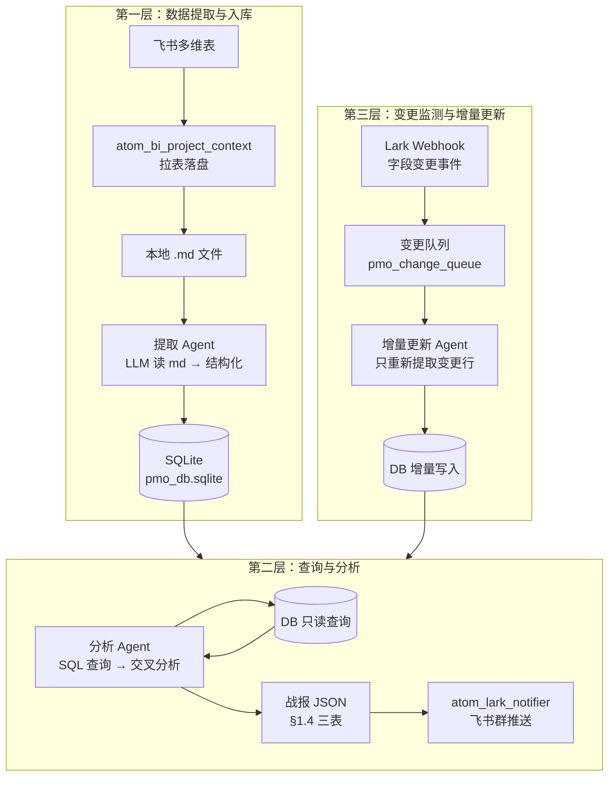
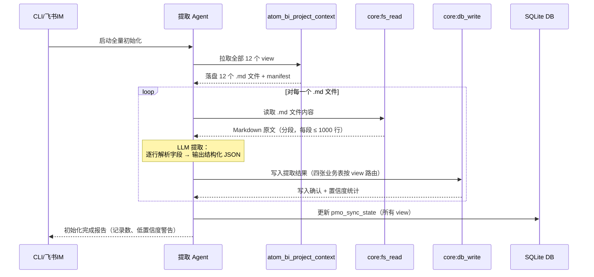
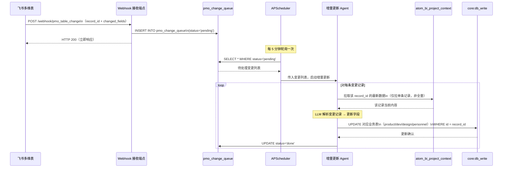
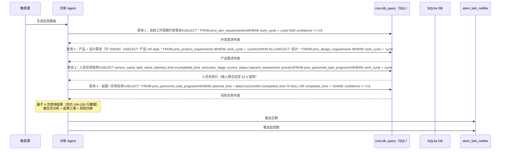
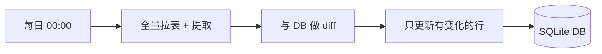

# PMO 数据库重构方案（设计文档）

> **状态**：提案阶段，尚未实施  
> **背景**：现有 PMO 架构每次运行都要全量读取 12 张表、完整塞入上下文，导致 token 成本高、分析质量受限于上下文窗口、无法做真正的跨表关联查询。本文提出引入轻量关系数据库对架构进行重构。

---

## 1. 整体评价：这个思路是对的，但有几个关键点要想清楚

### 为什么这个思路好

**当前架构的根本缺陷**是：每一次分析都是「全量读取 → 大模型记住 → 大模型分析」，而大模型的记忆上限就是上下文窗口（约 10～20 万字有效范围）。数据总量远超上限，所以分析质量天花板很低。

引入数据库之后，这个问题从架构上被解决了：

- **提取**（读表 + 写 DB）只做一次，后续通过增量更新维护
- **分析**不再需要把所有数据塞进上下文，而是用 SQL 查询按需取数，上下文里的数据体积缩小 10 倍以上
- **历史数据**有了落脚点，可以做趋势分析（当前架构完全没有这个能力）
- **变更监测**让数据始终新鲜，不再依赖「每天定时全量拉一遍」

### 需要提前想清楚的风险

**风险 1：LLM 提取有错误率，写进数据库的数据可能是错的**  
大模型在读非结构化 Markdown 时会出现字段理解偏差、日期格式不统一、人名混淆等问题。一旦写进数据库，错误的数据会被当成真相用于分析。相比之下，当前架构每次都读原始数据，不会有这个问题。

**风险 2：数据库 Schema 需要匹配项目结构，项目结构会变**  
飞书表格的字段（列名）不是固定的，项目迭代过程中会增减字段。Schema 需要有演化策略。

**风险 3：Lark 变更 Webhook 依赖飞书配置，不是开箱即用**  
飞书多维表的字段变更事件需要在飞书开放平台专门配置事件订阅，还需要一个公网可达的 HTTPS 接收端点。这是一个非零的运维成本。

以上风险都有对应的解决方案，在本文后续部分逐一给出。

---

## 2. 架构总览

新架构分三层，各层职责清晰分离：



```
┌──────────────────────────────────────────────────────────────┐
│  触发来源                                                      │
│  CLI / 飞书IM / 定时 / Webhook 变更事件                        │
└──────────┬───────────────────────────┬──────────────────────┘
           │ 全量初始化 / 手动触发       │ Webhook 增量触发
           ▼                           ▼
┌─────────────────────┐   ┌─────────────────────────────────┐
│  提取 Agent          │   │  增量更新 Agent                  │
│  读 12 张 md →       │   │  读变更队列 → 只提取改动的行     │
│  LLM 解析 → 写 DB    │   │  → 更新/插入对应 DB 行          │
└─────────────────────┘   └─────────────────────────────────┘
           │                           │
           └────────────┬──────────────┘
                        ▼
              ┌─────────────────┐
              │  SQLite DB      │
              │  pmo_db.sqlite  │
              └────────┬────────┘
                        │
                        ▼
              ┌─────────────────┐
              │  分析 Agent      │
              │  SQL 查询 → 交叉 │
              │  分析 → 战报     │
              └────────┬────────┘
                        │
                        ▼
              ┌─────────────────┐
              │  飞书群推送      │
              └─────────────────┘
```

---

## 3. 技术栈

| 组件 | 技术选型 | 理由 |
|------|----------|------|
| **关系数据库** | SQLite（文件 `~/.jachin/workspace/pmo_db.sqlite`） | 无需独立进程，部署零成本；Python 内置 `sqlite3`；文件可备份；够用于当前数据量（几千行） |
| **DB 操作工具** | 新增 `core:db_query`（SQL 查询）+ `core:db_write`（JSON 写入/更新） | 作为 Native Tool 注册到 L3 工具池；Agent 通过正常 ReAct 调用 |
| **提取层** | 现有 L3 Agent + 新增提取 Skill / Prompt | LLM 读 md、填结构化字段、调 `core:db_write`；不新增 LLM 服务 |
| **变更接收** | FastAPI 路由（追加到现有 Jachin 服务，或独立轻量脚本） | 接收飞书 Webhook POST，写入变更队列表 |
| **变更队列** | SQLite 同库的 `pmo_change_queue` 表 | 简单可靠；无需 Redis/MQ；失败可重试 |
| **调度** | 现有 APScheduler（`pmo_copilot_scheduler.py`） | 定时检查变更队列；触发增量更新 Agent |
| **分析触发** | CLI / 飞书 IM / 定时（同现有架构） | 分析层触发方式不变，只是 Agent 的数据来源从读 md 变成查 DB |

---

## 4. 数据库 Schema

### 4.0 设计原则：四张业务表 + 辅助表

业务数据**不按「Epic / Task / 人员名册」拆**，而是按 **PMO 看板实际关心的四个维度** 建表：

| 序号 | 表名 | 业务含义 | 典型数据来源（飞书 view，提取时映射） |
|------|------|----------|--------------------------------------|
| 1 | `pmo_product_requirements` | **产品部需求表** | 产品需求池 `vew8TxMcSh`、产品端人员看板 `vewL9Mofgd`、产品方任务 `vewpYzbZ29` 等 |
| 2 | `pmo_dev_requirements` | **开发部需求表** | 开发计划核心版本需求 `vewpI8lyYw`、开发方任务 `vew0gcyAUk`、任务甘特/看板等 |
| 3 | `pmo_design_requirements` | **设计部（美术）需求表** | 设计方任务 `vewswB05Wi`、设计专用美术视图 `vew5taB9H1` 等 |
| 4 | `pmo_personnel_task_progress` | **人员任务进度表** | 人工看板按员工 `vewCz1FFJi`、人工甘特 `vewjSEz5Xr` 等（以「人 + 任务」为粒度） |

三张部门需求表 **字段结构一致**（便于提取 Prompt 复用、分析 SQL 可 `UNION`）；人员任务进度表 **一行 = 一个人名下的一条任务**，同一人有多条任务则多行。

除上述四张业务表外，保留 **同步状态 / 变更队列 / 提取日志** 三张辅助表，支撑 Webhook 增量与审计。

---

### 4.1 四张业务表结构

#### 4.1.1 产品部需求表 · `pmo_product_requirements`

```sql
CREATE TABLE pmo_product_requirements (
  id                  TEXT PRIMARY KEY,     -- 飞书记录 ID（record_id）；若无则生成 UUID
  requirement_name    TEXT NOT NULL,          -- 需求名称
  assigned_people     TEXT,                   -- 需求对应人员（JSON 数组字符串，如 ["Seth","Elara"]）
  work_cycle          TEXT,                   -- 工作周期（Sprint / 迭代名 / 版本周期）
  start_date          TEXT,                   -- 开始时间（YYYY-MM-DD 或 ISO 8601）
  end_date            TEXT,                   -- 结束时间（实际或当前排期结束）
  execution_stage     TEXT,                   -- 执行阶段（如：待评审/进行中/测试中/已上线）
  planned_schedule    TEXT,                   -- 计划时间（计划交付节点、计划完成日或计划周期描述）
  priority            TEXT,                   -- 任务优先级（P0/P1/P2 或表内原始值）
  -- 元数据（提取与审计）
  source_view         TEXT,                   -- 来源 view_id
  source_file         TEXT,                   -- 来源落盘 md 文件名片段
  extracted_at        DATETIME DEFAULT CURRENT_TIMESTAMP,
  updated_at          DATETIME DEFAULT CURRENT_TIMESTAMP,
  confidence          REAL DEFAULT 1.0,       -- LLM 提取置信度 0-1
  raw_text            TEXT                    -- 原始 Markdown 行（审计 / 重提取）
);
```

#### 4.1.2 开发部需求表 · `pmo_dev_requirements`

字段与产品表 **完全相同**，仅表名与 `dept` 语义不同，写入时 `source_view` 指向开发相关视图。

```sql
CREATE TABLE pmo_dev_requirements (
  id                  TEXT PRIMARY KEY,
  requirement_name    TEXT NOT NULL,
  assigned_people     TEXT,
  work_cycle          TEXT,
  start_date          TEXT,
  end_date            TEXT,
  execution_stage     TEXT,
  planned_schedule    TEXT,
  priority            TEXT,
  source_view         TEXT,
  source_file         TEXT,
  extracted_at        DATETIME DEFAULT CURRENT_TIMESTAMP,
  updated_at          DATETIME DEFAULT CURRENT_TIMESTAMP,
  confidence          REAL DEFAULT 1.0,
  raw_text            TEXT
);
```

#### 4.1.3 设计部（美术）需求表 · `pmo_design_requirements`

字段与产品 / 开发表 **完全相同**。

```sql
CREATE TABLE pmo_design_requirements (
  id                  TEXT PRIMARY KEY,
  requirement_name    TEXT NOT NULL,
  assigned_people     TEXT,
  work_cycle          TEXT,
  start_date          TEXT,
  end_date            TEXT,
  execution_stage     TEXT,
  planned_schedule    TEXT,
  priority            TEXT,
  source_view         TEXT,
  source_file         TEXT,
  extracted_at        DATETIME DEFAULT CURRENT_TIMESTAMP,
  updated_at          DATETIME DEFAULT CURRENT_TIMESTAMP,
  confidence          REAL DEFAULT 1.0,
  raw_text            TEXT
);
```

#### 4.1.4 人员任务进度表 · `pmo_personnel_task_progress`

**粒度**：一人 + 一任务 = 一行。同一人 5 个任务 → 5 行，`person_name` 相同。

```sql
CREATE TABLE pmo_personnel_task_progress (
  id                  TEXT PRIMARY KEY,     -- 飞书记录 ID 或 人+任务 组合键哈希
  person_name         TEXT NOT NULL,          -- 人员名称
  task_name           TEXT NOT NULL,          -- 任务名称
  planned_time        TEXT,                   -- 计划时间（计划开始/计划交付，YYYY-MM-DD 或区间）
  completed_time      TEXT,                   -- 完成时间（未完成则 NULL）
  execution_stage     TEXT,                   -- 执行到什么阶段（表内状态 / 流程节点）
  current_status      TEXT,                   -- 现在情况如何（进行中/延期/阻塞/偏闲等归纳）
  parent_requirement  TEXT,                   -- 属于哪个大需求（Epic / 顶层需求名；无则 NULL）
  priority            TEXT,                   -- 任务优先级
  work_cycle          TEXT,                   -- 所属工作周期（便于按 Sprint 筛选）
  dept                TEXT,                   -- 产品/开发/设计（辅助交叉分析）
  source_view         TEXT,
  source_file         TEXT,
  extracted_at        DATETIME DEFAULT CURRENT_TIMESTAMP,
  updated_at          DATETIME DEFAULT CURRENT_TIMESTAMP,
  confidence          REAL DEFAULT 1.0,
  raw_text            TEXT
);
```

#### 4.1.5 字段语义说明（业务 ↔ 库表）

| 业务说法 | 部门需求表字段 | 人员任务进度表字段 | 提取注意 |
|----------|----------------|-------------------|----------|
| 需求名称 | `requirement_name` | — | 顶层需求行；子任务不入部门表，入人员表 |
| 需求对应人员 | `assigned_people` | `person_name` | 部门表可多人 JSON；人员表一行一人 |
| 工作周期 | `work_cycle` | `work_cycle` | 映射 Sprint / 迭代 / 版本周期列 |
| 开始时间 | `start_date` | — | 优先映射「开始日」「启动时间」类列 |
| 结束时间 | `end_date` | — | 优先映射「结束日」「实际完成」类列 |
| 执行阶段 | `execution_stage` | `execution_stage` | 保留飞书原文，不强制枚举 |
| 计划时间 | `planned_schedule` | `planned_time` | 与 start/end 区分：指「计划交付节点」或计划排期 |
| 现在情况 | — | `current_status` | 可由 LLM 根据日期+状态归纳（延期/正常/偏闲） |
| 属于哪个大需求 | — | `parent_requirement` | 从层级表或关联列提取父需求名 |
| 优先级 | `priority` | `priority` | P0/P1/P2 或表内原始值 |

---

### 4.2 辅助表（同步 / 变更 / 审计）

```sql
-- 同步状态（记录每个 view 上次同步时间）
CREATE TABLE pmo_sync_state (
  view_id       TEXT PRIMARY KEY,
  view_name     TEXT,
  target_table  TEXT,                       -- 写入哪张业务表（如 pmo_dev_requirements）
  last_synced   DATETIME,
  record_count  INTEGER,
  sync_status   TEXT                        -- ok / partial / failed
);

-- 变更队列（Webhook 事件落地）
CREATE TABLE pmo_change_queue (
  id            INTEGER PRIMARY KEY AUTOINCREMENT,
  received_at   DATETIME DEFAULT CURRENT_TIMESTAMP,
  table_id      TEXT NOT NULL,
  view_id       TEXT,
  record_id     TEXT,
  change_type   TEXT,                       -- INSERT / UPDATE / DELETE
  changed_fields TEXT,
  raw_payload   TEXT,
  status        TEXT DEFAULT 'pending',
  processed_at  DATETIME,
  error_msg     TEXT
);

-- 提取日志
CREATE TABLE pmo_extraction_log (
  id            INTEGER PRIMARY KEY AUTOINCREMENT,
  run_id        TEXT,
  target_table  TEXT,                       -- 写入的业务表名
  source_view   TEXT,
  record_id     TEXT,
  action        TEXT,                       -- insert / update / skip
  confidence    REAL,
  notes         TEXT,
  created_at    DATETIME DEFAULT CURRENT_TIMESTAMP
);
```

---

### 4.3 飞书 view → 业务表映射（提取 Agent 路由）

提取 Agent 读落盘 md 时，按 **view_id + 行语义** 决定写入哪张表（同一条飞书记录不应重复写入多张部门表，除非业务上确属跨部门副本）：

| view_id | 视图用途 | 主要写入表 | 说明 |
|---------|----------|------------|------|
| `vew8TxMcSh` | 产品需求池 | `pmo_product_requirements` | 产品部需求 |
| `vewL9Mofgd` | 产品端人员看板 | `pmo_personnel_task_progress` | dept=产品 |
| `vewpYzbZ29` | 产品方任务 | `pmo_product_requirements` + `pmo_personnel_task_progress` | 需求行→产品表；任务行→人员表 |
| `vewpI8lyYw` | 开发计划核心版本需求 | `pmo_dev_requirements` | 开发主轴；顶层需求入开发表 |
| `vew0gcyAUk` | 开发方任务 | `pmo_dev_requirements` + `pmo_personnel_task_progress` | dept=开发 |
| `vew4Im7GO3` / `vewpxQxeGw` / `vewQKcyDAV` | 甘特 / 看板 | `pmo_personnel_task_progress` | 补充任务粒度与日期 |
| `vewswB05Wi` | 设计方任务 | `pmo_design_requirements` + `pmo_personnel_task_progress` | dept=设计 |
| `vew5taB9H1` | 设计专用美术视图 | `pmo_design_requirements` | 美术主轴 |
| `vewCz1FFJi` | 人工看板按员工 | `pmo_personnel_task_progress` | **人员任务矩阵战报主来源** |
| `vewjSEz5Xr` | 人工甘特 | `pmo_personnel_task_progress` | 补充计划/完成时间与 parent_requirement |

**交叉分析时的用法**：
- **§1.4 需求进度全览**：以 `pmo_dev_requirements` 为主，`UNION` 产品 / 设计表或按部门筛选
- **§1.4 人员任务矩阵**：查 `pmo_personnel_task_progress`，按 `person_name` 聚合
- **跨表对齐**：用 `parent_requirement` + `requirement_name` + `work_cycle` 做关联，而非 LLM 记忆

---

### 4.4 关键索引

```sql
-- 部门需求表（三张结构相同，索引相同）
CREATE INDEX idx_product_work_cycle ON pmo_product_requirements(work_cycle);
CREATE INDEX idx_product_stage       ON pmo_product_requirements(execution_stage);
CREATE INDEX idx_dev_work_cycle      ON pmo_dev_requirements(work_cycle);
CREATE INDEX idx_dev_stage           ON pmo_dev_requirements(execution_stage);
CREATE INDEX idx_design_work_cycle   ON pmo_design_requirements(work_cycle);
CREATE INDEX idx_design_stage        ON pmo_design_requirements(execution_stage);

-- 人员任务进度
CREATE INDEX idx_personnel_name      ON pmo_personnel_task_progress(person_name);
CREATE INDEX idx_personnel_cycle     ON pmo_personnel_task_progress(work_cycle);
CREATE INDEX idx_personnel_parent    ON pmo_personnel_task_progress(parent_requirement);
CREATE INDEX idx_personnel_planned   ON pmo_personnel_task_progress(planned_time);

-- 辅助表
CREATE INDEX idx_queue_status        ON pmo_change_queue(status);
CREATE INDEX idx_extraction_table    ON pmo_extraction_log(target_table);
```

---

### 4.5 为什么保留 `raw_text` 和 `confidence`

**`raw_text`**：飞书落盘 md 列名不固定、层级不统一，LLM 提取难免歧义。保留原文行可在低置信度时 **重提取**，或在战报中标注「依据：原文片段」。

**`confidence`**：提取 Agent 为每条记录输出 0～1 分。分析 Agent 可 `WHERE confidence >= 0.8`；战报中对低置信字段标 ⚠️，避免把猜测当事实。

**`assigned_people` 用 JSON 字符串**：SQLite 无原生数组类型；多人责任用 `["A","B"]` 存储，查询时用 `json_each` 或应用层解析均可。

---

## 5. 三个核心流程

### 5.1 全量初始化（第一次跑，或手动强制重建）

```
触发：CLI 命令 python scripts/pmo_db_init.py --force
或 飞书 IM 发送 /pmo init
```



**关键点**：
- 提取 Agent 每次只处理一个 .md 文件的一个段落，不需要把所有数据塞进单次 LLM 上下文
- 每个字段提取完都写日志，失败的行记录在 `pmo_extraction_log` 里可以后续重试
- 初始化完成后输出摘要：「共提取 N 条 Epic，M 条 Task，其中 K 条置信度低于 0.8」

### 5.2 变更监测与增量更新（日常运行）

```
触发：飞书多维表 Webhook → 字段变更事件
```



**关键点**：
- Webhook 端点只做两件事：写队列、返回 200。处理逻辑在 Agent 侧，Webhook 不阻塞
- 飞书要求 Webhook 在 3 秒内响应，所以接收和处理必须分开
- 每次只更新变更的那几行记录，不重新读整张表，token 成本极低
- 如果变更队列积压（比如批量编辑），Agent 可以合并同一 view 的变更批量处理

**飞书 Webhook 配置要求**（运维前提）：
- 在飞书开放平台「事件订阅」中开启 **`bitable.record.updated`**、**`bitable.record.created`**、**`bitable.record.deleted`** 事件
- 订阅 URL 填写 Jachin 服务的公网地址（`https://your-domain/webhook/pmo_table_change`）
- 事件过滤：只订阅 K11 项目多维表（按 `table_id` 过滤）

### 5.3 查询分析与报告生成（取代现有「读 12 张表然后分析」）

```
触发：CLI / 飞书IM 发 /pmo 或 宏观看板 / 定时任务
```



**关键点**：
- 4 次 SQL 查询总计返回的数据量约 100～150 行，折算约 1～2 万字，是当前架构（12 张表全量，20 万+ 字）的**十分之一**
- 分析 Agent 上下文里只有「精确需要的数据」，而不是「所有数据」
- SQL 的 `WHERE work_cycle = :cycle` 按工作周期过滤，不需要 Agent 在上下文里手动筛 Sprint
- 延期判断用 `planned_time` 与 `completed_time` 空值查询，比大模型比较日期可靠
- **§1.4 三表** 与四张 DB 表一一对应：需求全览 ← 三张部门需求表；人员矩阵 ← `pmo_personnel_task_progress`；版本映射 ← 三表按 `work_cycle` / `parent_requirement` 归集

---

## 6. 新增工具说明

### 6.1 `core:db_query`（SQL 查询）

```python
# 工具入参
{
  "sql": "SELECT requirement_name, assigned_people, execution_stage, planned_schedule, priority FROM pmo_dev_requirements WHERE work_cycle = :cycle",
  "params": {"cycle": "Sprint-23"},
  "max_rows": 200        # 防止查询返回海量数据
}

# 工具出参
{
  "status": "ok",
  "rows": [
    {"requirement_name": "Bingo Flash", "execution_stage": "进行中", "assigned_people": "[\"Seth\"]", "planned_schedule": "2026-05-30", "priority": "P0"},
    ...
  ],
  "row_count": 12,
  "truncated": false
}
```

- 只允许 `SELECT`，禁止 `INSERT/UPDATE/DELETE`（写操作走专用工具）
- 查询结果格式化为 JSON，直接进 Observation

### 6.2 `core:db_write`（结构化写入）

```python
# 工具入参（提取 Agent 调用）
{
  "table": "pmo_dev_requirements",
  "operation": "upsert",
  "records": [
    {
      "id": "rec_xxx",
      "requirement_name": "Bingo Flash",
      "assigned_people": "[\"Seth\"]",
      "work_cycle": "Sprint-23",
      "start_date": "2026-05-01",
      "end_date": null,
      "execution_stage": "进行中",
      "planned_schedule": "2026-05-30",
      "priority": "P0",
      "source_view": "vewpI8lyYw",
      "confidence": 0.92,
      "raw_text": "| Bingo Flash | 进行中 | Seth | 2026-05-30 | Sprint-23 | P0 |"
    }
  ]
}

# 工具出参
{
  "status": "ok",
  "inserted": 1,
  "updated": 0,
  "skipped": 0,
  "low_confidence_warnings": []
}
```

- `upsert` 语义：有则更新，无则插入，以 `id` 为主键
- `confidence < 0.7` 时工具输出 warning，不阻止写入，但提示 Agent 这条数据需要人工核查

---

## 7. 提取 Agent 的工作方式（解决非结构化文档问题）

这是整个方案里最关键、也最有风险的部分。飞书表格落盘成 Markdown 之后，是这样的格式：

```markdown
| 需求名称 | 状态 | 责任人 | 计划交付 | 实际完成 | Sprint | 优先级 |
|----------|------|--------|----------|----------|--------|--------|
| Bingo Flash | 进行中 | Seth | 2026-05-30 | — | Sprint-23 | P0 |
| vi重构 | 待评审 | Elara | — | — | Sprint-24 | P1 |
```

LLM 完全能够理解这个格式，但有几个陷阱：

**陷阱 1：列名不固定**  
不同视图、不同时期的表格，「计划交付」可能叫「计划完成日」「截止日期」「目标日期」等。直接用固定列名映射会出错。

**解决方案**：提取 Agent 的 Prompt 里不写固定列名，而是写「找含有日期信息、表示计划完成时间的列，映射到 `plan_date`」。让 LLM 自己判断语义，而不是字符串匹配。

**陷阱 2：层级结构**  
03 表有层级（父需求 → 子需求 → Task），但 Markdown 平铺展开，父子关系靠缩进或编号表示。

**解决方案**：
- **顶层需求行** → 写入对应部门表（`pmo_dev_requirements` 等），填 `requirement_name`、`assigned_people`、`work_cycle` 等
- **子任务 / 按人拆分的行** → 写入 `pmo_personnel_task_progress`，`parent_requirement` 填父需求名，`person_name` + `task_name` 必填

**陷阱 3：值域不一致**  
「进行中」「开发中」「In Progress」可能是同一个阶段。

**解决方案**：`execution_stage` / `current_status` **不做枚举约束**，保留飞书原文；分析时可 `LIKE` 或提取 Prompt 内给 normalize 映射表。

### 提取 Prompt 设计原则

按 **目标表** 使用两套模板。

#### A. 部门需求表（产品 / 开发 / 设计 · 结构相同）

```
你是 PMO 数据提取助手。输入：飞书 md 片段 + source_view + 目标表名（pmo_product_requirements | pmo_dev_requirements | pmo_design_requirements）。
逐行提取「需求级」记录，输出 JSON 数组。每条必须包含：

- id: 飞书记录 ID（无则 UUID）
- requirement_name: 需求名称
- assigned_people: 人员 JSON 数组字符串，如 ["Seth","Elara"]
- work_cycle: 工作周期 / Sprint
- start_date: 开始时间 YYYY-MM-DD（无则 null）
- end_date: 结束时间 YYYY-MM-DD（无则 null）
- execution_stage: 执行阶段（保留原文）
- planned_schedule: 计划时间（计划交付日或计划节点，YYYY-MM-DD 或简短描述）
- priority: 优先级 P0/P1/P2 或原文
- confidence: 0-1

规则：
- 只提取顶层需求行；子任务行改入人员任务表，不要写入部门需求表
- 列名语义映射：「计划交付/截止日期/目标日期」→ planned_schedule；「开始/启动」→ start_date
- 不猜测缺失字段；不确定则 null 且 confidence -= 0.2
- 输出纯 JSON 数组
```

#### B. 人员任务进度表 · `pmo_personnel_task_progress`

```
你是 PMO 数据提取助手。输入：飞书 md 片段（尤其 vewCz1FFJi、vewjSEz5Xr、各方任务视图）。
逐行提取「人 + 任务」记录，输出 JSON 数组。每条必须包含：

- id: 飞书记录 ID（无则 UUID）
- person_name: 人员名称
- task_name: 任务名称
- planned_time: 计划时间 YYYY-MM-DD 或区间描述
- completed_time: 完成时间（未完成 null）
- execution_stage: 执行到什么阶段（表内状态/节点）
- current_status: 现在情况（进行中/延期/阻塞/偏闲等，须有一句可核对依据）
- parent_requirement: 所属大需求名（无则 null）
- priority: 任务优先级
- work_cycle: 工作周期
- dept: 产品 | 开发 | 设计
- confidence: 0-1

规则：
- 一人多任务 = 多行，person_name 可重复
- current_status 若判「延期」，须 implied 计划日已过且 completed_time 为空
- 输出纯 JSON 数组
```

---

## 8. 数据质量保障机制

### 8.1 置信度分级处理

| confidence 范围 | 处理方式 |
|----------------|----------|
| 0.9 ～ 1.0 | 直接写入，正常使用 |
| 0.7 ～ 0.9 | 写入，分析时可用，战报里该字段标 ⚠️ |
| 0.5 ～ 0.7 | 写入，标记为 `needs_review`，不进入战报核心数据 |
| < 0.5 | 写入 `raw_text`，不填结构化字段，需人工处理 |

### 8.2 人工核查流程

提取完成后，Agent 输出摘要：
```
DB 初始化完成：
- pmo_product_requirements: 18 条（17 条 confidence≥0.9）
- pmo_dev_requirements: 23 条（22 条 confidence≥0.9）
- pmo_design_requirements: 31 条（29 条 confidence≥0.9）
- pmo_personnel_task_progress: 187 条（180 条 confidence≥0.9）
- 需审查项：
  1. rec_xxx | Bingo Flash | planned_schedule 为 null（原文"待确认"）
  2. rec_yyy | Elara / 任务A | parent_requirement 无法从层级推断
```

### 8.3 重新提取机制

对于低置信度记录，支持以下操作：

1. **手动触发重提取**：`/pmo re-extract rec_xxx`，Agent 重新读该条 `raw_text` 并尝试提取
2. **人工修正**：直接在飞书表格里修改，Webhook 会触发增量更新
3. **全量重建**：`/pmo init --force`，清空 DB 重新全量提取

---

## 9. 与现有架构的关系

### 9.1 改动范围

| 组件 | 改动类型 | 说明 |
|------|----------|------|
| `l3_node/agent_core.py` | **有改动** | 注册新工具 `core:db_query`、`core:db_write`；PMO 信道守卫适配新流程 |
| `skills_repo/pmo-copilot/SKILL.md` | **有改动** | 分支 A 流程替换为「查 DB → 分析 → 推送」；提取 Skill 单独一个文件 |
| `scripts/pmo_db_init.py` | **新增** | 全量初始化脚本 |
| `l3_node/pmo_webhook_receiver.py` | **新增** | FastAPI 路由，接收飞书变更事件 |
| `l3_node/jobs/pmo_db_sync_scheduler.py` | **新增** | 轮询变更队列，触发增量更新 Agent |
| `tools/pmo_db_tools.py` | **新增** | `core:db_query` 和 `core:db_write` 的实现 |
| `l3_node/pmo_lark_trigger.py` | **小改** | 新增 `/pmo init` 命令路由 |
| `config/mcps/atom_bi_project_context/` | **不改** | 拉表 MCP 保持不变 |

### 9.2 迁移策略（不建议一次性切换）

**阶段 1（2 周）**：新增提取工具和 DB Schema，写提取脚本，手动跑一次初始化，验证 DB 数据准确性。

**阶段 2（1 周）**：分析 Agent 从「读 12 张 md」改为「查 DB」，并行跑两种模式对比战报质量。

**阶段 3（1 周）**：上线 Webhook 接收端点，接入飞书变更事件，验证增量更新准确性。

**阶段 4**：停用旧的「全量读表」模式，全切到新架构。

---

## 10. 这个方案解决了哪些老问题，引入了哪些新问题

### 解决的问题

| 老问题 | 解决方式 |
|--------|----------|
| 每次分析都要读 12 张表，成本高 | 提取一次写 DB，分析只查 DB，增量更新代价极低 |
| 分析阶段上下文太大，大模型记不住 | SQL 查询返回约 100 行精确数据，上下文缩小 10 倍 |
| 跨表分析靠大模型「记忆」，准确率低 | SQL JOIN 做跨表关联，不靠大模型记忆 |
| 03 表 4000 行太贵，只能读 2000 行 | 提取时全量写 DB，分析时按 Sprint 过滤，按需取数 |
| Sprint 过滤靠大模型在 Thought 里判断 | `WHERE sprint = :current_sprint` 精确过滤 |
| 没有历史数据，无法做趋势分析 | DB 永久保存，`status_history` 可追溯状态变更 |
| 分析质量无法量化验证 | DB 里的数据是结构化的，可以对比分析结果和原始数据 |

### 引入的新问题

| 新问题 | 应对措施 |
|--------|----------|
| LLM 提取有误，DB 数据可能错 | 置信度分级 + `raw_text` 保留 + 人工核查流程 |
| Webhook 需要飞书配置 + 公网端点 | 明确运维要求；没有 Webhook 时可以用定时全量同步作为降级 |
| DB Schema 需随表结构演化 | 版本化 Schema 迁移脚本（类似 Alembic）；`raw_text` 兜底 |
| 新增了 2 个工具和若干脚本，维护成本增加 | 工具简单、边界清晰；DB 文件可直接用 SQLite Browser 查看 |
| 初始化一次提取成本不低 | 只做一次，之后都是增量更新；比现有「每次全量」便宜得多 |

---

## 11. 降级策略（Webhook 不可用时）

如果飞书 Webhook 无法配置（没有公网端点、飞书开放平台限制等），降级方案是：

**定时全量比对**：每天凌晨跑一次全量拉表 + 提取，与 DB 里的数据做 diff，只更新有变化的行。

这比当前架构（每次分析都全量读取）已经好很多：提取成本每天只发生一次，分析时还是查 DB。只是「实时性」从「秒级」变成「次日凌晨」。



---

## 12. 版本记录

| 日期 | 内容 |
|------|------|
| 2026-05-25 | 初稿：提案阶段，未实施 |
| 2026-05-25 | §4 重构为四张业务表：产品 / 开发 / 设计需求表 + 人员任务进度表 |

*文档状态：设计提案。实施前需完成阶段 1 验证。核心代码改动集中在 `tools/pmo_db_tools.py`（新增）和 `skills_repo/pmo-copilot/SKILL.md`（流程重写）。*
