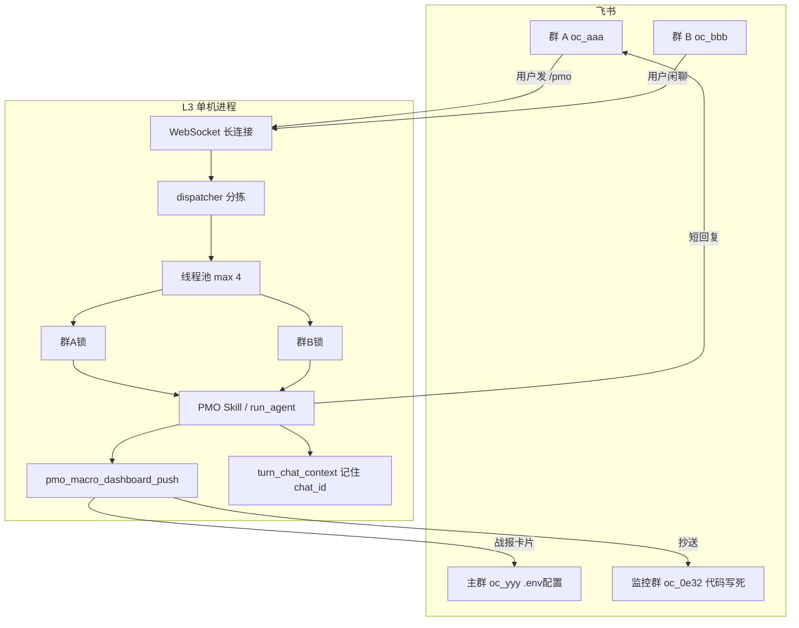

# PMO 插件 · 飞书战报投递与消息路由说明

> **写给谁看**：PM、运维、接 Lark 的同事。不用先懂 ReAct 或代码。  
> **关联文档**：[`PMO_WAR_REPORT_DEV_VS_PACK_CASE_STUDY_0612.md`](./PMO_WAR_REPORT_DEV_VS_PACK_CASE_STUDY_0612.md)（战报数据从哪来）、[`PMO_WORK_ZONG_CASE_STUDY.md`](./PMO_WORK_ZONG_CASE_STUDY.md)（战报长什么样）、`skills_repo/pmo-copilot/SKILL.md` §1.3（Agent 操作规范）。

---

## 1. 先用三句话讲清楚

1. **战报发到哪里**：主要靠你在 `~/.jachin/.env` 里配的 **主群**；可选再抄送一个 **监控群**（写死在代码里，不用配）。你在飞书群里敲 `/pmo` 时，若没配主群，就发到 **你说话的那个群**。
2. **消息怎么进来**：L3 进程通过飞书 **长连接（WebSocket）** 收群消息，不是你在群里 @ 一下才临时连一下，而是一直挂着线。
3. **多个群同时说话**：**不同群可以并行处理**（最多 4 路）；**同一个群** 默认排队，一条处理完再处理下一条，避免对话记混。回复永远回到 **发消息的那个群**；战报卡片则按上面的「主群 + 监控群」规则发。

---

## 2. PMO 会发哪些东西？分别发到哪？

可以把 PMO 相关推送分成三类，**群 ID 配置方式不一样**：

| 类型 | 是什么 | 发到哪些群 | 在哪配置 |
|------|--------|------------|----------|
| **A. 主线战报（宏观看板）** | 📊 需求表 + 👥 人员表 + Executive Summary，飞书 **原生表格卡片** | ① **主群** ② **监控群**（可选） | 主群：`PMO_PRIMARY_CHAT_ID`；监控：代码固定，见下表 |
| **B. 变更预警** | 飞书多维表改了什么、谁改了，短通知 | ① 变更主群 ② 变更监控群（可选） | `PMO_CHANGE_ALERT_CHAT_ID` 等 |
| **C. 对话回复** | 你在群里问 PMO，机器人在群里回一两句确认（不是整张战报） | **只回到你发消息的那个群** | 不用配，自动用 `chat_id` |

### 2.1 主线战报：主群怎么定？

优先级如下（**从上到下，命中即用**）：

```
① ~/.jachin/.env 里的 PMO_PRIMARY_CHAT_ID=oc_xxxxx
        ↓ 若为空
② 本轮对话触发时所在的飞书群 chat_id（你在哪个群发 /pmo，就记哪个）
```

也就是说：

- **打包机/生产**：通常在 `~/.jachin/.env` 写死业务主群，不管用户在哪个群触发，战报都进主群。
- **开发/临时**：可以不配 `PMO_PRIMARY_CHAT_ID`，在测试群里触发，战报就进测试群。

配置加载顺序（**后面的覆盖前面的**）：

1. 进程环境变量（若已设置）
2. **安装目录下的 `.env`**（打包机常见：exe 同级或安装根目录，见 `get_app_root()`）
3. **`~/.jachin/.env`（可选覆盖；有则优先于安装目录）**

> **打包机没有 `~/.jachin/.env` 完全正常。** 多数安装包把 `.env` 打在应用根目录；`~/.jachin/` 里通常只有 `workspace/`、`config/im_channels.yaml`、`l3_lark_sessions.json` 等运行时数据，不强制要求 `.env` 文件。

若 **两处都没有** `PMO_PRIMARY_CHAT_ID`，战报主群 = **用户在飞书群里触发 PMO 时所在的那个群**（见 §2.1）。

代码锚点：`l3_node/pmo_lark_env.py`。

### 2.2 主线战报：监控群

| 项 | 值 |
|----|-----|
| chat_id | `oc_0e321f92d758ecb44aea5b499c90510b` |
| 配置方式 | **写死在代码里**，不读 `PMO_MONITOR_CHAT_ID` |
| 开关 | 环境变量 `PMO_PUSH_MONITOR=0` 可关闭双群推送 |

代码锚点：`l3_node/pmo_lark_push_guard.py` → `PMO_WAR_REPORT_MONITOR_CHAT_ID`。

### 2.3 变更预警群（不是宏观看板，但同属 PMO Lark）

| 用途 | 环境变量 | 未配置时的默认 |
|------|----------|----------------|
| 变更主推送群 | `PMO_CHANGE_ALERT_CHAT_ID` 或 `PMO_BITABLE_WATCH_CHAT_ID` | `oc_b1b9cff6804517c79b7f5a617ab30483` |
| 变更监控群 | `PMO_CHANGE_ALERT_MONITOR_CHAT_ID` 或 `PMO_BITABLE_WATCH_MONITOR_CHAT_ID` | 回落到战报监控群 |

触发方式：多维表变更长连接 / 定时轮询（`pmo_bitable_watch`），**不是**用户在群里说一句话。

### 2.4 被禁止的群

历史开发测试群 `oc_437c98d11106295fb10751a5481ee465` 在推送守卫里 **一律拦截**，防止旧文档/旧脚本误推。

---

## 3. 战报是怎么「发出去」的？（调用链，人话版）

### 3.1 最常见：用户在飞书群里触发

```
你在群里发：/pmo  或  全量看板  或  #*# pmo-copilot
        │
        ▼
L3 识别为「PMO 重型任务」，加载 pmo-copilot Skill
        │
        ▼
Agent 内部调用工具：core:pmo_macro_dashboard_push，参数写 {}
        │  （禁止手写 oc_ 群号，由宿主注入目标群）
        ▼
工具内部：查 SQLite → 拼 Markdown → 转成飞书卡片 → 调 IM 接口发送
        │
        ├─► 主群（PMO_PRIMARY_CHAT_ID 或触发群）
        └─► 监控群（若 PMO_PUSH_MONITOR 未关闭）
        │
        ▼
群里再收到一条 **短文字**：「战报已推送，请查看卡片」（不是把整张表贴在聊天里）
```

核心工具与模块：

| 步骤 | 模块 |
|------|------|
| 触发识别 | `l3_node/pmo_lark_trigger.py`、`l3_node/slash_hash_skill_router.py` |
| 一键推送 | `core:pmo_macro_dashboard_push` → `l3_node/tools/pmo_macro_dashboard.py` |
| 版式 | `l3_node/pmo_report_format.py` |
| 飞书卡片 | `l3_node/channels/lark/md_native_table_card.py` |
| 兜底发送 | `mcp:atom_lark_notifier`（MCP 配置读 `${PMO_PRIMARY_CHAT_ID}`） |

### 3.2 不经过对话：脚本直推

```text
scripts/push_pmo_macro_dashboard_lark.py
```

适合运维定时任务、CI、本机调试。同样读 `~/.jachin/.env` 里的群配置。

### 3.3 Agent 里还有一条「兜底」路径

若 `core:pmo_macro_dashboard_push` 不可用，Skill 允许 Agent 手写 Markdown 后调 `mcp:atom_lark_notifier`。  
宿主仍会 **注入 chat_id、抛光版式、拦截非法群号**，与一键推送共用同一套守卫。

### 3.4 推送守卫在防什么？

当本轮是 PMO Skill 上下文时（`pmo_copilot_cli` 信道），`l3_node/agent_core.py` 会检查：

- 模型有没有手写 `chat_id=oc_xxx`（只允许白名单内的主群 + 监控群）
- 有没有误推历史 dev 群 `oc_437…`

**目的**：防止模型「猜群号」把战报发到错误群。

---

## 4. 飞书消息是怎么「收进来」的？

### 4.1 生产环境：长连接

```
飞书云端
    │  事件：im.message.receive_v1（有人发群消息）
    ▼
L3 进程内的 WebSocket 客户端
    l3_node/channels/lark/long_connection.py
    ▼
Lark 入站通道
    l3_node/im_channels/lark_channel.py
    ▼
统一分发器
    l3_node/im_channels/dispatcher.py
```

**要先开起来**：

1. 复制 `config/im_channels.yaml.example` → `~/.jachin/config/im_channels.yaml`
2. 设 `im_channels.lark.enabled: true`
3. 填飞书应用的 `app_id` / `app_secret`（或用环境变量 `LARK_APP_ID`、`LARK_APP_SECRET`）
4. 启动 L3 后，`start_im_channels()` 会挂上长连接

机器人必须 **已经在目标群里**，否则发消息会报 `230002 Bot not in chat`（战报推送有备用应用 fallback，见案例文档）。

### 4.2 和战报推送是不是同一个机器人？

**可以是同一个飞书应用**，也可以分开：

| 通道 | 配置位置 | 用途 |
|------|----------|------|
| `im_channels.lark` | `~/.jachin/config/im_channels.yaml` | 收群消息、回对话 |
| 战报 IM 发送 | `~/.jachin/.env` + `config/mcps/atom_lark_notifier/config.yaml` | 发卡片 |

`im_channels.yaml.example` 里也写了：主机器人 IM 与 PMO 战报推送可共用同一应用。

### 4.3 另一类「接入」：多维表变更（不是聊天消息）

`im_channels.lark_pmo_bitable` 监听 **表格变更事件**，走 `pmo_bitable_events`，用于 **变更预警**，不经过聊天 dispatcher。

---

## 5. 消息进来之后，怎么决定「交给谁处理」？

所有从 Lark 进来的 **聊天消息**，都进同一个 **`dispatcher`**，按下面顺序 **从上到下试**，谁先命中谁处理：

```
① HR 工作流指令（停 harvest 等）
② 「明天 11 点帮我…」类定时任务拦截
③ /test 联调命令
④ #*# pmo-copilot  →  明确指定 PMO Skill（重型）
⑤ /pmo、全量看板…  →  PMO 精确触发（重型）
⑥ 招聘关键词      →  HR 招聘包
⑦ 其余            →  通用 run_agent（普通闲聊 / 未命中上面的）
```

和 PMO 战报相关的主要是 **④ 和 ⑤**：

| 入口 | 走的信道 | 含义 |
|------|----------|------|
| `#*# pmo-copilot …` | `pmo_copilot_cli` | 显式点名 PMO Skill，完整 SOP + 工具白名单 |
| `/pmo`、`全量看板` 等 | `pmo_copilot_cli` | 同上，正则匹配 |
| 群里随口问「本周 club 进度？」 | `lark_im_dispatcher` | 普通 Agent；是否按 PMO 答，看意图网关是否注入 Skill |

**重型 PMO** 会注入整份 `skills_repo/pmo-copilot/SKILL.md`，并限制工具列表，最后倾向调用 `core:pmo_macro_dashboard_push {}`。

---

## 6. 「是哪个群」这件事，系统怎么记住？

飞书里每个群有一个 **`chat_id`**（形如 `oc_` 开头的一串字符）。整条链路靠三层记忆，保证 **推送和回复不串群**：

### 6.1 收到消息时：带上 chat_id

dispatcher 收到 `(text, chat_id, user_id)`，后续所有逻辑都拿着这个 `chat_id`。

### 6.2 跑 Agent 时：写进「本轮归因」

调用 `run_agent` 时会带：

```python
implicit_attribution = {
    "channel": "pmo_copilot_cli",   # 或 lark_im_dispatcher
    "lark_chat_id": "oc_xxxxx",
    "lark_user_id": "ou_xxxxx",
}
```

Pipeline 里变成 `metadata._lark_chat_id`，推送守卫、主群回落都读它。

### 6.3 调工具的瞬间：ContextVar 兜底

每执行一个工具前，`agent_core` 会 `bind_lark_chat_id_for_tools(chat_id)`；  
`core:pmo_macro_dashboard_push` 里若 `.env` 没配主群，就 `peek_lark_chat_id_for_tools()` 取 **触发群**。

代码：`l3_node/channels/lark/turn_chat_context.py`。

### 6.4 多轮对话：按群存历史

文件：`~/.jachin/l3_lark_sessions.json`  
**一个 chat_id 一份聊天记录**（最多保留约 48 条），下次同群说话会带上文。

---

## 7. 多个群同时发消息，L3 怎么分配？

可以分两层理解：**单机 L3 内**，和 **多台 L3 机器之间**。

### 7.1 单机：一个 L3 进程里的规则

```
                    ┌─ 群 A 消息 ──► 线程池 worker ──► 锁(A) ──► 处理
飞书 WebSocket ────┼─ 群 B 消息 ──► 线程池 worker ──► 锁(B) ──► 处理   ← A、B 可并行
（只负责收包）      └─ 群 A 又来 ──► 等 A 的上一条结束（或排队合并）
```

| 机制 | 人话 |
|------|------|
| **线程池（4 个工人）** | 收消息不等 Agent 跑完，避免 WebSocket 超时断线 |
| **按 chat_id 加锁** | 同一群串行，避免两个人连发导致 session 写乱 |
| **跨群并行** | 群 A 跑 PMO 战报时，群 B 可以同时问别的问题 |
| **同群连发** | 第二条可能触发「仍在处理，请稍候」或把多条合并进上下文（queue rollup） |
| **SIQ 模式**（可选） | 环境变量 `JACHIN_IM_SIQ_ENABLE=1` 时，用会话队列精细控制串行/并行 |

代码：`l3_node/im_channels/dispatcher.py`（`_AGENT_EXECUTOR`、`_chat_locks`）。

### 7.2 多台机器：哪台 L3 接哪个群？

默认：**谁先挂上这个飞书应用的长连接，谁接所有群的消息**。

若要多机分工，在 `~/.jachin/config/im_channels.yaml` 里：

```yaml
im_channels:
  lark:
    exclusive_sessions: true    # 开白名单模式
    chat_ids:
      - oc_业务群1
      - oc_业务群2
```

则 **只有列出的群** 会在这台机器上处理；别的群的消息这台会 **忽略**（日志里记 `inbound_ignored_chat_id`），需要另一台 L3 配另外的 `chat_ids`。

**没有**「中心调度器把消息分给 L3-1 / L3-2」——靠 **每台机器自己的长连接 + 白名单** 实现分工。

### 7.3 和「战报发到哪个群」的关系

| 场景 | 对话回复回哪 | 战报卡片发哪 |
|------|--------------|--------------|
| 用户在 **群 X** 发 `/pmo`，且配置了 `PMO_PRIMARY_CHAT_ID=群 Y` | **群 X**（短确认） | **群 Y** + 监控群 |
| 未配置主群，用户在 **群 X** 触发 | **群 X** | **群 X** + 监控群 |
| 脚本直推，无触发群 | 无对话回复 | **PMO_PRIMARY_CHAT_ID** 或失败 |

---

## 8. 回复 vs 战报：别混成一件事

| | 对话回复 | 战报推送 |
|--|----------|----------|
| **内容** | 一两句文字确认 | 大卡片（native_table） |
| **发到哪里** | **触发群** `send_reply_fn(chat_id, …)` | **主群 + 可选监控群** |
| **谁发送** | dispatcher 在 Agent 跑完后回调 | `core:pmo_macro_dashboard_push` 内部调 IM API |
| **用户可见** | 聊天窗口里的下一条消息 | 主群/监控群里的卡片消息 |

PMO 触发器还会 **缩短** 回复内容，避免把整张 Markdown 表贴在聊天里（`_shorten_pmo_lark_dispatcher_reply`）。

---

## 9. 一张总图（从说话到收卡片）



---

## 10. 配置速查表（复制即用）

### 10.1 战报群配置写在哪？（三选一，不强制 `~/.jachin/.env`）

| 方式 | 路径 | 适用 |
|------|------|------|
| **A. 安装目录 `.env`** | `{安装根}/.env`（桌面包常在 exe 上一级） | **打包机默认** |
| **B. 统帅目录 `.env`** | `~/.jachin/.env` 或 `%USERPROFILE%\.jachin\.env` | 想覆盖安装包而不改安装目录时 |
| **C. 不配主群** | 两处都不写 `PMO_PRIMARY_CHAT_ID` | 战报发到 **触发 PMO 的那个飞书群** |

示例（写入 **A 或 B** 任一存在的 `.env`）：

```env
# 主线战报主群（不配则走触发群）
PMO_PRIMARY_CHAT_ID=oc_你的业务主群

# 是否同时推监控群（默认开启；写 0 关闭）
PMO_PUSH_MONITOR=1

# 变更预警主群（可选；安装包 .env 里可能已有默认值）
PMO_CHANGE_ALERT_CHAT_ID=oc_变更通知群
```

### 10.2 `~/.jachin/config/im_channels.yaml`（收消息）

```yaml
im_channels:
  lark:
    enabled: true
    mode: long_connection
    app_id: "cli_xxxx"
    app_secret: "xxxx"
    domain: "https://open.feishu.cn"
    chat_ids: []              # 非空时默认白名单；空 = 处理所有群
    exclusive_sessions: true # 有 chat_ids 时可省略；false = 显式默认节点
```

### 10.3 飞书凭证（发卡片）

- `config/mcps/atom_lark_notifier/config.yaml` → `default_chat_id: ${PMO_PRIMARY_CHAT_ID}`
- 或环境变量 `LARK_APP_ID` / `LARK_APP_SECRET`

---

## 11. 常见问题（FAQ）

**Q：我在测试群触发了 PMO，战报却出现在业务主群？**  
A：你配了 `PMO_PRIMARY_CHAT_ID` 指向业务主群。测试时要么改 env，要么设 `PMO_PUSH_MONITOR=0` 并清空主群让触发群生效。

**Q：多个群同时 /pmo，会乱吗？**  
A：不同群可并行；同群排队。战报目标仍按 §2.1 规则，与并行无关。

**Q：两台电脑都开了 L3，同群会回两遍吗？**  
A：若两台都 `exclusive_sessions: false` 且同一 app 长连接，可能重复处理——生产应 **只开一台**，或用 `exclusive_sessions` + `chat_ids` 分群。

**Q：模型能在 Action 里写 `chat_id` 吗？**  
A：PMO Skill **禁止**。应传 `{}`，由宿主注入。手写 oc_ 会被守卫拦截。

**Q：`PMO_MONITOR_CHAT_ID` 还能用吗？**  
A：战报监控群 **已改为代码写死**，该 env 名在文档/示例里可能还在，但 **运行时忽略**。请用 `PMO_PUSH_MONITOR` 开关。

**Q：定时「每天 11 点推战报」走哪？**  
A：走通用 `deferred_task_scheduler`（用户说「明天 11 点…」）。到点后会再跑 Agent；需 PMO 意图识别正确。暂无独立 PMO cron 作业名。

---

## 12. 代码索引（给开发同事）

| 主题 | 文件 |
|------|------|
| 群 ID / .env 加载 | `l3_node/pmo_lark_env.py` |
| 推送白名单 / 监控群写死 | `l3_node/pmo_lark_push_guard.py` |
| 战报一键推送 | `l3_node/tools/pmo_macro_dashboard.py` |
| PMO 飞书触发 | `l3_node/pmo_lark_trigger.py` |
| `#*#` Skill 路由 | `l3_node/slash_hash_skill_router.py` |
| IM 分拣 + 并发 | `l3_node/im_channels/dispatcher.py` |
| Lark 长连接入站 | `l3_node/im_channels/lark_channel.py` |
| 工具内读触发群 | `l3_node/channels/lark/turn_chat_context.py` |
| 按群会话文件 | `l3_node/lark_session.py` |
| Agent 推送守卫 | `l3_node/agent_core.py` |
| MCP 发消息 | `l3_node/primitives/mcp/mcp_tools/bi/tool_lark_notifier.py` |
| 变更预警 | `l3_node/tools/pmo_bitable_watch.py`、`l3_node/jobs/pmo_bitable_watch_scheduler.py` |
| Skill 投递规范 | `skills_repo/pmo-copilot/SKILL.md` §1.3 |

---

## 13. 问题追踪 · 串台与越权接收（2026-06-12）

> 本节记录打包机出现的两个实际问题：用户在配置群 `oc_868…` 发消息却收到回复打到别的群；以及未配置的群也会被接收和回复。

---

### 13.1 问题描述

**问题 1 · 回复串台**

用户在 `oc_868fc82317a60ce89744ae51bb7bce91` 发消息，系统却把回复送到了  
`oc_367e7998b7dfe39c67d1598101defdfe` 或 `oc_437c98d11106295fb10751a5481ee465`。

**问题 2 · 其他群也被接收和回复**

L3 控制台只填了 `oc_868…` 一个会话 ID，但在 `oc_367e…`、`oc_437…` 里发消息，系统一样收到并回复。

---

### 13.2 根因分析

#### 问题 2 的根因（先解释这个，因为它是问题 1 的前提）

**控制台填 `chat_ids` 在缺省情况下即白名单**（2026-06-12 起默认行为）。

`im_channels.yaml` 里配置了非空 `chat_ids` 时，若**未写** `exclusive_sessions`，L3 与 Desktop 均按 **白名单** 处理；显式 `exclusive_sessions: false` 时 `chat_ids` 才仅作「本机绑定声明」，本机仍处理长连接上的全部会话。

```yaml
# 仅写 chat_ids → 默认白名单（无需再手写 exclusive_sessions）
lark:
  chat_ids:
    - oc_868fc82317a60ce89744ae51bb7bce91
  # exclusive_sessions 省略 ≡ true

# 若要恢复「默认节点、处理全部群」：
lark:
  chat_ids: []
  exclusive_sessions: false   # 或 chat_ids 非空时显式 false
```

代码逻辑（`l3_node/im_channels/base.py`，`_effective_exclusive_sessions` + `should_handle_chat`）：

```
if exclusive_sessions 未写 AND chat_ids 非空:
    → 白名单（仅 chat_ids 内会话）

if exclusive_sessions == false 或未配 chat_ids:
    → 任何群的消息都接受处理（return True）

if exclusive_sessions == true AND chat_ids 非空:
    → 只处理 chat_ids 里列出的群
```

**旧配置**（只有 `chat_ids`、没有 `exclusive_sessions`）在升级 L3 后**无需改 yaml** 即生效白名单；重启 sidecar 即可。

#### 问题 1 的根因

系统遵循的是「**从哪个群收到消息，回复就发回哪个群**」原则（`send_reply_fn(cid, reply)`，其中 `cid` 直接来自 Lark 入站事件的 `message.chat_id`）。

- 用户在 `oc_367e…` 发了「你好」→ 系统收到，`cid = oc_367e…` → 回复到 `oc_367e…`
- 用户在 `oc_868…` 发了同一句话 → 系统也收到，`cid = oc_868…` → 回复到 `oc_868…`

回复本身**没有串台**，逻辑是正确的。  
串台的根源是**问题 2**——系统同时处理了多个不该处理的群的消息，各自原路回复，看起来像「串台」，实际是「多群并发各自正常回复」。

**两个问题在历史版本中的根因**：旧版默认 `exclusive_sessions: false`，配置了 `chat_ids` 仍处理全部群。现已改为 **配了 `chat_ids` 默认白名单**。

---

### 13.3 解决方案

#### 方案 A · 白名单（默认，覆盖两个问题）

**新装 / 升级后**：在 Desktop「飞书长连接」添加 `chat_id` 并保存即可；默认开启「仅处理下方绑定的会话」。  
旧 yaml 若仅有 `chat_ids`、无 `exclusive_sessions`，升级 L3 后同样按白名单生效。

手动编辑示例：

```yaml
im_channels:
  lark:
    enabled: true
    mode: long_connection
    app_id: "cli_xxxx"
    app_secret: "xxxx"
    domain: "https://open.feishu.cn"
    chat_ids:
      - oc_868fc82317a60ce89744ae51bb7bce91   # 唯一允许处理的群
    exclusive_sessions: true                   # 可省略；有 chat_ids 时默认 true
```

效果：

| 效果 | 说明 |
|------|------|
| `oc_368e…`、`oc_437…` 等群的消息 | 收到后**直接忽略**，记 `inbound_ignored_chat_id`，不处理、不回复 |
| `oc_868…` 群的消息 | 正常处理、正常回复 |
| 问题 1 串台 | 因为其他群根本不处理，不再有"串台"回复 |
| 问题 2 越权 | 白名单外的群全部屏蔽 |

保存后**重启 Desktop 或 sidecar** 使长连接重建生效。

#### 方案 B · 从飞书后台移除机器人（治标）

如果 `oc_367e…` 和 `oc_437…` 本来就不应该有这个机器人，直接从飞书群管理里**把机器人踢出去**。  
机器人不在群里，自然不会收到该群的 `im.message.receive_v1` 事件。  

但这不能替代方案 A——只要机器人还在任何一个非业务群，问题就可能复发。**建议两者同时做**。

#### 方案 C · Desktop 控制台（已实现）

「飞书长连接」页在 `chat_ids` 上方提供 **「仅处理下方绑定的会话（白名单，推荐）」** Toggle，保存时写入 `exclusive_sessions`。  
添加首个 `chat_id` 时自动打开白名单。代码：`LarkLongConnectionSettings.tsx` + `im_channels_config.rs`。

---

### 13.4 注意事项

| 注意点 | 说明 |
|--------|------|
| `oc_437…` 的历史消息 | 这个群同时是 **PMO 战报推送守卫**里的禁止群；开白名单后 IM 入站也不再接收，更彻底 |
| 多台 L3 分工 | 若将来有两台机器各负责不同群，每台分别配 `chat_ids` + `exclusive_sessions: true`，不互相影响 |
| `exclusive_sessions: false` | 仅在「单台机器服务所有群」或测试时显式关闭；生产打包机配了 `chat_ids` 应保持默认白名单 |
| 重启要求 | 修改 `im_channels.yaml` 后必须重启 sidecar；长连接不会热加载配置 |

---

## 14. 变更记录

| 日期 | 说明 |
|------|------|
| 2026-06-12 | 初稿：战报投递位置、触发链、Lark 入站、dispatcher 分配、多群并发、回复与推送分离 |
| 2026-06-12 | 补充 §13：串台与越权接收问题根因分析及解决方案（`exclusive_sessions` 未开启） |
| 2026-06-12 | `exclusive_sessions` 默认行为：`chat_ids` 非空时缺省白名单；Desktop 增加 Toggle 并持久化 |
