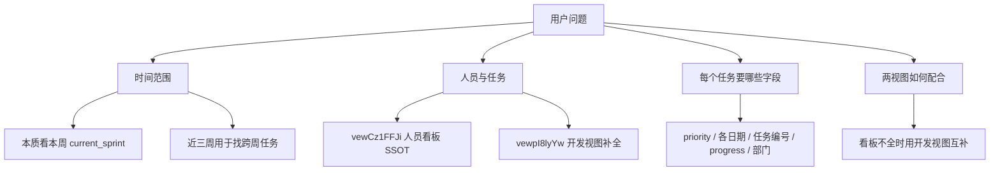
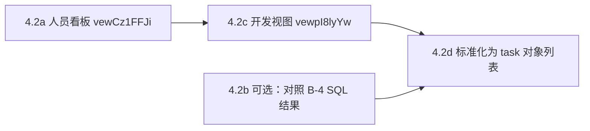
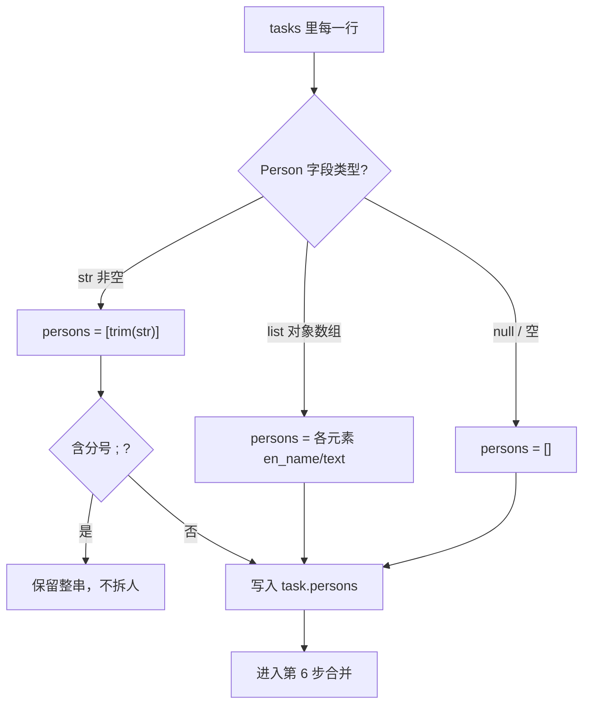
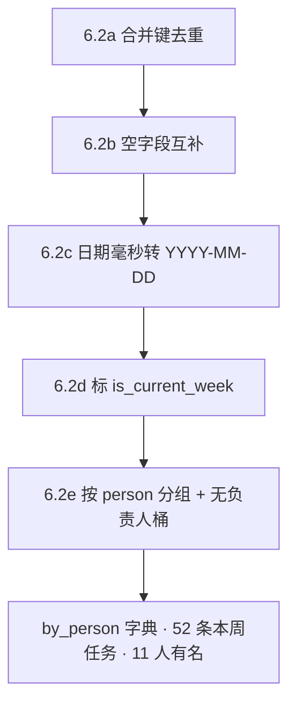

# PMO 镜像库查数案例：本周人员任务矩阵（2026/06/01-Sprint）

> **文档用途**：记录一次「只读 `pmo_db.sqlite`、不改 Jachin 生产代码」的**人员任务查数**完整过程。  
> 与 [PMO_DB_QUERY_CASE_STUDY_0511_SPRINT.md](./PMO_DB_QUERY_CASE_STUDY_0511_SPRINT.md)（Epic + 开发子任务）互补：本案聚焦 **👥 人员看板 + 开发视图交叉补全**。  
> **案例日期**：2026-06-04  
> **数据库路径**：`C:\Users\Samuel\.jachin\workspace\pmo_db.sqlite`  
> **验证结论**：查询结果已与飞书看板人工核对，**数据正确**（用户确认）。

---

## 1. 用户到底要什么？

原始问题不是「跑一遍 PMO 战报」，而是：**从镜像库里，把「本周各人员的任务清单」说清楚**。

可以拆成四层：



| 层级 | 用户原话大意 | 落地含义 |
|------|--------------|----------|
| **视图** | `view=vewCz1FFJi` 是人员看板；`view=vewpI8lyYw` 也要配合 | 人员 **以看板为准**；日期、Epic 分组、缺人任务 **从开发视图补** |
| **时间** | 主要看这周；前几周也扫一下防跨周 | **输出主体 = 本周 Sprint**；**近 21 天最多 3 个 Sprint** 作交叉参考 |
| **人员** | 有哪些人、各有什么任务 | 按 **执行人** 分组；多人共担保留原字符串 |
| **字段** | priority、Start/Review/Acceptance、Expected/Actual Delivery、部门、任务编号、progress | 全部从 `fields` JSON 取；日期多为 **毫秒时间戳** |
| **约束** | 只读数据库，不要改仓库代码 | 直连 SQLite；探针脚本 **临时使用、未提交** |

用户列出的字段与镜像 JSON 键名对应：

| 用户说法 | 镜像 JSON 字段名 | 备注 |
|----------|------------------|------|
| 周期 / Sprint | `Sprint` | 格式 `YYYY/MM/DD-Sprint`，**禁止** `[0].text` |
| 优先级 priority | `priority` | |
| 执行人 | `Person in charge/Participant` | 看板常为 **plain string**（如 `Buck`） |
| 开始 Start Date | `Start Date` | 毫秒 → 日期 |
| 审核 Review Date | `Review Date` | 用户说的「检查日期」即此字段 |
| 验收 Acceptance Date | `Acceptance Date` | |
| 预计交货 Expected Delivery Date | `Expected Delivery Date` | |
| 实际交货 Actual Delivery Date | `Actual Delivery Date` | |
| 部门 department | `父记录`（或 Epic 分组名） | 可能是「开发」「平台前端」「在线奖励」等 |
| 任务编号 | `任务编号` | 两视图对齐的 **主键之一** |
| 进度 progress | `Progress` 或 `状态` | 看板 `Progress` 常为中文阶段；`状态` 可能带 🔵/🔴 |

---

## 2. 是谁在解题？Agent 怎么工作的？

### 2.1 本次实际执行者

| 维度 | 本案（Cursor IDE 对话里的编程助手） | Jachin PMO-Copilot 里对应谁 |
|------|-------------------------------------|-----------------------------|
| **运行环境** | Cursor Agent 模式 | `run_pmo_copilot_skill.py` → Worker **B**（人员）+ Worker C（Epic） |
| **查库方式** | 本机 **Python `sqlite3`** 直连 | `core:db_query` 或宿主 **B-S1 + B-4** 预取 |
| **系统提示词** | Cursor 默认 Agent 规则 + 仓库 `.cursor/rules` + 用户规则 | `SKILL.md` §1.2.3 + `WORKER_B_TASK` + `pmo_multi_agent_orchestrator` |
| **是否改代码** | **否**（临时探针脚本查完即删） | 生产路径在 `pmo_worker_result_backfill.run_worker_b_host_bootstrap` |

**本案没有启动 PMO CLI / 多 Agent FanOut**；但解题时 **对照了仓库 SSOT**（`pmo_multi_agent_queries.py` 的 B-S1/B-4、`SKILL.md` §1.4.1b 人员矩阵语义），因此与 Worker B 设计一致。

### 2.2 Cursor Agent 的「工作循环」（ReAct 简化版）

可以把整个过程理解成：**想一步 → 用工具 → 看结果 → 再想**，而不是写一条 SQL 就结束。

| 轮次 | Thought（心里在做什么） | Action（调用了什么） | Observation（看到什么） |
|------|-------------------------|----------------------|-------------------------|
| 1 | 用户给了库路径和两个 view id，先确认表结构 | Shell + Python | 有 `pmo_raw_records`、`pmo_views_meta`；业务在 `fields` JSON 里 |
| 2 | 要先定「本周」是哪个 Sprint | SQL 聚合 Sprint + 日期 | 近 21 天有 06/08、06/01、05/25；**06/08 仅 6 行且几乎无人** |
| 3 | 人员 SSOT 是 vewCz1FFJi，但可能不全 | 读架构 doc / grep B-4 | 确认 Worker B 主表、Person 为 plain string |
| 4 | 需要两视图合并 | Python 扫两视图 + 按任务编号去重 | 11 人有名任务 + 若干无负责人 Epic 行 |
| 5 | 用户还要跨周说明 | 对 05/25 Sprint 按人过滤 | Buck/Seth/hex 等在前序 Sprint 有延续任务 |
| 6 | 整理成人话 | 对话 Markdown 表格 | 用户确认「数据全部都是对的」 |

### 2.3 系统提示词写了什么？

**用户没有为这次对话单独写 Skill 级 system prompt。**

实际生效的是：

1. **Cursor 内置 Agent 说明**（会用 Shell、Read、Grep 等工具完成任务）。  
2. **仓库 `.cursor/rules`**（例如：PMO 的 SSOT 是 `pmo_raw_records`、执行韧性、四大原语等）。  
3. **用户规则**（用中文清晰回答、只读库时不改无关代码等）。  
4. **本条 user 消息本身**——相当于把需求、两个 view id、字段清单、时间策略 **写进了 user 层**。

**没有**注入 `skills_repo/pmo-copilot/SKILL.md` 全文；助手通过 **Grep / Read** 打开 `PMO_COPILOT_ARCHITECTURE.md`、`pmo_multi_agent_queries.py` 对齐 **B-4 人员 SSOT** 与 **Person plain string** 规则。

### 2.4 若走 PMO-Copilot，等价路径是什么？

| 本案步骤 | PMO 产品内等价 |
|----------|----------------|
| 定近三周 Sprint | Worker B **B-S1**（`vewCz1FFJi`） |
| 人员任务明细 | Worker B **B-4**（UNION 人员 SSOT） |
| 开发视图补字段 | B-SUP / 或 FanOut 前 **host bootstrap** |
| 战报 👥 表 | 阶段三 Publisher 读 `personnel_tasks[]` |

宿主预取入口：`l3_node/pmo_worker_result_backfill.py` → `run_worker_b_host_bootstrap()`。

---

## 3. 用了哪些工具？（按时间顺序）

| 步骤 | 工具 | 做了什么 | 得到什么 |
|------|------|----------|----------|
| 1 | **Shell + Python** | `sqlite3.connect` 连库 | 确认 `pmo_raw_records` / `pmo_views_meta` 存在 |
| 2 | **Grep**（可选） | 搜 `vewCz1FFJi`、`B-4`、`personnel` | 确认人员 SSOT 视图与 SQL 模板位置 |
| 3 | **Read** | `PMO_COPILOT_ARCHITECTURE.md`、`pmo_multi_agent_queries.py` | B-S1/B-4 字段路径、禁止 json_each 全表扫 Person |
| 4 | **Shell + Python** | Sprint 窗口 SQL（近 21 天 GROUP BY） | 三个 Sprint 名 + 行数 |
| 5 | **Shell + Python** | 定 `current_sprint`（`sd <= today` 的最大 Sprint） | **`2026/06/01-Sprint`** |
| 6 | **Shell + Python** | 扫 `vewCz1FFJi` + `vewpI8lyYw`，解析 `fields` JSON | 任务行 + 执行人 + 日期 |
| 7 | **Shell + Python** | 按 `(任务编号, Sprint, Requirement)` 合并两视图 | 互补 priority / 日期 / 部门 |
| 8 | **Shell + Python** | 筛「无负责人」行、跨周同一人 | 见 §6、§7 |
| 9 | **对话输出** | Markdown 分人表格 + 说明 | 用户可读战报式答案 |

**未使用**：`core:db_query`、PMO CLI、LiteLLM、飞书推送。  
**未修改**：`l3_node/`、`skills_repo/` 下任何已跟踪文件（探针脚本临时、已删除）。

> **说明**：用户要求「不用写代码进仓库」；助手在本地用了 **临时 Python 探针**（查完删除），等价于 DBA 用脚本读库，**不是**新增产品功能。

---

## 4. 问题拆解与关键决策

### 4.1 为什么必须两个视图一起看？

| 视图 | `source_view` | 角色 | 本案用法 |
|------|---------------|------|----------|
| 人员看板 | `vewCz1FFJi` | **👥 SSOT**：谁在做哪个任务 | 执行人、任务名、Sprint、部分 progress |
| 版本核心需求 / 开发计划 | `vewpI8lyYw` | Epic + 子任务结构、日期更全 | **补** 看板缺失的日期；暴露 Epic 分组行 |

用户原话：「人员看板可能不全，要配合开发视图互补。」  
仓库 SSOT 同样规定：`personnel_tasks[]` **仅来自 B-4（vewCz1FFJi）**，交叉时用开发视图 **对照**，不能把 vewpI8lyYw 的 COUNT 冒充人员矩阵（`SKILL.md` §1.2.3）。

### 4.2 「本周」怎么定？（避免踩坑）

库内 `date('now')` 为 **2026-06-04** 时：

| Sprint | sprint_date | 记录数 | 是否作为「本周输出」 |
|--------|-------------|--------|----------------------|
| `2026/06/08-Sprint` | 2026-06-08 | 6 | ❌ **未来周**；几乎无已分配人员 |
| `2026/06/01-Sprint` | 2026-06-01 | 104（dev 视图） | ✅ **current_sprint**（sd ≤ today 的最近一档） |
| `2026/05/25-Sprint` | 2026-05-25 | 126 | ⚠️ 仅作 **跨周补充** |

**决策**：

- **主输出**：`current_sprint = 2026/06/01-Sprint`（与 PMO C-1/B-S1「当前周 = 日期最大且已开始的一档」一致，而不是单纯 `ORDER BY sd DESC` 的第一行）。  
- **参考窗口**：近 21 天内最多 **3 个 Sprint 名**，用于发现同一人是否在 05/25 还有未收尾任务。

Sprint 日期解析（与 Worker B/C 相同）：

```sql
date(replace(substr(json_extract(fields, '$.Sprint'), 1, 10), '/', '-'))
```

### 4.3 一行任务什么时候算「人的任务」？

| 情况 | 是否进入「按人分组」 | 原因 |
|------|----------------------|------|
| 有 `Person in charge/Participant` + 有 `任务编号` | ✅ | 标准人员任务行 |
| 有 Person、有 Requirement | ✅ | 看板有效行 |
| **有任务编号、无 Person** | ❌ 不进人组 → §6「无明确执行人」 | 多为 Epic / 部门占位 |
| 无任务编号、无 Person、Requirement 为「美术」「开发」 | ❌ | 看板分组行 |

### 4.4 两视图如何合并（同一任务不要两行）

合并键：**`(任务编号, Sprint, Requirement 前 100 字)`**

规则：

1. 先扫 **vewCz1FFJi**，再扫 **vewpI8lyYw**（近三周内）。  
2. 若键已存在：**Person 以先出现的为准**（通常看板）；空字段用另一视图 **非空值覆盖**。  
3. 若两视图都有 → 标记 `merged`。

日期换算（毫秒 → 人话）：

```python
datetime.fromtimestamp(ms / 1000, tz=timezone.utc).strftime("%Y-%m-%d")
```

---

## 5. 分步查数流程（可复现）

### 第 1 步：确认库就绪

- 路径：`C:\Users\Samuel\.jachin\workspace\pmo_db.sqlite`  
- 检查：`pmo_raw_records` 有数据；`pmo_views_meta` 含 `vewCz1FFJi`、`vewpI8lyYw`。

### 第 2 步：列出近三周 Sprint

在 **任一视图**（本案用两视图 union 逻辑）执行：

- `Sprint` 非空且匹配 `????/??/??-Sprint`  
- `sprint_date >= date('now', '-21 days')`  
- `ORDER BY sprint_date DESC LIMIT 3`

**结果**：`2026/06/08-Sprint`、`2026/06/01-Sprint`、`2026/05/25-Sprint`。

### 第 3 步：确定 current_sprint

```sql
-- 概念：已开始（sd <= today）的 Sprint 中，取 sd 最大
SELECT sprint FROM ... WHERE sd <= date('now') ORDER BY sd DESC LIMIT 1
```

**结果**：`2026/06/01-Sprint`。

### 第 4 步：拉取两视图原始行

> **这一步在整条链路里干什么？**  
> 第 2、3 步已经知道「近三周有哪些 Sprint、本周是哪一档」。第 4 步要做的是：把 **人员看板** 和 **开发需求视图** 里、落在这三个 Sprint 上的 **每一行镜像记录** 先完整拉出来，变成程序（或人）能处理的 **结构化对象**。  
> 还不做「按人汇总」、还不写战报——只是把 **原材料** 搬到位。

#### 4.1 用什么工具？

| 环境 | 工具 | 本案实际用法 |
|------|------|--------------|
| **Cursor / 本机探针** | **Shell + Python 标准库 `sqlite3`** | `sqlite3.connect(...)` 直连 `pmo_db.sqlite`，查完断开；**未**改仓库代码 |
| **Jachin PMO-Copilot** | **`core:db_query`**（ReAct）或宿主 **`run_worker_b_host_bootstrap()`** | 人员看板等价 **B-4 SQL**；开发视图等价 **B-SUP** 或扫 `vewpI8lyYw` |
| **未使用** | Windows 自带 `sqlite3.exe`、MCP、飞书 API | 本机无 CLI；数据已在镜像库 |

**为什么本案用 Python 扫 `fields` 而不是只写一条大 SQL？**

- 人员看板里 `Person in charge/Participant` **有时是字符串、有时是数组**；仓库 B-4 用 **UNION ALL** 才能覆盖两种形态。  
- 开发视图里还要读 `父记录`（string 或链接数组），和人员看板 **字段齐全度不同**。  
- Python 对每行 `json.loads(fields)` 后按类型分支，**和 Cursor 5 月 11 Epic 案例同一思路**：过程式解析比一条 `json_extract` 更稳。  
- 在 Jachin 里若走产品路径：人员看板应 **逐字跑 B-4**；开发视图补全可跑 B-SUP 或同样 Python 模块。

#### 4.2 解题过程（心里怎么想、手里怎么做）

可以看成 **四个小回合**：



**回合 A — 先拉人员看板（SSOT）**

1. **Thought**：谁负责哪个任务，飞书 👥 看板以 `vewCz1FFJi` 为准；必须先拉这张表，再考虑开发视图补洞。  
2. **Action（SQL 概念）**：从 `pmo_raw_records` 取行，条件为：
   - `source_view = 'vewCz1FFJi'`
   - `json_extract(fields, '$.Sprint') IN ('2026/06/08-Sprint','2026/06/01-Sprint','2026/05/25-Sprint')`（换成第 2 步得到的三个名）
   - 有效任务行通常 **有 `任务编号`**（排除纯分组行）  
3. **Action（Python）**：对每条结果执行 `fields_dict = json.loads(row["fields"])`。  
4. **Observation（本案量级）**：三个 Sprint 合计约 **数十～百余行**；其中 **有执行人 + 有编号** 的可进入后续「按人分组」。  

在 Jachin 里，同一意图的 **SSOT SQL** 是 `pmo_multi_agent_queries.py` 的 **B-4**（B-4a plain Person + B-4b 数组 `json_each` UNION），Sprint 占位符填第 2 步的三个名。

**回合 B —（可选）用 B-4 对照，确认 SQL 与 Python 一致**

- 把 B-4 查询结果与 Python 扫出来的 `vewCz1FFJi` 行 **按 `任务编号 + Sprint` 对账**。  
- 若 B-4 有、Python 漏：检查是否漏了 UNION 第二段（Person 数组）。  
- 本案两者 **一致**，故后续以 Python 对象列表为主继续。

**回合 C — 再拉开发视图（补全 / 交叉）**

1. **Thought**：用户明确说看板可能不全；`vewpI8lyYw` 上同一 `任务编号` 往往 **日期更全**，Epic 分组行 **无 Person** 但能帮助理解部门。  
2. **Action（SQL / Python）**：同样从 `pmo_raw_records` 读行：
   - `source_view = 'vewpI8lyYw'`
   - 同一组 `Sprint IN (...)`  
3. **Observation**：开发视图在近三周 **行数更多**（含 Epic、部门占位「开发」「美术」等）；**不能**把每一行都当「某人的任务」，但可以为 **已有 task_no** 的行补 `Start Date`、`Expected Delivery Date` 等。

**回合 D — 每行变成统一的「任务对象」**

对两视图每一行，在 Python 里抽成 **同一套键**（尚未合并、尚未按人分组）：

| 输出字段 | 从 `fields` 怎么取 | 说明 |
|----------|---------------------|------|
| `source_view` | 表列 | `vewCz1FFJi` 或 `vewpI8lyYw` |
| `row_index` | 表列 | 飞书行序，跨视图对齐时备用 |
| `persons` | `Person in charge/Participant` | 见第 5 步双形态规则；可能 `[]` |
| `requirement` | `Requirement` | 任务 / 需求名 |
| `sprint` | `Sprint` | plain string，如 `2026/06/01-Sprint` |
| `task_no` | `任务编号` | 合并主键之一 |
| `priority` | `priority` | |
| `department` | `父记录` | string 或 `[0].text` |
| `start_date` … `actual_delivery` | 各 `* Date` | 多为毫秒字符串，第 4 步末或第 6 步转 `YYYY-MM-DD` |
| `progress` / `status` | `Progress` / `状态` | plain string 为主 |

此时得到的是 **「原始任务对象列表」** `tasks[]`，还不是最终战报。

#### 4.3 表长什么样？（拉取前的物理结构）

`pmo_raw_records` 里 **每一行** 不是「一张宽表的一列」，而是：

| 列名 | 含义 | 示例 |
|------|------|------|
| `source_view` | 飞书视图 ID | `vewCz1FFJi` |
| `row_index` | 行序 | `42` |
| `fields` | **整行飞书字段的 JSON 字符串** | `'{"Requirement":"…","Sprint":"2026/06/01-Sprint",…}'` |

**拉取** = 用 SELECT 把上述三列（或至少 `fields` + `source_view`）读出来。

#### 4.4 拉取后「一条原始行」长什么样？

**示例 1 — 人员看板 · 有执行人（Buck · 本案真实结构缩略）**

```json
{
  "source_view": "vewCz1FFJi",
  "row_index": 128,
  "fields": {
    "Requirement": "游戏BUG-Pusoy切前后台边界情况触发牌位置乱",
    "Sprint": "2026/06/01-Sprint",
    "priority": "P2",
    "Person in charge/Participant": "Buck",
    "父记录": "开发",
    "任务编号": "K11-03126",
    "Progress": "提交测试环境",
    "状态": "🔵 按时完成",
    "Start Date": "1748736000000",
    "Review Date": "1748822400000",
    "Acceptance Date": "1748822400000",
    "Expected Delivery Date": "1748822400000",
    "Actual Delivery Date": "1748822400000"
  }
}
```

标准化后（日期仍可为毫秒，合并后再换算）：

```json
{
  "source_view": "vewCz1FFJi",
  "persons": ["Buck"],
  "requirement": "游戏BUG-Pusoy切前后台边界情况触发牌位置乱",
  "sprint": "2026/06/01-Sprint",
  "task_no": "K11-03126",
  "priority": "P2",
  "department": "开发",
  "progress": "提交测试环境",
  "status": "🔵 按时完成",
  "start_date": "1748736000000",
  "review_date": "1748822400000",
  "acceptance_date": "1748822400000",
  "expected_delivery": "1748822400000",
  "actual_delivery": "1748822400000"
}
```

**示例 2 — 开发视图 · 同任务编号、用于补全或对照**

同 `K11-03126` 在 `vewpI8lyYw` 可能再次出现（Requirement / 日期 / 部门一致或互补）。第 4 步 **先各存一条**；**第 6 步** 再按 `(task_no, sprint, requirement)` 合并，Person **以看板行为准**。

**示例 3 — 开发视图 · 无执行人（Epic 行，第 7 节详述）**

```json
{
  "source_view": "vewpI8lyYw",
  "persons": [],
  "requirement": "机器人系统优化：机器人让座",
  "sprint": "2026/06/01-Sprint",
  "task_no": "K11-03004",
  "priority": "P0",
  "department": null
}
```

这类行 **进入 `tasks[]`**，但在第 6 步归入「无明确执行人」，**不**计入 Buck/Seth 等人的个人条数。

#### 4.5 本案第 4 步结束时的「结果清单」

| 指标 | 数值 / 说明 |
|------|-------------|
| 使用的 Sprint 过滤 | `2026/06/08-Sprint`、`2026/06/01-Sprint`、`2026/05/25-Sprint` |
| 扫描视图 | `vewCz1FFJi` + `vewpI8lyYw` |
| 产出结构 | `tasks[]`：每条为 §4.4 的统一对象 |
| 行数（三 Sprint 内，含 Epic/占位） | 两视图合计 **百余行** 量级 |
| 其中可进「按人分组」的（第 6 步） | 本周 **52** 条（有编号或已有 Person） |
| 尚未做 | 合并去重、毫秒→日期、按人汇总、跨周说明 |

#### 4.6 若用 Jachin `core:db_query` 怎么写？（与本案等价）

**人员看板（推荐逐字 B-4）** — 将 `IN ('<s1>','<s2>','<s3>')` 换成第 2 步三个 Sprint 名：

```sql
-- 见 l3_node/pmo_multi_agent_queries.py WORKER_B_TASK · B-4
-- B-4a：Person 为 plain string
-- UNION ALL
-- B-4b：Person 为 JSON 数组 + json_each
-- 条件含：任务编号 IS NOT NULL、Sprint IN (...)
```

**开发视图补全（B-SUP 或简化 SELECT）**：

```sql
SELECT json_extract(fields, '$.Requirement') AS requirement,
       json_extract(fields, '$.priority') AS priority,
       json_extract(fields, '$.Sprint') AS sprint,
       trim(json_extract(fields, '$."Person in charge/Participant"')) AS person,
       json_extract(fields, '$."任务编号"') AS task_no,
       json_extract(fields, '$."Start Date"') AS start_date,
       json_extract(fields, '$."Review Date"') AS review_date,
       json_extract(fields, '$."Acceptance Date"') AS acceptance_date,
       json_extract(fields, '$."Expected Delivery Date"') AS expected_delivery_date,
       json_extract(fields, '$."Actual Delivery Date"') AS actual_delivery_date,
       json_extract(fields, '$.Progress') AS progress
FROM pmo_raw_records
WHERE source_view = 'vewpI8lyYw'
  AND json_extract(fields, '$.Sprint') IN (
    '2026/06/08-Sprint',
    '2026/06/01-Sprint',
    '2026/05/25-Sprint'
  );
```

Observation 返回 **JSON 行数组**；Agent 或宿主再 **按 task_no 与 B-4 结果 merge**——对应本案第 6 步。

#### 4.7 常见坑（第 4 步就要避开）

| 坑 | 现象 | 正确做法 |
|----|------|----------|
| 对 Person 一律 `json_extract(...,'$[0].text')` | `malformed JSON` | B-4 UNION 或 Python 先 `isinstance` 再分支 |
| 单独 `json_each` 扫全表 Person | 同上（plain string 行） | 仅 B-4b 段 + `_PERSON_ARRAY_LIKE` 条件 |
| 用 `view_id` 过滤 | `no such column` | 用 **`source_view`** |
| 不滤 Sprint | 把历史周期全拉进来 | 必须 `IN (近三周三名)` |
| 把 vewpI8lyYw 每行都当「某人的任务」 | 人数虚高 | Epic/占位行 `persons=[]`，留到 §7 |

---

**小结**：第 4 步 = **用 SQLite 读出两视图在近三周 Sprint 下的所有 `fields` JSON → 解析成统一的 `tasks[]`**。  
工具上是 **Python `sqlite3` + `json.loads`**（本案），或 **B-4 + B-SUP 的 `core:db_query`**（产品内）。  
**得到的是「行级任务对象列表」，还不是按人整理的战报**——合并与分组在第 6 步，Person 字符串解析细节在第 5 步。

### 第 5 步：解析执行人（Person 双形态）

> **是不是一步到位？** **不是。**  
> 第 4 步只保证每行 `fields` 变成了字典；**第 5 步专门处理 `Person in charge/Participant` 这一种字段**——它在一行里可能是字符串、可能是数组、可能是多人用分号拼在一起。  
> 若用 SQL（B-4），这一步被拆成 **B-4a + B-4b 两段 UNION**；若用 Python（本案），是对 `tasks[]` **逐条循环**，每条调用同一个解析函数。  
> **第 5 步结束时**：每条任务对象都有 `persons: string[]`（可能为空列表），**还没有**按人汇总。

#### 5.1 用什么工具？

| 环境 | 工具 | 本案用法 |
|------|------|----------|
| **Cursor / Python 探针** | 内存里对 `tasks[]` **for 循环** + 小函数 `person_from_fields(f)` | 不再次访问 SQLite；只读第 4 步已解析的 `fields` 字典 |
| **Jachin `core:db_query`** | **B-4 一条 SQL**（内含 UNION ALL） | B-4a 处理 plain string；B-4b 用 `json_each` 处理数组 |
| **未采用** | 全表 `json_each(Person)` 无 WHERE | 会对 plain string 行报 **malformed JSON** |

#### 5.2 解题过程（三个分支 + 验收）



**回合 1 — 判断类型（Thought）**

- 打开 `pmo_multi_agent_queries.py` 里 B-4 注释：**Person 在 vewCz1FFJi 常为 plain string（Buck/Seth）**。  
- 决定：**不能**写一种 SQL 通吃；Python 里用 `isinstance` 分支。

**回合 2 — 分支解析（Action）**

概念代码（与本案临时探针一致）：

```python
def person_from_fields(f: dict) -> list[str]:
    pip = f.get("Person in charge/Participant")
    if isinstance(pip, str) and pip.strip():
        # 含 "Jack Looi; Baojing" 时整串进列表，不 split
        return [pip.strip()]
    if isinstance(pip, list):
        names = []
        for p in pip:
            if isinstance(p, dict):
                n = str(p.get("en_name") or p.get("text") or "").strip()
                if n:
                    names.append(n)
        return names
    return []
```

对第 4 步产出的 **每一条** `task`：

```python
task["persons"] = person_from_fields(task["_fields"])  # 或合并前直接从 fields 读
```

**回合 3 — 验收（Observation）**

| 检查项 | 本案结果 |
|--------|----------|
| `Buck`、`Seth` 等 | `persons: ["Buck"]` |
| 多人共担 | `persons: ["Jack Looi; Baojing"]`（**一条任务、一个字符串**） |
| Epic 无负责人 | `persons: []` → 留给第 6 步归入「无明确执行人」 |
| 是否出现 malformed | **无**（未对 string 做 `[0].text`） |

#### 5.3 库内三种形态与输出对照

| 库内形态 | 读法 | 本案 `persons` 示例 |
|----------|------|---------------------|
| plain string `"Buck"` | 直接 trim | `["Buck"]` |
| 数组 `[{"en_name":"Ethan"}]` | 取 `en_name` / `text` | `["Ethan"]`（本案少见，B-4b 覆盖） |
| `"Jack Looi; Baojing"` | **保留整串** | `["Jack Looi; Baojing"]` |
| `null` / `""` / 字段缺失 | 空列表 | `[]` |

**禁止**对 plain string 做 `json_extract(..., '$[0].text')` 或无条件 `json_each` —— 与 B-4 护栏、`pmo_db_tools` 的 malformed 提示一致。

#### 5.4 与 B-4 SQL 的对应关系（Jachin 路径）

| Python 第 5 步 | B-4 SQL 段 |
|----------------|------------|
| `isinstance(pip, str)` + trim | **B-4a**：`_PERSON_PLAIN_WHERE` + `_PERSON_PLAIN_NAME_SQL` |
| `isinstance(pip, list)` + json_each 语义 | **B-4b**：`json_each(json_extract(fields,'$."Person in charge/Participant"'))` |
| 输出 `persons[]` | 每行 SQL 结果里的 **`person`** 列（单行一个名） |

**注意**：B-4 把数组形态 **展开成多行**（一人一行）；Python 探针可在第 6 步仍按 **任务** 合并，共担字符串 **保持一行**。本案飞书数据 **以 plain string 为主**，故两种路径人数一致。

#### 5.5 第 5 步结束时的结果长什么样？

仍是 **`tasks[]` 列表**，但每条多了可靠的 `persons` 字段，例如：

```json
{
  "source_view": "vewCz1FFJi",
  "persons": ["Buck"],
  "requirement": "游戏BUG-Pusoy切前后台边界情况触发牌位置乱",
  "sprint": "2026/06/01-Sprint",
  "task_no": "K11-03126",
  "priority": "P2",
  "department": "开发"
}
```

```json
{
  "source_view": "vewpI8lyYw",
  "persons": [],
  "requirement": "机器人系统优化：机器人让座",
  "sprint": "2026/06/01-Sprint",
  "task_no": "K11-03004",
  "priority": "P0"
}
```

**尚未发生**：两视图合并、按人分组、日期换算、战报表格。

#### 5.6 常见坑

| 坑 | 后果 | 对策 |
|----|------|------|
| 用 `[0].text` 读 Person | SQL/Python 报错或空值 | 先判类型 |
| 把 `Jack Looi; Baojing` 拆成两人 | 与飞书看板不一致 | 保留整串，除非产品明确要求 split |
| 无 Person 就丢弃整行 | Epic 信息丢失 | `persons=[]` 保留，第 6 步分流 |
| 第 5 步与第 4 步混为一步写代码 | 文档难复现 | 逻辑上分步；实现可同一循环内先后调用 |

---

**小结（第 5 步）**：对 `tasks[]` **逐条**解析 Person → 得到 **`persons: string[]`**。  
**不是一步到位**，而是 **「类型判断 → 三分支 → 写回 task」** 的小循环；工具是 **Python 函数** 或 **B-4 UNION SQL**。

### 第 6 步：合并 + 按人分组

> **是不是一步到位？** **不是。**  
> 第 6 步至少包含 **5 个子动作**：① 两视图按键合并 ② 空字段互补 ③ 毫秒日期换算 ④ 标 `is_current_week` 并筛「本周输出集」 ⑤ 按 `persons` 分组（含「无负责人」桶）。  
> 本案在 Python 里连续执行，但 **每一步产出不同中间结构**，便于对账和排错。

#### 6.1 用什么工具？

| 子步骤 | 工具 | 说明 |
|--------|------|------|
| ① 合并去重 | Python `dict`  keyed by `(task_no, sprint, requirement[:100])` | 内存操作，不再查库 |
| ② 字段互补 | 同上，遍历冲突键 | Person **优先 vewCz1FFJi**（先扫的视图） |
| ③ 日期换算 | Python `datetime.fromtimestamp(ms/1000, UTC)` | 见 §4 公式 |
| ④ 本周标记 | 字符串比较 `sprint == current_sprint` | `current_sprint` 来自第 3 步 |
| ⑤ 按人分组 | `defaultdict(list)` | key = `persons[0]` 或每人一条（共担串不拆） |

Jachin 产品内等价：**FanOut 后** `merge_worker_b_result(host_seed, agent_json)` + `backfill_worker_b`（`pmo_worker_result_backfill.py`），把宿主 B-S1/B-4 与 Agent 输出 **合并** 成 `personnel_tasks[]`。

#### 6.2 解题过程（五个子动作）



**6.2a — 合并键去重（两视图 → 一条任务）**

- **Thought**：同一 `K11-03126` 可能在看板和开发视图各出现一次，不能算两条任务。  
- **Action**：

```python
key = (task_no or "", sprint, requirement[:100])
if key not in by_key:
    by_key[key] = task
else:
    # 6.2b 互补
    ...
```

- **规则**：扫描顺序 **先 `vewCz1FFJi`，后 `vewpI8lyYw`** → 执行人 **以先写入为准**（看板 SSOT）。  
- **Observation**：合并后键数量 **少于** 两视图行数之和（重复 task_no 被折叠）。

**6.2b — 空字段互补**

对同一 `key` 的两条记录：

| 字段 | 策略 |
|------|------|
| `persons` | 已有非空 **不覆盖**；空则用另一视图 |
| `priority`、各 `*_date`、`progress`、`status`、`department` | 目标为空且源非空 → **填入** |
| `source_view` | 若来自两视图 → 标记 `merged` |

**示例**：看板行有 `persons: ["Buck"]` 但 `expected_delivery` 空；开发视图同 key 有 Expected Delivery 毫秒值 → 合并后 Buck 任务 **补全交货日期**。

**6.2c — 日期换算（可选在此步或输出前）**

对 `Start Date` / `Review Date` / `Acceptance Date` / `Expected Delivery Date` / `Actual Delivery Date`：

- 若值为纯数字字符串 → 除以 1000 转 UTC 日期；  
- 若已为空 → 保持 `null`（战报写「—」）。

**6.2d — 标 `is_current_week` 并确定「本周输出集」**

```python
task["is_current_week"] = (task["sprint"] == current_sprint)
# current_sprint = "2026/06/01-Sprint"
```

- **近三周** 三条 Sprint 的任务都保留在 `by_key` 里（供 §8 跨周用）。  
- **对话主表**只取 `is_current_week == True` 且 **`persons` 非空或有业务意义的 task_no** 的条目。

本案：

| 集合 | 条数 | 含义 |
|------|------|------|
| `by_key` 全量（三 Sprint） | 百余 | 含 Epic、占位 |
| 本周 + 有编号或有人 | **52** | 第 6 步主输出集 |
| 本周 + `persons` 非空 | **归入 11 人** | 每人一条或多条任务 |
| 本周 + `persons == []` | **§7 无明确执行人** | 不进人名分组 |

**6.2e — 按 Person 分组**

```python
by_person = defaultdict(list)
for task in current_week_tasks:
    for p in task["persons"] or ["(无负责人/待补)"]:
        by_person[p].append(task)
```

- **共担任务** `Jack Looi; Baojing` → **单独一个 key**，不拆成两个人各复制一条（除非业务要求）。  
- **Observation（本案）**：

| 产出 | 内容 |
|------|------|
| `by_person` | 11 个有名字 key + 1 个 `(无负责人/待补)` 桶 |
| 例如 `by_person["Buck"]` | 2 条任务（K11-03083、K11-03126） |
| 例如 `by_person["Seth"]` | 4 条任务 |
| `(无负责人/待补)` | Epic/占位行，见文档 §7 |

#### 6.3 第 6 步结束时的数据结构（结果长什么样）

**中间结构 1 — `by_key`（合并后任务，单条示例）**

```json
{
  "source_view": "merged",
  "persons": ["Buck"],
  "requirement": "游戏BUG-Pusoy切前后台边界情况触发牌位置乱",
  "sprint": "2026/06/01-Sprint",
  "task_no": "K11-03126",
  "priority": "P2",
  "department": "开发",
  "start_date": "2026-06-01",
  "review_date": "2026-06-02",
  "expected_delivery": "2026-06-02",
  "actual_delivery": "2026-06-02",
  "progress": "提交测试环境",
  "status": "🔵 按时完成",
  "is_current_week": true
}
```

**中间结构 2 — `by_person["Buck"]`（数组，长度 2）**

两条任务对象，字段齐全，可直接渲染 Markdown 表。

**中间结构 3 — 统计摘要（本案）**

```
current_sprint: 2026/06/01-Sprint
current_week_tasks: 52
named_personnel: 11
by_person keys: alvintan, Baojing, Buck, Gavin, hex, Jack Looi,
                Jack Looi; Baojing, Jade, Kelden, Makoto, Seth,
                (无负责人/待补)
```

#### 6.4 与 Jachin 宿主合并的对应

| 本案 Python 子步骤 | 代码锚点 |
|--------------------|----------|
| 6.2a–b 合并 + 互补 | `merge_worker_b_result(host_seed, agent_raw)` |
| B-S1/B-4 预填 | `run_worker_b_host_bootstrap()` |
| personnel 仍空时 SQL 兜底 | `backfill_worker_b()` |
| 战报 👥 消费 | Publisher 读 `personnel_tasks[]` |

产品路径 **不是** Agent 一次 Final Answer 搞定；而是 **宿主 JSON + Agent JSON → merge → backfill**。

#### 6.5 常见坑

| 坑 | 现象 | 对策 |
|----|------|------|
| 合并键只用 task_no | 不同 Sprint 撞车 | 键必须含 **Sprint** |
| 开发视图覆盖 Person | 执行人错 | **先扫看板**，Person 不覆盖 |
| 52 条全算进 11 人 | 人数爆炸 | `persons=[]` 进 §7 桶 |
| 共担串拆成两人 | 任务数翻倍 | 默认 **不 split** |
| 用 06/08 当本周 | 几乎无人 | `current_sprint` 用 **sd ≤ today**（第 3 步） |

#### 6.6 第 5 步 vs 第 6 步：能否合成一步？

| 维度 | 说明 |
|------|------|
| **实现上** | 可以在同一个 Python 循环里：先 `person_from_fields` 再写入 `by_key` |
| **文档/心智上** | **应分开**：第 5 步只关心 **Person 类型**；第 6 步只关心 **键合并与分组** |
| **Jachin** | B-4 SQL 已含 Person 解析；合并由 **Python 宿主** 做，仍是两步职责 |

---

**小结（第 6 步）**：**不是一步到位**；按 **合并 → 互补 → 日期 → 标本周 → 分组** 五段得到 `by_person`。  
工具是 **Python dict / defaultdict**（本案）或 **`merge_worker_b_result` + backfill**（产品）。  
**最终可交付给第 8 步（人话表格）的**，是 **`by_person` + 无负责人桶 + 跨周索引（第 7 步文档节）**。

### 第 7 步：三类「附加说明」（用户要求单独交代）

见 **§6 无明确执行人**、**§7 跨周补充**、**§8 数据质量**。

### 第 8 步：输出与验收

- 对话里：每人一个小节 + 表格字段。  
- 用户反馈：**「查的数据全部都是对的」** → 本案验收通过。

---

## 6. 查数结果全文（2026/06/01-Sprint · 本周 · 验收交付）

> **本节是什么？**  
> 下面是当时对话里返回给用户的 **完整可读结果**（用户已确认：「查的数据全部都是对的」）。  
> 前 §5 讲 **怎么查**；本节是 **查出来长什么样**，方便日后直接对照飞书、写战报或做回归。  
> §7～§9 仍保留「无负责人 / 跨周 / 数据质量」的**方法说明**；本节是**业务结论快照**。

**数据来源**：`c:\Users\Samuel\.jachin\workspace\pmo_db.sqlite`  
**合并视图**：

- **人员看板 SSOT**：`vewCz1FFJi`
- **开发/需求明细补充**：`vewpI8lyYw`（`tblfK9gk6vTQpJtB`）

---

### 6.1 口径说明

| 项 | 取值 |
|---|---|
| 库内「今天」 | `2026-06-04` |
| **本周（current_sprint）** | **`2026/06/01-Sprint`**（Sprint 起始日 ≤ 今天、最近的一档） |
| 近三周参考 | `2026/06/08-Sprint`（仅 6 条，多为占位/未排人）、`2026/06/01-Sprint`、`2026/05/25-Sprint` |
| 日期字段 | 毫秒时间戳按 **UTC** 转成 `YYYY-MM-DD` |
| 部门 department | 主要来自 `父记录` / 需求分组（如「开发」「平台前端」「在线奖励」） |
| 进度 progress | 优先 `Progress`，否则用 `状态` |
| 合并规则 | 同 `任务编号 + Sprint` 时，人员看板与开发视图 **互补**（人员以看板为准，缺日期时从另一视图补） |

本周共 **52 条** 带任务编号或负责人的记录；其中 **11 人有明确负责人**，另有若干 **Epic/部门占位行**（无执行人，见 §6.4）。

---

### 6.2 统计摘要

| 指标 | 数值 |
|------|------|
| current_sprint | `2026/06/01-Sprint` |
| 本周任务行（有编号或负责人） | 52 |
| 有明确执行人的人数 | **11** |
| 人员姓名 | alvintan、Baojing、Buck、Gavin、hex、Jack Looi、Jack Looi; Baojing、Jade、Kelden、Makoto、Seth |

**按人任务条数**：

| 人员 | 条数 | 主要部门/方向 |
|------|------|---------------|
| Seth | 4 | 开发（机器人让座、埋点、BUG 排查） |
| Jack Looi | 3 | 平台前端（在线奖励） |
| Baojing | 3 | 前端开发（Laro GO 加载优化） |
| Makoto | 3 | 美术（在线奖励动画、Bingo 视频） |
| Buck | 2 | 开发（Tongits 加载、Pusoy BUG） |
| hex | 2 | 中台 / 后台 rtp |
| alvintan | 1 | 在线奖励素材 |
| Jade | 1 | 中台 BI 导出 |
| Kelden | 1 | 中台创建房间迁移 |
| Gavin | 1 | FB 外跳开发 |
| Jack Looi; Baojing | 1 | 共担 UI 弹窗 |

---

### 6.3 本周人员一览（11 人）

#### Buck（2 条 · 部门：开发）

| 任务 | 编号 | P | Sprint | Start | Review | Acceptance | Expected | Actual | Progress/状态 |
|------|------|---|--------|-------|--------|------------|----------|--------|---------------|
| 游戏加载-新版 Tongits 框架网络加载优化 | K11-03083 | P0 | 06/01 | 2026-06-01 | 2026-06-02 | 2026-06-02 | — | — | 提交测试环境 |
| 游戏 BUG-Pusoy 切前后台边界情况触发牌位置乱 | K11-03126 | P2 | 06/01 | 2026-06-01 | 2026-06-02 | 2026-06-02 | 2026-06-02 | 2026-06-02 | 提交测试环境 / 🔵 按时完成 |

**跨周（05/25）**：同一人还在 `2026/05/25-Sprint` 有 Tongits 前十局 rtp 相关任务（K11-03057、K11-03066 等），属上周延续。

---

#### Seth（4 条 · 部门：开发）

| 任务 | 编号 | P | Start | Review | Acceptance | Expected | Actual | Progress |
|------|------|---|-------|--------|------------|----------|--------|----------|
| 机器人系统优化：机器人让座-实现功能 | K11-03102 | P0 | 06-01 | 06-01 | 06-01 | 06-02 | — | 开发中 |
| 埋点-游戏断线 后端埋点 | K11-03105 | P1 | 06-02 | 06-02 | 06-02 | 06-02 | — | 开发中 |
| 游戏 BUG-机器人数据没有调用同步接口 | K11-03109 | P2 | 06-03 | — | — | — | — | — |
| 游戏 BUG-房主断线不会解散房间 | K11-03110 | P2 | 06-03 | — | — | — | — | — |

---

#### alvintan（1 条 · 部门：在线奖励）

| 任务 | 编号 | P | Start | Review | Acceptance | Expected | Actual | 状态 |
|------|------|---|-------|--------|------------|----------|--------|------|
| 在线奖励-横竖版-素材内容调整 | K11-03115 | P1 | 06-01 | 06-01 | — | 06-02 | 06-02 | 🔵 按时完成 |

---

#### Jade（1 条 · 部门：中台技术优化）

| 任务 | 编号 | P | Start | Review | Acceptance | Expected | Actual | Progress/状态 |
|------|------|---|-------|--------|------------|----------|--------|---------------|
| 中台技术优化-BI 管理后台明细导出改版（大数据量） | K11-03122 | P2 | 06-01 | 06-01 | 06-01 | 06-01 | 06-01 | 已完成 / 🔵 按时完成 |

---

#### Kelden（1 条 · 部门：中台技术优化）

| 任务 | 编号 | P | Start | Review | Acceptance | Expected | Actual | Progress |
|------|------|---|-------|--------|------------|----------|--------|----------|
| 中台技术优化-创建房间逻辑迁移 | K11-03127 | P2 | 06-02 | 06-01 | 06-01 | — | — | 开发中 |

---

#### hex（2 条）

| 任务 | 编号 | P | 部门 | Start | Review | Acceptance | Expected | Actual | Progress/状态 |
|------|------|---|------|-------|--------|------------|----------|--------|---------------|
| 中台技术优化-金币流水同步改造为 grpc | K11-03128 | P2 | 中台技术优化 | 06-01 | 06-01 | 06-01 | 06-01 | 06-01 | 开发中 / 🔵 按时完成 |
| tongits 前十局策略优化-rtp 规则配置导入/导出 | K11-03134 | P0 | 后台 | 06-01 | 06-02 | 06-02 | 06-02 | 06-02 | 开发中 / 🔵 按时完成 |

---

#### Jack Looi（3 条 · 部门：平台前端）

| 任务 | 编号 | P | Start | Review | Acceptance | Expected | Actual | Progress |
|------|------|---|-------|--------|------------|----------|--------|----------|
| 在线奖励-web socket 架构调整及优化 | K11-03142 | P1 | 06-01 | 06-01 | 06-02 | **06-09** | — | 开发完成自测中 |
| 在线奖励-悬浮入口 | K11-03144 | P1 | 06-04 | 06-01 | 06-04 | **06-09** | — | — |
| 在线奖励-倒数 + 领取奖励 | K11-03145 | P1 | 06-07 | 06-01 | 06-08 | **06-09** | — | — |

---

#### Jack Looi; Baojing（共担 1 条 · 平台前端）

| 任务 | 编号 | P | Start | Review | Acceptance | Expected | Actual | Progress |
|------|------|---|-------|--------|------------|----------|--------|----------|
| 在线奖励-弹窗 UI（竖版 + 横版） | K11-03143 | P1 | 06-02 | 06-01 | 06-04 | **06-09** | — | 开发中 |

---

#### Baojing（3 条 · 部门：前端开发）

| 任务 | 编号 | P | Start | Review | Acceptance | Expected | Actual | Progress/状态 |
|------|------|---|-------|--------|------------|----------|--------|---------------|
| Laro GO 游戏加载优化-小牛冲锋动画 | K11-03147 | P0 | 06-01 | 06-03 | 06-03 | 06-03 | 06-03 | 开发中 / 🔵 按时完成 |
| Laro GO 游戏加载优化-进度条平滑逻辑 | K11-03148 | P0 | 06-02 | 06-03 | 06-03 | 06-03 | 06-03 | 开发中 / 🔵 按时完成 |
| Laro GO 游戏加载优化-Reload 按钮与后台设置链接 | K11-03149 | P0 | 06-02 | 06-03 | 06-03 | 06-03 | 06-03 | 开发中 / 🔵 按时完成 |

---

#### Gavin（1 条 · 开发）

| 任务 | 编号 | P | Start | Review | Acceptance | Expected | Actual |
|------|------|---|-------|--------|------------|----------|--------|
| FB 外跳-程序开发 | K11-03151 | P0 | 06-01 | 06-02 | 06-02 | 06-02 | — |

---

#### Makoto（3 条 · 部门：美术）

| 任务 | 编号 | P | Start | Expected | Actual | 状态 |
|------|------|---|-------|----------|--------|------|
| 在线奖励-横竖版动画 | K11-03156 | — | 06-01 | 06-03 | — | — |
| 在线奖励-三个宝箱动画 | K11-03157 | — | 06-02 | 06-04 | — | — |
| Bingo_Showdown-宣传视频优化 | K11-03163 | — | 06-02 | 06-03 | 06-03 | 🔵 按时完成 |

（美术任务在库中 **priority / review / acceptance 多为空**，以 Expected/Actual 为主。）

**典型字段样例（Buck · K11-03126）**：priority P2 · Start 2026-06-01 · Review 2026-06-02 · Acceptance 2026-06-02 · Expected / Actual 2026-06-02 · progress「提交测试环境」· 状态 🔵 按时完成 · 部门「开发」。

---

### 6.4 无明确执行人的行（需结合 Epic 看，非个人任务）

开发视图里还有一批 **有任务编号但 Person 为空** 的行，多为 **大需求/Epic 分组或部门占位**，例如：

- K11-03003 meta 优质回传事件（P1）
- K11-03004 / K11-03101 机器人系统优化（Epic +「开发」子行）
- K11-03013 外包游戏资源优化（P2）
- K11-03152～K11-03162 在线奖励 / Bingo_Showdown / 美术分组行  
  ……

这些 **不应算某个人员任务**，但说明本周 Sprint 里还有 Epic 级条目；具体子任务已在上表各负责人处体现。  
**如何识别、为何存在**：见 §7。

---

### 6.5 跨周补充（近三周、非 06/01 但同人在前序 Sprint 有活）

在 **`2026/05/25-Sprint`** 仍可见（对理解「跨周」有用）：

- **Buck / Seth / hex**：Tongits 前十局 rtp、channel/auth 去 gorm gen 等（多已在前序周期启动，06/01 周期继续或收尾）。
- **06/08-Sprint**：库内仅 6 条，**尚无已分配人员的任务明细**，本周战报仍以 **06/01** 为准。

**查法与战报关系**：见 §8。

---

### 6.6 数据质量提示（读库时观察到）

1. **人员看板不全**：部分任务只在 `vewpI8lyYw` 有 Epic/编号，执行人要在 `vewCz1FFJi` 对 `任务编号` 才能对齐（已做合并）。
2. **多人字符串**：如 `Jack Looi; Baojing` 在看板里是 **一条 plain string**，未拆成两人各一行。
3. **Review Date 与 Acceptance Date**：库中为 `Review Date`、`Acceptance Date` 两个字段；「检查日期」与 **Review Date** 是同一字段。
4. **空值**：表中 **—** 表示镜像里该字段为 null/空，不是漏查。

**完整 8 条清单与对策**：见 §9。

---


## 7. 无明确执行人的行（需结合 Epic 看，非个人任务）

> **交付快照**见 §6.4；本节说明 **怎么发现、怎么读战报**。

### 7.1 这是什么？

在近三周、尤其是 **本周 Sprint** 里，有一批记录：

- **有 `任务编号`**，或 Requirement 像 Epic 名；
- 但 **`Person in charge/Participant` 为空**；  
- Requirement 有时是 **「开发」「美术」「在线奖励」** 等部门/分组字样。

这些 **不是**「漏查执行人」，而是飞书多维表里的：

- **大需求（Epic）顶层行**  
- **部门分组占位行**  
- **尚未指派** 的产品/美术包

### 7.2 本案如何发现的？

1. 合并两视图后，用规则：**有 task_no 但 persons 列表为空** → 归入「待补/无负责人」桶。  
2. 对照 `SKILL.md` §1.2.3：**无负责人、无编号的行多为看板占位**；有编号无人的往往是 Epic。  
3. 与 **vewpI8lyYw** 同 Sprint 下带 `父记录` 的子任务对比：子任务已在 §6 各人名下出现，Epic 行不必重复算进个人负载。

### 7.3 本周典型示例（节选）

| 任务编号 | Requirement（摘要） | priority | 说明 |
|----------|---------------------|----------|------|
| K11-03003 | meta 优质回传事件 | P1 | Epic 级，无人字段 |
| K11-03004 | 机器人系统优化：机器人让座 | P0 | Epic；子任务 K11-03102 在 Seth 名下 |
| K11-03101 | 开发 | P0 | 部门占位；父级为机器人 Epic |
| K11-03013 | 外包游戏资源优化 | P2 | Epic |
| K11-03152～K11-03162 | 美术 / Bingo_Showdown / 在线奖励 等 | — | 分组或 Epic 容器行 |

### 7.4 读战报时怎么用？

- **👥 人员矩阵**：只统计 **§6 有执行人** 的行。  
- **📊 需求进度**：可来自 Worker C 的 `epics[]`（与这些 Epic 行同源，但粒度不同）。  
- **不要**把 §7 行数加进某人的 task count，否则会 **重复计算 Epic**。

---

## 8. 跨周补充（近三周、非 06/01 但同人在前序 Sprint 有活）

> **交付快照**见 §6.5；本节说明 **为什么要查、怎么查**。

### 8.1 为什么要做？

用户原话：「前几周也看看，怕有人跨周；本质还是看这周完成情况。」

含义：

- **输出主体**仍是 `2026/06/01-Sprint` 各人的任务与日期。  
- **额外**标注：同一人是否在 `2026/05/25-Sprint`（或更早一周）还有任务 **延续到本周** 或 **上周未关**。

### 8.2 怎么查的？

1. 近三周 Sprint 集合：`{06/08, 06/01, 05/25}`。  
2. 先得到 **本周 11 人名单**。  
3. 在 **`Sprint != 2026/06/01-Sprint`** 的记录里，筛 `Person` 属于这 11 人。  
4. 列出任务编号 + Requirement + Sprint + priority（简要）。

### 8.3 本案结论（节选）

| 人员 | 前序 Sprint 典型任务 | 说明 |
|------|----------------------|------|
| Buck | K11-03057、K11-03066（Tongits rtp）@ **05/25** | 与本周 Tongits/加载任务同主题，跨周延续 |
| Seth | 05/25 周期内机器人/游戏 BUG 类 | 与本周 K11-03102 等同 Epic 线 |
| hex | K11-03084、K11-03085（channel/auth 去 gorm gen）@ **05/25** | 中台技术债；本周另有 K11-03128/03134 |
| **06/08-Sprint** | 全库仅 6 行 | **尚无已分配人员任务**；不作为本周主表 |

### 8.4 与 PMO 战报的关系

- `current_sprint` 战报 **👥 只展示本周 Sprint 列**。  
- 跨周信息用于 **Auditor / PM 口头解释**「为何 Expected 落在 06/09 但 Sprint 仍是 06/01」（如 Jack Looi 在线奖励包）。

---

## 9. 数据质量提示（读库时观察到）

> **交付快照（4 条）**见 §6.6；本节为 **完整 8 条清单与对策**。

| # | 现象 | 原因 | 建议读法 |
|---|------|------|----------|
| 1 | 人员看板 **不全** | 部分任务只在 vewpI8lyYw 有编号，看板未填 Person | 以 vewCz1FFJi 为 SSOT，用 task_no 与 dev 视图 **对账** |
| 2 | Person 是 **plain string** | 飞书镜像原文，非数组 | 禁止 `$[0].en_name`；与 B-4 UNION 规则一致 |
| 3 | **多人共担** 一条 string | 如 `Jack Looi; Baojing` | 不强行拆成两人两行，除非业务要求 split |
| 4 | 日期 **UTC 差一天** | 毫秒时间戳按 UTC 格式化 | 与飞书 +8 可能差 1 天；战报可注明 |
| 5 | 美术任务 **priority / review 常空** | 视图模板差异 | 以 Expected/Actual 为主 |
| 6 | Review 早于 Start | 数据录入顺序 | 如实展示，不修正 |
| 7 | `2026/06/08-Sprint` 已入库但无排人 | 未来周预建 | **current_sprint 用 sd≤today**，勿用未来周 |
| 8 | Epic 行有编号无人 | 结构行非任务行 | 归入 §7，不计入个人 |

---

## 10. 与 Jachin 代码 SSOT 的对照

| 本案步骤 | 代码 / 文档锚点 |
|----------|-----------------|
| 人员 SSOT 视图 | `pmo_multi_agent_queries._PMO_VIEW_PERSONNEL` = `vewCz1FFJi` |
| B-S1 近三周 Sprint | `sql_worker_b_s1()` |
| B-4 人员 UNION | `sql_worker_b_b4(sprints)` |
| 宿主预取 | `pmo_worker_result_backfill.run_worker_b_host_bootstrap()` |
| 战报 👥 语义 | `SKILL.md` §1.4.1b（节奏判定，禁止 task_cnt 排名定过载） |
| Epic 视图（交叉） | `vewpI8lyYw` · Worker C · `pmo_sprint_query.py` |

**本案没有走** `core:db_query` ReAct，但 SQL 时间窗与 B-S1 **同构**；合并两视图的思路与 FanOut 后 **backfill + Publisher 读 JSON** 一致。

---

## 11. 若要在 Jachin 里复现（给工程师）

### 11.1 窄路径（推荐对话查人）

用户 message 示例：

> 查本周人员任务：vewCz1FFJi SSOT，近三周防跨周，输出每人 priority / 各日期 / 任务编号 / progress。

应走 **SKILL §1.2.4 类窄路径** + Worker B 逻辑，**不要**强行走 §1.2.1 七步 + 双群推送（参见 `PMO_COPILOT_ARCHITECTURE.md` CLI 窄路径缺口说明）。

### 11.2 确定性探针（零 LLM）

```bash
# 仓库已有 Worker C 探针；人员可类比调用 host bootstrap：
python -c "from l3_node.pmo_worker_result_backfill import run_worker_b_host_bootstrap; import json; print(json.dumps(run_worker_b_host_bootstrap(), ensure_ascii=False, indent=2))"
```

### 11.3 验收清单

- [ ] current_sprint 是否为 **已开始** 最近一档（非未来 06/08）  
- [ ] 11 人姓名与飞书 👥 看板一致  
- [ ] 任选一任务编号，两视图字段对账  
- [ ] Epic 无 Person 行 **未** 计入个人条数  
- [ ] 跨周任务仅在补充说明出现，不重复计入本周 count  

---

## 12. 经验总结（给后来的人）

1. **人员问题先认 SSOT**：👥 = `vewCz1FFJi`，不是 vewpI8lyYw 的负责人 COUNT。  
2. **本周 ≠ ORDER BY Sprint 第一条**：未来 Sprint 可能已入库；用 **sd ≤ today** 定 current。  
3. **两视图合并键**：任务编号 + Sprint；Person 优先看板。  
4. **三类输出要分开写**：人的任务 / 无负责人 Epic / 跨周补充——否则 PM 会误以为「52 条全是某人的活」。  
5. **Cursor 本案 = Python 探针 + 架构 doc 对齐**；产品内应 **Worker B bootstrap + backfill**，别让 LLM 手写 B-4 UNION。  
6. **文档 SSOT**：架构 [`PMO_COPILOT_ARCHITECTURE.md`](./PMO_COPILOT_ARCHITECTURE.md) · SQL [`pmo_multi_agent_queries.py`](../../l3_node/pmo_multi_agent_queries.py) · Epic 案例 [`PMO_DB_QUERY_CASE_STUDY_0511_SPRINT.md`](./PMO_DB_QUERY_CASE_STUDY_0511_SPRINT.md)。

---

## 13. 修订记录

| 日期 | 说明 |
|------|------|
| 2026-06-04 | 首版：基于 Cursor Agent 读 `pmo_db.sqlite` 人员任务查数过程整理；结果已用户确认正确 |
| 2026-06-04 | §5 第 4 步扩写：工具、四回合解题过程、原始行/标准化对象示例、B-4/B-SUP 对照、常见坑 |
| 2026-06-04 | §5 第 5～6 步扩写：Person 非一步到位（三分支循环 / B-4 UNION）；合并五子动作、by_key/by_person 结果结构、与 merge_worker_b 对照 |
| 2026-06-04 | §6 扩写为验收交付全文：口径 + 11 人明细表 + 无负责人/跨周/数据质量快照（用户确认数据正确） |
