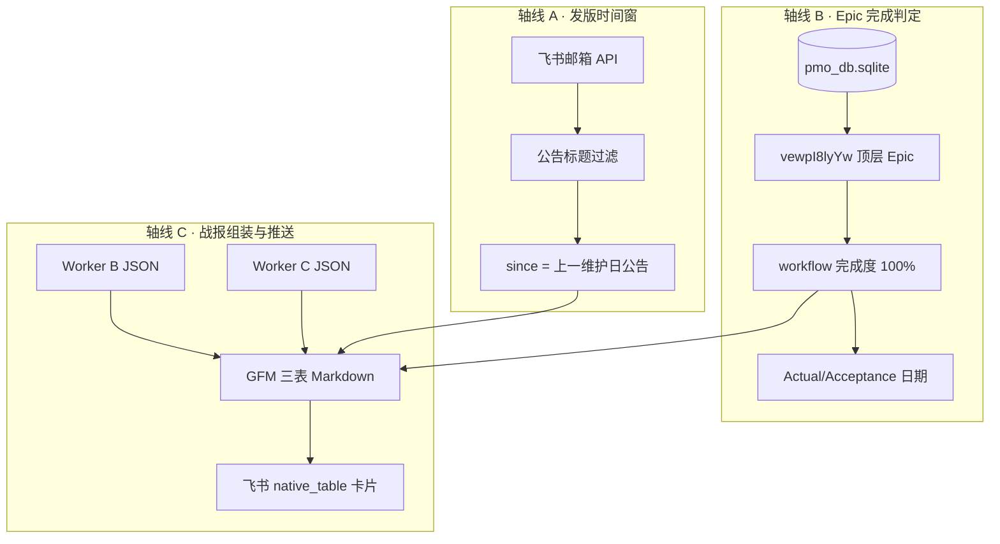
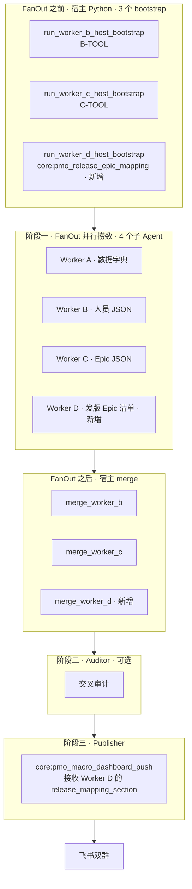

# PMO 版本发布需求映射 · 案例复盘（2026-06-05）

> **文档定位**：记录一次 **真实执行的战报改造**——用户指出战报第三部分「版本发布需求映射」是错的，要求改成「自上一封生产发版公告邮件起，有哪些顶层 Epic 已完成」，并 **当场推送完整战报**。本文完整还原：**怎么拆问题、分几轮分析、每轮用什么工具、读了什么资料、踩了什么坑、最后怎么落地代码与推送**。  
> **读者**：产品、PMO、后端 / Agent 工程师；不要求先读 ReAct 或 cron_thinker 源码。  
> **关联 SSOT**：[`PMO_WORK_ZONG_CASE_STUDY.md`](./PMO_WORK_ZONG_CASE_STUDY.md)（战报上两部分 B/C）· [`PMO_COPILOT_ARCHITECTURE.md`](./PMO_COPILOT_ARCHITECTURE.md) §6.5 · `core/cron_thinker.py`（冒烟发版邮箱）· 实现 `l3_node/tools/pmo_release_epic_mapping.py`  
> **产出物**：`data/_pmo_dashboard_push_latest.md` · 飞书双群推送成功（2026-06-05）

---

## 1. 用户到底要什么？

用户附了一张飞书战报截图，第三块 **📦 版本发布需求映射** 长这样：

| 数据源 | 记录数 | Version Goal 填写 | 填写率 | 说明 |
|--------|--------|-------------------|--------|------|
| vewpI8lyYw 辅表 | 128 | 0 | 0% | 需… |

用户明确说：**这是错的**。他们要的不是「辅表填没填 Version Goal」，而是：

> **当前这一版生产发布，到底带了哪些已经做完的大需求（顶层 Epic）？**

业务口径用一句话说：

> 从 **上一封「生产环境发版维护公告」邮件发出时间**，到 **现在**，在 PMO 需求表里 **完成度达到 100%** 的 **顶层 Epic** 有哪些？这份清单就是战报第三部分；战报 **上面两块** 继续用现成的 Worker B、Worker C。

用户还补充了两条实施约束：

1. **邮件来源**：走「冒烟」插件里已有的能力——监控 **Vivian** 邮箱里的生产发布公告（仓库里对应 `core/cron_thinker.py` 的飞书邮箱轮询，不是让 LLM 瞎编日期）。
2. **交付**：不要只分析，要 **发完整战报**；并提供了 Lark App 凭证用于推送。

---

## 2. 第一步：怎么拆解用户问题？

接到需求后，没有先写 prompt 让 Agent「自由发挥」，而是把模糊话压成 **可验收 checklist**：

| 序号 | 子任务 | 完成标准 | 明确「不能怎么做」 |
|------|--------|----------|-------------------|
| ① | 弄清 **第三部分旧逻辑错在哪** | 能指出当前代码在统计什么、为何与产品意图不符 | 不能继续展示 Version Goal 填写率当「发版映射」 |
| ② | 弄清 **时间窗从哪来** | 能自动取「上一封发版公告」时刻，而非人工填日期 | 不能让 LLM 猜「上次发版是哪天」 |
| ③ | 弄清 **需求完成怎么判** | 顶层 Epic + 完成度 100% + 完成日期落在窗内 | 不能数子任务条数；不能把人员表当 Epic 源 |
| ④ | **保留战报上两部分** | 📊 + 👥 仍走 Worker C / B 宿主预取 | 不能为了第三部分重跑七步 db_query |
| ⑤ | **推送完整战报** | 主群 + 监控群双推 success | 不能只产出 Markdown 不推送 |

进一步拆成 **三条分析轴线**（后文每一轮都围绕这三条转）：



| 轴线 | 回答的问题 | SSOT |
|------|------------|------|
| **A · 发版时间窗** | 「从哪天算起算进本版发版？」 | Vivian 邮箱 + `release_title_present` / `parse_release_maintenance_date` |
| **B · Epic 完成** | 「什么叫做完？哪些行算 Epic？」 | `vewpI8lyYw` + `epic_completion_pct` + 交付日字段 |
| **C · 战报交付** | 「怎么和原来 B/C 拼接并推到群里？」 | `pmo_macro_dashboard.py` + `push_pmo_macro_dashboard_lark.py` |

**关键判断（定调）**：

- 这是 **Work 总战报的局部改造**，不是变更预警（分支 B），也不是单 Sprint 窄查询。
- **主路径必须确定性 Python**，邮箱 + SQL 镜像；LLM 只适合写文档，不适合现场猜 SQL 或猜发版日。
- 第三部分替换后，**上两部分代码尽量不动**，降低回归风险。

---

## 3. 整体安排：五段流水线

| 阶段 | 做什么 | 本次是否执行 |
|------|--------|--------------|
| **0 · 读规范** | 对齐战报三表契约、Worker B/C、cron_thinker 邮箱 | ✅ |
| **1 · 诊断旧实现** | 找到第三部分数据来源，确认是 `requirement_context` 统计 | ✅ |
| **2 · 邮件窗探测** | 调飞书 Mail API，摸清公告邮件长什么样 | ✅（多轮迭代） |
| **3 · Epic 窗内筛选** | 镜像库扫顶层 Epic，完成度 + 日期过滤 | ✅（多轮迭代） |
| **4 · 组装 + 推送** | B/C + 新第三部分 → polish → 飞书卡片 | ✅ |

代码主路径（最终实现）：

```text
scripts/push_pmo_macro_dashboard_lark.py --release-epic-mapping
  → build_polished_macro_dashboard_markdown(use_release_epic_mapping=True)
      → run_worker_b_host_bootstrap()          # 战报 👥
      → run_worker_c_host_bootstrap()          # 战报 📊
      → run_release_epic_mapping()             # 战报 📦（新）
          → fetch_release_announcement_mails() # cron_thinker 同款 Mail API
          → resolve_release_window()
          → find_completed_epics_in_window()
          → build_release_mapping_markdown()
      → polish_pmo_war_report_markdown()
  → run_macro_dashboard_push()
      → send_interactive_card / notifier fallback
```

---

## 4. 分轮执行过程（共 6 轮分析迭代 + 1 轮推送）

下面按 **实际发生的时间顺序** 写：每轮写清 **在想什么 → 用了什么 → 看到什么 → 得出什么 → 下一轮为什么要改**。

---

### 第 0 轮 · 定调与读资料（未动生产数据）

**在想什么**

用户说「调用冒烟插件里的 MCP 监控 Vivian 邮件」。先在仓库里找 **真实入口**，避免凭空造一个「读邮件工具」。

**查阅资料**

| 资料 | 位置 | 读出什么 |
|------|------|----------|
| 战报端到端案例 | `PMO_WORK_ZONG_CASE_STUDY.md` | 上两部分 = Worker B/C + `build_macro_dashboard_markdown`；第三块原先写「辅表 Version Goal」 |
| PMO 架构 | `PMO_COPILOT_ARCHITECTURE.md` §6.5 | 三表 mandatory；第三部分历史上是 Version Goal 占位 |
| PMO Skill | `skills_repo/pmo-copilot/SKILL.md` §1.4 | 📦 表即使全空也要占位行——但 **没规定必须是 Version Goal 统计** |
| 冒烟 / 生物钟 | `core/cron_thinker.py` 文件头注释 | **已存在** Vivian 邮箱轮询、`release_title_present`、`parse_release_maintenance_date`；默认邮箱 `vivian@herontech.net` |
| 战报组装 | `l3_node/tools/pmo_macro_dashboard.py` | 第三部分硬编码：`requirement_context[]` 数 `version_goal` 非空行 → 就是用户截图里 0% 那行 |
| 推送脚本 | `scripts/push_pmo_macro_dashboard_lark.py` | 一键 Work 总推送入口 |

**本轮结论**

| 结论 | 说明 |
|------|------|
| 旧第三部分 ≠ 用户需求 | 统计的是 B 工具 `requirement_context` 辅表填写率，与「本版发版带了哪些 Epic」无关 |
| 邮件能力可复用 | 不必新装 MCP；`cron_thinker` 里 `_mail_list_message_ids` / `_mail_get_message_detail` 可直接复用 |
| Epic SSOT 不变 | 仍只认 `vewpI8lyYw` 顶层大需求，走 `pmo_sprint_query` / `epic_completion_pct` |
| 交付形态不变 | 仍是完整三表战报 + 双群 `native_table` 卡片 |

---

### 第 1 轮 · 镜像库与 B/C 基线确认

**在想什么**

第三部分要换，但用户要求 **上两部分照旧**。先确认镜像库有数据、B/C 能秒级出 JSON，避免推送时前面两块空转。

**使用的工具**

```text
python -c "from l3_node.tools.pmo_db_tools import pmo_mirror_db_ready, get_pmo_db_path; ..."
```

| 项 | 结果 |
|----|------|
| `pmo_mirror_db_ready()` | ✅ True |
| DB 路径 | `~/.jachin/workspace/pmo_db.sqlite` |

**本轮结论**

数据层就绪，可以并行做「邮件窗」和「Epic 筛选」实验，不必先 INIT。

---

### 第 2 轮 · 邮件 API 首次探测（暴露问题：窗太短 + 误命中）

**在想什么**

先验证用户给的 App 凭证能否列出 Vivian 收件箱，并看看 **发版公告邮件长什么样**。初始实现只拉 **最新 20 封**、用 `release_title_present` 宽松匹配标题+正文。

**使用的工具**

- 环境变量：`LARK_APP_ID` / `LARK_APP_SECRET`（用户提供的 `cli_a9253a96…`）
- 代码：`fetch_release_announcement_mails()` 初版（单页、宽松过滤）
- 飞书 API：`GET /mail/v1/user_mailboxes/{mailbox}/messages` + 邮件详情 `internal_date`

**看到什么**

| 现象 | 解读 |
|------|------|
| 命中 **2** 封「像公告」的邮件 | 一封 `生产环境维护公告`，一封 `生产环境验收报告0604` |
| 时间窗 `since` ≈ **2026-06-04 10:05** | 相当于只有 **约 1 天** 的统计宽度 |
| 窗内已完成 Epic = **0** | 本周已 100% 的 Epic（如 Laro GO、埋点）完成日在 **06/02～06/03**，全被挡在窗外 |

**思考（人话）**

不是「库里没有做完的需求」，而是 **「上次发版」取错了**——我们把 6 月 4 日这封当成了「上一版」，实际上一版生产维护是 **5 月 22 日** 那次。另外，「验收报告」不该算发版公告，是正文里蹭到了「维护时间」字样才被误伤。

**本轮结论 → 下一轮要改**

1. 邮箱要 **分页**（API 有 `page_token` / `has_more`）  
2. 公告要 **严过滤**（主题须含「维护公告」，排除回复/验收/确认）  
3. 同一维护日 **去重**（只留最早那封正式公告）

---

### 第 3 轮 · 邮件分页 + 严过滤（时间窗纠正）

**在想什么**

按产品真实节奏，「上一版发版」至少是几周前。把收件箱 **翻 5 页（最多约 100 封）**，只认真正的 **生产环境维护公告**。

**使用的工具**

```python
# 探测脚本（交互中执行）
# 分页 list + 逐封 get detail
# 新增 _is_genuine_release_announcement(subject, body)
# 新增 _dedupe_release_mails_by_maintenance()
```

**过滤规则（落地后）**

| 规则 | 原因 |
|------|------|
| 主题以「回复」「Re:」开头 → 丢弃 | 线程回复不是公告本体 |
| 主题含「验收」但无「维护公告」→ 丢弃 | 验收报告不是发版窗口起点 |
| 主题含「确认」但无「维护公告」→ 丢弃 | 功能确认邮件曾误命中正文里的维护时间 |
| 主题须含 `生产环境` + `维护公告`（或精确针） | 与 cron_thinker 产品约定一致 |
| 同一 `maintenance_date` 只留 **最早** 一封 | 5/9 曾连发两封，避免窗口抖动 |

**看到什么（去重后 9 个维护日）**

| 维护日（降序） | 代表邮件主题 | 邮件时间（UTC） |
|----------------|--------------|-----------------|
| 2026-06-05 | 生产环境维护公告 | 2026-06-04 10:05 |
| 2026-05-22 | 生产环境维护公告 | 2026-05-21 13:51 |
| 2026-05-09 | 【生产环境维护公告】 | 2026-05-09 09:42 |
| … | … | … |

**窗口定义（最终口径）**

- **当前发版**：维护日 **最新** 的一封（2026-06-05）  
- **统计起点 `since`**：**上一维护日** 公告发出时刻（2026-05-21 13:51 UTC，对应 5/22 发版）  
- **统计终点 `until`**：执行时刻（2026-06-05）

**本轮结论**

时间窗从「1 天」纠正为「约两周半」，与 PM 口头说的「上个生产公告到现在」一致。

---

### 第 4 轮 · Epic 完成判定与窗内筛选

**在想什么**

时间窗有了，接下来回答：**哪些算「做完的 Epic」？**

**查阅资料 / 代码**

| 来源 | 用法 |
|------|------|
| `PMO_WORKER_C_SPEC.md` | Epic 只在 `vewpI8lyYw`；有 `任务编号`、无部门父记录 |
| `l3_node/pmo_sprint_query.py` | `_is_big_epic`、`_pack_epic_row` 字段形状 |
| `l3_node/pmo_epic_aggregate.py` | `epic_completion_pct`：泳道 rank，不是子任务条数比 |
| `pmo_workflow_stage.py` | 100% = 上线发布类终态，与 📊 表一致 |

**判定规则（最终实现）**

1. 从镜像 **全表** 扫 `vewpI8lyYw`（不限当前 Sprint）  
2. 顶层 Epic：`父记录` 为空 + 有 `任务编号` + `Requirement` 不是部门占位  
3. **完成**：`epic_completion_pct(epic, children) == 100`  
4. **完成日**：Epic 与子任务上 `Actual Delivery Date` / `Acceptance Date` 等取 **最晚一天**  
5. **入窗**：完成日 ∈ [`since`.date, `until`.date]（且 since 来自邮件 `internal_date`）

**使用的工具**

```text
python -c "from l3_node.tools.pmo_release_epic_mapping import run_release_epic_mapping; ..."
```

**看到什么**

| 指标 | 值 |
|------|-----|
| 全库 100% Epic 总数 | 23（含很多历史 Sprint） |
| **窗内** 命中 | **11** |

**窗内 11 个 Epic（最终结果）**

| Epic | Sprint | 完成日 | 优先级 |
|------|--------|--------|--------|
| Bingo_Showdown | 2026/06/01-Sprint | 06/03 | P2 |
| meta 优质回传事件 | 2026/06/01-Sprint | 06/03 | P1 |
| Laro GO 游戏加载优化 | 2026/06/01-Sprint | 06/03 | P0 |
| 埋点 | 2026/06/01-Sprint | 06/02 | P1 |
| 机器人系统优化：机器人让座 | 2026/06/01-Sprint | 06/02 | P0 |
| tongits内容优化 | 2026/05/18-Sprint | 05/27 | P0 |
| 埋点统计 | 2026/05/25-Sprint | 05/25 | P0 |
| LaroGo 加载异常兜底 | 2026/05/25-Sprint | 05/25 | P0 |
| BUG修复 | 2026/05/25-Sprint | 05/25 | P0 |
| Get Source | 2026/05/18-Sprint | 05/21 | P2 |
| 游戏加载 | 2026/05/18-Sprint | 05/21 | P1 |

**思考（人话）**

- 列表 **跨 Sprint** 是符合预期的：发版窗口按 **日历时间** 切，不是按「当前 Sprint 周」切。  
- 5/22 发版后做的、6/3 前收尾的 Epic 都会进来，包括 5/18、5/25 Sprint 上晚完成项。  
- 「游戏加载优化」在本周 📊 表里是 100%，但若完成日不在窗内，**不会**进 📦 表——第三部分与 📊 表 **刻意不同口径**（一个是「本周进度」，一个是「本版发版交付」）。

**已知局限（诚实写进案例）**

| 局限 | 说明 |
|------|------|
| 负责人列多为「—」 | Epic 行 `Person in charge` 在镜像里常空；子任务有人但未向上聚合到表行 |
| 完成日依赖表字段 | 若 PM 未填 Actual/Acceptance，完成日可能缺；当前用多字段兜底仍可能漏 |
| 邮箱只扫 INBOX 最近 ~100 封 | 更早发版需加大 `max_pages` 或归档文件夹策略 |

---

### 第 5 轮 · 战报组装与版式拼接

**在想什么**

第三部分 Markdown 有了，要 **无缝替换** 进原战报，且 **不破坏** polish 与飞书五列表。

**代码改动**

| 文件 | 改动 |
|------|------|
| `l3_node/tools/pmo_release_epic_mapping.py` | **新建**：邮件窗 + Epic 筛选 + 📦 GFM 段 |
| `l3_node/tools/pmo_macro_dashboard.py` | `build_macro_dashboard_markdown(..., release_mapping_section=)`；`use_release_epic_mapping` 开关 |
| `scripts/push_pmo_macro_dashboard_lark.py` | 新增 CLI 旗标 `--release-epic-mapping` |

**第三部分新版式（示例）**

```markdown
### **📦 版本发布需求映射**
**口径**：统计窗：自上一封发版公告（生产环境维护公告 · 2026-05-21 13:51 UTC）至 …
| # | 大需求 (Epic) | Sprint | 完成日期 | 负责人 |
```

对比旧版：

```markdown
| 数据源 | 记录数 | Version Goal 填写 | 填写率 | 说明 |
| vewpI8lyYw 辅表 | 128 | 0 | 0% | …
```

**使用的工具**

```text
python scripts/push_pmo_macro_dashboard_lark.py --release-epic-mapping --out-md data/_pmo_dashboard_push_latest.md --dry-run
```

**看到什么**

- `data/_pmo_dashboard_push_latest.md` 中 📦 段已是 **11 行 Epic 列表**  
- 上两部分与既有 Work 总案例一致（📊 11 条本周 Epic、👥 14 人矩阵）

**本轮结论**

组装链路打通；可以推送。

---

### 第 6 轮 · 飞书推送与凭证 fallback

**在想什么**

用户给了专用 App，但 Work 总案例里早就遇到过 **230002 未入群**。推送逻辑应：**先用户 App → 失败则 atom_lark_notifier fallback**。

**使用的工具**

```text
python scripts/push_pmo_macro_dashboard_lark.py \
  --release-epic-mapping \
  --app-id cli_a9253a96b179deee \
  --app-secret ***
```

**看到什么**

| 群 | chat_id | 结果 |
|----|---------|------|
| 主群 | `oc_437c98d11106295fb10751a5481ee465` | success |
| 监控群 | `oc_0e321f92d758ecb44aea5b499c90510b` | success |

日志里出现 `Bot/User can NOT be out of the chat`（用户 App 未入群），随后 fallback 机器人发送成功——与 [`PMO_WORK_ZONG_CASE_STUDY.md`](./PMO_WORK_ZONG_CASE_STUDY.md) §推送层描述一致。

**本轮结论**

**完整战报已双群送达**；`status: success`。

---

## 5. 从哪几个角度做了分析？（汇总表）

| 角度 | 问的问题 | 手段 | 最终答案 |
|------|----------|------|----------|
| **产品语义** | 第三部分到底表示什么？ | 读用户截图 + Work 总案例 §积木 C | 本版发版 **已交付 Epic 清单**，不是 Version Goal 填写率 |
| **时间轴** | 「上个发版」从哪天算？ | 飞书 Mail API + 公告过滤 + 维护日去重 | since = 2026-05-21 13:51 UTC（5/22 维护日前公告） |
| **数据 SSOT** | 哪些行算 Epic、怎么算做完？ | `vewpI8lyYw` + `epic_completion_pct` + 交付日 | 11 个 100% Epic 落在窗内 |
| **战报结构** | 和上两部分怎么拼？ | 复用 B/C bootstrap + 替换 `version_block` | 三表一张卡，版式仍走 polish |
| **工程交付** | 怎么复跑、怎么推送？ | CLI 旗标 + 双群 push + fallback | `scripts/push_pmo_macro_dashboard_lark.py --release-epic-mapping` |

---

## 6. 迭代历程一图流


| 轮次 | 核心问题 | 关键改动 | 结果 |
|------|----------|----------|------|
| 2 → 3 | 时间窗太短、邮件误命中 | 分页、主题过滤、维护日去重 | since 从 6/4 改为 5/21 |
| 3 → 4 | 窗内 0 条 Epic | 全库扫 Epic + 完成日过滤 | 11 条 |
| 4 → 5 | 与战报拼接 | `pmo_macro_dashboard` 注入第三段 | Markdown 就绪 |
| 5 → 6 | 推送 | 用户 App + notifier fallback | 飞书 success |

---

## 7. 与现有 PMO 分支的关系

| 能力 | 本案例 | 关系 |
|------|--------|------|
| Work 总宏观看板 | ✅ 上两部分原样 | **扩展** 第三部分口径 |
| 变更预警（分支 B） | ❌ 未走 | 不发精简预警卡，发全量战报 |
| cron_thinker 冒烟 | ✅ 复用邮箱读法 | 本次 **不登记** 次日冒烟，只读公告时间 |
| Skill §1.4 三表 | ✅ 仍三张表 | 📦 表 **语义** 从 Version Goal 改为发版 Epic |

---

## 8. 后续维护建议

1. **默认行为**：若产品确认新口径长期有效，可将 `run_macro_dashboard_push(use_release_epic_mapping=True)` 设为默认，Skill §1.4 同步改 📦 表说明。  
2. **负责人列**：可在 `find_completed_epics_in_window` 中复用 `epic_participants()` 填 📦 表「负责人」列。  
3. **邮箱深度**：发版节奏若超过 100 封邮件跨度，调大 `max_pages` 或按 `maintenance_date` 二分查找。  
4. **完成日审计**：对「100% 但无交付日」的 Epic 打 ⚠️ 行，避免静默漏计。

---

## 9. 复跑命令（运维备忘）

```powershell
$env:LARK_APP_ID="cli_a9253a96b179deee"
$env:LARK_APP_SECRET="<app_secret>"
$env:PYTHONIOENCODING="utf-8"

# 仅预览 Markdown
python scripts/push_pmo_macro_dashboard_lark.py --release-epic-mapping --dry-run --out-md data/_pmo_dashboard_push_latest.md

# 双群推送
python scripts/push_pmo_macro_dashboard_lark.py --release-epic-mapping
```

---

## 10. 修订记录

| 日期 | 说明 |
|------|------|
| 2026-06-05 | 初稿：版本发布需求映射改造全流程复盘（邮件窗 + Epic 筛选 + 战报推送） |
| 2026-06-05 | 追加 §11：Worker D 设计方案（与 Worker B/C 对齐的子 Agent 编排）|

---

## 11. Worker D 设计方案：把这件事做成一个正式子 Agent

> **背景**：第 1～9 节记录的是 Cursor 一次性完成本任务的过程，技术上是靠直接跑 Python 脚本实现的。但 Jachin 里有 Worker B（负责人员）和 Worker C（负责需求），我们希望把「版本发布需求映射」也做成同等地位的 **Worker D**，常态化地参与到每次战报生成流程里，而不是靠手动加 `--release-epic-mapping` 旗标临时触发。

---

### 11.1 先理解 Worker B 和 Worker C 是怎么工作的

要设计 Worker D，先要明白 B 和 C 的工作方式，因为 D 要和它们对齐。

B 和 C 的工作分 **两个阶段**：

**第一阶段（宿主预取，Python，无 LLM）**  
在任何 Agent 还没启动之前，宿主 Python 已经先跑完了最重的查询——B 调用 `core:pmo_personnel_report`，C 调用 `core:pmo_sprint_epic_report`，把结果存在内存里。这一步是确定性的，不依赖大模型，速度快且不会出错。

**第二阶段（FanOut 子 Agent，LLM，极轻量）**  
宿主把预取好的 JSON 塞进 Worker B/C 的上下文，子 Agent 启动后几乎不需要做什么，直接看一眼「宿主已经给了 JSON」就可以输出 Final Answer。子 Agent 的主要作用是：①确认数据合理；②如果宿主预取失败，子 Agent 用 SQL 兜底。

---

### 11.2 Worker D 和 B/C 的相同点与不同点

| 对比维度 | Worker B | Worker C | **Worker D（新）** |
|----------|----------|----------|--------------------|
| **负责的战报板块** | 👥 人员任务矩阵 | 📊 需求进度全览 | **📦 版本发布需求映射** |
| **数据来源** | 飞书人员看板 vewCz1FFJi | 飞书开发计划 vewpI8lyYw | **Vivian 邮箱 + vewpI8lyYw** |
| **宿主预取工具** | `core:pmo_personnel_report` | `core:pmo_sprint_epic_report` | **`core:pmo_release_epic_mapping`（待注册）** |
| **子 Agent 需要 LLM 吗** | 偶尔需要（兜底 SQL） | 偶尔需要（兜底 SQL） | **几乎不需要**（全程确定性） |
| **输出 JSON 形状** | `personnel_tasks[]`、`by_person` | `epics[]`、`epic_children[]` | `completed_epics[]`、`window`、`markdown_section` |

最关键的一个区别：**Worker D 的工作天生就是确定性的，不需要 LLM 参与推理**。因为它要做的事情（读邮件 → 算时间窗 → 查完成度 100% 的 Epic）全都是 Python 代码能直接处理的，没有「语义理解」或「数据模糊映射」的成分。这使得 Worker D 比 B/C 更简单——子 Agent 几乎只做「拿到结果，输出 Final Answer」。

---

### 11.3 Worker D 的核心职责（人话版）

Worker D 只需要回答这一个问题：

> **「自上一封生产发版公告邮件发出之后，到现在为止，PMO 里有哪些大需求（顶层 Epic）的完成度达到了 100%？」**

具体做法分三步：

1. **找时间窗**：去 Vivian 的飞书邮箱里，找到最近两封「生产环境维护公告」类型的邮件，把「上一封」的发送时间作为统计起点（`since`），当前时刻作为终点（`until`）。
2. **找已完成的 Epic**：在 PMO 镜像库（`vewpI8lyYw`）里，找出所有完成度等于 100%、并且完成日期落在这个时间窗内的顶层大需求。
3. **输出清单**：把找到的 Epic 按完成日期排好，生成一段标准格式的 Markdown，供 Publisher 直接拼进战报第三块。

---

### 11.4 需不需要新 MCP？工具怎么安排？

**结论：不需要新 MCP，只需要注册一个新的 Native Tool。**

原因：  
- 读飞书邮件的能力已经存在——`core/cron_thinker.py` 里已有完整的邮件拉取逻辑（这也是本次 Cursor 任务复用的东西），飞书凭证走的是系统里已有的 `LARK_APP_ID` / `LARK_APP_SECRET`，不需要新 MCP。  
- 查 Epic 的能力也已经存在——`vewpI8lyYw` 已在镜像库里，`epic_completion_pct` 逻辑早就在 `pmo_epic_aggregate.py` 里了。  
- 本次任务已经把这两件事封装成了 `l3_node/tools/pmo_release_epic_mapping.py` 里的 `run_release_epic_mapping()` 函数。

**需要做的**：把 `run_release_epic_mapping()` 注册为一个名为 `core:pmo_release_epic_mapping` 的 Native 工具，让 Worker D（和宿主 bootstrap）可以直接调用它，就像 Worker B 调用 `core:pmo_personnel_report`、Worker C 调用 `core:pmo_sprint_epic_report` 一样。

| 工具 ID | 实现位置 | 用途 |
|---------|----------|------|
| `core:pmo_release_epic_mapping` | `l3_node/tools/pmo_release_epic_mapping.py` · `run_release_epic_mapping()` | Worker D 主调工具；宿主 bootstrap 同源 |

---

### 11.5 Worker D 在整条流水线里的位置（出场顺序）

下面是加入 Worker D 后的完整多 Agent 战报生成流程：



**关键点**：Worker D 和 Worker A/B/C **并行跑**，不是等 B/C 跑完再跑。它的结果会被传给 Publisher，Publisher 拼进第三部分。

---

### 11.6 Worker D 的完整工作 SOP（分步骤，人话）

#### 步骤 0（宿主 bootstrap，Python，不用 LLM）

在 FanOut 开始之前，宿主已经调用过 `run_release_epic_mapping()` 并把结果放在 `host_d_seed` 里。这一步做：  
① 读 Vivian 邮箱（最多翻 5 页收件箱，找匹配标题的公告邮件）  
② 过滤掉回复、验收、确认类误命中邮件  
③ 按维护日去重（同一天发了两封，只留最早那封）  
④ 确定时间窗（`since` = 上一维护日公告发送时刻）  
⑤ 扫 `vewpI8lyYw` 全表，找完成度 100% 且完成日期在窗内的顶层 Epic  
⑥ 组装 📦 Markdown 段并存入 `host_d_seed`

如果宿主 bootstrap 成功，`host_d_seed` 里已经有了可以直接用的 `markdown_section`。

#### Worker D 子 Agent 的任务（LLM，极轻量）

宿主把 `host_d_seed` 塞进 Worker D 的上下文。Worker D 醒来后：  

1. **检查是否有宿主预取结果**：如果 `completed_epics[]` 非空或 `markdown_section` 已存在，直接整理成 Final Answer JSON 输出。不允许重跑 `core:pmo_release_epic_mapping`（避免重复调邮件 API）。  
2. **如果宿主预取失败**：调用 `core:pmo_release_epic_mapping` 一次作为兜底，用它的 Observation 组装 Final Answer。  
3. **Final Answer 形状**（和 B/C 一样，输出 JSON，不输出 GFM 战报）：

```json
{
  "window_since": "2026-05-21T13:51:33+00:00",
  "window_until": "2026-06-05T06:21:32+00:00",
  "since_mail_subject": "生产环境维护公告",
  "since_maintenance_date": "2026-05-22",
  "completed_epics": [
    { "epic_name": "Laro GO 游戏加载优化", "priority": "P0", "sprint": "2026/06/01-Sprint", "completion_date": "2026-06-03", "person": "—" },
    ...
  ],
  "completed_count": 11,
  "markdown_section": "### **📦 版本发布需求映射**\n...",
  "completed_sql_ids": ["D-TOOL"]
}
```

#### Publisher 阶段怎么消费 Worker D 的结果

Publisher（阶段三）调用 `core:pmo_macro_dashboard_push` 时，会从 FanOut 的 merge 结果里取 Worker D 的 `markdown_section`，作为 `release_mapping_section` 参数注入 `build_macro_dashboard_markdown()`——这也是本次 Cursor 任务已经实现的注入点（`use_release_epic_mapping` 开关处）。

等于说 Publisher 只需要「拿 Worker D 的 `markdown_section`，替换掉原来的 Version Goal 辅表那一块」就行了，不需要自己再算任何东西。

---

### 11.7 Worker D 规范文档（对标 Worker B/C SPEC）

和 `PMO_WORKER_B_SPEC.md`、`PMO_WORKER_C_SPEC.md` 同等地位，Worker D 的规范文件建议命名为：

**`docs/architecture/PMO_WORKER_D_SPEC.md`**

核心内容应包含：

- **目标**：输出 `completed_epics[]` + `markdown_section`；禁止 GFM 战报；禁止重查人员表或 Sprint 表。
- **步骤 0（必须）**：检查宿主预取 → 有则直接 Final Answer；无则调 `core:pmo_release_epic_mapping`。
- **Final Answer 形状**：见上方 JSON 示例。
- **禁止项**：编造邮件日期；把 Version Goal 辅表统计结果当发版映射输出；重跑 B/C 的 SQL；把子任务误认为 Epic。
- **数据诚实**：若邮件 API 不通（无凭证或权限不足）→ 输出 `window: null`，`completed_epics: []`，`error_reason: mail_api_unavailable`；战报 📦 段用 ⚠️ 占位行，**不能静默输出 0%**。

---

### 11.8 需要改哪些地方？（不写代码，只说要改什么）

**要改动的地方一共 5 处**，每处改动量都不大：

| 改动位置 | 改什么 | 原因 |
|----------|--------|------|
| **`l3_node/tools/pmo_db_tools.py`（工具注册表）** | 把 `core:pmo_release_epic_mapping` 注册进 Native 工具列表 | 让 Agent 能在 system prompt 里看到这个工具，Worker D 才能调用它 |
| **`l3_node/pmo_worker_result_backfill.py`** | 新增 `run_worker_d_host_bootstrap()` | 和 B/C 的 bootstrap 对齐，FanOut 前宿主先预取 D 的结果 |
| **`l3_node/pmo_multi_agent_orchestrator.py`** | 新增 `PMO_WORKER_D_ROLE`、`_load_worker_d_system_prefix()`，并把 Worker D 加进 FanOut 的 `_phase1_fanout_items()` 列表 | Worker D 正式成为 FanOut 并行的第四个 Agent |
| **`l3_node/pmo_macro_dashboard.py`**（Publisher 消费层） | 从 merge 结果里取 `worker_d` 的 `markdown_section`，把它传给 `build_macro_dashboard_markdown(release_mapping_section=...)` | Publisher 正式接入 Worker D 的产出 |
| **`skills_repo/pmo-copilot/SKILL.md` §1.4** | 更新 📦 版本发布需求映射的说明：数据来源改为「Worker D · `completed_epics[]` · 口径：发版公告邮件时间窗」 | Skill 文档与实现对齐，避免 LLM 参考错误口径 |

**不需要改的地方**：  
- `cron_thinker.py` 不动（邮件读法已经封装在 `pmo_release_epic_mapping.py` 里了）  
- Worker A / B / C 不动  
- Auditor 不动（只读 B/C 的 JSON；D 的清单不需要 Auditor 审计，它本身就是事实数据）  
- 推送通道不动（飞书卡片 + fallback 逻辑已经够用）

---

### 11.9 Worker D 应该参与 Auditor 吗？

**不需要**。原因如下：

- Worker B/C 需要 Auditor 是因为它们的数据可能存在「跨视图矛盾」「人员过载判断」「Epic 层级错配」等需要 LLM 审理的逻辑问题。  
- Worker D 的数据天然没有这类歧义：「是否是公告邮件」是规则判断，「完成度 100%」是确定数值，「完成日期在窗内」是日期比较。  
- 如果邮件 API 挂了、或完成 Epic 为 0，Worker D 会诚实地输出 `error_reason` 或空列表加 ⚠️，不需要 Auditor 二次判断。

Auditor 继续只看 A/B/C 三份 JSON 就够了。

---

### 11.10 Worker D 和「冒烟」的关系（避免混淆）

`cron_thinker.py` 里的「生物钟」有两件事：  
① **登记冒烟任务**：收到发版公告后，在「维护日次日某时刻」安排一次统合冒烟测试。  
② **被 Worker D 借用的能力**：读邮件、识别公告标题、解析维护日期。

Worker D **只借用了②**，并不触发冒烟。它读邮件是为了「知道上次发版是什么时候」，不是为了登记冒烟时间。两者独立，互不干扰。

---

### 11.11 降级策略（邮件不通时怎么办）

Worker D 的「邮件读取」这一步是 **外部依赖**，可能因为飞书权限、网络、App 凭证等原因失败。降级策略：

| 失败类型 | 处理方式 |
|----------|----------|
| 邮件 API 返回鉴权错误 | `worker_d.error_reason = "mail_api_auth_failed"`；📦 段用 ⚠️ 占位；继续推送（不阻塞战报） |
| 邮件 API 超时 | 同上；日志记录 `error_class: transient` |
| 邮件里找不到任何公告（全是非公告邮件） | `window = null`；📦 段写「未找到发版公告邮件，无法确定统计窗」 |
| 镜像库无数据（pmo_db 未初始化） | 不调 Worker D；战报整体走 INIT 流程，等数据就绪后再跑 |

**无论哪种失败，都不能阻塞整张战报的推送**——Worker B/C 的部分照常发，📦 段有问题就打 ⚠️，不能让一部分数据的问题拖死整个推送。这符合 Jachin 执行韧性规范里的「部分成功」原则。

---

### 11.12 总结：一句话说清 Worker D

Worker D 做的事，用一句话说就是：

> **「自动找到上次生产发版的时间，再去需求表里统计这段时间内交付完成的大需求，把结果做成第三块表送给 Publisher。」**

它不需要 LLM 推理，不需要新 MCP，不需要改 Auditor，只需要一个新的 Native 工具注册 + 宿主 bootstrap 函数 + FanOut 里加一条 Worker + Publisher 里加一个取值。和 Worker B/C 对齐的方式接入，和它们并排出现在战报生成流程里。
