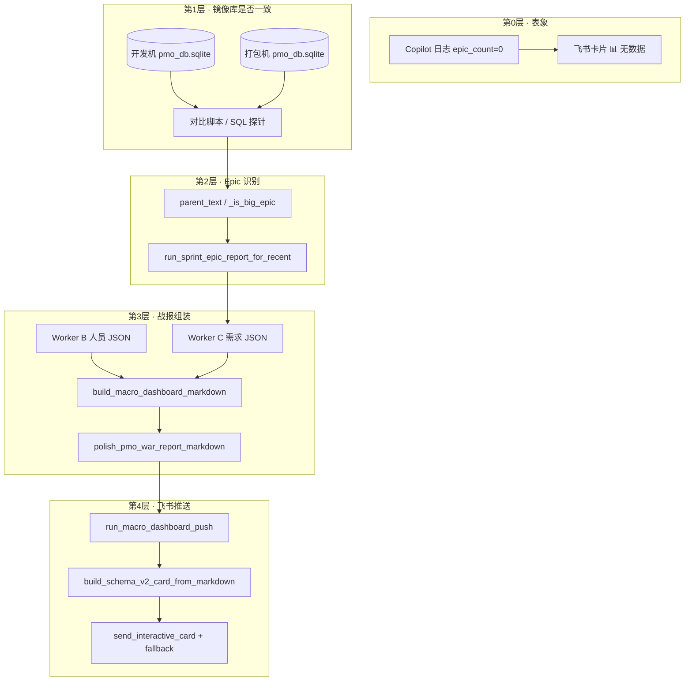

# PMO 战报空表排查与手动推送案例（2026-06-12）

> **文档定位**：记录 2026-06-12 一次真实故障的完整处置过程——开发机战报 📊 需求表为空、打包机正常；对比两份 `pmo_db.sqlite` 定位根因；修复 Epic 识别逻辑后，从开发机库查数、组装战报并推送到指定飞书群。  
> **读者**：PM、开发、运维；不要求先读 ReAct / FanOut 源码。  
> **关联 SSOT**：[`PMO_WORK_ZONG_CASE_STUDY.md`](./PMO_WORK_ZONG_CASE_STUDY.md)、[`PMO_WORKER_C_SPEC.md`](./PMO_WORKER_C_SPEC.md)、[`PMO_WORKER_B_SPEC.md`](./PMO_WORKER_B_SPEC.md)。

---

## 1. 背景与用户诉求（时间线）

| 时间 | 现象 / 诉求 |
|------|-------------|
| 6/12 14:03 / 15:22 | 开发机跑 PMO Copilot，战报推送 `success`，但 `epic_count=0`，📊 需求表显示「（无数据）」；👥 人员矩阵正常（16 人） |
| 6/10 15:41 | 同日 `current_sprint=2026/06/08-Sprint`，`epics=29`，推送 `epic_count=17`（含 club、Tongits King 等）——**正常基线** |
| 对比任务 | 用户提供两份 SQLite：开发机 `~/.jachin/workspace/pmo_db.sqlite` vs 打包机 Downloads 下的 `pmo_db*.sqlite`，要求找差异原因 |
| 手动推送 | 用户要求：从开发机库查「需求进度」相关内容，组装战报，推送到 `oc_911e0485191fdbc068e7540d68c252c7` |

**核心矛盾**：同一 Sprint、同一套代码，开发机 `epic_count=0`，打包机 `epic_count=17`。

---

## 2. 问题拆解（五层模型）

没有把问题当成「飞书没发出去」或「SQL 写错了」单点排查，而是拆成五层，每层有固定入口与可验证输出：



| 层级 | 要回答的问题 | 失败时典型表象 |
|------|--------------|----------------|
| 0 | 推送成功但内容空？ | `status=success` 且 `epic_count=0` |
| 1 | 两机镜像库字段形态是否不同？ | 同 Epic 行 `父记录` 编码不一致 |
| 2 | Python Epic 识别是否把大需求误判为子任务？ | `matched_current=0` 但本周有 200+ 行 |
| 3 | 组装是否过滤掉非本周 Epic？ | `worker_c.epics` 有数据但 `sprint != current_sprint` |
| 4 | 机器人是否在目标群？ | Lark `230002` Bot not in chat |

---

## 3. 阶段一：对比两份 SQLite（定位数据差异）

### 3.1 使用的工具与操作

| 步骤 | 工具 / 模块 | 操作 |
|------|-------------|------|
| 1 | **Cursor Shell** | 确认两库路径与文件大小 |
| 2 | **临时 Python 脚本** `scripts/_tmp_compare_pmo_db.py` | 设置 `JACHIN_PMO_DB_PATH` 切换库，对比 view 行数、sync 时间、本周 Sprint 行、`父记录` 分布、Python Epic 识别数 |
| 3 | **`l3_node/tools/pmo_sprint_query.py`** | 脚本内调用 `run_sprint_epic_report_for_recent()` 模拟 Worker C 宿主预取 |
| 4 | **sqlite3**（脚本内） | 查 `pmo_raw_records`：`source_view='vewpI8lyYw'`、`Sprint='2026/06/08-Sprint'` |

**开发机库路径**：`C:\Users\Samuel\.jachin\workspace\pmo_db.sqlite`（约 5.46 MB，最后写入 ~6/12 15:48）  
**打包机库路径**：`C:\Users\Samuel\Downloads\pmo_db(这个是打包机上抓下来的数据库）.sqlite`（约 7.23 MB）

### 3.2 对比结果（关键摘录）

#### view 规模与同步时间

| view_id | 开发机 rows / sync | 打包机 rows / sync |
|---------|-------------------|-------------------|
| `vewpI8lyYw`（需求主表） | 4007 / `2026-06-12T06:59:45` | 5691 / `2026-06-12T01:21:16` |
| `vew8TxMcSh` | 113 / **6/10**（未更新） | 113 / 6/12 |
| `vewCz1FFJi` | 125 / 6/12 | 123 / 6/12 |

> 开发机 6/12 部分辅表拉表 permission denied，但不影响本周 `vewpI8lyYw` 中 06/08 Sprint 行（208 vs 206，接近）。

#### 本周 Sprint（`2026/06/08-Sprint`）有「任务编号」行的 `父记录` 形态

| 形态 | 开发机 | 打包机 |
|------|--------|--------|
| `json_string_empty_link`（JSON 字符串，`text_arr: []`） | **17** | **0** |
| `null_or_empty` | 0 | **19** |
| `plain_text`（如「开发」） | 87 | 86 |

#### `club` 典型行（同一条大需求的两行镜像）

| 来源 | 开发机 | 打包机 |
|------|--------|--------|
| 层级 bullet 行 | `任务编号=null`，`父记录=null` | 同左 |
| 平面表行 `K11-03218` | `父记录='{"table_id":"tblfK9gk6vTQpJtB","text_arr":[],"type":"text"}'` | `父记录=''`（空串） |
| `_is_big_epic()` | **False** | **True** |

#### Python Epic 识别（修复前）

| 指标 | 开发机 | 打包机 |
|------|--------|--------|
| `current_sprint` | `2026/06/08-Sprint` | `2026/06/08-Sprint` |
| 各 Sprint `big_epic` | 06/08: **0**；06/15: 6 | 06/08: **17**；06/01: 12 |
| `total_epics` | 6 | 29 |
| **`matched_current`** | **0** | **17** |

### 3.3 阶段一结论

- **不是** SQLite DDL 改版（`pmo_raw_records` 表结构未变）。
- **不是** `current_sprint` 算错（两库一致为 `2026/06/08-Sprint`）。
- **是** 同一条飞书记录入库后，开发机把「空父链接」写成 **JSON 字符串**，打包机写成 **null/空串**；Python `parent_text()` 把 JSON 字符串当成「有父记录」，导致 `_is_big_epic()` 本周 17 条大需求全部排除。

---

## 4. 阶段二：根因链路（代码锚点）

### 4.1 战报数据流（生产路径）

```text
core:pmo_macro_dashboard_push
  → run_macro_dashboard_push()                    # l3_node/tools/pmo_macro_dashboard.py
  → build_polished_macro_dashboard_markdown()
       → fetch_worker_bc_json()
            → run_worker_b_host_bootstrap()       # l3_node/pmo_worker_result_backfill.py
            → run_worker_c_host_bootstrap()
                 → run_sprint_epic_report_for_recent()  # l3_node/tools/pmo_sprint_query.py
  → 过滤 epics：仅 sprint == current_sprint
  → build_macro_dashboard_markdown() + polish_pmo_war_report_markdown()
  → _send_markdown_card_to_chat()
```

### 4.2 Epic 判定规则（故障点）

文件：`l3_node/tools/pmo_sprint_query.py`

```python
def _is_big_epic(fields):
    # 1. Requirement 非空且非部门占位
    # 2. parent_text(fields) is None   ← 故障：空链接 JSON 被当成有父
    # 3. 有 任务编号
```

修复前 `parent_text()` 对字符串只做 `strip()`，**不识别**飞书空链接 JSON：

```json
{"table_id": "tblfK9gk6vTQpJtB", "text_arr": [], "type": "text"}
```

### 4.3 与 Agent C-2 SQL 的差异

`l3_node/pmo_multi_agent_queries.py` 中 `_PARENT_EPIC_NULL_SQL` 用 `json_extract` 判断 `null` / `''` / `[0].text IS NULL`，**同样未覆盖** JSON 字符串空链接——但打包机数据本身是 `null/''`，故 SQL 路径在打包机上仍可用；开发机则 Python 与 SQL 路径都会漏认（若走 SQL）。

### 4.4 排除的假设

| 假设 | 验证方式 | 结论 |
|------|----------|------|
| 飞书 UI 改表结构 | 对比 6/10 正常日志与 6/12 字段名 | 未变 |
| 战报组装过滤 bug | `pmo_macro_dashboard.py` 仅筛 `sprint == current_sprint` | 逻辑正确，上游 `epics` 已为空 |
| schema 迁移 | 查 `pmo_raw_records` DDL | 自 v0.9.75 未变 |

---

## 5. 阶段三：代码修复

### 5.1 修改内容

**文件**：`l3_node/tools/pmo_sprint_query.py`

新增 `_parent_record_is_empty_link()`，在 `parent_text()` 入口将下列形态视为**无父记录**：

- `null` / `""`
- JSON 字符串或对象，且 `text_arr == []`（或 `text_arr` 为空且无 `text`）

**测试**：`tests/unit/test_pmo_sprint_epic_report.py::test_parent_text_string_and_array` 增补空链接用例。

### 5.2 修复后验证（开发机库）

对 `C:\Users\Samuel\.jachin\workspace\pmo_db.sqlite` 重跑 Epic 识别：

| 指标 | 修复前 | 修复后 |
|------|--------|--------|
| 本周 `big_epic` | 0 | **17** |
| `matched_current` | 0 | **17** |
| 示例 Epic | — | club、Tongits King 前十局策略优化、分享裂变、指纹商业版接入… |

---

## 6. 阶段四：查数 → 组装 → 推送（用户指定开发机库 + 指定群）

### 6.1 用户指令拆解

| 子任务 | 含义 |
|--------|------|
| 查数据 | 从 `~/.jachin/workspace/pmo_db.sqlite` 读取需求进度（Worker C）+ 人员矩阵（Worker B） |
| 组装 | 生成 K11 宏观看板 Markdown（Executive Summary + 📊 + 👥 + 📦） |
| 推送 | 发到 `oc_911e0485191fdbc068e7540d68c252c7`，不推监控群 |

### 6.2 执行方式

使用一次性脚本（会话内临时创建，推送完成后已删除）调用正式模块，**不经过 LLM ReAct**：

```python
# 环境变量
os.environ["JACHIN_PMO_DB_PATH"] = r"C:\Users\Samuel\.jachin\workspace\pmo_db.sqlite"
os.environ["PMO_PRIMARY_CHAT_ID"] = "oc_911e0485191fdbc068e7540d68c252c7"
os.environ["PMO_PUSH_MONITOR"] = "0"

from l3_node.tools.pmo_macro_dashboard import run_macro_dashboard_push
run_macro_dashboard_push(chat_id="oc_911e0485191fdbc068e7540d68c252c7", push_monitor=False)
```

等价的生产工具 ID：`core:pmo_macro_dashboard_push`（宿主 `l3_node/tools/pmo_db_tools.py` 分发）。

### 6.3 逐步操作与结果

| 步骤 | 模块 / 工具 | 操作 | 结果 |
|------|-------------|------|------|
| 0 | `pmo_mirror_db_ready()` | 检查 `pmo_raw_records` 非空 | ✅ 有数据 |
| 1 | `run_worker_c_host_bootstrap()` | `run_sprint_epic_report_for_recent()` 读 `vewpI8lyYw`，近 3 Sprint 窗 | `epics` 含多周；本周 **17** 条大需求 |
| 2 | `run_worker_b_host_bootstrap()` | `core:pmo_personnel_report` 同源预取 | `person_count=16`，`by_person` 含节奏预警 |
| 3 | `run_release_epic_mapping()` | Worker D 段落：版本发布需求映射 | 4 个已完成 Epic（含 Tongits King、Laro GO 等） |
| 4 | `build_macro_dashboard_markdown()` | 合并 B/C，算完成度、泳道、人员矩阵排序 | GFM 三表 + Executive Summary |
| 5 | `polish_pmo_war_report_markdown()` | 五列 native 折叠、单元格压紧 | 符合 `PMO_WAR_REPORT_LAYOUT_CONTRACT` |
| 6 | **dry_run** | `run_macro_dashboard_push(dry_run=True)` | `epic_count=17`，`person_count=16`，`current_sprint=2026/06/08-Sprint` |
| 7 | `_resolve_lark_credentials()` | 读 `~/.jachin/.env` + `config/mcps/atom_lark_notifier` | 拿到 app_id / app_secret |
| 8 | `build_schema_v2_card_from_markdown()` | Markdown → 飞书 Schema 2.0 交互卡片 | `tag:table` 原生表格 |
| 9 | `send_interactive_card()` | 主 PMO 应用发 IM | ⚠️ `230002` Bot/User can NOT be out of the chat |
| 10 | `_send_markdown_card_to_chat()` fallback | 换 `atom_lark_notifier` 配置应用重试 | ✅ `status=success` |

### 6.4 推送最终结果

| 字段 | 值 |
|------|-----|
| `status` | `success` |
| `message_id` | `om_x100b6d881fca2080e2dffb5e4e07ea0` |
| `chat_id` | `oc_911e0485191fdbc068e7540d68c252c7` |
| `title` | `【K11 · PMO 宏观看板】2026-06-12` |
| `current_sprint` | `2026/06/08-Sprint` |
| `epic_count` | **17**（P0 5 项 · 进行中 15 项） |
| `person_count` | **16** |

### 6.5 战报内容摘要（组装产出）

**Executive Summary**

- 当前 Sprint：`2026/06/08-Sprint`（`2026-06-08`）
- 总体：🟢 进展顺利，5 个 P0 大需求推进中

**📊 需求进度全览（节选）**

| 优先级 | 需求 | 完成度 | 状态 |
|--------|------|--------|------|
| P0 | club | 43% | 🔵 开发/验收 · 美术开发 |
| P0 | Tongits King 前十局策略优化 | 100% | 🟢 上线发布 |
| P0 | 分享裂变 | 8% | 🔵 立项/评审 |
| P1 | 任务系统优化 | 57% | 🔵 开发/验收 · 联调 |
| P2 | 技术优化 | 61% | 🔴 技术自测验收 |

**👥 人员任务矩阵（预警节选）**

- 🚨 延期：Akie、alvintan、eddy、hex、Jade、Patrick、Cole 等
- 🟡 偏闲：Buck、Jack Looi、Kelden
- ✅ 正常：Baojing、Gavin、Makoto 等

**📦 版本发布需求映射**

- 统计窗：维护日 2026-06-05 至 2026-06-12
- 已完成顶层 Epic：4 个（含 Tongits King 前十局、Laro GO 游戏加载优化等）

---

## 7. 工具与文件索引（速查）

| 用途 | 路径 / 工具 ID |
|------|----------------|
| SQLite 镜像 | `~/.jachin/workspace/pmo_db.sqlite`（`JACHIN_PMO_DB_PATH` 可覆盖） |
| DB 连接 / schema | `l3_node/tools/pmo_db_tools.py` |
| Worker C 宿主预取 | `l3_node/pmo_worker_result_backfill.py` → `run_worker_c_host_bootstrap()` |
| Worker B 宿主预取 | `l3_node/pmo_worker_result_backfill.py` → `run_worker_b_host_bootstrap()` |
| Epic 识别（Python） | `l3_node/tools/pmo_sprint_query.py` → `run_sprint_epic_report_for_recent()` |
| 人员矩阵 | `l3_node/tools/pmo_personnel_query.py` |
| 战报组装 | `l3_node/tools/pmo_macro_dashboard.py` → `build_macro_dashboard_markdown()` |
| 版式契约 | `l3_node/pmo_report_format.py` |
| 一键推送 | `core:pmo_macro_dashboard_push` → `run_macro_dashboard_push()` |
| 飞书卡片 | `l3_node/channels/lark/md_native_table_card.py` |
| IM 发送 | `l3_node/channels/lark/im.py` → `send_interactive_card()` |
| 推送守卫 | `l3_node/pmo_lark_push_guard.py` |
| 飞书 env | `~/.jachin/.env`（`PMO_PRIMARY_CHAT_ID`、`PMO_PUSH_MONITOR`） |
| 备用机器人 | `config/mcps/atom_lark_notifier/config.yaml` |
| 生产脚本（可复用） | `scripts/push_pmo_macro_dashboard_lark.py` |

---

## 8. 复现命令（维护同事用）

### 8.1 仅预览战报（不推送）

```powershell
cd D:\project\jachin-system-main
$env:JACHIN_PMO_DB_PATH = "C:\Users\Samuel\.jachin\workspace\pmo_db.sqlite"
python -c "
from l3_node.tools.pmo_macro_dashboard import run_macro_dashboard_push
import json
print(json.dumps(run_macro_dashboard_push(dry_run=True), ensure_ascii=False, indent=2))
"
```

### 8.2 推送到指定群（关闭监控群）

```powershell
$env:JACHIN_PMO_DB_PATH = "C:\Users\Samuel\.jachin\workspace\pmo_db.sqlite"
$env:PMO_PRIMARY_CHAT_ID = "oc_911e0485191fdbc068e7540d68c252c7"
$env:PMO_PUSH_MONITOR = "0"
python scripts/push_pmo_macro_dashboard_lark.py
```

> 若主 PMO 机器人不在群内，会自动 fallback 到 `atom_lark_notifier` 应用（见 `_send_markdown_card_to_chat` 中 `230002` 分支）。

### 8.3 单测 Epic 父记录识别

```powershell
python -m pytest tests/unit/test_pmo_sprint_epic_report.py::test_parent_text_string_and_array -q -o addopts=
```

---

## 9. 经验与后续建议

1. **入库形态要纳入 Epic 契约**：`pmo_mirror_import` / 拉表 `_cell_to_text` 在不同环境可能把空父链接写成 `""` 或 JSON 字符串；`parent_text()` 须与业务语义对齐，不能只看「非空字符串」。
2. **对比两库比猜日志快**：同 Sprint 行数接近但 `父记录` 分布不同，一眼可定性为「识别规则」而非「拉表失败」。
3. **`epic_count=0` 且 `person_count>0`**：优先查 Worker C Python 路径，而非推送通道。
4. **推送 success ≠ 主应用入群**：日志里出现 `230002` 时检查 fallback 是否生效，以及群内是否能看到卡片。
5. **建议把 `_PARENT_EPIC_NULL_SQL` 与 `parent_text()` 抽成共享 SSOT**，避免 Python 与 SQL 两套父记录判定再次分叉。

---

## 10. 变更记录

| 日期 | 变更 |
|------|------|
| 2026-06-12 | 初稿：开发机 vs 打包机对比、parent_text 修复、手动推送 `oc_911e0485191fdbc068e7540d68c252c7` 全记录 |
