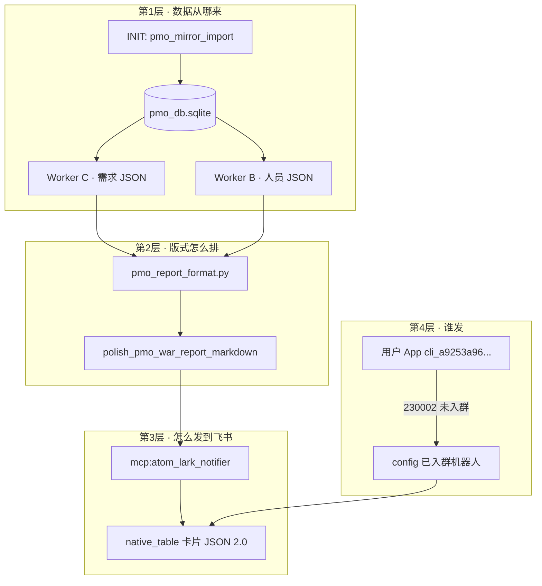
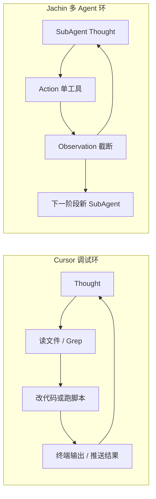

# PMO Work 总 · 宏观看板战报端到端案例（2026-06-04）

> **文档定位**：与 [`PMO_WORKER_B_SPEC.md`](./PMO_WORKER_B_SPEC.md)、[`PMO_WORKER_C_SPEC.md`](./PMO_WORKER_C_SPEC.md) 并列的 **「Work 总」** 说明——记录一次真实任务里：**问题如何拆解、用什么工具、数据如何查出来、飞书如何推送、踩了哪些坑、Agent 在系统里怎么转**。  
> **读者**：PM、开发、后续维护 Skill/战报版式的同事；不要求先读 ReAct 源码。  
> **数据 SSOT**：SQLite 镜像 `~/.jachin/workspace/pmo_db.sqlite`（由 `core:pmo_mirror_import` 写入）。

---

## 1. 用户到底要什么？

用一句话概括：

> 用 **当前周真实数据** 做一张 **K11 宏观看板**，发到飞书群 `oc_437c98d11106295fb10751a5481ee465`，版式要像产品截图 **图1~图5**（Executive Summary + 📊 需求表 + 👥 人员表），**数据必须对**，**列不要被挤成省略号**。

拆开看有四件事：

| 序号 | 诉求 | 不能怎么做 |
|------|------|------------|
| ① | 需求侧：本周大需求、进度、参与人、泳道状态 | 不能编造 Epic 名、不能只用产品表冒充大需求 |
| ② | 人员侧：每人任务与负载/节奏预警 | 不能用「任务条数最多」当过载；不能「等 6 项」省略任务 |
| ③ | 推送：飞书 **消息卡片**（原生表格） | 不能只写在对话 Final Answer；不能乱猜列宽 |
| ④ | 凭证：指定 App 机器人 | App 未入群时要能 fallback 或说明原因 |

---

## 2. 问题拆解（四层模型）

没有把「发战报」当成一句 prompt，而是拆成四层，每层有固定工具和 SSOT 文档：



**对应仓库里的「角色名」**（和 Worker B/C 文档一致，但本任务是 **Work 总** 串联）：

| 名称 | 职责 | 规范文档 |
|------|------|----------|
| **Worker C** | 近三周 Sprint 窗内的大需求 + 子任务 + 泳道进度 | [`PMO_WORKER_C_SPEC.md`](./PMO_WORKER_C_SPEC.md) |
| **Worker B** | 人员看板任务矩阵 + 节奏预警依据字段 | [`PMO_WORKER_B_SPEC.md`](./PMO_WORKER_B_SPEC.md) |
| **Publisher**（可选 FanOut 阶段三） | 把 JSON 排成 GFM 三表再 notifier | `skills_repo/pmo-copilot/SKILL.md` §1.4 |
| **Work 总脚本**（本次实际主路径） | 宿主预取 B/C + 排版 + 推送一条龙 | `scripts/push_pmo_macro_dashboard_lark.py` |

---

## 3. 端到端执行流程（本次实际跑通的路径）

### 3.1 总览（7 步）

| 步骤 | 做什么 | 用的工具/模块 | 得到什么 |
|------|--------|---------------|----------|
| 0 | 确认镜像库有数据 | `pmo_mirror_db_ready()` | 无数据则必须先 INIT |
| 1 | **Worker C 预取** | `core:pmo_sprint_epic_report` · `recent_window: true` | `epics[]`、`epic_children[]`、`current_sprint` |
| 2 | **Worker B 预取** | `core:pmo_personnel_report` · `recent_window: true` | `personnel_tasks[]`、`by_person`、`requirement_context[]` |
| 3 | **合并 current_sprint** | 脚本逻辑 | 以 B 为准，C 兜底 |
| 4 | **组装 Markdown 战报** | `build_macro_dashboard_markdown`（§3.5～3.7 字段映射与算法） | Executive Summary + 三表 GFM |
| 5 | **版式抛光** | `polish_pmo_war_report_markdown` | 六列→五列、压时间/状态、👥 全量 `<br>` |
| 6 | **转飞书卡片** | `build_schema_v2_card_from_markdown` | Schema 2.0 + `tag:table` |
| 7 | **IM 发送** | `send_interactive_card` / notifier fallback | `message_id`、success/error |

代码入口（确定性、**不依赖 LLM 猜 SQL**）：

```text
scripts/push_pmo_macro_dashboard_lark.py
  → l3_node/pmo_worker_result_backfill.run_worker_c_host_bootstrap()
  → l3_node/pmo_worker_result_backfill.run_worker_b_host_bootstrap()
  → l3_node/pmo_report_format.*（排版）
  → l3_node/channels/lark/md_native_table_card.py（卡片）
  → l3_node/primitives/mcp/mcp_tools/bi/tool_lark_notifier.py（MCP 同款通道）
```

### 3.2 Worker C：需求数据怎么来的？

**规范要求**（[`PMO_WORKER_C_SPEC.md`](./PMO_WORKER_C_SPEC.md)）：

- 步骤 0 **必须**先调 `core:pmo_sprint_epic_report`，`{"recent_window": true}`。
- 输出 JSON：`current_sprint`、`recent_sprints[]`、`epics[]`、`epic_children[]`（或等价 `dev_tasks` 等）。
- **禁止**在人员表 `vewCz1FFJi` 上筛 Epic；大需求只在 `vewpI8lyYw`。

**实现链**（Python，零 LLM）：

```text
run_worker_c_host_bootstrap()
  → run_sprint_epic_report_for_recent()   # l3_node/tools/pmo_sprint_query.py
  → 读 pmo_raw_records（source_view = vewpI8lyYw 等）
  → C-1 近 21 天 Sprint 窗 → C-2 Epic → C-3 子任务
  → pmo_workflow_stage：workflow_status、workflow_completion_pct
```

**本次结果示例**（2026-06-04 跑数）：

| 字段 | 值 |
|------|-----|
| `current_sprint` | `2026/06/01-Sprint` |
| 本周展示 Epic 数 | **13** |
| 子任务/归并行 | **60** 左右 |
| `completed_sql_ids` | 含 **C-TOOL** |

### 3.3 Worker B：人员与负载怎么来的？

**规范要求**（[`PMO_WORKER_B_SPEC.md`](./PMO_WORKER_B_SPEC.md)）：

- 步骤 0：`core:pmo_personnel_report`，`{"recent_window": true}`。
- 人员矩阵 **SSOT 视图**：`vewCz1FFJi`（人工看板），不是开发 Epic 表的负责人计数。
- `person` 多人时按 **单人** 入桶（`person_keys_from_task`），战报每人一行。

**实现链**：

```text
run_worker_b_host_bootstrap()
  → run_personnel_report_for_recent()   # l3_node/tools/pmo_personnel_query.py
  → B-S1 近三周 Sprint + B-4 人员任务 UNION（字符串/数组 Person 兼容）
  → 可选 B-SUP：requirement_context（Version Goal 填写率等）
  → build_person_rhythm_alert()：🚨/🟡/✅ 节奏判定（非 task_cnt 排名）
```

**本次结果示例**：

| 字段 | 值 |
|------|-----|
| `current_sprint` | `2026/06/01-Sprint` |
| `personnel_tasks` 行数 | **22** |
| 战报矩阵人数 | **10** |
| `completed_sql_ids` | 含 **B-TOOL** |

### 3.4 从 JSON 到飞书卡片：总览

**核心函数**：`scripts/push_pmo_macro_dashboard_lark.py` 里的 `build_macro_dashboard_markdown(worker_b, worker_c)`。  
它只做一件事：把两份 JSON **按固定规则填进 Markdown 字符串**，再交给 `polish_pmo_war_report_markdown` 压版式，最后转成飞书 native 表格卡片。

下面 **§3.5～§3.7** 用「人话」说明：**每一段正文从哪几个字段来、有什么硬性要求、状态和完成度/预警怎么算、踩过哪些坑**。  
§3.8 说明版式常量与推送通道。

---

### 3.5 Markdown 正文是怎么一块块拼出来的？

可以把战报想成 **四块积木**，每块都有固定数据源，**不允许** LLM 临场编数字或改列名。

#### 积木 A：`## 🎯 Executive Summary`（顶部摘要）

| 展示内容 | 从哪来 | 怎么写进 Markdown |
|----------|--------|-------------------|
| 当前 Sprint 名 | `worker_b.current_sprint`，空则用 `worker_c` | `**当前 Sprint**：**2026/06/01-Sprint**` |
| Sprint 日期（若有） | `worker_b.current_sprint_date` | 括号里附 `（2026-06-01）` |
| 目标版本 | **写死 K11**（产品约定，不在 JSON 里） | `**目标版本**：**K11**` |
| 总体状况 emoji + 一句话 | **脚本自己算**（见下） | 🟢/🟡 + 「P0 推进中」或「N 人节奏预警」 |
| 统计一行 | Worker C 的 `epics[]` + Worker B 人数 | 「13 个大需求 · P0 3 项 · 进行中 5 项 · 人员矩阵 10 人」 |

**总体状况怎么定（不是拍脑袋）**：

1. 数本周 Epic 里 `priority == P0` 有几个 → `p0_count`  
2. 数「完成度既不是 0% 也不是 100%」的 Epic 有几个 → `in_prog`（完成度算法见 §3.6）  
3. 扫每个人本周任务，若第三列预警文案里含 `🚨` → 记入 `alert_red`  
4. 规则：有 P0 且在推进 → 🟢 顺利；否则若有人 🚨 → 🟡 需关注；再否则 → 🟢 按计划推进  

**要求**：摘要里的数字必须和下面两张表 **同源**（同一 `current_sprint`、同一套完成度函数），不能上面写 10 人、下面表只有 8 行。

#### 积木 B：`### 📊 需求进度全览`（大需求表）

**数据只认 Worker C**，Worker B 只参与「参与人」一列的兜底匹配。

处理顺序（和代码一致）：

```text
1. 合并子任务池
   dev_tasks + product_tasks + art_tasks + epic_children
   → group_children_by_epic(..., current_sprint=本周)
   → 字典：大需求名 → [子任务行...]

2. 筛本周 Epic
   worker_c.epics[] 里 sprint == current_sprint
   → sort_epics_for_demand_table（P0 在前，再 P1、P2）

3. 每个 Epic 最多展示 15 行（防卡片过长）
   对每一行 epic 调用 format_demand_table_gfm_row_native(...)
   → 拼成 GFM 一行：| 需求名 | 时间 | 参与人 | 完成度 | 状态 |
```

**每一列从 JSON 的哪个字段来**（这是 PM 最关心的映射）：

| 飞书五列（表头） | 主要来源 | 组装方式（人话） |
|------------------|----------|------------------|
| **需求名称** | `epic.priority` + `epic.epic_name` | 合成 `【P0】 xxx`，优先级不再单独占一列（省宽度） |
| **时间跨度** | Epic + 子任务的 `start_date*` / `expected_delivery_date*` | 取所有日期最早～最晚，格式 `06/01→06/07`；没有日期则用 Sprint 名推一周 |
| **参与人** | 子任务 `person` + Epic `person`；仍空则到 B 的 `personnel_tasks` 里按任务名模糊匹配 Epic 名 | 最多列 8 人，多了加「等 N 人」 |
| **完成度** | 见 §3.6 | 10 格条 `[▓▓░░] 45%`，**不是**「3 个子任务完成 1 个 = 33%」 |
| **状态** | 见 §3.6 | 形如 `🔵 开发/验收 · 技术开发（技术 2/5 · 产品 1/2）`，**禁止**只写「进行中」 |

人员任务列 **只用 Worker B**：

| 飞书三列 | 主要来源 | 组装方式 |
|----------|----------|----------|
| **人员** | `by_person` 的 key；没有则从 `personnel_tasks` 按 `person_keys_from_task` 拆桶 | 每人一行；多人字段拆成多行 |
| **负责需求（含优先级）** | 该人 **本周** 任务：`is_current_week` 或 `sprint == current_sprint` | 每条 `【P0】任务名 · 状态/进度`，用 `<br>` 换行；**禁止**「等 6 项」 |
| **状态预警** | 见 §3.7 | `build_person_rhythm_alert(本周任务)` |

**行顺序**：不是按姓名排序，而是 **🚨 延期 → 🚨 进度落后 → 🟡 偏闲 → ⚠️ → ✅ 正常**（`personnel_matrix_entries_sorted`）。

#### 积木 C：`### 📦 版本发布需求映射`（辅表一行）

| 展示 | 从哪来 |
|------|--------|
| 记录数、Version Goal 填写数、填写率 | Worker B 的 `requirement_context[]`：数 `version_goal` 非空的行 |

这是给 PM 看「辅表填没填」的，**不进** 📊 大需求主表。

> **2026-06-05 更新**：产品口径已改为「自上一封生产发版公告邮件起，已完成顶层 Epic 清单」。实现与全流程复盘见 [`PMO_RELEASE_EPIC_MAPPING_CASE_STUDY_0605.md`](./PMO_RELEASE_EPIC_MAPPING_CASE_STUDY_0605.md)；代码入口 `l3_node/tools/pmo_release_epic_mapping.py`，CLI 旗标 `--release-epic-mapping`。

#### 积木 D：推送前还要过一道「抛光」

`polish_pmo_war_report_markdown(md)` 会在发飞书前自动：

- 把 Agent 可能写错的 **六列表** 折成 **五列**（优先级并进需求名）  
- 压短时间、参与人、状态单元格，避免飞书里变成 `...`  
- 把人员任务列里的 ` · ` 单行、`**`、「等 N 项」改成 **全量 `<br>` 分行**  

**硬性要求（违反就会像「盲盒」版式）**：

- 表头列名、列宽百分比：只认 `pmo_report_format.py` 常量，**禁止**在 prompt 里手写 `width: 12%`  
- 📊 状态列：禁止「待开始 / 进行中 / 已完成」三个粗词（Skill + `pmo_workflow_stage` 双保险）  
- 📊 完成度：禁止按子任务 **条数** 算百分比  
- 👥 预警：禁止按「谁任务最多」当过载；必须走节奏公式（§3.7）  

---

### 3.6 📊 需求表：「状态」和「完成度」到底怎么算的？

这一块是战报里 **试错最多** 的地方：早期很容易做成「数子任务完成几个」，和产品要的 **泳道阶段** 对不上。

#### 3.6.1 完成度（进度条 + 百分比）

**原则（一句话）**：看的是「项目全流程图里走到哪一步了」，不是「子任务勾选了几条」。

**计算步骤**（代码：`l3_node/pmo_workflow_stage.infer_epic_workflow_completion_pct`）：

1. 若 Epic 上已有 `workflow_completion_pct` 且是合法数字 → **直接用**（工具预取时可能已写好）  
2. 否则把该 Epic 下 **本周子任务** 按职能分成四条线：产品 / 美术 / 技术 / 运营  
3. 每条子任务根据 `progress`、`status`、`task` 等文字 → 匹配全流程关键词 → 得到一个 **rank**（0～98，越靠后越接近上线）  
4. 每条职能线内对 rank **取平均**，再四条线 **再平均** → 得到平均 rank  
5. `完成度% = round(100 × 平均rank / 98)`，显示为 `[▓▓▓░░░░░░░] 35%`  

**举例（帮助 PM 理解）**：

- 3 条技术子任务都还在「开发中」→ rank 大约 50 → 完成度约 **51%**，而不是 0/3=0%  
- 所有子任务都已是「完成/上线/验收」类终态 → **100%**  
- 没有子任务、只有 Epic 行 → 用 Epic 自己的进度字段推断 rank  

**为什么曾做错**：第一版 Publisher/脚本曾用 `完成数/总数`，会出现「明明还在开发，条却显示 33%」；后来统一改为 **rank 泳道 SSOT**（文档：`docs/pmo_bmo_plugin/项目开发全流程说明.md`），并在 [`PMO_WORKER_C_SPEC.md`](./PMO_WORKER_C_SPEC.md) 里写死禁止条数占比。

#### 3.6.2 状态列（emoji + 阶段 · 步骤）

**原则**：状态 = **当前卡脖子的那条职能线** 走到哪一步，再加各线「完成了几条/共几条」作小字提示。

**计算步骤**（`infer_epic_workflow_status`，2026-06-04 修订）：

1. **先丢掉** 部门占位子行（如空 Progress 的 `前端开发`），见 `is_workflow_placeholder_child`  
2. 用上面同一个 **完成度%**（避免状态和进度条打架）  
3. 对**每一条**有效子任务（**含已闭环**）算 `(rank, 阶段, 步骤)`；每条职能线取 **最大 rank**，再取四线中 **最小** → 瓶颈线  
4. 若完成度 ≥55% 但瓶颈仍落在立项（rank&lt;45）→ 与完成度条对齐，至少升到 **开发/验收 · 环境部署**  
5. 健康 emoji + 拼成：`{emoji} {阶段} · {步骤}（技术 2/5 · 产品 1/2）`  

若 Epic 行上已有 `workflow_status` 且非空 → **优先抄写**，不再重推（避免覆盖人工在表里写的状态）。

**已交付但 Progress 仍写「开发中」**：终态子任务按 **环境部署**（对应业务口语「提交测试环境」）计 rank，**不要**落到默认「子项已闭环」或「需求评审」。

#### 3.6.3 与「试错」的对应关系（简表）

| 阶段 | 现象 | 根因 | 现在怎么做 |
|------|------|------|------------|
| 第 1 轮 | 完成度 = 子任务完成比例 | 直观但和泳道无关 | 改为 rank → % |
| 第 2 轮 | 状态只写「进行中」 | LLM 偷懒或没读 SKILL | 代码推断 + Auditor 禁止粗词 |
| 第 3 轮 | 进度条和状态对不上 | 两套算法 | 状态推断 **传入** 同一个 `completion_pct` |
| 第 4 轮 | 飞书里状态被截成 `...` | 列太窄 + 文案太长 | 五列布局 + `format_workflow_status_cell` 限长 + polish |
| 第 5 轮 | **Laro GO：83% 却写「需求评审」** | 见 §3.6.4 | 过滤占位行 + 状态含终态子任务 + 交付对齐环境部署 |

#### 3.6.4 案例：Laro GO 为何曾显示「立项/评审 · 需求评审」？

**用户看到**：完成度条已经很高，状态却是「立项/评审 · 需求评审」，与「子任务都已提交测试环境」不符。

**实际数据（Worker C · `2026/06/01-Sprint`）**：

| 子任务 | department | progress | status | 推断时 |
|--------|------------|----------|--------|--------|
| `前端开发` ×2 | 产品 | （空） | — | 非终态 → rank **18 · 需求评审**（占位行） |
| `Laro GO …-进度条…` 等 | 产品 | 开发中 | 🔵 按时完成 | **终态 → 旧逻辑直接跳过** |
| 美术子项 | 美术 | — | 按时完成 | 终态 → 跳过 |

**旧逻辑的两处缺陷**：

1. 飞书表里的 **「前端开发」分组行**（无任务编号、无 Progress）被当成子任务挂在大需求下 → 推断时成为**唯一「未完成」行**，把整行 Epic 拽回「需求评审」。  
2. 状态推断 **跳过所有已闭环子任务** → 真实进度在已交付的技术/产品子项上，却被忽略。

**修复（Agent 走 Skill 即可，无需新写推送脚本）**：

- `pmo_db_tools._DEPT_PLACEHOLDER_ROW_NAMES` 增加 `前端开发` 等；`pmo_sprint_query` 无 task_no 时按 `(parent_epic, task, dept, sprint)` 去重。  
- `pmo_workflow_stage`：占位过滤；状态 **per-lane 取 max（含终态）**；`开发中`+已交付 → **环境部署**。  
- 宏观看板 / Publisher：抄写 `epics[].workflow_status`，**禁止** LLM 自行改成「需求评审」。  

**修复后本案例标签**：`🟢 开发/验收 · 环境部署（…）`（与「提交测试环境」阶段一致）。

---

### 3.7 👥 人员表：「状态预警」是怎么分析出来的？

**先说清楚不是什么**：  
不是「谁本周任务条数最多谁就 🚨」；也不是把 Worker C 的 Epic 列表贴进人员列。  
预警只看 **Worker B 里、属于本周 Sprint 的那几条任务**，用 **时间进度 vs 任务完成进度** 做对比。

#### 3.7.1 分析步骤（`build_person_rhythm_alert`）

对 **每一个人** 的「本周任务列表」`week[]`：

```text
Step 1  若没有任务 → 「⚠️ 数据不足，无法节奏判定」

Step 2  数本周计划条数 total，以及「已终态」条数 done
        「终态」= 有实际交付日 / 状态含完成·上线 / 进度含完成·发布·验收 等
        （is_terminal_personnel_task，和 Epic 子任务终态判断同源思路）

Step 3  算任务完成率 pct = round(100 × done / total)

Step 4  估 Sprint 已过去的时间比例 time_pct
        - 从任务 start_date_iso 推 Sprint 起始日（推不到就用今天）
        - 假定一周 7 天：time_pct = min(100, 已过天数/7×100)

Step 5  按优先级出文案（只取一种，不叠加）：
        ① 若 done == total 且 total>0 → 「🟡 偏闲（…进度超前）」
        ② 若有任务 expected_delivery_date 已过期且未终态 → 「🚨 延期 N 项」
        ③ 否则若 pct<30 且 time_pct≥50 → 「🚨 进度落后（时间已过约 X%，完成 Y%）」
        ④ 否则 → 「✅ 正常（本周计划 total/完成 done）」
```

**人话例子**：

- 周四了 Sprint 时间过半，这人 5 条任务只闭环 1 条 → 容易触发 **🚨 进度落后**  
- 有 2 条任务过了计划交付日还没标完成 → **🚨 延期 2 项**  
- 5 条全都已交付/完成 → 可能显示 **🟡 偏闲**（不是坏事，表示本周负荷已清空）  

#### 3.7.2 中间列「负责需求」和预警的关系

中间列 **不参与** 预警计算，只是把 `week[]` 里每条任务格式化成：

`【P0】某需求-子任务 · 开发中`

字段来源：`task.priority`、`task.task`、`task.status` / `status_text` / `progress`。

**曾踩的坑**：为了飞书卡片「好看」，默认用过 `compact_for_feishu=True`，只显示 2 条 +「等 6 项」——用户截图反馈 **和 Excel 对不上**。  
现战报路径固定：`compact_for_feishu=False` + `row_height=middle` + 列宽 20·52·28，全量 `<br>`。

#### 3.7.3 表行排序（为什么张三总在李四上面）

排序键看预警文案 **前缀**，不是姓氏：

🚨 延期 → 🚨 进度落后 → 🟡 偏闲 → ⚠️ 数据不足 → ✅ 正常（同档按姓名）。

这样 PM 打开卡片 **先看到要跟进的人**。

---

### 3.8 版式常量与飞书推送（图1）

**Markdown 四段标题**与产品图一致（§3.5）；表头字符串来自 `PMO_DEMAND_TABLE_HEADERS_NATIVE`（五列）和人员三列固定文案。

**版式 SSOT**（禁止 Agent 手写列宽）：

- 常量：`l3_node/pmo_report_format.py` → `PMO_DEMAND_TABLE_COLUMN_WIDTHS_NATIVE`、`PMO_PERSONNEL_TABLE_COLUMN_WIDTHS_PCT`
- Skill：`skills_repo/pmo-copilot/SKILL.md` §1.4.0 / §1.4.0b / §1.4.0c
- 推送前自动：`polish_pmo_war_report_markdown`（六列草稿可自动折成五列）

**飞书通道**：

```text
build_macro_dashboard_markdown → polish_pmo_war_report_markdown
  → build_schema_v2_card_from_markdown（native table）
  → send_interactive_card(chat_id, card, app_id, app_secret)

MCP 等价路径：
mcp:atom_lark_notifier → send_lark_markdown(..., native_table_card=true) → 同上 polish + 卡片
```

**代码锚点（想对着读实现）**：

| 能力 | 文件 · 函数 |
|------|-------------|
| 整份 Markdown 组装 | `scripts/push_pmo_macro_dashboard_lark.py` · `build_macro_dashboard_markdown` |
| 需求五列一行 | `l3_node/pmo_report_format.py` · `format_demand_table_gfm_row_native` |
| 完成度 / 状态泳道 | `l3_node/pmo_workflow_stage.py` · `infer_epic_workflow_*` |
| 参与人聚合 | `l3_node/pmo_epic_aggregate.py` · `epic_participants` |
| 人员预警 + 排序 | `l3_node/pmo_report_format.py` · `build_person_rhythm_alert` · `personnel_matrix_entries_sorted` |

---


## 4. 遇到的困难与如何解决

下面这张表是 **推送与版式** 侧的坑；**数据语义**（完成度、状态、预警）的试错过程见 **§3.6.3、§3.7.2**。

| # | 现象 | 原因 | 解决办法 | 落盘位置 |
|---|------|------|----------|----------|
| 1 | 用户 App 发不出群 | `230002` 机器人未入群 | 脚本 fallback 到 `config/mcps/atom_lark_notifier` 已入群 App；文档写明须拉群 | `push_pmo_macro_dashboard_lark.py` |
| 2 | 卡片创建失败 `width_mode` | 飞书 table 不支持该字段 | 去掉 `width_mode`，只保留 `columns[].width` | `md_native_table_card.py` |
| 3 | 卡片失败 `row_height: medium` | 飞书合法值为 **low / middle / high** | 人员表改为 `middle` | `pmo_report_format.py` |
| 4 | 优先级/时间/进度条显示 `...` | 六列挤进卡片 + 列宽过小 + 单元格截断 | 改为 **五列 native**；【P0】并入需求名；加宽列宽；取消「等 N 项」 | `pmo_report_format.py` + SKILL §1.4.0c |
| 5 | 人员任务只看到两条 +「等 6 项」 | `format_personnel_tasks_lines_compact` 设计为紧凑单行 | 默认 `compact_for_feishu=False`，全量 `<br>`；`row_height=middle` + `lark_md` | 同上 |
| 6 | 完成度像「子任务 1/3」 | 条数占比与泳道脱节 | 统一 `infer_epic_workflow_completion_pct`（rank 均值） | `pmo_workflow_stage.py` · §3.6 |
| 7 | 人员预警像「谁任务多谁红」 | 误用排名或过载启发式 | 固定 `build_person_rhythm_alert`（时间 vs 完成） | `pmo_report_format.py` · §3.7 |
| 8 | _secret 截断导致鉴权失败 | 用户消息里 secret 少后缀 | 使用完整 `…7Azj`；提醒勿截断 | 运维说明 |

---

## 5. Agent 在系统里是怎么工作的？

本次任务可以用 **两条路径** 完成；实际用的是 **路径 A（确定性脚本）**，数据和版式最稳。

### 5.1 路径 A：Work 总脚本（推荐 · 本次使用）

```text
用户对话 / Cursor Agent
  → 执行 scripts/push_pmo_macro_dashboard_lark.py
  → Python 直接调 Worker B/C 宿主预取 + 排版 + Lark
  → 不经过多轮 ReAct 猜 SQL
```

**优点**：数据与 [`PMO_WORKER_B_SPEC`](./PMO_WORKER_B_SPEC.md) / [`PMO_WORKER_C_SPEC`](./PMO_WORKER_C_SPEC.md) 完全一致；版式与 `pmo_report_format` 常量一致。  
**适用**：运维推送、联调、复现「数据已全部正确」的战报。  
**为何同样是拆解—试错—推送，Cursor 体感快、CLI 全流程慢**：见 **§12**（对比的是编排与反馈形态，不是「Cursor 没思考」）。

### 5.2 路径 B：PMO-Copilot FanOut（Skill 驱动的多 Agent）

```text
用户：cron_daily_report / 宏观看板
  → 加载 skills_repo/pmo-copilot/SKILL.md
  → 编排：PMO_COPILOT_ARCHITECTURE.md（FanOut）
  → Worker B SubAgent（JSON only）
  → Worker C SubAgent（JSON only）
  → Publisher SubAgent（GFM 三表 + atom_lark_notifier ×2）
```

| 阶段 | Agent | system 里注入什么 | 允许的工具 |
|------|-------|-------------------|------------|
| 一 | Worker B | [`PMO_WORKER_B_SPEC.md`](./PMO_WORKER_B_SPEC.md) 短规范 + 宿主预取 JSON | `core:pmo_personnel_report`、`core:db_query`（仅 B-SUP） |
| 一 | Worker C | [`PMO_WORKER_C_SPEC.md`](./PMO_WORKER_C_SPEC.md) + 预取 JSON | `core:pmo_sprint_epic_report`、`core:db_query`（兜底 C-1~C-3） |
| 三 | Publisher | SKILL §1.4 + `PMO_WAR_REPORT_LAYOUT_CONTRACT` | **仅** `mcp:atom_lark_notifier` |

宿主在 FanOut 前会调用与脚本相同的：

- `run_worker_b_host_bootstrap()`
- `run_worker_c_host_bootstrap()`

因此 **SubAgent 禁止重跑步骤 0**，避免 LLM 用错 SQL（案例教训：在人员表上筛 Epic 会恒 0 行）。

### 5.3 ReAct 主 Agent 的「系统提示词」从哪来？

不是手写一整篇作文，而是 **分层拼装**（见 `.cursor/rules/087-l3-system-prompt-tools-react.mdc`）：

```text
run_agent（l3_node/agent_core.py）
  → _build_system_prompt()
  → build_tools_description(load_tools())   # 工具 id + 参数说明
  → ReAct 格式（Thought / Action / Observation / Final Answer）
  → 若挂载 pmo-copilot Skill：SKILL.md 正文（业务规则、§1.4 版式、七步分析）
  → 能力目录 / 记忆 / 域注入（按需）
```

**PMO 相关关键注入**：

| 来源 | 内容 |
|------|------|
| `skills_repo/pmo-copilot/SKILL.md` | 分支 A 七步、`atom_lark_notifier` 双群、§1.4.1b 节奏预警、§1.4.0c 图1~5 |
| `pmo_multi_agent_orchestrator.py` | FanOut 各阶段 allowed_tools、Publisher 三表说明 |
| `agent_core.py` | 推送前守卫：`markdown_incomplete`、`polish_pmo_war_report_markdown` |
| `PMO_WORKER_*_SPEC` | Worker 子 Agent 的短规范（JSON only，禁止写战报） |

**Publisher 不会**在 system 里鼓励「猜列宽」；应写：

- 用 `format_demand_table_gfm_row_native` / `format_personnel_matrix_tasks_cell(compact_for_feishu=False)`
- 推送前依赖宿主/MCP 的 `polish_pmo_war_report_markdown`

---

## 6. 工具清单（四大原语视角）

| 工具 id | 类型 | 本次作用 |
|---------|------|----------|
| `core:pmo_sprint_epic_report` | Native | **Worker C 步骤 0** · 需求 JSON |
| `core:pmo_personnel_report` | Native | **Worker B 步骤 0** · 人员 JSON |
| `core:pmo_mirror_import` | Native | 前置 INIT（镜像入库，本次假定已完成） |
| `core:db_query` | Native | FanOut 七步分析 / B-SUP 兜底（脚本路径未用） |
| `mcp:atom_lark_notifier` | MCP | 飞书卡片推送（与脚本底层同通道） |

---

## 7. 数据视图对照（方便 PM 核对）

| 战报区块 | SQLite `source_view` | Worker |
|----------|----------------------|--------|
| 📊 大需求 / 子任务 / 泳道 | `vewpI8lyYw`（开发计划核心版本需求） | C |
| 👥 人员—任务 | `vewCz1FFJi`（人工看板） | B |
| 📦 Version Goal 填写率 | `vewpI8lyYw` 辅表字段 | B（`requirement_context`） |

**禁止混用**（历史踩坑）：

- 在 `vewCz1FFJi` 用 `父记录 IS NULL` 筛 Epic → 恒 0 行  
- 用 `vewpI8lyYw` 负责人条数代替人员矩阵 → 负荷判断错误  

---

## 8. 如何让以后不再「版式开盲盒」？

1. **数据**：坚持 Worker B/C 步骤 0 的 Native 工具，不让人脑编 SQL。  
2. **排版**：只改 `pmo_report_format.py` 常量 + 同步 SKILL §1.4.0b，禁止 Publisher 手写 `%` 列宽。  
3. **推送**：`native_table_card: true` + `polish_pmo_war_report_markdown` 必须在 notifier 前执行。  
4. **验收**：对照本文 §3 结果表 + 飞书群卡片是否五列、👥 是否多行全量任务。  
5. **一键复现**：

```bash
python scripts/push_pmo_macro_dashboard_lark.py \
  --chat-id oc_437c98d11106295fb10751a5481ee465 \
  --app-id <你的AppId> \
  --app-secret <完整Secret>
```

---

## 9. 将 Work 总集成进 Jachin PMO 插件的方案

> 这一节专门回答：**「这份文档记录的整个过程，如何让 Jachin 里的 Agent 自己来完成，不用每次手写脚本？」**

### 9.1 先搞清楚现有架构里谁做什么

在回答「怎么集成」之前，先说清楚现有的 `scripts/run_pmo_copilot_skill.py` 是干什么的，以及 Work 总脚本（`push_pmo_macro_dashboard_lark.py`）目前扮演的角色——两者不是替代关系。

| 文件 | 真实角色 | 类比 |
|------|----------|------|
| `run_pmo_copilot_skill.py` | **总入口 / 点火键**：决定走 INIT、多 Agent、还是单 Agent 回退；管理三阶段流程（拉数 → 审计 → 发报）| 项目经理，决定调哪个部门干活 |
| `push_pmo_macro_dashboard_lark.py`（Work 总脚本） | **确定性推送快捷键**：完全绕过 LLM，直接 Python 调数据 + 排版 + 推飞书 | 一个老员工，不废话，直接把报告发出去 |
| `pmo_multi_agent_orchestrator.py` | **多 Agent 三阶段编排**：Worker B/C 捞数，Auditor 审计，Publisher 排版发报 | 调度中心，分配子任务给不同 Agent |
| `SKILL.md`（pmo-copilot） | **声明式 SOP**：告诉 Agent 业务规则、禁止项、版式要求；不是可执行代码 | 操作手册，Agent 读了才知道怎么干活 |

**说明（2026-06-04 已集成）**：Work 总逻辑已封装为 `core:pmo_macro_dashboard_push` / `preview`，Publisher 可优先调用；CLI 脚本仍保留作运维快捷键。

---

### 9.2 Work 总在 PMO 插件里应该是什么角色？

**结论：Work 总的逻辑应该封装成一个 Native Tool，成为 Publisher 阶段的「确定性快捷路径」**。

原因如下：

PMO 插件整体分三阶段（见 `PMO_COPILOT_ARCHITECTURE.md` §6）：
- **阶段一**：Worker B/C 捞数（已经有 `core:pmo_sprint_epic_report` + `core:pmo_personnel_report`）
- **阶段二**：Auditor 审计，出风险诊断书
- **阶段三**：Publisher 把数据排版成三表，推到飞书

目前阶段三的问题是：**Publisher 还是一个靠 LLM 猜的 Agent**——给它 Worker B/C 的 JSON，让它自己想怎么排表、怎么写字段、往哪里推。每次都容易踩版式的坑（列宽、等N项、状态文案……）。

Work 总脚本已经把「从 JSON 到飞书卡片」这件事**彻底确定性化**了：不靠 LLM，纯 Python，一步到位。那就应该把这段逻辑**封成工具，让 Agent 直接调用**——而不是每次指望 Agent 自己重新组装。

---

### 9.3 需要新增什么工具

#### 工具一：`core:pmo_macro_dashboard_push`

**这是最核心的新工具**，封装了 Work 总脚本里从「拿到 B/C JSON → 组装 Markdown → 推飞书」这整段逻辑。

**能力描述（Agent 从工具描述里读到的）**：

> 一键推送 PMO 宏观看板到飞书群。内部自动调用 Worker B/C 宿主预取（`core:pmo_sprint_epic_report` + `core:pmo_personnel_report`），按 §3.5~§3.7 规则组装 Executive Summary + 📊 需求表 + 👥 人员表，经 `polish_pmo_war_report_markdown` 版式校正后，以 native_table 卡片发送到指定 chat_id。不依赖 LLM 猜 SQL 或手写列宽。

**入参（Agent 传给工具的）**：

| 参数 | 说明 | 例子 |
|------|------|------|
| `chat_id` | 推送目标群 | `oc_437c98d11106295fb10751a5481ee465` |
| `app_id` | 飞书机器人 App ID | 可选；空则用配置文件里的 fallback |
| `app_secret` | 飞书机器人 App Secret | 可选；同上 |
| `dry_run` | 只输出 Markdown 不发送 | `true`/`false`，默认 false |

**返回（工具给 Agent 的 Observation）**：

```
{
  "status": "success",         # 或 "failed"
  "message_id": "om_xxx",       # 飞书消息 ID
  "current_sprint": "2026/06/01-Sprint",
  "epic_count": 13,             # 本周大需求数
  "person_count": 10,           # 人员矩阵人数
  "markdown_preview": "前500字..."  # 供 Agent 确认内容
}
```

**底层实现**：就是 `push_pmo_macro_dashboard_lark.py` 里 `build_macro_dashboard_markdown` + `polish_pmo_war_report_markdown` + `send_interactive_card` 那一整段，只是封成 Tool 形式注册到 `l3_node/primitives/tools/`。代码**不需要重写**，直接复用现有函数。

---

#### 工具二（可选扩展）：`core:pmo_macro_dashboard_preview`

纯预览版，不推飞书，只返回组装好的 Markdown。供 PM 在群聊里问「帮我看看本周看板长什么样」时使用，不一定要推出去。入参和返回比 `push` 版简单，只返回 markdown 文本。

---

### 9.4 整体编排如何调整

现有的 `run_pmo_copilot_skill.py` **不需要替换**，只需要在**阶段三 Publisher** 增加一条新路径：

**调整前的阶段三（现在）**：
```
阶段三 · Publisher
  = run_agent（LLM ReAct）
      → 读 Worker B/C JSON
      → 自己想怎么拼 Markdown（容易出错）
      → 调 mcp:atom_lark_notifier 推送（1~3 轮）
```

**调整后的阶段三（目标）**：
```
阶段三 · Publisher
  ↓ 先判断：用户想要「宏观看板推送」还是「深度分析」？
  
  [路径1 · 确定性 · 宏观看板推送]
  → 调 core:pmo_macro_dashboard_push(chat_id=...)
  → 工具内部：B/C 预取 + 排版 + 推飞书
  → 返回 message_id + 预览
  → Agent Final Answer：已推送 + 数据概况
  
  [路径2 · LLM 组装 · 深度分析或特殊格式]
  → 读 Worker B/C JSON（来自阶段一）
  → 按 SKILL §1.4 规则手工组装三表
  → 调 mcp:atom_lark_notifier 推送
```

这两条路径的**选择逻辑**（让 Publisher 知道走哪条，在 SKILL 里写清楚）：

| 条件 | 走哪条 |
|------|--------|
| 用户说「推宏观看板」/「发周报」/「战报推飞书」 | 路径1，直接 `core:pmo_macro_dashboard_push` |
| 用户说「只想看数据」/「先预览」 | `core:pmo_macro_dashboard_preview`，不推送 |
| 用户要求特殊内容（加某一块风险分析到表里）或自定义版式 | 路径2，LLM 组装 |
| `core:pmo_macro_dashboard_push` 调用失败 | 自动回退路径2，并说明失败原因 |

---

### 9.5 SKILL 需要改哪些地方

SKILL 文件不需要大改，主要是**增加两块内容**：

#### 改动一：工具白名单 frontmatter 加入新工具

在 SKILL.md 开头的 YAML frontmatter 里，`native_tools` 列表加上：

```yaml
- core:pmo_macro_dashboard_push
- core:pmo_macro_dashboard_preview   # 可选
```

这样 `run_pmo_copilot_skill.py` 解析 SKILL 白名单时，Publisher 阶段就能使用这两个工具。

#### 改动二：§1.2.2 阶段三 Publisher 规则里增加「工具优先」说明

在现有阶段三 Publisher 说明后面，加一段（人话版）：

> **推宏观看板时，优先用 `core:pmo_macro_dashboard_push`，不要自己组 Markdown。**  
> 这个工具会自动做：B/C 预取 → Executive Summary → 五列需求表 → 三列人员表 → 版式校正 → 推飞书。  
> 只有在工具失败、或用户明确需要「特殊格式」时，才回退到 §1.4 手工排版路径。  
> 工具调用成功（Observation 里 `status: success`）后，Final Answer 直接引用 `message_id` 和 `markdown_preview` 即可，**禁止**再调 `mcp:atom_lark_notifier` 重复推送。

#### 改动三：§1.4 版式说明保留但降级为「兜底路径」

原来 §1.4 是 Publisher 的主路径，现在它变成了**路径2（兜底）**。这一节不删，但在开头加一句：

> **§1.4 为兜底路径**（`core:pmo_macro_dashboard_push` 不可用时使用）。优先见 §1.2.2 工具优先说明。

---

### 9.6 各 Agent 的分工（调整后全景）

下面用「谁负责什么、不能干什么」来描述每个角色：

| 角色 | 负责什么 | 不能干什么 |
|------|----------|------------|
| **INIT Agent** | 调 `mcp:atom_bi_project_context` 拉 12 个视图，调 `core:pmo_mirror_import` 入库 | 不查库、不写战报 |
| **Worker A** | 查 `pmo_views_meta`，摸清视图结构，报告字段 | 不查业务数据，不写报表 |
| **Worker B** | 调 `core:pmo_personnel_report` 拿人员 JSON；宿主已给数据则直接输出 Final Answer | 不在 `vewpI8lyYw` 上筛 Epic；不写战报 |
| **Worker C** | 调 `core:pmo_sprint_epic_report` 拿需求 JSON；宿主已给数据则直接输出 | 不在 `vewCz1FFJi` 上查人员；不写战报 |
| **Auditor** | 读 B/C JSON，写《风险诊断书》 | 禁止查库（无 `core:db_query`） |
| **Publisher** | 收到「推宏观看板」→ 调 `core:pmo_macro_dashboard_push`；若特殊需求 → §1.4 兜底排版 | 禁止自己猜列宽；禁止重复推送 |

整个流程依然由 `run_pmo_copilot_skill.py` 点火，走多 Agent 三阶段。Work 总知识**不是点火键**，而是在阶段三给了 Publisher 一条**不出错的快捷通道**。

---

### 9.7 用户如何触发（不用手写脚本）

集成完成后，用户不需要手动跑任何脚本，在对话里说一句话就够：

| 用户说的话 | 触发路径 | 最终结果 |
|----------|----------|----------|
| 「帮我推本周 PMO 宏观看板到飞书」 | SKILL → Publisher → `core:pmo_macro_dashboard_push` | 自动推卡片到群 |
| 「先帮我预览本周看板不要推」 | SKILL → Publisher → `core:pmo_macro_dashboard_preview` | 对话里显示 Markdown |
| 「做一份 PMO 周报含风险分析」 | SKILL → 三阶段全跑 → Publisher 兜底排版 | 含 Auditor 风险诊断书的完整报告 |
| 「只拉本周 Sprint 数据」 | SKILL → Worker C only，不走 Publisher | 返回 JSON |

**命令行用法（不变）**：

```powershell
# 全流程自动（推荐）
python scripts/run_pmo_copilot_skill.py

# 仅推宏观看板（Work 总快捷路径，不走三阶段）
python scripts/push_pmo_macro_dashboard_lark.py \
  --chat-id oc_437c98d11106295fb10751a5481ee465 \
  --app-id <AppId> --app-secret <Secret>
```

---

### 9.8 落地步骤（按顺序做）

下面列出要做的事，不写代码，只说「做什么、改哪里、验收标准」：

| 步骤 | 做什么 | 改哪里 | 验收标准 |
|------|--------|--------|----------|
| **1** | 封装 Work 总为 Native Tool | `l3_node/tools/pmo_macro_dashboard.py` + `pmo_db_tools.py` | ✅ `core:pmo_macro_dashboard_push` / `preview` |
| **2** | SKILL frontmatter 白名单 | `skills_repo/pmo-copilot/SKILL.md` v7.2.16 | ✅ |
| **3** | §1.2.5 Publisher 工具优先 | 同上 | ✅ |
| **4** | `run_pmo_copilot_skill.py` Publisher 白名单 | `scripts/run_pmo_copilot_skill.py` | ✅ |
| **5** | 本地验证 dry_run / push | `python -c` 或 CLI | 待你在环境跑通后补 §11 |
| **6** | 编排模板同步 | `pmo_multi_agent_orchestrator.py`、`PMO_COPILOT_ARCHITECTURE.md` | ✅ |

---

### 9.9 为什么不直接替换 `run_pmo_copilot_skill.py`？

这是用户最自然会想到的问题。简单说：

- `run_pmo_copilot_skill.py` 负责的是**「全流程调度」**——要不要 INIT、要不要多 Agent、要不要 Auditor——这些判断逻辑不在「推看板」这件事里，不应该删掉。
- Work 总脚本（`push_pmo_macro_dashboard_lark.py`）负责的是**「推看板这件具体事情怎么做到不出错」**——数据怎么取、格式怎么排、飞书怎么调。
- 两者的关系是：`run_pmo_copilot_skill.py` 是指挥官，Work 总是执行班长。班长不替代指挥官，指挥官把「推看板」这个任务交给班长来执行。

---

## 10. 相关文档索引

| 文档 | 说明 |
|------|------|
| [`PMO_WORKER_B_SPEC.md`](./PMO_WORKER_B_SPEC.md) | 人员 Worker 步骤与禁止项 |
| [`PMO_WORKER_C_SPEC.md`](./PMO_WORKER_C_SPEC.md) | 需求 Worker 步骤与禁止项 |
| [`PMO_COPILOT_ARCHITECTURE.md`](./PMO_COPILOT_ARCHITECTURE.md) | FanOut 编排与角色（三阶段全景） |
| [`PMO_PERSONNEL_QUERY_CASE_STUDY_0601_SPRINT.md`](./PMO_PERSONNEL_QUERY_CASE_STUDY_0601_SPRINT.md) | B-S1/B-4 SQL 案例 |
| [`PMO_DB_QUERY_CASE_STUDY_0511_SPRINT.md`](./PMO_DB_QUERY_CASE_STUDY_0511_SPRINT.md) | C-1~C-6 SQL 案例 |
| `skills_repo/pmo-copilot/SKILL.md` | 业务 Skill · §1.4 战报版式（集成后增加 §9 工具优先规则） |
| `l3_node/pmo_report_format.py` | 版式常量与 `format_*` 函数 SSOT |
| `l3_node/tools/pmo_macro_dashboard.py` | Work 总 SSOT（`core:pmo_macro_dashboard_push` / `preview`） |
| `scripts/push_pmo_macro_dashboard_lark.py` | CLI 薄封装（调用上述 Tool 逻辑） |
| `scripts/run_pmo_copilot_skill.py` | PMO 全流程点火入口（三阶段编排，不替换） |
| 本文 **§12** | 为何同样是拆解—试错—推送，Cursor 体感快、`run_pmo_copilot_skill.py` 慢 |

---

## 11. 本次推送留痕（示例）

| 项 | 值 |
|----|-----|
| 日期 | 2026-06-04 |
| 群 | `oc_437c98d11106295fb10751a5481ee465` |
| 标题 | 【K11 · PMO 宏观看板】2026-06-04 |
| 消息 ID（fallback 机器人） | `om_x100b6d26b1010908e2fd5b9981d7989` |
| 本地 Markdown 快照 | `data/_pmo_dashboard_push_latest.md` |

---

## 12. 为什么同样是「拆解 → 找工具 → 试错 → 推送」，Cursor 体感快、`run_pmo_copilot_skill.py` 却要十几分钟？

这一节回答的不是「Cursor 有没有思考」，而是：**两边都经历了问题拆解、找资料、执行、调试**，为什么墙钟时间差一个数量级。  
旧写法容易让人以为 Cursor「只跑了一条脚本、没有 Agent 过程」——**这不准确**。本次在 Cursor 里同样做了拆解、搜仓库、读规范、改代码、跑脚本、看报错、再推飞书；快的是 **每一步的反馈形态和编排开销**，不是「没动脑」。

### 12.1 先纠正对比方式：你在比的两件事往往不对等

| 你心里的对比 | 实际往往是什么 |
|--------------|----------------|
| 「Cursor 一分钟就推成功了」 | 多半是 **最后一次推送成功** 的体感；同一会话里前面的拆解、改 `pmo_workflow_stage`、修飞书 `row_height`、对 Laro GO 状态，已分散在多轮对话里，**没被你算进「这一次推送」** |
| 「我跑脚本要十几分钟」 | 往往是 **`python scripts/run_pmo_copilot_skill.py` 整条产品管线**：冷启动 + FanOut 三 Worker + Auditor + Publisher 24 轮 ReAct，且可能 **推送已成功仍继续烧轮次**（见 §12.7） |

因此：不是「Cursor 轻松、你没思考」，而是 **Cursor 把思考嵌在「读仓库 + 改代码 + 重跑脚本」的短循环里**；Jachin 默认把思考嵌在 **「多段 SubAgent × 每段多轮 LLM」** 的长循环里。

### 12.2 Cursor 里实际经历过的完整过程（不是只有结果）

下面按 **认知步骤** 还原本次案例（与 §2、§4、§5 一致），说明 Cursor **同样走过**拆解与试错，只是每步的「找资料 / 执行」形态不同。

| 认知步骤 | Cursor 里具体做了什么 | 资料从哪来 | 试错 / 调试 |
|----------|----------------------|------------|-------------|
| **1. 拆解问题** | 把诉求拆成：数据 SSOT（B/C）、版式（`pmo_report_format`）、推送（Lark 卡片）、凭证（App / fallback）四层 | 本文 §2 图、Worker B/C 规范 | 不会一次猜对列数：六列→五列、优先级并入需求名 |
| **2. 找工具 / 找入口** | 搜 `pmo_personnel_report`、`push_pmo_macro_dashboard`、`atom_lark_notifier`；读 `SKILL.md`、`pmo_workflow_stage.py` | **直接读仓库文件**（Grep / Read / SemanticSearch），不先跑七步 SQL 探针 | 发现应用机器人 `230002` → 改 fallback 凭证 |
| **3. 决定去哪查数** | 明确：**大需求只查 `vewpI8lyYw`**，人员只查 `vewCz1FFJi`**；镜像在 `pmo_db.sqlite` | 规范文档 + 已有案例（§3.2、§3.3），不是让模型现场猜视图 | 若在人员表筛 Epic → 0 行（FanOut 教训）；Cursor 侧用规范约束避免 |
| **4. 执行取数** | 调宿主预取 / 跑 `push_pmo_macro_dashboard_lark.py` / 等价 Native 逻辑 | Python 调 `run_worker_*_host_bootstrap()`，**确定性 SQL** | 对不上就 `python -c` 或 pytest 看 JSON 片段 |
| **5. 组装与版式** | `build_macro_dashboard_markdown` + `polish_pmo_war_report_markdown` | 常量 SSOT，不让 LLM 猜表头 | `width_mode`、`row_height: medium`、列截断「等 N 项」——改代码后 **秒级重跑** |
| **6. 推送与验收** | `send_interactive_card` / notifier；看 `message_id`、群里版式 | 飞书 API 返回 | 推送失败 → 读 `lark_code` → 改凭证或列宽 → 再推 |
| **7. 沉淀** | 写本案例、§9 集成、`agent_core` 守卫 | 对话 + 日志 | Publisher 误跑 `read_query`、双推战报 → §12.7 修宿主 |

**重要**：Cursor 并不是「跳过 1～6 直接出卡片」。你看到的「快」，常常是 **6 已经跑通很多遍之后**，第 N 次推送只花了「读库 + 排版 + HTTP」几十秒；而 **1～5 的工程时间**在同一会话里已完成，或在本仓库历史提交里已完成。

### 12.3 时间花在哪里：逐步对比（同一步，不同物理环境）

用同一张「PMO 战报」任务，对比 **单步** 在 Cursor vs `run_pmo_copilot_skill.py` 下的典型开销（数量级，非精确秒表）。

| 步骤 | Cursor（Composer + 本机仓库） | Jachin `run_pmo_copilot_skill.py`（默认多 Agent） |
|------|-------------------------------|---------------------------------------------------|
| **拆解 & 定 SSOT** | 读 markdown 规范 + 源码；**无单独 Agent 阶段** | FanOut 前已有 SKILL；但 Worker A 仍可能 **多轮 db_query 做「数据地图」** |
| **找工具** | Grep/Read 并行；工具列表 = 整个 IDE 能力 | `load_tools` + 白名单 + 常 **expand `mcp:*` / read_query**（阶段三误伤，§12.7） |
| **取数** | 直接 Python 预取，约 **2～4 秒** | 宿主预取 + **SubAgent 仍可能 0～8 轮 ReAct**（每轮 **15～60 秒** LLM） |
| **审计 / 交叉分析** | 本次 **未做**（用户未要风险诊断书） | **Auditor 固定一段**生成（**1～3 分钟**） |
| **排版** | **代码路径**，亚秒 | Publisher **LLM 拼 GFM** + `markdown_incomplete` 拦截 → 多轮 |
| **推送** | 脚本 / Tool 一次双群 | 可能 **macro_push 成功后又 notifier / 再 push**（日志 `172143`） |
| **调试** | 改 `.py` → 立刻重跑脚本 / pytest | 改守卫或 SKILL → **重跑整条管线**；错误 Observation 再喂 LLM **多轮** |



### 12.4 为什么 Cursor「逐步做」仍然快：六个结构性原因

1. **仓库即地图**  
   找资料 = 读 `PMO_WORKER_*_SPEC`、`pmo_sprint_query.py`，不必先 **Step1 list_tables + 七步探针** 摸库；Jachin Publisher 在守卫不严时甚至会连 **错库**（日常 SQLite 无 `pmo_views_meta`）。

2. **执行面是「工程命令」不是「每步一问 LLM」**  
   取数、排版、推送落在 **Python 函数**；LLM 负责决策与改代码，不负责每行 SQL / 每个表头。  
   Jachin 默认让 **每个 Worker / Publisher 自己 ReAct**，同一事实重复推理多遍。

3. **试错反馈极短**  
   `width_mode` 报错 → 改 `md_native_table_card.py` → 再跑脚本，**秒～分钟级**。  
   Jachin 侧同类错误常变成：**Observation 注入 → 再 3～5 轮 Thought/Action**，且跨阶段不能复用上一段 SubAgent 的「已证实结论」。

4. **并行与批处理**  
   Cursor 可同时：跑推送、跑 pytest、搜 Laro GO 相关代码；墙钟重叠。  
   FanOut 虽并行 A/B/C，但之后 **Auditor → Publisher 串行**，且每路各自 LLM 冷思考。

5. **任务边界更窄**  
   本次对话目标是 **Work 总战报**（§1），没有强制产出《风险诊断书》、没有强制 Publisher 手写 §1.4 三表。  
   `run_pmo_copilot_skill.py` **产品默认**包含阶段二 + 阶段三完整守卫，即使用户只关心看板。

6. **编排税（Orchestration tax）**  
   每多一个 SubAgent，就多：**system prompt 拼装 + 工具描述 + 多轮上限 + Critic/守卫**。  
   Cursor 一次对话里这些开销摊在「整次工程」上；Jachin CLI **每次点火都付全款**。

### 12.5 `run_pmo_copilot_skill.py` 十几分钟花在哪（与 §12.2 逐步对应）

```text
python scripts/run_pmo_copilot_skill.py
```

| 阶段 | 对应 §12.2 哪几步 | 典型耗时 | 说明 |
|------|-------------------|----------|------|
| 冷启动 | 找工具、加载引擎 | 0.5～2 min | LiteLLM / 工具池 / Gateway |
| INIT（若库空） | 找资料 + 拉飞书 | 3～8 min | 与 Cursor「假定库已有」不对等 |
| FanOut A/B/C | 拆解、取数、局部试错 | 3～6 min | 宿主已预取 B/C，A 仍可能多轮 `db_query` |
| Auditor | 额外「交叉叙事」 | 1～3 min | Cursor 本次 **无此步** |
| Publisher | 排版 + 推送 + 调试 | 2～10+ min | 应用 `macro_dashboard_push` 后仍可能误探针、双推（§12.7） |

**粗算**：与 §12.3 表一致，**10～20 分钟是产品管线常态**，不是「同样思考慢了十倍」。

### 12.6 修订后的对比表（比的是「环境」，不是「有没有思考」）

| 对比项 | Cursor（本次 Work 总工程会话） | `run_pmo_copilot_skill.py` 默认 |
|--------|--------------------------------|----------------------------------|
| 是否拆解 / 找资料 / 试错 | **是**（§12.2） | **是**（且每阶段重复） |
| 资料主来源 | 仓库文件 + 规范 SSOT | Observation + SKILL + SQL 结果 |
| 取数与排版谁执行 | **Python SSOT** 为主 | **多 SubAgent LLM** 为主 |
| 是否必经 Auditor | 否（除非用户要） | **是** |
| 推送路径 | 脚本 / Tool 确定性双群 | 曾依赖 Publisher 手写 + notifier；§9 后 Tool 优先 |
| 单次「只推看板」墙钟 | 最后一次推送常 **1～3 min**（前提：库与代码已就绪） | 仍含 FanOut + Auditor，**难低于 ~8 min** |
| 调试闭环 | 改代码 → 重跑脚本 | 改守卫/SKILL → 重跑全流程或多轮 ReAct |

### 12.7 你想在 Jachin 里复现「Cursor 式快」——不是跳过思考，是减少编排税

1. **只要战报、要审计书** → 用 `push_pmo_macro_dashboard_lark.py` 或 `core:pmo_macro_dashboard_push`（与 Cursor 执行面相同）。  
2. **要全流程但 Publisher 别手写三表** → FanOut + Auditor 保留，阶段三 **一次** `macro_dashboard_push` 后收工（§9；宿主已修 §12.8）。  
3. **库先 INIT 好** → 避免与 Cursor「库已有」不对等的 INIT 数分钟。  
4. **看 debug 日志** → 若阶段三在 push 成功后仍出现 `read_query` / 第二次 push，属编排/守卫问题，不是「数据又错了」。

### 12.8 案例：push 已成功仍跑满 24 轮、战报发两遍（编排税的极端例）

**现象**（`pmo_copilot_20260604_172143`）：第 1 轮 `core:pmo_macro_dashboard_push` 已双群成功；Publisher 仍执行 `mcp:read_query`（误连日常 SQLite）、第 21 轮再次 push、第 23～24 轮 notifier 被 §1.4 拦截。  
这是 **§12.4 第 6 点编排税** 的实例：交付判定不认 macro push、白名单膨胀、未拦重复 push。

**已修**（`agent_core` + `pmo_publisher_tool_lock`）：macro push 双群 success → 视同交付完成；阶段三禁止无关 MCP/SQLite；禁止重复 push；Observation 提示立即 Final Answer。

### 12.9 与本文档其它章节的关系

- **Cursor 实际做了哪些拆解与踩坑**：§2、§3.6～§3.8、§4  
- **Jachin 正式编排**：§5.2、§9  
- **确定性推送实现**：§3.1、`pmo_macro_dashboard.py`  

**一句话**：Cursor 快，是因为 **思考嵌在「读仓库 + 改 SSOT 代码 + 重跑确定性脚本」的短循环里**；`run_pmo_copilot_skill.py` 慢，是因为 **同一份认知被拆进多段 SubAgent ReAct + 审计阶段 + 推送守卫重试**，且每次 CLI 点火都付完整编排税。§9 的目标不是取消思考，而是 **把「执行与排版」从 LLM 轮次里抽出来**，让阶段三只剩 **一次 Tool 调用 + 一句确认**。

---

*本文档随 `pmo_report_format` / SKILL §1.4 变更须同步修订：Markdown 字段映射（§3.5）、完成度/状态算法（§3.6）、人员预警（§3.7）、列宽与五列/六列（§3.8）。*
