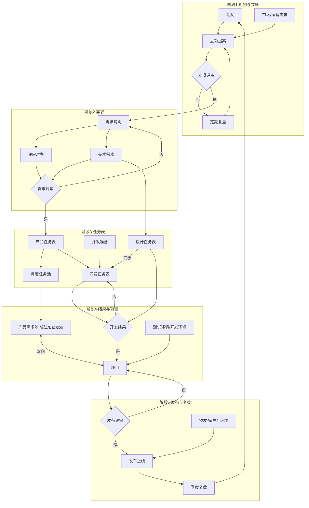

# PMO/BMO：流程管理与输出规范（概要版）

**用途**：`com.jachin.pmo.bmo` 插件在分析、检索、生成建议时，应与本文件中的**阶段划分、任务表关系、文档输出要求**对齐；与 [01_JACHIN_AI_PMO_SCHEME.md](./01_JACHIN_AI_PMO_SCHEME.md) 中的 Pipeline、MCP 能力配合使用。

---

## 1. 端到端流程（白板流程图文字化）

> **两版白板**：**§1.1～§1.5** 对应一版（调研起、冲刺节点、项目归档闭环）；**§1.6** 对应另一版（**期初** 起、**定期复盘 / 季度复盘**、**开发结果 / 发布评审** 等命名）。插件做环节对齐时可两版交叉对照。  
> 新版白板图源文件名：`whiteboard_exported_image-a8194549-1656-43d0-9fbc-4bc05353b496.png`（由对话上传保存于 Cursor 工作区 `assets/`；若需纳入仓库，可复制到本目录下如 `figures/pmo_flow_board_b.png` 并在本节嵌入图片）。

流程自左向右推进，末尾经「项目归档」回到「调研」，形成持续迭代闭环。

### 1.1 启动阶段

| 环节 | 说明 |
|------|------|
| **调研** | 流程起点。 |
| **立项提案** | 输入来自 **市场/运营需求**；进入 **立项评审**。 |
| **立项评审** | **否** → **拒绝/备案** → 回到 **调研**；**是** → 进入 **需求准备**。 |

### 1.2 规划与设计阶段

| 环节 | 说明 |
|------|------|
| **需求准备** | 立项通过后集中整理需求。 |
| **需求评审** | **否** → 回到 **需求准备** 修改；**是** → 并行进入 **开发准备** 与 **美术预排**。 |
| **开发准备** | 产出纳入 **开发任务表**。 |
| **美术预排** | 产出纳入 **设计任务表**。 |

### 1.3 执行与管理阶段

| 对象 | 关系 |
|------|------|
| **产品需求表** | 汇入 **月度需求池**。 |
| **开发任务表** | 与 **产品需求表** 以虚线关联：**开发进度实时追踪**。 |
| **设计任务表** | 与 **开发任务表** 以虚线关联：**同步**。 |
| **冲刺节点** | **月度需求池**、**开发任务表**、**设计任务表** 汇聚于此。 |

**冲刺节点（决策）**

- **否** → 回到 **月度需求池** 继续迭代。
- **是** → 进入 **提测**。

### 1.4 测试与反馈阶段

| 环节 | 说明 |
|------|------|
| **提测** | 与 **产品待办 Backlog** 有关联。 |
| **封测/调试反馈** → **预热/生产环境** | 下方反馈环：内部测试与预发/生产环境反馈，再汇入测试或发布相关环节。 |
| **验收评审** | **否** → 回到 **提测**；**是** → **发布总结**。 |

### 1.5 收尾与闭环

| 环节 | 说明 |
|------|------|
| **发布总结** | 发布后的归纳。 |
| **项目归档** | 正式收尾形态。 |
| **闭环** | **项目归档** → 回到 **调研**，表示下一轮改进或新项目。 |

### 1.6 白板流程（版本 B：期初 → 季度复盘）

以下按新版白板整理：图形符号上，**矩形**为过程，**平行四边形**为文档/任务表类产出，**菱形**为决策，**六边形**为环境，**燕尾形/五边形**为阶段收尾类节点；绿色平行四边形多为可追踪表（任务池/任务表/Backlog），黄色菱形为评审决策，紫色为环境与季度复盘。

#### 阶段 1：期初与立项

| 环节 | 说明 |
|------|------|
| **期初** | 流程起点（蓝色矩形）。 |
| **立项提案** | 平行四边形；与 **市场/运营需求** 共同构成输入。 |
| **立项评审**（菱形） | **否** → **定期复盘**（灰色矩形）→ 回到 **立项提案**；**是** → 进入 **需求说明**。 |

#### 阶段 2：需求与准备

| 环节 | 说明 |
|------|------|
| **需求说明** | 立项通过后整理需求说明。 |
| **评审准备**、**美术需求** | 由 **需求说明** 拆出两条并行准备线。 |
| **需求评审**（菱形） | **否** → 回到 **需求说明**；**是** → 生成 **产品任务表** 并进入任务池/排期链路。 |

#### 阶段 3：任务表与排期（绿色平行四边形为主）

| 对象 | 说明 |
|------|------|
| **产品任务表** | 需求评审通过后建立；通向 **月度任务池**。 |
| **月度任务池** | 承接产品任务表；与 **产品需求池（想法/Backlog）** 有汇入关系。 |
| **开发任务表** | 来自 **开发准备**；与 **产品任务表** 侧链路衔接；备注 **支持部门提供排期**。 |
| **设计任务表** | 来自 **美术需求**；**同步** 箭头指回 **开发任务表**（设计进度与开发对齐）。 |

#### 阶段 4：开发结果与项目集成

| 环节 | 说明 |
|------|------|
| **开发结果**（菱形） | 汇聚 **开发任务表**、**设计任务表** 的输出。**否** → 回到 **开发任务表**；**是** → **项目**。 |
| **项目** | 与 **产品需求池（想法/Backlog）** **双向**联动；并接入 **测试环境/开发环境**（紫色六边形）。 |
| **产品需求池（想法/Backlog）** | 除与 **项目** 双向外，还接收 **月度任务池** 的输入。 |

#### 阶段 5：发布与季度闭环

| 环节 | 说明 |
|------|------|
| **发布评审**（菱形） | **否** → 回到 **项目**；**是** → **发布上线**。 |
| **发布上线** | 承接通过发布评审的交付。 |
| **预发布/生产环境**（紫色六边形） | 汇入 **发布上线** 相关路径。 |
| **季度复盘**（紫色燕尾/五边形） | 上线后的周期复盘。 |
| **闭环** | **季度复盘** →（红色长箭头）→ 回到 **期初**，进入下一轮周期。 |

#### 主路径速览（与红色主线一致）

期初 → 立项提案 → 立项评审（是）→ 需求说明 → 需求评审（是）→ 产品任务表 → 开发任务表 → 开发结果（是）→ 项目 → 发布评审（是）→ 发布上线 → 季度复盘 → 期初。

---

## 2. 输出规范（概要版）

以下规范用于 **立项提案、PRD、任务表/需求池** 等产物的结构与质量要求；PMO 插件在摘要、对齐检查、缺口提示时应引用本节。

### 2.1 立项提案（产品）

| 要点 | 要求 |
|------|------|
| 市场调研 | 论据充分。 |
| 数据与指标 | 明确 **数据（目的）指标**。 |
| 需求说明 | **左文右图** 或 **左图右文**，便于评审快速理解。 |
| 计划说明 | **资源配置**、**成本预估**、**效果预估**。 |
| 讨论说明 | **在立项阶段完成讨论**，不要留到宣讲阶段再补。 |

### 2.2 需求文档（PRD）（产品 / 市场 / 运营）

| 要点 | 要求 |
|------|------|
| 直观材料 | **流程图**、**参考视频**、**配图**，能一眼感知场景与范围。 |
| 需求拆分与优先级 | 做好拆分与优先级；**排除「新游戏等完整大项目」**时，其余需求强调 **短平快**；**优先级动态更新**。 |
| 美术 | **美术需求先行**：提前参与立项，**明确业务目的**。 |
| 表达风格 | 需求 **简洁、精准**；**流程化展示**；**避免过多开放式选择**（减少歧义）。 |

### 2.3 产品任务表 / 需求池（产品 / PM）

| 要点 | 要求 |
|------|------|
| 日常维护 | 产品 **每日更新**：任务条目、**责任人**、**状态**、**优先级**、**进度**、**评审节点**、**上线节点**、**冲刺周期** 等。 |
| 层级结构 | 采用 **目录制**：**epic → story → task → task1**；大需求尽量拆细。 |
| 跨表追踪 | 支持部门给出排期后，**实时追踪进度**：对齐 **开发任务表**、**设计任务表**。 |

### 2.4 开发任务表 / 设计任务表（开发 / 美术）

| 要点 | 要求 |
|------|------|
| 及时更新 | 需求确认后 **及时更新**：冲刺周期、责任人、进度、完成节点等。 |
| 层级结构 | 与产品侧一致：**epic → story → task → task1**；大需求尽量拆细。 |
| 需求来源 | 开发/美术可在 **当月产品需求池** 中确认需求。 |
| 开发 ↔ 美术 | 开发可 **实时跟进** 美术进度 → **设计任务表**。 |

---

## 3. 与插件分析的对应关系（简要）

- **Pipeline A（知识库）**：PRD、立项材料、流程说明等应以本节 **§2** 为质量基线；同步至 `docs/pmo_bmo_plugin/synced/` / `corpus/` 后，检索与摘要应能对照 **§1（含 §1.6 版本 B）** 判断是否缺环节。
- **Pipeline B（效能监督）**：负荷、阻滞、调度、催办等应能关联 **产品任务表 / 开发任务表 / 设计任务表** 及 **冲刺节点**、**月度需求池 / 月度任务池**、**产品需求池（Backlog）** 等概念，与多维表字段映射时在 `02_MCP_DESIGN.md` 中扩展即可。

---

**版本**：概要 v2（§1.6 增补「期初—季度复盘」白板；§1.1–1.5 保留前一版图示；§2 输出规范不变）。
