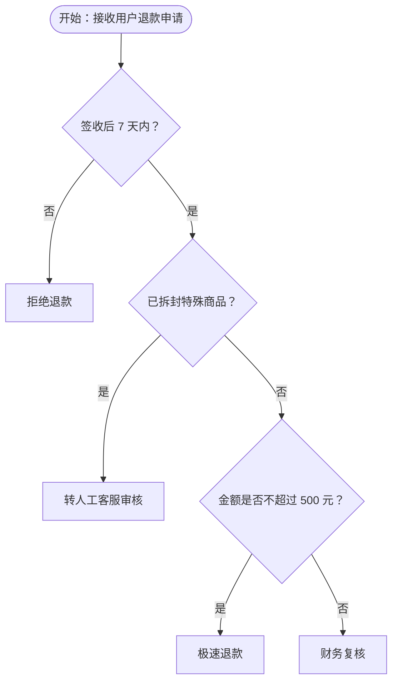

# 退款申请处理流程

以下流程图使用 **短标签** 以兼容 Mermaid 解析器；**不得**在节点文本中使用 `\"` 转义引号或 `&quot;`，多行说明请用下方表格或代码块补充。

## 流程图（Mermaid）



## 流程图说明（表格）

| 步骤 | 判断/操作 | 条件分支 |
|------|-----------|----------|
| 开始 | 接收用户退款申请 | - |
| 第 1 步 | 签收后 7 天内？ | 否 → 拒绝退款；是 → 继续 |
| 第 2 步 | 是否属于「已拆封不支持退货」类特殊商品？（如贴身衣物） | 是 → 转人工客服；否 → 继续 |
| 第 3 步 | 金额 ≤ 500 元？ | 是 → 极速退款；否 → 财务复核 |

## 业务规则（代码块备份）

若某环境仍无法渲染上图，可将下列逻辑当作与流程图等价的纯文本规则：

```
1. 时效：仅签收后 7 天内可申请。
2. 特殊商品：已拆封且属不支持退货类目 → 必须人工审核（不自动秒退）。
3. 金额：≤500 元可走极速退款；>500 元需财务复核。
```

## 常见 Mermaid 踩坑（本文件已规避）

- 节点文案中不要使用 HTML `<br/>` 与反斜杠转义引号 `\"`，易触发 `Parse error ... got 'STR'`。
- 需要多行说明时：图中用短句 + 箭头旁说明，或拆成多个节点；正文用表格/列表写全。
