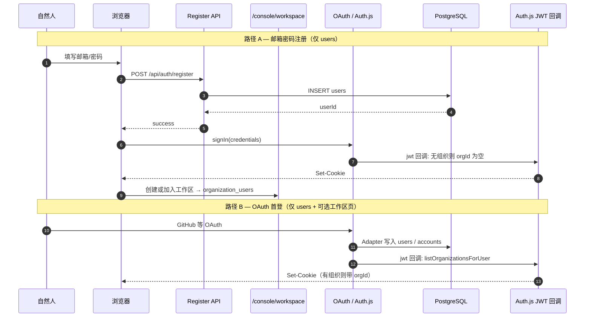
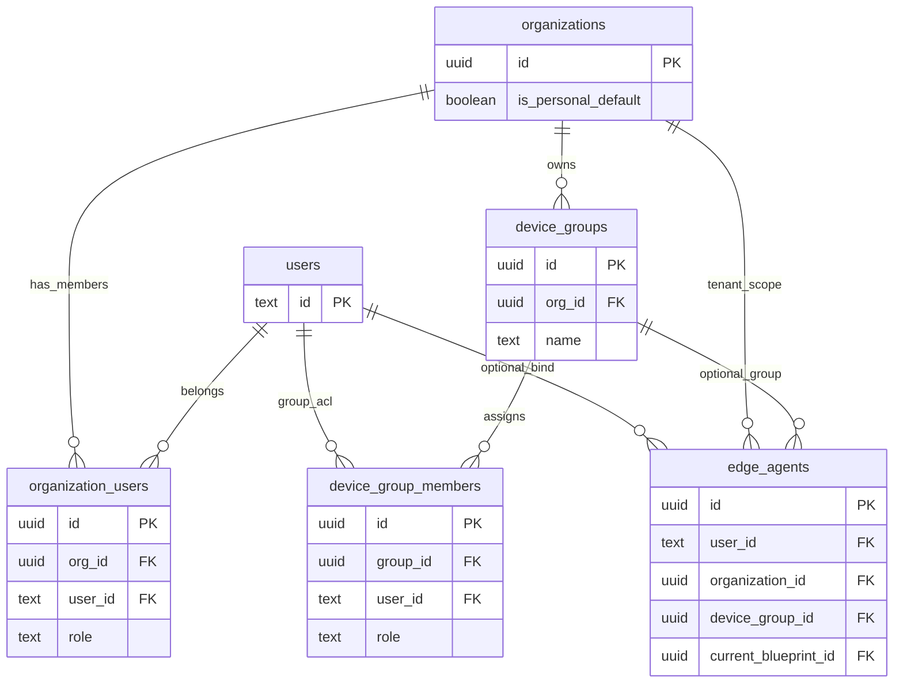
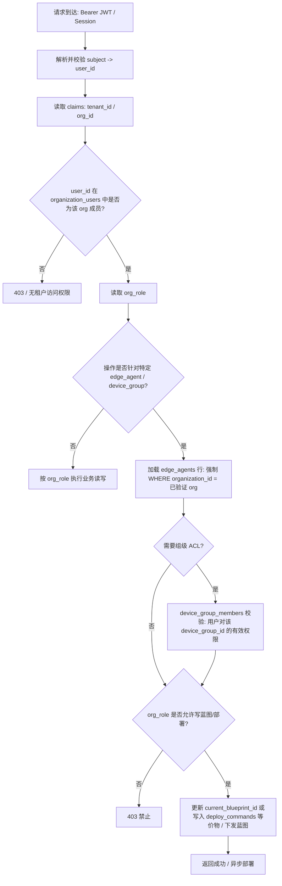

# 05 — Layer 1: Jachin Nexus (平台)

**文档类型**: 白皮书 · Layer 1 详细说明  
**版本**: V2.2（工作区显式 onboarding；与 **L2 网关 / L2↔L3** 边界以 [ARCHITECTURE_L1_WORKSPACE_L2_GATEWAY_L3.md](../ARCHITECTURE_L1_WORKSPACE_L2_GATEWAY_L3.md) 为准）  
**基准**: [ARCHITECTURE_V2_LAYER3_STANDALONE.md](../ARCHITECTURE_V2_LAYER3_STANDALONE.md) · Schema: [`cloud/nexus/src/db/schema.ts`](../../cloud/nexus/src/db/schema.ts)

---

## 〇·〇、 与现行实现对齐（必读）

自 **V2.2** 起，**注册不再自动创建组织**：`POST /api/auth/register` 仅写入 `users`；用户登录后在 **`/console/workspace`** **创建或加入**工作区后，会话 JWT 才有 `orgId`/`orgRole`。历史迁移数据仍可能含 `is_personal_default` 个人组织，**新用户路径**以架构文档为准。OAuth 与 Credentials **均不再**调用已删除的 `ensurePersonalWorkspace` 自动生根。

---

## 〇、 Platform First（平台优先原则）

**Layer 1 默认为官方托管的多租户 SaaS 平台。** 个人、家庭和企业用户开箱即用，只需在边缘端拉起 Layer 2/3 并连接到云端即可。

**私有化部署（Self-Hosted Layer 1）** 仅作为政企、金融等强合规场景的 fallback 方案。

---

## 〇·一、 划时代极简设计原则（Nexus 大一统）

以下四条为 Layer 1 **实现与文档**的共同约束（代码落点：`cloud/nexus` — Auth.js、`middleware.ts`、`auth.config.ts` / `auth.edge.ts`、`lib/tenant.ts`、`lib/with-org-role.ts`、`lib/org-invite.ts`、`app/api/v1/organizations/*`）。

1. **显式工作区 (Workspace Onboarding)**：注册 **仅** 创建 `users`。用户 **主动** 在控制台「工作区」**创建或加入**组织后，`organization_users` 写入角色；JWT 经 `listOrganizationsForUser` 注入 **`orgId` / `orgRole`**。与 L2 网关、L3 填表边界见 [ARCHITECTURE_L1_WORKSPACE_L2_GATEWAY_L3.md](../ARCHITECTURE_L1_WORKSPACE_L2_GATEWAY_L3.md)。
2. **无状态魔法加入 (Stateless Magic Join)**：不设邮件审批状态机表。`owner`/`admin` 通过 **`POST /api/v1/organizations/members/invite`** 签发短效签名 JWT；被邀请人已登录后 **`POST .../members/join`** 验签并 **INSERT `organization_users`**。切换当前工作区：**`POST .../active-org`**；枚举所属组织：**`GET .../list`**。
3. **防弹罩中间件 (Default Deny Middleware)**：除白名单（如 `/`、`/login`、`/auth/*`、`/api/auth/*`、全站 `/api/*` 放行由路由内自鉴权、对外 Webhook 等）外，页面级访问由 Auth.js **`authorized`** 强制会话。业务租户解析：**`extractTenantId` 仅信验签 JWT 内 `orgId`**；L2/机器流量使用显式 **`extractTenantIdAllowingMachineFallback`**。
4. **历史清洗与 SSOT (Total Sanitization)**：文档与代码只描述 **「租户 = `organizations.id`、归属 = `organization_users`」**；不在业务叙述中复活「用户表自带租户列」等已废止模型。

### 〇·一·1 注册与工作区闭环（时序）

---

## 一、 定位与哲学 (Positioning & Philosophy)

Layer 1 是 Jachin 系统的**平台**：用户主账号注册/登录，平台主账号管理平台内部。**与 L2/L3 无直接耦合**。

* **核心戒律：绝对不存储边缘节点的隐私记忆。** 用户的聊天记录、梦境反思、本地文件数据均隔离在 Layer 2 的 SQLite 中。
* **主要职责：** 资产确权（蓝图与插件）、设备状态监控（心跳呼吸灯）、跨网指令路由（IM 网关）、舰队级批量下发。
* **商业定位：** B 端企业的“航母指挥室”，C 端极客的“神经元商城”。

---

## 二、 核心模块全景 (Core Modules)

### 2.1 极简身份之门 (Jachin ID & Auth.js)
* **Auth.js 闭环**：Credentials + 可选 OAuth；注册 **仅** `users`；会话 **`orgId`/`orgRole`** 来自已加入的组织（见 §〇·〇、§〇·一）。
* **演进中能力**：Magic Link / Passkey / Web3 可作为补充登录方式；**当前实现**以 Credentials + JWT 会话为 SSOT，与 `middleware` Default Deny 一致。

### 2.2 舰队指挥大屏 (Fleet Management) - B端杀器
* **数字孪生拓扑**：实时监控全球各地物理设备（Edge Agents）的在线/离线状态、心跳延迟、当前运行的蓝图版本。
* **一键批量热更新**：管理员勾选目标节点（支持全选 / **按 `device_groups` 资源组**筛选），选择指定 AST 蓝图点击“批量下发”。底层修改 `current_blueprint_id`，边缘节点在 10 秒心跳内自动热重载，实现千台设备算力阵型的瞬间切换（**P2** 起组级 ACL 与控制台分组一致）。

### 2.3 造物厂 (The Forge) - 逻辑铸造中心
* **可视化编排**：基于 React Flow 打造的极客工作台。通过拖拽 `Trigger` (触发器)、`Processor` (ReAct 思考/WASI 沙箱) 和 `Action` (输出)。
* **AST 编译**：前端将连线逻辑一键编译为标准 AST JSON（抽象语法树），固化至 `blueprints` 表，成为边缘节点可执行的“岗位说明书”。

### 2.4 神经元商城与悬赏榜 (Market & Bounty Board)
* **JPP 生态大厅**：全球极客上传 `.wasm` 插件与 `plugin.json` 版税清单的集散地。
* **版税结算中心**：记录边缘节点对付费插件的调用次数，依据智能合约/平台账本为开发者进行 Crypto/法币的自动化分润。

---

## 三、 跨网通讯枢纽 (IM Gateway & Message Queue)

为了让内网深处的 Layer 2 能够随时随地响应手机端的指令，Layer 1 充当了完美的 NAT 穿透桥梁。

### 3.1 Universal Message Adapter (全渠道统一适配)

**划时代意义**：把所有 IM 渠道降维成统一的「感官输入流」。

- **统一格式**：Discord、Slack、WhatsApp、iMessage、飞书、钉钉等 Webhook 进入后，全部清洗成标准 **Jachin Message** 格式入队。
- **核心逻辑只写一次**：渠道无限扩展，无需为每个平台重写业务逻辑。
- **路由**：`/api/v1/webhooks/{platform}` → 解析 → 写入 `agent_message_queue`（见 schema）→ 下发（过渡期：心跳拉取；P0：WS 长连推送）。

### 3.2 跨网通信链路 (以 Telegram 为例)
1. **Webhook 捕获**：接收用户消息，解析 Chat ID，写入队列。
2. **任务下发**：Layer 2 拉取 `pending` 任务（过渡期：心跳；P0：WS 长连推送）。
3. **结果回传**：Layer 1 调用平台 API 将结果推回用户。

---

## 四、多租户与权限模型 (Organization-as-Tenant)

### 4.1 单一事实来源：租户 = 组织

在 **P1「组织即租户」** 之后，Layer 1 的隔离边界只有一套：**`organizations.id`** 即 API、JWT、以及 L2 桥接场景下 `X-Tenant-Id` 所表达的 `tenant_id`（UUID 字符串）。  
**业务侧**必须以 **Auth.js 验签 JWT** 中的 **`orgId`** 为当前租户上下文（见 §〇·一·3）；**禁止**从 `users` 表推断租户或「猜租户」做计费、配对或舰队写操作。**唯一合法**的成员关系来源是 **`organization_users`**（`org_id` + `user_id`）。

### 4.2 「个人账号」底层也是组织：为何放弃双轨制

早期设想常见两条路径：**企业 = organization**，**个人 = 无组织、字段挂在 user 上**。这会带来：

- 计费、许可证、舰队列表、RBAC 各写一套 `if (personal) … else …`；
- 边缘设备归属（`edge_agents`）难以与「租户」一词在数据模型上对齐；
- 跨租户 IDOR 风险：若仅凭「未挂靠 org」就放宽校验，容易在边界条件上出错。

**P1 设计哲学**：为每位尚未加入企业的用户自动注入一行 **「个人默认工作区」**——仍是 **`organizations`** 的一行，标记为 `is_personal_default = true`，并在 **`organization_users`** 中授予该用户 **`owner`**。  
这样对应用与控制台而言：**个人与企业在表结构上完全一致**，仅通过 `is_personal_default` 区分产品语义（例如展示文案），而**权限、审计、API 路径与多租户中间件保持单轨**。这就是「个人账号底层也是一个隐藏的组织」的含义：**不是**给用户看一个假组织，而是**在数据层消灭例外分支**。

### 4.3 组织级角色 `org_role`（`organization_users.role`）

在 **P2** 中，在原有 `owner` / `admin` / `member` 基础上扩展了舰队场景所需角色（以数据库枚举 `org_role` 为准）：

| 角色 | 含义（摘要） |
|------|----------------|
| `owner` | 组织所有者 |
| `admin` | 组织管理员 |
| `member` | 普通成员 |
| `fleet_admin` | 车队管理员：在本组织内管理设备组、边缘代理与分组策略（在实现中与控制台「舰队」能力对齐） |
| `viewer` | 只读成员：可查看组织下允许的舰队/设备信息，不可执行变更写操作 |

**控制台与 API** 必须在解析会话后，用 `organization_users` 解析 **「当前用户 × 当前 org」** 的有效角色，再决定是否允许写 `blueprints`、`edge_agents`、`device_groups` 等。

---

## 五、L2 舰队资源组 (Device Groups & Fleet ACL)

### 5.1 动机：从「整租 org 挂载设备」到「组级舰队」

**P1** 解决的是 **租户边界**；**P2** 解决的是 **同一租户内的细分授权**。  
仅将 `edge_agents` 挂在 `organization_id` 下，适合小型团队；当企业需要按 **站点 / 产线 / 区域** 分配管理员与蓝图时，需要 **`device_groups`**：组织下的逻辑分组，再通过 **`edge_agents.device_group_id`** 将设备归入组。

### 5.2 权限链路：`User → Org →（可选）Group → Edge Agent`

一次典型的 **控制台向边缘分发蓝图**（更新 `edge_agents.current_blueprint_id` 或等价部署指令）在权限上可理解为：

1. **用户身份**：Auth.js 会话 / JWT 确定 `user_id`。
2. **组织租户**：请求上下文中的 **`organization_id`（= `tenant_id`）** 必须与 **`organization_users`** 中该用户成员关系一致，否则直接拒绝（防跨租户 IDOR）。
3. **组织级角色**：`organization_users.role` 至少需具备执行该操作的权限（例如 `fleet_admin` / `admin` / `owner` 才能批量改设备；`viewer` 仅可读）。
4. **组级覆写（可选）**：若启用细粒度，**`device_group_members`** 在 **org 角色之下** 进一步约束：某用户仅可管理特定 `device_groups` 下的 `edge_agents`。有效权限视为 **`f(org_role, group_membership)`**，由应用层统一计算，不得只信其一。
5. **设备行级**：目标 **`edge_agents`** 行的 **`organization_id`** 必须等于当前租户；若设备已分 **`device_group_id`**，则还须校验调用者对该组的可见性或管理权。

上述链路即 **「User → Org/Group → Edge Agent」**：Org 是硬边界，Group 是租户内的 ACL 细粒度层。

### 5.3 核心表关系（ER 图）

下列实体关系与 `cloud/nexus/src/db/schema.ts` 一致；**`device_group_members`** 为 **用户与组之间的多对多**（带组内角色 `admin` / `viewer`）。

说明：**`edge_agents.organization_id`** 保留为顶层租户边界（与组内 `device_groups.org_id` 在一致赋值时应相同）；**`device_group_id`** 可空，表示尚未归入任何资源组。

### 5.4 鉴权流程：L3 请求调度 L2（示意）

下图描述 **边缘/终端（L3）代表用户发起对 L2 网关或经 L1 转发的调度请求** 时，在链路上应出现的 **校验顺序**（具体以实际 API 与部署为准；L1 控制台操作可省略 L3 节点，但 **org / group 校验逻辑同构**）。

**红线（与仓库根目录 `.cursorrules` 及 `organization_users` SSOT 一致）**：凡查询或变更 **`edge_agents`**，**必须**以请求中 **已验证的 `organization_id`** 为约束条件，防止跨租户 IDOR。

---

## 六、云端数据底座 (Drizzle Schema) — 摘要

Layer 1 的核心表结构见 `cloud/nexus/src/db/schema.ts`（PostgreSQL + Drizzle）。**P1/P2 之后与本文强相关的实体包括**：

* **`organizations`**：`id`, `name`, `billing_plan`, **`is_personal_default`**（个人默认工作区标记）。
* **`organization_users`**：`(org_id, user_id)` 唯一；**`role`** 为枚举 **`org_role`**（含 `fleet_admin`, `viewer` 等）。
* **`device_groups`**：`(org_id, name)` 组织内资源组；**`org_id` → organizations**。
* **`device_group_members`**：用户在某组内的 **`admin` / `viewer`**；**在 org 角色之下的细粒度覆写**。
* **`edge_agents`**：**`organization_id`**（租户边界）；**`device_group_id` → device_groups**（可空）；**`current_blueprint_id` → blueprints**；配对码、心跳、`im_*` 等。
* **`blueprints`**：AST JSON；可按 **`organization_id`** 归属组织资产。
* **`transactions`** 等：数字资产交易，仍带 **`organization_id`** 以对齐租户。
* **消息**：实现上为 **`agent_message_queue`** 等（见 schema 全文）；商城商品为 **`plugins_registry`** 等。

完整字段、索引与关系以代码为准。

---

## 七、v8.0 废弃声明 (Deprecation in v8.0)

1. **废弃复杂的私有化身份认证系统**：不再自行维护复杂的 JWT 签发与密码哈希，全面托付给 Auth.js。
2. **废弃 Dapr Pub/Sub 中继**：在广域网（WAN）环境下，Pub/Sub 的穿透与稳定性维护成本极高，现已全面替换为**Jachin Mesh (WebSocket 优先) + HTTP 心跳兜底**。未来将演进为控制面/数据面分离（WS 长连推送、mDNS/P2P 直连），详见 [10_CONTROL_DATA_PLANE.md](./10_CONTROL_DATA_PLANE.md)。

---

## 八、去 BaaS 化 (De-BaaSification) — P0 已落地

Layer 1 去 BaaS 化已完成：Drizzle ORM + Auth.js Schema，`src/db/schema.ts` 定义 users/accounts/sessions、organizations、organization_users、**device_groups**、**device_group_members**、edge_agents、blueprints、transactions 等。使用 PostgreSQL + Drizzle，无第三方 BaaS 依赖。详见 [09_DE_BAASIFICATION.md](./09_DE_BAASIFICATION.md)。

规划中的后续阶段：

- **Auth**：Auth.js **会话闭环、生根与组织 API 已实装**（见 §〇·一）；Schema 与 Drizzle Adapter 已就绪
- **ORM**：Drizzle ORM（已就绪）
- **队列**：数据库轮询 → Redis Streams/Pub/Sub
- **存储**：MinIO (S3 兼容) 或 IPFS
- **交付**：Helm Chart 一键部署，客户私有集群 100% 数据主权

详见 [09_DE_BAASIFICATION.md](./09_DE_BAASIFICATION.md)。