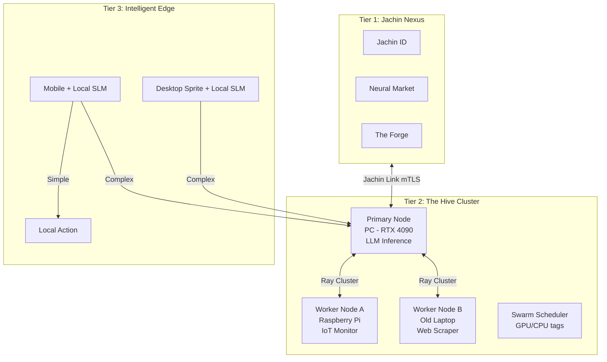
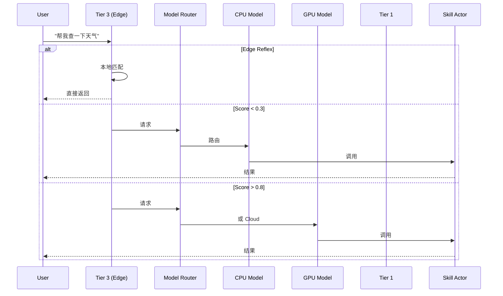

# Jachin-System v4.0 白皮书
## 蜂群智能与边缘算力网络 (Swarm Intelligence)

**版本**: v4.0 (Swarm & Edge)  
**状态**: 架构升级  
**规范引用**: [ARCHITECTURE_DESIGN_SPEC.md](./ARCHITECTURE_DESIGN_SPEC.md)（正式架构规范 v1.0，Layer = Tier）

---

## 1. 执行摘要 (Executive Summary)

Jachin-System v4.0 在 v3.2 基础上演进为**蜂群智能 (Swarm Intelligence)**：Tier 2 不再是一台机器，而是由家庭/办公室中多台设备组成的算力网络。PC 为大脑，树莓派为手脚，旧笔记本跑爬虫，实现真正的分布式协作。

---

## 2. 核心设计哲学 (Design Philosophy)

* **三位一体 (The Trinity)**: 云端分发 (Market) + 蜂巢算力 (Hive) + 灵动终端 (Terminal)。对应规范 Layer 1/2/3。
* **蜂群协作**: Master-Worker 架构，多节点组成 Ray Cluster，按能力标签分配任务。对应规范 §3.3 Distributed Cluster。
* **大小脑协同**: 简单任务走 CPU 小模型，复杂任务走 GPU 大模型，极难任务走云端。
* **信任域隔离**: 家庭/办公室/公共网络分区，ACL 控制技能与资源访问。

---

## 3. 三层架构与混合编排

### 3.1 Tier 1: Jachin Nexus (灵界枢纽) — 智慧分发

> **设计哲学**：Layer 1 绝不能做成传统「SaaS 后台」或「Web2.0 商城」。它应是**轻量化、协议化、去中心化**的**智慧分发枢纽**。详见 [LAYER1_ARCHITECTURE_AND_DESIGN.md](./LAYER1_ARCHITECTURE_AND_DESIGN.md)。

* **核心原则**：
  - **轻量化**：不存储用户数据，只存储代码、模型权重、配置清单（像 GitHub，不像 iCloud）。
  - **协议至上**：JMP (Jachin Module Protocol) 标准制定者与分发者。
  - **可视化**：抛弃列表，拥抱 3D 神经元网络形态的技能树。

* **核心模块**：
  - **Neural Market (神经元商城)**：3D 技能树，节点为 Skill/Persona/Memory，可组合预览。
  - **The Forge (铸造厂)**：Agent Builder、模拟沙箱，开发者在线编排与发布。
  - **The Agora (广场)**：Agent 展示、Bounty Board 悬赏榜。
  - **Jachin ID & Console**：舰队视图、隐私审计（强调「0 次向云端上传」）。

* **技术栈**：Next.js 14 + Three.js / React Three Fiber + Tailwind + Supabase / Golang + IPFS + Passkey / Web3。

### 3.2 Tier 2: Jachin Hive (The Core) — 蜂群架构

* **Master-Worker 节点架构**:
  - **Primary Node (大脑)**: 高性能 PC（如 RTX 4090），负责 LLM 推理、Orchestrator、PluginManager。
  - **Worker Node A (手脚)**: 树莓派，IoT 监控、传感器数据采集。
  - **Worker Node B**: 旧笔记本，Web 爬虫、文件整理等 CPU 任务。
  - 通过 Ray Cluster Protocol 互联，Swarm Scheduler 按 `compute` 标签分配任务。

* **核心目录**:
  - `core/swarm/`: 节点注册、分布式调度、健康监控。
  - `core/security/`: ACL、信任域隔离。
  - `core/brain/`: ReAct、LLM 路由、技能 Actor。

### 3.3 Tier 3: Intelligent Edge

* **边缘反射 (Edge Reflex)**: 极简指令（音量调大、开灯）本地处理，不转发 Tier 2。
* **复杂意图**: 转发 Primary Node，经 Model Router 分流。
* **Edge L1 记忆缓存 (可选)**: 高性能终端（PC/Mac）可启用本地嵌入式向量库（LanceDB），同步本机高频记忆，实现零延迟离线问答；弱设备（ESP32、树莓派 Zero）保持瘦客户端，依赖 Tier 2。详见 [RAG_ARCHITECTURE.md](./RAG_ARCHITECTURE.md)。

### 3.4 Big-Little Brain 路由机制

| 复杂度 Score | 路由目标 | 示例 |
|-------------|---------|------|
| < 0.3 | SmallModel (CPU) | 查天气、记提醒 |
| 0.3 ~ 0.8 | BigModel (GPU) | 对话、代码生成 |
| > 0.8 | CloudModel (API) | 4K 图生成、超长分析 |

### 3.5 Trust Zones (信任域) 安全模型

| 信任域 | 说明 | 跨域访问 |
|--------|------|----------|
| HOME | 家庭网络 | 默认禁止 |
| OFFICE | 办公室网络 | 默认禁止 |
| PUBLIC | 公共/访客 | 受限 |

* **SecurityContext**: 每次 Skill 执行传入 `current_zone`, `current_user`, `device_id`。
* **zone_restricted**: manifest 中可声明 `zone_restricted: HOME`，非家庭网络拒绝执行。

---

## 4.0 Swarm Intelligence（蜂群智能）

### 4.0.1 全局蜂群拓扑



### 4.0.2 大小脑路由逻辑



### 4.0.3 信任域与 ACL

* **core/security/trust_zone.py**: TrustZone 枚举，跨域策略。
* **core/security/acl_manager.py**: 按 UserRole 控制技能访问。
* **BaseSkillActor**: 执行前检查 `zone_restricted`，不匹配则 `AccessDenied`。

---

## 4.1 第四章：RAG 架构的深度定制 (The Memory Pipeline)

Jachin 的记忆系统采用**有机记忆流动管线**，详见 [RAG_ARCHITECTURE.md](./RAG_ARCHITECTURE.md)。核心要点：

| 机制 | 说明 |
|------|------|
| **动态语义切块** | 按语义边界切分，非按字数一刀切 |
| **记忆分层** | 短期 (Redis) → 梦境沉淀 → 长期 (Qdrant) |
| **时效衰减** | 检索时引入时间权重惩罚 |
| **Core Memory** | `is_core=True` 铂金标签，永不覆写、绝对召回 |
| **Edge L1 缓存** | 高性能终端可启用本地向量库，零延迟离线反射 |

---

## 5. 项目文件结构 (v4.0)

```text
jachin-system/
├── common/
│   ├── protocols/
│   │   ├── jachin_link.proto
│   │   └── swarm_discovery.proto   # 节点自发现
│   └── schemas/
│       ├── auth.py                # TrustZone, UserRole
│       └── resources.py           # GPU/NPU 资源标签
│
├── core/
│   ├── brain/                     # 智能层
│   │   ├── agent_orchestrator.py
│   │   ├── llm_engine/            # 模型路由
│   │   │   └── router.py
│   │   └── ray_actors/            # 或 core/skills/
│   ├── swarm/                     # 集群层
│   │   ├── node_registry.py
│   │   ├── scheduler.py
│   │   └── health_monitor.py
│   ├── security/                  # 安全层
│   │   ├── acl_manager.py
│   │   └── trust_zone.py
│   └── system/
│       └── plugin_manager.py
│
├── skills_repo/
│   ├── _bundled/                  # 系统预装（兼容）
│   ├── drivers/                   # 硬件驱动 (IoT)
│   └── apps/                      # 纯软件应用
│
└── clients/lib/
    └── edge_brain/                # Tier 3 边缘智能
```

---

## 6. 与规范对齐说明

v4.0 在 [ARCHITECTURE_DESIGN_SPEC.md](./ARCHITECTURE_DESIGN_SPEC.md) 基础上扩展：

| 规范机制 | v4.0 扩展 |
|----------|-----------|
| §3.1 Hybrid Lifecycle | 当前实现以 Ray Actor 为主，Ephemeral/Cached/Resident 待完善 |
| §3.2 Intelligent Caching | Assets/Logic 分离、LRU 清理待实现 |
| §3.3 Topology | Super Node 已支持；Distributed Cluster 通过 Ray + mDNS 实现 |
| §4.2 Cross-Device | Redis 全局状态，Dapr Pub/Sub 跨设备同步 |

---

## 7. 迁移指南 (v3.2 -> v4.0)

1. **新增**: `core/swarm/`, `core/security/`, `skills_repo/drivers/`, `skills_repo/apps/`。
2. **可选**: `core/brain/ray_actors/` 重命名为 `core/skills/`，更新导入。
3. **技能迁移**: 系统监控类 → `drivers/`，应用类 → `apps/`。
4. **安全**: 在 BaseSkillActor 增加 zone 检查拦截器。

---

**相关文档**: [architecture.md](./architecture.md) | [ARCHITECTURE_DESIGN_SPEC.md](./ARCHITECTURE_DESIGN_SPEC.md) | [RAG_ARCHITECTURE.md](./RAG_ARCHITECTURE.md) | [LAYER1_ARCHITECTURE_AND_DESIGN.md](./LAYER1_ARCHITECTURE_AND_DESIGN.md)
